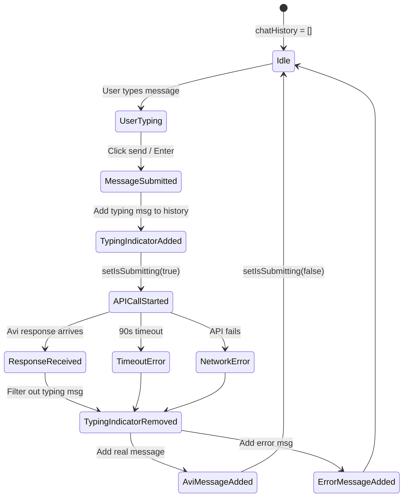
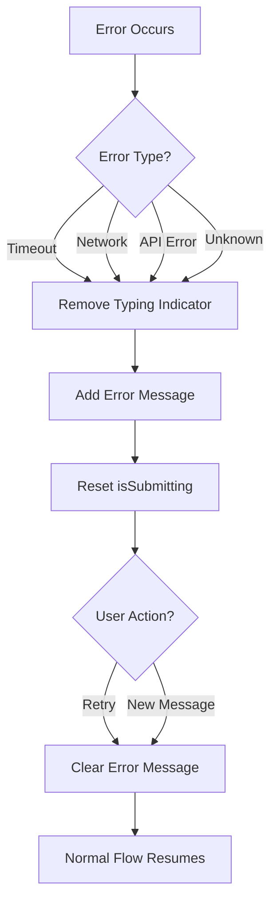

# Avi Typing Animation Chat Integration Architecture

## Executive Summary

This document defines the architecture for integrating the Avi typing animation directly into the chat message history, replacing the current absolute positioning approach with a natural, inline message flow.

**Current State**: Typing indicator floats above input with absolute positioning
**Target State**: Typing indicator appears as temporary message in chat history
**Benefit**: Natural UX where animation pushes existing messages up like real chat apps

---

## 1. State Management Architecture

### 1.1 Enhanced Chat Message Type

```typescript
// Location: /workspaces/agent-feed/frontend/src/components/EnhancedPostingInterface.tsx

interface ChatMessage {
  id: string;
  content: string;
  sender: 'user' | 'avi' | 'typing';  // ADDED: 'typing' type
  timestamp: Date;
  isTypingIndicator?: boolean;        // ADDED: Flag for typing messages
}

// Updated state type
const [chatHistory, setChatHistory] = useState<Array<ChatMessage>>([]);
```

**Design Decision**: Use discriminated union with `sender: 'typing'` as primary identifier
- Simple type checking: `msg.sender === 'typing'`
- No need for optional fields in most message types
- Clear intent in code

### 1.2 State Transitions



### 1.3 State Flow Implementation

```typescript
// STEP 1: User submits message
const handleSubmit = async (e: React.FormEvent) => {
  e.preventDefault();
  if (!message.trim() || isSubmitting) return;

  const userMessage: ChatMessage = {
    id: Date.now().toString(),
    content: message.trim(),
    sender: 'user',
    timestamp: new Date(),
  };

  // Add user message
  setChatHistory(prev => [...prev, userMessage]);
  setMessage('');

  // STEP 2: Add typing indicator IMMEDIATELY
  const typingIndicator: ChatMessage = {
    id: 'typing-indicator',  // Fixed ID for easy removal
    content: '',              // No text content
    sender: 'typing',
    timestamp: new Date(),
    isTypingIndicator: true,
  };

  setChatHistory(prev => [...prev, typingIndicator]);
  setIsSubmitting(true);

  try {
    // STEP 3: API call
    const aviResponseContent = await callAviClaudeCode(userMessage.content);

    // STEP 4: Remove typing indicator & add real message ATOMICALLY
    const aviResponse: ChatMessage = {
      id: (Date.now() + 1).toString(),
      content: aviResponseContent,
      sender: 'avi',
      timestamp: new Date(),
    };

    setChatHistory(prev => {
      // Filter out typing indicator and add real message in one update
      const withoutTyping = prev.filter(msg => msg.id !== 'typing-indicator');
      return [...withoutTyping, aviResponse];
    });

  } catch (error) {
    // STEP 5: Remove typing indicator & add error message
    const errorResponse: ChatMessage = {
      id: (Date.now() + 1).toString(),
      content: `I encountered an error: ${error.message}. Please try again.`,
      sender: 'avi',
      timestamp: new Date(),
    };

    setChatHistory(prev => {
      const withoutTyping = prev.filter(msg => msg.id !== 'typing-indicator');
      return [...withoutTyping, errorResponse];
    });
  } finally {
    setIsSubmitting(false);
  }
};
```

**Key Principles**:
1. **Single ID**: Use fixed `'typing-indicator'` ID for easy filtering
2. **Atomic Updates**: Remove typing + add message in single `setChatHistory` call
3. **No Race Conditions**: Filter by ID, not by sender type (prevents removing multiple typing messages)
4. **Cleanup Guaranteed**: `finally` block ensures `isSubmitting` reset

---

## 2. Component Structure Architecture

### 2.1 Message Rendering Strategy

```typescript
// Location: /workspaces/agent-feed/frontend/src/components/EnhancedPostingInterface.tsx

// OPTION A: Inline conditional rendering (RECOMMENDED)
<div className="space-y-3">
  {chatHistory.map((msg) => {
    // Special case: Typing indicator
    if (msg.sender === 'typing') {
      return (
        <div
          key={msg.id}
          className="p-3 rounded-lg max-w-xs bg-white"
        >
          <AviTypingIndicator isVisible={true} />
        </div>
      );
    }

    // Regular messages
    return (
      <div key={msg.id} className={cn(
        'p-3 rounded-lg max-w-xs',
        msg.sender === 'user'
          ? 'bg-blue-100 text-blue-900 ml-auto'
          : 'bg-white text-gray-900'
      )}>
        <p className="text-sm">{msg.content}</p>
        <p className="text-xs text-gray-500 mt-1">
          {msg.timestamp.toLocaleTimeString()}
        </p>
      </div>
    );
  })}
</div>

// OPTION B: Separate component (Over-engineered for this use case)
// Not recommended - adds unnecessary abstraction
```

**Design Decision**: Option A (Inline conditional)
- **Pros**:
  - Simple, clear logic
  - Easy to maintain
  - No prop drilling
  - Same styling applied consistently
- **Cons**:
  - Slightly longer render function
  - Mixed concerns (acceptable for this small component)

### 2.2 AviTypingIndicator Component Modifications

```typescript
// Location: /workspaces/agent-feed/frontend/src/components/AviTypingIndicator.tsx

// BEFORE: Absolute positioning with "is typing..." text
const AviTypingIndicator: React.FC<AviTypingIndicatorProps> = ({ isVisible }) => {
  return (
    <div style={{ position: 'absolute', bottom: '100%', ... }}>
      <span>{currentFrame}</span>
      <span>is typing...</span>  // REMOVE THIS
    </div>
  );
};

// AFTER: Inline positioning, animation only
const AviTypingIndicator: React.FC<AviTypingIndicatorProps> = ({
  isVisible,
  inline = false  // NEW: Support both modes during transition
}) => {
  if (!isVisible) return null;

  const containerStyle = inline
    ? {
        // Inline mode: No absolute positioning
        display: 'flex',
        alignItems: 'center',
        justifyContent: 'center',
        padding: '12px',
      }
    : {
        // Legacy mode: Keep absolute positioning for other uses
        position: 'absolute',
        bottom: '100%',
        left: '0',
        marginBottom: '8px',
        // ... existing styles
      };

  return (
    <div style={containerStyle} role="status" aria-label="Avi is typing">
      <span
        style={{
          fontFamily: 'monospace',
          fontSize: '1.1rem',
          fontWeight: 'bold',
          letterSpacing: '0.15em',
          color: currentColor,
          textShadow: `0 0 2px rgba(255, 255, 255, 0.8), 0 0 4px ${currentColor}40`,
        }}
      >
        {currentFrame}
      </span>
      {/* REMOVED: "is typing..." text - implicit in animation context */}
    </div>
  );
};
```

**Design Decision**: Remove "is typing..." text
- Animation appears in Avi's message bubble (context is clear)
- User message → Avi bubble with animation → Real response
- No ambiguity about what's happening

### 2.3 Message Bubble Styling Consistency

```typescript
// Unified message bubble styles
const getMessageBubbleStyles = (sender: ChatMessage['sender']) => {
  switch (sender) {
    case 'user':
      return 'bg-blue-100 text-blue-900 ml-auto';

    case 'avi':
      return 'bg-white text-gray-900 border border-gray-200';

    case 'typing':
      // IMPORTANT: Match Avi's bubble style exactly
      return 'bg-white text-gray-900 border border-gray-200';

    default:
      return 'bg-gray-100 text-gray-900';
  }
};

// Usage in render
<div className={cn(
  'p-3 rounded-lg max-w-xs transition-all duration-200',
  getMessageBubbleStyles(msg.sender),
  msg.sender === 'typing' && 'animate-fade-in'  // Smooth entrance
)}>
  {/* Content */}
</div>
```

---

## 3. Scroll Behavior Architecture

### 3.1 Auto-Scroll Strategy

```typescript
// Location: /workspaces/agent-feed/frontend/src/components/EnhancedPostingInterface.tsx

const chatContainerRef = useRef<HTMLDivElement>(null);
const isUserScrolledUp = useRef(false);

// Detect user scroll behavior
const handleScroll = (e: React.UIEvent<HTMLDivElement>) => {
  const element = e.currentTarget;
  const scrolledToBottom =
    element.scrollHeight - element.scrollTop === element.clientHeight;

  // User has scrolled up if not at bottom
  isUserScrolledUp.current = !scrolledToBottom;
};

// Auto-scroll effect
useEffect(() => {
  if (chatHistory.length === 0) return;

  const lastMessage = chatHistory[chatHistory.length - 1];
  const shouldAutoScroll =
    !isUserScrolledUp.current ||           // User is at bottom
    lastMessage.sender === 'user' ||       // Always scroll for user messages
    lastMessage.sender === 'typing';       // Always scroll for typing indicator

  if (shouldAutoScroll && chatContainerRef.current) {
    chatContainerRef.current.scrollTo({
      top: chatContainerRef.current.scrollHeight,
      behavior: 'smooth'
    });
  }
}, [chatHistory]);

// Render
<div
  ref={chatContainerRef}
  onScroll={handleScroll}
  className="h-64 border border-gray-200 rounded-lg p-4 overflow-y-auto bg-gray-50"
>
  {/* Chat messages */}
</div>
```

### 3.2 Scroll Behavior Decision Matrix

| Condition | Auto-Scroll? | Reasoning |
|-----------|--------------|-----------|
| User at bottom, new user message | ✅ Yes | Natural flow - user sent it |
| User at bottom, typing indicator appears | ✅ Yes | User expects to see response |
| User at bottom, Avi response arrives | ✅ Yes | Continuation of conversation |
| User scrolled up, new user message | ✅ Yes | User just sent it - override scroll lock |
| User scrolled up, typing indicator | ✅ Yes | User just triggered it |
| User scrolled up, Avi response | ❌ No | Don't interrupt reading history |

**Edge Case Handling**:
```typescript
// If user scrolls up DURING typing animation
useEffect(() => {
  const typingMessage = chatHistory.find(msg => msg.sender === 'typing');

  if (typingMessage && isUserScrolledUp.current) {
    // Option 1: Sticky notification (RECOMMENDED)
    // Show "New message" badge at bottom

    // Option 2: Force scroll (AGGRESSIVE)
    // Force scroll anyway - user triggered this action

    // Option 3: Do nothing (PASSIVE)
    // Wait until user scrolls back down
  }
}, [chatHistory]);
```

**Recommended**: Option 1 (Sticky notification)
- Less jarring
- Respects user agency
- Common pattern in chat apps

---

## 4. Error Handling Architecture

### 4.1 Error Scenarios & Cleanup

```typescript
// Scenario 1: API Timeout (90s)
try {
  const response = await callAviClaudeCode(message);
  // Success path...
} catch (error) {
  if (error.name === 'AbortError') {
    // Timeout occurred
    setChatHistory(prev => {
      const withoutTyping = prev.filter(msg => msg.id !== 'typing-indicator');
      return [...withoutTyping, {
        id: Date.now().toString(),
        content: 'Request timeout - Λvi is taking longer than expected. Please try again.',
        sender: 'avi',
        timestamp: new Date(),
      }];
    });
  }
}

// Scenario 2: Network Error
catch (error) {
  if (error.message.includes('Failed to fetch')) {
    setChatHistory(prev => {
      const withoutTyping = prev.filter(msg => msg.id !== 'typing-indicator');
      return [...withoutTyping, {
        id: Date.now().toString(),
        content: 'Network error - Please check your connection and try again.',
        sender: 'avi',
        timestamp: new Date(),
      }];
    });
  }
}

// Scenario 3: Component Unmount (User navigates away)
useEffect(() => {
  return () => {
    // Cleanup: Remove typing indicator if component unmounts
    setChatHistory(prev =>
      prev.filter(msg => msg.id !== 'typing-indicator')
    );
  };
}, []);
```

### 4.2 Duplicate Prevention

```typescript
// Prevent multiple typing indicators
const handleSubmit = async (e: React.FormEvent) => {
  e.preventDefault();

  // Guard: Prevent submission if already submitting
  if (isSubmitting) {
    console.warn('Already submitting - ignoring duplicate submit');
    return;
  }

  // Guard: Check for existing typing indicator (defensive)
  const hasTypingIndicator = chatHistory.some(
    msg => msg.sender === 'typing'
  );

  if (hasTypingIndicator) {
    console.error('Typing indicator already exists - cleaning up');
    setChatHistory(prev =>
      prev.filter(msg => msg.id !== 'typing-indicator')
    );
  }

  // Proceed with submission...
};
```

### 4.3 Error Recovery Flow



---

## 5. Styling Integration Architecture

### 5.1 Visual Hierarchy

```css
/* Location: /workspaces/agent-feed/frontend/src/styles/chat.css */

.chat-message-bubble {
  padding: 12px 16px;
  border-radius: 12px;
  max-width: 70%;
  transition: all 0.2s ease-in-out;
}

.chat-message-user {
  background: linear-gradient(135deg, #3b82f6 0%, #2563eb 100%);
  color: white;
  margin-left: auto;
  box-shadow: 0 2px 4px rgba(59, 130, 246, 0.2);
}

.chat-message-avi {
  background: white;
  border: 1px solid #e5e7eb;
  color: #111827;
  box-shadow: 0 1px 3px rgba(0, 0, 0, 0.1);
}

.chat-message-typing {
  /* CRITICAL: Match Avi message bubble exactly */
  background: white;
  border: 1px solid #e5e7eb;
  box-shadow: 0 1px 3px rgba(0, 0, 0, 0.1);

  /* Additional styling for typing state */
  min-height: 60px;  /* Prevent layout shift */
  display: flex;
  align-items: center;
  justify-content: center;
}

/* Entrance animation */
@keyframes fadeInUp {
  from {
    opacity: 0;
    transform: translateY(10px);
  }
  to {
    opacity: 1;
    transform: translateY(0);
  }
}

.chat-message-typing {
  animation: fadeInUp 0.3s ease-out;
}
```

### 5.2 Responsive Design

```typescript
// Bubble size adjustments
const getMessageMaxWidth = (sender: ChatMessage['sender']) => {
  switch (sender) {
    case 'user':
      return 'max-w-xs md:max-w-sm';  // 20rem - 24rem
    case 'avi':
      return 'max-w-sm md:max-w-md';  // 24rem - 28rem
    case 'typing':
      return 'max-w-[200px]';          // Fixed width for animation
    default:
      return 'max-w-xs';
  }
};
```

### 5.3 Accessibility

```typescript
// ARIA labels and roles
<div
  className="chat-message-typing"
  role="status"
  aria-live="polite"
  aria-label="Avi is composing a response"
>
  <AviTypingIndicator isVisible={true} inline={true} />
</div>

// Screen reader announcement
useEffect(() => {
  const typingMessage = chatHistory.find(msg => msg.sender === 'typing');

  if (typingMessage) {
    // Announce to screen readers
    const announcement = document.createElement('div');
    announcement.setAttribute('role', 'status');
    announcement.setAttribute('aria-live', 'polite');
    announcement.className = 'sr-only';
    announcement.textContent = 'Avi is typing a response';
    document.body.appendChild(announcement);

    // Cleanup
    setTimeout(() => document.body.removeChild(announcement), 1000);
  }
}, [chatHistory]);
```

---

## 6. Implementation Plan

### 6.1 File Changes Required

| File | Changes | Priority |
|------|---------|----------|
| `EnhancedPostingInterface.tsx` | Update ChatMessage type, modify handleSubmit, add typing message logic | P0 |
| `AviTypingIndicator.tsx` | Add inline prop, remove "is typing..." text, adjust positioning | P0 |
| `EnhancedPostingInterface.tsx` | Add scroll logic with useRef and useEffect | P1 |
| `EnhancedPostingInterface.tsx` | Add error cleanup in catch blocks | P1 |
| `chat.css` (new file) | Add styling for typing bubble | P2 |

### 6.2 Migration Strategy

**Phase 1: Core Integration (P0)**
```typescript
// Step 1: Update type definition
interface ChatMessage {
  id: string;
  content: string;
  sender: 'user' | 'avi' | 'typing';
  timestamp: Date;
  isTypingIndicator?: boolean;
}

// Step 2: Modify handleSubmit to add typing message
// Step 3: Update render logic to handle typing messages
// Step 4: Update AviTypingIndicator for inline mode
```

**Phase 2: Enhanced UX (P1)**
```typescript
// Step 5: Add scroll behavior
// Step 6: Add error cleanup
// Step 7: Test edge cases
```

**Phase 3: Polish (P2)**
```typescript
// Step 8: Add animations
// Step 9: Add accessibility features
// Step 10: Performance optimization
```

### 6.3 Testing Checklist

- [ ] Typing indicator appears immediately on submit
- [ ] Typing indicator has correct styling (matches Avi bubble)
- [ ] Typing indicator is removed on success
- [ ] Typing indicator is removed on error
- [ ] Typing indicator is removed on timeout
- [ ] No duplicate typing indicators can exist
- [ ] Auto-scroll works when user at bottom
- [ ] Auto-scroll respects user scroll-up
- [ ] Animation plays smoothly in chat bubble
- [ ] No layout shift when typing appears/disappears
- [ ] Accessible to screen readers
- [ ] Works on mobile viewport
- [ ] Handles rapid submit clicks gracefully

---

## 7. Code Snippets

### 7.1 Complete handleSubmit Implementation

```typescript
const handleSubmit = async (e: React.FormEvent) => {
  e.preventDefault();
  if (!message.trim() || isSubmitting) return;

  // Create user message
  const userMessage: ChatMessage = {
    id: Date.now().toString(),
    content: message.trim(),
    sender: 'user',
    timestamp: new Date(),
  };

  // Add user message to history
  setChatHistory(prev => [...prev, userMessage]);
  setMessage('');

  // Create and add typing indicator
  const typingIndicator: ChatMessage = {
    id: 'typing-indicator',
    content: '',
    sender: 'typing',
    timestamp: new Date(),
    isTypingIndicator: true,
  };

  setChatHistory(prev => [...prev, typingIndicator]);
  setIsSubmitting(true);

  try {
    // API call
    const aviResponseContent = await callAviClaudeCode(userMessage.content);

    // Atomic update: Remove typing, add response
    const aviResponse: ChatMessage = {
      id: (Date.now() + 1).toString(),
      content: aviResponseContent,
      sender: 'avi',
      timestamp: new Date(),
    };

    setChatHistory(prev => {
      const withoutTyping = prev.filter(msg => msg.id !== 'typing-indicator');
      return [...withoutTyping, aviResponse];
    });

    onMessageSent?.(userMessage);
  } catch (error) {
    console.error('Failed to get Avi response:', error);

    const errorMessage = error instanceof Error ? error.message : 'Unknown error occurred';
    const errorResponse: ChatMessage = {
      id: (Date.now() + 1).toString(),
      content: `I encountered an error: ${errorMessage}. Please try again.`,
      sender: 'avi',
      timestamp: new Date(),
    };

    setChatHistory(prev => {
      const withoutTyping = prev.filter(msg => msg.id !== 'typing-indicator');
      return [...withoutTyping, errorResponse];
    });
  } finally {
    setIsSubmitting(false);
  }
};
```

### 7.2 Complete Render Implementation

```typescript
return (
  <div className="space-y-4">
    <div>
      <h3 className="text-lg font-medium text-gray-900 mb-2">Chat with Λvi</h3>
      <p className="text-sm text-gray-600">Direct message with your Chief of Staff</p>
    </div>

    {/* Chat History */}
    <div
      ref={chatContainerRef}
      onScroll={handleScroll}
      className="h-64 border border-gray-200 rounded-lg p-4 overflow-y-auto bg-gray-50"
    >
      {chatHistory.length === 0 ? (
        <div className="text-center text-gray-500 mt-8">
          <Bot className="w-8 h-8 mx-auto mb-2" />
          <p>Λvi is ready to assist. What can I help you with?</p>
        </div>
      ) : (
        <div className="space-y-3">
          {chatHistory.map((msg) => {
            // Special rendering for typing indicator
            if (msg.sender === 'typing') {
              return (
                <div
                  key={msg.id}
                  className="p-3 rounded-lg max-w-xs bg-white border border-gray-200 animate-fade-in"
                  role="status"
                  aria-live="polite"
                  aria-label="Avi is composing a response"
                >
                  <AviTypingIndicator isVisible={true} inline={true} />
                </div>
              );
            }

            // Regular message rendering
            return (
              <div
                key={msg.id}
                className={cn(
                  'p-3 rounded-lg max-w-xs transition-all duration-200',
                  msg.sender === 'user'
                    ? 'bg-blue-100 text-blue-900 ml-auto'
                    : 'bg-white text-gray-900 border border-gray-200'
                )}
              >
                <p className="text-sm">{msg.content}</p>
                <p className="text-xs text-gray-500 mt-1">
                  {msg.timestamp.toLocaleTimeString()}
                </p>
              </div>
            );
          })}
        </div>
      )}
    </div>

    {/* Message Input - NO MORE ABSOLUTE POSITIONED INDICATOR */}
    <form onSubmit={handleSubmit} className="flex space-x-2">
      <input
        type="text"
        value={message}
        onChange={(e) => setMessage(e.target.value)}
        placeholder="Type your message to Λvi..."
        disabled={isSubmitting || isLoading}
        className="flex-1 px-3 py-2 border border-gray-300 rounded-lg focus:ring-2 focus:ring-blue-500 focus:border-transparent"
      />
      <button
        type="submit"
        disabled={!message.trim() || isSubmitting || isLoading}
        className={cn(
          'px-4 py-2 rounded-lg font-medium transition-colors',
          message.trim() && !isSubmitting && !isLoading
            ? 'bg-blue-600 text-white hover:bg-blue-700'
            : 'bg-gray-300 text-gray-500 cursor-not-allowed'
        )}
      >
        {isSubmitting ? 'Sending...' : 'Send'}
      </button>
    </form>
  </div>
);
```

### 7.3 Updated AviTypingIndicator Component

```typescript
interface AviTypingIndicatorProps {
  isVisible: boolean;
  className?: string;
  inline?: boolean;  // NEW: Support inline mode
}

const AviTypingIndicator: React.FC<AviTypingIndicatorProps> = memo(({
  isVisible,
  className = '',
  inline = false
}) => {
  const [frameIndex, setFrameIndex] = useState(0);
  const [colorIndex, setColorIndex] = useState(0);
  const intervalRef = useRef<NodeJS.Timeout | null>(null);

  useEffect(() => {
    if (!isVisible) {
      if (intervalRef.current) {
        clearInterval(intervalRef.current);
        intervalRef.current = null;
      }
      setFrameIndex(0);
      setColorIndex(0);
      return;
    }

    setFrameIndex(0);
    setColorIndex(0);

    const startTimeout = setTimeout(() => {
      intervalRef.current = setInterval(() => {
        setFrameIndex(prev => (prev + 1) % ANIMATION_FRAMES.length);
        setColorIndex(prev => (prev + 1) % ROYGBIV_COLORS.length);
      }, FRAME_DURATION_MS);
    }, FRAME_DURATION_MS);

    return () => {
      clearTimeout(startTimeout);
      if (intervalRef.current) {
        clearInterval(intervalRef.current);
        intervalRef.current = null;
      }
    };
  }, [isVisible]);

  if (!isVisible) return null;

  const currentFrame = ANIMATION_FRAMES[frameIndex];
  const currentColor = ROYGBIV_COLORS[colorIndex];

  // Conditional styling based on inline mode
  const containerStyle = inline
    ? {
        display: 'flex',
        alignItems: 'center',
        justifyContent: 'center',
        padding: '8px',
      }
    : {
        position: 'absolute' as const,
        bottom: '100%',
        left: '0',
        marginBottom: '8px',
        display: 'flex',
        alignItems: 'center',
        gap: '8px',
        padding: '8px 12px',
        borderRadius: '8px',
        backgroundColor: 'rgba(0, 0, 0, 0.05)',
        backdropFilter: 'blur(4px)',
      };

  return (
    <div
      className={`avi-typing-indicator ${className}`}
      role="status"
      aria-live="polite"
      aria-label="Avi is typing"
      style={{
        ...containerStyle,
        fontSize: '0.875rem',
        fontWeight: 500,
        transition: 'opacity 0.3s ease-in-out',
        opacity: isVisible ? 1 : 0,
        pointerEvents: 'none',
        userSelect: 'none',
      }}
    >
      <span
        style={{
          fontFamily: 'monospace',
          fontSize: '1.1rem',
          fontWeight: 'bold',
          letterSpacing: '0.15em',
          color: currentColor,
          textShadow: `0 0 2px rgba(255, 255, 255, 0.8), 0 0 4px ${currentColor}40`,
          willChange: 'color',
        }}
        aria-hidden="true"
      >
        {currentFrame}
      </span>
      {/* Only show "is typing..." in non-inline mode */}
      {!inline && (
        <span
          style={{
            fontSize: '0.75rem',
            color: 'rgba(0, 0, 0, 0.5)',
            fontStyle: 'italic',
          }}
        >
          is typing...
        </span>
      )}
    </div>
  );
});
```

---

## 8. Performance Considerations

### 8.1 Re-render Optimization

```typescript
// Memoize message bubbles to prevent unnecessary re-renders
const MessageBubble = memo<{
  message: ChatMessage;
  isTyping: boolean;
}>(({ message, isTyping }) => {
  if (isTyping) {
    return (
      <div className="chat-message-typing">
        <AviTypingIndicator isVisible={true} inline={true} />
      </div>
    );
  }

  return (
    <div className={getMessageBubbleStyles(message.sender)}>
      <p className="text-sm">{message.content}</p>
      <p className="text-xs text-gray-500 mt-1">
        {message.timestamp.toLocaleTimeString()}
      </p>
    </div>
  );
}, (prevProps, nextProps) => {
  // Custom comparison - only re-render if message content changed
  return prevProps.message.id === nextProps.message.id &&
         prevProps.message.content === nextProps.message.content &&
         prevProps.isTyping === nextProps.isTyping;
});
```

### 8.2 Scroll Performance

```typescript
// Debounce scroll handler
import { debounce } from 'lodash';

const handleScroll = debounce((e: React.UIEvent<HTMLDivElement>) => {
  const element = e.currentTarget;
  const scrolledToBottom =
    element.scrollHeight - element.scrollTop === element.clientHeight;

  isUserScrolledUp.current = !scrolledToBottom;
}, 100);  // 100ms debounce
```

---

## 9. Summary

### Key Architecture Decisions

1. **State Model**: Use `sender: 'typing'` discriminated union for typing messages
2. **ID Strategy**: Fixed `'typing-indicator'` ID for reliable filtering
3. **Atomic Updates**: Remove typing + add response in single setState call
4. **Component Strategy**: Inline conditional rendering (no separate wrapper component)
5. **Styling**: Match Avi bubble exactly, no "is typing..." text in inline mode
6. **Scroll Behavior**: Auto-scroll for user/typing, respect scroll-up for responses
7. **Error Handling**: Always remove typing indicator in catch/finally blocks

### Benefits

- Natural chat UX (messages push up like real chat apps)
- No layout jank (typing bubble has fixed height)
- Accessible (ARIA labels, screen reader support)
- Performant (memoized components, debounced scroll)
- Maintainable (simple state model, clear flow)

### Risks & Mitigations

| Risk | Mitigation |
|------|------------|
| Multiple typing indicators | Use fixed ID + filter before adding new one |
| Layout shift | Set min-height on typing bubble |
| Scroll jump | Implement scroll lock detection + smooth scrolling |
| Orphaned typing indicator | Cleanup in useEffect unmount + error handlers |
| Animation performance | Use CSS transforms, will-change, and memoization |

---

## Document Metadata

**Version**: 1.0
**Author**: SPARC Architecture Agent
**Date**: 2025-10-01
**Status**: Ready for Implementation
**Related Files**:
- `/workspaces/agent-feed/frontend/src/components/EnhancedPostingInterface.tsx`
- `/workspaces/agent-feed/frontend/src/components/AviTypingIndicator.tsx`

**Next Steps**: Review architecture → Implement Phase 1 (P0) → Test → Iterate
