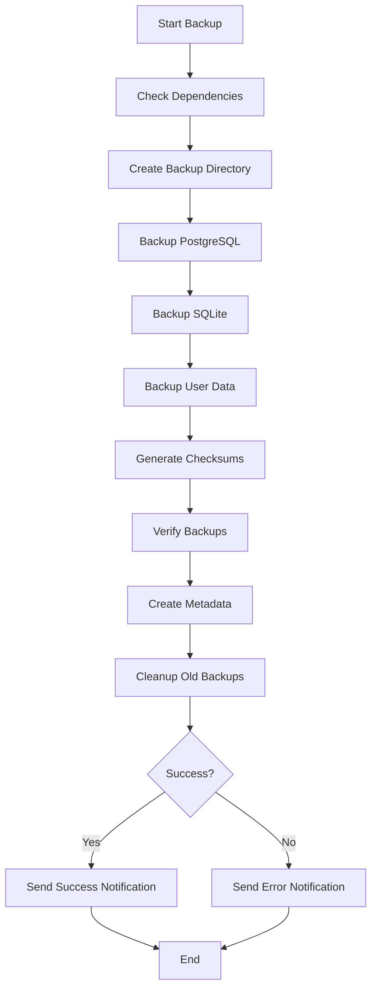

# Agent Feed Backup & Recovery Guide

## Table of Contents

1. [Overview](#overview)
2. [Quick Start](#quick-start)
3. [Backup System](#backup-system)
4. [Restore System](#restore-system)
5. [Automated Backups (Cron)](#automated-backups-cron)
6. [Production Deployment](#production-deployment)
7. [S3 Integration](#s3-integration)
8. [Disaster Recovery](#disaster-recovery)
9. [Troubleshooting](#troubleshooting)

---

## Overview

The Agent Feed backup system provides comprehensive, automated backups for:

- **PostgreSQL Database**: Primary application database with full schema and data
- **SQLite Databases**: Multiple SQLite databases (agent-pages, token-analytics, etc.)
- **User Data**: Agent configurations, workspaces, memory, and logs
- **Verification**: Automatic integrity checking and validation
- **Retention**: Configurable retention policies (default: 7 days)

### Architecture

```
backups/
├── YYYYMMDD_HHMMSS/              # Timestamped backup directory
│   ├── postgresql/               # PostgreSQL backups
│   │   ├── *.backup             # Custom format (compressed)
│   │   ├── *.sql.gz             # SQL format (human-readable)
│   │   ├── *_schema_*.sql.gz    # Schema only
│   │   ├── database_stats_*.txt # Database statistics
│   │   └── *.sha256             # Checksums
│   ├── sqlite/                  # SQLite backups
│   │   ├── *.db.gz              # Compressed SQLite databases
│   │   └── *.sha256             # Checksums
│   ├── userdata/                # User data backups
│   │   ├── claude_*.tar.gz      # Claude configurations
│   │   ├── agents_*.tar.gz      # Agent data
│   │   └── *.sha256             # Checksums
│   └── metadata/                # Backup metadata
│       ├── backup_metadata.json # Backup information
│       └── MANIFEST.txt         # File listing
└── logs/                        # Backup logs
    └── backup_*.log
```

---

## Quick Start

### Run Immediate Backup

```bash
# Using npm script (recommended)
npm run backup:now

# Or directly
./scripts/backup-system.sh
```

### List Available Backups

```bash
npm run backup:list
```

### Restore from Backup (Interactive)

```bash
npm run backup:restore
```

### Verify Backup Integrity

```bash
npm run backup:verify
```

---

## Backup System

### Configuration

Edit `/workspaces/agent-feed/config/backup-config.json`:

```json
{
  "backup": {
    "retention": {
      "dailyBackups": 7,    # Keep 7 daily backups
      "weeklyBackups": 4,   # Keep 4 weekly backups
      "monthlyBackups": 12  # Keep 12 monthly backups
    }
  }
}
```

### Environment Variables

```bash
# Backup location
BACKUP_ROOT=/workspaces/agent-feed/backups

# Retention policy
BACKUP_RETENTION_DAYS=7

# PostgreSQL connection
DB_HOST=localhost
DB_PORT=5432
POSTGRES_DB=avidm_dev
POSTGRES_USER=postgres
POSTGRES_PASSWORD=your_password

# Enable/disable PostgreSQL backup
USE_POSTGRES=true
```

### Manual Backup Commands

```bash
# Full backup
./scripts/backup-system.sh

# Verify existing backup
./scripts/backup-system.sh --verify-only /path/to/backup

# Cleanup old backups only
./scripts/backup-system.sh --cleanup-only

# View help
./scripts/backup-system.sh --help
```

### What Gets Backed Up

#### 1. PostgreSQL Database

- **Custom format backup** (`*.backup`): Binary, compressed, optimal for `pg_restore`
- **SQL format backup** (`*.sql.gz`): Human-readable, compressed SQL dump
- **Schema-only backup** (`*_schema_*.sql.gz`): Database structure without data
- **Database statistics**: Table counts, sizes, and metadata

#### 2. SQLite Databases

- `database.db` - Main application database
- `data/agent-pages.db` - Agent pages data
- `data/token-analytics.db` - Token usage analytics
- `data/agent-feed.db` - Feed data

All SQLite databases are backed up using `.backup` command (online backup) and compressed with gzip.

#### 3. User Data

- `.claude/config` - Claude configurations
- `.claude/memory` - Agent memory and state
- `agents/` - Agent definitions and workspaces
- `config/agents.json` - Agent system configuration

### Backup Verification

Every backup is automatically verified:

1. **Checksum Verification**: SHA256 checksums for all files
2. **Integrity Check**: PostgreSQL backup validity check
3. **SQLite Integrity**: `PRAGMA integrity_check` on all SQLite databases
4. **Metadata Generation**: Backup manifest and statistics

### Backup Process Flow



---

## Restore System

### Interactive Restore

The restore script provides an interactive wizard:

```bash
npm run backup:restore
```

**Process:**

1. Lists all available backups with details
2. Select backup by number
3. Verify backup integrity
4. Choose components to restore (PostgreSQL, SQLite, User Data)
5. Confirm restore operation
6. Automatic rollback backup created
7. Restore selected components
8. Verify restored data

### Command-Line Options

```bash
# Interactive restore
./scripts/restore-backup.sh

# List available backups
./scripts/restore-backup.sh --list

# Verify backup integrity only
./scripts/restore-backup.sh --verify /path/to/backup

# Dry run (show what would be restored)
./scripts/restore-backup.sh --dry-run

# Skip rollback backup creation
./scripts/restore-backup.sh --no-rollback

# Non-interactive restore from specific backup
./scripts/restore-backup.sh --restore-from /path/to/backup

# View help
./scripts/restore-backup.sh --help
```

### Restore Process

#### 1. PostgreSQL Restore

```bash
# The restore script will:
# 1. Terminate active connections
# 2. Drop existing database
# 3. Create fresh database
# 4. Restore from backup using pg_restore
# 5. Verify table count and data integrity
```

**Manual PostgreSQL Restore:**

```bash
# Custom format backup
pg_restore -h localhost -U postgres -d avidm_dev -v backup.backup

# SQL format backup
gunzip -c backup.sql.gz | psql -h localhost -U postgres -d avidm_dev
```

#### 2. SQLite Restore

```bash
# The restore script will:
# 1. Decompress backup
# 2. Backup existing database
# 3. Replace with backup
# 4. Verify integrity
```

**Manual SQLite Restore:**

```bash
# Decompress and replace
gunzip -c database_20250110_120000.db.gz > database.db

# Verify integrity
sqlite3 database.db "PRAGMA integrity_check;"
```

#### 3. User Data Restore

```bash
# The restore script will:
# 1. Extract tar archives to original locations
# 2. Restore file permissions
```

**Manual User Data Restore:**

```bash
# Extract tar archives
tar -xzf claude_config_20250110_120000.tar.gz -C /workspaces/agent-feed/

# Restore individual files
gunzip -c config_agents.json_20250110_120000.gz > config/agents.json
```

### Rollback Capability

Before each restore, the system automatically creates a rollback backup:

```bash
backups/rollback_YYYYMMDD_HHMMSS/
├── postgresql_rollback.backup
├── sqlite/
└── userdata/
```

**To rollback a failed restore:**

```bash
./scripts/restore-backup.sh --restore-from /path/to/rollback_backup
```

---

## Automated Backups (Cron)

### Daily Backup (2 AM)

```bash
# Edit crontab
crontab -e

# Add daily backup at 2 AM
0 2 * * * /workspaces/agent-feed/scripts/backup-system.sh >> /workspaces/agent-feed/backups/logs/cron.log 2>&1
```

### Weekly Full Backup (Sunday 3 AM)

```bash
# Weekly backup with extended retention
0 3 * * 0 BACKUP_RETENTION_DAYS=28 /workspaces/agent-feed/scripts/backup-system.sh >> /workspaces/agent-feed/backups/logs/cron.log 2>&1
```

### Multiple Backup Schedules

```bash
# Daily incremental (keep 7 days)
0 2 * * * /workspaces/agent-feed/scripts/backup-system.sh

# Weekly full (keep 4 weeks)
0 3 * * 0 BACKUP_RETENTION_DAYS=28 /workspaces/agent-feed/scripts/backup-system.sh

# Monthly archive (keep 12 months)
0 4 1 * * BACKUP_RETENTION_DAYS=365 /workspaces/agent-feed/scripts/backup-system.sh
```

### Cron Email Notifications

Configure cron to send email on failures:

```bash
# Set email in crontab
MAILTO=admin@your-domain.com

0 2 * * * /workspaces/agent-feed/scripts/backup-system.sh || echo "Backup failed" | mail -s "Backup Failure" admin@your-domain.com
```

### Systemd Timer (Alternative to Cron)

Create `/etc/systemd/system/agent-feed-backup.timer`:

```ini
[Unit]
Description=Agent Feed Daily Backup

[Timer]
OnCalendar=daily
Persistent=true

[Install]
WantedBy=timers.target
```

Create `/etc/systemd/system/agent-feed-backup.service`:

```ini
[Unit]
Description=Agent Feed Backup Service

[Service]
Type=oneshot
User=your-user
WorkingDirectory=/workspaces/agent-feed
ExecStart=/workspaces/agent-feed/scripts/backup-system.sh
```

Enable and start:

```bash
sudo systemctl enable agent-feed-backup.timer
sudo systemctl start agent-feed-backup.timer
sudo systemctl status agent-feed-backup.timer
```

---

## Production Deployment

### Pre-Production Checklist

1. **Test Backup and Restore**

```bash
# Run test backup
npm run backup:now

# Verify backup
npm run backup:verify

# Test restore (dry run)
./scripts/restore-backup.sh --dry-run
```

2. **Configure Retention Policy**

```bash
# Edit .env
BACKUP_RETENTION_DAYS=30  # Production: keep 30 days
```

3. **Set Up Monitoring**

- Configure email notifications
- Set up webhook alerts
- Monitor backup logs

4. **Configure Remote Storage**

- Set up S3 or equivalent
- Configure automated sync
- Test remote restore

### Production Best Practices

#### 1. Multiple Backup Locations

```bash
# Local backup
./scripts/backup-system.sh

# Copy to remote storage
rsync -avz /workspaces/agent-feed/backups/ backup-server:/backups/agent-feed/

# Or sync to S3 (see S3 Integration section)
aws s3 sync /workspaces/agent-feed/backups/ s3://your-bucket/agent-feed-backups/
```

#### 2. Backup Verification Schedule

```bash
# Daily backup
0 2 * * * /workspaces/agent-feed/scripts/backup-system.sh

# Weekly verification
0 4 * * 0 /workspaces/agent-feed/scripts/restore-backup.sh --dry-run --no-rollback
```

#### 3. Monitoring and Alerting

```bash
# Check backup age
find /workspaces/agent-feed/backups -maxdepth 1 -type d -name "20*" -mtime +1 -o -mtime -1

# Alert if no recent backup
if [ $(find /workspaces/agent-feed/backups -maxdepth 1 -type d -name "20*" -mtime -1 | wc -l) -eq 0 ]; then
    echo "No backup in last 24 hours!" | mail -s "ALERT: Missing Backup" admin@your-domain.com
fi
```

#### 4. Security

```bash
# Encrypt backups
gpg --encrypt --recipient backup@your-domain.com backup.tar.gz

# Restrict permissions
chmod 700 /workspaces/agent-feed/backups
chmod 600 /workspaces/agent-feed/backups/logs/*.log

# Use Docker secrets for passwords
# Don't store passwords in environment variables in production
```

---

## S3 Integration

### Configuration

Edit `config/backup-config.json`:

```json
{
  "backup": {
    "destinations": {
      "s3": {
        "enabled": true,
        "bucket": "your-backup-bucket",
        "region": "us-east-1",
        "prefix": "agent-feed-backups/",
        "storageClass": "STANDARD_IA"
      }
    }
  }
}
```

### Setup AWS CLI

```bash
# Install AWS CLI
curl "https://awscli.amazonaws.com/awscli-exe-linux-x86_64.zip" -o "awscliv2.zip"
unzip awscliv2.zip
sudo ./aws/install

# Configure credentials
aws configure
```

### Create S3 Sync Script

Create `scripts/sync-to-s3.sh`:

```bash
#!/bin/bash

BACKUP_ROOT="/workspaces/agent-feed/backups"
S3_BUCKET="s3://your-backup-bucket/agent-feed-backups"

# Sync backups to S3
aws s3 sync "$BACKUP_ROOT" "$S3_BUCKET" \
    --storage-class STANDARD_IA \
    --exclude "logs/*" \
    --exclude "rollback_*" \
    --delete

# Verify sync
aws s3 ls "$S3_BUCKET" --recursive
```

### Automate S3 Sync

```bash
# Add to crontab after backup
0 2 * * * /workspaces/agent-feed/scripts/backup-system.sh && /workspaces/agent-feed/scripts/sync-to-s3.sh
```

### Restore from S3

```bash
# List backups
aws s3 ls s3://your-bucket/agent-feed-backups/

# Download specific backup
aws s3 sync s3://your-bucket/agent-feed-backups/20250110_020000/ /tmp/restore-backup/

# Restore
./scripts/restore-backup.sh --restore-from /tmp/restore-backup
```

### S3 Lifecycle Policy

```json
{
  "Rules": [
    {
      "Id": "Move to Glacier after 30 days",
      "Status": "Enabled",
      "Transitions": [
        {
          "Days": 30,
          "StorageClass": "GLACIER"
        }
      ]
    },
    {
      "Id": "Delete after 1 year",
      "Status": "Enabled",
      "Expiration": {
        "Days": 365
      }
    }
  ]
}
```

Apply policy:

```bash
aws s3api put-bucket-lifecycle-configuration \
    --bucket your-backup-bucket \
    --lifecycle-configuration file://lifecycle-policy.json
```

---

## Disaster Recovery

### Recovery Time Objective (RTO)

**Target RTO: 1 hour**

1. Provision new server (15 minutes)
2. Install dependencies (10 minutes)
3. Restore latest backup (30 minutes)
4. Verify and start services (5 minutes)

### Recovery Point Objective (RPO)

**Target RPO: 24 hours**

- Daily backups ensure maximum 24-hour data loss
- Increase backup frequency for stricter RPO

### Disaster Recovery Plan

#### Scenario 1: Database Corruption

```bash
# 1. Stop application
docker-compose down

# 2. Restore from latest backup
npm run backup:restore

# 3. Verify data integrity
npm run health-check

# 4. Restart application
docker-compose up -d
```

#### Scenario 2: Complete Server Loss

```bash
# 1. Provision new server
# 2. Clone repository
git clone https://github.com/your-org/agent-feed.git
cd agent-feed

# 3. Install dependencies
npm install
cd api-server && npm install
cd ../frontend && npm install

# 4. Download backup from S3
aws s3 sync s3://your-bucket/agent-feed-backups/latest/ /tmp/restore/

# 5. Restore backup
./scripts/restore-backup.sh --restore-from /tmp/restore

# 6. Configure environment
cp .env.example .env
# Edit .env with production values

# 7. Start services
docker-compose up -d

# 8. Verify
npm run health-check
```

#### Scenario 3: Accidental Data Deletion

```bash
# 1. Identify when deletion occurred
# 2. Find backup before deletion
npm run backup:list

# 3. Restore specific component only
./scripts/restore-backup.sh
# Select backup
# Choose only affected component (PostgreSQL/SQLite/UserData)

# 4. Verify restoration
npm run health-check
```

### Testing DR Plan

**Quarterly DR Test:**

```bash
# 1. Create test environment
docker-compose -f docker-compose.test.yml up -d

# 2. Restore latest backup to test environment
BACKUP_ROOT=/tmp/test-backup ./scripts/restore-backup.sh

# 3. Verify all functionality
npm run test:e2e

# 4. Document results and timing
# 5. Update DR plan based on findings
```

---

## Troubleshooting

### Common Issues

#### 1. Backup Script Fails

**Error: "Cannot connect to PostgreSQL database"**

```bash
# Check PostgreSQL is running
sudo systemctl status postgresql

# Check connection
psql -h localhost -U postgres -d avidm_dev -c "SELECT 1;"

# Check credentials in .env
cat .env | grep POSTGRES
```

**Error: "Missing dependencies"**

```bash
# Install missing packages
sudo apt-get update
sudo apt-get install postgresql-client sqlite3 gzip jq
```

#### 2. Restore Fails

**Error: "Backup integrity verification failed"**

```bash
# Try different backup
npm run backup:list

# Verify backup manually
./scripts/restore-backup.sh --verify /path/to/backup

# Check backup logs
cat /workspaces/agent-feed/backups/logs/backup_*.log
```

**Error: "Cannot drop database - active connections"**

```bash
# Terminate active connections manually
psql -h localhost -U postgres -d postgres -c "
SELECT pg_terminate_backend(pid)
FROM pg_stat_activity
WHERE datname = 'avidm_dev' AND pid <> pg_backend_pid();"

# Retry restore
npm run backup:restore
```

#### 3. Disk Space Issues

**Error: "No space left on device"**

```bash
# Check disk usage
df -h /workspaces/agent-feed/backups

# Clean up old backups manually
./scripts/backup-system.sh --cleanup-only

# Or reduce retention period
BACKUP_RETENTION_DAYS=3 ./scripts/backup-system.sh --cleanup-only
```

#### 4. Slow Backups

```bash
# Check database size
psql -h localhost -U postgres -d avidm_dev -c "
SELECT pg_size_pretty(pg_database_size('avidm_dev'));"

# Optimize PostgreSQL before backup
psql -h localhost -U postgres -d avidm_dev -c "VACUUM ANALYZE;"

# Use parallel compression (edit script)
# Change: gzip -9
# To: pigz -9  # parallel gzip
```

### Backup Validation

```bash
# Verify all components in a backup
./scripts/restore-backup.sh --verify /path/to/backup

# Check backup size
du -sh /workspaces/agent-feed/backups/*

# Verify checksums
find /workspaces/agent-feed/backups -name "*.sha256" -exec sha256sum -c {} \;

# Test PostgreSQL backup
pg_restore --list /path/to/backup.backup

# Test SQLite backup
gunzip -c backup.db.gz | sqlite3 :memory: "PRAGMA integrity_check;"
```

### Logs

```bash
# View latest backup log
tail -f /workspaces/agent-feed/backups/logs/backup_*.log | tail -n 100

# View latest restore log
tail -f /workspaces/agent-feed/backups/logs/restore_*.log | tail -n 100

# Search for errors
grep ERROR /workspaces/agent-feed/backups/logs/*.log
```

---

## Support

For issues or questions:

1. Check logs: `/workspaces/agent-feed/backups/logs/`
2. Verify configuration: `/workspaces/agent-feed/config/backup-config.json`
3. Run validation: `npm run backup:verify`
4. Review this guide
5. Contact: support@agent-feed.com

---

## Appendix

### File Permissions

```bash
# Backup scripts should be executable
chmod +x /workspaces/agent-feed/scripts/backup-system.sh
chmod +x /workspaces/agent-feed/scripts/restore-backup.sh

# Backup directory should be restricted
chmod 700 /workspaces/agent-feed/backups

# Log files should be readable
chmod 644 /workspaces/agent-feed/backups/logs/*.log
```

### Backup Size Estimates

| Component | Typical Size | Compressed Size |
|-----------|--------------|-----------------|
| PostgreSQL (1M records) | 500 MB | 50 MB |
| SQLite (all) | 100 MB | 10 MB |
| User Data | 50 MB | 5 MB |
| **Total** | **650 MB** | **65 MB** |

### Backup Duration

| Operation | Duration |
|-----------|----------|
| PostgreSQL Backup | 5-10 minutes |
| SQLite Backup | 1-2 minutes |
| User Data Backup | 1 minute |
| Verification | 2-3 minutes |
| **Total** | **9-16 minutes** |

---

**Last Updated:** 2025-01-10
**Version:** 1.0.0
