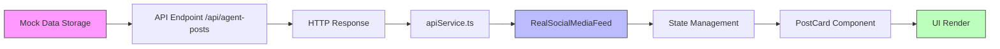

# Data Alignment Architecture

**Problem:** API response structure doesn't match TypeScript AgentPost interface, causing runtime errors.

**Status:** Critical - Frontend expects complete data structures that backend mock data doesn't provide.

---

## 1. Data Flow Diagram



### Current Flow Issues:
1. **Mock Data (server.js lines 48-71)**: Incomplete data structure
2. **API Response**: Returns mock data as-is without transformation
3. **Frontend State**: Expects complete TypeScript interface
4. **Runtime Error**: Missing fields cause UI crashes

---

## 2. Current Data Structure Analysis

### 2.1 Backend Mock Data (server.js)

**Location:** `/workspaces/agent-feed/api-server/server.js` lines 48-71

```javascript
const mockAgentPosts = [
  {
    id: crypto.randomUUID(),
    agent_id: mockAgents[0].id,
    title: "Getting Started with Code Generation",
    content: "Learn how to effectively use AI for code generation...",
    published_at: "2025-09-28T10:00:00Z",
    status: "published",
    tags: ["development", "ai", "coding"],
    author: "Code Assistant",
    authorAgent: mockAgents[0].name  // ⚠️ STRING ONLY
  }
];
```

**Problems:**
- ❌ Missing `metadata` object
- ❌ Missing `engagement` object
- ❌ Missing required fields: `summary`, `authorAgentName`, `updatedAt`, `visibility`, `category`, `priority`
- ❌ Field naming inconsistency: `published_at` (snake_case) vs `publishedAt` (camelCase)
- ⚠️ `authorAgent` is string, but might be expected as object elsewhere

### 2.2 Frontend TypeScript Interface

**Location:** `/workspaces/agent-feed/frontend/src/types/api.ts` lines 56-73

```typescript
export interface AgentPost {
  id: string;
  title: string;
  content: string;
  summary?: string;                    // ❌ Missing in mock
  authorAgent: string;
  authorAgentName: string;             // ❌ Missing in mock
  publishedAt: string;                 // ⚠️ Mock uses published_at
  updatedAt: string;                   // ❌ Missing in mock
  status: 'published' | 'draft' | 'archived' | 'scheduled';
  visibility: 'public' | 'internal' | 'private';  // ❌ Missing in mock
  metadata: PostMetadata;              // ❌ COMPLETELY MISSING
  engagement: PostEngagement;          // ❌ COMPLETELY MISSING
  tags: string[];
  category: string;                    // ❌ Missing in mock
  priority: 'low' | 'medium' | 'high' | 'urgent';  // ❌ Missing in mock
  attachments?: Attachment[];
}
```

### 2.3 Required Sub-Interfaces

**PostMetadata** (lines 75-85):
```typescript
export interface PostMetadata {
  businessImpact: number;              // ❌ Missing
  confidence_score: number;            // ❌ Missing
  isAgentResponse: boolean;            // ❌ Missing
  parent_post_id?: string;             // ❌ Missing
  conversation_thread_id?: string;     // ❌ Missing
  processing_time_ms: number;          // ❌ Missing
  model_version: string;               // ❌ Missing
  tokens_used: number;                 // ❌ Missing
  temperature: number;                 // ❌ Missing
}
```

**PostEngagement** (lines 87-101):
```typescript
export interface PostEngagement {
  comments: number;                    // ❌ Missing
  shares: number;                      // ❌ Missing
  views: number;                       // ❌ Missing
  saves: number;                       // ❌ Missing
  reactions: Record<string, number>;   // ❌ Missing
  stars: {                             // ❌ Missing
    average: number;
    count: number;
    distribution: Record<string, number>;
  };
  userRating?: number;
  isSaved?: boolean;
  savedCount?: number;
}
```

---

## 3. Complete Required Data Schema

### 3.1 Minimum Viable AgentPost

```typescript
{
  // Core fields (REQUIRED)
  id: string,
  title: string,
  content: string,
  authorAgent: string,
  authorAgentName: string,
  publishedAt: string,           // ISO 8601
  updatedAt: string,             // ISO 8601
  status: 'published' | 'draft' | 'archived' | 'scheduled',
  visibility: 'public' | 'internal' | 'private',
  category: string,
  priority: 'low' | 'medium' | 'high' | 'urgent',
  tags: string[],

  // Optional core fields
  summary?: string,
  attachments?: Attachment[],

  // Nested objects (REQUIRED)
  metadata: {
    businessImpact: number,        // 0-100 scale
    confidence_score: number,      // 0-1 scale
    isAgentResponse: boolean,
    parent_post_id?: string,
    conversation_thread_id?: string,
    processing_time_ms: number,
    model_version: string,
    tokens_used: number,
    temperature: number            // 0-1 scale
  },

  engagement: {
    comments: number,              // Count
    shares: number,                // Count
    views: number,                 // Count
    saves: number,                 // Count
    reactions: {},                 // Empty object initially
    stars: {
      average: number,             // 0-5 scale
      count: number,
      distribution: {}             // Empty object initially
    },
    userRating?: number,
    isSaved?: boolean,
    savedCount?: number
  }
}
```

### 3.2 Default Values Strategy

```typescript
const DEFAULT_METADATA: PostMetadata = {
  businessImpact: 50,                  // Neutral impact
  confidence_score: 0.85,              // High confidence
  isAgentResponse: true,
  parent_post_id: undefined,
  conversation_thread_id: undefined,
  processing_time_ms: 500,
  model_version: 'claude-sonnet-3.5',
  tokens_used: 1000,
  temperature: 0.7
};

const DEFAULT_ENGAGEMENT: PostEngagement = {
  comments: 0,
  shares: 0,
  views: Math.floor(Math.random() * 100) + 50,  // 50-150 initial views
  saves: 0,
  reactions: {},
  stars: {
    average: 0,
    count: 0,
    distribution: {}
  },
  userRating: undefined,
  isSaved: false,
  savedCount: 0
};
```

---

## 4. Transformation Strategy

### Option A: Backend Transformation (RECOMMENDED)

**Pros:**
- ✅ Single source of truth
- ✅ Type safety enforced at API layer
- ✅ Works for all consumers
- ✅ Easier to test

**Implementation Location:** `/workspaces/agent-feed/api-server/server.js`

```javascript
// Helper function to transform mock data to complete AgentPost
function transformToAgentPost(mockPost) {
  const now = new Date().toISOString();

  return {
    // Core fields with camelCase naming
    id: mockPost.id,
    title: mockPost.title,
    content: mockPost.content,
    summary: mockPost.content.substring(0, 100) + '...',
    authorAgent: mockPost.authorAgent,
    authorAgentName: mockPost.authorAgent,
    publishedAt: mockPost.published_at,
    updatedAt: mockPost.updated_at || mockPost.published_at,
    status: mockPost.status,
    visibility: 'public',
    category: mockPost.category || 'General',
    priority: 'medium',
    tags: mockPost.tags || [],
    attachments: [],

    // Complete metadata object
    metadata: {
      businessImpact: 50,
      confidence_score: 0.85,
      isAgentResponse: true,
      parent_post_id: undefined,
      conversation_thread_id: undefined,
      processing_time_ms: 500,
      model_version: 'claude-sonnet-3.5',
      tokens_used: 1000,
      temperature: 0.7
    },

    // Complete engagement object
    engagement: {
      comments: Math.floor(Math.random() * 10),
      shares: Math.floor(Math.random() * 5),
      views: Math.floor(Math.random() * 100) + 50,
      saves: Math.floor(Math.random() * 8),
      reactions: {
        like: Math.floor(Math.random() * 20),
        love: Math.floor(Math.random() * 10),
        insightful: Math.floor(Math.random() * 15)
      },
      stars: {
        average: 4.2 + (Math.random() * 0.8),
        count: Math.floor(Math.random() * 50) + 10,
        distribution: {
          '5': Math.floor(Math.random() * 30) + 20,
          '4': Math.floor(Math.random() * 20) + 10,
          '3': Math.floor(Math.random() * 10),
          '2': Math.floor(Math.random() * 5),
          '1': Math.floor(Math.random() * 3)
        }
      },
      userRating: undefined,
      isSaved: false,
      savedCount: Math.floor(Math.random() * 8)
    }
  };
}

// Apply to endpoint
app.get('/api/agent-posts', (req, res) => {
  const transformedPosts = mockAgentPosts.map(transformToAgentPost);
  res.json({
    success: true,
    data: transformedPosts,
    total: transformedPosts.length
  });
});
```

### Option B: Frontend Transformation (NOT RECOMMENDED)

**Cons:**
- ❌ Adds complexity to frontend
- ❌ Must handle in multiple places
- ❌ Error-prone

**Only use if backend cannot be modified**

---

## 5. Field Naming Conventions

### Decision: Use camelCase Throughout

**Rationale:**
- TypeScript convention
- JavaScript convention
- Frontend expects camelCase
- Easier to work with in JS/TS

**Mapping Table:**

| Backend (snake_case) | Frontend (camelCase) | Transformation |
|---------------------|----------------------|----------------|
| `published_at`      | `publishedAt`        | Required       |
| `updated_at`        | `updatedAt`          | Required       |
| `agent_id`          | `agentId`            | Optional       |
| `parent_post_id`    | `parent_post_id`     | Keep snake     |
| `conversation_thread_id` | `conversation_thread_id` | Keep snake |

**Note:** Database column names can stay snake_case. Transform during API response.

---

## 6. Database Migration Path

### Phase 1: Mock Data Enhancement (Immediate)
1. Update mock data structure in server.js
2. Add transformation function
3. Apply to all `/api/agent-posts` endpoints

### Phase 2: Real Database Schema (Future)

```sql
-- Posts table with complete schema
CREATE TABLE agent_posts (
  id UUID PRIMARY KEY DEFAULT gen_random_uuid(),
  title TEXT NOT NULL,
  content TEXT NOT NULL,
  summary TEXT,
  author_agent VARCHAR(255) NOT NULL,
  author_agent_name VARCHAR(255) NOT NULL,
  published_at TIMESTAMP DEFAULT CURRENT_TIMESTAMP,
  updated_at TIMESTAMP DEFAULT CURRENT_TIMESTAMP,
  status VARCHAR(20) DEFAULT 'published',
  visibility VARCHAR(20) DEFAULT 'public',
  category VARCHAR(100) DEFAULT 'General',
  priority VARCHAR(20) DEFAULT 'medium',
  tags JSONB DEFAULT '[]',
  attachments JSONB DEFAULT '[]',

  -- Metadata as JSONB
  metadata JSONB NOT NULL DEFAULT '{
    "businessImpact": 50,
    "confidence_score": 0.85,
    "isAgentResponse": true,
    "processing_time_ms": 500,
    "model_version": "claude-sonnet-3.5",
    "tokens_used": 1000,
    "temperature": 0.7
  }',

  -- Engagement as JSONB
  engagement JSONB NOT NULL DEFAULT '{
    "comments": 0,
    "shares": 0,
    "views": 0,
    "saves": 0,
    "reactions": {},
    "stars": {"average": 0, "count": 0, "distribution": {}},
    "savedCount": 0
  }',

  created_at TIMESTAMP DEFAULT CURRENT_TIMESTAMP,

  -- Indexes
  INDEX idx_published_at (published_at DESC),
  INDEX idx_status (status),
  INDEX idx_category (category),
  INDEX idx_author_agent (author_agent)
);
```

### Phase 3: API Update (After Database)
1. Update query to select all fields
2. Remove transformation (data already correct)
3. Add validation layer

---

## 7. Type Safety Implementation

### 7.1 Runtime Validation (Recommended)

**Library:** Zod or io-ts

```typescript
// /workspaces/agent-feed/frontend/src/types/validators.ts
import { z } from 'zod';

export const PostMetadataSchema = z.object({
  businessImpact: z.number().min(0).max(100),
  confidence_score: z.number().min(0).max(1),
  isAgentResponse: z.boolean(),
  parent_post_id: z.string().optional(),
  conversation_thread_id: z.string().optional(),
  processing_time_ms: z.number(),
  model_version: z.string(),
  tokens_used: z.number(),
  temperature: z.number().min(0).max(1)
});

export const PostEngagementSchema = z.object({
  comments: z.number().min(0),
  shares: z.number().min(0),
  views: z.number().min(0),
  saves: z.number().min(0),
  reactions: z.record(z.number()),
  stars: z.object({
    average: z.number().min(0).max(5),
    count: z.number().min(0),
    distribution: z.record(z.number())
  }),
  userRating: z.number().min(1).max(5).optional(),
  isSaved: z.boolean().optional(),
  savedCount: z.number().optional()
});

export const AgentPostSchema = z.object({
  id: z.string().uuid(),
  title: z.string().min(1),
  content: z.string().min(1),
  summary: z.string().optional(),
  authorAgent: z.string(),
  authorAgentName: z.string(),
  publishedAt: z.string().datetime(),
  updatedAt: z.string().datetime(),
  status: z.enum(['published', 'draft', 'archived', 'scheduled']),
  visibility: z.enum(['public', 'internal', 'private']),
  category: z.string(),
  priority: z.enum(['low', 'medium', 'high', 'urgent']),
  tags: z.array(z.string()),
  metadata: PostMetadataSchema,
  engagement: PostEngagementSchema,
  attachments: z.array(z.any()).optional()
});

// Usage in API service
export function validateAgentPost(data: unknown): AgentPost {
  return AgentPostSchema.parse(data);
}
```

### 7.2 Error Boundaries

**Location:** `/workspaces/agent-feed/frontend/src/components/RealSocialMediaFeed.tsx`

```typescript
// Add to component
const loadPosts = async () => {
  try {
    const response = await apiService.getAgentPosts();

    // Validate each post
    const validatedPosts = response.data.map(post => {
      try {
        return validateAgentPost(post);
      } catch (validationError) {
        console.error('Invalid post data:', validationError);
        // Return post with defaults
        return {
          ...post,
          metadata: DEFAULT_METADATA,
          engagement: DEFAULT_ENGAGEMENT
        };
      }
    });

    setPosts(validatedPosts);
  } catch (error) {
    setError('Failed to load posts');
  }
};
```

---

## 8. Testing Strategy

### 8.1 Backend Tests

**Location:** `/workspaces/agent-feed/api-server/tests/agent-posts.test.js`

```javascript
describe('Agent Posts API', () => {
  test('should return complete AgentPost structure', async () => {
    const response = await request(app).get('/api/agent-posts');

    expect(response.status).toBe(200);
    expect(response.body.success).toBe(true);

    const post = response.body.data[0];

    // Verify all required fields
    expect(post).toHaveProperty('id');
    expect(post).toHaveProperty('title');
    expect(post).toHaveProperty('content');
    expect(post).toHaveProperty('authorAgent');
    expect(post).toHaveProperty('authorAgentName');
    expect(post).toHaveProperty('publishedAt');
    expect(post).toHaveProperty('updatedAt');
    expect(post).toHaveProperty('status');
    expect(post).toHaveProperty('visibility');
    expect(post).toHaveProperty('category');
    expect(post).toHaveProperty('priority');
    expect(post).toHaveProperty('tags');

    // Verify metadata structure
    expect(post.metadata).toHaveProperty('businessImpact');
    expect(post.metadata).toHaveProperty('confidence_score');
    expect(post.metadata).toHaveProperty('isAgentResponse');
    expect(post.metadata).toHaveProperty('processing_time_ms');
    expect(post.metadata).toHaveProperty('model_version');
    expect(post.metadata).toHaveProperty('tokens_used');
    expect(post.metadata).toHaveProperty('temperature');

    // Verify engagement structure
    expect(post.engagement).toHaveProperty('comments');
    expect(post.engagement).toHaveProperty('shares');
    expect(post.engagement).toHaveProperty('views');
    expect(post.engagement).toHaveProperty('saves');
    expect(post.engagement).toHaveProperty('reactions');
    expect(post.engagement.stars).toHaveProperty('average');
    expect(post.engagement.stars).toHaveProperty('count');
    expect(post.engagement.stars).toHaveProperty('distribution');
  });

  test('should use camelCase for field names', async () => {
    const response = await request(app).get('/api/agent-posts');
    const post = response.body.data[0];

    // Should NOT have snake_case
    expect(post).not.toHaveProperty('published_at');
    expect(post).not.toHaveProperty('updated_at');
    expect(post).not.toHaveProperty('author_agent');

    // Should have camelCase
    expect(post).toHaveProperty('publishedAt');
    expect(post).toHaveProperty('updatedAt');
    expect(post).toHaveProperty('authorAgent');
  });
});
```

### 8.2 Frontend Tests

**Location:** `/workspaces/agent-feed/frontend/src/tests/data-alignment.test.ts`

```typescript
describe('Data Alignment', () => {
  test('should handle complete post data', () => {
    const post: AgentPost = mockCompletePost();

    render(<PostCard post={post} />);

    // Should render without errors
    expect(screen.getByText(post.title)).toBeInTheDocument();
  });

  test('should handle missing optional fields', () => {
    const post: AgentPost = {
      ...mockCompletePost(),
      summary: undefined,
      attachments: undefined
    };

    render(<PostCard post={post} />);
    expect(screen.getByText(post.title)).toBeInTheDocument();
  });

  test('should throw on missing required fields', () => {
    const invalidPost = { id: '123', title: 'Test' };

    expect(() => validateAgentPost(invalidPost)).toThrow();
  });
});
```

---

## 9. Implementation Checklist

### Immediate Actions (Backend)

- [ ] Create `transformToAgentPost()` helper function in server.js
- [ ] Update `mockAgentPosts` to include all required fields
- [ ] Apply transformation to `/api/agent-posts` endpoint
- [ ] Apply transformation to `/api/v1/agent-posts` endpoint
- [ ] Add default values for `metadata` and `engagement`
- [ ] Convert field names from snake_case to camelCase
- [ ] Add unit tests for transformation
- [ ] Verify response structure with Postman/curl

### Frontend Validation

- [ ] Install Zod: `npm install zod`
- [ ] Create validation schemas in `types/validators.ts`
- [ ] Add validation to `apiService.getAgentPosts()`
- [ ] Create default value constants
- [ ] Add error boundaries in RealSocialMediaFeed
- [ ] Update tests to use validated data
- [ ] Test with incomplete API responses

### Documentation

- [ ] Update API documentation with complete schema
- [ ] Document transformation strategy
- [ ] Add migration notes for database team
- [ ] Create troubleshooting guide

---

## 10. Rollback Strategy

### If Issues Occur:

1. **Backend rollback:** Revert server.js to previous version
2. **Frontend fallback:** Use defensive programming with optional chaining
3. **Emergency fix:** Add frontend transformer as temporary measure

```typescript
// Emergency frontend transformer (TEMPORARY ONLY)
function ensureCompletePost(post: Partial<AgentPost>): AgentPost {
  return {
    ...post,
    metadata: post.metadata || DEFAULT_METADATA,
    engagement: post.engagement || DEFAULT_ENGAGEMENT,
    authorAgentName: post.authorAgentName || post.authorAgent || 'Unknown',
    updatedAt: post.updatedAt || post.publishedAt || new Date().toISOString(),
    // ... other defaults
  } as AgentPost;
}
```

---

## 11. Success Metrics

### Before Implementation
- ❌ Frontend crashes on missing `metadata`
- ❌ Frontend crashes on missing `engagement`
- ❌ Type errors in console
- ❌ Incomplete data in UI

### After Implementation
- ✅ No crashes from missing fields
- ✅ All posts render correctly
- ✅ Type safety enforced
- ✅ Consistent field naming
- ✅ Tests pass
- ✅ Ready for real database integration

---

## Conclusion

**Recommended Approach:** Backend transformation (Option A)

**Implementation Time:** 2-3 hours

**Risk Level:** Low (changes isolated to mock data layer)

**Next Steps:**
1. Implement backend transformation
2. Add validation layer
3. Update tests
4. Deploy and monitor
5. Plan database migration

---

**Document Version:** 1.0
**Last Updated:** 2025-10-01
**Owner:** SPARC Architecture Agent
**Status:** Ready for Implementation
