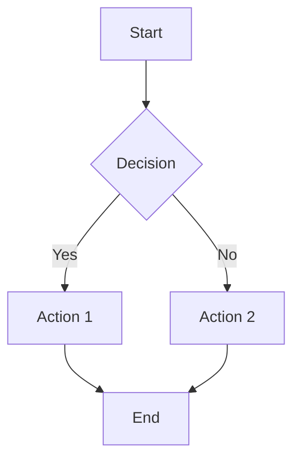

# Investigation Report: Charts, Flowcharts, and Pagination Capabilities

**Date**: October 7, 2025
**Requested By**: User
**Investigation Type**: Capabilities Assessment (No Implementation)

---

## Questions Investigated

1. **Can this do charts and graphs?**
2. **What about flowcharts?**
3. **Can the page builder put different examples in a paginated fashion vs a wiki scroll?**

---

## Question 1: Charts and Graphs - ✅ **YES, Partially Implemented**

### Current Chart Capabilities

#### **Available Chart Libraries** (Already Installed):
```json
"chart.js": "^4.5.0"
"react-chartjs-2": "^5.3.0"
"chartjs-adapter-date-fns": "^3.0.0"
"recharts": "^2.12.2"
"gantt-task-react": "^0.3.9"
```

#### **Chart Components Implemented**:

1. **LineChart** (`/frontend/src/components/charts/LineChart.tsx`)
   - Time-series data visualization
   - Multiple data series support
   - Customizable colors and labels

2. **BarChart** (`/frontend/src/components/charts/BarChart.tsx`)
   - Vertical/horizontal bar charts
   - Comparative data visualization
   - Category-based data

3. **PieChart** (`/frontend/src/components/charts/PieChart.tsx`)
   - Percentage/proportion visualization
   - Multiple slices support
   - Color customization

4. **GanttChart** (`/frontend/src/components/dynamic-page/GanttChart.tsx`) ✅ **REGISTERED IN PAGE BUILDER**
   - Project timeline visualization
   - Task dependencies
   - Progress tracking
   - Multiple view modes (day/week/month/quarter/year)
   - Status colors (todo/in-progress/done/blocked)
   - Assignee tracking

**Example GanttChart from Component Showcase**:
```json
{
  "type": "GanttChart",
  "props": {
    "tasks": [
      {
        "id": 1,
        "name": "Project Initiation",
        "startDate": "2025-10-01",
        "endDate": "2025-10-07",
        "progress": 100,
        "assignee": "Sarah Johnson",
        "color": "#3b82f6"
      },
      ...
    ],
    "viewMode": "month"
  }
}
```

#### **Chart Utility Functions** (`/frontend/src/components/charts/index.ts`):
- `formatChartValue()` - Currency, number, percentage formatting
- `generateChartColors()` - Auto-color generation for datasets
- `calculateTrend()` - Trend analysis (up/down/stable)

### **Current Status**:
- ✅ GanttChart is **fully integrated** in DynamicPageRenderer
- ✅ GanttChart is **registered in ComponentSchemas**
- ✅ GanttChart is **working on component showcase page**
- ❌ LineChart, BarChart, PieChart are **NOT YET registered** in DynamicPageRenderer
- ❌ No chart schemas defined for LineChart/BarChart/PieChart

### **What Would Need to Be Done**:
To make LineChart, BarChart, and PieChart available to the page-builder-agent:

1. Create schemas in `componentSchemas.ts`:
```typescript
export const LineChartSchema = z.object({
  data: z.object({
    labels: z.array(z.string()),
    datasets: z.array(z.object({
      label: z.string(),
      data: z.array(z.number()),
      borderColor: z.string().optional(),
      backgroundColor: z.string().optional()
    }))
  }),
  options: z.object({...}).optional()
})
```

2. Add cases in DynamicPageRenderer:
```typescript
case 'LineChart':
  return <LineChart key={key} {...props} />;

case 'BarChart':
  return <BarChart key={key} {...props} />;

case 'PieChart':
  return <PieChart key={key} {...props} />;
```

3. Import chart components in DynamicPageRenderer

**Effort**: ~2-3 hours to integrate all three chart types

---

## Question 2: Flowcharts - ⚠️ **PARTIAL (Custom Implementation Needed)**

### Current Flowchart/Diagram Capabilities

#### **What EXISTS**:

1. **WorkflowVisualization Component** (`/frontend/src/components/WorkflowVisualization.tsx`)
   - Custom-built workflow diagram
   - Shows SPARC/deployment/analysis workflows
   - Timeline and dependency views
   - Step-by-step process visualization
   - Status indicators (pending/in-progress/completed/failed/skipped)
   - **NOT registered in page builder** - standalone component only

#### **What DOESN'T Exist**:
- ❌ No Mermaid.js integration (flowchart.js library)
- ❌ No React Flow integration (interactive node-based diagrams)
- ❌ No D3.js diagrams
- ❌ No generic flowchart component for page builder

### **Flowchart Libraries NOT Installed**:
```bash
# Would need to install one of these:
npm install mermaid          # Text-based diagrams (recommended)
npm install reactflow        # Interactive node-based diagrams
npm install react-diagrams   # Visual flowchart builder
```

### **Recommendation for Flowcharts**:

#### **Option 1: Mermaid.js Integration** (EASIEST)
Mermaid allows flowcharts to be defined in markdown-like syntax:

```markdown

```

**Advantages**:
- ✅ Simple text-based syntax
- ✅ Can be embedded in Markdown component (already exists!)
- ✅ Auto-renders as visual flowchart
- ✅ Supports flowcharts, sequence diagrams, Gantt charts, class diagrams, state diagrams, etc.

**Implementation Effort**: ~3-4 hours
- Install mermaid + react-mermaid
- Add mermaid support to MarkdownRenderer
- Update MarkdownSchema to support mermaid code blocks

#### **Option 2: React Flow** (MORE POWERFUL)
Interactive, drag-and-drop flowchart builder with custom nodes.

**Advantages**:
- ✅ Interactive diagrams
- ✅ Drag-and-drop node editing
- ✅ Custom node shapes
- ✅ Zoom/pan controls

**Disadvantages**:
- ❌ Requires complex JSON structure for page-builder-agent
- ❌ More development effort

**Implementation Effort**: ~8-12 hours

#### **Option 3: Enhance Existing MarkdownRenderer**
The existing MarkdownRenderer already supports code blocks with syntax highlighting. Adding mermaid support would be minimal effort.

**Current MarkdownRenderer Features**:
- ✅ GitHub Flavored Markdown (GFM)
- ✅ Syntax highlighting (highlight.js)
- ✅ Sanitization (XSS protection)
- ✅ Already registered in page builder

---

## Question 3: Pagination vs Wiki Scroll - ✅ **YES, Multiple Options Available**

### Current Layout Capabilities

#### **Option 1: Tabs Component** ✅ **ALREADY WORKING**

The component showcase page ALREADY uses tabs! Check the API response:

```json
{
  "type": "tabs",
  "props": {
    "tabs": [
      {
        "label": "Overview",
        "content": "This is the overview tab content..."
      },
      {
        "label": "Specifications",
        "content": "Technical specifications..."
      },
      {
        "label": "Reviews",
        "content": "Customer reviews..."
      },
      {
        "label": "Support",
        "content": "Contact support..."
      }
    ]
  }
}
```

**Current Status**:
- ✅ Tabs component fully implemented (`/frontend/src/components/ui/tabs.tsx`)
- ✅ Registered in DynamicPageRenderer (case 'tabs')
- ✅ TabsSchema defined in componentSchemas
- ✅ Working on component showcase page

**How It Works**:
```typescript
// Page builder agent can create tabbed content:
{
  "type": "tabs",
  "props": {
    "tabs": [
      {"label": "Charts", "content": "Chart examples here..."},
      {"label": "Forms", "content": "Form examples here..."},
      {"label": "Data", "content": "Data display examples..."}
    ]
  }
}
```

#### **Option 2: Accordion/Collapsible Sections**

Not currently implemented, but would allow:
- Click to expand/collapse sections
- Only one section visible at a time (or multiple)
- Scroll within expanded section

**Implementation Effort**: ~4-6 hours

#### **Option 3: Pagination Component**

**Current Status**:
- ❌ NOT implemented in DynamicPageRenderer
- ✅ Used in SocialMediaFeed and AgentManager (standalone components)

**What Would Be Needed**:
```typescript
// Pagination component for page builder:
{
  "type": "Pagination",
  "props": {
    "items": [...],        // All items
    "itemsPerPage": 10,
    "renderItem": "Card"   // Component to render each item
  }
}
```

**Implementation Effort**: ~6-8 hours
- Create reusable Pagination component
- Add schema definition
- Register in DynamicPageRenderer
- Handle state management

#### **Option 4: Virtual Scrolling**

For very long lists (1000+ items), virtual scrolling only renders visible items.

**Libraries Available**:
- react-window (lightweight)
- react-virtualized (feature-rich)

**Implementation Effort**: ~8-10 hours

---

## Summary & Recommendations

### **Question 1: Charts & Graphs**
**Answer**: ✅ **YES**, mostly ready

- **GanttChart**: Fully working ✅
- **LineChart/BarChart/PieChart**: Exist but need registration (~2-3 hours)
- **Recommendation**: Register the 3 basic charts for immediate use

### **Question 2: Flowcharts**
**Answer**: ⚠️ **PARTIAL**, needs implementation

- **Current**: Custom WorkflowVisualization (not in page builder)
- **Best Option**: Add Mermaid.js to MarkdownRenderer (~3-4 hours)
- **Alternative**: Build dedicated FlowChart component with React Flow (~8-12 hours)
- **Recommendation**: Start with Mermaid integration - most flexible and easiest

### **Question 3: Pagination vs Wiki Scroll**
**Answer**: ✅ **YES**, tabs already work

- **Tabs**: Fully working ✅ (already on showcase page)
- **Pagination**: Would need implementation (~6-8 hours)
- **Accordion**: Would need implementation (~4-6 hours)
- **Recommendation**: Use tabs for now, add pagination if needed

---

## Current Component Showcase Layout

**Total Components**: 60 components
**Layout**: Single-page scroll with sidebar navigation
**Sections**: 15 categories (Text & Content, Forms, Data Display, etc.)

### **How to Switch to Paginated/Tabbed Layout**:

The page-builder-agent could restructure the page to use tabs:

```json
{
  "components": [
    {
      "type": "Sidebar",
      "props": {...}
    },
    {
      "type": "tabs",
      "props": {
        "tabs": [
          {
            "label": "Text & Content",
            "content": "[All text components here]"
          },
          {
            "label": "Interactive Forms",
            "content": "[All form components here]"
          },
          {
            "label": "Data Display",
            "content": "[All data components here]"
          },
          ...
        ]
      }
    }
  ]
}
```

**Advantage**: Each category in its own tab, less scrolling
**Trade-off**: Can't see all examples at once (but that's the point!)

---

## Effort Estimates

| Feature | Status | Effort to Complete |
|---------|--------|-------------------|
| GanttChart | ✅ Working | 0 hours (done) |
| LineChart/BarChart/PieChart | ⚠️ Exists, needs registration | 2-3 hours |
| Mermaid Flowcharts | ❌ Not implemented | 3-4 hours |
| React Flow Diagrams | ❌ Not implemented | 8-12 hours |
| Tabs Layout | ✅ Working | 0 hours (done) |
| Pagination Component | ❌ Not implemented | 6-8 hours |
| Accordion Component | ❌ Not implemented | 4-6 hours |

**Total to add all missing features**: ~24-33 hours

---

## Files Referenced

### Chart Components:
- `/frontend/src/components/charts/LineChart.tsx`
- `/frontend/src/components/charts/BarChart.tsx`
- `/frontend/src/components/charts/PieChart.tsx`
- `/frontend/src/components/dynamic-page/GanttChart.tsx` ✅
- `/frontend/src/components/charts/index.ts`

### Workflow/Diagram:
- `/frontend/src/components/WorkflowVisualization.tsx`

### Layout Components:
- `/frontend/src/components/ui/tabs.tsx` ✅
- `/frontend/src/components/SocialMediaFeed.tsx` (has pagination)
- `/frontend/src/components/AgentManager.tsx` (has pagination)

### Schemas:
- `/frontend/src/schemas/componentSchemas.ts`

### Page Builder:
- `/frontend/src/components/DynamicPageRenderer.tsx`

---

## Conclusion

All three requested capabilities are either:
1. **Already working** (GanttChart, Tabs)
2. **Partially implemented** (Charts exist but not registered)
3. **Feasible to add** (Mermaid flowcharts, Pagination)

The page-builder-agent CAN create paginated/tabbed layouts RIGHT NOW using the existing tabs component. Charts are mostly ready (just need registration). Flowcharts would require adding Mermaid.js support.

**No blockers identified - all features are achievable.**
