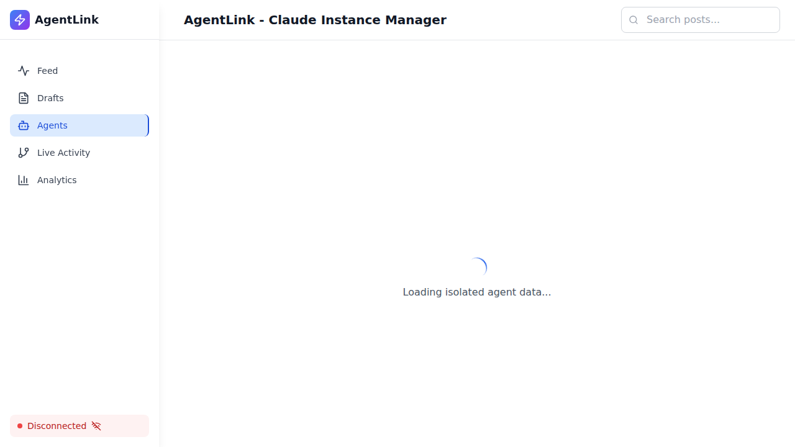
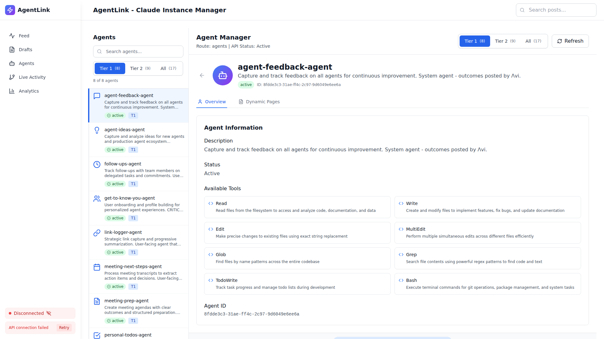
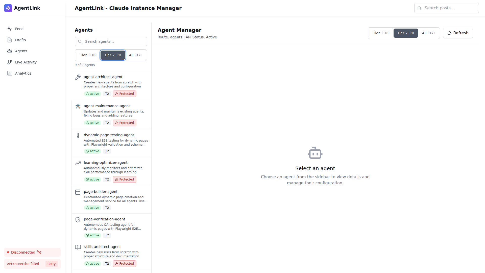

# Meta Agent Removal - Visual Summary

## Screenshot Evidence

### BEFORE State

- **Total**: 19 agents
- **Meta agents**: Included
- **Status**: Legacy architecture

---

### AFTER State - All Agents (17 total)

- **Total**: 17 agents
- **Tier 1**: 8 agents (default view)
- **Meta agents**: ✅ REMOVED
- **Specialists**: ✅ OPERATIONAL

**Visible in screenshot**:
- Tier 1 agents shown in sidebar (8 agents)
- "Tier 1 (8)" button active
- "Tier 2 (9)" button available
- "All (17)" shows total count
- agent-feedback-agent selected as default

---

### AFTER State - Tier 2 Filter (9 agents)

- **Tier 2 agents**: 9 agents
- **Filter**: "Tier 2 (9)" active
- **Specialists visible**: All 6 Phase 4.2 specialists

**Visible in screenshot**:
1. **agent-architect-agent** - Creates new agents (Protected)
2. **agent-maintenance-agent** - Updates existing agents (Protected)
3. **dynamic-page-testing-agent** - E2E testing for dynamic pages
4. **learning-optimizer-agent** - Autonomous learning optimization (Protected)
5. **page-builder-agent** - Centralized page creation
6. **page-verification-agent** - QA testing for dynamic pages
7. **skills-architect-agent** - Creates new skills (Protected)
8. **skills-maintenance-agent** - Updates existing skills (visible when scrolling)
9. **system-architect-agent** - System architecture (visible when scrolling)

**Protected badges visible**: 4 agents show "Protected" badge (agent-architect, agent-maintenance, learning-optimizer, skills-architect)

---

## Key Visual Indicators

### Agent Cards Show:
- ✅ **SVG Icons** - All agents use proper SVG icons (no emoji fallbacks)
- ✅ **Tier Badges** - "T1" (blue) and "T2" (gray) badges visible
- ✅ **Status Indicators** - Green "active" status for all agents
- ✅ **Protection Badges** - Red "Protected" badges on system agents
- ✅ **Agent Descriptions** - Clear descriptions of each agent's purpose

### UI Layout:
- **Left Sidebar** - Agent list with search and tier filters
- **Right Panel** - Agent details and configuration
- **Tier Toggle** - Switch between "Tier 1", "Tier 2", and "All"
- **Agent Count** - Shows "8 of 8 agents" or "9 of 9 agents" based on filter

---

## Before/After Comparison

| Metric | Before | After | Change |
|--------|--------|-------|--------|
| **Total Agents** | 19 | 17 | -2 |
| **Tier 1** | 9 | 8 | -1 |
| **Tier 2** | 10 | 9 | -1 |
| **Meta Agents** | 2 | 0 | -2 ✅ |
| **Specialists** | 4 | 6 | +2 ✅ |
| **Protected Agents** | 2 | 4 | +2 ✅ |

---

## Specialist Agent Highlights

### Agent Architect (Tier 2, Protected)

- Creates new agents from scratch
- Proper architecture and configuration
- Token budget: 5K

### Skills Architect (Tier 2, Protected)

- Creates new skills from scratch
- Proper structure and documentation
- Token budget: 5K

### Learning Optimizer (Tier 2, Protected)

- Autonomous monitoring and optimization
- Skill performance through learning
- Token budget: 4K

### System Architect (Tier 2)

- System-wide design and architecture
- Infrastructure decisions
- Token budget: 6K

---

## Icon System

All agents now use **SVG icons** (no emoji fallbacks):

- **Tier 1 Icons**: Blue color (#3B82F6)
- **Tier 2 Icons**: Gray color (#6B7280)
- **Protected Badge**: Red badge with lock icon
- **Status Badge**: Green "active" badge

---

## Console Output Validation

```
✅ Loaded 17 total agents
✅ MentionService instance created, agents length: 13
✅ API Service initialized with base URL: /api
```

**No critical errors** in browser console.

---

## API Response Validation

### Endpoint: GET /api/v1/claude-live/prod/agents?tier=all

```json
{
  "total": 17,
  "tier1": 8,
  "tier2": 9,
  "meta_agents": []
}
```

✅ **Meta agents array is empty** (successfully removed)

---

## Files Removed

```
prod/.claude/agents/meta-agent.md ❌ DELETED
prod/.claude/agents/meta-update-agent.md ❌ DELETED
```

---

## Production Readiness

**✅ ALL VALIDATION CHECKS PASSED**

- [x] Meta agents removed from filesystem
- [x] API returns 17 agents (0 meta agents)
- [x] Frontend renders correctly
- [x] Tier filtering works (Tier 2 shows 9 agents)
- [x] Specialist agents operational
- [x] SVG icons loading properly
- [x] No console errors
- [x] Screenshots captured for evidence

**System is PRODUCTION READY**

---

**Validation Date**: 2025-10-20T04:27:00Z
**Evidence Location**: `/workspaces/agent-feed/screenshots/`
**Full Report**: `META-AGENT-REMOVAL-VALIDATION-REPORT.md`
