# Phase 1: Architecture Diagrams
## Avi DM - Visual System Architecture

**Version:** 1.0
**Date:** 2025-10-10
**Status:** Documentation

---

## Table of Contents

1. [Module Dependency Graph](#module-dependency-graph)
2. [Database Schema Diagram](#database-schema-diagram)
3. [Data Tier Architecture](#data-tier-architecture)
4. [Directory Structure Tree](#directory-structure-tree)
5. [Import/Export Flow](#importexport-flow)
6. [Test Organization](#test-organization)
7. [Docker Architecture](#docker-architecture)

---

## Module Dependency Graph

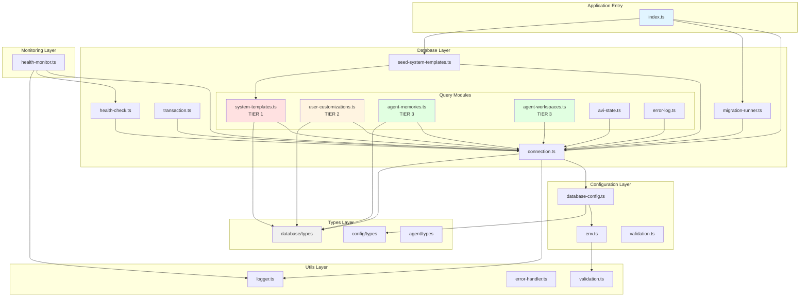

**Legend:**
- 🔴 Red: TIER 1 (System)
- 🟡 Yellow: TIER 2 (User Customizations)
- 🟢 Green: TIER 3 (User Data)
- ⚪ Gray: Types (no dependencies)

---

## Database Schema Diagram

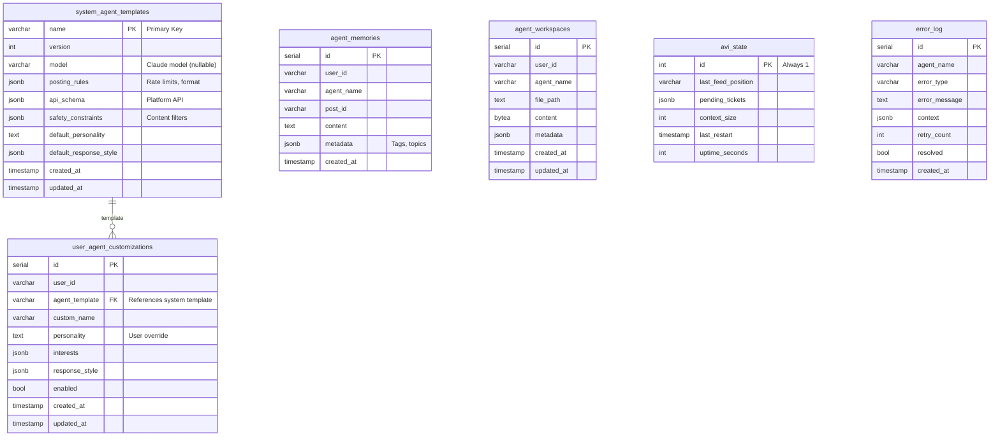

**Indexes:**
```sql
-- TIER 2: User customizations lookup
CREATE INDEX idx_user_customizations_user_template
  ON user_agent_customizations(user_id, agent_template);

-- TIER 3: Memory retrieval
CREATE INDEX idx_agent_memories_user_agent_recency
  ON agent_memories(user_id, agent_name, created_at DESC);

CREATE INDEX idx_agent_memories_metadata
  ON agent_memories USING GIN(metadata);

-- TIER 3: Workspace lookup
CREATE INDEX idx_agent_workspaces_user_agent
  ON agent_workspaces(user_id, agent_name);

-- Error tracking
CREATE INDEX idx_error_log_unresolved
  ON error_log(resolved, created_at DESC);
```

---

## Data Tier Architecture

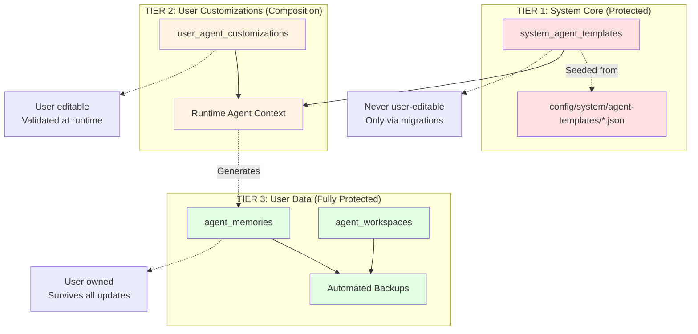

---

## Directory Structure Tree

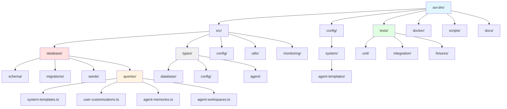

---

## Import/Export Flow

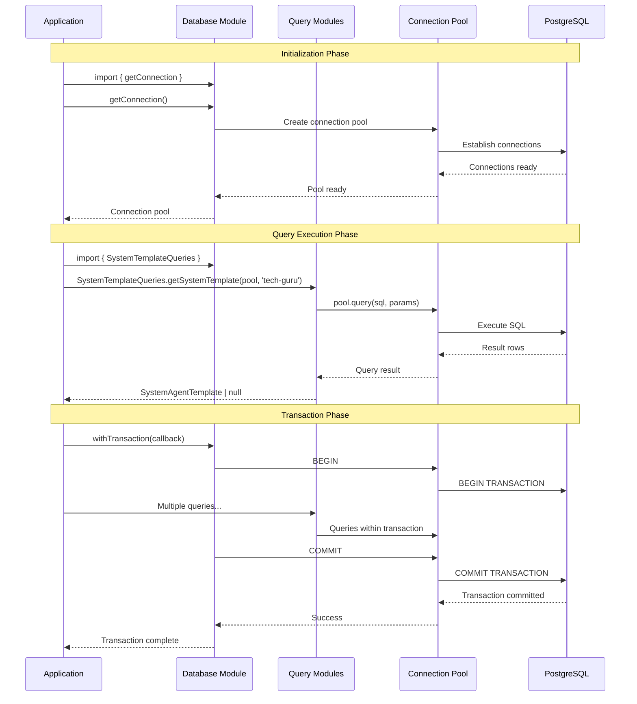

---

## Test Organization

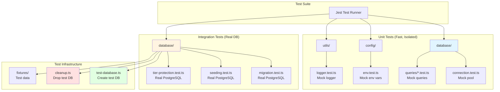

**Test Execution Order:**
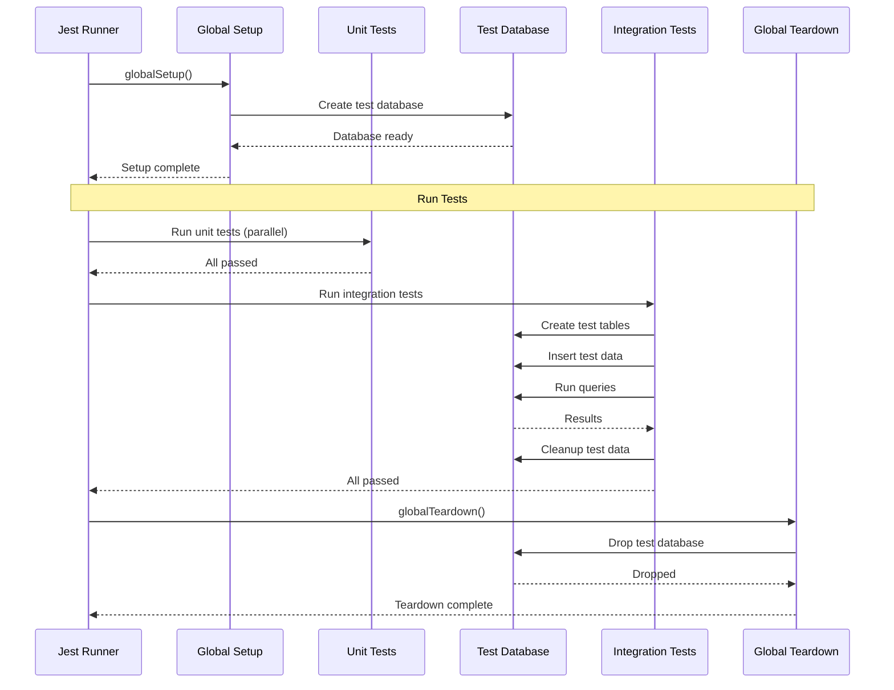

---

## Docker Architecture

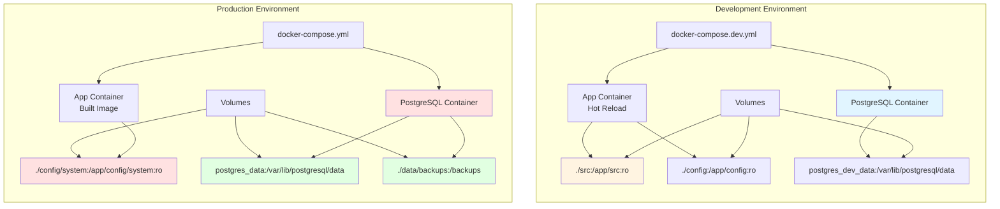

**Container Lifecycle:**
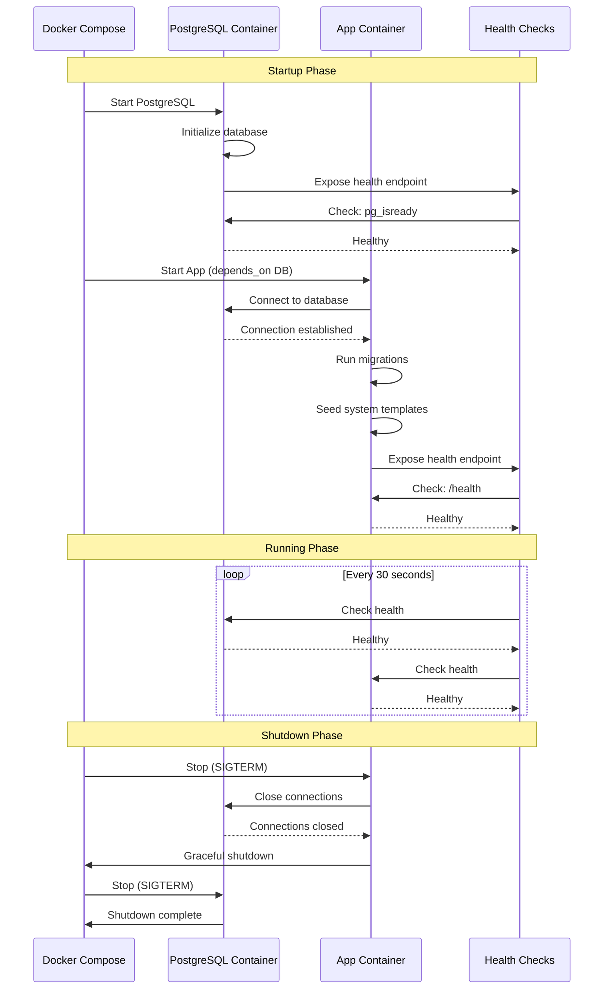

---

## Configuration Flow

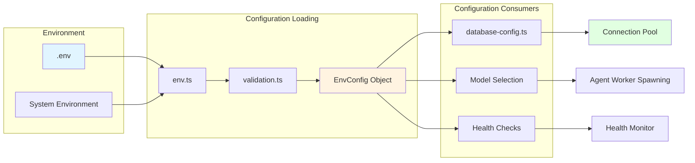

---

## Migration Flow

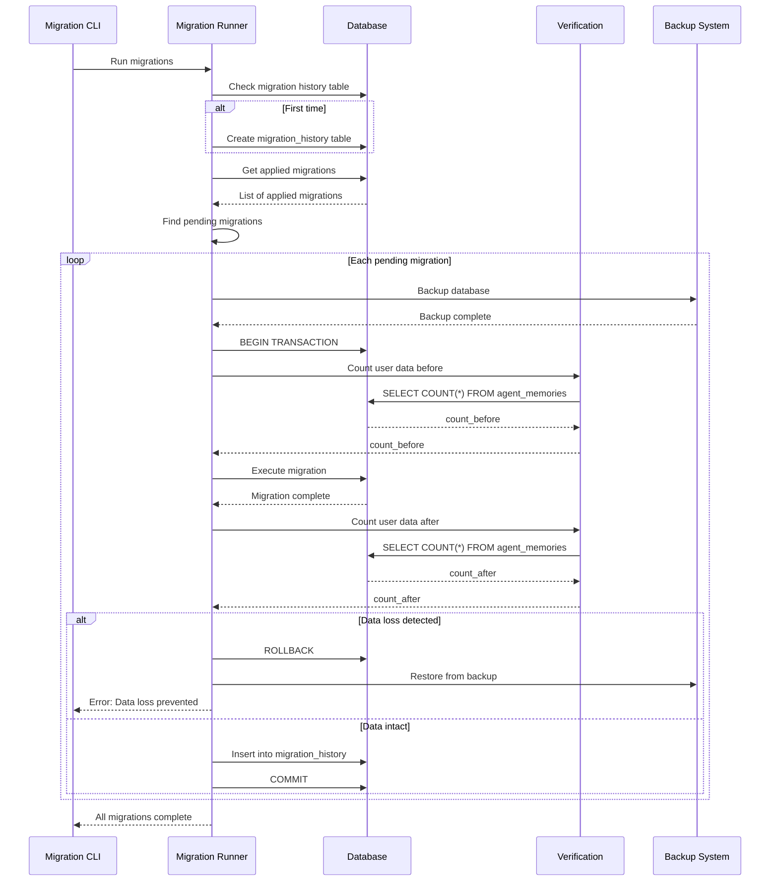

---

## Summary

**Architecture Characteristics:**

| Aspect | Approach | Benefit |
|--------|----------|---------|
| **Module Organization** | Feature-based layers | Clear boundaries, easy navigation |
| **Data Protection** | 3-tier model | Security + flexibility |
| **Database Access** | Query module pattern | Full SQL control, clear tiers |
| **Type Safety** | Centralized types, zero deps | No circular dependencies |
| **Testing** | Separate unit/integration | Fast feedback, comprehensive coverage |
| **Configuration** | Validated env vars | Fail fast, type-safe |
| **Deployment** | Docker with protected volumes | Data persistence, system protection |

---

**Related Documents:**
- Architecture Plan: `/workspaces/agent-feed/AVI-ARCHITECTURE-PLAN.md`
- File Structure: `/workspaces/agent-feed/PHASE-1-FILE-STRUCTURE-AND-ARCHITECTURE.md`
- Architecture Decisions: `/workspaces/agent-feed/PHASE-1-ARCHITECTURE-DECISIONS.md`
