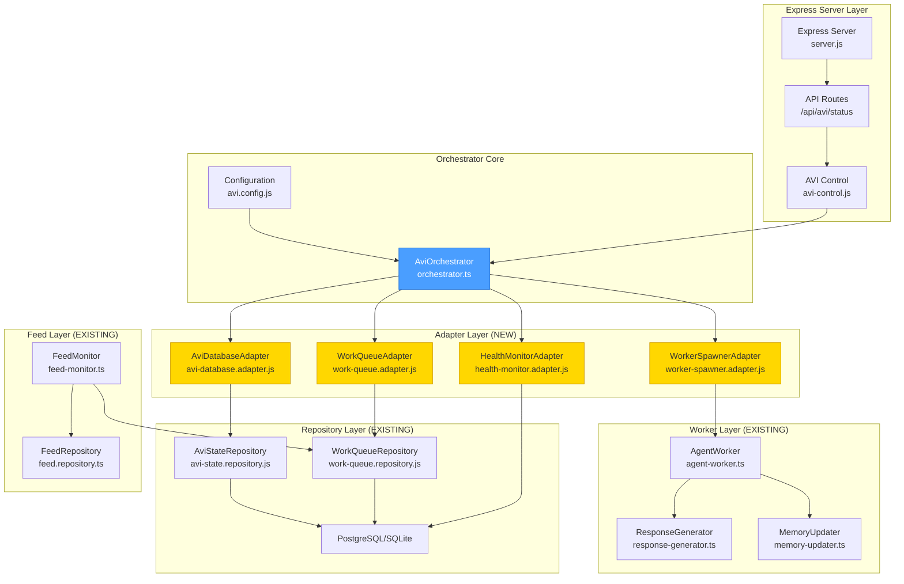
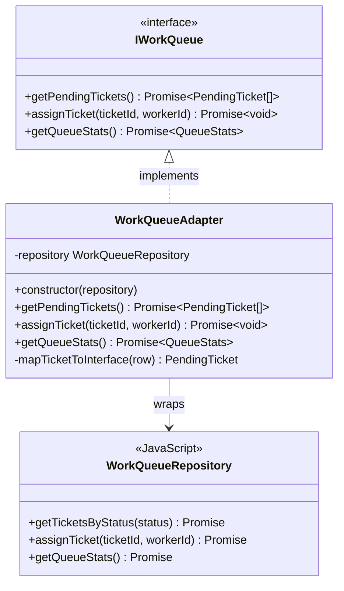
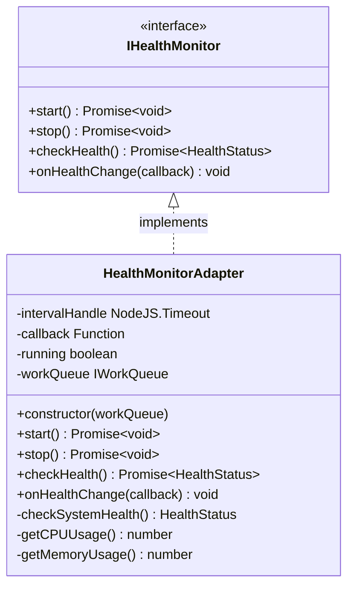
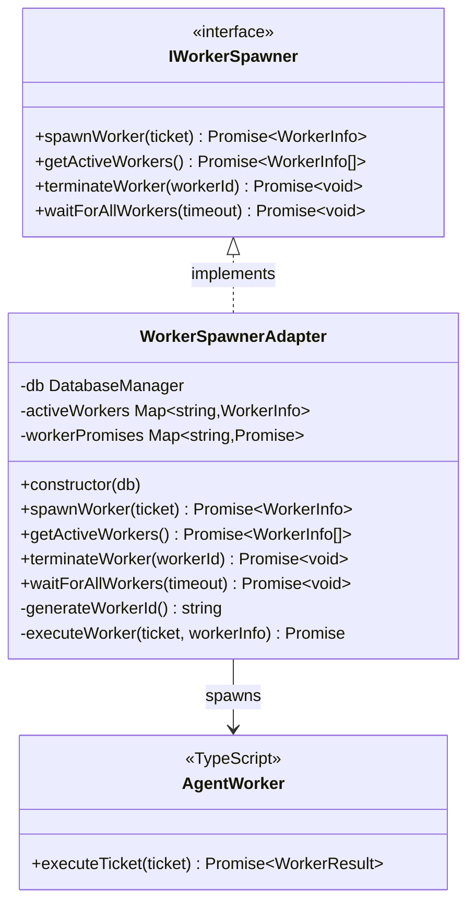
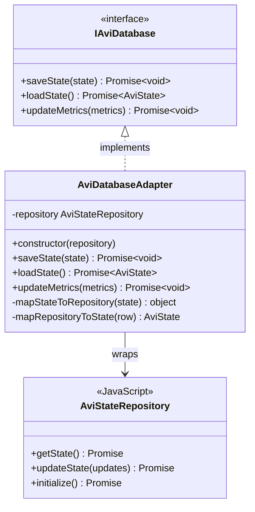
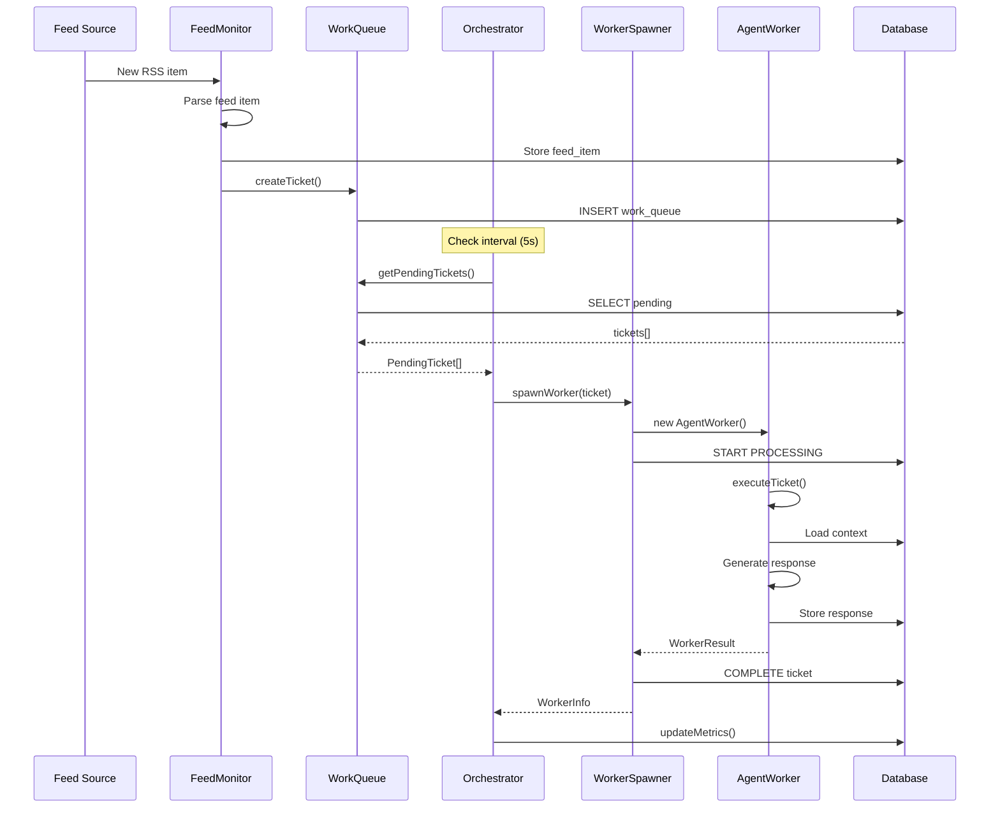
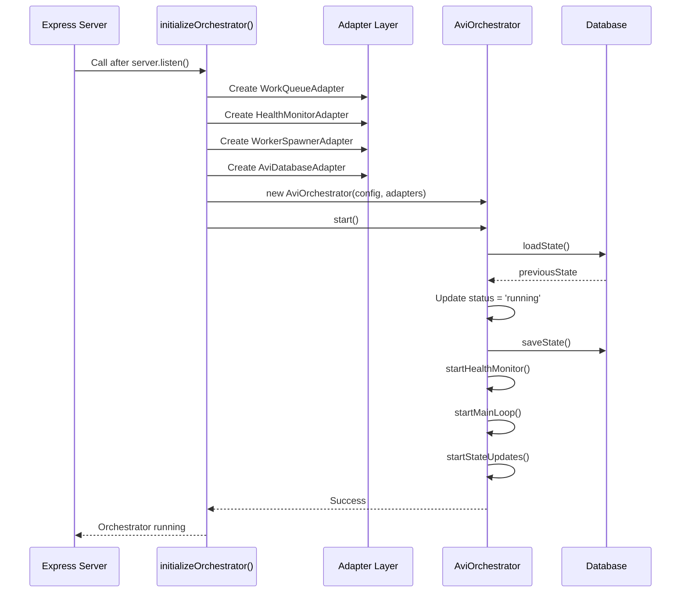
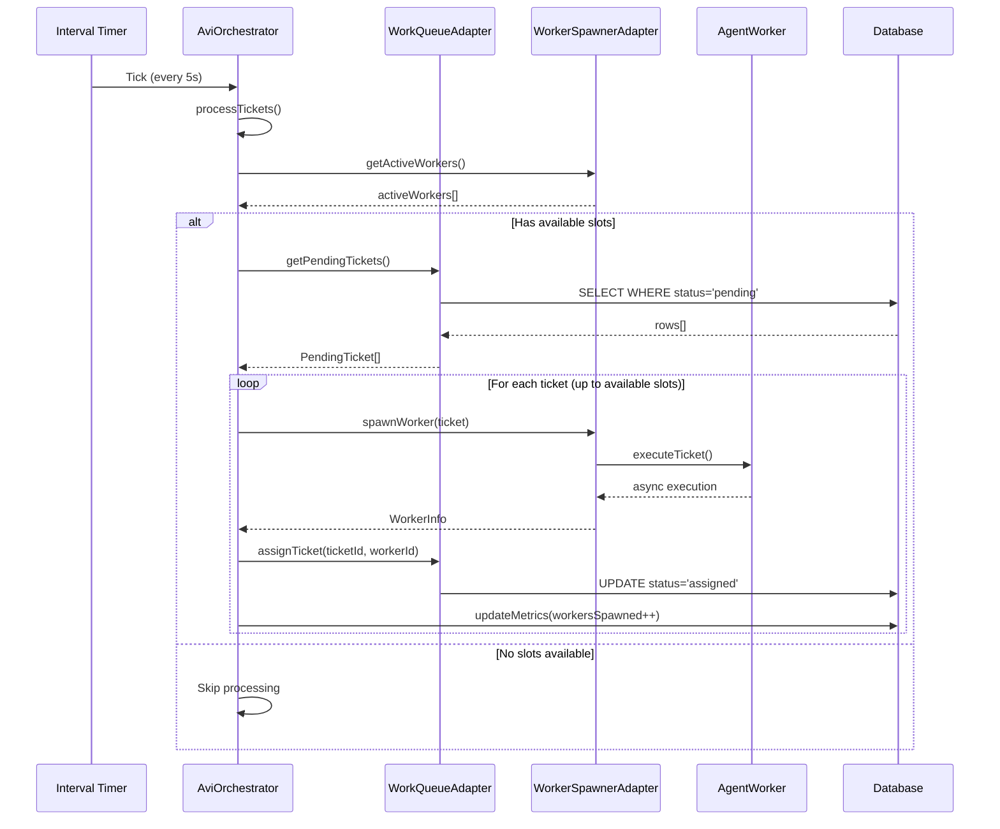
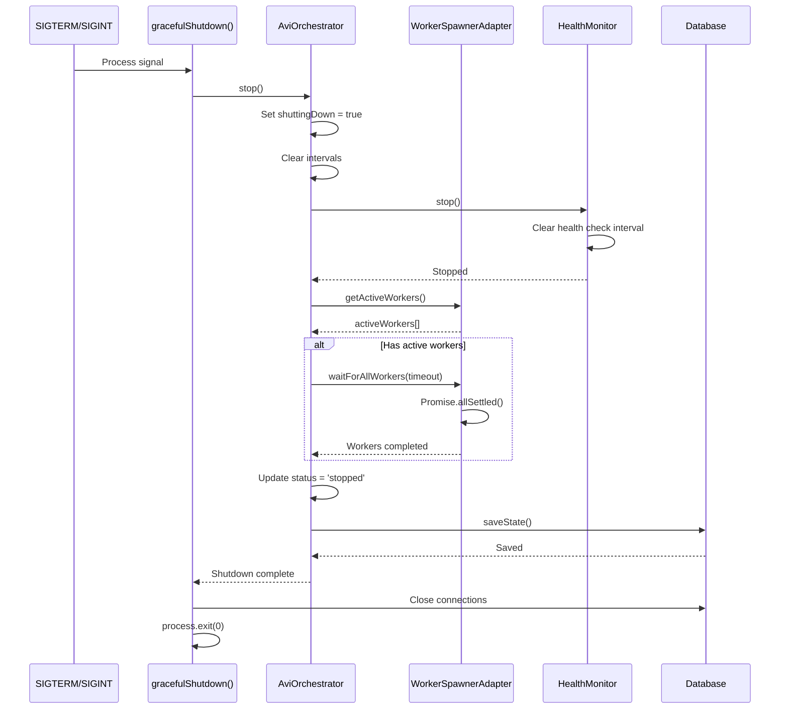

# Phase 2 Architecture Design: AVI Orchestrator Integration

**Document Version:** 1.0
**Date:** 2025-10-12
**Status:** Architecture Design Phase

---

## Table of Contents

1. [Overview](#overview)
2. [Component Architecture](#component-architecture)
3. [Adapter Design](#adapter-design)
4. [Server Integration](#server-integration)
5. [Data Flow](#data-flow)
6. [Sequence Diagrams](#sequence-diagrams)
7. [File Structure](#file-structure)
8. [Implementation Checklist](#implementation-checklist)

---

## Overview

Phase 2 integrates the AVI orchestrator with the existing Express server infrastructure. The orchestrator manages work ticket processing by spawning agent workers and coordinating with feed monitoring.

### Architecture Goals

1. **Minimal Code Changes**: Wrap existing repositories with adapter pattern
2. **Dependency Injection**: Clean initialization of orchestrator dependencies
3. **Graceful Lifecycle**: Proper startup, health monitoring, and shutdown
4. **Type Safety**: Full TypeScript interfaces with JS implementation adapters

### Key Integration Points

- **Work Queue**: Existing `work-queue.repository.js` → Adapter → Orchestrator
- **State Persistence**: Existing `avi-state.repository.js` → Adapter → Orchestrator
- **Worker Execution**: Existing `agent-worker.ts` → Adapter → Orchestrator
- **Feed Monitoring**: Existing `feed-monitor.ts` → Integration with orchestrator

---

## Component Architecture

### System Overview



### Component Responsibilities

| Component | Type | Responsibility |
|-----------|------|----------------|
| **AviOrchestrator** | Core | Main orchestration engine, ticket processing loop |
| **WorkQueueAdapter** | Adapter | Translate work-queue.repository.js to IWorkQueue interface |
| **HealthMonitorAdapter** | Adapter | System health checks (CPU, memory, queue depth) |
| **WorkerSpawnerAdapter** | Adapter | Spawn and manage AgentWorker instances |
| **AviDatabaseAdapter** | Adapter | Persist orchestrator state via avi-state.repository.js |
| **Express Server** | Integration | Initialize and lifecycle management |
| **FeedMonitor** | Integration | Create tickets when new feed items arrive |

---

## Adapter Design

### 1. WorkQueueAdapter

**Purpose**: Translate existing PostgreSQL repository to TypeScript interface



**Implementation File**: `/api-server/avi/adapters/work-queue.adapter.js`

```javascript
/**
 * WorkQueueAdapter - Implements IWorkQueue interface
 * Wraps work-queue.repository.js for orchestrator
 */
import workQueueRepository from '../../repositories/postgres/work-queue.repository.js';

export class WorkQueueAdapter {
  constructor(repository = workQueueRepository) {
    this.repository = repository;
  }

  /**
   * Get pending tickets from work queue
   * @returns {Promise<Array<PendingTicket>>}
   */
  async getPendingTickets() {
    const tickets = await this.repository.getTicketsByUser(null, {
      status: 'pending',
      limit: 100
    });

    return tickets.map(this.mapTicketToInterface);
  }

  /**
   * Assign ticket to worker
   * @param {string} ticketId - Ticket ID
   * @param {string} workerId - Worker ID
   * @returns {Promise<void>}
   */
  async assignTicket(ticketId, workerId) {
    await this.repository.assignTicket(parseInt(ticketId), workerId);
  }

  /**
   * Get queue statistics
   * @returns {Promise<QueueStats>}
   */
  async getQueueStats() {
    const stats = await this.repository.getQueueStats();

    return {
      pending: parseInt(stats.pending_count) || 0,
      processing: parseInt(stats.processing_count) || 0,
      completed: parseInt(stats.completed_count) || 0,
      failed: parseInt(stats.failed_count) || 0
    };
  }

  /**
   * Map database row to PendingTicket interface
   * @private
   */
  mapTicketToInterface(row) {
    return {
      id: row.id.toString(),
      userId: row.user_id,
      feedId: row.post_id, // Maps to feed_item_id
      priority: row.priority || 0,
      createdAt: new Date(row.created_at),
      retryCount: row.retry_count || 0
    };
  }
}
```

---

### 2. HealthMonitorAdapter

**Purpose**: Monitor system health (CPU, memory, queue depth)



**Implementation File**: `/api-server/avi/adapters/health-monitor.adapter.js`

```javascript
/**
 * HealthMonitorAdapter - Implements IHealthMonitor interface
 * Monitors system health and triggers callbacks on issues
 */
import os from 'os';

export class HealthMonitorAdapter {
  constructor(workQueue, checkInterval = 30000) {
    this.workQueue = workQueue;
    this.checkInterval = checkInterval;
    this.intervalHandle = null;
    this.callback = null;
    this.running = false;
  }

  /**
   * Start health monitoring
   * @returns {Promise<void>}
   */
  async start() {
    if (this.running) return;

    this.running = true;
    this.intervalHandle = setInterval(async () => {
      const health = await this.checkHealth();

      if (this.callback) {
        this.callback(health);
      }
    }, this.checkInterval);
  }

  /**
   * Stop health monitoring
   * @returns {Promise<void>}
   */
  async stop() {
    if (this.intervalHandle) {
      clearInterval(this.intervalHandle);
      this.intervalHandle = null;
    }
    this.running = false;
  }

  /**
   * Check current health status
   * @returns {Promise<HealthStatus>}
   */
  async checkHealth() {
    const cpuUsage = this.getCPUUsage();
    const memoryUsage = this.getMemoryUsage();
    const stats = await this.workQueue.getQueueStats();
    const activeWorkers = stats.processing || 0;
    const queueDepth = stats.pending || 0;

    const issues = [];
    let healthy = true;

    // Check CPU
    if (cpuUsage > 90) {
      issues.push('CPU usage above 90%');
      healthy = false;
    }

    // Check memory
    if (memoryUsage > 85) {
      issues.push('Memory usage above 85%');
      healthy = false;
    }

    // Check queue depth
    if (queueDepth > 1000) {
      issues.push('Queue depth exceeds 1000 tickets');
      healthy = false;
    }

    return {
      healthy,
      timestamp: new Date(),
      metrics: {
        cpuUsage,
        memoryUsage,
        activeWorkers,
        queueDepth
      },
      issues: issues.length > 0 ? issues : undefined
    };
  }

  /**
   * Register callback for health changes
   * @param {Function} callback - Called with HealthStatus on each check
   */
  onHealthChange(callback) {
    this.callback = callback;
  }

  /**
   * Get CPU usage percentage
   * @private
   * @returns {number} CPU usage 0-100
   */
  getCPUUsage() {
    const cpus = os.cpus();
    let totalIdle = 0;
    let totalTick = 0;

    cpus.forEach(cpu => {
      for (const type in cpu.times) {
        totalTick += cpu.times[type];
      }
      totalIdle += cpu.times.idle;
    });

    const idle = totalIdle / cpus.length;
    const total = totalTick / cpus.length;
    const usage = 100 - ~~(100 * idle / total);

    return usage;
  }

  /**
   * Get memory usage percentage
   * @private
   * @returns {number} Memory usage 0-100
   */
  getMemoryUsage() {
    const totalMem = os.totalmem();
    const freeMem = os.freemem();
    const usedMem = totalMem - freeMem;
    const usage = (usedMem / totalMem) * 100;

    return Math.round(usage);
  }
}
```

---

### 3. WorkerSpawnerAdapter

**Purpose**: Spawn AgentWorker instances and track their lifecycle



**Implementation File**: `/api-server/avi/adapters/worker-spawner.adapter.js`

```javascript
/**
 * WorkerSpawnerAdapter - Implements IWorkerSpawner interface
 * Spawns and manages AgentWorker instances
 */
import { AgentWorker } from '../../../src/worker/agent-worker.js';
import workQueueRepository from '../../repositories/postgres/work-queue.repository.js';

export class WorkerSpawnerAdapter {
  constructor(db) {
    this.db = db;
    this.activeWorkers = new Map();
    this.workerPromises = new Map();
    this.workerCounter = 0;
  }

  /**
   * Spawn a new worker for a ticket
   * @param {PendingTicket} ticket - Ticket to process
   * @returns {Promise<WorkerInfo>}
   */
  async spawnWorker(ticket) {
    const workerId = this.generateWorkerId();

    const workerInfo = {
      id: workerId,
      ticketId: ticket.id,
      status: 'spawning',
      startTime: new Date()
    };

    this.activeWorkers.set(workerId, workerInfo);

    // Create worker promise (async execution)
    const promise = this.executeWorker(ticket, workerInfo);
    this.workerPromises.set(workerId, promise);

    // Update status to running
    workerInfo.status = 'running';

    return workerInfo;
  }

  /**
   * Get active workers
   * @returns {Promise<WorkerInfo[]>}
   */
  async getActiveWorkers() {
    return Array.from(this.activeWorkers.values());
  }

  /**
   * Terminate a specific worker
   * @param {string} workerId - Worker ID
   * @returns {Promise<void>}
   */
  async terminateWorker(workerId) {
    const worker = this.activeWorkers.get(workerId);
    if (!worker) return;

    // Mark as terminated
    worker.status = 'failed';
    worker.endTime = new Date();
    worker.error = 'Terminated by orchestrator';

    // Remove from active workers
    this.activeWorkers.delete(workerId);
    this.workerPromises.delete(workerId);
  }

  /**
   * Wait for all workers to complete
   * @param {number} timeout - Timeout in milliseconds
   * @returns {Promise<void>}
   */
  async waitForAllWorkers(timeout) {
    const promises = Array.from(this.workerPromises.values());

    if (promises.length === 0) return;

    const timeoutPromise = new Promise((resolve) => {
      setTimeout(resolve, timeout);
    });

    await Promise.race([
      Promise.allSettled(promises),
      timeoutPromise
    ]);
  }

  /**
   * Execute worker for ticket
   * @private
   */
  async executeWorker(ticket, workerInfo) {
    try {
      // Mark ticket as processing
      await workQueueRepository.startProcessing(parseInt(ticket.id));

      // Create work ticket object for AgentWorker
      const workTicket = await this.loadWorkTicket(ticket.id);

      // Execute worker
      const worker = new AgentWorker(this.db);
      const result = await worker.executeTicket(workTicket);

      // Update worker info
      workerInfo.status = result.success ? 'completed' : 'failed';
      workerInfo.endTime = new Date();
      if (!result.success) {
        workerInfo.error = result.error;
      }

      // Update ticket status
      if (result.success) {
        await workQueueRepository.completeTicket(
          parseInt(ticket.id),
          { responseId: result.responseId }
        );
      } else {
        await workQueueRepository.failTicket(
          parseInt(ticket.id),
          result.error
        );
      }

    } catch (error) {
      workerInfo.status = 'failed';
      workerInfo.endTime = new Date();
      workerInfo.error = error.message;

      await workQueueRepository.failTicket(
        parseInt(ticket.id),
        error.message
      );
    } finally {
      // Remove from active workers
      this.activeWorkers.delete(workerInfo.id);
      this.workerPromises.delete(workerInfo.id);
    }
  }

  /**
   * Load full work ticket from database
   * @private
   */
  async loadWorkTicket(ticketId) {
    const ticket = await workQueueRepository.getTicketById(parseInt(ticketId));

    if (!ticket) {
      throw new Error(`Work ticket not found: ${ticketId}`);
    }

    return {
      id: ticket.id.toString(),
      type: 'post_response',
      priority: ticket.priority,
      agentName: ticket.assigned_agent,
      userId: ticket.user_id,
      payload: {
        feedItemId: ticket.post_id,
        content: ticket.post_content,
        metadata: ticket.post_metadata || {}
      },
      createdAt: new Date(ticket.created_at),
      status: ticket.status
    };
  }

  /**
   * Generate unique worker ID
   * @private
   */
  generateWorkerId() {
    return `worker-${Date.now()}-${this.workerCounter++}`;
  }
}
```

---

### 4. AviDatabaseAdapter

**Purpose**: Persist orchestrator state using avi-state.repository.js



**Implementation File**: `/api-server/avi/adapters/avi-database.adapter.js`

```javascript
/**
 * AviDatabaseAdapter - Implements IAviDatabase interface
 * Wraps avi-state.repository.js for orchestrator state persistence
 */
import aviStateRepository from '../../repositories/postgres/avi-state.repository.js';

export class AviDatabaseAdapter {
  constructor(repository = aviStateRepository) {
    this.repository = repository;
  }

  /**
   * Save orchestrator state
   * @param {AviState} state - Current orchestrator state
   * @returns {Promise<void>}
   */
  async saveState(state) {
    const updates = {
      status: state.status,
      start_time: state.startTime,
      tickets_processed: state.ticketsProcessed,
      workers_spawned: state.workersSpawned,
      active_workers: state.activeWorkers,
      last_health_check: state.lastHealthCheck || null,
      last_error: state.lastError || null
    };

    await this.repository.updateState(updates);
  }

  /**
   * Load orchestrator state
   * @returns {Promise<AviState|null>}
   */
  async loadState() {
    const row = await this.repository.getState();

    if (!row) return null;

    return {
      status: row.status || 'initializing',
      startTime: row.start_time ? new Date(row.start_time) : new Date(),
      ticketsProcessed: row.tickets_processed || 0,
      workersSpawned: row.workers_spawned || 0,
      activeWorkers: row.active_workers || 0,
      lastHealthCheck: row.last_health_check ? new Date(row.last_health_check) : undefined,
      lastError: row.last_error || undefined
    };
  }

  /**
   * Update metrics
   * @param {object} metrics - Metrics to update
   * @returns {Promise<void>}
   */
  async updateMetrics(metrics) {
    const updates = {};

    if (metrics.ticketsProcessed !== undefined) {
      updates.tickets_processed = metrics.ticketsProcessed;
    }

    if (metrics.workersSpawned !== undefined) {
      updates.workers_spawned = metrics.workersSpawned;
    }

    await this.repository.updateState(updates);
  }
}
```

---

## Server Integration

### Express Server Initialization

**File**: `/api-server/server.js` (modifications)

```javascript
// Add import at top
import { AviOrchestrator } from '../src/avi/orchestrator.js';
import { WorkQueueAdapter } from './avi/adapters/work-queue.adapter.js';
import { HealthMonitorAdapter } from './avi/adapters/health-monitor.adapter.js';
import { WorkerSpawnerAdapter } from './avi/adapters/worker-spawner.adapter.js';
import { AviDatabaseAdapter } from './avi/adapters/avi-database.adapter.js';
import aviConfig from './avi/avi.config.js';
import postgresManager from './config/postgres.js';

// Global orchestrator instance
let orchestrator = null;

// Initialize orchestrator after database connection
async function initializeOrchestrator() {
  try {
    console.log('🚀 Initializing AVI Orchestrator...');

    // Create adapters
    const workQueue = new WorkQueueAdapter();
    const healthMonitor = new HealthMonitorAdapter(workQueue);
    const workerSpawner = new WorkerSpawnerAdapter(postgresManager);
    const database = new AviDatabaseAdapter();

    // Create orchestrator
    orchestrator = new AviOrchestrator(
      aviConfig,
      workQueue,
      healthMonitor,
      workerSpawner,
      database
    );

    // Start orchestrator
    await orchestrator.start();

    console.log('✅ AVI Orchestrator running');
  } catch (error) {
    console.error('❌ Failed to initialize orchestrator:', error);
    throw error;
  }
}

// Graceful shutdown handler
async function gracefulShutdown(signal) {
  console.log(`\n${signal} received. Shutting down gracefully...`);

  // Stop orchestrator first
  if (orchestrator) {
    try {
      await orchestrator.stop();
      console.log('✅ Orchestrator stopped');
    } catch (error) {
      console.error('❌ Error stopping orchestrator:', error);
    }
  }

  // Close database connections
  if (db) {
    db.close();
    console.log('✅ SQLite database closed');
  }

  if (agentPagesDb) {
    agentPagesDb.close();
    console.log('✅ Agent pages database closed');
  }

  // Close PostgreSQL pool
  await postgresManager.end();
  console.log('✅ PostgreSQL pool closed');

  // Stop file watcher
  if (fileWatcher) {
    fileWatcher.close();
    console.log('✅ File watcher closed');
  }

  process.exit(0);
}

// Register signal handlers
process.on('SIGTERM', () => gracefulShutdown('SIGTERM'));
process.on('SIGINT', () => gracefulShutdown('SIGINT'));

// Start server with orchestrator
const server = app.listen(PORT, async () => {
  console.log(`Server running on port ${PORT}`);

  // Initialize orchestrator after server starts
  if (process.env.AVI_ORCHESTRATOR_ENABLED !== 'false') {
    await initializeOrchestrator();
  }
});

// Export orchestrator for routes
export { orchestrator };
```

### Configuration File

**File**: `/api-server/avi/avi.config.js`

```javascript
/**
 * AVI Orchestrator Configuration
 * Loaded from environment variables with defaults
 */
export default {
  // Maximum concurrent workers
  maxConcurrentWorkers: parseInt(process.env.AVI_MAX_WORKERS) || 10,

  // Check interval for pending tickets (ms)
  checkInterval: parseInt(process.env.AVI_CHECK_INTERVAL) || 5000,

  // Enable health monitoring
  enableHealthMonitor: process.env.AVI_HEALTH_MONITOR !== 'false',

  // Health check interval (ms)
  healthCheckInterval: parseInt(process.env.AVI_HEALTH_INTERVAL) || 30000,

  // Graceful shutdown timeout (ms)
  shutdownTimeout: parseInt(process.env.AVI_SHUTDOWN_TIMEOUT) || 30000,

  // Context bloat threshold (tokens)
  contextBloatThreshold: parseInt(process.env.AVI_CONTEXT_LIMIT) || 50000,

  // Worker timeout (ms)
  workerTimeout: parseInt(process.env.AVI_WORKER_TIMEOUT) || 120000
};
```

---

## Data Flow

### Post → Ticket → Worker Flow



### Priority Calculation

Tickets are processed by priority:

```javascript
// In FeedMonitor
calculatePriority(responseConfig) {
  const configPriority = responseConfig?.priority;

  if (configPriority === 'high') return 10;
  if (configPriority === 'low') return 1;
  return 5; // medium
}
```

Queue processes: **High (10) → Medium (5) → Low (1)**

---

## Sequence Diagrams

### 1. Orchestrator Startup



### 2. Ticket Processing



### 3. Graceful Shutdown



---

## File Structure

### New Files to Create

```
/workspaces/agent-feed/
├── api-server/
│   └── avi/
│       ├── adapters/                       # NEW DIRECTORY
│       │   ├── work-queue.adapter.js       # IWorkQueue implementation
│       │   ├── health-monitor.adapter.js   # IHealthMonitor implementation
│       │   ├── worker-spawner.adapter.js   # IWorkerSpawner implementation
│       │   └── avi-database.adapter.js     # IAviDatabase implementation
│       └── avi.config.js                   # NEW - Configuration
├── src/
│   └── avi/
│       └── orchestrator.ts                 # EXISTING - Core orchestrator
└── PHASE-2-ARCHITECTURE-DESIGN.md          # THIS FILE
```

### Modified Files

```
/workspaces/agent-feed/
├── api-server/
│   ├── server.js                           # MODIFY - Add orchestrator init
│   └── routes/
│       └── avi-control.js                  # MODIFY - Add status endpoint
└── src/
    └── feed/
        └── feed-monitor.ts                 # MODIFY - Integration with orchestrator
```

---

## Implementation Checklist

### Phase 2A: Adapter Implementation

- [ ] Create `/api-server/avi/adapters/` directory
- [ ] Implement `work-queue.adapter.js`
  - [ ] `getPendingTickets()` method
  - [ ] `assignTicket()` method
  - [ ] `getQueueStats()` method
  - [ ] `mapTicketToInterface()` helper
- [ ] Implement `health-monitor.adapter.js`
  - [ ] `start()` method with interval
  - [ ] `stop()` method
  - [ ] `checkHealth()` method
  - [ ] `onHealthChange()` callback registration
  - [ ] `getCPUUsage()` helper
  - [ ] `getMemoryUsage()` helper
- [ ] Implement `worker-spawner.adapter.js`
  - [ ] `spawnWorker()` method
  - [ ] `getActiveWorkers()` method
  - [ ] `terminateWorker()` method
  - [ ] `waitForAllWorkers()` method
  - [ ] `executeWorker()` async handler
  - [ ] `loadWorkTicket()` helper
- [ ] Implement `avi-database.adapter.js`
  - [ ] `saveState()` method
  - [ ] `loadState()` method
  - [ ] `updateMetrics()` method

### Phase 2B: Configuration

- [ ] Create `avi.config.js`
  - [ ] Load from environment variables
  - [ ] Provide sensible defaults
  - [ ] Export config object

### Phase 2C: Server Integration

- [ ] Modify `server.js`
  - [ ] Import orchestrator and adapters
  - [ ] Create `initializeOrchestrator()` function
  - [ ] Create adapter instances
  - [ ] Initialize orchestrator with adapters
  - [ ] Call after server starts
  - [ ] Create `gracefulShutdown()` handler
  - [ ] Register SIGTERM/SIGINT handlers
  - [ ] Export orchestrator instance
- [ ] Update `avi-control.js` routes
  - [ ] Add `/api/avi/status` endpoint
  - [ ] Return orchestrator state
  - [ ] Add `/api/avi/metrics` endpoint
  - [ ] Return health and queue metrics

### Phase 2D: Testing

- [ ] Unit tests for adapters
  - [ ] WorkQueueAdapter tests
  - [ ] HealthMonitorAdapter tests
  - [ ] WorkerSpawnerAdapter tests
  - [ ] AviDatabaseAdapter tests
- [ ] Integration tests
  - [ ] Server startup with orchestrator
  - [ ] Ticket processing flow
  - [ ] Graceful shutdown
- [ ] Manual testing
  - [ ] Start server
  - [ ] Create feed with automation enabled
  - [ ] Verify tickets created
  - [ ] Verify workers spawned
  - [ ] Verify responses generated
  - [ ] Test shutdown (Ctrl+C)

### Phase 2E: Documentation

- [ ] Update README with orchestrator setup
- [ ] Document environment variables
- [ ] Create API documentation for AVI endpoints
- [ ] Update deployment guide

---

## Environment Variables

```bash
# AVI Orchestrator Configuration
AVI_ORCHESTRATOR_ENABLED=true          # Enable/disable orchestrator
AVI_MAX_WORKERS=10                      # Maximum concurrent workers
AVI_CHECK_INTERVAL=5000                 # Ticket check interval (ms)
AVI_HEALTH_MONITOR=true                 # Enable health monitoring
AVI_HEALTH_INTERVAL=30000               # Health check interval (ms)
AVI_SHUTDOWN_TIMEOUT=30000              # Graceful shutdown timeout (ms)
AVI_CONTEXT_LIMIT=50000                 # Context bloat threshold (tokens)
AVI_WORKER_TIMEOUT=120000               # Worker timeout (ms)
```

---

## API Endpoints

### GET /api/avi/status

Returns current orchestrator status.

**Response:**
```json
{
  "status": "running",
  "startTime": "2025-10-12T10:30:00.000Z",
  "ticketsProcessed": 42,
  "workersSpawned": 38,
  "activeWorkers": 3,
  "lastHealthCheck": "2025-10-12T12:45:30.000Z",
  "lastError": null
}
```

### GET /api/avi/metrics

Returns orchestrator metrics and health.

**Response:**
```json
{
  "orchestrator": {
    "uptime": 7200000,
    "status": "running",
    "activeWorkers": 3,
    "ticketsProcessed": 42
  },
  "queue": {
    "pending": 15,
    "processing": 3,
    "completed": 42,
    "failed": 2
  },
  "health": {
    "healthy": true,
    "cpuUsage": 45,
    "memoryUsage": 62,
    "queueDepth": 15,
    "issues": []
  }
}
```

---

## Success Criteria

Phase 2 is complete when:

1. ✅ All 4 adapters are implemented and tested
2. ✅ Server starts orchestrator on initialization
3. ✅ Orchestrator processes tickets from queue
4. ✅ Workers spawn and execute successfully
5. ✅ State persists to database
6. ✅ Health monitoring reports status
7. ✅ Graceful shutdown completes cleanly
8. ✅ API endpoints return correct data
9. ✅ Integration tests pass
10. ✅ Documentation is updated

---

## Next Phase

**Phase 3**: Feed Integration & Automation

- Integrate FeedMonitor with orchestrator
- Implement automated ticket creation
- Add response posting to social platforms
- Create admin dashboard for monitoring

---

## Architecture Review Notes

### Design Decisions

1. **Adapter Pattern**: Chose adapters over direct integration to:
   - Keep existing repositories unchanged
   - Enable easy testing with mocks
   - Support future database migrations

2. **Dependency Injection**: Orchestrator receives dependencies via constructor:
   - Enables unit testing
   - Clear dependency graph
   - Easy to swap implementations

3. **Graceful Shutdown**: Multi-stage shutdown:
   - Stop accepting new tickets
   - Wait for active workers (with timeout)
   - Persist final state
   - Close database connections

4. **Health Monitoring**: Separate adapter for health checks:
   - Non-blocking health checks
   - Callback-based notifications
   - System metrics (CPU, memory)
   - Application metrics (queue depth)

### Trade-offs

| Decision | Pros | Cons |
|----------|------|------|
| JavaScript adapters | Easy integration with existing code | No compile-time type checking |
| 5-second check interval | Responsive, low database load | Not real-time |
| Worker spawning (not pooling) | Simple implementation | Higher overhead per ticket |
| Single orchestrator instance | Simple state management | Not horizontally scalable |

### Future Enhancements

1. **Worker Pooling**: Pre-spawn workers for faster processing
2. **Distributed Orchestration**: Multiple orchestrator instances with leader election
3. **Real-time Events**: WebSocket updates for ticket processing
4. **Advanced Scheduling**: Time-based and conditional ticket processing
5. **Metrics Dashboard**: Real-time monitoring UI

---

**End of Architecture Design Document**
