# Phase 4: Validation & Error Handling Architecture

## Overview

Phase 4 implements a comprehensive validation and error handling system for the AVI orchestrator. This phase adds intelligent post-validation, multi-strategy retry logic, user escalation, and orchestrator integration.

**Key Components:**
- **ValidationService**: Post validation with rule-based and optional LLM checks
- **RetryService**: Multi-strategy retry with exponential backoff
- **EscalationService**: User notification and error logging
- **PostValidator**: Orchestrator integration layer

---

## Table of Contents

1. [System Architecture](#system-architecture)
2. [Component Design](#component-design)
3. [Sequence Diagrams](#sequence-diagrams)
4. [State Machine](#state-machine)
5. [File Structure](#file-structure)
6. [TypeScript Implementations](#typescript-implementations)
7. [Configuration Schema](#configuration-schema)
8. [Integration Points](#integration-points)
9. [Error Handling Strategy](#error-handling-strategy)

---

## 1. System Architecture

### High-Level Component Diagram

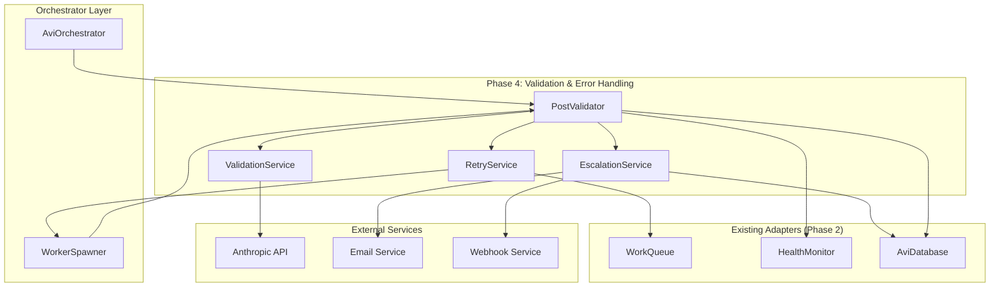

### Component Interaction Flow

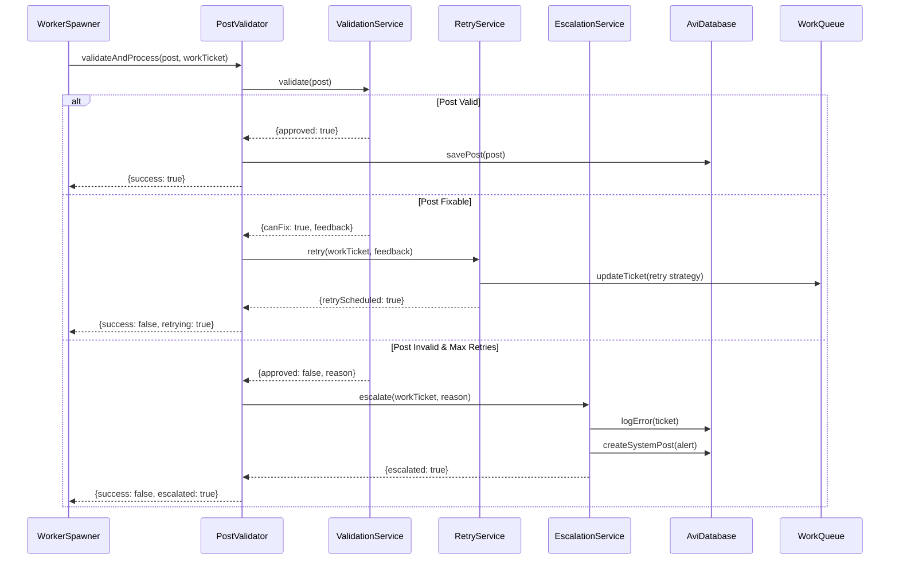

---

## 2. Component Design

### 2.1 PostValidator Class Diagram

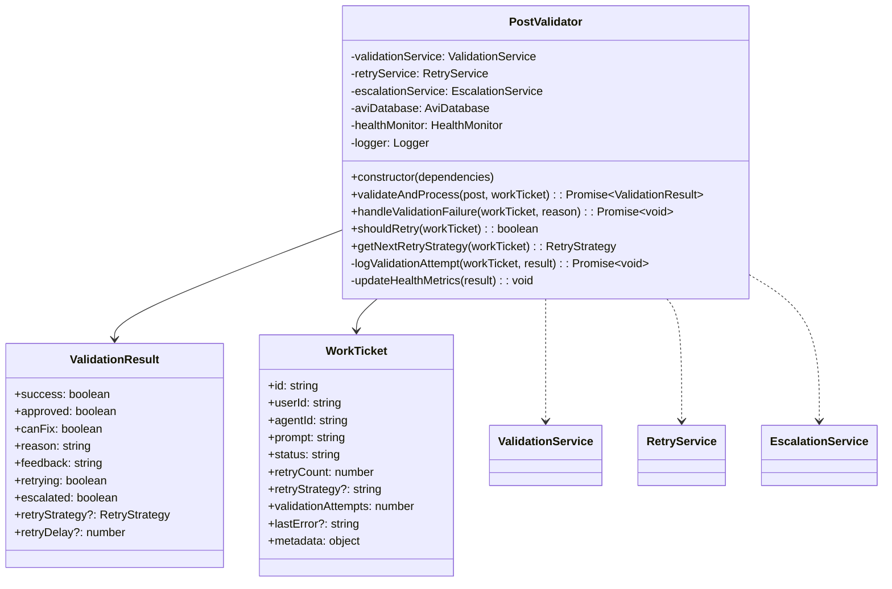

### 2.2 ValidationService Class Diagram

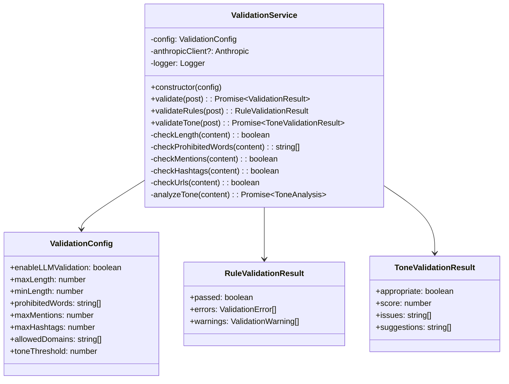

### 2.3 RetryService Class Diagram

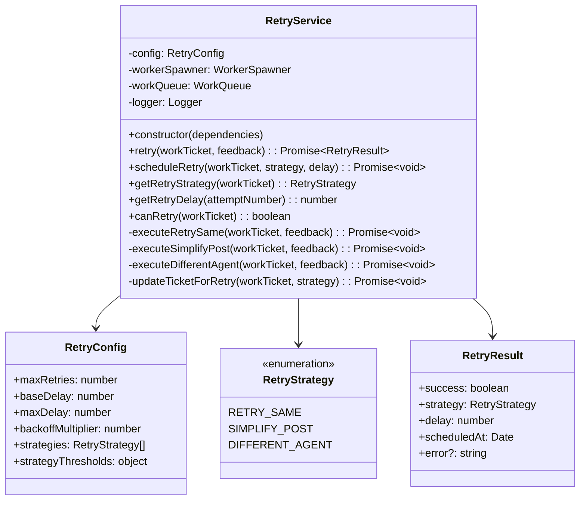

### 2.4 EscalationService Class Diagram

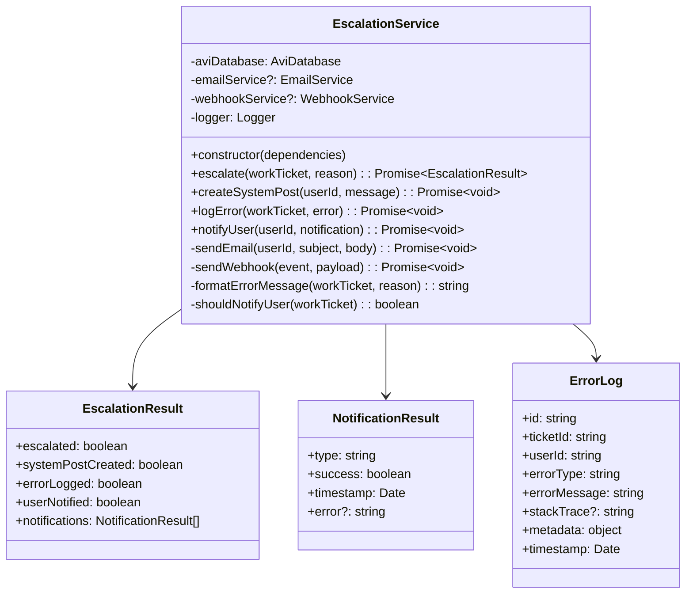

---

## 3. Sequence Diagrams

### 3.1 Successful Validation Flow

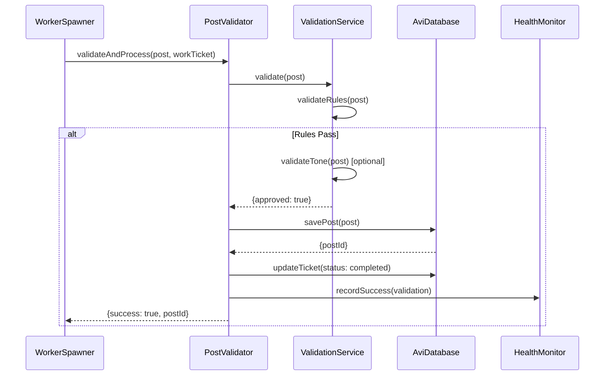

### 3.2 Retry Flow - Same Agent

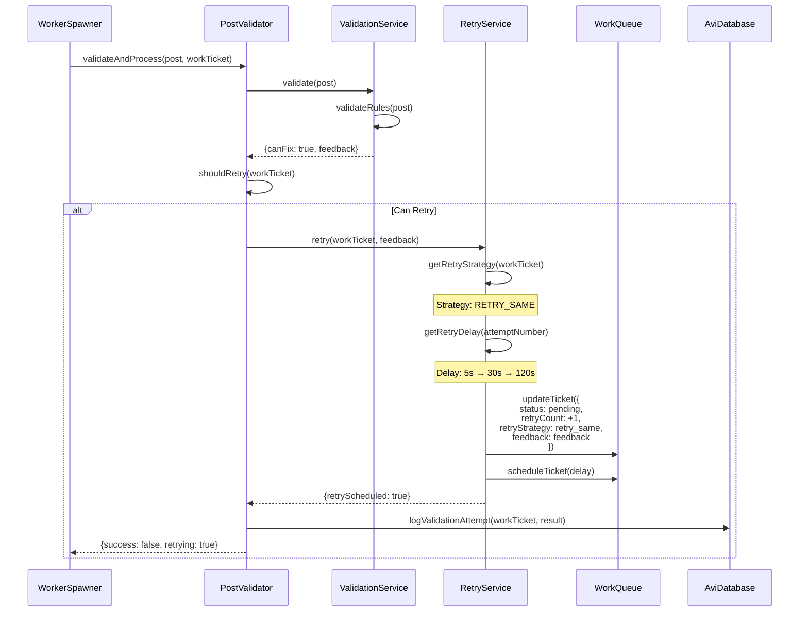

### 3.3 Retry Flow - Different Agent

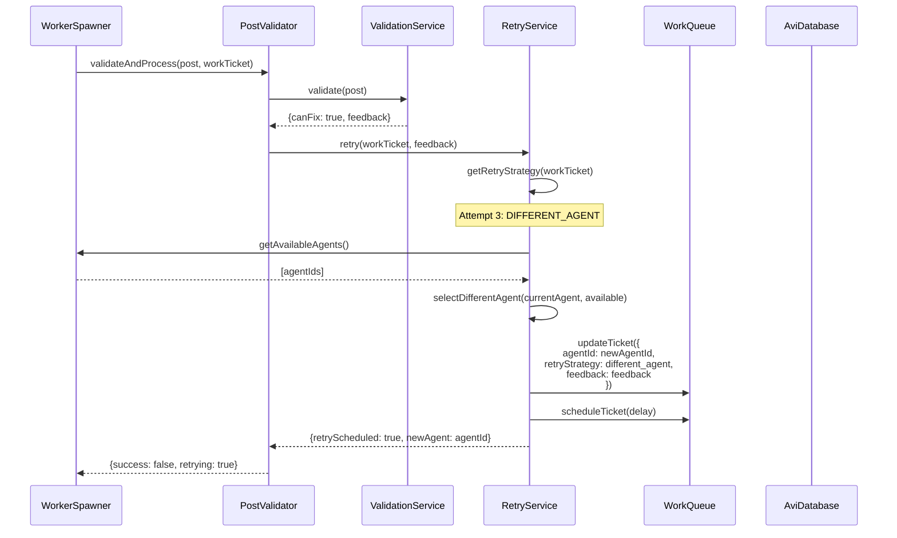

### 3.4 Escalation Flow

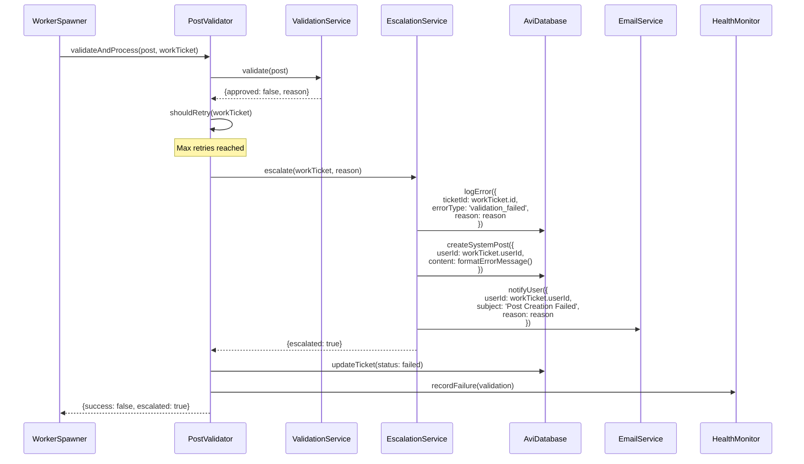

### 3.5 Complete Validation Flow with Decision Points

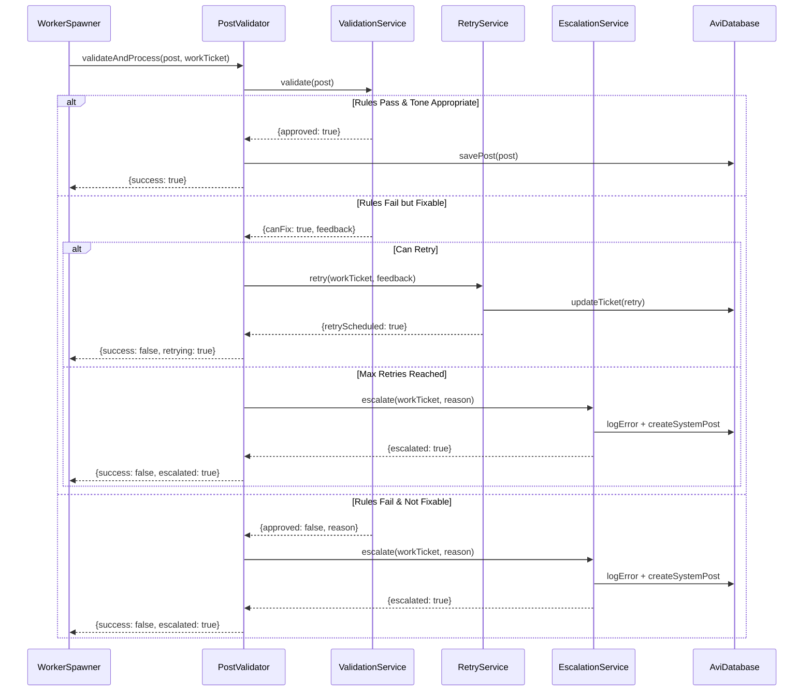

---

## 4. State Machine

### Validation State Machine

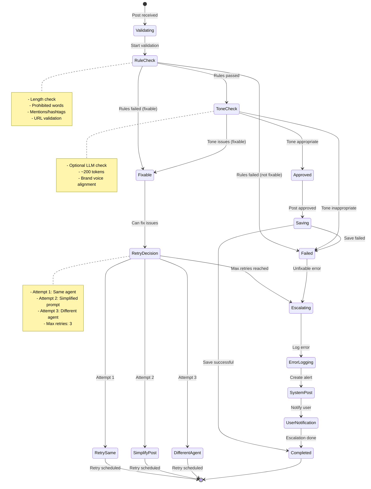

### Work Ticket State Transitions

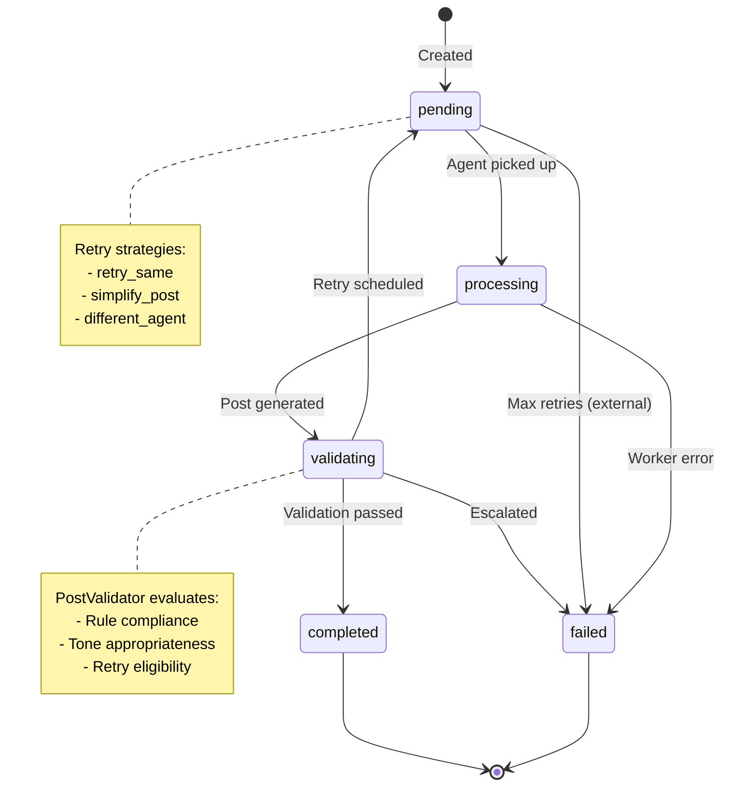

---

## 5. File Structure

```
src/
├── validation/
│   ├── post-validator.ts          # Main orchestration
│   ├── validation-service.ts      # Rule & tone validation
│   ├── retry-service.ts           # Retry strategies
│   ├── escalation-service.ts      # User notifications
│   ├── types/
│   │   ├── validation.types.ts    # ValidationResult, etc.
│   │   ├── retry.types.ts         # RetryStrategy, etc.
│   │   └── escalation.types.ts    # EscalationResult, etc.
│   └── config/
│       ├── validation.config.ts   # Validation rules
│       └── retry.config.ts        # Retry policies
│
├── services/
│   ├── email-service.ts           # Email notifications (future)
│   └── webhook-service.ts         # Webhook notifications (future)
│
├── avi/
│   └── orchestrator-factory.ts    # Updated with PostValidator
│
└── config/
    └── avi.config.ts              # Updated with Phase 4 config

tests/
└── phase4/
    ├── unit/
    │   ├── validation-service.test.ts
    │   ├── retry-service.test.ts
    │   ├── escalation-service.test.ts
    │   └── post-validator.test.ts
    ├── integration/
    │   ├── validation-flow.test.ts
    │   ├── retry-flow.test.ts
    │   └── escalation-flow.test.ts
    └── e2e/
        └── complete-validation.test.ts

config/
├── validation-rules.json          # Runtime validation config
└── retry-policies.json            # Runtime retry config
```

---

## 6. TypeScript Implementations

### 6.1 Types and Interfaces

#### validation.types.ts

```typescript
/**
 * Result of post validation
 */
export interface ValidationResult {
  success: boolean;
  approved: boolean;
  canFix: boolean;
  reason: string;
  feedback: string;
  retrying: boolean;
  escalated: boolean;
  retryStrategy?: RetryStrategy;
  retryDelay?: number;
  metadata?: {
    ruleErrors?: string[];
    toneIssues?: string[];
    validationAttempts?: number;
    timestamp?: Date;
  };
}

/**
 * Configuration for validation service
 */
export interface ValidationConfig {
  enableLLMValidation: boolean;
  maxLength: number;
  minLength: number;
  prohibitedWords: string[];
  maxMentions: number;
  maxHashtags: number;
  maxUrls: number;
  allowedDomains: string[];
  toneThreshold: number;
  anthropicApiKey?: string;
}

/**
 * Result of rule-based validation
 */
export interface RuleValidationResult {
  passed: boolean;
  errors: ValidationError[];
  warnings: ValidationWarning[];
}

/**
 * Validation error details
 */
export interface ValidationError {
  code: string;
  message: string;
  field?: string;
  value?: any;
  canFix: boolean;
  suggestion?: string;
}

/**
 * Validation warning details
 */
export interface ValidationWarning {
  code: string;
  message: string;
  field?: string;
}

/**
 * Result of tone validation
 */
export interface ToneValidationResult {
  appropriate: boolean;
  score: number;
  issues: string[];
  suggestions: string[];
  analysis?: string;
}

/**
 * Post content to validate
 */
export interface PostContent {
  content: string;
  userId: string;
  agentId: string;
  metadata?: {
    prompt?: string;
    attemptNumber?: number;
  };
}

/**
 * Retry strategy enumeration
 */
export enum RetryStrategy {
  RETRY_SAME = 'retry_same',
  SIMPLIFY_POST = 'simplify_post',
  DIFFERENT_AGENT = 'different_agent'
}
```

#### retry.types.ts

```typescript
import { RetryStrategy } from './validation.types';

/**
 * Configuration for retry service
 */
export interface RetryConfig {
  maxRetries: number;
  baseDelay: number;
  maxDelay: number;
  backoffMultiplier: number;
  strategies: RetryStrategy[];
  strategyThresholds: {
    retrySame: number;      // Attempts 1-N
    simplifyPost: number;   // Attempts N+1-M
    differentAgent: number; // Attempts M+1+
  };
}

/**
 * Result of retry operation
 */
export interface RetryResult {
  success: boolean;
  strategy: RetryStrategy;
  delay: number;
  scheduledAt: Date;
  newAgentId?: string;
  simplifiedPrompt?: string;
  error?: string;
}

/**
 * Retry metadata for work ticket
 */
export interface RetryMetadata {
  attemptNumber: number;
  strategy: RetryStrategy;
  previousErrors: string[];
  feedback: string[];
  agentHistory: string[];
}
```

#### escalation.types.ts

```typescript
/**
 * Result of escalation operation
 */
export interface EscalationResult {
  escalated: boolean;
  systemPostCreated: boolean;
  errorLogged: boolean;
  userNotified: boolean;
  notifications: NotificationResult[];
  timestamp: Date;
}

/**
 * Result of individual notification
 */
export interface NotificationResult {
  type: NotificationType;
  success: boolean;
  timestamp: Date;
  error?: string;
  metadata?: Record<string, any>;
}

/**
 * Notification type enumeration
 */
export enum NotificationType {
  SYSTEM_POST = 'system_post',
  EMAIL = 'email',
  WEBHOOK = 'webhook',
  ERROR_LOG = 'error_log'
}

/**
 * Error log entry
 */
export interface ErrorLog {
  id: string;
  ticketId: string;
  userId: string;
  agentId?: string;
  errorType: ErrorType;
  errorMessage: string;
  stackTrace?: string;
  metadata: {
    retryCount?: number;
    lastStrategy?: string;
    validationErrors?: string[];
  };
  timestamp: Date;
}

/**
 * Error type enumeration
 */
export enum ErrorType {
  VALIDATION_FAILED = 'validation_failed',
  WORKER_ERROR = 'worker_error',
  TIMEOUT = 'timeout',
  API_ERROR = 'api_error',
  UNKNOWN = 'unknown'
}

/**
 * System post for user notification
 */
export interface SystemPost {
  userId: string;
  content: string;
  metadata: {
    type: 'error_notification';
    ticketId: string;
    errorType: ErrorType;
    timestamp: Date;
  };
}
```

### 6.2 ValidationService Implementation

#### validation-service.ts

```typescript
import Anthropic from '@anthropic-ai/sdk';
import {
  ValidationConfig,
  ValidationResult,
  RuleValidationResult,
  ToneValidationResult,
  ValidationError,
  ValidationWarning,
  PostContent
} from './types/validation.types';
import { Logger } from '../utils/logger';

/**
 * ValidationService
 *
 * Performs lightweight post validation with rule-based checks
 * and optional LLM-based tone analysis.
 */
export class ValidationService {
  private config: ValidationConfig;
  private anthropicClient?: Anthropic;
  private logger: Logger;

  constructor(config: ValidationConfig) {
    this.config = config;
    this.logger = new Logger('ValidationService');

    if (config.enableLLMValidation && config.anthropicApiKey) {
      this.anthropicClient = new Anthropic({
        apiKey: config.anthropicApiKey
      });
    }
  }

  /**
   * Main validation method
   */
  async validate(post: PostContent): Promise<ValidationResult> {
    try {
      this.logger.info('Starting validation', { userId: post.userId });

      // Step 1: Rule-based validation
      const ruleResult = this.validateRules(post);

      if (!ruleResult.passed) {
        const canFix = ruleResult.errors.every(e => e.canFix);
        const feedback = this.generateFeedback(ruleResult.errors);

        return {
          success: false,
          approved: false,
          canFix,
          reason: this.formatErrors(ruleResult.errors),
          feedback,
          retrying: false,
          escalated: false,
          metadata: {
            ruleErrors: ruleResult.errors.map(e => e.message),
            validationAttempts: post.metadata?.attemptNumber || 1,
            timestamp: new Date()
          }
        };
      }

      // Step 2: Tone validation (optional)
      if (this.config.enableLLMValidation && this.anthropicClient) {
        const toneResult = await this.validateTone(post);

        if (!toneResult.appropriate) {
          return {
            success: false,
            approved: false,
            canFix: true,
            reason: 'Tone or style issues detected',
            feedback: this.generateToneFeedback(toneResult),
            retrying: false,
            escalated: false,
            metadata: {
              toneIssues: toneResult.issues,
              validationAttempts: post.metadata?.attemptNumber || 1,
              timestamp: new Date()
            }
          };
        }
      }

      // All validations passed
      return {
        success: true,
        approved: true,
        canFix: false,
        reason: 'Validation passed',
        feedback: '',
        retrying: false,
        escalated: false,
        metadata: {
          validationAttempts: post.metadata?.attemptNumber || 1,
          timestamp: new Date()
        }
      };

    } catch (error) {
      this.logger.error('Validation error', { error });
      throw error;
    }
  }

  /**
   * Rule-based validation
   */
  validateRules(post: PostContent): RuleValidationResult {
    const errors: ValidationError[] = [];
    const warnings: ValidationWarning[] = [];

    // Check length
    const lengthCheck = this.checkLength(post.content);
    if (!lengthCheck.valid) {
      errors.push({
        code: 'LENGTH_INVALID',
        message: lengthCheck.message,
        field: 'content',
        value: post.content.length,
        canFix: true,
        suggestion: lengthCheck.suggestion
      });
    }

    // Check prohibited words
    const prohibitedWords = this.checkProhibitedWords(post.content);
    if (prohibitedWords.length > 0) {
      errors.push({
        code: 'PROHIBITED_WORDS',
        message: `Contains prohibited words: ${prohibitedWords.join(', ')}`,
        field: 'content',
        value: prohibitedWords,
        canFix: true,
        suggestion: 'Please rephrase without these words'
      });
    }

    // Check mentions
    const mentionsCheck = this.checkMentions(post.content);
    if (!mentionsCheck.valid) {
      errors.push({
        code: 'TOO_MANY_MENTIONS',
        message: mentionsCheck.message,
        field: 'content',
        value: mentionsCheck.count,
        canFix: true,
        suggestion: `Limit mentions to ${this.config.maxMentions}`
      });
    }

    // Check hashtags
    const hashtagsCheck = this.checkHashtags(post.content);
    if (!hashtagsCheck.valid) {
      errors.push({
        code: 'TOO_MANY_HASHTAGS',
        message: hashtagsCheck.message,
        field: 'content',
        value: hashtagsCheck.count,
        canFix: true,
        suggestion: `Limit hashtags to ${this.config.maxHashtags}`
      });
    }

    // Check URLs
    const urlsCheck = this.checkUrls(post.content);
    if (!urlsCheck.valid) {
      errors.push({
        code: 'INVALID_URLS',
        message: urlsCheck.message,
        field: 'content',
        value: urlsCheck.invalidUrls,
        canFix: true,
        suggestion: 'Only use allowed domains'
      });
    }

    return {
      passed: errors.length === 0,
      errors,
      warnings
    };
  }

  /**
   * Tone validation using LLM (~200 tokens)
   */
  async validateTone(post: PostContent): Promise<ToneValidationResult> {
    if (!this.anthropicClient) {
      return {
        appropriate: true,
        score: 1.0,
        issues: [],
        suggestions: []
      };
    }

    try {
      const prompt = `Analyze the tone and style of this social media post. Return a JSON response with:
- appropriate: boolean (is the tone professional and appropriate?)
- score: number (0-1, how appropriate is it?)
- issues: string[] (list of tone issues found)
- suggestions: string[] (how to improve)

Post:
"${post.content}"

Respond with only valid JSON.`;

      const message = await this.anthropicClient.messages.create({
        model: 'claude-3-5-haiku-20241022',
        max_tokens: 200,
        messages: [{
          role: 'user',
          content: prompt
        }]
      });

      const content = message.content[0];
      if (content.type === 'text') {
        const result = JSON.parse(content.text);
        return {
          appropriate: result.appropriate,
          score: result.score,
          issues: result.issues || [],
          suggestions: result.suggestions || [],
          analysis: content.text
        };
      }

      // Default to appropriate if parsing fails
      return {
        appropriate: true,
        score: 1.0,
        issues: [],
        suggestions: []
      };

    } catch (error) {
      this.logger.error('Tone validation error', { error });
      // Default to appropriate on error
      return {
        appropriate: true,
        score: 1.0,
        issues: [],
        suggestions: []
      };
    }
  }

  /**
   * Check content length
   */
  private checkLength(content: string): {
    valid: boolean;
    message: string;
    suggestion: string
  } {
    const length = content.length;

    if (length < this.config.minLength) {
      return {
        valid: false,
        message: `Post too short: ${length} characters (min: ${this.config.minLength})`,
        suggestion: `Add more content (need ${this.config.minLength - length} more characters)`
      };
    }

    if (length > this.config.maxLength) {
      return {
        valid: false,
        message: `Post too long: ${length} characters (max: ${this.config.maxLength})`,
        suggestion: `Shorten by ${length - this.config.maxLength} characters`
      };
    }

    return {
      valid: true,
      message: 'Length valid',
      suggestion: ''
    };
  }

  /**
   * Check for prohibited words
   */
  private checkProhibitedWords(content: string): string[] {
    const lowerContent = content.toLowerCase();
    return this.config.prohibitedWords.filter(word =>
      lowerContent.includes(word.toLowerCase())
    );
  }

  /**
   * Check mentions count
   */
  private checkMentions(content: string): {
    valid: boolean;
    message: string;
    count: number
  } {
    const mentions = content.match(/@\w+/g) || [];
    const count = mentions.length;

    if (count > this.config.maxMentions) {
      return {
        valid: false,
        message: `Too many mentions: ${count} (max: ${this.config.maxMentions})`,
        count
      };
    }

    return {
      valid: true,
      message: 'Mentions valid',
      count
    };
  }

  /**
   * Check hashtags count
   */
  private checkHashtags(content: string): {
    valid: boolean;
    message: string;
    count: number
  } {
    const hashtags = content.match(/#\w+/g) || [];
    const count = hashtags.length;

    if (count > this.config.maxHashtags) {
      return {
        valid: false,
        message: `Too many hashtags: ${count} (max: ${this.config.maxHashtags})`,
        count
      };
    }

    return {
      valid: true,
      message: 'Hashtags valid',
      count
    };
  }

  /**
   * Check URLs and domains
   */
  private checkUrls(content: string): {
    valid: boolean;
    message: string;
    invalidUrls: string[]
  } {
    const urlRegex = /https?:\/\/[^\s]+/g;
    const urls = content.match(urlRegex) || [];

    if (urls.length > this.config.maxUrls) {
      return {
        valid: false,
        message: `Too many URLs: ${urls.length} (max: ${this.config.maxUrls})`,
        invalidUrls: urls
      };
    }

    const invalidUrls: string[] = [];

    for (const url of urls) {
      try {
        const urlObj = new URL(url);
        const domain = urlObj.hostname;

        if (!this.config.allowedDomains.some(allowed =>
          domain === allowed || domain.endsWith(`.${allowed}`)
        )) {
          invalidUrls.push(url);
        }
      } catch (error) {
        invalidUrls.push(url);
      }
    }

    if (invalidUrls.length > 0) {
      return {
        valid: false,
        message: `Invalid or disallowed URLs found`,
        invalidUrls
      };
    }

    return {
      valid: true,
      message: 'URLs valid',
      invalidUrls: []
    };
  }

  /**
   * Generate feedback from errors
   */
  private generateFeedback(errors: ValidationError[]): string {
    const suggestions = errors
      .filter(e => e.suggestion)
      .map(e => `- ${e.suggestion}`)
      .join('\n');

    return `Please address these issues:\n${suggestions}`;
  }

  /**
   * Generate feedback from tone validation
   */
  private generateToneFeedback(result: ToneValidationResult): string {
    const issues = result.issues.map(i => `- ${i}`).join('\n');
    const suggestions = result.suggestions.map(s => `- ${s}`).join('\n');

    return `Tone Issues:\n${issues}\n\nSuggestions:\n${suggestions}`;
  }

  /**
   * Format errors into a single message
   */
  private formatErrors(errors: ValidationError[]): string {
    return errors.map(e => e.message).join('; ');
  }
}
```

### 6.3 RetryService Implementation

#### retry-service.ts

```typescript
import {
  RetryConfig,
  RetryResult,
  RetryMetadata
} from './types/retry.types';
import { RetryStrategy } from './types/validation.types';
import { WorkQueue } from '../adapters/work-queue-adapter';
import { WorkerSpawner } from '../adapters/worker-spawner-adapter';
import { Logger } from '../utils/logger';

/**
 * RetryService
 *
 * Implements multi-strategy retry logic with exponential backoff.
 * Strategies: retry_same, simplify_post, different_agent
 */
export class RetryService {
  private config: RetryConfig;
  private workQueue: WorkQueue;
  private workerSpawner: WorkerSpawner;
  private logger: Logger;

  constructor(
    config: RetryConfig,
    workQueue: WorkQueue,
    workerSpawner: WorkerSpawner
  ) {
    this.config = config;
    this.workQueue = workQueue;
    this.workerSpawner = workerSpawner;
    this.logger = new Logger('RetryService');
  }

  /**
   * Retry a failed work ticket with appropriate strategy
   */
  async retry(
    workTicket: any,
    feedback: string
  ): Promise<RetryResult> {
    try {
      this.logger.info('Retrying work ticket', {
        ticketId: workTicket.id,
        attemptNumber: workTicket.retryCount + 1
      });

      // Determine retry strategy
      const strategy = this.getRetryStrategy(workTicket);

      // Calculate retry delay
      const delay = this.getRetryDelay(workTicket.retryCount);

      // Execute strategy
      let result: RetryResult;

      switch (strategy) {
        case RetryStrategy.RETRY_SAME:
          result = await this.executeRetrySame(workTicket, feedback, delay);
          break;

        case RetryStrategy.SIMPLIFY_POST:
          result = await this.executeSimplifyPost(workTicket, feedback, delay);
          break;

        case RetryStrategy.DIFFERENT_AGENT:
          result = await this.executeDifferentAgent(workTicket, feedback, delay);
          break;

        default:
          throw new Error(`Unknown retry strategy: ${strategy}`);
      }

      this.logger.info('Retry scheduled', {
        ticketId: workTicket.id,
        strategy,
        delay
      });

      return result;

    } catch (error) {
      this.logger.error('Retry error', { error });
      return {
        success: false,
        strategy: RetryStrategy.RETRY_SAME,
        delay: 0,
        scheduledAt: new Date(),
        error: error instanceof Error ? error.message : 'Unknown error'
      };
    }
  }

  /**
   * Schedule a retry with delay
   */
  async scheduleRetry(
    workTicket: any,
    strategy: RetryStrategy,
    delay: number
  ): Promise<void> {
    // Update ticket metadata
    const retryMetadata: RetryMetadata = {
      attemptNumber: workTicket.retryCount + 1,
      strategy,
      previousErrors: workTicket.metadata?.previousErrors || [],
      feedback: workTicket.metadata?.feedback || [],
      agentHistory: workTicket.metadata?.agentHistory || [workTicket.agentId]
    };

    // Schedule for future execution
    await this.workQueue.updateTicket(workTicket.id, {
      status: 'pending',
      retryCount: workTicket.retryCount + 1,
      retryStrategy: strategy,
      scheduledAt: new Date(Date.now() + delay * 1000),
      metadata: {
        ...workTicket.metadata,
        ...retryMetadata
      }
    });
  }

  /**
   * Determine retry strategy based on attempt number
   */
  getRetryStrategy(workTicket: any): RetryStrategy {
    const attemptNumber = workTicket.retryCount + 1;

    if (attemptNumber <= this.config.strategyThresholds.retrySame) {
      return RetryStrategy.RETRY_SAME;
    }

    if (attemptNumber <= this.config.strategyThresholds.simplifyPost) {
      return RetryStrategy.SIMPLIFY_POST;
    }

    return RetryStrategy.DIFFERENT_AGENT;
  }

  /**
   * Calculate exponential backoff delay
   */
  getRetryDelay(attemptNumber: number): number {
    // Exponential backoff: baseDelay * (multiplier ^ attemptNumber)
    const delay = this.config.baseDelay *
      Math.pow(this.config.backoffMultiplier, attemptNumber);

    // Cap at maxDelay
    return Math.min(delay, this.config.maxDelay);
  }

  /**
   * Check if ticket can be retried
   */
  canRetry(workTicket: any): boolean {
    return workTicket.retryCount < this.config.maxRetries;
  }

  /**
   * Strategy: Retry with same agent and feedback
   */
  private async executeRetrySame(
    workTicket: any,
    feedback: string,
    delay: number
  ): Promise<RetryResult> {
    // Add feedback to ticket
    const updatedTicket = {
      ...workTicket,
      metadata: {
        ...workTicket.metadata,
        feedback: [
          ...(workTicket.metadata?.feedback || []),
          feedback
        ]
      }
    };

    await this.scheduleRetry(
      updatedTicket,
      RetryStrategy.RETRY_SAME,
      delay
    );

    return {
      success: true,
      strategy: RetryStrategy.RETRY_SAME,
      delay,
      scheduledAt: new Date(Date.now() + delay * 1000)
    };
  }

  /**
   * Strategy: Simplify the prompt
   */
  private async executeSimplifyPost(
    workTicket: any,
    feedback: string,
    delay: number
  ): Promise<RetryResult> {
    // Simplify the prompt
    const simplifiedPrompt = this.simplifyPrompt(workTicket.prompt, feedback);

    const updatedTicket = {
      ...workTicket,
      prompt: simplifiedPrompt,
      metadata: {
        ...workTicket.metadata,
        originalPrompt: workTicket.prompt,
        simplified: true,
        feedback: [
          ...(workTicket.metadata?.feedback || []),
          feedback
        ]
      }
    };

    await this.scheduleRetry(
      updatedTicket,
      RetryStrategy.SIMPLIFY_POST,
      delay
    );

    return {
      success: true,
      strategy: RetryStrategy.SIMPLIFY_POST,
      delay,
      scheduledAt: new Date(Date.now() + delay * 1000),
      simplifiedPrompt
    };
  }

  /**
   * Strategy: Try with a different agent
   */
  private async executeDifferentAgent(
    workTicket: any,
    feedback: string,
    delay: number
  ): Promise<RetryResult> {
    // Get available agents
    const availableAgents = await this.workerSpawner.getAvailableAgents();

    // Get agent history
    const agentHistory = workTicket.metadata?.agentHistory || [workTicket.agentId];

    // Select a different agent
    const newAgentId = this.selectDifferentAgent(
      workTicket.agentId,
      availableAgents,
      agentHistory
    );

    if (!newAgentId) {
      // No other agents available, fall back to retry_same
      return this.executeRetrySame(workTicket, feedback, delay);
    }

    const updatedTicket = {
      ...workTicket,
      agentId: newAgentId,
      metadata: {
        ...workTicket.metadata,
        agentHistory: [...agentHistory, newAgentId],
        feedback: [
          ...(workTicket.metadata?.feedback || []),
          feedback
        ]
      }
    };

    await this.scheduleRetry(
      updatedTicket,
      RetryStrategy.DIFFERENT_AGENT,
      delay
    );

    return {
      success: true,
      strategy: RetryStrategy.DIFFERENT_AGENT,
      delay,
      scheduledAt: new Date(Date.now() + delay * 1000),
      newAgentId
    };
  }

  /**
   * Simplify a prompt based on feedback
   */
  private simplifyPrompt(prompt: string, feedback: string): string {
    // Remove complex instructions
    let simplified = prompt
      .replace(/\b(also|additionally|furthermore|moreover)\b/gi, '')
      .replace(/\([^)]*\)/g, '') // Remove parenthetical notes
      .trim();

    // Add simplification instruction
    simplified = `${simplified}\n\n[Simplified version - keep it concise and clear]\n${feedback}`;

    return simplified;
  }

  /**
   * Select a different agent from available ones
   */
  private selectDifferentAgent(
    currentAgentId: string,
    availableAgents: string[],
    agentHistory: string[]
  ): string | null {
    // Filter out current agent and previously used agents
    const candidates = availableAgents.filter(
      agentId => agentId !== currentAgentId && !agentHistory.includes(agentId)
    );

    if (candidates.length === 0) {
      // No unused agents, pick any available agent except current
      const alternates = availableAgents.filter(
        agentId => agentId !== currentAgentId
      );
      return alternates.length > 0 ? alternates[0] : null;
    }

    // Return first candidate
    return candidates[0];
  }

  /**
   * Update ticket for retry
   */
  private async updateTicketForRetry(
    workTicket: any,
    strategy: RetryStrategy
  ): Promise<void> {
    await this.workQueue.updateTicket(workTicket.id, {
      status: 'pending',
      retryCount: workTicket.retryCount + 1,
      retryStrategy: strategy,
      updatedAt: new Date()
    });
  }
}
```

### 6.4 EscalationService Implementation

#### escalation-service.ts

```typescript
import {
  EscalationResult,
  NotificationResult,
  NotificationType,
  ErrorLog,
  ErrorType,
  SystemPost
} from './types/escalation.types';
import { AviDatabase } from '../adapters/avi-database-adapter';
import { Logger } from '../utils/logger';

// Future imports (placeholder)
// import { EmailService } from '../services/email-service';
// import { WebhookService } from '../services/webhook-service';

/**
 * EscalationService
 *
 * Handles user notifications when work tickets fail after max retries.
 * Creates system posts, logs errors, and sends notifications.
 */
export class EscalationService {
  private aviDatabase: AviDatabase;
  // private emailService?: EmailService;
  // private webhookService?: WebhookService;
  private logger: Logger;

  constructor(aviDatabase: AviDatabase) {
    this.aviDatabase = aviDatabase;
    this.logger = new Logger('EscalationService');
  }

  /**
   * Escalate a failed work ticket
   */
  async escalate(
    workTicket: any,
    reason: string
  ): Promise<EscalationResult> {
    try {
      this.logger.info('Escalating work ticket', {
        ticketId: workTicket.id,
        userId: workTicket.userId
      });

      const notifications: NotificationResult[] = [];

      // Step 1: Log error
      const errorLogged = await this.logError(workTicket, reason);
      notifications.push({
        type: NotificationType.ERROR_LOG,
        success: errorLogged,
        timestamp: new Date()
      });

      // Step 2: Create system post
      const systemPostCreated = await this.createSystemPost(
        workTicket.userId,
        this.formatErrorMessage(workTicket, reason)
      );
      notifications.push({
        type: NotificationType.SYSTEM_POST,
        success: systemPostCreated,
        timestamp: new Date()
      });

      // Step 3: Notify user (if enabled)
      if (this.shouldNotifyUser(workTicket)) {
        const notified = await this.notifyUser(workTicket.userId, {
          subject: 'Post Creation Failed',
          message: this.formatErrorMessage(workTicket, reason),
          ticketId: workTicket.id
        });

        // Future: Email notification
        // if (this.emailService) {
        //   const emailSent = await this.sendEmail(
        //     workTicket.userId,
        //     'Post Creation Failed',
        //     this.formatErrorMessage(workTicket, reason)
        //   );
        //   notifications.push({
        //     type: NotificationType.EMAIL,
        //     success: emailSent,
        //     timestamp: new Date()
        //   });
        // }

        // Future: Webhook notification
        // if (this.webhookService) {
        //   const webhookSent = await this.sendWebhook('work_ticket.failed', {
        //     ticketId: workTicket.id,
        //     userId: workTicket.userId,
        //     reason
        //   });
        //   notifications.push({
        //     type: NotificationType.WEBHOOK,
        //     success: webhookSent,
        //     timestamp: new Date()
        //   });
        // }
      }

      const result: EscalationResult = {
        escalated: true,
        systemPostCreated,
        errorLogged,
        userNotified: notifications.some(n =>
          n.type !== NotificationType.ERROR_LOG &&
          n.type !== NotificationType.SYSTEM_POST &&
          n.success
        ),
        notifications,
        timestamp: new Date()
      };

      this.logger.info('Escalation complete', {
        ticketId: workTicket.id,
        result
      });

      return result;

    } catch (error) {
      this.logger.error('Escalation error', { error });
      return {
        escalated: false,
        systemPostCreated: false,
        errorLogged: false,
        userNotified: false,
        notifications: [],
        timestamp: new Date()
      };
    }
  }

  /**
   * Create a system post to notify user
   */
  async createSystemPost(
    userId: string,
    message: string
  ): Promise<boolean> {
    try {
      const systemPost: SystemPost = {
        userId,
        content: message,
        metadata: {
          type: 'error_notification',
          ticketId: '',
          errorType: ErrorType.VALIDATION_FAILED,
          timestamp: new Date()
        }
      };

      await this.aviDatabase.createPost({
        userId,
        content: message,
        agentId: 'system',
        metadata: systemPost.metadata
      });

      return true;

    } catch (error) {
      this.logger.error('Failed to create system post', { error });
      return false;
    }
  }

  /**
   * Log error to database
   */
  async logError(
    workTicket: any,
    error: string
  ): Promise<boolean> {
    try {
      const errorLog: ErrorLog = {
        id: `error_${Date.now()}`,
        ticketId: workTicket.id,
        userId: workTicket.userId,
        agentId: workTicket.agentId,
        errorType: this.determineErrorType(error),
        errorMessage: error,
        metadata: {
          retryCount: workTicket.retryCount,
          lastStrategy: workTicket.retryStrategy,
          validationErrors: workTicket.metadata?.validationErrors || []
        },
        timestamp: new Date()
      };

      await this.aviDatabase.logError(errorLog);

      return true;

    } catch (err) {
      this.logger.error('Failed to log error', { err });
      return false;
    }
  }

  /**
   * Notify user (placeholder for future implementation)
   */
  async notifyUser(
    userId: string,
    notification: {
      subject: string;
      message: string;
      ticketId: string;
    }
  ): Promise<boolean> {
    // Placeholder for future notification logic
    this.logger.info('User notification', { userId, notification });
    return true;
  }

  /**
   * Send email notification (future)
   */
  private async sendEmail(
    userId: string,
    subject: string,
    body: string
  ): Promise<boolean> {
    // Future implementation
    this.logger.info('Email notification', { userId, subject });
    return false;
  }

  /**
   * Send webhook notification (future)
   */
  private async sendWebhook(
    event: string,
    payload: any
  ): Promise<boolean> {
    // Future implementation
    this.logger.info('Webhook notification', { event, payload });
    return false;
  }

  /**
   * Format error message for user
   */
  private formatErrorMessage(
    workTicket: any,
    reason: string
  ): string {
    const attemptInfo = workTicket.retryCount > 0
      ? ` after ${workTicket.retryCount} retry attempts`
      : '';

    return `⚠️ Post Creation Failed

Your automated post could not be created${attemptInfo}.

Reason: ${reason}

Ticket ID: ${workTicket.id}
Prompt: "${workTicket.prompt.substring(0, 100)}${workTicket.prompt.length > 100 ? '...' : ''}"

Please try again with a different prompt or contact support if this issue persists.`;
  }

  /**
   * Determine if user should be notified
   */
  private shouldNotifyUser(workTicket: any): boolean {
    // Notify on final failure after retries
    return workTicket.retryCount >= 1;
  }

  /**
   * Determine error type from error message
   */
  private determineErrorType(error: string): ErrorType {
    const lowerError = error.toLowerCase();

    if (lowerError.includes('validation')) {
      return ErrorType.VALIDATION_FAILED;
    }
    if (lowerError.includes('timeout')) {
      return ErrorType.TIMEOUT;
    }
    if (lowerError.includes('api') || lowerError.includes('anthropic')) {
      return ErrorType.API_ERROR;
    }
    if (lowerError.includes('worker')) {
      return ErrorType.WORKER_ERROR;
    }

    return ErrorType.UNKNOWN;
  }
}
```

### 6.5 PostValidator Implementation

#### post-validator.ts

```typescript
import { ValidationService } from './validation-service';
import { RetryService } from './retry-service';
import { EscalationService } from './escalation-service';
import { AviDatabase } from '../adapters/avi-database-adapter';
import { HealthMonitor } from '../adapters/health-monitor-adapter';
import { ValidationResult, PostContent } from './types/validation.types';
import { Logger } from '../utils/logger';

/**
 * PostValidator
 *
 * Main orchestration layer for validation, retry, and escalation.
 * Integrates with WorkerSpawner to validate agent-generated posts.
 */
export class PostValidator {
  private validationService: ValidationService;
  private retryService: RetryService;
  private escalationService: EscalationService;
  private aviDatabase: AviDatabase;
  private healthMonitor: HealthMonitor;
  private logger: Logger;

  constructor(
    validationService: ValidationService,
    retryService: RetryService,
    escalationService: EscalationService,
    aviDatabase: AviDatabase,
    healthMonitor: HealthMonitor
  ) {
    this.validationService = validationService;
    this.retryService = retryService;
    this.escalationService = escalationService;
    this.aviDatabase = aviDatabase;
    this.healthMonitor = healthMonitor;
    this.logger = new Logger('PostValidator');
  }

  /**
   * Main entry point: Validate and process a post
   */
  async validateAndProcess(
    post: PostContent,
    workTicket: any
  ): Promise<ValidationResult> {
    const startTime = Date.now();

    try {
      this.logger.info('Validating post', {
        ticketId: workTicket.id,
        attemptNumber: workTicket.retryCount + 1
      });

      // Step 1: Validate the post
      const validationResult = await this.validationService.validate(post);

      // Step 2: Handle validation result
      if (validationResult.approved) {
        // Post approved - save it
        await this.handleApprovedPost(post, workTicket);
        this.updateHealthMetrics({
          ...validationResult,
          success: true
        });

        return {
          ...validationResult,
          success: true
        };
      }

      // Step 3: Check if we can retry
      if (validationResult.canFix && this.shouldRetry(workTicket)) {
        // Schedule retry
        const retryStrategy = this.getNextRetryStrategy(workTicket);
        const retryResult = await this.retryService.retry(
          workTicket,
          validationResult.feedback
        );

        await this.logValidationAttempt(workTicket, validationResult);
        this.updateHealthMetrics(validationResult);

        return {
          ...validationResult,
          success: false,
          retrying: true,
          retryStrategy: retryResult.strategy,
          retryDelay: retryResult.delay
        };
      }

      // Step 4: Escalate if max retries reached or not fixable
      await this.handleValidationFailure(workTicket, validationResult.reason);
      this.updateHealthMetrics(validationResult);

      return {
        ...validationResult,
        success: false,
        escalated: true
      };

    } catch (error) {
      this.logger.error('Validation error', { error });

      // Log error and escalate
      await this.handleValidationFailure(
        workTicket,
        error instanceof Error ? error.message : 'Unknown error'
      );

      const duration = Date.now() - startTime;
      this.updateHealthMetrics({
        success: false,
        approved: false,
        canFix: false,
        reason: 'Validation error',
        feedback: '',
        retrying: false,
        escalated: true
      });

      return {
        success: false,
        approved: false,
        canFix: false,
        reason: error instanceof Error ? error.message : 'Unknown error',
        feedback: '',
        retrying: false,
        escalated: true
      };
    }
  }

  /**
   * Handle approved post - save to database
   */
  private async handleApprovedPost(
    post: PostContent,
    workTicket: any
  ): Promise<void> {
    try {
      // Save post to database
      const postId = await this.aviDatabase.createPost({
        userId: post.userId,
        agentId: post.agentId,
        content: post.content,
        metadata: {
          ticketId: workTicket.id,
          prompt: post.metadata?.prompt,
          validationAttempts: workTicket.retryCount + 1,
          approved: true
        }
      });

      // Update work ticket status
      await this.aviDatabase.updateTicket(workTicket.id, {
        status: 'completed',
        completedAt: new Date(),
        metadata: {
          ...workTicket.metadata,
          postId
        }
      });

      this.logger.info('Post saved', { postId, ticketId: workTicket.id });

    } catch (error) {
      this.logger.error('Failed to save approved post', { error });
      throw error;
    }
  }

  /**
   * Handle validation failure - escalate to user
   */
  async handleValidationFailure(
    workTicket: any,
    reason: string
  ): Promise<void> {
    try {
      // Escalate to user
      await this.escalationService.escalate(workTicket, reason);

      // Update work ticket status
      await this.aviDatabase.updateTicket(workTicket.id, {
        status: 'failed',
        failedAt: new Date(),
        lastError: reason
      });

      this.logger.info('Validation failure escalated', {
        ticketId: workTicket.id
      });

    } catch (error) {
      this.logger.error('Failed to handle validation failure', { error });
    }
  }

  /**
   * Check if ticket should be retried
   */
  shouldRetry(workTicket: any): boolean {
    return this.retryService.canRetry(workTicket);
  }

  /**
   * Get next retry strategy based on attempt count
   */
  getNextRetryStrategy(workTicket: any): any {
    return this.retryService.getRetryStrategy(workTicket);
  }

  /**
   * Log validation attempt for analytics
   */
  private async logValidationAttempt(
    workTicket: any,
    result: ValidationResult
  ): Promise<void> {
    try {
      await this.aviDatabase.logValidationAttempt({
        ticketId: workTicket.id,
        attemptNumber: workTicket.retryCount + 1,
        approved: result.approved,
        canFix: result.canFix,
        reason: result.reason,
        feedback: result.feedback,
        timestamp: new Date()
      });
    } catch (error) {
      this.logger.error('Failed to log validation attempt', { error });
    }
  }

  /**
   * Update health metrics
   */
  private updateHealthMetrics(result: ValidationResult): void {
    try {
      if (result.approved) {
        this.healthMonitor.recordSuccess('validation');
      } else {
        this.healthMonitor.recordFailure('validation');
      }

      this.healthMonitor.recordMetric('validation_attempts', {
        approved: result.approved,
        canFix: result.canFix,
        retrying: result.retrying,
        escalated: result.escalated
      });
    } catch (error) {
      this.logger.error('Failed to update health metrics', { error });
    }
  }
}
```

---

## 7. Configuration Schema

### 7.1 Validation Configuration

#### config/validation-rules.json

```json
{
  "validation": {
    "enableLLMValidation": true,
    "content": {
      "maxLength": 280,
      "minLength": 10
    },
    "prohibitedWords": [
      "spam",
      "scam",
      "clickbait",
      "banned_word_1",
      "banned_word_2"
    ],
    "mentions": {
      "maxCount": 5
    },
    "hashtags": {
      "maxCount": 10
    },
    "urls": {
      "maxCount": 2,
      "allowedDomains": [
        "example.com",
        "trusted-site.com",
        "github.com",
        "twitter.com"
      ]
    },
    "tone": {
      "threshold": 0.7,
      "checkEnabled": true
    }
  }
}
```

### 7.2 Retry Configuration

#### config/retry-policies.json

```json
{
  "retry": {
    "maxRetries": 3,
    "baseDelay": 5,
    "maxDelay": 120,
    "backoffMultiplier": 6,
    "strategies": [
      "retry_same",
      "simplify_post",
      "different_agent"
    ],
    "strategyThresholds": {
      "retrySame": 1,
      "simplifyPost": 2,
      "differentAgent": 3
    }
  }
}
```

### 7.3 TypeScript Configuration Types

#### validation.config.ts

```typescript
import { ValidationConfig } from '../validation/types/validation.types';

/**
 * Default validation configuration
 */
export const defaultValidationConfig: ValidationConfig = {
  enableLLMValidation: true,
  maxLength: 280,
  minLength: 10,
  prohibitedWords: [
    'spam',
    'scam',
    'clickbait'
  ],
  maxMentions: 5,
  maxHashtags: 10,
  maxUrls: 2,
  allowedDomains: [
    'example.com',
    'github.com',
    'twitter.com'
  ],
  toneThreshold: 0.7,
  anthropicApiKey: process.env.ANTHROPIC_API_KEY
};

/**
 * Load validation config from file or environment
 */
export function loadValidationConfig(): ValidationConfig {
  // Try to load from config file
  try {
    const fs = require('fs');
    const path = require('path');
    const configPath = path.join(__dirname, '../../config/validation-rules.json');

    if (fs.existsSync(configPath)) {
      const configFile = JSON.parse(fs.readFileSync(configPath, 'utf-8'));
      return {
        enableLLMValidation: configFile.validation.enableLLMValidation,
        maxLength: configFile.validation.content.maxLength,
        minLength: configFile.validation.content.minLength,
        prohibitedWords: configFile.validation.prohibitedWords,
        maxMentions: configFile.validation.mentions.maxCount,
        maxHashtags: configFile.validation.hashtags.maxCount,
        maxUrls: configFile.validation.urls.maxCount,
        allowedDomains: configFile.validation.urls.allowedDomains,
        toneThreshold: configFile.validation.tone.threshold,
        anthropicApiKey: process.env.ANTHROPIC_API_KEY
      };
    }
  } catch (error) {
    console.warn('Failed to load validation config, using defaults', error);
  }

  // Fall back to defaults
  return defaultValidationConfig;
}
```

#### retry.config.ts

```typescript
import { RetryConfig } from '../validation/types/retry.types';
import { RetryStrategy } from '../validation/types/validation.types';

/**
 * Default retry configuration
 */
export const defaultRetryConfig: RetryConfig = {
  maxRetries: 3,
  baseDelay: 5,
  maxDelay: 120,
  backoffMultiplier: 6,
  strategies: [
    RetryStrategy.RETRY_SAME,
    RetryStrategy.SIMPLIFY_POST,
    RetryStrategy.DIFFERENT_AGENT
  ],
  strategyThresholds: {
    retrySame: 1,
    simplifyPost: 2,
    differentAgent: 3
  }
};

/**
 * Load retry config from file or environment
 */
export function loadRetryConfig(): RetryConfig {
  // Try to load from config file
  try {
    const fs = require('fs');
    const path = require('path');
    const configPath = path.join(__dirname, '../../config/retry-policies.json');

    if (fs.existsSync(configPath)) {
      const configFile = JSON.parse(fs.readFileSync(configPath, 'utf-8'));
      return {
        maxRetries: configFile.retry.maxRetries,
        baseDelay: configFile.retry.baseDelay,
        maxDelay: configFile.retry.maxDelay,
        backoffMultiplier: configFile.retry.backoffMultiplier,
        strategies: configFile.retry.strategies.map((s: string) =>
          RetryStrategy[s.toUpperCase() as keyof typeof RetryStrategy]
        ),
        strategyThresholds: configFile.retry.strategyThresholds
      };
    }
  } catch (error) {
    console.warn('Failed to load retry config, using defaults', error);
  }

  // Fall back to defaults
  return defaultRetryConfig;
}
```

---

## 8. Integration Points

### 8.1 WorkerSpawner Integration

```typescript
// src/adapters/worker-spawner-adapter.ts

import { PostValidator } from '../validation/post-validator';

export class WorkerSpawner {
  private postValidator: PostValidator;

  // ... existing code ...

  /**
   * Process agent response with validation
   */
  async processAgentResponse(
    workTicket: any,
    agentResponse: string
  ): Promise<void> {
    try {
      // Create post content
      const post = {
        content: agentResponse,
        userId: workTicket.userId,
        agentId: workTicket.agentId,
        metadata: {
          prompt: workTicket.prompt,
          attemptNumber: workTicket.retryCount + 1
        }
      };

      // Validate and process
      const result = await this.postValidator.validateAndProcess(
        post,
        workTicket
      );

      if (result.success) {
        this.logger.info('Post approved and saved', {
          ticketId: workTicket.id
        });
      } else if (result.retrying) {
        this.logger.info('Post validation failed, retry scheduled', {
          ticketId: workTicket.id,
          strategy: result.retryStrategy
        });
      } else if (result.escalated) {
        this.logger.warn('Post validation failed, escalated to user', {
          ticketId: workTicket.id
        });
      }

    } catch (error) {
      this.logger.error('Failed to process agent response', { error });
      throw error;
    }
  }

  /**
   * Get available agents (for different_agent strategy)
   */
  async getAvailableAgents(): Promise<string[]> {
    // Return list of agent IDs that can process work
    const agents = await this.aviDatabase.getActiveAgents();
    return agents.map(a => a.id);
  }
}
```

### 8.2 AviOrchestrator Integration

```typescript
// src/avi/orchestrator-factory.ts

import { PostValidator } from '../validation/post-validator';
import { ValidationService } from '../validation/validation-service';
import { RetryService } from '../validation/retry-service';
import { EscalationService } from '../validation/escalation-service';
import { loadValidationConfig } from '../config/validation.config';
import { loadRetryConfig } from '../config/retry.config';

export class OrchestratorFactory {
  static createPostValidator(
    workQueue: WorkQueue,
    workerSpawner: WorkerSpawner,
    aviDatabase: AviDatabase,
    healthMonitor: HealthMonitor
  ): PostValidator {
    // Load configurations
    const validationConfig = loadValidationConfig();
    const retryConfig = loadRetryConfig();

    // Create services
    const validationService = new ValidationService(validationConfig);
    const retryService = new RetryService(
      retryConfig,
      workQueue,
      workerSpawner
    );
    const escalationService = new EscalationService(aviDatabase);

    // Create post validator
    return new PostValidator(
      validationService,
      retryService,
      escalationService,
      aviDatabase,
      healthMonitor
    );
  }
}
```

### 8.3 Database Schema Extensions

```sql
-- Add validation tracking columns to work_tickets
ALTER TABLE work_tickets
ADD COLUMN retry_strategy VARCHAR(50),
ADD COLUMN validation_attempts INTEGER DEFAULT 0,
ADD COLUMN last_validation_feedback TEXT;

-- Create validation_attempts table
CREATE TABLE validation_attempts (
  id TEXT PRIMARY KEY,
  ticket_id TEXT NOT NULL,
  attempt_number INTEGER NOT NULL,
  approved BOOLEAN NOT NULL,
  can_fix BOOLEAN NOT NULL,
  reason TEXT,
  feedback TEXT,
  created_at DATETIME DEFAULT CURRENT_TIMESTAMP,
  FOREIGN KEY (ticket_id) REFERENCES work_tickets(id)
);

-- Create error_logs table
CREATE TABLE error_logs (
  id TEXT PRIMARY KEY,
  ticket_id TEXT NOT NULL,
  user_id TEXT NOT NULL,
  agent_id TEXT,
  error_type VARCHAR(50) NOT NULL,
  error_message TEXT NOT NULL,
  stack_trace TEXT,
  metadata TEXT,
  created_at DATETIME DEFAULT CURRENT_TIMESTAMP,
  FOREIGN KEY (ticket_id) REFERENCES work_tickets(id),
  FOREIGN KEY (user_id) REFERENCES users(id)
);

-- Create indexes
CREATE INDEX idx_validation_attempts_ticket ON validation_attempts(ticket_id);
CREATE INDEX idx_error_logs_ticket ON error_logs(ticket_id);
CREATE INDEX idx_error_logs_user ON error_logs(user_id);
CREATE INDEX idx_error_logs_type ON error_logs(error_type);
```

### 8.4 AviDatabase Adapter Extensions

```typescript
// src/adapters/avi-database-adapter.ts

export class AviDatabase {
  // ... existing methods ...

  /**
   * Log validation attempt
   */
  async logValidationAttempt(attempt: {
    ticketId: string;
    attemptNumber: number;
    approved: boolean;
    canFix: boolean;
    reason: string;
    feedback: string;
    timestamp: Date;
  }): Promise<void> {
    const id = `val_${Date.now()}_${Math.random().toString(36).substr(2, 9)}`;

    await this.db.run(`
      INSERT INTO validation_attempts (
        id, ticket_id, attempt_number, approved, can_fix, reason, feedback, created_at
      ) VALUES (?, ?, ?, ?, ?, ?, ?, ?)
    `, [
      id,
      attempt.ticketId,
      attempt.attemptNumber,
      attempt.approved ? 1 : 0,
      attempt.canFix ? 1 : 0,
      attempt.reason,
      attempt.feedback,
      attempt.timestamp.toISOString()
    ]);
  }

  /**
   * Log error
   */
  async logError(errorLog: ErrorLog): Promise<void> {
    await this.db.run(`
      INSERT INTO error_logs (
        id, ticket_id, user_id, agent_id, error_type, error_message,
        stack_trace, metadata, created_at
      ) VALUES (?, ?, ?, ?, ?, ?, ?, ?, ?)
    `, [
      errorLog.id,
      errorLog.ticketId,
      errorLog.userId,
      errorLog.agentId,
      errorLog.errorType,
      errorLog.errorMessage,
      errorLog.stackTrace,
      JSON.stringify(errorLog.metadata),
      errorLog.timestamp.toISOString()
    ]);
  }

  /**
   * Get active agents
   */
  async getActiveAgents(): Promise<any[]> {
    return this.db.all(`
      SELECT id, name, type, status
      FROM agents
      WHERE status = 'active'
    `);
  }
}
```

---

## 9. Error Handling Strategy

### Error Types and Responses

```typescript
/**
 * Error handling matrix
 */
const ErrorHandlingMatrix = {
  // Validation errors
  LENGTH_INVALID: {
    canFix: true,
    strategy: 'retry_same',
    feedback: 'Adjust content length'
  },
  PROHIBITED_WORDS: {
    canFix: true,
    strategy: 'retry_same',
    feedback: 'Remove prohibited words'
  },
  TOO_MANY_MENTIONS: {
    canFix: true,
    strategy: 'simplify_post',
    feedback: 'Reduce number of mentions'
  },
  TOO_MANY_HASHTAGS: {
    canFix: true,
    strategy: 'simplify_post',
    feedback: 'Reduce number of hashtags'
  },
  INVALID_URLS: {
    canFix: true,
    strategy: 'retry_same',
    feedback: 'Use only allowed domains'
  },
  TONE_INAPPROPRIATE: {
    canFix: true,
    strategy: 'different_agent',
    feedback: 'Adjust tone and style'
  },

  // Worker errors
  WORKER_TIMEOUT: {
    canFix: true,
    strategy: 'retry_same',
    feedback: 'Worker timeout, retrying'
  },
  WORKER_CRASHED: {
    canFix: true,
    strategy: 'different_agent',
    feedback: 'Worker error, trying different agent'
  },

  // API errors
  ANTHROPIC_API_ERROR: {
    canFix: true,
    strategy: 'retry_same',
    feedback: 'API error, retrying with backoff'
  },
  RATE_LIMIT: {
    canFix: true,
    strategy: 'retry_same',
    feedback: 'Rate limited, retrying after delay'
  },

  // Fatal errors
  DATABASE_ERROR: {
    canFix: false,
    strategy: null,
    feedback: 'Database error, contact support'
  },
  INVALID_TICKET: {
    canFix: false,
    strategy: null,
    feedback: 'Invalid work ticket'
  }
};
```

### Retry Decision Tree

```typescript
/**
 * Determine if error is retryable
 */
function canRetryError(error: ErrorType, attemptNumber: number): boolean {
  const maxRetries = 3;

  // Check attempt limit
  if (attemptNumber >= maxRetries) {
    return false;
  }

  // Check if error type is retryable
  const errorInfo = ErrorHandlingMatrix[error];
  return errorInfo ? errorInfo.canFix : false;
}

/**
 * Select retry strategy based on error and attempt
 */
function selectRetryStrategy(
  error: ErrorType,
  attemptNumber: number
): RetryStrategy | null {
  const errorInfo = ErrorHandlingMatrix[error];

  if (!errorInfo || !errorInfo.canFix) {
    return null;
  }

  // Strategy progression: retry_same -> simplify_post -> different_agent
  if (attemptNumber === 0) {
    return RetryStrategy.RETRY_SAME;
  } else if (attemptNumber === 1) {
    return RetryStrategy.SIMPLIFY_POST;
  } else {
    return RetryStrategy.DIFFERENT_AGENT;
  }
}
```

---

## 10. Testing Strategy

### Unit Tests

```typescript
// tests/phase4/unit/validation-service.test.ts

describe('ValidationService', () => {
  describe('validateRules', () => {
    it('should pass valid post', async () => {
      const service = new ValidationService(config);
      const result = await service.validate({
        content: 'Valid post content',
        userId: 'user1',
        agentId: 'agent1'
      });
      expect(result.approved).toBe(true);
    });

    it('should fail on prohibited words', async () => {
      const service = new ValidationService(config);
      const result = await service.validate({
        content: 'This is spam content',
        userId: 'user1',
        agentId: 'agent1'
      });
      expect(result.approved).toBe(false);
      expect(result.canFix).toBe(true);
    });

    it('should fail on length violations', async () => {
      const service = new ValidationService(config);
      const result = await service.validate({
        content: 'Too short',
        userId: 'user1',
        agentId: 'agent1'
      });
      expect(result.approved).toBe(false);
    });
  });

  describe('validateTone', () => {
    it('should validate tone with LLM', async () => {
      const service = new ValidationService(config);
      const result = await service.validateTone({
        content: 'Professional post content',
        userId: 'user1',
        agentId: 'agent1'
      });
      expect(result.appropriate).toBeDefined();
    });
  });
});
```

### Integration Tests

```typescript
// tests/phase4/integration/validation-flow.test.ts

describe('Validation Flow', () => {
  it('should approve valid post and save to database', async () => {
    const postValidator = createPostValidator();
    const result = await postValidator.validateAndProcess(
      validPost,
      workTicket
    );
    expect(result.success).toBe(true);
    expect(result.approved).toBe(true);
  });

  it('should retry fixable validation errors', async () => {
    const postValidator = createPostValidator();
    const result = await postValidator.validateAndProcess(
      invalidPost,
      workTicket
    );
    expect(result.success).toBe(false);
    expect(result.retrying).toBe(true);
  });

  it('should escalate after max retries', async () => {
    const postValidator = createPostValidator();
    workTicket.retryCount = 3;
    const result = await postValidator.validateAndProcess(
      invalidPost,
      workTicket
    );
    expect(result.success).toBe(false);
    expect(result.escalated).toBe(true);
  });
});
```

---

## 11. Deployment Checklist

- [ ] Create validation config file: `config/validation-rules.json`
- [ ] Create retry config file: `config/retry-policies.json`
- [ ] Run database migrations for new tables
- [ ] Set `ANTHROPIC_API_KEY` environment variable
- [ ] Update `OrchestratorFactory` to create `PostValidator`
- [ ] Update `WorkerSpawner` to use `PostValidator`
- [ ] Run unit tests: `npm test tests/phase4/unit`
- [ ] Run integration tests: `npm test tests/phase4/integration`
- [ ] Test retry strategies manually
- [ ] Test escalation flow manually
- [ ] Monitor validation metrics in production
- [ ] Set up alerts for high escalation rates

---

## 12. Monitoring and Metrics

### Key Metrics to Track

```typescript
interface ValidationMetrics {
  // Success rates
  validationSuccessRate: number;
  retrySuccessRate: number;
  escalationRate: number;

  // Performance
  avgValidationTime: number;
  llmValidationTime: number;

  // Retry patterns
  retriesByStrategy: {
    retry_same: number;
    simplify_post: number;
    different_agent: number;
  };

  // Error patterns
  errorsByType: {
    length_invalid: number;
    prohibited_words: number;
    tone_inappropriate: number;
    worker_error: number;
  };
}
```

### Health Monitor Integration

```typescript
// Update HealthMonitor to track validation metrics

healthMonitor.recordMetric('validation.approved', 1);
healthMonitor.recordMetric('validation.retry_scheduled', 1);
healthMonitor.recordMetric('validation.escalated', 1);
healthMonitor.recordMetric('validation.duration_ms', duration);
```

---

## Summary

Phase 4 implements a complete validation and error handling system with:

1. **ValidationService**: Rule-based + optional LLM validation (~200 tokens)
2. **RetryService**: 3-strategy retry with exponential backoff (5s, 30s, 120s)
3. **EscalationService**: User notifications via system posts and error logs
4. **PostValidator**: Orchestration layer integrating all components

**Key Features:**
- Lightweight validation with configurable rules
- Multi-strategy retry: retry_same → simplify_post → different_agent
- Exponential backoff: 5s → 30s → 120s
- User escalation with system posts
- Complete integration with Phase 2 adapters
- Comprehensive error handling and metrics

**Next Steps:**
1. Implement all TypeScript files as specified
2. Create configuration files
3. Run database migrations
4. Write comprehensive tests
5. Integrate with WorkerSpawner
6. Deploy and monitor

This architecture provides robust error handling while maintaining system reliability and user experience.
