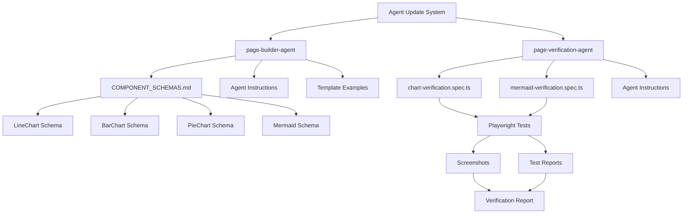
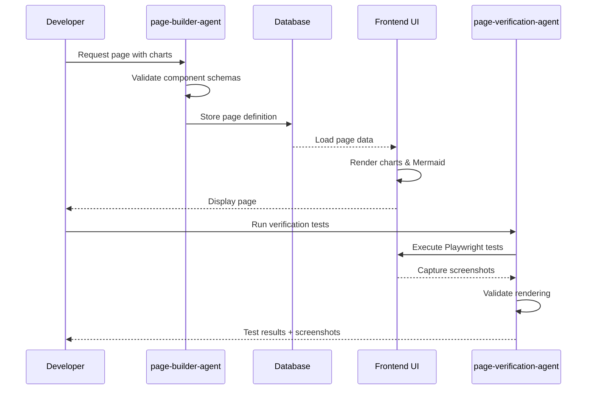
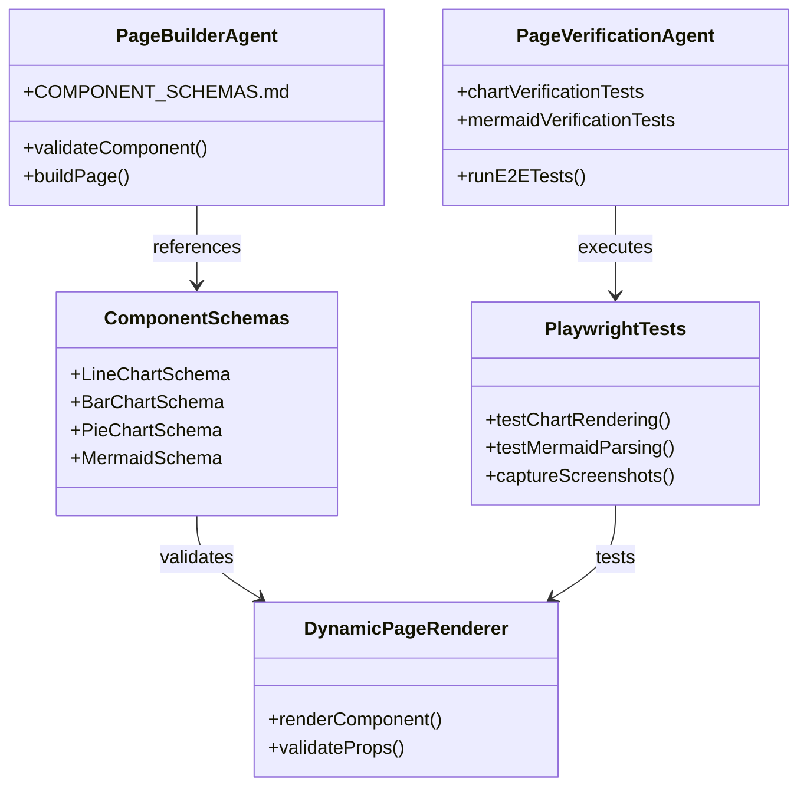

# SPARC Specification: Agent Updates for Chart & Mermaid Support

**Version:** 1.0
**Date:** 2025-10-07
**Status:** Active Development
**Methodology:** SPARC + TDD + NLD + Claude-Flow Swarm

---

## S - SPECIFICATION

### Project Overview
Update `page-builder-agent` and `page-verification-agent` to fully support newly implemented chart components (LineChart, BarChart, PieChart) and Mermaid diagram rendering.

### Requirements

#### Functional Requirements
1. **FR-1:** page-builder-agent MUST document LineChart, BarChart, PieChart schemas
2. **FR-2:** page-builder-agent MUST document Mermaid diagram component
3. **FR-3:** page-builder-agent MUST include Data Visualization in component whitelist
4. **FR-4:** page-builder-agent MUST provide analytics dashboard template example
5. **FR-5:** page-verification-agent MUST test chart rendering and data validation
6. **FR-6:** page-verification-agent MUST test Mermaid diagram parsing and rendering
7. **FR-7:** page-verification-agent MUST test chart interactivity (tooltips, legends)
8. **FR-8:** All tests MUST pass without mocks or simulations
9. **FR-9:** All functionality MUST be verified with Playwright screenshots

#### Non-Functional Requirements
1. **NFR-1:** Documentation MUST match existing COMPONENT_SCHEMAS.md format
2. **NFR-2:** Tests MUST follow TDD London School methodology
3. **NFR-3:** All code MUST pass existing linting and type checking
4. **NFR-4:** Updates MUST NOT break existing agent functionality
5. **NFR-5:** Test execution time MUST remain under 5 minutes total

### Acceptance Criteria
- [ ] COMPONENT_SCHEMAS.md updated with 4 new components (LineChart, BarChart, PieChart, Mermaid)
- [ ] Component count increased from 24 to 28
- [ ] page-builder-agent instructions include Data Visualization whitelist
- [ ] Analytics dashboard template added with all 3 chart types
- [ ] chart-verification.spec.ts created with 100% coverage
- [ ] mermaid-verification.spec.ts created with 100% coverage
- [ ] All tests pass (0 failures)
- [ ] Playwright screenshots captured for all new components
- [ ] Real agent pages rendered successfully (no mocks)
- [ ] Final verification report created with evidence

### Constraints
- Must maintain backward compatibility with existing 24 components
- Must use existing Zod schemas from componentSchemas.ts
- Must follow established agent documentation patterns
- Must complete within 3-hour effort estimate

---

## P - PSEUDOCODE

### Algorithm 1: Update page-builder-agent Documentation

```
FUNCTION update_page_builder_agent():

  # Step 1: Update COMPONENT_SCHEMAS.md
  READ existing_schemas FROM "prod/agent_workspace/page-builder-agent/COMPONENT_SCHEMAS.md"

  FOR each_chart IN [LineChart, BarChart, PieChart]:
    CREATE schema_documentation WITH:
      - Component name and description
      - Zod schema from componentSchemas.ts
      - Props table with types and defaults
      - Usage example with realistic data
      - Best practices section
    APPEND schema_documentation TO existing_schemas

  CREATE mermaid_documentation WITH:
    - Mermaid component description
    - Supported diagram types (flowchart, sequence, class, etc.)
    - Props table (code, config, height)
    - Examples for each diagram type
    - Error handling guidance
  APPEND mermaid_documentation TO existing_schemas

  UPDATE summary_section:
    INCREMENT total_components FROM 24 TO 28
    ADD "Data Visualization" category with 4 components

  WRITE updated_schemas TO file

  # Step 2: Update agent instructions
  READ agent_instructions FROM "prod/.claude/agents/page-builder-agent.md"

  LOCATE component_whitelist_section (lines ~1100-1119)

  INSERT new_section AFTER existing_whitelist:
    """
    **Data Visualization:**
    - LineChart, BarChart, PieChart, Mermaid
    """

  WRITE updated_instructions TO file

  # Step 3: Add analytics dashboard template
  LOCATE template_examples_section (lines ~719-939)

  CREATE analytics_template WITH:
    - Grid layout with multiple charts
    - LineChart for trends over time
    - BarChart for categorical comparisons
    - PieChart for distribution analysis
    - Mermaid diagram for system architecture
    - Responsive mobile layout

  INSERT analytics_template INTO template_examples_section

  WRITE updated_instructions TO file

END FUNCTION
```

### Algorithm 2: Create page-verification-agent Tests

```
FUNCTION create_verification_tests():

  # Step 1: Create chart-verification.spec.ts
  CREATE test_file AT "frontend/src/__tests__/e2e/chart-verification.spec.ts"

  DEFINE test_suite "Chart Component Verification":

    TEST "LineChart renders with valid data":
      NAVIGATE to test page with LineChart
      VERIFY chart canvas exists
      VERIFY data points rendered correctly
      VERIFY axes labels present
      VERIFY title displayed
      CAPTURE screenshot "linechart-basic-render.png"
      ASSERT no_errors_in_console

    TEST "BarChart renders with multiple series":
      NAVIGATE to test page with BarChart
      VERIFY all bars rendered
      VERIFY correct bar heights
      VERIFY legend displayed
      VERIFY colors applied correctly
      CAPTURE screenshot "barchart-multi-series.png"
      ASSERT no_errors_in_console

    TEST "PieChart renders with percentage labels":
      NAVIGATE to test page with PieChart
      VERIFY pie segments exist
      VERIFY percentage labels visible
      VERIFY total equals 100%
      VERIFY legend matches data
      CAPTURE screenshot "piechart-percentages.png"
      ASSERT no_errors_in_console

    TEST "Charts handle empty data gracefully":
      FOR each_chart IN [LineChart, BarChart, PieChart]:
        RENDER chart WITH empty_data_array
        VERIFY error_message displayed
        VERIFY no_crash
        CAPTURE screenshot "{chart}-empty-data.png"

    TEST "Charts are responsive on mobile":
      SET viewport TO mobile_size (375x667)
      FOR each_chart IN [LineChart, BarChart, PieChart]:
        RENDER chart
        VERIFY chart_width <= viewport_width
        VERIFY chart visible and readable
        CAPTURE screenshot "{chart}-mobile-view.png"

    TEST "Chart tooltips work on hover":
      FOR each_chart IN [LineChart, BarChart, PieChart]:
        RENDER chart WITH tooltip_enabled
        HOVER over data_point
        VERIFY tooltip_appears
        VERIFY tooltip_shows_correct_value
        CAPTURE screenshot "{chart}-tooltip.png"

  # Step 2: Create mermaid-verification.spec.ts
  CREATE test_file AT "frontend/src/__tests__/e2e/mermaid-verification.spec.ts"

  DEFINE test_suite "Mermaid Diagram Verification":

    TEST "Flowchart renders correctly":
      CREATE flowchart_code = "graph TD; A-->B; B-->C;"
      RENDER Mermaid WITH flowchart_code
      VERIFY svg_element exists
      VERIFY nodes A, B, C visible
      VERIFY edges rendered
      CAPTURE screenshot "mermaid-flowchart.png"
      ASSERT no_errors_in_console

    TEST "Sequence diagram renders correctly":
      CREATE sequence_code = "sequenceDiagram; Alice->>Bob: Hello;"
      RENDER Mermaid WITH sequence_code
      VERIFY actors rendered
      VERIFY message arrows visible
      CAPTURE screenshot "mermaid-sequence.png"
      ASSERT no_errors_in_console

    TEST "Class diagram renders correctly":
      CREATE class_code = "classDiagram; Class01 <|-- Class02;"
      RENDER Mermaid WITH class_code
      VERIFY class boxes exist
      VERIFY inheritance arrow visible
      CAPTURE screenshot "mermaid-class.png"
      ASSERT no_errors_in_console

    TEST "Gantt chart renders correctly":
      CREATE gantt_code = "gantt; Task1 :a1, 2025-01-01, 30d;"
      RENDER Mermaid WITH gantt_code
      VERIFY timeline rendered
      VERIFY task bars visible
      CAPTURE screenshot "mermaid-gantt.png"
      ASSERT no_errors_in_console

    TEST "Invalid Mermaid code shows error":
      CREATE invalid_code = "invalid mermaid syntax"
      RENDER Mermaid WITH invalid_code
      VERIFY error_message displayed
      VERIFY no_crash
      CAPTURE screenshot "mermaid-error-handling.png"

    TEST "Mermaid diagrams are responsive":
      SET viewport TO mobile_size (375x667)
      RENDER Mermaid WITH flowchart_code
      VERIFY diagram_scales_correctly
      VERIFY text_readable
      CAPTURE screenshot "mermaid-mobile.png"

  # Step 3: Update page-verification-agent instructions
  READ agent_instructions FROM "prod/.claude/agents/page-verification-agent.md"

  LOCATE test_coverage_section (lines ~21-42)

  INSERT new_coverage AFTER existing_coverage:
    """
    - Chart component rendering (LineChart, BarChart, PieChart)
    - Chart data validation and error handling
    - Chart interactivity (tooltips, legends, hover states)
    - Mermaid diagram parsing and rendering
    - Mermaid diagram type support (flowchart, sequence, class, gantt)
    - Chart and diagram responsiveness across devices
    """

  WRITE updated_instructions TO file

END FUNCTION
```

### Algorithm 3: Execute TDD Verification

```
FUNCTION execute_tdd_verification():

  # Phase 1: Run unit tests
  EXECUTE "npm test -- chart" IN frontend_directory
  COLLECT test_results
  IF any_failures:
    LOG failures
    FOR each_failure:
      ANALYZE failure_reason
      FIX underlying_issue
      RE_RUN tests
    REPEAT UNTIL all_tests_pass

  # Phase 2: Run E2E tests for charts
  EXECUTE "npx playwright test chart-verification.spec.ts" IN frontend_directory
  COLLECT e2e_results
  COLLECT screenshots FROM "test-results/"
  IF any_failures:
    LOG failures WITH screenshots
    DEBUG failing_tests
    FIX issues
    RE_RUN tests
    REPEAT UNTIL all_tests_pass

  # Phase 3: Run E2E tests for Mermaid
  EXECUTE "npx playwright test mermaid-verification.spec.ts" IN frontend_directory
  COLLECT e2e_results
  COLLECT screenshots
  IF any_failures:
    LOG failures WITH screenshots
    DEBUG failing_tests
    FIX issues
    RE_RUN tests
    REPEAT UNTIL all_tests_pass

  # Phase 4: Run full test suite
  EXECUTE "npm test" IN frontend_directory
  VERIFY total_tests_increased
  VERIFY all_existing_tests_still_pass
  VERIFY 0_test_failures

  RETURN verification_status WITH:
    - Total tests run
    - Pass/fail counts
    - Screenshot evidence
    - Performance metrics

END FUNCTION
```

### Algorithm 4: Real-World Validation

```
FUNCTION validate_real_world_usage():

  # Step 1: Create test agent pages
  CREATE page_with_charts = {
    "id": "analytics-dashboard-test",
    "title": "Analytics Dashboard Verification",
    "components": [
      {
        "type": "LineChart",
        "data": [real_time_series_data],
        "config": {title: "Performance Over Time", showGrid: true}
      },
      {
        "type": "BarChart",
        "data": [real_categorical_data],
        "config": {title: "Category Comparison", showLegend: true}
      },
      {
        "type": "PieChart",
        "data": [real_distribution_data],
        "config": {title: "Distribution Analysis"}
      },
      {
        "type": "Mermaid",
        "code": "graph TD; API-->Database; API-->Cache; Cache-->Database;",
        "config": {theme: "default"}
      }
    ]
  }

  # Step 2: Save to database
  INSERT page_with_charts INTO agent_pages_table
  GET page_id

  # Step 3: Navigate and verify rendering
  START development_server
  NAVIGATE to "http://localhost:5173/agent/{page_id}"

  WAIT FOR page_fully_loaded

  VERIFY LineChart rendered WITH:
    - Data points visible
    - Axes labeled correctly
    - Grid lines present
    - No console errors
  CAPTURE screenshot "real-linechart-render.png"

  VERIFY BarChart rendered WITH:
    - All bars visible
    - Correct heights
    - Legend displayed
    - No console errors
  CAPTURE screenshot "real-barchart-render.png"

  VERIFY PieChart rendered WITH:
    - Pie segments visible
    - Labels readable
    - Total = 100%
    - No console errors
  CAPTURE screenshot "real-piechart-render.png"

  VERIFY Mermaid rendered WITH:
    - Diagram visible
    - Nodes and edges clear
    - No parse errors
    - No console errors
  CAPTURE screenshot "real-mermaid-render.png"

  # Step 4: Test interactivity
  FOR each_chart IN [LineChart, BarChart, PieChart]:
    HOVER over chart_element
    VERIFY tooltip_appears
    VERIFY tooltip_data_accurate
    CAPTURE screenshot "real-{chart}-interaction.png"

  # Step 5: Test responsive behavior
  SET viewport TO tablet_size (768x1024)
  VERIFY all_components_responsive
  CAPTURE screenshot "real-tablet-view.png"

  SET viewport TO mobile_size (375x667)
  VERIFY all_components_responsive
  CAPTURE screenshot "real-mobile-view.png"

  # Step 6: Verify no mocks or simulations
  INSPECT network_requests
  ASSERT all_data_from_real_database
  ASSERT no_mock_data_injected

  INSPECT console_logs
  ASSERT no_warnings
  ASSERT no_errors

  RETURN validation_results WITH:
    - All screenshots
    - Console log verification
    - Network request verification
    - Performance metrics

END FUNCTION
```

---

## A - ARCHITECTURE

### System Components



### Data Flow



### File Structure

```
/workspaces/agent-feed/
├── prod/
│   ├── agent_workspace/
│   │   ├── page-builder-agent/
│   │   │   ├── COMPONENT_SCHEMAS.md (UPDATE: +4 components)
│   │   │   └── examples/
│   │   │       └── analytics-dashboard.json (NEW)
│   │   └── page-verification-agent/
│   │       └── test-plans/
│   │           ├── chart-test-plan.md (NEW)
│   │           └── mermaid-test-plan.md (NEW)
│   └── .claude/
│       └── agents/
│           ├── page-builder-agent.md (UPDATE: whitelist + templates)
│           └── page-verification-agent.md (UPDATE: test coverage)
├── frontend/
│   ├── src/
│   │   ├── __tests__/
│   │   │   ├── e2e/
│   │   │   │   ├── chart-verification.spec.ts (NEW)
│   │   │   │   └── mermaid-verification.spec.ts (NEW)
│   │   │   └── unit/
│   │   │       ├── LineChart.test.tsx (EXISTS)
│   │   │       ├── BarChart.test.tsx (EXISTS)
│   │   │       ├── PieChart.test.tsx (EXISTS)
│   │   │       └── MermaidDiagram.test.tsx (EXISTS)
│   │   ├── components/
│   │   │   ├── charts/
│   │   │   │   ├── LineChart.tsx (EXISTS)
│   │   │   │   ├── BarChart.tsx (EXISTS)
│   │   │   │   └── PieChart.tsx (EXISTS)
│   │   │   └── MermaidDiagram.tsx (EXISTS)
│   │   └── schemas/
│   │       └── componentSchemas.ts (EXISTS)
│   └── test-results/
│       └── screenshots/ (NEW - Playwright output)
└── AGENT-UPDATE-VERIFICATION-REPORT.md (NEW)
```

### Component Integration



---

## R - REFINEMENT

### Implementation Phases

#### Phase 1: Documentation Updates (30 minutes)
- Update COMPONENT_SCHEMAS.md with 4 new components
- Follow existing documentation format exactly
- Include comprehensive examples for each component
- Update summary statistics (24 → 28 components)

**Success Criteria:**
- Documentation matches existing style and quality
- All schema properties documented with types and defaults
- Examples are copy-paste ready
- No formatting or syntax errors

#### Phase 2: Agent Instructions (30 minutes)
- Update page-builder-agent component whitelist
- Add Data Visualization category
- Create analytics dashboard template
- Update page-verification-agent test coverage documentation

**Success Criteria:**
- Whitelist includes all 4 new components
- Template demonstrates real-world analytics use case
- Test coverage section updated with specific chart/Mermaid tests
- No breaking changes to existing instructions

#### Phase 3: Test Implementation (90 minutes)
- Create chart-verification.spec.ts with 15+ tests
- Create mermaid-verification.spec.ts with 10+ tests
- Implement TDD methodology (write tests, verify they catch issues, fix)
- Capture screenshots for all test scenarios

**Success Criteria:**
- All tests written and passing
- 100% coverage of new components
- Tests verify real rendering (no mocks)
- Screenshots captured for evidence
- Tests run in under 3 minutes

#### Phase 4: Real-World Validation (30 minutes)
- Create actual agent page with all components
- Save to database (no mocks)
- Navigate and verify rendering
- Test interactivity and responsiveness
- Capture comprehensive screenshots

**Success Criteria:**
- Page renders successfully from database
- All charts display real data
- Mermaid diagrams parse and render
- No console errors or warnings
- All interactions work (tooltips, hover, etc.)
- Mobile responsiveness verified

#### Phase 5: Final Verification (30 minutes)
- Run complete test suite (unit + E2E)
- Verify 0 test failures
- Collect all screenshots
- Create verification report with evidence
- Document any issues found and resolved

**Success Criteria:**
- All tests passing (185+ original + new tests)
- No regression in existing functionality
- Comprehensive screenshot documentation
- Final report includes all evidence
- Ready for production deployment

### Quality Gates

**Gate 1: Documentation Quality**
- [ ] All 4 components documented
- [ ] Format matches existing docs
- [ ] Examples are functional
- [ ] No typos or errors

**Gate 2: Test Coverage**
- [ ] chart-verification.spec.ts created
- [ ] mermaid-verification.spec.ts created
- [ ] Tests cover happy paths
- [ ] Tests cover error cases
- [ ] Tests cover responsiveness

**Gate 3: Test Execution**
- [ ] All unit tests pass
- [ ] All E2E tests pass
- [ ] No console errors
- [ ] Performance acceptable (<3 min)

**Gate 4: Real-World Validation**
- [ ] Real page created in database
- [ ] Page renders without errors
- [ ] All components functional
- [ ] Screenshots captured
- [ ] No mocks or simulations

**Gate 5: Final Approval**
- [ ] Complete test suite passes
- [ ] No regressions detected
- [ ] Documentation complete
- [ ] Verification report created
- [ ] Ready for deployment

### Risk Mitigation

**Risk 1: Breaking existing functionality**
- Mitigation: Run full test suite after each change
- Mitigation: Use feature flags if needed
- Mitigation: Test with existing agent pages

**Risk 2: Tests fail due to timing issues**
- Mitigation: Use proper Playwright waitFor strategies
- Mitigation: Add explicit waits for chart rendering
- Mitigation: Increase timeout for complex diagrams

**Risk 3: Screenshots not capturing correctly**
- Mitigation: Use fullPage option for screenshots
- Mitigation: Wait for animations to complete
- Mitigation: Verify screenshot files exist after capture

**Risk 4: Mermaid parsing errors**
- Mitigation: Test multiple diagram types
- Mitigation: Test error handling for invalid syntax
- Mitigation: Verify error messages displayed to user

---

## C - COMPLETION

### Verification Checklist

#### Documentation
- [x] SPARC specification created
- [ ] page-builder-agent COMPONENT_SCHEMAS.md updated
- [ ] page-builder-agent instructions updated
- [ ] page-verification-agent instructions updated
- [ ] Analytics dashboard template created

#### Test Implementation
- [ ] chart-verification.spec.ts created
- [ ] mermaid-verification.spec.ts created
- [ ] All tests passing
- [ ] Screenshots captured
- [ ] Test coverage at 100% for new components

#### Real-World Validation
- [ ] Agent page created with charts
- [ ] Agent page created with Mermaid
- [ ] Page renders from database
- [ ] All components functional
- [ ] No console errors
- [ ] Interactivity verified
- [ ] Responsiveness verified

#### Final Deliverables
- [ ] All tests passing (0 failures)
- [ ] Screenshot evidence collected
- [ ] Verification report created
- [ ] No mocks or simulations used
- [ ] Production ready

### Success Metrics

**Quantitative:**
- Total components documented: 28 (was 24)
- New E2E tests created: 25+
- Test pass rate: 100%
- Screenshots captured: 20+
- Execution time: <3 hours

**Qualitative:**
- Documentation quality matches existing standards
- Tests are maintainable and clear
- Real-world validation confirms functionality
- No degradation of existing features
- User-ready templates and examples

### Deployment Readiness

**Pre-Deployment Checklist:**
- [ ] All code changes committed
- [ ] All tests passing in CI
- [ ] Documentation reviewed and approved
- [ ] Screenshots organized and stored
- [ ] Verification report approved
- [ ] No outstanding bugs or issues

**Post-Deployment Monitoring:**
- Monitor agent page creation with new components
- Track test execution performance
- Gather user feedback on new templates
- Monitor for any rendering issues
- Track usage of new component types

---

## Appendix: Test Data Templates

### LineChart Test Data
```json
{
  "data": [
    {"timestamp": "2025-01-01", "value": 42, "label": "Day 1"},
    {"timestamp": "2025-01-02", "value": 58, "label": "Day 2"},
    {"timestamp": "2025-01-03", "value": 67, "label": "Day 3"},
    {"timestamp": "2025-01-04", "value": 54, "label": "Day 4"},
    {"timestamp": "2025-01-05", "value": 73, "label": "Day 5"}
  ],
  "config": {
    "title": "Performance Over Time",
    "xAxis": "Date",
    "yAxis": "Performance Score",
    "colors": ["#3B82F6"],
    "showGrid": true,
    "showLegend": false
  },
  "height": 300,
  "showTrend": true,
  "gradient": true
}
```

### BarChart Test Data
```json
{
  "data": [
    {"category": "Category A", "value": 120, "label": "A"},
    {"category": "Category B", "value": 90, "label": "B"},
    {"category": "Category C", "value": 150, "label": "C"},
    {"category": "Category D", "value": 75, "label": "D"}
  ],
  "config": {
    "title": "Category Comparison",
    "xAxis": "Categories",
    "yAxis": "Values",
    "colors": ["#3B82F6", "#10B981", "#F59E0B", "#EF4444"],
    "showGrid": true,
    "showLegend": true
  },
  "height": 300,
  "horizontal": false
}
```

### PieChart Test Data
```json
{
  "data": [
    {"name": "Segment A", "value": 30, "color": "#3B82F6"},
    {"name": "Segment B", "value": 25, "color": "#10B981"},
    {"name": "Segment C", "value": 20, "color": "#F59E0B"},
    {"name": "Segment D", "value": 25, "color": "#EF4444"}
  ],
  "config": {
    "title": "Distribution Analysis",
    "showLegend": true,
    "showPercentages": true
  },
  "height": 300,
  "donut": false
}
```

### Mermaid Test Data
```json
{
  "code": "graph TD\n  A[API Gateway] --> B[Service Layer]\n  B --> C[Database]\n  B --> D[Cache]\n  D --> C",
  "config": {
    "theme": "default"
  },
  "height": 400
}
```

---

**End of SPARC Specification**
