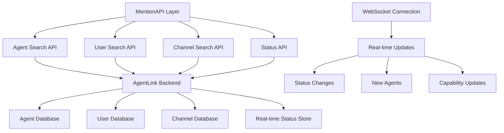

# @ Mention System - API Integration Patterns

## API Architecture Overview

The @ mention system integrates with multiple APIs to provide comprehensive search and filtering capabilities:



## Core API Interfaces

### MentionAPI Base Interface
```typescript
interface MentionAPI {
  // Search operations
  searchAgents(query: string, options: AgentSearchOptions): Promise<AgentSuggestion[]>;
  searchUsers(query: string, options: UserSearchOptions): Promise<UserSuggestion[]>;
  searchChannels(query: string, options: ChannelSearchOptions): Promise<ChannelSuggestion[]>;
  
  // Unified search
  searchAll(query: string, options: UnifiedSearchOptions): Promise<MentionSuggestion[]>;
  
  // Agent-specific operations
  getAgentDetails(agentId: string): Promise<AgentDetails>;
  getAgentStatus(agentId: string): Promise<AgentStatus>;
  getAgentCapabilities(agentId: string): Promise<AgentCapabilities>;
  
  // User operations
  getUserDetails(userId: string): Promise<UserDetails>;
  getUserPermissions(userId: string): Promise<UserPermissions>;
  
  // Real-time subscriptions
  subscribeToAgentUpdates(callback: (update: AgentUpdate) => void): Subscription;
  subscribeToUserUpdates(callback: (update: UserUpdate) => void): Subscription;
}

interface AgentSearchOptions {
  types?: AgentType[];
  capabilities?: string[];
  status?: AgentStatus[];
  tags?: string[];
  limit?: number;
  offset?: number;
  sortBy?: 'name' | 'status' | 'lastActive' | 'relevance';
  sortOrder?: 'asc' | 'desc';
}

interface MentionSuggestion {
  id: string;
  type: 'agent' | 'user' | 'channel';
  name: string;
  displayName: string;
  avatar?: string;
  description: string;
  tags: string[];
  status: 'online' | 'offline' | 'busy' | 'away';
  relevanceScore: number;
  lastActive?: Date;
  capabilities?: string[];
  permissions?: Permission[];
}
```

## Agent Search API Implementation

### AgentSearchService
```typescript
class AgentSearchService implements AgentSearchAPI {
  private baseUrl: string;
  private httpClient: HttpClient;
  private cache: LRUCache<string, AgentSuggestion[]>;
  
  constructor(baseUrl: string) {
    this.baseUrl = baseUrl;
    this.httpClient = new HttpClient(baseUrl);
    this.cache = new LRUCache(100); // Cache last 100 searches
  }
  
  async searchAgents(query: string, options: AgentSearchOptions): Promise<AgentSuggestion[]> {
    const cacheKey = this.buildCacheKey(query, options);
    
    // Check cache first
    if (this.cache.has(cacheKey)) {
      return this.cache.get(cacheKey)!;
    }
    
    try {
      const response = await this.httpClient.post('/api/agents/search', {
        query,
        filters: {
          types: options.types,
          capabilities: options.capabilities,
          status: options.status,
          tags: options.tags
        },
        pagination: {
          limit: options.limit || 10,
          offset: options.offset || 0
        },
        sort: {
          field: options.sortBy || 'relevance',
          order: options.sortOrder || 'desc'
        }
      });
      
      const agents = response.data.agents.map(this.mapAgentToSuggestion);
      
      // Cache results with TTL
      this.cache.set(cacheKey, agents);
      
      return agents;
    } catch (error) {
      throw new APIError('Agent search failed', error);
    }
  }
  
  private mapAgentToSuggestion(agent: any): AgentSuggestion {
    return {
      id: agent.id,
      type: 'agent',
      name: agent.name,
      displayName: agent.display_name || agent.name,
      avatar: agent.avatar_url,
      description: agent.description,
      tags: agent.tags || [],
      status: agent.status,
      relevanceScore: agent.relevance_score || 0,
      lastActive: agent.last_active ? new Date(agent.last_active) : undefined,
      capabilities: agent.capabilities || [],
      permissions: agent.permissions || []
    };
  }
  
  private buildCacheKey(query: string, options: AgentSearchOptions): string {
    return `agents:${query}:${JSON.stringify(options)}`;
  }
}
```

## Unified Search Implementation

### UnifiedMentionSearchService
```typescript
class UnifiedMentionSearchService {
  constructor(
    private agentService: AgentSearchService,
    private userService: UserSearchService,
    private channelService: ChannelSearchService
  ) {}
  
  async searchAll(query: string, options: UnifiedSearchOptions): Promise<MentionSuggestion[]> {
    const searchPromises: Promise<MentionSuggestion[]>[] = [];
    
    // Determine which services to search based on allowed types
    if (!options.allowedTypes || options.allowedTypes.includes('agent')) {
      searchPromises.push(
        this.agentService.searchAgents(query, {
          limit: Math.ceil((options.limit || 10) / 3),
          ...options.agentOptions
        })
      );
    }
    
    if (!options.allowedTypes || options.allowedTypes.includes('user')) {
      searchPromises.push(
        this.userService.searchUsers(query, {
          limit: Math.ceil((options.limit || 10) / 3),
          ...options.userOptions
        })
      );
    }
    
    if (!options.allowedTypes || options.allowedTypes.includes('channel')) {
      searchPromises.push(
        this.channelService.searchChannels(query, {
          limit: Math.ceil((options.limit || 10) / 3),
          ...options.channelOptions
        })
      );
    }
    
    try {
      // Execute searches in parallel
      const results = await Promise.allSettled(searchPromises);
      
      // Combine and filter successful results
      const allSuggestions = results
        .filter(result => result.status === 'fulfilled')
        .flatMap(result => (result as PromiseFulfilledResult<MentionSuggestion[]>).value);
      
      // Sort by relevance and limit results
      return this.rankAndFilterResults(allSuggestions, options);
    } catch (error) {
      throw new APIError('Unified search failed', error);
    }
  }
  
  private rankAndFilterResults(
    suggestions: MentionSuggestion[], 
    options: UnifiedSearchOptions
  ): MentionSuggestion[] {
    return suggestions
      .sort((a, b) => {
        // Primary sort by relevance score
        if (a.relevanceScore !== b.relevanceScore) {
          return b.relevanceScore - a.relevanceScore;
        }
        
        // Secondary sort by status (online agents first)
        const statusPriority = { online: 3, away: 2, busy: 1, offline: 0 };
        return statusPriority[b.status] - statusPriority[a.status];
      })
      .slice(0, options.limit || 10);
  }
}
```

## Real-time API Integration

### WebSocket API Manager
```typescript
class MentionWebSocketManager {
  private ws: WebSocket | null = null;
  private subscribers = new Map<string, Set<(update: any) => void>>();
  private reconnectAttempts = 0;
  private maxReconnectAttempts = 5;
  private reconnectDelay = 1000;
  
  constructor(private wsUrl: string) {
    this.connect();
  }
  
  private connect() {
    try {
      this.ws = new WebSocket(this.wsUrl);
      
      this.ws.onopen = () => {
        console.log('Mention WebSocket connected');
        this.reconnectAttempts = 0;
        this.subscribeToChannels();
      };
      
      this.ws.onmessage = (event) => {
        try {
          const message = JSON.parse(event.data);
          this.handleMessage(message);
        } catch (error) {
          console.error('Failed to parse WebSocket message:', error);
        }
      };
      
      this.ws.onclose = () => {
        console.log('Mention WebSocket disconnected');
        this.attemptReconnection();
      };
      
      this.ws.onerror = (error) => {
        console.error('Mention WebSocket error:', error);
      };
    } catch (error) {
      console.error('Failed to create WebSocket connection:', error);
      this.attemptReconnection();
    }
  }
  
  private handleMessage(message: WebSocketMessage) {
    const { type, data } = message;
    
    switch (type) {
      case 'agent_status_update':
        this.notifySubscribers('agent_status', data);
        break;
        
      case 'agent_capabilities_changed':
        this.notifySubscribers('agent_capabilities', data);
        break;
        
      case 'new_agent_available':
        this.notifySubscribers('agent_available', data);
        break;
        
      case 'user_status_update':
        this.notifySubscribers('user_status', data);
        break;
        
      default:
        console.warn('Unknown WebSocket message type:', type);
    }
  }
  
  subscribe(channel: string, callback: (data: any) => void): () => void {
    if (!this.subscribers.has(channel)) {
      this.subscribers.set(channel, new Set());
    }
    
    this.subscribers.get(channel)!.add(callback);
    
    // Return unsubscribe function
    return () => {
      this.subscribers.get(channel)?.delete(callback);
    };
  }
  
  private notifySubscribers(channel: string, data: any) {
    const callbacks = this.subscribers.get(channel);
    if (callbacks) {
      callbacks.forEach(callback => {
        try {
          callback(data);
        } catch (error) {
          console.error('Error in WebSocket subscriber callback:', error);
        }
      });
    }
  }
}
```

## Error Handling and Retry Logic

### API Error Handling Strategy
```typescript
class APIErrorHandler {
  private retryDelays = [1000, 2000, 4000, 8000]; // Exponential backoff
  
  async executeWithRetry<T>(
    operation: () => Promise<T>,
    options: RetryOptions = {}
  ): Promise<T> {
    const maxAttempts = options.maxAttempts || 3;
    const shouldRetry = options.shouldRetry || this.defaultShouldRetry;
    
    for (let attempt = 1; attempt <= maxAttempts; attempt++) {
      try {
        return await operation();
      } catch (error) {
        if (attempt === maxAttempts || !shouldRetry(error)) {
          throw error;
        }
        
        const delay = this.retryDelays[attempt - 1] || 8000;
        await this.delay(delay);
      }
    }
    
    throw new Error('Max retry attempts exceeded');
  }
  
  private defaultShouldRetry(error: any): boolean {
    // Retry on network errors and 5xx server errors
    return (
      error.name === 'NetworkError' ||
      error.code === 'NETWORK_ERROR' ||
      (error.status >= 500 && error.status < 600)
    );
  }
  
  private delay(ms: number): Promise<void> {
    return new Promise(resolve => setTimeout(resolve, ms));
  }
}

// Usage in API services
class ResilientMentionAPI implements MentionAPI {
  private errorHandler = new APIErrorHandler();
  
  async searchAll(query: string, options: UnifiedSearchOptions): Promise<MentionSuggestion[]> {
    return this.errorHandler.executeWithRetry(
      () => this.unifiedSearchService.searchAll(query, options),
      {
        maxAttempts: 3,
        shouldRetry: (error) => this.isRetryableSearchError(error)
      }
    );
  }
  
  private isRetryableSearchError(error: any): boolean {
    // Don't retry on client errors (4xx) except rate limits
    if (error.status >= 400 && error.status < 500 && error.status !== 429) {
      return false;
    }
    return true;
  }
}
```

## API Response Caching

### Intelligent Cache Strategy
```typescript
class MentionAPICache {
  private searchCache = new LRUCache<string, CachedResponse>(100);
  private agentCache = new Map<string, CachedAgentDetails>();
  private statusCache = new Map<string, CachedStatus>();
  
  async get<T>(
    key: string, 
    fetcher: () => Promise<T>,
    ttl: number = 300000 // 5 minutes default
  ): Promise<T> {
    const cached = this.searchCache.get(key);
    
    if (cached && Date.now() - cached.timestamp < ttl) {
      return cached.data;
    }
    
    // Fetch fresh data
    const data = await fetcher();
    
    // Update cache
    this.searchCache.set(key, {
      data,
      timestamp: Date.now()
    });
    
    return data;
  }
  
  invalidate(pattern: string): void {
    // Invalidate cache entries matching pattern
    const keysToDelete: string[] = [];
    
    for (const [key] of this.searchCache.entries()) {
      if (key.includes(pattern)) {
        keysToDelete.push(key);
      }
    }
    
    keysToDelete.forEach(key => this.searchCache.delete(key));
  }
  
  // Real-time cache updates from WebSocket
  handleStatusUpdate(agentId: string, status: AgentStatus): void {
    // Update agent status cache
    this.statusCache.set(agentId, {
      status,
      timestamp: Date.now()
    });
    
    // Invalidate related search caches
    this.invalidate(`agent:${agentId}`);
    this.invalidate('agents:'); // Invalidate agent searches
  }
}
```

## Authentication and Authorization

### API Security Layer
```typescript
class SecureMentionAPI {
  private authToken: string | null = null;
  
  constructor(private baseAPI: MentionAPI) {
    this.setupAuthInterceptor();
  }
  
  private setupAuthInterceptor() {
    // Add auth token to all requests
    this.httpClient.interceptors.request.use((config) => {
      if (this.authToken) {
        config.headers.Authorization = `Bearer ${this.authToken}`;
      }
      return config;
    });
    
    // Handle auth errors
    this.httpClient.interceptors.response.use(
      (response) => response,
      (error) => {
        if (error.status === 401) {
          this.handleAuthError();
        }
        return Promise.reject(error);
      }
    );
  }
  
  async searchWithPermissions(
    query: string, 
    options: SearchOptions
  ): Promise<MentionSuggestion[]> {
    // Get user permissions
    const permissions = await this.getUserPermissions();
    
    // Filter search options based on permissions
    const filteredOptions = this.applyPermissionFilters(options, permissions);
    
    // Perform search with filtered options
    const results = await this.baseAPI.searchAll(query, filteredOptions);
    
    // Filter results based on user access rights
    return this.filterResultsByAccess(results, permissions);
  }
  
  private applyPermissionFilters(
    options: SearchOptions, 
    permissions: UserPermissions
  ): SearchOptions {
    return {
      ...options,
      allowedTypes: options.allowedTypes?.filter(type => 
        permissions.canSearchType(type)
      ),
      agentOptions: {
        ...options.agentOptions,
        types: options.agentOptions?.types?.filter(type =>
          permissions.canAccessAgentType(type)
        )
      }
    };
  }
}
```

This API integration architecture provides a robust, secure, and efficient foundation for the @ mention system's backend connectivity while maintaining high performance and user experience standards.