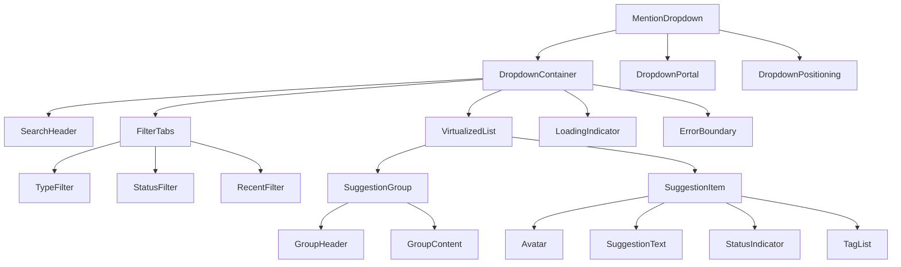

# @ Mention System - Autocomplete Dropdown Architecture

## Dropdown Component Architecture



## Core Dropdown Components

### MentionDropdown (Main Container)
```typescript
interface MentionDropdownProps {
  suggestions: MentionSuggestion[];
  isOpen: boolean;
  position: DropdownPosition;
  selectedIndex: number;
  onSelect: (suggestion: MentionSuggestion) => void;
  onClose: () => void;
  filters: FilterState;
  onFilterChange: (filters: FilterState) => void;
  groupBy: GroupByType;
  sortBy: SortByType;
  maxHeight?: number;
  maxWidth?: number;
  className?: string;
}

const MentionDropdown: React.FC<MentionDropdownProps> = ({
  suggestions,
  isOpen,
  position,
  selectedIndex,
  onSelect,
  onClose,
  filters,
  onFilterChange,
  groupBy,
  sortBy,
  maxHeight = 300,
  maxWidth = 400,
  className
}) => {
  const dropdownRef = useRef<HTMLDivElement>(null);
  const [adjustedPosition, setAdjustedPosition] = useState(position);
  
  // Dynamic positioning to prevent overflow
  useEffect(() => {
    if (isOpen && dropdownRef.current) {
      const adjusted = calculateOptimalPosition(
        position,
        dropdownRef.current.getBoundingClientRect(),
        { maxHeight, maxWidth }
      );
      setAdjustedPosition(adjusted);
    }
  }, [isOpen, position, suggestions.length]);
  
  // Keyboard navigation
  useEffect(() => {
    const handleKeyDown = (event: KeyboardEvent) => {
      if (!isOpen) return;
      
      switch (event.key) {
        case 'ArrowDown':
          event.preventDefault();
          onNavigate('down');
          break;
        case 'ArrowUp':
          event.preventDefault();
          onNavigate('up');
          break;
        case 'Enter':
          event.preventDefault();
          if (selectedIndex >= 0 && suggestions[selectedIndex]) {
            onSelect(suggestions[selectedIndex]);
          }
          break;
        case 'Escape':
          event.preventDefault();
          onClose();
          break;
        case 'Tab':
          onClose();
          break;
      }
    };
    
    if (isOpen) {
      document.addEventListener('keydown', handleKeyDown);
      return () => document.removeEventListener('keydown', handleKeyDown);
    }
  }, [isOpen, selectedIndex, suggestions]);
  
  if (!isOpen || suggestions.length === 0) {
    return null;
  }
  
  return (
    <DropdownPortal>
      <div
        ref={dropdownRef}
        className={cn(
          "mention-dropdown",
          "absolute z-50 bg-white border border-gray-200 rounded-lg shadow-lg",
          "max-w-sm w-full overflow-hidden",
          className
        )}
        style={{
          left: adjustedPosition.x,
          top: adjustedPosition.y,
          maxHeight: maxHeight,
          maxWidth: maxWidth
        }}
        onClick={(e) => e.stopPropagation()}
      >
        <SearchHeader 
          query={filters.query}
          resultCount={suggestions.length}
        />
        
        <FilterTabs
          filters={filters}
          onFilterChange={onFilterChange}
          counts={getFilterCounts(suggestions)}
        />
        
        <VirtualizedMentionList
          suggestions={suggestions}
          selectedIndex={selectedIndex}
          onSelect={onSelect}
          groupBy={groupBy}
          sortBy={sortBy}
          maxHeight={maxHeight - 120} // Account for header and filters
        />
      </div>
    </DropdownPortal>
  );
};
```

### Virtualized Suggestion List
```typescript
interface VirtualizedMentionListProps {
  suggestions: MentionSuggestion[];
  selectedIndex: number;
  onSelect: (suggestion: MentionSuggestion) => void;
  groupBy: GroupByType;
  sortBy: SortByType;
  maxHeight: number;
  itemHeight?: number;
  groupHeaderHeight?: number;
}

const VirtualizedMentionList: React.FC<VirtualizedMentionListProps> = ({
  suggestions,
  selectedIndex,
  onSelect,
  groupBy,
  sortBy,
  maxHeight,
  itemHeight = 56,
  groupHeaderHeight = 32
}) => {
  const [scrollTop, setScrollTop] = useState(0);
  const containerRef = useRef<HTMLDivElement>(null);
  
  // Group and sort suggestions
  const groupedSuggestions = useMemo(() => {
    const sorted = sortSuggestions(suggestions, sortBy);
    return groupSuggestions(sorted, groupBy);
  }, [suggestions, groupBy, sortBy]);
  
  // Calculate visible items for virtualization
  const virtualItems = useMemo(() => {
    const items: VirtualItem[] = [];
    let currentIndex = 0;
    let currentY = 0;
    
    groupedSuggestions.forEach((group, groupIndex) => {
      // Add group header
      items.push({
        type: 'group-header',
        index: currentIndex++,
        y: currentY,
        height: groupHeaderHeight,
        data: { groupName: group.name, count: group.items.length }
      });
      currentY += groupHeaderHeight;
      
      // Add group items
      group.items.forEach((suggestion, itemIndex) => {
        items.push({
          type: 'suggestion',
          index: currentIndex++,
          y: currentY,
          height: itemHeight,
          data: { suggestion, originalIndex: group.startIndex + itemIndex }
        });
        currentY += itemHeight;
      });
    });
    
    return items;
  }, [groupedSuggestions, itemHeight, groupHeaderHeight]);
  
  // Calculate visible range
  const visibleRange = useMemo(() => {
    const start = Math.floor(scrollTop / itemHeight);
    const end = Math.min(
      start + Math.ceil(maxHeight / itemHeight) + 1,
      virtualItems.length
    );
    return { start, end };
  }, [scrollTop, itemHeight, maxHeight, virtualItems.length]);
  
  // Auto-scroll to selected item
  useEffect(() => {
    if (selectedIndex >= 0 && containerRef.current) {
      const selectedItem = virtualItems.find(
        item => item.type === 'suggestion' && item.data.originalIndex === selectedIndex
      );
      
      if (selectedItem) {
        const container = containerRef.current;
        const itemTop = selectedItem.y;
        const itemBottom = selectedItem.y + selectedItem.height;
        const containerTop = scrollTop;
        const containerBottom = scrollTop + maxHeight;
        
        if (itemTop < containerTop) {
          container.scrollTop = itemTop;
        } else if (itemBottom > containerBottom) {
          container.scrollTop = itemBottom - maxHeight;
        }
      }
    }
  }, [selectedIndex, virtualItems, maxHeight, scrollTop]);
  
  const totalHeight = virtualItems[virtualItems.length - 1]?.y + virtualItems[virtualItems.length - 1]?.height || 0;
  
  return (
    <div
      ref={containerRef}
      className="mention-list-container overflow-auto"
      style={{ maxHeight }}
      onScroll={(e) => setScrollTop(e.currentTarget.scrollTop)}
    >
      <div style={{ height: totalHeight, position: 'relative' }}>
        {virtualItems.slice(visibleRange.start, visibleRange.end).map((item) => (
          <div
            key={item.index}
            style={{
              position: 'absolute',
              top: item.y,
              left: 0,
              right: 0,
              height: item.height
            }}
          >
            {item.type === 'group-header' ? (
              <GroupHeader 
                name={item.data.groupName} 
                count={item.data.count} 
              />
            ) : (
              <SuggestionItem
                suggestion={item.data.suggestion}
                isSelected={item.data.originalIndex === selectedIndex}
                onClick={() => onSelect(item.data.suggestion)}
              />
            )}
          </div>
        ))}
      </div>
    </div>
  );
};
```

## Positioning and Portal System

### Smart Positioning Algorithm
```typescript
interface DropdownPosition {
  x: number;
  y: number;
  placement: 'bottom' | 'top' | 'bottom-start' | 'top-start';
}

class DropdownPositionCalculator {
  calculateOptimalPosition(
    anchorRect: DOMRect,
    dropdownSize: { width: number; height: number },
    viewport: { width: number; height: number },
    offset: { x: number; y: number } = { x: 0, y: 4 }
  ): DropdownPosition {
    
    let x = anchorRect.left + offset.x;
    let y = anchorRect.bottom + offset.y;
    let placement: DropdownPosition['placement'] = 'bottom-start';
    
    // Check if dropdown fits below anchor
    if (y + dropdownSize.height > viewport.height) {
      // Try placing above
      const topY = anchorRect.top - dropdownSize.height - offset.y;
      if (topY >= 0) {
        y = topY;
        placement = 'top-start';
      } else {
        // Keep below but adjust to fit in viewport
        y = viewport.height - dropdownSize.height - 10;
        placement = 'bottom-start';
      }
    }
    
    // Check horizontal overflow
    if (x + dropdownSize.width > viewport.width) {
      x = viewport.width - dropdownSize.width - 10;
    }
    
    // Ensure minimum distance from left edge
    x = Math.max(10, x);
    
    return { x, y, placement };
  }
}

// Portal component for proper z-index layering
const DropdownPortal: React.FC<{ children: React.ReactNode }> = ({ children }) => {
  const portalRoot = useMemo(() => {
    let root = document.getElementById('mention-dropdown-portal');
    if (!root) {
      root = document.createElement('div');
      root.id = 'mention-dropdown-portal';
      root.style.position = 'absolute';
      root.style.top = '0';
      root.style.left = '0';
      root.style.zIndex = '9999';
      document.body.appendChild(root);
    }
    return root;
  }, []);
  
  return createPortal(children, portalRoot);
};
```

## Filter and Search Interface

### FilterTabs Component
```typescript
interface FilterTabsProps {
  filters: FilterState;
  onFilterChange: (filters: FilterState) => void;
  counts: FilterCounts;
}

const FilterTabs: React.FC<FilterTabsProps> = ({ filters, onFilterChange, counts }) => {
  const filterOptions = useMemo(() => [
    { key: 'all', label: 'All', count: counts.total },
    { key: 'agents', label: 'Agents', count: counts.agents },
    { key: 'users', label: 'Users', count: counts.users },
    { key: 'channels', label: 'Channels', count: counts.channels },
    { key: 'online', label: 'Online', count: counts.online },
    { key: 'recent', label: 'Recent', count: counts.recent }
  ], [counts]);
  
  return (
    <div className="filter-tabs border-b border-gray-100 px-2">
      <div className="flex space-x-1 overflow-x-auto scrollbar-none">
        {filterOptions.map(option => (
          <button
            key={option.key}
            onClick={() => onFilterChange({
              ...filters,
              activeTab: option.key as FilterTab
            })}
            className={cn(
              "flex items-center space-x-1 px-3 py-2 text-sm font-medium rounded-t-md",
              "border-b-2 transition-colors whitespace-nowrap",
              filters.activeTab === option.key
                ? "text-blue-600 border-blue-600 bg-blue-50"
                : "text-gray-600 border-transparent hover:text-gray-800 hover:bg-gray-50"
            )}
          >
            <span>{option.label}</span>
            {option.count > 0 && (
              <span className={cn(
                "text-xs px-1.5 py-0.5 rounded-full",
                filters.activeTab === option.key
                  ? "bg-blue-100 text-blue-600"
                  : "bg-gray-100 text-gray-500"
              )}>
                {option.count}
              </span>
            )}
          </button>
        ))}
      </div>
    </div>
  );
};
```

### SuggestionItem Component
```typescript
interface SuggestionItemProps {
  suggestion: MentionSuggestion;
  isSelected: boolean;
  onClick: () => void;
  onMouseEnter?: () => void;
}

const SuggestionItem: React.FC<SuggestionItemProps> = ({
  suggestion,
  isSelected,
  onClick,
  onMouseEnter
}) => {
  return (
    <div
      className={cn(
        "suggestion-item flex items-center p-3 cursor-pointer transition-colors",
        isSelected 
          ? "bg-blue-50 border-l-2 border-blue-500" 
          : "hover:bg-gray-50"
      )}
      onClick={onClick}
      onMouseEnter={onMouseEnter}
    >
      {/* Avatar */}
      <div className="flex-shrink-0 mr-3">
        {suggestion.avatar ? (
          
        ) : (
          <div className={cn(
            "w-8 h-8 rounded-full flex items-center justify-center text-white text-sm font-medium",
            getAvatarColor(suggestion.type)
          )}>
            {getAvatarInitial(suggestion.name)}
          </div>
        )}
      </div>
      
      {/* Content */}
      <div className="flex-1 min-w-0">
        <div className="flex items-center space-x-2">
          <span className="text-sm font-medium text-gray-900 truncate">
            {suggestion.displayName}
          </span>
          
          <StatusIndicator 
            status={suggestion.status} 
            size="sm" 
          />
          
          {suggestion.type === 'agent' && (
            <TypeBadge type={suggestion.type} />
          )}
        </div>
        
        {suggestion.description && (
          <p className="text-xs text-gray-500 truncate mt-0.5">
            {suggestion.description}
          </p>
        )}
        
        {suggestion.tags.length > 0 && (
          <div className="flex space-x-1 mt-1">
            {suggestion.tags.slice(0, 3).map(tag => (
              <span
                key={tag}
                className="inline-block px-1.5 py-0.5 text-xs bg-gray-100 text-gray-600 rounded"
              >
                {tag}
              </span>
            ))}
            {suggestion.tags.length > 3 && (
              <span className="text-xs text-gray-400">
                +{suggestion.tags.length - 3}
              </span>
            )}
          </div>
        )}
      </div>
      
      {/* Right side info */}
      <div className="flex-shrink-0 ml-2 text-right">
        {suggestion.type === 'agent' && suggestion.capabilities && (
          <div className="text-xs text-gray-400">
            {suggestion.capabilities.length} capabilities
          </div>
        )}
        
        {suggestion.lastActive && (
          <div className="text-xs text-gray-400 mt-0.5">
            {formatLastActive(suggestion.lastActive)}
          </div>
        )}
      </div>
    </div>
  );
};
```

## Performance Optimizations

### Memoization and Optimization Hooks
```typescript
// Memoized grouping and sorting
const useMemoizedSuggestions = (
  suggestions: MentionSuggestion[],
  groupBy: GroupByType,
  sortBy: SortByType,
  filters: FilterState
) => {
  return useMemo(() => {
    // Filter suggestions based on active filters
    let filtered = suggestions;
    
    if (filters.activeTab !== 'all') {
      filtered = suggestions.filter(suggestion => {
        switch (filters.activeTab) {
          case 'agents':
            return suggestion.type === 'agent';
          case 'users':
            return suggestion.type === 'user';
          case 'channels':
            return suggestion.type === 'channel';
          case 'online':
            return suggestion.status === 'online';
          case 'recent':
            return suggestion.lastActive && 
              Date.now() - suggestion.lastActive.getTime() < 24 * 60 * 60 * 1000;
          default:
            return true;
        }
      });
    }
    
    // Sort suggestions
    const sorted = sortSuggestions(filtered, sortBy);
    
    // Group suggestions
    return groupSuggestions(sorted, groupBy);
  }, [suggestions, groupBy, sortBy, filters.activeTab]);
};

// Debounced filter updates
const useDebouncedFilters = (
  filters: FilterState,
  delay: number = 150
): FilterState => {
  const [debouncedFilters, setDebouncedFilters] = useState(filters);
  
  useEffect(() => {
    const timer = setTimeout(() => {
      setDebouncedFilters(filters);
    }, delay);
    
    return () => clearTimeout(timer);
  }, [filters, delay]);
  
  return debouncedFilters;
};
```

## Accessibility Features

### ARIA Support and Keyboard Navigation
```typescript
const DropdownAccessibility: React.FC<{ 
  suggestions: MentionSuggestion[];
  selectedIndex: number;
  isOpen: boolean;
}> = ({ suggestions, selectedIndex, isOpen }) => {
  const dropdownId = useId();
  const listboxId = `${dropdownId}-listbox`;
  
  return (
    <div
      role="combobox"
      aria-expanded={isOpen}
      aria-owns={listboxId}
      aria-haspopup="listbox"
      aria-activedescendant={
        selectedIndex >= 0 ? `${listboxId}-item-${selectedIndex}` : undefined
      }
    >
      <div
        id={listboxId}
        role="listbox"
        aria-label="Mention suggestions"
      >
        {suggestions.map((suggestion, index) => (
          <div
            key={suggestion.id}
            id={`${listboxId}-item-${index}`}
            role="option"
            aria-selected={index === selectedIndex}
            aria-label={`${suggestion.type} ${suggestion.name}: ${suggestion.description}`}
          >
            <SuggestionItem
              suggestion={suggestion}
              isSelected={index === selectedIndex}
              onClick={() => {/* handle selection */}}
            />
          </div>
        ))}
      </div>
    </div>
  );
};
```

This autocomplete dropdown architecture provides a highly performant, accessible, and user-friendly interface for @ mention functionality while maintaining seamless integration with the existing AgentLink platform.