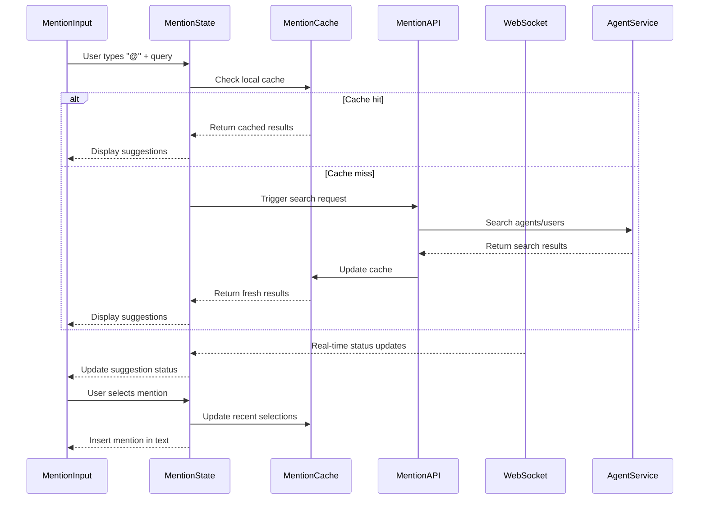
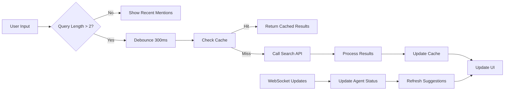
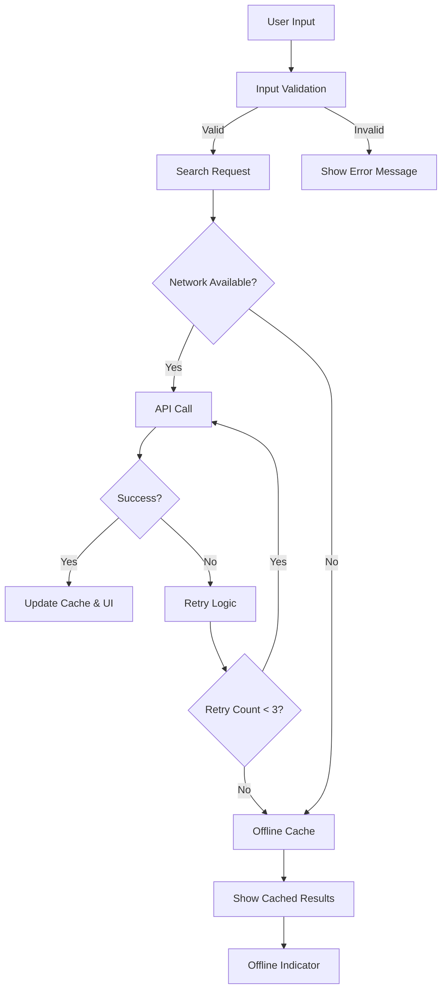

# @ Mention System - Data Flow Patterns

## Data Flow Architecture



## State Management Flow

### Reactive State Pattern
```typescript
interface MentionState {
  // Search state
  query: string;
  isSearching: boolean;
  suggestions: MentionSuggestion[];
  selectedIndex: number;
  
  // Filter state
  activeFilters: FilterType[];
  groupBy: GroupByType;
  sortBy: SortByType;
  
  // UI state
  isDropdownOpen: boolean;
  dropdownPosition: Position;
  inputFocus: boolean;
  
  // Cache state
  recentMentions: RecentMention[];
  searchHistory: SearchHistory[];
  agentStatusMap: Map<string, AgentStatus>;
}

// State updates flow through reducers
const mentionReducer = (state: MentionState, action: MentionAction) => {
  switch (action.type) {
    case 'SET_QUERY':
      return { ...state, query: action.payload, isSearching: true };
    case 'SET_SUGGESTIONS':
      return { ...state, suggestions: action.payload, isSearching: false };
    case 'UPDATE_AGENT_STATUS':
      return { 
        ...state, 
        agentStatusMap: new Map(state.agentStatusMap.set(action.agentId, action.status)),
        suggestions: updateSuggestionStatus(state.suggestions, action.agentId, action.status)
      };
    default:
      return state;
  }
};
```

## API Integration Patterns

### Search API Flow


### Caching Strategy
```typescript
interface MentionCache {
  searchCache: LRUCache<string, MentionSuggestion[]>; // 100 entries
  agentCache: Map<string, AgentDetails>; // Persistent
  recentCache: CircularBuffer<RecentMention>; // 50 entries
}

class MentionCacheManager {
  private searchCache = new LRU<string, MentionSuggestion[]>(100);
  private agentCache = new Map<string, AgentDetails>();
  
  async getSearchResults(query: string, filters: FilterOptions): Promise<MentionSuggestion[]> {
    const cacheKey = `${query}:${JSON.stringify(filters)}`;
    
    // Check cache first
    if (this.searchCache.has(cacheKey)) {
      return this.searchCache.get(cacheKey)!;
    }
    
    // Fetch from API
    const results = await this.searchAPI.search(query, filters);
    
    // Cache with TTL
    this.searchCache.set(cacheKey, results);
    
    return results;
  }
}
```

## Real-time Data Synchronization

### WebSocket Integration Pattern
```typescript
class MentionWebSocketManager {
  private ws: WebSocket;
  private subscribers: Set<MentionStateUpdater> = new Set();
  
  constructor(private wsUrl: string) {
    this.setupWebSocket();
  }
  
  private setupWebSocket() {
    this.ws = new WebSocket(this.wsUrl);
    
    this.ws.onmessage = (event) => {
      const update = JSON.parse(event.data);
      
      switch (update.type) {
        case 'AGENT_STATUS_CHANGE':
          this.notifySubscribers({
            type: 'UPDATE_AGENT_STATUS',
            agentId: update.agentId,
            status: update.status
          });
          break;
          
        case 'NEW_AGENT_AVAILABLE':
          this.invalidateSearchCache();
          break;
          
        case 'AGENT_CAPABILITIES_UPDATED':
          this.updateAgentCache(update.agentId, update.capabilities);
          break;
      }
    };
  }
}
```

## Filtering and Search Flow

### Multi-level Filtering Architecture
```typescript
interface FilterPipeline {
  textSearch: TextSearchFilter;
  typeFilter: TypeFilter;
  statusFilter: StatusFilter;
  capabilityFilter: CapabilityFilter;
  recencyFilter: RecencyFilter;
}

class MentionFilterEngine {
  async applyFilters(
    suggestions: MentionSuggestion[], 
    filters: FilterOptions
  ): Promise<MentionSuggestion[]> {
    
    return suggestions
      .filter(this.textSearchFilter(filters.query))
      .filter(this.typeFilter(filters.allowedTypes))
      .filter(this.statusFilter(filters.statusFilter))
      .filter(this.capabilityFilter(filters.requiredCapabilities))
      .sort(this.getSortComparator(filters.sortBy))
      .slice(0, filters.maxResults || 10);
  }
  
  private textSearchFilter(query: string) {
    const queryLower = query.toLowerCase();
    return (suggestion: MentionSuggestion) => {
      return suggestion.name.toLowerCase().includes(queryLower) ||
             suggestion.description.toLowerCase().includes(queryLower) ||
             suggestion.tags.some(tag => tag.toLowerCase().includes(queryLower));
    };
  }
}
```

## Performance Data Flow Optimizations

### Debounced Search Pattern
```typescript
class MentionSearchManager {
  private searchDebouncer = debounce(this.performSearch.bind(this), 300);
  
  onQueryChange(query: string) {
    // Immediate UI feedback
    this.updateState({ query, isSearching: true });
    
    if (query.length < 2) {
      this.showRecentMentions();
      return;
    }
    
    // Debounced API call
    this.searchDebouncer(query);
  }
  
  private async performSearch(query: string) {
    try {
      const results = await this.cacheManager.getSearchResults(query, this.filters);
      this.updateState({ suggestions: results, isSearching: false });
    } catch (error) {
      this.handleSearchError(error);
    }
  }
}
```

### Virtual Scrolling Data Flow
```typescript
interface VirtualScrollState {
  startIndex: number;
  endIndex: number;
  scrollTop: number;
  itemHeight: number;
  containerHeight: number;
  totalItems: number;
}

class VirtualMentionList {
  calculateVisibleRange(scrollTop: number): [number, number] {
    const startIndex = Math.floor(scrollTop / this.itemHeight);
    const endIndex = Math.min(
      startIndex + Math.ceil(this.containerHeight / this.itemHeight) + 1,
      this.totalItems
    );
    
    return [startIndex, endIndex];
  }
  
  getVisibleItems(): MentionSuggestion[] {
    const [start, end] = this.calculateVisibleRange(this.scrollTop);
    return this.allSuggestions.slice(start, end);
  }
}
```

## Error Handling Data Flow

### Resilient Data Pipeline


This data flow architecture ensures robust, performant, and user-friendly @ mention functionality that integrates seamlessly with the existing AgentLink platform.