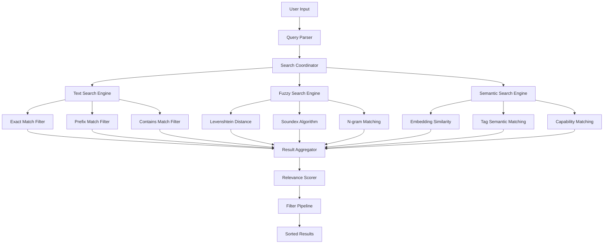

# @ Mention System - Filtering and Search Capabilities

## Search Architecture Overview

The @ mention system implements a sophisticated multi-layered search and filtering system designed for performance, relevance, and user experience:



## Search Engine Implementation

### Multi-Strategy Search Coordinator
```typescript
interface SearchStrategy {
  name: string;
  weight: number;
  execute(query: string, items: MentionSuggestion[]): SearchResult[];
}

class MentionSearchEngine {
  private strategies: SearchStrategy[] = [
    new ExactMatchStrategy(1.0),
    new PrefixMatchStrategy(0.8),
    new FuzzyMatchStrategy(0.6),
    new SemanticMatchStrategy(0.4),
    new TagMatchStrategy(0.3)
  ];
  
  constructor(private options: SearchEngineOptions) {}
  
  async search(
    query: string, 
    items: MentionSuggestion[],
    filters: SearchFilters
  ): Promise<MentionSearchResult[]> {
    
    // Parse and normalize query
    const normalizedQuery = this.normalizeQuery(query);
    
    // Apply pre-filters to reduce search space
    const preFiltered = this.applyPreFilters(items, filters);
    
    // Execute multiple search strategies in parallel
    const strategyPromises = this.strategies.map(async strategy => ({
      strategy: strategy.name,
      weight: strategy.weight,
      results: await strategy.execute(normalizedQuery, preFiltered)
    }));
    
    const strategyResults = await Promise.all(strategyPromises);
    
    // Combine and score results
    const combinedResults = this.combineSearchResults(strategyResults);
    
    // Apply post-filters and sorting
    const filtered = this.applyPostFilters(combinedResults, filters);
    const sorted = this.sortResults(filtered, filters.sortBy);
    
    return sorted.slice(0, filters.maxResults || 10);
  }
  
  private normalizeQuery(query: string): string {
    return query.toLowerCase().trim().replace(/\s+/g, ' ');
  }
  
  private combineSearchResults(
    strategyResults: StrategyResult[]
  ): MentionSearchResult[] {
    const resultMap = new Map<string, MentionSearchResult>();
    
    strategyResults.forEach(({ results, weight }) => {
      results.forEach(result => {
        const existing = resultMap.get(result.item.id);
        const weightedScore = result.score * weight;
        
        if (existing) {
          existing.score = Math.max(existing.score, weightedScore);
          existing.matches.push(...result.matches);
        } else {
          resultMap.set(result.item.id, {
            ...result,
            score: weightedScore
          });
        }
      });
    });
    
    return Array.from(resultMap.values());
  }
}
```

### Fuzzy Search Implementation
```typescript
class FuzzyMatchStrategy implements SearchStrategy {
  name = 'fuzzy';
  weight = 0.6;
  
  private fuzzyThreshold = 0.6;
  
  async execute(query: string, items: MentionSuggestion[]): Promise<SearchResult[]> {
    const results: SearchResult[] = [];
    
    for (const item of items) {
      const fuzzyMatches = this.calculateFuzzyMatches(query, item);
      const maxScore = Math.max(...fuzzyMatches.map(m => m.score));
      
      if (maxScore >= this.fuzzyThreshold) {
        results.push({
          item,
          score: maxScore,
          matches: fuzzyMatches.filter(m => m.score >= this.fuzzyThreshold)
        });
      }
    }
    
    return results;
  }
  
  private calculateFuzzyMatches(query: string, item: MentionSuggestion): Match[] {
    const matches: Match[] = [];
    const targets = [
      { field: 'name', value: item.name, weight: 1.0 },
      { field: 'displayName', value: item.displayName, weight: 0.9 },
      { field: 'description', value: item.description, weight: 0.7 },
      { field: 'tags', value: item.tags.join(' '), weight: 0.5 }
    ];
    
    targets.forEach(target => {
      const distance = this.levenshteinDistance(query, target.value);
      const maxLength = Math.max(query.length, target.value.length);
      const similarity = (maxLength - distance) / maxLength;
      
      if (similarity >= this.fuzzyThreshold) {
        matches.push({
          field: target.field,
          score: similarity * target.weight,
          positions: this.findMatchPositions(query, target.value),
          type: 'fuzzy'
        });
      }
    });
    
    return matches;
  }
  
  private levenshteinDistance(a: string, b: string): number {
    const matrix = Array(b.length + 1).fill(null).map(() => 
      Array(a.length + 1).fill(null)
    );
    
    for (let i = 0; i <= a.length; i++) matrix[0][i] = i;
    for (let j = 0; j <= b.length; j++) matrix[j][0] = j;
    
    for (let j = 1; j <= b.length; j++) {
      for (let i = 1; i <= a.length; i++) {
        const indicator = a[i - 1] === b[j - 1] ? 0 : 1;
        matrix[j][i] = Math.min(
          matrix[j][i - 1] + 1,      // deletion
          matrix[j - 1][i] + 1,      // insertion
          matrix[j - 1][i - 1] + indicator // substitution
        );
      }
    }
    
    return matrix[b.length][a.length];
  }
}
```

## Advanced Filtering System

### Filter Pipeline Architecture
```typescript
interface Filter<T = any> {
  name: string;
  apply(items: MentionSuggestion[], filterValue: T): MentionSuggestion[];
  validate(filterValue: T): boolean;
}

class FilterPipeline {
  private filters = new Map<string, Filter>();
  
  constructor() {
    this.registerDefaultFilters();
  }
  
  registerFilter(filter: Filter): void {
    this.filters.set(filter.name, filter);
  }
  
  applyFilters(
    items: MentionSuggestion[], 
    filterConfig: FilterConfig
  ): MentionSuggestion[] {
    let filtered = items;
    
    Object.entries(filterConfig).forEach(([filterName, filterValue]) => {
      const filter = this.filters.get(filterName);
      if (filter && filter.validate(filterValue)) {
        filtered = filter.apply(filtered, filterValue);
      }
    });
    
    return filtered;
  }
  
  private registerDefaultFilters(): void {
    // Type filter
    this.registerFilter({
      name: 'type',
      apply: (items, types: string[]) => 
        items.filter(item => types.includes(item.type)),
      validate: (types) => Array.isArray(types) && types.length > 0
    });
    
    // Status filter  
    this.registerFilter({
      name: 'status',
      apply: (items, statuses: AgentStatus[]) =>
        items.filter(item => statuses.includes(item.status)),
      validate: (statuses) => Array.isArray(statuses) && statuses.length > 0
    });
    
    // Capability filter
    this.registerFilter({
      name: 'capabilities',
      apply: (items, requiredCaps: string[]) =>
        items.filter(item => 
          item.capabilities && 
          requiredCaps.every(cap => item.capabilities!.includes(cap))
        ),
      validate: (caps) => Array.isArray(caps) && caps.length > 0
    });
    
    // Recency filter
    this.registerFilter({
      name: 'recency',
      apply: (items, maxAge: number) => {
        const cutoff = Date.now() - maxAge;
        return items.filter(item => 
          item.lastActive && item.lastActive.getTime() > cutoff
        );
      },
      validate: (maxAge) => typeof maxAge === 'number' && maxAge > 0
    });
  }
}
```

### Smart Filter Suggestions
```typescript
class FilterSuggestionEngine {
  constructor(private searchHistory: SearchHistory[]) {}
  
  suggestFilters(
    query: string, 
    currentResults: MentionSuggestion[]
  ): FilterSuggestion[] {
    const suggestions: FilterSuggestion[] = [];
    
    // Analyze current results for filter opportunities
    const resultAnalysis = this.analyzeResults(currentResults);
    
    // Suggest type filters if mixed types
    if (resultAnalysis.typeDistribution.size > 1) {
      resultAnalysis.typeDistribution.forEach((count, type) => {
        if (count > 1) {
          suggestions.push({
            type: 'type',
            value: [type],
            label: `Show only ${type}s`,
            count,
            priority: count / currentResults.length
          });
        }
      });
    }
    
    // Suggest status filters if many offline
    if (resultAnalysis.offlineCount > resultAnalysis.onlineCount) {
      suggestions.push({
        type: 'status',
        value: ['online'],
        label: 'Show only online',
        count: resultAnalysis.onlineCount,
        priority: 0.8
      });
    }
    
    // Suggest capability filters based on common capabilities
    if (resultAnalysis.commonCapabilities.length > 0) {
      resultAnalysis.commonCapabilities.forEach(capability => {
        suggestions.push({
          type: 'capabilities',
          value: [capability.name],
          label: `Has ${capability.name}`,
          count: capability.count,
          priority: capability.count / currentResults.length
        });
      });
    }
    
    // Historical filter suggestions
    const historicalSuggestions = this.getHistoricalSuggestions(query);
    suggestions.push(...historicalSuggestions);
    
    // Sort by priority and return top suggestions
    return suggestions
      .sort((a, b) => b.priority - a.priority)
      .slice(0, 5);
  }
  
  private analyzeResults(results: MentionSuggestion[]): ResultAnalysis {
    const typeDistribution = new Map<string, number>();
    let onlineCount = 0;
    let offlineCount = 0;
    const capabilityCount = new Map<string, number>();
    
    results.forEach(result => {
      // Count types
      typeDistribution.set(result.type, (typeDistribution.get(result.type) || 0) + 1);
      
      // Count status
      if (result.status === 'online') onlineCount++;
      else offlineCount++;
      
      // Count capabilities
      result.capabilities?.forEach(cap => {
        capabilityCount.set(cap, (capabilityCount.get(cap) || 0) + 1);
      });
    });
    
    const commonCapabilities = Array.from(capabilityCount.entries())
      .filter(([_, count]) => count >= 2)
      .map(([name, count]) => ({ name, count }))
      .sort((a, b) => b.count - a.count)
      .slice(0, 3);
    
    return {
      typeDistribution,
      onlineCount,
      offlineCount,
      commonCapabilities
    };
  }
}
```

## Real-time Search Performance

### Debounced Search with Caching
```typescript
class PerformantSearchManager {
  private searchCache = new LRUCache<string, CachedSearchResult>(100);
  private searchDebouncer: (query: string) => void;
  private abortController: AbortController | null = null;
  
  constructor(
    private searchEngine: MentionSearchEngine,
    private onResults: (results: MentionSearchResult[]) => void,
    private onError: (error: Error) => void
  ) {
    this.searchDebouncer = debounce(this.performSearch.bind(this), 300);
  }
  
  search(query: string, filters: SearchFilters): void {
    // Cancel previous search
    if (this.abortController) {
      this.abortController.abort();
    }
    
    // Check cache for immediate results
    const cacheKey = this.buildCacheKey(query, filters);
    const cached = this.searchCache.get(cacheKey);
    
    if (cached && Date.now() - cached.timestamp < 30000) { // 30s TTL
      this.onResults(cached.results);
      return;
    }
    
    // Debounce the actual search
    this.searchDebouncer(query, filters);
  }
  
  private async performSearch(query: string, filters: SearchFilters): Promise<void> {
    this.abortController = new AbortController();
    
    try {
      const results = await this.searchEngine.search(
        query, 
        this.getAllItems(),
        filters,
        { signal: this.abortController.signal }
      );
      
      // Cache results
      const cacheKey = this.buildCacheKey(query, filters);
      this.searchCache.set(cacheKey, {
        results,
        timestamp: Date.now()
      });
      
      this.onResults(results);
    } catch (error) {
      if (error.name !== 'AbortError') {
        this.onError(error);
      }
    }
  }
  
  private buildCacheKey(query: string, filters: SearchFilters): string {
    return `${query}:${JSON.stringify(filters)}`;
  }
}
```

### Search Analytics and Optimization
```typescript
class SearchAnalyticsManager {
  private queryPerformance = new Map<string, QueryPerformance>();
  private popularQueries = new Map<string, number>();
  
  trackSearch(
    query: string,
    filters: SearchFilters,
    resultCount: number,
    duration: number
  ): void {
    // Track query performance
    const existing = this.queryPerformance.get(query) || {
      totalSearches: 0,
      totalDuration: 0,
      averageDuration: 0,
      averageResults: 0,
      totalResults: 0
    };
    
    existing.totalSearches++;
    existing.totalDuration += duration;
    existing.totalResults += resultCount;
    existing.averageDuration = existing.totalDuration / existing.totalSearches;
    existing.averageResults = existing.totalResults / existing.totalSearches;
    
    this.queryPerformance.set(query, existing);
    
    // Track query popularity
    this.popularQueries.set(query, (this.popularQueries.get(query) || 0) + 1);
  }
  
  getSearchInsights(): SearchInsights {
    const slowQueries = Array.from(this.queryPerformance.entries())
      .filter(([_, perf]) => perf.averageDuration > 500)
      .sort(([_, a], [__, b]) => b.averageDuration - a.averageDuration)
      .slice(0, 10);
    
    const popularQueries = Array.from(this.popularQueries.entries())
      .sort(([_, a], [__, b]) => b - a)
      .slice(0, 10);
    
    return {
      slowQueries: slowQueries.map(([query, perf]) => ({ query, ...perf })),
      popularQueries: popularQueries.map(([query, count]) => ({ query, count })),
      averageSearchDuration: this.calculateAverageSearchDuration(),
      totalSearches: Array.from(this.queryPerformance.values()).reduce(
        (sum, perf) => sum + perf.totalSearches, 0
      )
    };
  }
  
  optimizeSearchForQuery(query: string): SearchOptimization {
    const performance = this.queryPerformance.get(query);
    if (!performance) return { recommendations: [] };
    
    const recommendations: string[] = [];
    
    if (performance.averageDuration > 1000) {
      recommendations.push('Consider adding pre-filters to reduce search space');
    }
    
    if (performance.averageResults > 50) {
      recommendations.push('Consider more specific default filters');
    }
    
    if (performance.averageResults < 2) {
      recommendations.push('Consider fuzzy search or synonym expansion');
    }
    
    return { recommendations };
  }
}
```

## Context-Aware Filtering

### Smart Context Detection
```typescript
class ContextAwareFilterManager {
  detectContext(
    inputText: string,
    cursorPosition: number,
    mentionPosition: number
  ): MentionContext {
    const textBeforeMention = inputText.substring(0, mentionPosition);
    const textAfterMention = inputText.substring(cursorPosition);
    
    // Detect conversation context
    const isReply = /\b(reply|responding|answer)\b/i.test(textBeforeMention);
    const isQuestion = /\b(who|what|when|where|why|how|can|could|would)\b/i.test(textBeforeMention);
    const isTask = /\b(help|assist|do|create|build|fix|debug)\b/i.test(textBeforeMention);
    
    // Detect capability requirements
    const requiredCapabilities = this.extractRequiredCapabilities(textBeforeMention);
    
    // Detect urgency
    const urgency = this.detectUrgency(textBeforeMention);
    
    return {
      isReply,
      isQuestion,
      isTask,
      requiredCapabilities,
      urgency,
      textContext: textBeforeMention.slice(-100) // Last 100 chars for context
    };
  }
  
  applyContextualFilters(
    context: MentionContext,
    baseFilters: SearchFilters
  ): SearchFilters {
    const contextualFilters = { ...baseFilters };
    
    // Prioritize online agents for urgent requests
    if (context.urgency === 'high') {
      contextualFilters.status = ['online'];
      contextualFilters.sortBy = 'availability';
    }
    
    // Filter by required capabilities
    if (context.requiredCapabilities.length > 0) {
      contextualFilters.capabilities = context.requiredCapabilities;
    }
    
    // Prioritize specific agent types based on context
    if (context.isTask) {
      contextualFilters.typePreference = ['agent'];
    } else if (context.isQuestion) {
      contextualFilters.typePreference = ['agent', 'user'];
    }
    
    return contextualFilters;
  }
  
  private extractRequiredCapabilities(text: string): string[] {
    const capabilityPatterns = [
      { pattern: /\b(code|coding|programming|develop)\b/i, capability: 'development' },
      { pattern: /\b(design|ui|ux|interface)\b/i, capability: 'design' },
      { pattern: /\b(test|testing|qa|quality)\b/i, capability: 'testing' },
      { pattern: /\b(review|feedback|critique)\b/i, capability: 'review' },
      { pattern: /\b(research|analyze|investigate)\b/i, capability: 'research' },
      { pattern: /\b(document|write|explain)\b/i, capability: 'documentation' }
    ];
    
    const capabilities: string[] = [];
    capabilityPatterns.forEach(({ pattern, capability }) => {
      if (pattern.test(text)) {
        capabilities.push(capability);
      }
    });
    
    return capabilities;
  }
}
```

This comprehensive filtering and search system provides intelligent, context-aware, and highly performant search capabilities that enhance the user experience while maintaining excellent performance characteristics.