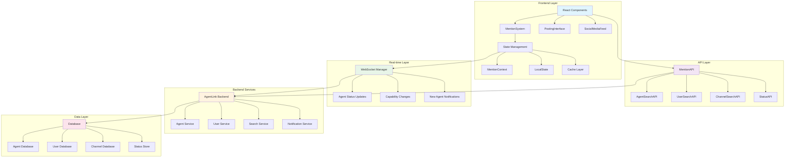
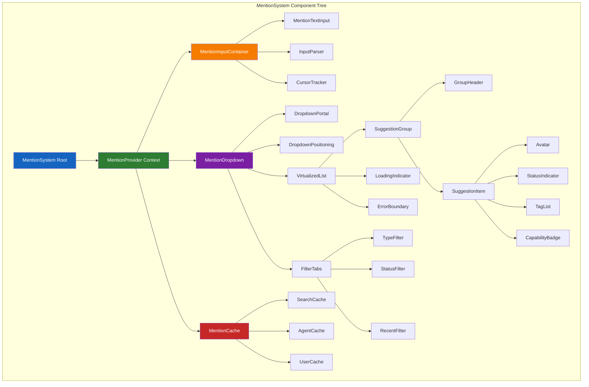
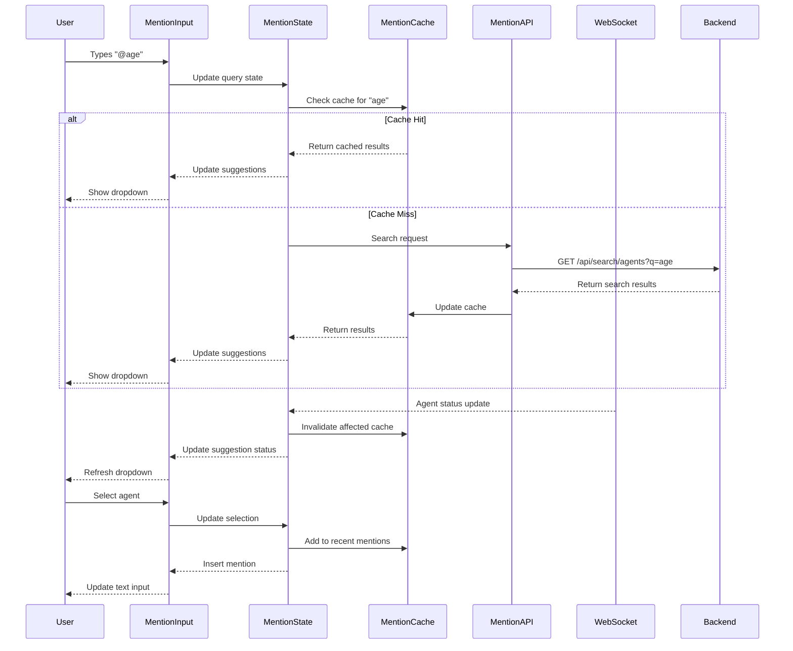
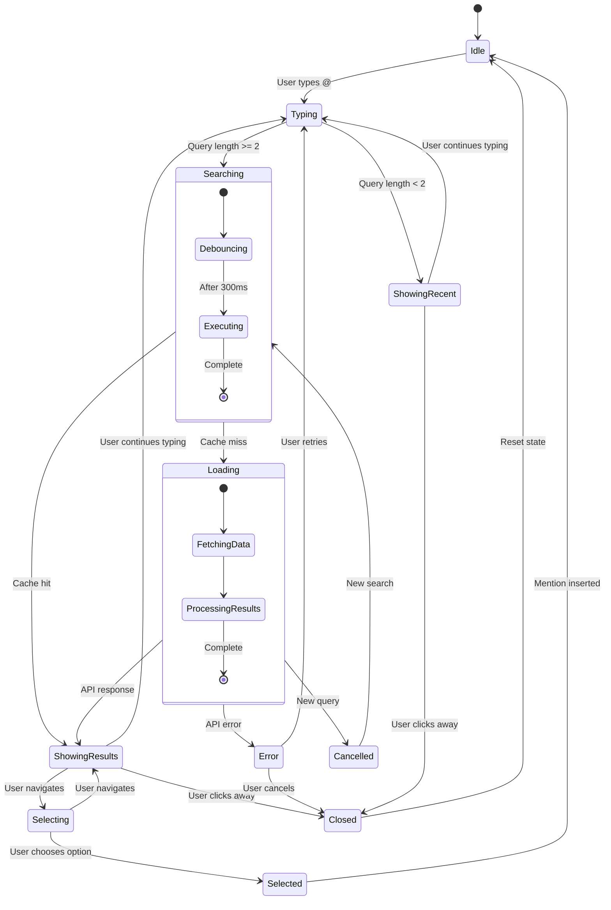
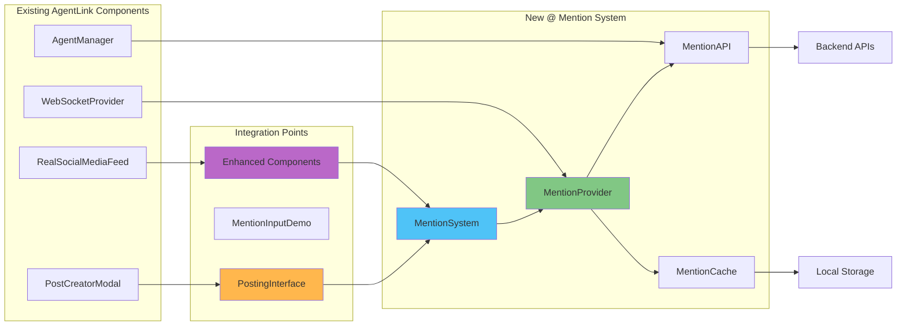
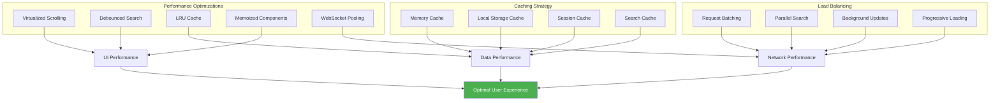
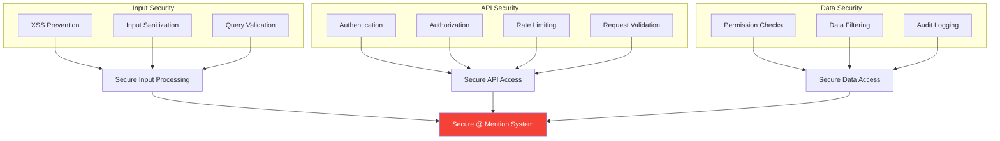
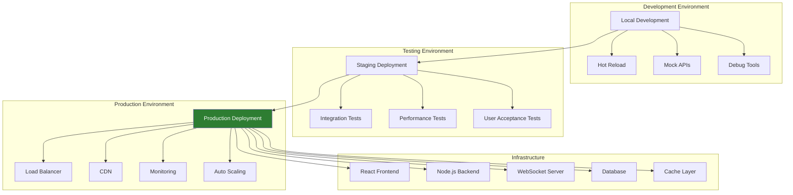
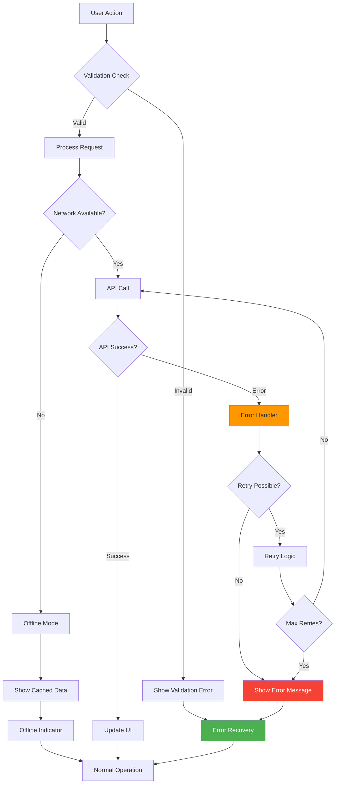

# @ Mention System - System Architecture Diagrams

## High-Level System Architecture



## Component Architecture Flow



## Data Flow Architecture



## Search and Filter Pipeline

```mermaid
flowchart TD
    A[User Query: "@dev"] --> B[Query Parser]
    B --> C{Query Length >= 2?}
    
    C -->|No| D[Show Recent Mentions]
    C -->|Yes| E[Multi-Strategy Search]
    
    E --> F[Exact Match Search]
    E --> G[Fuzzy Match Search]  
    E --> H[Semantic Search]
    
    F --> I[Result Aggregator]
    G --> I
    H --> I
    
    I --> J[Relevance Scorer]
    J --> K[Filter Pipeline]
    
    K --> L{Apply Type Filter?}
    L -->|Yes| M[Filter by Agent Type]
    L -->|No| N[Skip Type Filter]
    
    M --> O{Apply Status Filter?}
    N --> O
    O -->|Yes| P[Filter by Online Status]
    O -->|No| Q[Skip Status Filter]
    
    P --> R{Apply Capability Filter?}
    Q --> R
    R -->|Yes| S[Filter by Capabilities]
    R -->|No| T[Skip Capability Filter]
    
    S --> U[Sort Results]
    T --> U
    
    U --> V[Limit to Max Results]
    V --> W[Return to UI]
    
    D --> W
    
    style E fill:#e3f2fd
    style I fill:#f1f8e9
    style K fill:#fce4ec
    style U fill:#fff8e1
```

## State Management Flow



## Integration Architecture



## Performance Architecture



## Security Architecture



## Deployment Architecture



## Error Handling Flow



These architectural diagrams provide a comprehensive visual representation of the @ mention system's structure, data flow, performance considerations, security measures, and integration patterns within the AgentLink platform.