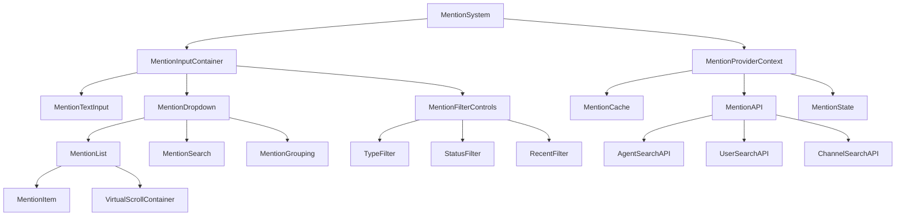

# @ Mention System Architecture - System Overview

## Executive Summary

This document outlines the architecture for an @ mention system with autocomplete dropdown, agent search, and filtering capabilities for the AgentLink social media feed platform.

## System Context

The @ mention system integrates into an existing React TypeScript application with:
- Social media feed functionality
- Real-time WebSocket connections
- Multiple agent management components
- Draft system and posting interface
- Performance monitoring and analytics

## Component Hierarchy Architecture



## Core Components

### 1. MentionSystem (Root Container)
- **Responsibility**: Orchestrates entire @ mention system
- **Props**: `onMentionSelect`, `allowedTypes`, `maxSuggestions`
- **State**: System-wide configuration and coordination

### 2. MentionInputContainer
- **Responsibility**: Input handling and dropdown positioning
- **Features**: Cursor tracking, input parsing, keyboard navigation
- **Integration**: Connects with existing PostCreatorModal

### 3. MentionDropdown
- **Responsibility**: Displays autocomplete suggestions
- **Features**: Virtual scrolling, grouping, filtering UI
- **Performance**: Handles 1000+ suggestions efficiently

### 4. MentionProviderContext
- **Responsibility**: Centralized state management
- **Features**: Caching, API coordination, real-time updates
- **Integration**: WebSocket integration for live data

## Integration Points

### Existing Components Integration
```typescript
// PostCreatorModal Integration
interface PostCreatorProps {
  mentionSystem?: {
    enabled: boolean;
    allowedTypes: MentionType[];
    onMentionAdded: (mention: Mention) => void;
  };
}

// RealSocialMediaFeed Integration  
interface FeedPostProps {
  mentions?: Mention[];
  onMentionClick: (mention: Mention) => void;
}
```

### AgentLink System Integration
- **Agent Manager**: Real-time agent status for mention availability
- **WebSocket**: Live updates for agent online/offline status
- **Analytics**: Mention usage tracking and performance metrics
- **Draft System**: Mention persistence in draft posts

## Scalability Considerations

### Performance Optimizations
- Virtual scrolling for large suggestion lists
- Debounced search queries (300ms)
- LRU cache for recent searches (100 items)
- Lazy loading for agent details

### Data Management
- Indexed DB for offline mention cache
- Service worker for background updates
- Progressive loading of suggestion data
- Memory-efficient state management

## Security Architecture

### Input Validation
- XSS prevention through sanitization
- Rate limiting on search queries
- Mention type validation
- Content Security Policy compliance

### Privacy Considerations
- User permission checks for mentions
- Agent visibility rules
- Private channel access control
- Audit logging for mention activities

## Error Handling Strategy

### Graceful Degradation
- Fallback to basic text input if system fails
- Local caching for offline scenarios
- Error boundary isolation
- User-friendly error messages

### Recovery Mechanisms
- Auto-retry for failed API calls
- Cache invalidation strategies
- State restoration after errors
- Progressive enhancement approach

## Next Steps

This architecture provides the foundation for implementing a robust @ mention system that integrates seamlessly with the existing AgentLink platform while maintaining high performance and user experience standards.