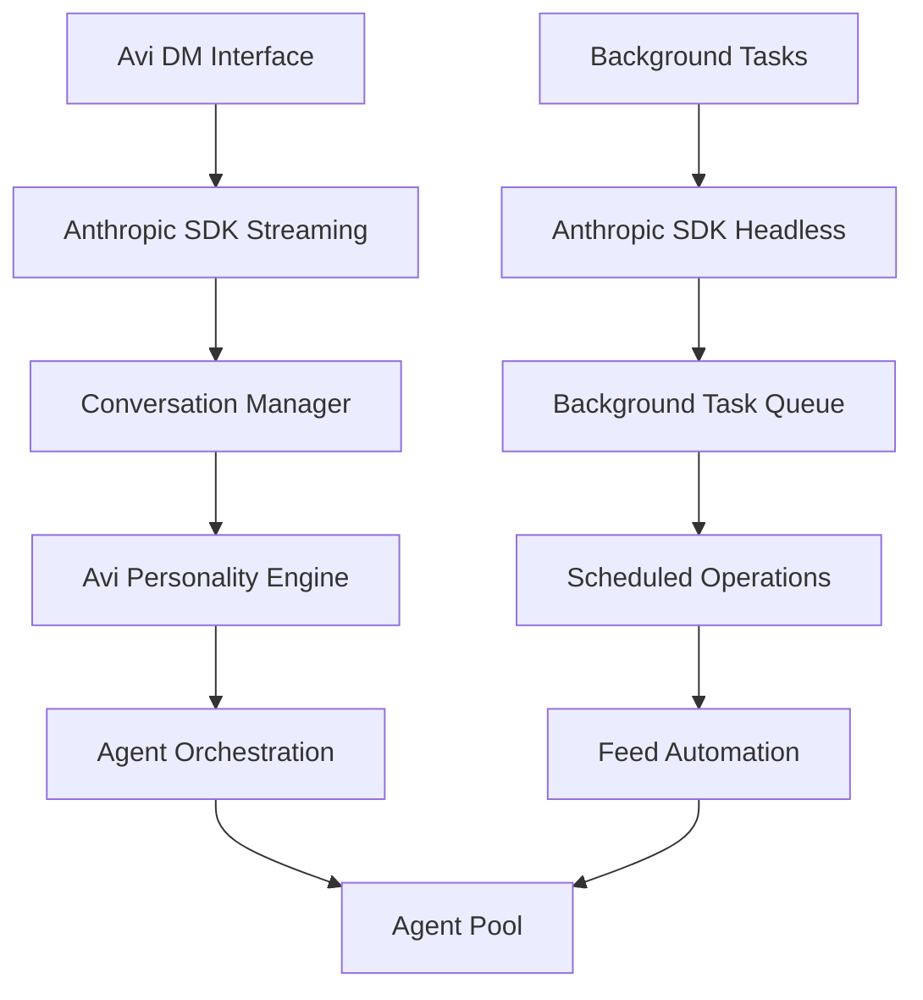

# Anthropic Claude Code SDK Migration Plan

**Document Version**: 1.0
**Date**: September 14, 2025
**Status**: Analysis Complete - Ready for Implementation
**Migration Type**: Custom Implementation → Official Anthropic SDK

---

## **Executive Summary**

This document outlines the comprehensive migration plan from our current custom Claude Code implementation to Anthropic's official Claude Code SDK. This migration will leverage the SDK's headless mode for background tasks, streaming input for Avi DM, and modern authentication patterns while preserving all existing functionality.

---

## **Current State Analysis**

### **Existing Custom Implementation**
1. **Custom Claude Process Manager** (`ClaudeProcessManager.ts`)
   - PTY-based process spawning
   - Custom WebSocket/SSE integration
   - Manual instance lifecycle management
   - Direct claude binary invocation

2. **Current Architecture Components**:
   - **AviDirectChatReal.tsx** - Chat interface with custom connection logic
   - **SSEConnectionManager.ts** - Custom Server-Sent Events handling
   - **ClaudeServiceManager.ts** - Instance orchestration
   - **AviInstanceManager.ts** - Process lifecycle management
   - **Custom API endpoints** - `/api/claude/instances` routes

3. **Background Task System**:
   - Scheduled agent posts (todos at 10am)
   - Feed monitoring and auto-responses
   - Agent coordination and task queue

### **Anthropic SDK Capabilities**
1. **TypeScript/Node.js SDK**:
   - Official authentication via `ANTHROPIC_API_KEY`
   - Automatic context management and compaction
   - Rich tool ecosystem (file ops, code execution, web search)
   - MCP (Model Context Protocol) extensibility

2. **Headless Mode**:
   - Non-interactive CLI execution with `-p` flag
   - JSON/streaming JSON output formats
   - Session resumption with conversation IDs
   - Tool permission management

3. **Streaming Input Mode**:
   - Real-time message queuing
   - Image upload support
   - Hook integration
   - Multi-turn conversation context

---

## **Migration Architecture Plan**

### **New SDK-Based Architecture**



### **Key Architectural Changes**

1. **Replace Custom Process Management**:
   ```typescript
   // OLD: Custom PTY management
   class ClaudeProcessManager {
     spawnInstance(config) { /* custom pty logic */ }
   }

   // NEW: Official SDK
   import { ClaudeCode } from '@anthropic-ai/claude-code';
   const claude = new ClaudeCode({
     apiKey: process.env.ANTHROPIC_API_KEY
   });
   ```

2. **Streaming vs Headless Mode Split**:
   ```typescript
   // Interactive Avi DM - Streaming Mode
   async function* generateAviMessages() {
     yield {
       type: "user",
       message: {
         role: "user",
         content: userInput
       }
     };
   }

   // Background Tasks - Headless Mode
   const backgroundResult = await claude.execute({
     prompt: "Check feed and post todos if needed",
     mode: "headless",
     outputFormat: "json",
     allowedTools: ["Read", "Write", "Bash"]
   });
   ```

---

## **Implementation Phases**

### **Phase 1: SDK Foundation & Authentication**
**Objective**: Replace core authentication and SDK initialization

**Tasks**:
1. **Install Anthropic SDK**:
   ```bash
   npm install @anthropic-ai/claude-code
   ```

2. **Environment Setup**:
   - Configure `ANTHROPIC_API_KEY`
   - Remove custom claude binary dependencies
   - Update Docker/deployment configurations

3. **Create SDK Service Layer**:
   ```typescript
   // /src/services/AnthropicSDKManager.ts
   export class AnthropicSDKManager {
     private streamingClient: ClaudeCode;
     private headlessClient: ClaudeCode;

     constructor() {
       this.streamingClient = new ClaudeCode({
         apiKey: process.env.ANTHROPIC_API_KEY,
         mode: 'streaming'
       });

       this.headlessClient = new ClaudeCode({
         apiKey: process.env.ANTHROPIC_API_KEY,
         mode: 'headless'
       });
     }
   }
   ```

4. **Replace Authentication Layer**:
   - Remove custom process authentication
   - Implement SDK-based auth validation
   - Update API middleware

**Deliverables**:
- ✅ SDK installed and authenticated
- ✅ Basic streaming client operational
- ✅ Basic headless client operational
- ✅ Environment properly configured

### **Phase 2: Avi DM Streaming Integration**
**Objective**: Migrate Avi DM to use official SDK streaming mode

**Tasks**:
1. **Replace AviDirectChatReal Connection Logic**:
   ```typescript
   // OLD: Custom WebSocket/SSE
   const eventSource = new EventSource(sseUrl);

   // NEW: SDK Streaming
   for await (const message of claude.query(generateMessages())) {
     if (message.type === 'assistant') {
       setMessages(prev => [...prev, message]);
     }
   }
   ```

2. **Implement Image Upload Support**:
   ```typescript
   yield {
     type: "user",
     message: {
       role: "user",
       content: [
         { type: "text", text: userMessage },
         { type: "image", source: imageData }
       ]
     }
   };
   ```

3. **Conversation Context Management**:
   ```typescript
   // Persistent conversation sessions
   const conversationId = await claude.startConversation({
     systemPrompt: aviPersonalityPrompt,
     workingDirectory: "/workspaces/agent-feed/prod"
   });
   ```

4. **Replace Custom SSE Manager**:
   - Remove `SSEConnectionManager.ts`
   - Update `AviDirectChatReal.tsx` to use SDK streaming
   - Implement proper error handling and reconnection

**Deliverables**:
- ✅ Avi DM uses official SDK streaming
- ✅ Image uploads working
- ✅ Real-time conversation flow
- ✅ Session persistence

### **Phase 3: Background Tasks Headless Mode**
**Objective**: Migrate all background automation to SDK headless mode

**Tasks**:
1. **Scheduled Tasks Migration**:
   ```typescript
   // Background todo posting
   async function postScheduledTodos() {
     const result = await claude.execute({
       prompt: `Post user's todos to the feed at ${new Date()}`,
       mode: "headless",
       outputFormat: "json",
       allowedTools: ["Read", "Write", "Bash"],
       workingDirectory: "/workspaces/agent-feed/prod",
       timeout: 300000
     });

     return JSON.parse(result.output);
   }
   ```

2. **Feed Monitoring Automation**:
   ```typescript
   // Periodic feed checking
   async function monitorFeed() {
     const analysis = await claude.execute({
       prompt: "Check feed for mentions and important updates. Respond if needed.",
       mode: "headless",
       outputFormat: "json",
       allowedTools: ["Read", "Grep", "Write"],
       sessionId: "feed-monitor-session"
     });
   }
   ```

3. **Agent Coordination Updates**:
   - Replace `AviInstanceManager.ts` with SDK-based coordination
   - Update scheduling system to use headless mode
   - Implement proper task queue with SDK

4. **Background Service Architecture**:
   ```typescript
   class SDKBackgroundService {
     async scheduleTask(taskConfig: TaskConfig) {
       const job = await this.taskQueue.add('claude-task', {
         prompt: taskConfig.prompt,
         mode: 'headless',
         outputFormat: 'json',
         allowedTools: taskConfig.tools,
         schedule: taskConfig.cronExpression
       });
     }
   }
   ```

**Deliverables**:
- ✅ All scheduled tasks use SDK headless mode
- ✅ Feed monitoring automated with SDK
- ✅ Agent coordination via SDK
- ✅ Background task queue operational

### **Phase 4: Advanced SDK Features & Optimization**
**Objective**: Leverage advanced SDK capabilities and optimize performance

**Tasks**:
1. **MCP Integration**:
   ```typescript
   // Custom tools via MCP
   const claudeWithCustomTools = new ClaudeCode({
     apiKey: process.env.ANTHROPIC_API_KEY,
     mcpServers: [
       'agent-feed-mcp-server',
       'database-mcp-server'
     ]
   });
   ```

2. **Advanced Tool Permissions**:
   ```typescript
   const restrictedTools = {
     allowedTools: ["Read", "Write", "Grep"],
     disallowedTools: ["Bash"],
     permissionMode: "explicit"
   };
   ```

3. **Context Management & Compaction**:
   - Leverage SDK's automatic context compaction
   - Implement conversation pruning strategies
   - Optimize token usage

4. **Hook System Integration**:
   ```typescript
   // Custom hooks for Avi behavior
   claude.addHook('pre-response', async (context) => {
     // Apply Avi personality filters
     return applyAviPersonality(context);
   });
   ```

**Deliverables**:
- ✅ Custom MCP servers integrated
- ✅ Optimized tool permissions
- ✅ Efficient context management
- ✅ Advanced hook system

### **Phase 5: Testing & Production Deployment**
**Objective**: Comprehensive testing and production-ready deployment

**Tasks**:
1. **Comprehensive Test Suite**:
   - Unit tests for SDK integration
   - Integration tests for streaming mode
   - E2E tests for background tasks
   - Performance benchmarks

2. **Migration Validation**:
   - Side-by-side comparison testing
   - Feature parity verification
   - Performance regression testing
   - Error handling validation

3. **Production Deployment**:
   - Gradual rollout strategy
   - Monitoring and alerting
   - Rollback procedures
   - Documentation updates

**Deliverables**:
- ✅ Complete test coverage
- ✅ Production deployment
- ✅ Monitoring in place
- ✅ Documentation updated

---

## **Feature Mapping: Current → SDK**

| Current Feature | Current Implementation | SDK Implementation | Migration Strategy |
|----------------|----------------------|-------------------|-------------------|
| **Avi DM Chat** | Custom WebSocket/SSE + PTY | SDK Streaming Mode | Phase 2 - Direct replacement |
| **Scheduled Tasks** | Custom cron + process spawn | SDK Headless + scheduler | Phase 3 - Background service |
| **Feed Monitoring** | Custom polling + instances | SDK Headless automation | Phase 3 - Automated checks |
| **Image Uploads** | Custom file handling | SDK built-in support | Phase 2 - Native feature |
| **Agent Coordination** | Custom instance management | SDK conversation sessions | Phase 3 - Session-based |
| **Authentication** | Custom process auth | SDK API key auth | Phase 1 - Environment setup |
| **Tool Permissions** | Custom validation | SDK permission system | Phase 4 - Native controls |
| **Context Management** | Manual memory handling | SDK auto-compaction | Phase 4 - Automatic |

---

## **Breaking Changes & Compatibility**

### **API Changes Required**
1. **Endpoint Updates**:
   ```javascript
   // OLD endpoints (remove)
   POST /api/claude/instances
   GET /api/claude/instances/:id/terminal/stream
   POST /api/claude/instances/:id/terminal/input

   // NEW endpoints (add)
   POST /api/avi/streaming-chat
   POST /api/avi/background-task
   GET /api/avi/conversation/:id
   ```

2. **Environment Variables**:
   ```bash
   # Remove
   CLAUDE_BINARY_PATH=...

   # Add
   ANTHROPIC_API_KEY=sk-ant-...
   CLAUDE_CODE_USE_BEDROCK=0  # Optional
   ```

### **Component Updates Required**
1. **Frontend Components**:
   - `AviDirectChatReal.tsx` - Complete streaming integration
   - `ClaudeInstanceManager.tsx` - Replace with SDK manager
   - `SSEConnectionManager.ts` - Remove (SDK handles)

2. **Backend Services**:
   - `ClaudeProcessManager.ts` - Replace with SDK wrapper
   - `simple-backend.js` - Update API routes
   - Scheduler services - Integrate with SDK headless

### **Data Migration**
- **Conversation History**: Export/import existing chat sessions
- **Scheduled Tasks**: Migrate cron jobs to new format
- **Agent Configurations**: Update agent tool permissions

---

## **Risk Mitigation**

### **Technical Risks**
1. **API Rate Limits**:
   - Implement proper request queuing
   - Monitor usage patterns
   - Plan for scaling

2. **Feature Parity**:
   - Comprehensive feature mapping
   - Side-by-side testing
   - Gradual migration with fallbacks

3. **Performance**:
   - Benchmark current vs SDK performance
   - Optimize token usage
   - Implement caching strategies

### **Operational Risks**
1. **Downtime**:
   - Blue-green deployment strategy
   - Feature flags for gradual rollout
   - Quick rollback procedures

2. **User Experience**:
   - Maintain UI consistency
   - Preserve conversation history
   - Smooth transition messaging

---

## **Success Criteria**

### **Phase 1 Success Metrics**
- ✅ SDK authentication working
- ✅ Basic streaming client functional
- ✅ Basic headless client functional
- ✅ No disruption to existing features

### **Phase 2 Success Metrics**
- ✅ Avi DM uses SDK streaming exclusively
- ✅ Image uploads working via SDK
- ✅ Real-time conversation equivalent to current
- ✅ Session persistence maintained

### **Phase 3 Success Metrics**
- ✅ All background tasks use SDK headless
- ✅ Scheduled posting works reliably
- ✅ Feed monitoring equivalent functionality
- ✅ Agent coordination via SDK

### **Phase 4 Success Metrics**
- ✅ Advanced SDK features integrated
- ✅ Performance optimized
- ✅ Custom tools via MCP working
- ✅ Hook system operational

### **Phase 5 Success Metrics**
- ✅ Complete feature parity achieved
- ✅ Performance equal or better
- ✅ Production deployment successful
- ✅ All tests passing

---

## **Implementation Timeline**

| Phase | Duration | Key Milestones |
|-------|----------|----------------|
| **Phase 1** | 3-5 days | SDK setup, authentication |
| **Phase 2** | 5-7 days | Avi DM streaming migration |
| **Phase 3** | 7-10 days | Background tasks headless |
| **Phase 4** | 5-7 days | Advanced features & optimization |
| **Phase 5** | 3-5 days | Testing & production deployment |
| **Total** | **23-34 days** | Complete migration |

---

## **Next Steps**

1. **Stakeholder Review**: Review and approve migration plan
2. **Environment Preparation**: Set up Anthropic API key and SDK access
3. **Phase 1 Kickoff**: Begin SDK installation and authentication
4. **Testing Strategy**: Define comprehensive test approach
5. **Deployment Planning**: Prepare blue-green deployment strategy

---

**Document Status**: ✅ **READY FOR IMPLEMENTATION**
**Migration Approach**: Phased replacement with feature parity
**Risk Level**: Medium - Well-defined migration path
**Development Approach**: Phase-based with parallel testing

---

*This document serves as the definitive migration specification for transitioning from custom Claude Code implementation to official Anthropic SDK. All development should reference this document for migration decisions, technical requirements, and success criteria.*