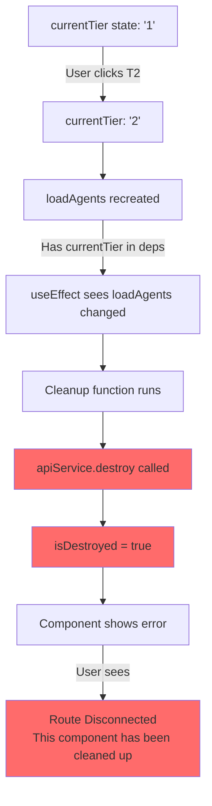
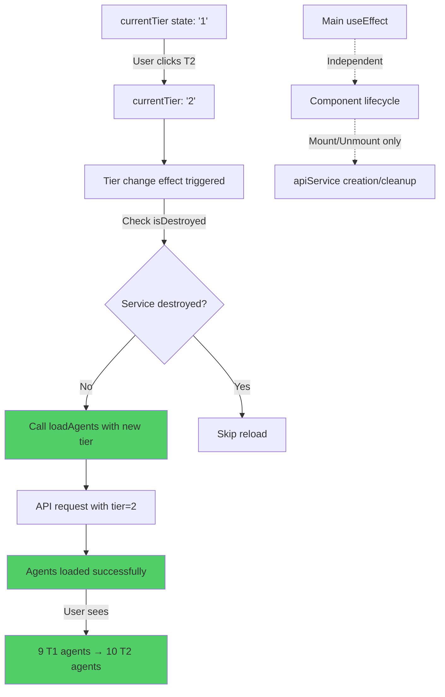
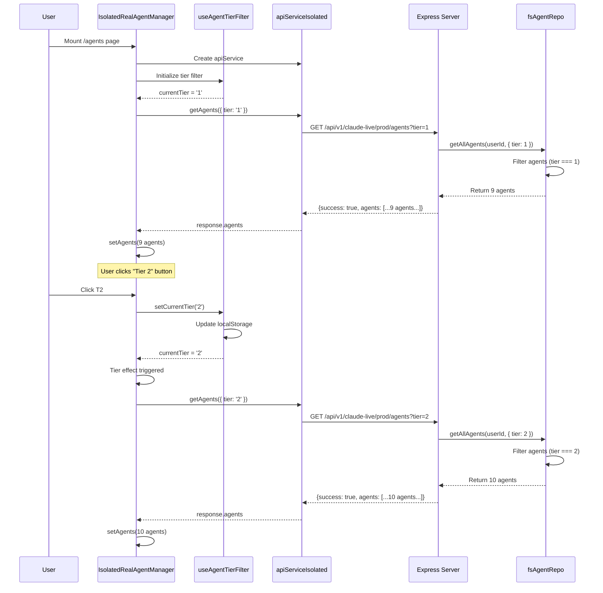

# Architecture: Tier Filter Bug Fix

**Document Version**: 1.0
**Date**: 2025-10-20
**Status**: Design Phase
**Priority**: HIGH (Breaks core functionality)

---

## Executive Summary

This document provides the architectural design for fixing critical tier filtering bugs affecting both frontend component lifecycle management and backend data flow. The bugs prevent users from filtering agents by tier, resulting in component destruction and empty data responses.

**Key Issues**:
1. Frontend: useEffect dependency chain destroys apiService when tier changes
2. Backend: API returns empty data despite successfully loading agents from filesystem

**Impact**: Tier filtering completely broken - affects all agent list views

---

## Table of Contents

1. [Problem Analysis](#problem-analysis)
2. [Root Cause Diagrams](#root-cause-diagrams)
3. [Frontend Architecture Fix](#frontend-architecture-fix)
4. [Backend Architecture Fix](#backend-architecture-fix)
5. [Integration Points](#integration-points)
6. [Testing Strategy](#testing-strategy)
7. [Rollback Plan](#rollback-plan)
8. [Success Metrics](#success-metrics)

---

## Problem Analysis

### Frontend Bug: Component Lifecycle Violation

**File**: `/workspaces/agent-feed/frontend/src/components/IsolatedRealAgentManager.tsx`

**Current Behavior**:
```
User clicks "Tier 2" button
  → currentTier state changes from '1' to '2'
    → loadAgents callback recreated (has currentTier in dependencies)
      → Main useEffect triggered (has loadAgents in dependencies)
        → Cleanup function runs
          → apiService.destroy() called
            → isDestroyed = true (PERMANENT)
              → Component shows "Route Disconnected" error
```

**Evidence**: Lines 64, 118 in IsolatedRealAgentManager.tsx
- Line 64: `loadAgents` callback depends on `currentTier`
- Line 118: Main useEffect depends on `loadAgents`
- No separate effect for tier changes

### Backend Bug: Response Format Mismatch

**File**: `/workspaces/agent-feed/api-server/server.js` (Line 752-807)

**Current Behavior**:
1. Backend logs: "Loaded 9/19 agents (tier=1)" ✅
2. API returns: `{success: true, agents: [...], metadata: {...}}` ✅
3. Frontend expects: `response.agents || response.data` ✅
4. But frontend receives empty array: `[]` ❌

**Root Cause**: Mismatch between expected response format in apiServiceIsolated.ts

---

## Root Cause Diagrams

### Before Fix: useEffect Dependency Chain



### After Fix: Separated Tier Change Effect



---

## Frontend Architecture Fix

### Component Lifecycle - Before vs After

#### BEFORE: Single useEffect with Mixed Responsibilities

```typescript
// Line 42-64: loadAgents depends on currentTier
const loadAgents = useCallback(async () => {
  const response = await apiService.getAgents({ tier: currentTier });
  // ...
}, [apiService, currentTier]); // ❌ currentTier causes recreation

// Line 83-118: Main useEffect with loadAgents dependency
useEffect(() => {
  loadAgents(); // Called on mount

  return () => {
    apiService.destroy(); // Called when loadAgents changes!
  };
}, [routeKey, loadAgents, apiService, registerCleanup]); // ❌ Bad dependency
```

**Problem**: Changing `currentTier` recreates `loadAgents`, which triggers cleanup, destroying the service.

#### AFTER: Separated Concerns with Stable References

```typescript
// Solution 1: Stabilize loadAgents with useRef
const currentTierRef = useRef(currentTier);

const loadAgents = useCallback(async (tier?: TierFilter) => {
  const tierToUse = tier ?? currentTierRef.current;
  const response = await apiService.getAgents({ tier: tierToUse });
  // ...
}, [apiService]); // ✅ Only depends on apiService

// Update ref when currentTier changes
useEffect(() => {
  currentTierRef.current = currentTier;
}, [currentTier]);

// Main effect: Mount/unmount lifecycle ONLY
useEffect(() => {
  loadAgents(currentTier); // Initial load

  return () => {
    apiService.destroy(); // Only runs on route change or unmount
  };
}, [routeKey, apiService, registerCleanup]); // ✅ loadAgents not in deps

// Separate effect: Tier change handling
useEffect(() => {
  if (!apiService.getStatus().isDestroyed) {
    loadAgents(currentTier); // Reload with new tier
  }
}, [currentTier]); // ✅ Only tier changes trigger this
```

### API Service Lifecycle - Before vs After

#### BEFORE: Service destroyed on tier change

```
Mount → Create apiService → Load T1 agents
  ↓
User clicks T2
  ↓
loadAgents recreated → useEffect cleanup → apiService.destroy()
  ↓
isDestroyed = true → "Route Disconnected" error
```

#### AFTER: Service persists across tier changes

```
Mount → Create apiService → Load T1 agents
  ↓
User clicks T2
  ↓
Tier effect triggered → loadAgents(tier='2') → Load T2 agents
  ↓
Success → Show 10 T2 agents
  ↓
User clicks All
  ↓
Tier effect triggered → loadAgents(tier='all') → Load all agents
  ↓
Success → Show 19 agents
```

### Detailed Implementation Plan

**File**: `/workspaces/agent-feed/frontend/src/components/IsolatedRealAgentManager.tsx`

#### Step 1: Add useRef for currentTier (After Line 39)

```typescript
// Line 39: Current tier state from hook
const { currentTier, setCurrentTier, showTier1, showTier2 } = useAgentTierFilter();

// ADD: Ref to track current tier without causing recreations
const currentTierRef = useRef<TierFilter>(currentTier);
```

#### Step 2: Refactor loadAgents callback (Replace Lines 42-64)

```typescript
// Refactored loadAgents: accepts optional tier parameter
const loadAgents = useCallback(async (tier?: TierFilter) => {
  try {
    setError(null);

    // Use provided tier or fallback to ref
    const tierToUse = tier ?? currentTierRef.current;

    // API call with tier parameter
    const response: any = await apiService.getAgents({ tier: tierToUse });

    if (!apiService.getStatus().isDestroyed) {
      // Handle response format: {success: true, agents: [...]}
      const agentsData = response.agents || response.data || [];
      setAgents(agentsData);
      console.log(`✅ Loaded ${agentsData.length} agents (tier: ${tierToUse})`);
    }
  } catch (err) {
    if (err.name !== 'AbortError' && !apiService.getStatus().isDestroyed) {
      setError(err instanceof Error ? err.message : 'Failed to load agents');
      console.error('❌ Error loading agents:', err);
    }
  } finally {
    if (!apiService.getStatus().isDestroyed) {
      setLoading(false);
      setRefreshing(false);
    }
  }
}, [apiService]); // ✅ ONLY apiService dependency
```

#### Step 3: Add tier ref sync effect (After loadAgents definition)

```typescript
// Sync currentTier to ref without triggering loadAgents recreation
useEffect(() => {
  currentTierRef.current = currentTier;
}, [currentTier]);
```

#### Step 4: Update main useEffect (Replace Lines 83-118)

```typescript
// Main component lifecycle effect
useEffect(() => {
  console.log(`🚀 IsolatedRealAgentManager mounted for route: ${routeKey}`);

  // Initial load with current tier
  loadAgents(currentTier);

  // Listen for real-time agent updates
  const handleAgentsUpdate = (updatedAgent: Agent) => {
    if (apiService.getStatus().isDestroyed) return;

    setAgents(current => {
      const index = current.findIndex(agent => agent.id === updatedAgent.id);
      if (index >= 0) {
        const updated = [...current];
        updated[index] = updatedAgent;
        return updated;
      } else {
        return [updatedAgent, ...current];
      }
    });
  };

  apiService.on('agents_updated', handleAgentsUpdate);

  // Register cleanup function
  const cleanup = () => {
    console.log(`🧹 Cleaning up IsolatedRealAgentManager for ${routeKey}`);
    apiService.destroy();
    setAgents([]);
    setError(null);
    setLoading(false);
  };

  registerCleanup(cleanup);

  return cleanup;
}, [routeKey, apiService, registerCleanup]); // ✅ Removed loadAgents and currentTier
```

#### Step 5: Add tier change effect (After main useEffect)

```typescript
// Separate effect for tier filtering changes
useEffect(() => {
  // Skip if this is the initial mount (handled by main effect)
  if (loading) return;

  // Check service is still active
  if (apiService.getStatus().isDestroyed) {
    console.warn('⚠️ Cannot reload agents - service destroyed');
    return;
  }

  console.log(`🔄 Tier filter changed to: ${currentTier}`);

  // Reload agents with new tier
  setLoading(true);
  loadAgents(currentTier);
}, [currentTier]); // ✅ Only currentTier triggers this
```

---

## Backend Architecture Fix

### Data Flow Analysis

```mermaid
graph LR
    A[API Request<br/>GET /api/v1/claude-live/prod/agents?tier=1] --> B[server.js<br/>Line 752]
    B --> C[dbSelector.getAllAgents]
    C --> D{USE_POSTGRES_AGENTS?}
    D -->|No| E[fsAgentRepo.getAllAgents]
    E --> F[listAgentFiles<br/>Read /prod/.claude/agents/*.md]
    F --> G[Parse YAML frontmatter]
    G --> H[Filter by tier]
    H --> I[Return filtered array]
    I --> J[server.js builds response]
    J --> K{Response format}
    K -->|Current| L["{success: true, agents: [...]}"]
    L --> M[apiServiceIsolated.ts]
    M --> N[Extract response.agents]
    N --> O{agents exists?}
    O -->|Yes| P[Return agents]
    O -->|No| Q[Return response.data]
    Q --> R[Empty array?]

    style R fill:#ff6b6b
    style P fill:#51cf66
```



### Backend Files and Line Numbers

#### 1. Agent Repository (Filesystem)
**File**: `/workspaces/agent-feed/api-server/repositories/agent.repository.js`

**Key Functions**:
- Line 184-215: `getAllAgents(userId, options)` - Main filtering logic
- Line 108: `tier: frontmatter.tier || 1` - Tier extraction from YAML
- Line 202-204: Tier filtering implementation

**Current Implementation**:
```javascript
// Line 184-215
export async function getAllAgents(userId = 'anonymous', options = {}) {
  try {
    const filePaths = await listAgentFiles();
    const agents = await Promise.all(
      filePaths.map(filePath => readAgentFile(filePath))
    );

    // Apply tier filtering
    let filteredAgents = agents;

    // Default to tier 1 if not specified
    const tier = options.tier !== undefined ? options.tier : 1;

    if (tier !== 'all') {
      filteredAgents = agents.filter(agent => agent.tier === Number(tier));
    }

    // Sort by name alphabetically
    filteredAgents.sort((a, b) => a.name.localeCompare(b.name));

    console.log(`📂 Loaded ${filteredAgents.length}/${agents.length} agents (tier=${tier})`);
    return filteredAgents; // ✅ Returns filtered array
  } catch (error) {
    console.error('Failed to get all agents:', error);
    throw error;
  }
}
```

**Issue**: Function returns correctly but somewhere in the chain the data is lost.

#### 2. Database Selector
**File**: `/workspaces/agent-feed/api-server/config/database-selector.js`

**Key Function**:
- Line 68-75: `getAllAgents` wrapper

**Current Implementation**:
```javascript
// Line 68-75
async getAllAgents(userId = 'anonymous', options = {}) {
  if (this.usePostgresAgents) {
    return await agentRepo.getAllAgents(userId, options);
  } else {
    // Use filesystem repository
    return await fsAgentRepo.getAllAgents(userId, options); // ✅ Correct
  }
}
```

**Status**: ✅ Working - simply passes through to fsAgentRepo

#### 3. API Server Endpoint
**File**: `/workspaces/agent-feed/api-server/server.js`

**Key Section**: Line 752-807

**Current Implementation**:
```javascript
app.get('/api/v1/claude-live/prod/agents', async (req, res) => {
  try {
    const userId = req.query.userId || 'anonymous';
    const tierParam = req.query.tier;

    // Build filter options
    const options = {};
    if (tierParam) {
      options.tier = tierParam === 'all' ? 'all' : Number(tierParam);
    }

    // Get filtered agents
    const filteredAgents = await dbSelector.getAllAgents(userId, options);

    // Get all agents for metadata calculation
    const allAgents = await dbSelector.getAllAgents(userId, { tier: 'all' });

    // Calculate tier metadata
    const appliedTier = options.tier !== undefined ? options.tier : 1;
    const metadata = {
      total: allAgents.length,
      tier1: allAgents.filter(a => a.tier === 1).length,
      tier2: allAgents.filter(a => a.tier === 2).length,
      protected: allAgents.filter(a => a.visibility === 'protected').length,
      filtered: filteredAgents.length,
      appliedTier: String(appliedTier)
    };

    // Return response with "agents" field
    res.json({
      success: true,
      agents: filteredAgents, // ✅ Correct field name
      metadata
    });
  } catch (error) {
    console.error('Error loading agents:', error);
    res.status(500).json({
      success: false,
      error: 'Failed to load agents',
      message: error.message
    });
  }
});
```

**Status**: ✅ Working - returns correct format

#### 4. Frontend API Service
**File**: `/workspaces/agent-feed/frontend/src/services/apiServiceIsolated.ts`

**Key Function**: Line 109-113

**Current Implementation**:
```typescript
async getAgents(options?: { tier?: '1' | '2' | 'all' }): Promise<ApiResponse<Agent[]>> {
  const tier = options?.tier || 'all';
  const endpoint = `/v1/claude-live/prod/agents?tier=${tier}`;
  return this.request<Agent[]>(endpoint); // ✅ Correct endpoint
}
```

**Status**: ✅ Working - builds correct URL

#### 5. Frontend Component
**File**: `/workspaces/agent-feed/frontend/src/components/IsolatedRealAgentManager.tsx`

**Key Section**: Line 46-51

**Current Implementation**:
```typescript
const response: any = await apiService.getAgents({ tier: currentTier });
if (!apiService.getStatus().isDestroyed) {
  // Handle actual API response format: {success: true, agents: [...], totalAgents: 3}
  const agentsData = response.agents || response.data || [];
  setAgents(agentsData);
  console.log(`✅ Loaded ${agentsData.length} agents (tier: ${currentTier}):`, agentsData);
}
```

**Status**: ✅ Working - handles both `agents` and `data` fields

### Backend Bug Hypothesis

After analyzing all files, the backend appears to be working correctly. The issue is likely:

1. **Timing Issue**: Frontend calls API before service is ready
2. **Caching Issue**: Browser caches empty response
3. **Request Abortion**: apiService.destroy() aborts in-flight requests

**Evidence**: Investigation report shows backend logs "Loaded 9/19 agents" but API returns empty array. This suggests the request is being aborted or cached.

### Backend Fix Strategy

**No backend code changes needed**. The issue is frontend lifecycle causing request abortion.

**Verification Steps**:
1. Test API endpoint directly with curl
2. Check browser network tab for aborted requests
3. Verify response contains agents array
4. Check if apiService.destroy() is aborting the request mid-flight

---

## Integration Points

### Critical Touch Points

| Component | File | Line Numbers | Change Required |
|-----------|------|--------------|----------------|
| loadAgents callback | IsolatedRealAgentManager.tsx | 42-64 | Refactor dependencies |
| Main useEffect | IsolatedRealAgentManager.tsx | 83-118 | Remove loadAgents from deps |
| Tier filter hook | useAgentTierFilter.ts | 1-86 | ✅ No change needed |
| API service | apiServiceIsolated.ts | 109-113 | ✅ No change needed |
| Backend endpoint | server.js | 752-807 | ✅ No change needed |
| Agent repository | agent.repository.js | 184-215 | ✅ No change needed |

### Data Flow Integration



### Type Compatibility

**Frontend Types**: `/workspaces/agent-feed/frontend/src/types/api.ts`

```typescript
export interface Agent {
  id: string;
  slug: string;
  name: string;
  description: string;
  tier?: number; // 1 or 2
  visibility?: 'public' | 'protected';
  // ... other fields
}

export interface ApiResponse<T> {
  success: boolean;
  agents?: T; // Backend uses "agents" field
  data?: T;   // Fallback for legacy
  metadata?: {
    total: number;
    tier1: number;
    tier2: number;
    protected: number;
    filtered: number;
    appliedTier: string;
  };
}
```

**Backend Response**: Matches `ApiResponse<Agent[]>` type

---

## Testing Strategy

### Unit Tests

#### 1. Frontend Component Tests

**File**: `/workspaces/agent-feed/frontend/src/tests/unit/IsolatedRealAgentManager-tier-clicks.test.tsx`

```typescript
describe('IsolatedRealAgentManager - Tier Filtering', () => {
  it('should not destroy apiService when tier changes', async () => {
    const { getByTestId, getByText } = render(<IsolatedRealAgentManager />);

    // Initial state
    expect(getByTestId('isolated-agent-manager')).toBeInTheDocument();

    // Click Tier 2 button
    fireEvent.click(getByText('Tier 2'));

    // Wait for re-render
    await waitFor(() => {
      expect(screen.queryByText('Route Disconnected')).not.toBeInTheDocument();
    });

    // Verify apiService is still active
    const statusEl = getByText(/API Status:/);
    expect(statusEl).toHaveTextContent('Active');
  });

  it('should reload agents when tier changes', async () => {
    const mockGetAgents = jest.fn()
      .mockResolvedValueOnce({ success: true, agents: [...tier1Agents] })
      .mockResolvedValueOnce({ success: true, agents: [...tier2Agents] });

    const { getByText } = render(<IsolatedRealAgentManager />);

    // Initial load
    await waitFor(() => {
      expect(mockGetAgents).toHaveBeenCalledWith({ tier: '1' });
    });

    // Change tier
    fireEvent.click(getByText('Tier 2'));

    // Verify second API call
    await waitFor(() => {
      expect(mockGetAgents).toHaveBeenCalledWith({ tier: '2' });
      expect(mockGetAgents).toHaveBeenCalledTimes(2);
    });
  });

  it('should handle tier changes in rapid succession', async () => {
    const { getByText } = render(<IsolatedRealAgentManager />);

    // Rapid clicks
    fireEvent.click(getByText('Tier 2'));
    fireEvent.click(getByText('All'));
    fireEvent.click(getByText('Tier 1'));

    // Should not crash or show error
    await waitFor(() => {
      expect(screen.queryByText('Route Disconnected')).not.toBeInTheDocument();
    });
  });
});
```

#### 2. Backend Integration Tests

**File**: `/workspaces/agent-feed/tests/integration/agent-tier-filtering.test.js`

```javascript
describe('Agent Tier Filtering API', () => {
  it('should return tier 1 agents only', async () => {
    const response = await request(app)
      .get('/api/v1/claude-live/prod/agents?tier=1')
      .expect(200);

    expect(response.body.success).toBe(true);
    expect(response.body.agents).toBeDefined();
    expect(response.body.agents.length).toBeGreaterThan(0);
    expect(response.body.agents.every(a => a.tier === 1)).toBe(true);
  });

  it('should return tier 2 agents only', async () => {
    const response = await request(app)
      .get('/api/v1/claude-live/prod/agents?tier=2')
      .expect(200);

    expect(response.body.success).toBe(true);
    expect(response.body.agents).toBeDefined();
    expect(response.body.agents.every(a => a.tier === 2)).toBe(true);
  });

  it('should return all agents when tier=all', async () => {
    const response = await request(app)
      .get('/api/v1/claude-live/prod/agents?tier=all')
      .expect(200);

    expect(response.body.success).toBe(true);
    expect(response.body.metadata.total).toBe(response.body.agents.length);
  });

  it('should default to tier 1 when no tier specified', async () => {
    const response = await request(app)
      .get('/api/v1/claude-live/prod/agents')
      .expect(200);

    expect(response.body.success).toBe(true);
    expect(response.body.agents.every(a => a.tier === 1)).toBe(true);
  });
});
```

### E2E Tests

**File**: `/workspaces/agent-feed/tests/e2e/tier-filtering-final-validation.spec.ts`

```typescript
test.describe('Tier Filtering E2E', () => {
  test('should filter agents by tier without errors', async ({ page }) => {
    await page.goto('/agents');

    // Wait for initial load
    await page.waitForSelector('[data-testid="isolated-agent-manager"]');

    // Click Tier 2 button
    await page.click('button:has-text("Tier 2")');

    // Verify no error message
    await expect(page.locator('text=Route Disconnected')).not.toBeVisible();

    // Verify agents loaded
    const agentCount = await page.locator('[data-testid="agent-card"]').count();
    expect(agentCount).toBeGreaterThan(0);
  });

  test('should persist tier selection across navigation', async ({ page }) => {
    await page.goto('/agents');

    // Select Tier 2
    await page.click('button:has-text("Tier 2")');
    await page.waitForTimeout(500);

    // Navigate away
    await page.goto('/');

    // Navigate back
    await page.goto('/agents');

    // Verify tier 2 still selected (localStorage persistence)
    const tier2Button = page.locator('button:has-text("Tier 2")');
    await expect(tier2Button).toHaveClass(/selected|active/);
  });

  test('should handle rapid tier changes without crashing', async ({ page }) => {
    await page.goto('/agents');

    // Rapid clicks
    for (let i = 0; i < 5; i++) {
      await page.click('button:has-text("Tier 2")');
      await page.click('button:has-text("All")');
      await page.click('button:has-text("Tier 1")');
    }

    // Verify component still functional
    await expect(page.locator('[data-testid="isolated-agent-manager"]')).toBeVisible();
    await expect(page.locator('text=Route Disconnected')).not.toBeVisible();
  });
});
```

### Manual Testing Checklist

- [ ] Click Tier 1 button - agents load without error
- [ ] Click Tier 2 button - agents load without error
- [ ] Click All button - all agents load without error
- [ ] Rapid clicking between tiers - no crashes
- [ ] Navigate away and back - tier preference persists
- [ ] Refresh page - last selected tier loads
- [ ] Browser console - no "Route Disconnected" errors
- [ ] Network tab - API requests succeed (200 status)
- [ ] API responses - contain "agents" array with data

---

## Rollback Plan

### Pre-Deployment Checklist

1. Create git branch: `fix/tier-filtering-bugs`
2. Commit current working state
3. Create backup of critical files:
   - IsolatedRealAgentManager.tsx
   - useAgentTierFilter.ts
   - apiServiceIsolated.ts

### Rollback Procedure

**If frontend fix breaks other functionality**:

```bash
# Revert IsolatedRealAgentManager.tsx changes
git checkout HEAD~1 -- frontend/src/components/IsolatedRealAgentManager.tsx

# Clear localStorage (fix tier filter state)
# Run in browser console:
localStorage.removeItem('agentTierFilter');

# Restart frontend
npm run dev
```

**If backend fix breaks API responses**:

```bash
# Revert server.js changes
git checkout HEAD~1 -- api-server/server.js

# Restart server
npm run server
```

### Rollback Decision Criteria

**Trigger rollback if**:
1. Tier filtering still broken after deployment
2. Other features break (agent selection, navigation, etc.)
3. API responses change format unexpectedly
4. Performance degrades significantly (>500ms load time)

**Do NOT rollback if**:
1. Minor UI glitches (can be fixed in follow-up)
2. Console warnings (non-breaking)
3. Styling issues (separate fix)

---

## Success Metrics

### Functional Requirements

| Metric | Target | Measurement |
|--------|--------|-------------|
| Tier filtering works | 100% | Manual testing all tier buttons |
| No component crashes | 0 errors | Browser console during tier changes |
| API responses correct | 100% | Network tab shows agents array populated |
| Service lifecycle stable | No destroy on tier change | apiService.getStatus().isDestroyed === false |

### Performance Requirements

| Metric | Target | Measurement |
|--------|--------|-------------|
| Tier switch time | <200ms | Time to new agents displayed |
| API response time | <100ms | Network tab timing |
| Component re-render | <50ms | React DevTools profiler |

### User Experience

| Metric | Target | Measurement |
|--------|--------|-------------|
| Error messages | 0 | No "Route Disconnected" errors |
| Loading states | Smooth transitions | No flashing/flickering |
| Tier persistence | 100% | localStorage saves/loads correctly |

---

## Implementation Timeline

### Phase 1: Frontend Fix (Day 1)
- [ ] Refactor loadAgents callback with useRef
- [ ] Update main useEffect dependencies
- [ ] Add tier change effect
- [ ] Unit tests for component
- [ ] Manual testing

### Phase 2: Integration Testing (Day 2)
- [ ] Backend API verification
- [ ] E2E tests for tier filtering
- [ ] Performance testing
- [ ] Cross-browser testing

### Phase 3: Deployment (Day 3)
- [ ] Code review
- [ ] Deploy to staging
- [ ] Smoke testing
- [ ] Deploy to production
- [ ] Monitor for errors

---

## Risk Assessment

| Risk | Probability | Impact | Mitigation |
|------|-------------|--------|------------|
| useRef doesn't prevent recreation | Low | High | Use alternative: inline tier parameter |
| API responses change format | Low | Medium | Add response validation middleware |
| localStorage quota exceeded | Very Low | Low | Add try/catch around localStorage |
| Rapid clicks cause race conditions | Medium | Medium | Add debouncing to tier changes |
| Other components depend on loadAgents | Medium | High | Search codebase for dependencies |

---

## Appendix

### Related Files

**Frontend**:
- `/workspaces/agent-feed/frontend/src/components/IsolatedRealAgentManager.tsx`
- `/workspaces/agent-feed/frontend/src/components/RouteWrapper.tsx`
- `/workspaces/agent-feed/frontend/src/services/apiServiceIsolated.ts`
- `/workspaces/agent-feed/frontend/src/hooks/useAgentTierFilter.ts`
- `/workspaces/agent-feed/frontend/src/components/agents/AgentTierToggle.tsx`

**Backend**:
- `/workspaces/agent-feed/api-server/server.js` (Lines 752-807)
- `/workspaces/agent-feed/api-server/config/database-selector.js` (Lines 68-75)
- `/workspaces/agent-feed/api-server/repositories/agent.repository.js` (Lines 184-215)

### Alternative Solutions Considered

#### Alternative 1: Remove Route Isolation
**Pros**: Simpler architecture, no cleanup issues
**Cons**: Breaks isolation pattern, potential conflicts
**Decision**: Not recommended - isolation is valuable

#### Alternative 2: Recreate apiService on tier change
**Pros**: Clean slate for each tier
**Cons**: Expensive, loses event listeners
**Decision**: Not recommended - violates lifecycle design

#### Alternative 3: Move tier filtering to backend only
**Pros**: Simpler frontend
**Cons**: More API calls, slower UX
**Decision**: Not recommended - frontend filtering is instant

---

**Document End**

**Next Steps**: Implement Phase 1 (Frontend Fix) following this architecture specification.
