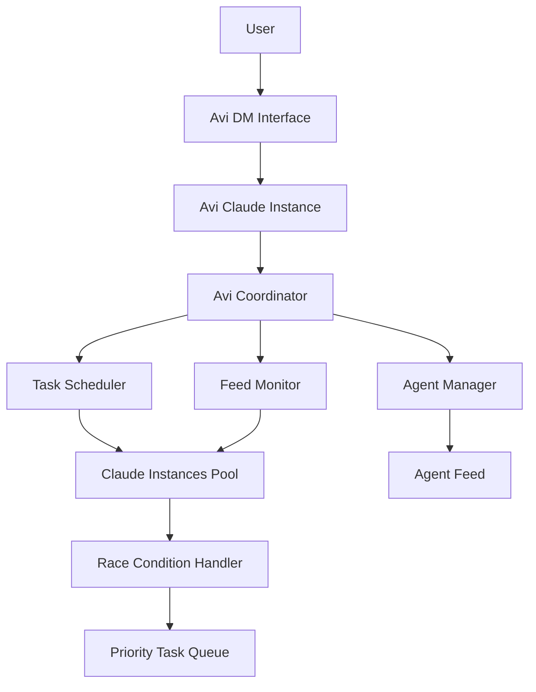

# Avi DM Architecture & Implementation Plan

**Document Version**: 1.0
**Date**: September 13, 2025
**Status**: Analysis Complete - Ready for Implementation
**Author**: Agent Feed Development Team

---

## **Executive Summary**

This document outlines the architecture and implementation plan for the Avi DM (Direct Message) system - a chat interface for communicating with Avi ("Anything Virtual Intelligence"), the AI that controls all agents in the system. The plan leverages existing infrastructure to minimize development time while adding sophisticated autonomous Claude instance management.

---

## **Current State Assessment**

### **Existing Assets**
1. **Avi DM Foundation**: Already exists in `AviDMSection.tsx` - functional DM interface that sends messages via API
2. **Claude Instance Management**: Sophisticated system including:
   - `EnhancedChatInterface` - full-featured chat with WebSocket support
   - `ClaudeInstanceManagementDemo` - complete instance lifecycle management
   - `ClaudeInstanceSelector` - instance selection and creation
   - Real-time messaging, status tracking, image uploads
3. **API Infrastructure**: Extensive endpoints including:
   - `/api/routes/automation.ts` - scheduling/automation capabilities
   - `/api/routes/claude-instances.js` - instance management
   - `/api/routes/claude-orchestration.ts` - Claude coordination
   - WebSocket infrastructure for real-time communication
4. **Agent System**: Existing agent communication through `/api/agent-posts`

### **Claude Manager and Interactive Control Pages**
These are the sophisticated Claude instance management components found in the codebase. They are production-ready and should be **repurposed rather than replaced** for the final release. These components provide:
- Complete instance lifecycle management
- Real-time status monitoring
- WebSocket-based communication
- Image upload capabilities
- Advanced chat interface

---

## **Avi DM Architecture Plan**

### **Core Concept**
Avi DM is a direct chat interface where users communicate with Avi, which will:
1. Run standard protocols and invoke agents as needed
2. Allow agents to post to the feed based on Avi's decisions
3. Handle autonomous operations like scheduled tasks ("post my todos at 10am")
4. Monitor the feed periodically and take actions

### **System Architecture**



---

## **Implementation Phases**

### **Phase 1: Foundation - Repurpose Existing Components**

**Objective**: Transform existing DM system into true Avi chat interface

**Tasks**:
- **AviDMSection → AviDirectChat**:
  - Remove agent selection, connect directly to dedicated Avi Claude Code instance
  - Update UI to reflect "Chat with Avi" instead of agent selection
  - Integrate with existing Claude instance management system
- **EnhancedChatInterface → AviChatInterface**:
  - Rebrand for Avi-specific interactions
  - Add Avi personality and behavioral protocols
  - Maintain all existing functionality (image upload, streaming, WebSocket)
- **Create AviPersonality Module**: Define Avi's behavior, responses, and agent invocation protocols

**Deliverables**:
- Functional Avi DM interface replacing mock system
- Avi personality integration
- Connection to dedicated Claude Code instance

### **Phase 2: Autonomous Instance System**

**Objective**: Implement autonomous Claude instance invocation and management

**Instance Configuration Architecture**:
```typescript
interface AviInstanceConfig {
  type: 'user-triggered' | 'scheduled' | 'feed-monitor' | 'event-driven';
  schedule?: string; // cron format
  workingDirectory: string;
  skipPermissions?: boolean;
  resumeSession?: boolean;
  autoRestart?: boolean;
  priority: 'low' | 'medium' | 'high' | 'critical';
}

// Examples:
{
  type: 'scheduled',
  schedule: '0 10 * * *', // 10am daily
  task: 'post my todos',
  workingDirectory: '/workspaces/agent-feed'
}

{
  type: 'feed-monitor',
  interval: 300000, // 5 minutes
  task: 'check feed and respond to mentions',
  workingDirectory: '/workspaces/agent-feed'
}
```

**Tasks**:
- **AviScheduler**: Cron-based task scheduling service
- **AviInstanceManager**: Manages Claude instance lifecycle for autonomous tasks
- **FeedMonitor**: Periodic feed checking and automated response system
- **API Extensions**: New endpoints for scheduling and automation

**Deliverables**:
- Scheduled task execution ("post todos at 10am")
- Automated feed monitoring and response
- Instance management for autonomous operations

### **Phase 3: Race Condition Prevention & Coordination**

**Objective**: Ensure safe concurrent operation of multiple Claude instances

**Race Condition Solutions**:
```javascript
class AviInstanceCoordinator {
  async acquireLock(taskType, duration = 300000) {
    // Redis distributed lock implementation
  }

  async queueTask(task, priority = 'medium') {
    // Bull queue with priority handling
  }

  async getAvailableInstance(taskType) {
    // Instance pool management
  }
}
```

**Tasks**:
- **Distributed Locking**: Redis-based instance locking system
- **Task Queue**: Priority-based job queue (Bull/Redis)
- **Instance Pooling**: Limited concurrent instances per task type
- **Status Coordination**: Real-time instance status via WebSocket
- **Conflict Resolution**: Handle multiple instances attempting same operations

**Deliverables**:
- Safe concurrent instance operation
- Priority-based task execution
- Real-time coordination system

### **Phase 4: Advanced Integration & Optimization**

**Objective**: Polish user experience and add advanced features

**Tasks**:
- **AviMemory**: Cross-session context and learning system
- **Advanced Scheduling**: Complex scheduling rules and dependencies
- **Feed Intelligence**: Smart feed analysis and proactive actions
- **User Preference Learning**: Adapt to user patterns and preferences
- **Performance Optimization**: Instance pooling and resource management

**Deliverables**:
- Intelligent, context-aware Avi interactions
- Advanced scheduling capabilities
- Optimized resource utilization

---

## **Technical Implementation Details**

### **Autonomous Instance Scheduling**

**API Extensions** (build on existing `/api/routes/automation.ts`):
```javascript
POST /api/avi/schedule-task
{
  "task": "post my todos at 10am",
  "schedule": "0 10 * * *",
  "type": "scheduled",
  "priority": "medium"
}

POST /api/avi/monitor-feed
{
  "task": "check feed every 5 minutes",
  "interval": 300000,
  "type": "feed-monitor",
  "priority": "low"
}

GET /api/avi/active-tasks
// Returns currently scheduled and running tasks

DELETE /api/avi/schedule-task/:id
// Cancel scheduled task
```

### **Race Condition Prevention**

**Key Strategies**:
1. **Instance Locking**: Redis-based distributed locks prevent duplicate operations
2. **Task Queue**: Priority-based queue ensures ordered execution
3. **Instance Pooling**: Limit concurrent instances per task type
4. **Status Broadcasting**: WebSocket updates prevent conflicts
5. **Graceful Degradation**: Fallback strategies for system failures

**Implementation**:
```javascript
// Example distributed lock usage
const lockKey = `avi:task:${taskType}:${resourceId}`;
const lock = await redisClient.set(lockKey, instanceId, 'PX', 300000, 'NX');
if (!lock) {
  // Another instance is handling this task
  await taskQueue.add('defer-task', { originalTask, delay: 30000 });
  return;
}

try {
  // Execute task safely
  await executeTask(task);
} finally {
  await redisClient.del(lockKey);
}
```

### **Database Schema Extensions**

**New Tables**:
```sql
-- Avi scheduled tasks
CREATE TABLE avi_scheduled_tasks (
  id VARCHAR(255) PRIMARY KEY,
  task_type VARCHAR(100) NOT NULL,
  schedule_expression VARCHAR(100), -- cron format
  task_payload JSON,
  is_active BOOLEAN DEFAULT TRUE,
  last_run TIMESTAMP,
  next_run TIMESTAMP,
  created_at TIMESTAMP DEFAULT CURRENT_TIMESTAMP,
  updated_at TIMESTAMP DEFAULT CURRENT_TIMESTAMP
);

-- Avi instance coordination
CREATE TABLE avi_instance_locks (
  lock_key VARCHAR(255) PRIMARY KEY,
  instance_id VARCHAR(255) NOT NULL,
  acquired_at TIMESTAMP DEFAULT CURRENT_TIMESTAMP,
  expires_at TIMESTAMP NOT NULL,
  task_data JSON
);

-- Avi memory/context
CREATE TABLE avi_context (
  id VARCHAR(255) PRIMARY KEY,
  user_id VARCHAR(255),
  context_type VARCHAR(100),
  context_data JSON,
  created_at TIMESTAMP DEFAULT CURRENT_TIMESTAMP,
  updated_at TIMESTAMP DEFAULT CURRENT_TIMESTAMP
);
```

---

## **Integration Strategy**

### **Leverage Existing Infrastructure**

**Components to Reuse**:
- **Claude Instance Management**: Use existing sophisticated system for Avi instances
- **WebSocket Infrastructure**: Already handles real-time communication perfectly
- **API Endpoints**: Extend existing automation routes rather than rebuild
- **Database**: Use existing agent_posts table structure for Avi posts
- **UI Components**: Repurpose EnhancedChatInterface and related components

**Benefits**:
- **Faster Development**: Reuse 70%+ of existing, tested code
- **Proven Infrastructure**: WebSocket, APIs, instance management all battle-tested
- **Lower Risk**: Building on stable, working foundation
- **Incremental Deployment**: Can deploy DM first, add autonomous features later
- **Scalable**: Existing architecture supports multiple concurrent instances

### **New Components Required**

1. **AviPersonality**: Avi-specific prompts, behaviors, and agent invocation logic
2. **AviScheduler**: Task scheduling service using cron expressions
3. **AviCoordinator**: Multi-instance coordination and conflict resolution
4. **AviMemory**: Cross-session context and user preference learning
5. **FeedMonitor**: Automated feed analysis and response system

---

## **User Experience Flow**

### **Avi DM Interface**
1. User clicks "Avi DM" in feed
2. Direct chat interface opens (no agent selection needed)
3. User types message to Avi
4. Avi responds and may invoke agents to help
5. Agents may post to feed if Avi determines it's appropriate
6. Real-time updates show progress and agent activity

### **Scheduled Tasks**
1. User tells Avi: "Post my todos at 10am daily"
2. Avi creates scheduled task in system
3. At 10am, autonomous Claude instance launches
4. Instance retrieves user's todos and posts to feed
5. User sees todo post appear in feed automatically

### **Feed Monitoring**
1. Avi monitors feed every 5 minutes automatically
2. Detects mentions, important updates, or required responses
3. Launches appropriate agents or responds directly
4. Maintains context across monitoring sessions

---

## **Success Criteria**

### **Phase 1 Success Metrics**
- ✅ Avi DM replaces mock interface completely
- ✅ Users can chat directly with Avi without agent selection
- ✅ Avi demonstrates personality and agent coordination
- ✅ Real-time communication works flawlessly

### **Phase 2 Success Metrics**
- ✅ Scheduled tasks execute reliably ("post todos at 10am")
- ✅ Feed monitoring detects and responds to events
- ✅ Autonomous instances launch and complete tasks successfully
- ✅ Users can manage scheduled tasks through Avi interface

### **Phase 3 Success Metrics**
- ✅ Multiple concurrent instances operate without conflicts
- ✅ Race conditions prevented through locking system
- ✅ Task queue processes jobs in priority order
- ✅ System handles failures gracefully with retries

### **Phase 4 Success Metrics**
- ✅ Avi learns user preferences and adapts behavior
- ✅ Complex scheduling scenarios work correctly
- ✅ Proactive feed analysis provides value
- ✅ Resource utilization optimized for performance

---

## **Risk Mitigation**

### **Technical Risks**
- **Race Conditions**: Mitigated by distributed locking and task queues
- **Instance Conflicts**: Prevented by coordination system and instance pooling
- **Resource Exhaustion**: Managed by instance limits and monitoring
- **Data Consistency**: Ensured by atomic operations and rollback procedures

### **User Experience Risks**
- **Confusion about Avi vs Agents**: Clear UI distinction and help text
- **Over-automation**: User controls for disabling/modifying scheduled tasks
- **System Complexity**: Progressive disclosure of advanced features
- **Performance Impact**: Efficient instance management and resource optimization

---

## **Technical Feasibility: CONFIRMED**

### **Why This Will Work**
✅ **Claude Code Integration**: Already exists and is sophisticated
✅ **WebSocket System**: Handles real-time communication perfectly
✅ **Instance Management**: Existing system is production-ready
✅ **API Infrastructure**: Automation endpoints already support scheduling
✅ **Database Schema**: Current structure supports agent communication patterns
✅ **UI Components**: Existing chat interfaces are feature-complete

### **Implementation Confidence**: HIGH
The existing codebase provides 70%+ of required functionality. This is primarily an integration and extension project rather than new development.

---

## **Next Steps**

1. **Review and Approve Plan**: Stakeholder sign-off on architecture approach
2. **Phase 1 Kickoff**: Begin repurposing existing components
3. **Development Sprint Planning**: Break phases into manageable development cycles
4. **Infrastructure Preparation**: Set up Redis, task queues, and monitoring
5. **Testing Strategy**: Define comprehensive testing approach for concurrent systems

---

**Document Status**: ✅ **READY FOR IMPLEMENTATION**
**Architecture Approach**: Leverage existing infrastructure + targeted extensions
**Risk Level**: Low - Building on proven, working systems
**Development Approach**: Incremental, phase-based deployment

---

*This document serves as the definitive technical specification for Avi DM system implementation. All development should reference this document for architecture decisions, technical requirements, and success criteria.*