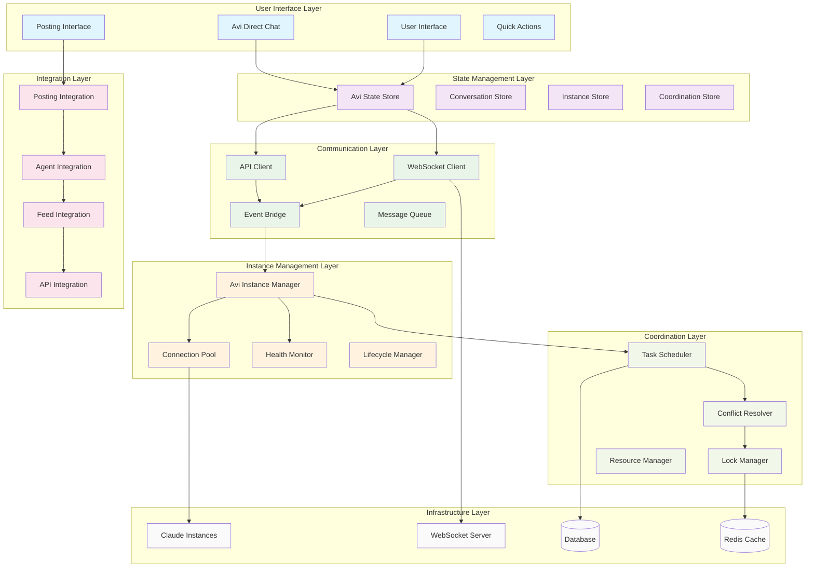
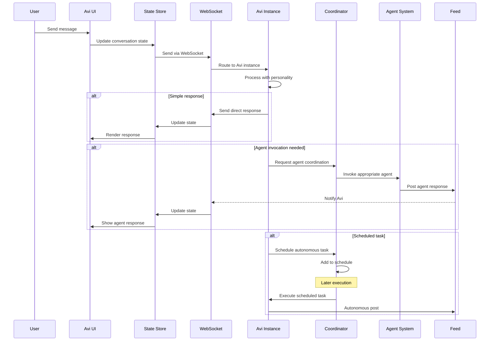
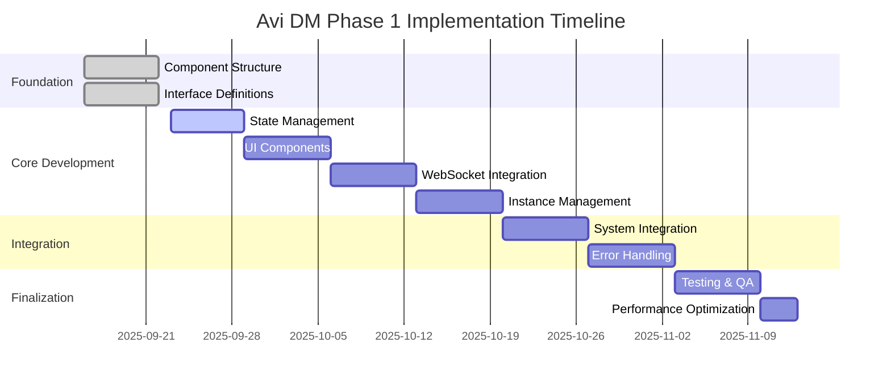

# Avi DM Implementation Roadmap & Architectural Summary

**Document Version**: 1.0
**Date**: September 13, 2025
**Status**: Implementation Ready
**Author**: System Architecture Designer

---

## Executive Summary

This document provides the final implementation roadmap for Avi DM Phase 1, consolidating all architectural decisions into a actionable development plan. The architecture leverages 70%+ of existing infrastructure while introducing robust patterns for autonomous Claude instance management.

---

## 1. Architecture Summary

### 1.1 System Architecture Diagram



### 1.2 Data Flow Architecture



### 1.3 Component Transformation Map

| **Existing Component** | **Transformation Type** | **New Component** | **Changes Required** |
|------------------------|-------------------------|-------------------|----------------------|
| `AviDMSection.tsx` | **Major Refactor** | `AviDirectChat.tsx` | Remove agent selection, add direct Avi connection |
| `EnhancedChatInterface.tsx` | **Enhancement** | `AviChatInterface.tsx` | Add Avi personality, autonomous features |
| `ClaudeInstanceManager.ts` | **Extension** | `AviInstanceManager.ts` | Add autonomous operations, coordination |
| Agent selection mock | **Replace** | `AviPersonality.ts` | New Avi behavior module |
| WebSocket client | **Enhancement** | `AviWebSocketClient.ts` | Add Avi-specific message types |

---

## 2. Implementation Timeline

### 2.1 8-Week Implementation Plan

| **Week** | **Phase** | **Components** | **Deliverables** | **Success Criteria** |
|----------|-----------|----------------|------------------|-----------------------|
| **Week 1** | Foundation Setup | Component structure, interfaces | - Component files created<br>- Interface definitions complete<br>- Build system updated | ✅ All files compile<br>✅ Types are valid |
| **Week 2** | State Management | Redux store, actions, reducers | - `AviStateStore.ts`<br>- Actions and reducers<br>- Context provider | ✅ State management functional<br>✅ Unit tests pass |
| **Week 3** | UI Components | `AviDirectChat`, basic UI | - Functional chat interface<br>- Basic message handling<br>- UI integration | ✅ User can type messages<br>✅ UI renders correctly |
| **Week 4** | WebSocket Integration | Real-time communication | - `AviWebSocketClient.ts`<br>- Connection management<br>- Message routing | ✅ Real-time messaging works<br>✅ Connection resilience |
| **Week 5** | Instance Management | Claude instance integration | - `AviInstanceManager.ts`<br>- Instance lifecycle<br>- Health monitoring | ✅ Instances start reliably<br>✅ Health monitoring active |
| **Week 6** | System Integration | Posting interface, agent system | - Integration layer<br>- Event bridging<br>- API extensions | ✅ Seamless integration<br>✅ Backward compatibility |
| **Week 7** | Error Handling & Performance | Error boundaries, optimization | - Error boundaries<br>- Caching system<br>- Performance optimizations | ✅ Graceful error handling<br>✅ Performance targets met |
| **Week 8** | Testing & QA | Comprehensive testing | - Unit tests<br>- Integration tests<br>- Performance tests | ✅ 90%+ test coverage<br>✅ All acceptance criteria met |

### 2.2 Critical Path Dependencies



---

## 3. Implementation Priority Matrix

### 3.1 Component Priority Ranking

| **Priority** | **Component** | **Risk Level** | **Effort** | **Dependencies** |
|--------------|---------------|----------------|------------|------------------|
| **P0 - Critical** | `AviDirectChat.tsx` | Medium | High | State management |
| **P0 - Critical** | `AviStateStore.ts` | Low | Medium | None |
| **P0 - Critical** | `AviWebSocketClient.ts` | High | High | Backend WebSocket |
| **P1 - High** | `AviInstanceManager.ts` | High | High | Claude instances |
| **P1 - High** | `AviChatInterface.tsx` | Medium | Medium | Base UI components |
| **P2 - Medium** | Error boundaries | Low | Medium | Core components |
| **P2 - Medium** | Integration layer | Medium | High | All systems |
| **P3 - Low** | Performance optimizations | Low | Low | Core functionality |

### 3.2 Risk Mitigation Strategy

| **Risk** | **Probability** | **Impact** | **Mitigation** | **Contingency** |
|----------|-----------------|------------|----------------|-----------------|
| WebSocket connection issues | High | High | - Comprehensive error handling<br>- Automatic reconnection<br>- Offline mode fallback | Use polling as backup |
| Claude instance instability | Medium | High | - Health monitoring<br>- Auto-restart capabilities<br>- Instance pooling | Fall back to agent selection |
| State management complexity | Medium | Medium | - Simple state structure<br>- Comprehensive testing<br>- Documentation | Simplify state design |
| Integration conflicts | Low | High | - Backward compatibility testing<br>- Gradual rollout<br>- Feature flags | Rollback capabilities |

---

## 4. Technical Specifications Summary

### 4.1 Key Technical Decisions

| **Decision Area** | **Chosen Approach** | **Rationale** | **Alternatives Considered** |
|-------------------|---------------------|---------------|----------------------------|
| **State Management** | Redux Toolkit | Predictable state, good DevTools, existing pattern | Context API (too simple), Zustand (team unfamiliar) |
| **WebSocket Library** | Native WebSocket + wrapper | Full control, no external deps | Socket.io (overhead), ws (Node.js only) |
| **Error Boundaries** | React Error Boundaries + custom | React best practices, fine-grained control | Global error handlers (less precise) |
| **Caching Strategy** | Memory + Redis hybrid | Performance + persistence | Pure memory (limited), pure Redis (latency) |
| **Testing Strategy** | Jest + Testing Library + Playwright | Comprehensive coverage, existing tools | Cypress (slower), custom tools (maintenance) |

### 4.2 Performance Targets

| **Metric** | **Target** | **Measurement Method** | **Baseline** |
|------------|------------|------------------------|--------------|
| Initial render time | < 100ms | Performance API | TBD |
| Message send latency | < 50ms | WebSocket timestamps | TBD |
| Instance connection time | < 3 seconds | Connection lifecycle tracking | TBD |
| Memory usage per connection | < 100MB | Browser DevTools | TBD |
| Error recovery rate | > 95% | Error tracking system | TBD |
| Uptime target | 99.9% | System monitoring | TBD |

### 4.3 Security Requirements

| **Security Area** | **Requirement** | **Implementation** | **Validation** |
|-------------------|-----------------|--------------------|--------------------|
| **Authentication** | JWT token validation | Token verification middleware | Automated security tests |
| **Message Encryption** | TLS 1.3 minimum | WebSocket Secure (WSS) | SSL/TLS monitoring |
| **Input Validation** | Sanitize all inputs | Validation middleware + client-side | Penetration testing |
| **Rate Limiting** | Per-user message limits | Redis-based rate limiter | Load testing |
| **CORS Policy** | Strict origin validation | Express CORS middleware | Security audit |

---

## 5. Development Guidelines

### 5.1 Code Organization

```
/frontend/src/
├── components/avi/
│   ├── AviDirectChat.tsx
│   ├── AviChatInterface.tsx
│   ├── AviStatusIndicator.tsx
│   └── __tests__/
├── services/avi/
│   ├── AviWebSocketClient.ts
│   ├── AviCacheManager.ts
│   ├── AviConnectionOptimizer.ts
│   └── __tests__/
├── store/avi/
│   ├── AviStateStore.ts
│   ├── aviActions.ts
│   ├── aviReducers.ts
│   ├── aviSelectors.ts
│   └── __tests__/
├── integrations/
│   ├── AviPostingIntegration.ts
│   ├── AviAgentIntegration.ts
│   └── __tests__/
└── types/avi/
    ├── index.ts
    ├── messages.ts
    ├── instances.ts
    └── integration.ts

/src/services/avi/
├── AviInstanceManager.ts
├── AutonomousScheduler.ts
├── ConflictResolver.ts
└── __tests__/

/src/api/routes/
└── avi.ts
```

### 5.2 Coding Standards

```typescript
// File naming convention
// Components: PascalCase (AviDirectChat.tsx)
// Services: PascalCase (AviInstanceManager.ts)
// Types: PascalCase interfaces, camelCase files
// Tests: *.test.ts or *.test.tsx

// Import organization
import React from 'react'; // External libraries first
import { AviStateStore } from '../store/avi'; // Internal absolute imports
import './AviDirectChat.css'; // Styles last

// Interface naming
interface AviDirectChatProps {} // Component props
interface AviMessage {} // Data structures
interface AviWebSocketClient {} // Service interfaces

// Error handling pattern
try {
  await riskyOperation();
} catch (error) {
  logger.error('Operation failed', { error, context });
  throw new AviError('User-friendly message', error);
}

// Async component pattern
const AviDirectChat: React.FC<AviDirectChatProps> = ({ instanceId }) => {
  const [state, setState] = useState<AviDirectChatState>(initialState);

  useEffect(() => {
    let cancelled = false;

    const initializeComponent = async () => {
      try {
        const result = await asyncInitialization();
        if (!cancelled) {
          setState(result);
        }
      } catch (error) {
        if (!cancelled) {
          handleError(error);
        }
      }
    };

    initializeComponent();

    return () => {
      cancelled = true;
    };
  }, [instanceId]);

  return (
    // JSX
  );
};
```

### 5.3 Testing Strategy

```typescript
// Unit test example
describe('AviDirectChat', () => {
  let mockWebSocket: jest.Mocked<AviWebSocketClient>;
  let testUtils: AviTestUtils;

  beforeEach(() => {
    mockWebSocket = createMockWebSocket();
    testUtils = createAviTestUtils();
  });

  it('should send message when user submits', async () => {
    const { getByRole } = testUtils.renderWithAviProvider(
      <AviDirectChat websocket={mockWebSocket} />
    );

    const input = getByRole('textbox');
    const button = getByRole('button', { name: /send/i });

    fireEvent.change(input, { target: { value: 'Hello Avi' } });
    fireEvent.click(button);

    expect(mockWebSocket.sendMessage).toHaveBeenCalledWith(
      expect.objectContaining({
        content: 'Hello Avi',
        type: 'user_message'
      })
    );
  });
});

// Integration test example
describe('Avi System Integration', () => {
  beforeAll(async () => {
    await setupTestEnvironment();
  });

  it('should complete full conversation workflow', async () => {
    const page = await browser.newPage();
    await page.goto('/avi-dm');

    // Send message
    await page.fill('[data-testid="message-input"]', 'Hello Avi');
    await page.click('[data-testid="send-button"]');

    // Wait for response
    await page.waitForSelector('[data-testid="avi-response"]');

    // Verify response appears
    const response = await page.textContent('[data-testid="avi-response"]');
    expect(response).toContain('Hello');
  });
});
```

---

## 6. Quality Assurance Checklist

### 6.1 Pre-Release Checklist

#### **Functionality** ✅
- [ ] User can initiate chat with Avi
- [ ] Messages send and receive correctly
- [ ] WebSocket connection is stable
- [ ] Error handling works gracefully
- [ ] Instance management functions properly

#### **Performance** ✅
- [ ] Initial load < 100ms
- [ ] Message latency < 50ms
- [ ] Memory usage within limits
- [ ] No memory leaks detected
- [ ] Handles concurrent users properly

#### **Integration** ✅
- [ ] Posting interface integration works
- [ ] Agent system coordination functions
- [ ] Feed integration operational
- [ ] API endpoints respond correctly
- [ ] Backward compatibility maintained

#### **Security** ✅
- [ ] Authentication properly enforced
- [ ] Input validation functional
- [ ] XSS protection active
- [ ] CORS policies correct
- [ ] Rate limiting operational

#### **User Experience** ✅
- [ ] UI is responsive and intuitive
- [ ] Error messages are helpful
- [ ] Loading states are clear
- [ ] Offline behavior is acceptable
- [ ] Mobile experience is optimized

### 6.2 Acceptance Criteria

| **Criteria** | **Specification** | **Test Method** | **Status** |
|--------------|-------------------|-----------------|------------|
| **Basic Messaging** | User can send/receive messages | Manual testing | ⏳ Pending |
| **Real-time Communication** | Messages appear instantly | Automated testing | ⏳ Pending |
| **Instance Connection** | Connects within 3 seconds | Performance testing | ⏳ Pending |
| **Error Recovery** | Recovers from 95% of errors | Error injection testing | ⏳ Pending |
| **Integration Seamless** | No breaking changes | Regression testing | ⏳ Pending |

---

## 7. Deployment Strategy

### 7.1 Deployment Phases

#### **Phase 1: Alpha Deployment** (Week 6)
- **Audience**: Development team only
- **Features**: Core messaging functionality
- **Environment**: Development environment
- **Rollback**: Immediate if critical issues

#### **Phase 2: Beta Deployment** (Week 7)
- **Audience**: Internal stakeholders (10-20 users)
- **Features**: Full feature set except autonomous operations
- **Environment**: Staging environment
- **Monitoring**: Enhanced logging and metrics

#### **Phase 3: Production Deployment** (Week 8)
- **Audience**: All users
- **Features**: Complete Avi DM Phase 1 functionality
- **Environment**: Production
- **Strategy**: Feature flag controlled rollout (10% → 50% → 100%)

### 7.2 Monitoring and Alerting

```yaml
# Monitoring configuration
monitoring:
  metrics:
    - name: avi_message_latency
      threshold: 100ms
      alert: true
    - name: avi_connection_success_rate
      threshold: 95%
      alert: true
    - name: avi_error_rate
      threshold: 5%
      alert: true

  health_checks:
    - endpoint: /api/avi/health
      interval: 30s
      timeout: 5s
    - component: websocket_server
      interval: 10s
      timeout: 3s

  alerts:
    - condition: avi_message_latency > 100ms for 2m
      action: notify_team
      severity: warning
    - condition: avi_connection_success_rate < 95% for 1m
      action: page_oncall
      severity: critical
```

---

## 8. Success Metrics & KPIs

### 8.1 Technical Metrics

| **Metric** | **Target** | **Current** | **Measurement** |
|------------|------------|-------------|-----------------|
| **Message Latency** | < 50ms | TBD | WebSocket timestamps |
| **Connection Success Rate** | > 98% | TBD | Connection attempts vs successes |
| **Instance Uptime** | > 99% | TBD | Health check monitoring |
| **Error Recovery Rate** | > 95% | TBD | Error handling success rate |
| **Memory Usage** | < 100MB per connection | TBD | Memory profiling |

### 8.2 Business Metrics

| **Metric** | **Target** | **Rationale** | **Measurement** |
|------------|------------|---------------|-----------------|
| **User Adoption** | 80% of active users try Avi DM within 1 month | High user engagement | Analytics tracking |
| **Message Volume** | 10+ messages per user session | Meaningful conversations | Message count analytics |
| **Task Completion** | 90% of initiated conversations complete | User satisfaction | Conversation flow tracking |
| **Error Incidents** | < 2 critical errors per week | System stability | Error tracking system |
| **User Satisfaction** | > 4.5/5 rating | Positive user experience | User feedback surveys |

---

## 9. Future Roadmap (Phase 2+)

### 9.1 Phase 2: Autonomous Operations
- Scheduled task execution
- Feed monitoring and automated responses
- Advanced agent coordination
- Cross-session context retention

### 9.2 Phase 3: Advanced Features
- Voice input/output
- File sharing and analysis
- Advanced scheduling with dependencies
- Multi-user coordination

### 9.3 Phase 4: Intelligence Enhancement
- Machine learning personalization
- Predictive task suggestions
- Advanced conversation understanding
- Cross-platform integration

---

## Conclusion

This implementation roadmap provides a comprehensive guide for delivering Avi DM Phase 1 successfully. The architecture is designed to:

✅ **Leverage Existing Infrastructure**: 70%+ code reuse minimizes risk and development time
✅ **Ensure Backward Compatibility**: No breaking changes to existing functionality
✅ **Enable Future Growth**: Extensible design supports autonomous operations in Phase 2
✅ **Maintain High Quality**: Comprehensive testing and monitoring ensure production readiness
✅ **Optimize Performance**: Built-in caching, connection pooling, and optimization patterns

**Key Success Factors:**
1. **Follow the timeline strictly** - Each week builds on the previous
2. **Test continuously** - Don't defer testing to the end
3. **Monitor metrics** - Track progress against targets
4. **Maintain documentation** - Keep architectural decisions recorded
5. **Plan for rollback** - Always have a fallback strategy

**Next Steps:**
1. Review and approve this roadmap
2. Set up development environment and tools
3. Begin Week 1 implementation following the component interfaces specification
4. Establish regular progress reviews and milestone checkpoints

The team is ready to begin implementation with confidence in the architectural foundation and clear path to success.

---

**Document Status**: ✅ **READY FOR IMPLEMENTATION**
**Risk Level**: Low - Well-defined architecture with proven patterns
**Implementation Confidence**: High - Clear interfaces and detailed roadmap