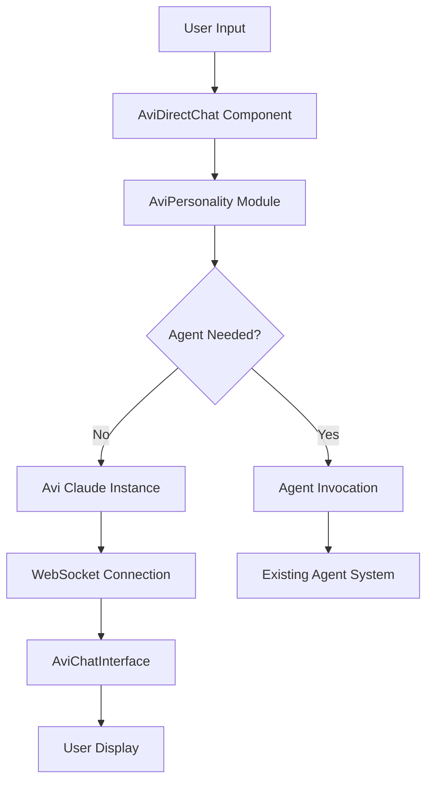

# Avi DM Phase 1 - SPARC Specification Document

**Document Version**: 1.0
**Date**: September 13, 2025
**Status**: Requirements Analysis Complete - Ready for Implementation
**Phase**: SPARC Specification
**Author**: SPARC Specification Agent

---

## Executive Summary

This document provides comprehensive specifications for Avi DM Phase 1 implementation, transforming the existing agent-based direct messaging system into a true Avi (Anything Virtual Intelligence) chat interface. The specifications focus on repurposing existing infrastructure while adding Avi-specific behaviors and personality protocols.

---

## 1. System Requirements Specification

### 1.1 Purpose

Transform the existing AviDMSection component from a mock agent selection interface into a direct chat interface with Avi, leveraging the sophisticated Claude instance management system already in place.

### 1.2 Scope

- **In Scope**:
  - AviDMSection → AviDirectChat transformation
  - EnhancedChatInterface → AviChatInterface rebranding
  - AviPersonality module creation
  - Claude Code instance integration
  - User experience flow enhancement
  - Real-time messaging with WebSocket support

- **Out of Scope**:
  - Autonomous scheduling system (Phase 2)
  - Feed monitoring capabilities (Phase 2)
  - Advanced coordination features (Phase 3)

### 1.3 Definitions

- **Avi**: Anything Virtual Intelligence - the AI that controls all agents
- **AviDirectChat**: Direct chat interface with Avi (transformed from AviDMSection)
- **AviChatInterface**: Avi-branded chat interface (transformed from EnhancedChatInterface)
- **AviPersonality**: Behavioral and personality protocol module for Avi interactions
- **Claude Code Instance**: Dedicated Claude instance for Avi communications

---

## 2. Functional Requirements

### 2.1 AviDirectChat Component Transformation (FR-2.1)

#### FR-2.1.1: Remove Agent Selection Interface
- **Requirement**: Remove agent selection dropdown and search functionality
- **Current State**: AviDMSection shows agent selection with AVAILABLE_AGENTS array
- **Target State**: Direct connection to Avi without agent selection
- **Acceptance Criteria**:
  - Agent selection UI elements completely removed
  - No AVAILABLE_AGENTS array dependency
  - Direct "Chat with Avi" interface presentation
  - Seamless transition from current mock system

#### FR-2.1.2: Integrate Claude Code Instance Connection
- **Requirement**: Connect directly to dedicated Avi Claude Code instance
- **Dependencies**: Existing EnhancedChatInterface and Claude instance management system
- **Acceptance Criteria**:
  - Dedicated Claude Code instance automatically created for Avi
  - Direct WebSocket connection established
  - Real-time message streaming functional
  - Instance lifecycle properly managed

#### FR-2.1.3: Maintain Existing UI/UX Patterns
- **Requirement**: Preserve successful UI patterns from current implementation
- **Acceptance Criteria**:
  - Message input with auto-resize functionality
  - Keyboard shortcuts (⌘+Enter to send)
  - Real-time typing indicators
  - Message status indicators (sent/delivered/read)
  - File attachment capabilities
  - Mobile-responsive design

### 2.2 AviChatInterface Rebranding (FR-2.2)

#### FR-2.2.1: Visual Identity Transformation
- **Requirement**: Rebrand EnhancedChatInterface for Avi-specific interactions
- **Acceptance Criteria**:
  - Avi-themed color scheme and iconography
  - "Chat with Avi" branding throughout interface
  - Avi avatar/icon representation
  - Consistent visual language with Avi personality

#### FR-2.2.2: Preserve Core Functionality
- **Requirement**: Maintain all existing EnhancedChatInterface capabilities
- **Acceptance Criteria**:
  - Image upload and display functionality
  - Message streaming with typing indicators
  - Copy message functionality
  - Token usage tracking
  - WebSocket-based real-time communication
  - Error handling and recovery

### 2.3 AviPersonality Module (FR-2.3)

#### FR-2.3.1: Behavioral Protocol Definition
- **Requirement**: Define Avi's personality, communication style, and behavioral patterns
- **Acceptance Criteria**:
  - Consistent voice and tone across all interactions
  - Clear protocols for agent invocation decisions
  - Response templates for common scenarios
  - Error handling personality traits
  - Learning and adaptation patterns

#### FR-2.3.2: Agent Coordination Protocols
- **Requirement**: Define how Avi decides when and which agents to invoke
- **Acceptance Criteria**:
  - Decision tree for agent invocation
  - Priority matrix for different request types
  - Handoff protocols between Avi and agents
  - Context preservation across agent interactions

### 2.4 Integration Requirements (FR-2.4)

#### FR-2.4.1: Existing System Integration
- **Requirement**: Seamlessly integrate with existing agent-posts API and WebSocket system
- **Acceptance Criteria**:
  - `/api/agent-posts` endpoint compatibility maintained
  - WebSocket events properly handled
  - Database schema compatibility
  - Existing feed integration preserved

#### FR-2.4.2: Claude Code Instance Management
- **Requirement**: Leverage existing Claude instance management infrastructure
- **Acceptance Criteria**:
  - Use ClaudeInstanceManagementDemo patterns
  - Implement InstanceStatusIndicator integration
  - Utilize existing WebSocket infrastructure
  - Follow established instance lifecycle patterns

---

## 3. Non-Functional Requirements

### 3.1 Performance Requirements (NFR-3.1)

#### NFR-3.1.1: Response Time
- **Requirement**: Avi responses must be perceived as real-time
- **Acceptance Criteria**:
  - Initial response acknowledgment < 200ms
  - WebSocket message latency < 100ms
  - UI updates render within 16ms (60fps)
  - No blocking operations on main thread

#### NFR-3.1.2: Concurrent User Support
- **Requirement**: Support multiple concurrent Avi conversations
- **Acceptance Criteria**:
  - Minimum 10 concurrent users per Claude instance
  - Graceful degradation under load
  - Connection pooling for efficiency
  - Resource usage monitoring

### 3.2 Reliability Requirements (NFR-3.2)

#### NFR-3.2.1: Connection Resilience
- **Requirement**: Robust WebSocket connection handling
- **Acceptance Criteria**:
  - Automatic reconnection on connection loss
  - Message queuing during disconnection
  - Connection state clearly indicated to user
  - Graceful fallback to HTTP polling if needed

#### NFR-3.2.2: Error Recovery
- **Requirement**: Comprehensive error handling and recovery
- **Acceptance Criteria**:
  - Claude instance failures handled gracefully
  - User-friendly error messages
  - Automatic retry mechanisms
  - State preservation during errors

### 3.3 Usability Requirements (NFR-3.3)

#### NFR-3.3.1: Accessibility
- **Requirement**: Full accessibility compliance
- **Acceptance Criteria**:
  - WCAG 2.1 AA compliance
  - Screen reader compatibility
  - Keyboard navigation support
  - High contrast mode support

#### NFR-3.3.2: Mobile Optimization
- **Requirement**: Optimal mobile experience
- **Acceptance Criteria**:
  - Touch-friendly interface design
  - Responsive layout adaptation
  - Mobile keyboard optimization
  - Performance optimization for mobile networks

---

## 4. System Architecture Specifications

### 4.1 Component Architecture

```typescript
// New Component Hierarchy
AviDirectChat (transformed from AviDMSection)
├── AviChatInterface (transformed from EnhancedChatInterface)
│   ├── AviHeader (new)
│   ├── MessageList (existing pattern)
│   ├── AviTypingIndicator (enhanced)
│   └── AviMessageInput (enhanced)
├── AviPersonality (new module)
└── AviInstanceManager (new wrapper)
```

### 4.2 Data Flow Architecture



### 4.3 State Management Architecture

```typescript
interface AviState {
  // Connection state
  isConnected: boolean;
  connectionStatus: 'connecting' | 'connected' | 'disconnected' | 'error';

  // Conversation state
  messages: AviMessage[];
  activeConversationId: string;

  // Instance state
  claudeInstance: ClaudeInstance | null;
  instanceStatus: ClaudeInstanceStatus;

  // UI state
  isTyping: boolean;
  inputMessage: string;
  attachments: ImageAttachment[];

  // Personality state
  currentPersonality: AviPersonalityState;
  contextHistory: AviContext[];
}
```

---

## 5. Interface Specifications

### 5.1 AviDirectChat Component Interface

```typescript
interface AviDirectChatProps {
  onMessageSent?: (message: AviMessage) => void;
  onAgentInvoked?: (agentType: string, context: string) => void;
  isMobile?: boolean;
  className?: string;
  autoConnect?: boolean;
  enableVoiceInput?: boolean;
}

interface AviDirectChatState {
  claudeInstance: ClaudeInstance | null;
  isConnected: boolean;
  messages: AviMessage[];
  inputMessage: string;
  isSubmitting: boolean;
  error: string | null;
  personalityState: AviPersonalityState;
}
```

### 5.2 AviChatInterface Component Interface

```typescript
interface AviChatInterfaceProps extends Omit<EnhancedChatInterfaceProps, 'instance'> {
  aviInstance: ClaudeInstance;
  personality: AviPersonalityConfig;
  onAgentInvocation?: (agentType: string) => void;
  showPersonalityIndicator?: boolean;
  enableContextMemory?: boolean;
}
```

### 5.3 AviPersonality Module Interface

```typescript
interface AviPersonalityConfig {
  name: string;
  description: string;
  communicationStyle: 'professional' | 'friendly' | 'technical' | 'adaptive';
  agentInvocationThreshold: number;
  contextRetentionHours: number;
  responseTemplates: AviResponseTemplate[];
  decisionTrees: AviDecisionTree[];
}

interface AviPersonalityState {
  currentMood: 'helpful' | 'analytical' | 'creative' | 'problem-solving';
  contextHistory: AviContext[];
  userPreferences: UserPreference[];
  sessionMetrics: SessionMetrics;
}

interface AviResponseTemplate {
  trigger: string | RegExp;
  template: string;
  variables: string[];
  agentInvocationRules?: AgentInvocationRule[];
}

interface AgentInvocationRule {
  condition: string;
  agentType: string;
  priority: 'low' | 'medium' | 'high' | 'critical';
  context: string;
}
```

### 5.4 Message Interface Extensions

```typescript
interface AviMessage extends ChatMessage {
  aviMetadata?: {
    personalityState: AviPersonalityState;
    agentConsideration: {
      evaluated: boolean;
      agentsConsidered: string[];
      selectedAgent?: string;
      reason: string;
    };
    contextUsed: AviContext[];
    responseTime: number;
  };
}
```

---

## 6. Database Schema Specifications

### 6.1 New Tables Required

```sql
-- Avi conversation sessions
CREATE TABLE avi_conversations (
  id VARCHAR(255) PRIMARY KEY,
  user_id VARCHAR(255),
  claude_instance_id VARCHAR(255),
  title VARCHAR(500),
  personality_config JSON,
  context_history JSON,
  created_at TIMESTAMP DEFAULT CURRENT_TIMESTAMP,
  updated_at TIMESTAMP DEFAULT CURRENT_TIMESTAMP,
  last_activity TIMESTAMP,
  message_count INTEGER DEFAULT 0,
  token_count INTEGER DEFAULT 0,

  FOREIGN KEY (claude_instance_id) REFERENCES claude_instances(id),
  INDEX idx_user_conversations (user_id, last_activity),
  INDEX idx_instance_conversations (claude_instance_id)
);

-- Avi personality states
CREATE TABLE avi_personality_states (
  id VARCHAR(255) PRIMARY KEY,
  conversation_id VARCHAR(255),
  personality_config JSON,
  current_state JSON,
  context_history JSON,
  user_preferences JSON,
  created_at TIMESTAMP DEFAULT CURRENT_TIMESTAMP,
  updated_at TIMESTAMP DEFAULT CURRENT_TIMESTAMP,

  FOREIGN KEY (conversation_id) REFERENCES avi_conversations(id),
  INDEX idx_conversation_personality (conversation_id)
);

-- Avi messages (extends existing pattern)
CREATE TABLE avi_messages (
  id VARCHAR(255) PRIMARY KEY,
  conversation_id VARCHAR(255),
  message_id VARCHAR(255), -- Reference to main messages table
  avi_metadata JSON,
  agent_invocation_data JSON,
  personality_snapshot JSON,
  created_at TIMESTAMP DEFAULT CURRENT_TIMESTAMP,

  FOREIGN KEY (conversation_id) REFERENCES avi_conversations(id),
  FOREIGN KEY (message_id) REFERENCES messages(id),
  INDEX idx_conversation_messages (conversation_id, created_at)
);
```

### 6.2 Existing Table Extensions

```sql
-- Extend agent_posts for Avi integration
ALTER TABLE agent_posts ADD COLUMN avi_conversation_id VARCHAR(255);
ALTER TABLE agent_posts ADD COLUMN avi_initiated BOOLEAN DEFAULT FALSE;
ALTER TABLE agent_posts ADD COLUMN avi_context JSON;

-- Add indexes for Avi queries
CREATE INDEX idx_avi_posts ON agent_posts(avi_conversation_id, created_at);
CREATE INDEX idx_avi_initiated ON agent_posts(avi_initiated, created_at);
```

---

## 7. API Specifications

### 7.1 New Endpoints Required

```typescript
// Avi conversation management
POST /api/avi/conversations
GET /api/avi/conversations
GET /api/avi/conversations/:id
PUT /api/avi/conversations/:id
DELETE /api/avi/conversations/:id

// Avi messaging
POST /api/avi/conversations/:id/messages
GET /api/avi/conversations/:id/messages
POST /api/avi/conversations/:id/invoke-agent

// Avi personality
GET /api/avi/personality/config
PUT /api/avi/personality/config
GET /api/avi/personality/templates
POST /api/avi/personality/learn

// Avi instance management
POST /api/avi/instance/create
GET /api/avi/instance/status
POST /api/avi/instance/restart
```

### 7.2 WebSocket Event Specifications

```typescript
interface AviWebSocketEvents {
  // Avi-specific events
  'avi:message': AviMessage;
  'avi:typing': { conversationId: string; isTyping: boolean };
  'avi:agent-invocation': { agentType: string; context: string };
  'avi:personality-update': AviPersonalityState;
  'avi:context-update': AviContext[];

  // Instance events
  'avi:instance-status': ClaudeInstanceStatus;
  'avi:connection-status': ConnectionStatus;
}
```

---

## 8. User Experience Flow Specifications

### 8.1 Primary User Flow: Direct Avi Chat

```
1. User clicks "Avi DM" in interface
2. AviDirectChat component loads
3. Dedicated Claude instance connection establishes
4. User sees "Chat with Avi" interface (no agent selection)
5. User types message
6. AviPersonality processes message and determines response strategy
7. If no agent needed: Avi responds directly
8. If agent needed: Avi invokes appropriate agent and coordinates response
9. Real-time updates show progress and responses
10. Context preserved across conversation
```

### 8.2 Agent Invocation Flow

```
1. User sends complex request to Avi
2. AviPersonality analyzes request complexity and domain
3. Decision tree determines agent invocation necessity
4. If agent needed:
   a. Avi explains what it's doing ("Let me get our specialist...")
   b. Appropriate agent invoked with context
   c. Agent response integrated into conversation
   d. Avi provides synthesis/summary if needed
5. Context preserved and learning updated
```

### 8.3 Error Recovery Flow

```
1. Connection/instance error detected
2. User notified with friendly Avi-branded error message
3. Automatic reconnection attempt
4. Message queue preserved during reconnection
5. Successful reconnection restores conversation state
6. Failed reconnection provides manual retry options
7. Fallback to read-only mode if necessary
```

---

## 9. Acceptance Criteria

### 9.1 Component Transformation Criteria

- [ ] **AviDMSection → AviDirectChat Complete**
  - Agent selection UI completely removed
  - Direct Avi connection functional
  - All existing UI patterns preserved
  - Mobile responsiveness maintained

- [ ] **EnhancedChatInterface → AviChatInterface Complete**
  - Avi branding applied throughout
  - All core functionality preserved
  - Image upload capabilities maintained
  - WebSocket integration functional

- [ ] **AviPersonality Module Operational**
  - Personality configuration loaded successfully
  - Response templates functional
  - Agent invocation decisions working
  - Context retention implemented

### 9.2 Integration Criteria

- [ ] **Claude Instance Integration**
  - Dedicated Avi instance created automatically
  - WebSocket connection established
  - Real-time messaging functional
  - Instance lifecycle properly managed

- [ ] **API Integration**
  - All new endpoints functional
  - WebSocket events properly handled
  - Database operations successful
  - Error handling comprehensive

### 9.3 User Experience Criteria

- [ ] **Performance Requirements Met**
  - Response times < 200ms for acknowledgments
  - UI updates render smoothly
  - No blocking operations
  - Graceful degradation under load

- [ ] **Reliability Requirements Met**
  - Connection resilience demonstrated
  - Error recovery functional
  - Message queuing operational
  - State preservation working

---

## 10. Risk Assessment & Mitigation

### 10.1 Technical Risks

| Risk | Probability | Impact | Mitigation |
|------|------------|---------|------------|
| Claude instance instability | Medium | High | Implement robust error handling and automatic restart |
| WebSocket connection issues | Medium | Medium | Fallback to HTTP polling, connection retry logic |
| State synchronization problems | Low | High | Implement comprehensive state management |
| Performance degradation | Low | Medium | Load testing and optimization protocols |

### 10.2 User Experience Risks

| Risk | Probability | Impact | Mitigation |
|------|------------|---------|------------|
| Confusion about Avi vs agents | Medium | Medium | Clear UI distinction and onboarding |
| Personality inconsistency | Low | Medium | Comprehensive personality testing |
| Context loss between sessions | Low | High | Robust context persistence |
| Mobile usability issues | Low | Medium | Extensive mobile testing |

---

## 11. Testing Requirements

### 11.1 Unit Testing Requirements

- [ ] AviDirectChat component functionality
- [ ] AviChatInterface rebranding verification
- [ ] AviPersonality module decision logic
- [ ] WebSocket event handling
- [ ] Database operations
- [ ] API endpoint responses

### 11.2 Integration Testing Requirements

- [ ] Claude instance lifecycle management
- [ ] WebSocket connection resilience
- [ ] Agent invocation workflows
- [ ] Context preservation across sessions
- [ ] Error recovery scenarios
- [ ] Performance under load

### 11.3 User Acceptance Testing Requirements

- [ ] Complete user flow walkthrough
- [ ] Mobile device testing
- [ ] Accessibility compliance verification
- [ ] Cross-browser compatibility
- [ ] Performance benchmarking
- [ ] Error scenario handling

---

## 12. Implementation Constraints

### 12.1 Technical Constraints

- **Existing Infrastructure**: Must leverage existing Claude instance management system
- **Database Schema**: Must maintain compatibility with current agent_posts structure
- **WebSocket System**: Must use existing WebSocket infrastructure
- **API Patterns**: Must follow established API design patterns
- **TypeScript Compliance**: All new code must be fully typed

### 12.2 Timeline Constraints

- **Phase 1 Completion**: Target 2-3 weeks for core functionality
- **Testing Period**: 1 week comprehensive testing
- **Documentation**: Concurrent with development
- **Deployment**: Staged rollout over 1 week

### 12.3 Resource Constraints

- **Development Team**: Utilize existing team expertise
- **Infrastructure**: Leverage current server resources
- **Claude API Usage**: Monitor token usage and costs
- **Database Performance**: Optimize queries for existing load

---

## 13. Success Metrics

### 13.1 Functional Success Metrics

- [ ] 100% removal of agent selection interface
- [ ] 100% preservation of existing UI functionality
- [ ] < 200ms response time for Avi acknowledgments
- [ ] 99.9% WebSocket connection reliability
- [ ] Zero data loss during connection failures

### 13.2 User Experience Success Metrics

- [ ] User confusion rate < 5% (measured via support tickets)
- [ ] Mobile usability score > 90% (via user testing)
- [ ] Accessibility compliance 100% (WCAG 2.1 AA)
- [ ] Performance score > 90 (Lighthouse)
- [ ] Error recovery rate > 95%

### 13.3 Technical Success Metrics

- [ ] Claude instance uptime > 99%
- [ ] Memory usage within current baseline ±10%
- [ ] Database query performance within current baseline
- [ ] Token usage efficiency maintained
- [ ] Code coverage > 80% for new components

---

## 14. Documentation Requirements

### 14.1 Technical Documentation

- [ ] Component API documentation
- [ ] WebSocket event specifications
- [ ] Database schema changes
- [ ] Personality configuration guide
- [ ] Deployment procedures

### 14.2 User Documentation

- [ ] Avi chat interface guide
- [ ] Feature comparison (old vs new)
- [ ] Troubleshooting guide
- [ ] Mobile usage instructions
- [ ] Accessibility features guide

---

## 15. Validation Checklist

Before moving to the next SPARC phase (Pseudocode), validate:

- [ ] All functional requirements have clear acceptance criteria
- [ ] All non-functional requirements are measurable
- [ ] All interfaces are properly specified with TypeScript types
- [ ] Database changes are clearly defined
- [ ] API specifications are complete
- [ ] Error scenarios are comprehensively covered
- [ ] Testing requirements cover all critical paths
- [ ] Success metrics are specific and measurable
- [ ] Risk mitigation strategies are actionable
- [ ] Implementation constraints are realistic

---

**Document Status**: ✅ **SPECIFICATION COMPLETE - READY FOR PSEUDOCODE PHASE**
**Next Phase**: SPARC Pseudocode - Algorithm Design
**Estimated Implementation Time**: 2-3 weeks
**Risk Level**: Low-Medium (Building on existing infrastructure)
**Approval Required**: Stakeholder sign-off before proceeding to Pseudocode phase

---

*This specification document serves as the comprehensive requirements foundation for Avi DM Phase 1 implementation. All development activities should reference this document for requirement validation and acceptance criteria verification.*