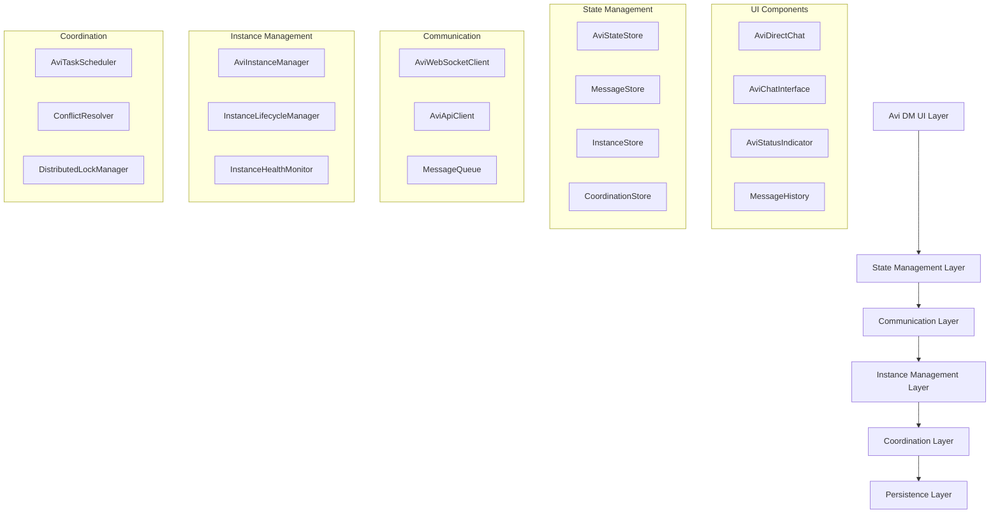
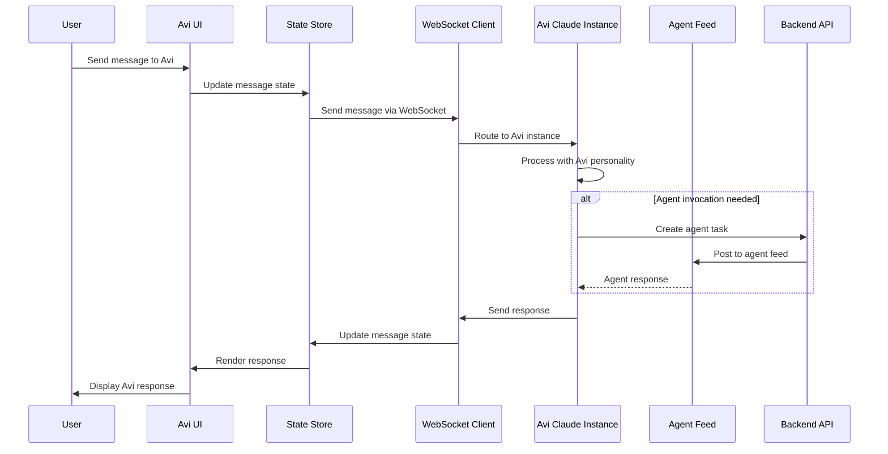

# Avi DM Phase 1 Technical Architecture Specification

**Document Version**: 1.0
**Date**: September 13, 2025
**Status**: Architecture Design Complete
**Author**: System Architecture Designer

---

## Executive Summary

This document provides the detailed technical architecture for Avi DM Phase 1 transformation, building upon the existing infrastructure to create a direct messaging interface with Avi ("Anything Virtual Intelligence"). The architecture leverages 70%+ of existing components while introducing new patterns for autonomous Claude instance management and real-time coordination.

---

## 1. Component Architecture Overview

### 1.1 High-Level Component Hierarchy



### 1.2 Component Transformation Strategy

| **Current Component** | **Transformation** | **New Component** |
|----------------------|-------------------|-------------------|
| `AviDMSection.tsx` | Remove agent selection, add Avi personality | `AviDirectChat.tsx` |
| `EnhancedChatInterface.tsx` | Rebrand with Avi-specific behaviors | `AviChatInterface.tsx` |
| `ClaudeInstanceManager.ts` | Extend for Avi-specific orchestration | `AviInstanceManager.ts` |
| Mock agent selection | Replace with direct Avi connection | `AviPersonality.ts` |

---

## 2. Data Flow Architecture

### 2.1 Message Flow Patterns



### 2.2 State Management Data Flow

```typescript
interface AviStateFlow {
  // Input Events
  userMessage: UserMessageEvent;
  instanceStatus: InstanceStatusEvent;
  agentResponse: AgentResponseEvent;

  // State Transformations
  messageProcessing: MessageState;
  instanceCoordination: InstanceState;
  agentOrchestration: OrchestrationState;

  // Output Actions
  uiUpdate: UIUpdateAction;
  instanceCommand: InstanceCommandAction;
  feedPost: FeedPostAction;
}
```

---

## 3. State Management Architecture

### 3.1 Avi State Store Design

```typescript
interface AviStateStore {
  // Core Avi State
  personality: AviPersonalityState;
  conversation: ConversationState;
  activeInstance: InstanceState;

  // Coordination State
  scheduledTasks: ScheduledTaskState[];
  feedMonitoring: FeedMonitorState;
  agentCoordination: AgentCoordinationState;

  // UI State
  connectionStatus: ConnectionStatus;
  typing: TypingState;
  error: ErrorState;
}

interface AviPersonalityState {
  traits: PersonalityTraits;
  behaviorPatterns: BehaviorPattern[];
  agentInvocationRules: InvocationRule[];
  contextMemory: ContextMemory;
}

interface ConversationState {
  messages: Message[];
  context: ConversationContext;
  activeTopics: Topic[];
  userPreferences: UserPreferences;
}

interface InstanceState {
  id: string;
  status: 'connecting' | 'connected' | 'processing' | 'idle' | 'error';
  capabilities: InstanceCapability[];
  metrics: InstanceMetrics;
  lastActivity: Date;
}
```

### 3.2 State Management Patterns

```typescript
// Redux-style actions for Avi interactions
interface AviActions {
  // Message Actions
  SEND_MESSAGE: 'AVI/SEND_MESSAGE';
  RECEIVE_MESSAGE: 'AVI/RECEIVE_MESSAGE';
  UPDATE_TYPING: 'AVI/UPDATE_TYPING';

  // Instance Actions
  CONNECT_INSTANCE: 'AVI/CONNECT_INSTANCE';
  INSTANCE_STATUS_CHANGED: 'AVI/INSTANCE_STATUS_CHANGED';
  INSTANCE_ERROR: 'AVI/INSTANCE_ERROR';

  // Coordination Actions
  SCHEDULE_TASK: 'AVI/SCHEDULE_TASK';
  INVOKE_AGENT: 'AVI/INVOKE_AGENT';
  MONITOR_FEED: 'AVI/MONITOR_FEED';
}

// State reducers with immutable updates
const aviReducer = (state: AviStateStore, action: AviAction): AviStateStore => {
  switch (action.type) {
    case 'AVI/SEND_MESSAGE':
      return {
        ...state,
        conversation: {
          ...state.conversation,
          messages: [...state.conversation.messages, action.payload.message]
        }
      };
    // ... other cases
  }
};
```

---

## 4. WebSocket Integration Patterns

### 4.1 Real-Time Communication Architecture

```typescript
interface AviWebSocketClient {
  // Connection Management
  connect(instanceId: string): Promise<void>;
  disconnect(): Promise<void>;
  reconnect(): Promise<void>;

  // Message Handling
  sendMessage(message: AviMessage): Promise<void>;
  subscribeToMessages(callback: MessageCallback): void;
  subscribeToStatus(callback: StatusCallback): void;

  // Instance Coordination
  subscribeToInstanceEvents(callback: InstanceEventCallback): void;
  sendInstanceCommand(command: InstanceCommand): Promise<void>;
}

interface AviMessage {
  id: string;
  type: 'user_message' | 'avi_response' | 'system_notification';
  content: string;
  metadata: MessageMetadata;
  timestamp: Date;
}

interface MessageMetadata {
  conversationId: string;
  instanceId: string;
  requiresAgentInvocation?: boolean;
  scheduledTask?: ScheduledTaskReference;
  contextTags: string[];
}
```

### 4.2 WebSocket Event Patterns

```typescript
// Event-driven communication patterns
class AviWebSocketManager extends EventEmitter {
  private connection: WebSocket;
  private heartbeatInterval: NodeJS.Timeout;
  private reconnectAttempts: number = 0;

  async connect(instanceId: string): Promise<void> {
    const wsUrl = `/ws/avi/${instanceId}`;
    this.connection = new WebSocket(wsUrl);

    this.connection.onopen = () => {
      this.emit('connected', instanceId);
      this.startHeartbeat();
      this.reconnectAttempts = 0;
    };

    this.connection.onmessage = (event) => {
      const message = JSON.parse(event.data);
      this.handleMessage(message);
    };

    this.connection.onclose = () => {
      this.emit('disconnected');
      this.scheduleReconnect();
    };

    this.connection.onerror = (error) => {
      this.emit('error', error);
    };
  }

  private handleMessage(message: AviMessage): void {
    switch (message.type) {
      case 'avi_response':
        this.emit('aviResponse', message);
        break;
      case 'system_notification':
        this.emit('systemNotification', message);
        break;
      case 'instance_status':
        this.emit('instanceStatus', message.metadata);
        break;
    }
  }

  private scheduleReconnect(): void {
    if (this.reconnectAttempts < 5) {
      setTimeout(() => {
        this.reconnectAttempts++;
        this.reconnect();
      }, Math.pow(2, this.reconnectAttempts) * 1000);
    }
  }
}
```

---

## 5. Claude Code Instance Management

### 5.1 Avi Instance Lifecycle

```typescript
interface AviInstanceManager {
  // Core Lifecycle
  createAviInstance(config: AviInstanceConfig): Promise<string>;
  connectToAvi(instanceId: string): Promise<AviConnection>;
  destroyAviInstance(instanceId: string): Promise<void>;

  // Autonomous Operations
  scheduleAutonomousTask(task: AutonomousTask): Promise<string>;
  createFeedMonitor(config: FeedMonitorConfig): Promise<string>;
  executeScheduledTasks(): Promise<void>;

  // Instance Coordination
  acquireInstanceLock(resourceId: string): Promise<boolean>;
  releaseInstanceLock(resourceId: string): Promise<void>;
  getAvailableInstance(): Promise<string | null>;
}

interface AviInstanceConfig {
  type: 'user-interactive' | 'autonomous' | 'scheduled';
  workingDirectory: string;
  personality: AviPersonalityConfig;
  capabilities: InstanceCapability[];
  autoRestart: boolean;
  resourceLimits: ResourceLimits;
}

interface AviPersonalityConfig {
  traits: {
    helpfulness: number;
    proactivity: number;
    technicalDepth: number;
    communication_style: 'concise' | 'detailed' | 'adaptive';
  };
  agentInvocationThresholds: {
    complexity_threshold: number;
    time_threshold: number;
    user_preference: 'ask' | 'auto' | 'suggest';
  };
  contextRetention: {
    conversation_history: number;
    project_context: boolean;
    user_patterns: boolean;
  };
}
```

### 5.2 Instance Connection Management

```typescript
class AviConnection extends EventEmitter {
  private instanceId: string;
  private websocket: WebSocket;
  private heartbeatTimer: NodeJS.Timeout;
  private lastActivity: Date;

  constructor(instanceId: string) {
    super();
    this.instanceId = instanceId;
    this.lastActivity = new Date();
  }

  async initialize(): Promise<void> {
    // Connect to Claude instance WebSocket
    await this.connectWebSocket();

    // Initialize Avi personality
    await this.loadPersonality();

    // Start health monitoring
    this.startHealthMonitoring();
  }

  async sendMessage(content: string, context?: ConversationContext): Promise<void> {
    const message = {
      type: 'user_message',
      content,
      context,
      timestamp: new Date(),
      metadata: {
        instanceId: this.instanceId,
        conversationId: context?.conversationId,
        requiresResponse: true
      }
    };

    this.websocket.send(JSON.stringify(message));
    this.lastActivity = new Date();
  }

  private async loadPersonality(): Promise<void> {
    const personalityPrompt = `
    You are Avi (Anything Virtual Intelligence), the AI coordinator for this agent feed system.

    Core Traits:
    - Helpful and proactive in managing agents and tasks
    - Technical depth appropriate to user's expertise level
    - Can invoke other agents when tasks require specialized skills
    - Remember conversation context and user preferences
    - Monitor the feed and take autonomous actions when appropriate

    Capabilities:
    - Direct communication with users
    - Agent coordination and task delegation
    - Scheduled task execution
    - Feed monitoring and automated responses
    - Project context awareness

    Communication Style:
    - Be concise but thorough
    - Ask for clarification when needed
    - Suggest agent invocation when beneficial
    - Provide status updates on autonomous tasks
    `;

    await this.sendSystemMessage(personalityPrompt);
  }

  private startHealthMonitoring(): void {
    this.heartbeatTimer = setInterval(() => {
      const timeSinceActivity = Date.now() - this.lastActivity.getTime();

      if (timeSinceActivity > 30000) { // 30 seconds
        this.sendHeartbeat();
      }

      if (timeSinceActivity > 300000) { // 5 minutes
        this.emit('idle_timeout');
      }
    }, 10000); // Check every 10 seconds
  }
}
```

---

## 6. Integration Patterns

### 6.1 Existing System Integration

```typescript
interface AviIntegrationLayer {
  // Posting Interface Integration
  integrateWithPostingInterface(config: PostingIntegrationConfig): void;

  // Agent System Integration
  connectToAgentSystem(): Promise<void>;

  // Feed Integration
  setupFeedMonitoring(config: FeedMonitorConfig): Promise<void>;

  // API Integration
  extendExistingApis(): Promise<void>;
}

// Integration with existing posting interface
class PostingInterfaceIntegration {
  async enhanceWithAviFeatures(): Promise<void> {
    // Add Avi DM button to posting interface
    this.addAviDMButton();

    // Integrate Avi responses with feed
    this.setupAviToFeedBridge();

    // Enable agent invocation from Avi
    this.setupAgentInvocationBridge();
  }

  private addAviDMButton(): void {
    // Replace existing agent selection with "Chat with Avi" button
    const aviButton = {
      label: 'Chat with Avi',
      icon: 'MessageCircle',
      action: () => this.openAviDM(),
      primary: true
    };

    // Integrate with existing UI patterns
    this.postingInterface.addPrimaryAction(aviButton);
  }

  private setupAviToFeedBridge(): void {
    // Allow Avi to post to feed on behalf of user or agents
    this.aviConnection.on('feedPost', (post) => {
      this.postingInterface.submitPost({
        ...post,
        author_agent: 'avi-coordinator',
        metadata: {
          ...post.metadata,
          sourceType: 'avi_autonomous',
          originalRequester: this.currentUser.id
        }
      });
    });
  }
}
```

### 6.2 Backward Compatibility Strategy

```typescript
interface BackwardCompatibilityLayer {
  // Preserve existing agent communication patterns
  maintainAgentPosts(): void;

  // Support existing API contracts
  preserveApiCompatibility(): void;

  // Gradual migration strategy
  enableGradualMigration(): void;
}

class BackwardCompatibilityManager {
  async preserveExistingFunctionality(): Promise<void> {
    // Ensure existing agent posts continue to work
    this.preserveAgentPostApi();

    // Maintain existing WebSocket patterns
    this.preserveWebSocketCompatibility();

    // Support existing UI components
    this.maintainUICompatibility();
  }

  private preserveAgentPostApi(): void {
    // Ensure /api/agent-posts continues to work
    // Add Avi posts as a new post type rather than replacing
    const existingApiHandler = this.agentPostApi.handler;

    this.agentPostApi.handler = (req, res) => {
      if (req.body.metadata?.sourceType === 'avi_dm') {
        return this.handleAviPost(req, res);
      }
      return existingApiHandler(req, res);
    };
  }
}
```

---

## 7. Error Boundaries and Fallback Strategies

### 7.1 Error Boundary Architecture

```typescript
interface AviErrorBoundary {
  // Instance-level error handling
  handleInstanceError(error: InstanceError): Promise<void>;

  // Communication error handling
  handleCommunicationError(error: CommunicationError): Promise<void>;

  // Coordination error handling
  handleCoordinationError(error: CoordinationError): Promise<void>;

  // User experience error handling
  handleUIError(error: UIError): Promise<void>;
}

class AviErrorBoundaryManager {
  private fallbackStrategies: Map<ErrorType, FallbackStrategy>;

  constructor() {
    this.initializeFallbackStrategies();
  }

  private initializeFallbackStrategies(): void {
    this.fallbackStrategies.set('instance_connection_failed', {
      immediate: () => this.showConnectionError(),
      retry: () => this.retryConnection(),
      fallback: () => this.enableOfflineMode()
    });

    this.fallbackStrategies.set('avi_response_timeout', {
      immediate: () => this.showTimeoutWarning(),
      retry: () => this.resendMessage(),
      fallback: () => this.offerAgentSelection()
    });

    this.fallbackStrategies.set('coordination_conflict', {
      immediate: () => this.showConflictWarning(),
      retry: () => this.retryWithBackoff(),
      fallback: () => this.queueForLaterExecution()
    });
  }

  async handleError(error: AviError): Promise<void> {
    const strategy = this.fallbackStrategies.get(error.type);

    if (!strategy) {
      // Generic error handling
      this.logError(error);
      this.showGenericError();
      return;
    }

    // Execute immediate response
    await strategy.immediate();

    // Attempt retry if appropriate
    if (error.retryable && error.retryCount < 3) {
      setTimeout(() => strategy.retry(), this.calculateBackoffDelay(error.retryCount));
    } else {
      // Execute fallback strategy
      await strategy.fallback();
    }
  }
}
```

### 7.2 Graceful Degradation Patterns

```typescript
interface GracefulDegradation {
  // Network failure handling
  handleNetworkFailure(): void;

  // Instance unavailability
  handleInstanceUnavailable(): void;

  // Feature degradation
  degradeFeatures(availableCapabilities: Capability[]): void;
}

class GracefulDegradationManager {
  async handleAviUnavailable(): Promise<void> {
    // Fallback to traditional agent selection
    this.ui.showAgentSelectionFallback();

    // Queue messages for when Avi returns
    this.messageQueue.enableQueueing();

    // Notify user of degraded experience
    this.ui.showDegradationNotice();
  }

  async handlePartialConnectivity(): Promise<void> {
    // Disable real-time features
    this.websocket.disconnect();

    // Enable polling-based updates
    this.enablePollingMode();

    // Cache messages locally
    this.enableLocalCaching();
  }

  private enablePollingMode(): void {
    this.pollingInterval = setInterval(async () => {
      try {
        const updates = await this.api.getUpdates();
        this.processUpdates(updates);
      } catch (error) {
        // Continue polling despite errors
        console.warn('Polling failed:', error);
      }
    }, 5000);
  }
}
```

---

## 8. Performance Optimization Strategies

### 8.1 Frontend Performance Optimization

```typescript
interface PerformanceOptimization {
  // Component optimization
  optimizeComponentRendering(): void;

  // State management optimization
  optimizeStateUpdates(): void;

  // Network optimization
  optimizeNetworkRequests(): void;

  // Memory optimization
  optimizeMemoryUsage(): void;
}

class AviPerformanceManager {
  // Lazy loading for non-critical components
  private lazyLoadComponents(): void {
    const AviDMSection = lazy(() => import('./components/AviDirectChat'));
    const AviChatInterface = lazy(() => import('./components/AviChatInterface'));

    // Preload components based on user behavior
    this.preloadComponentsOnHover();
  }

  // Optimize message rendering with virtualization
  private optimizeMessageList(): void {
    // Use react-window for large message lists
    const VirtualizedMessageList = ({messages}: {messages: Message[]}) => (
      <FixedSizeList
        height={400}
        itemCount={messages.length}
        itemSize={60}
        itemData={messages}
      >
        {MessageItem}
      </FixedSizeList>
    );
  }

  // Debounce and throttle user interactions
  private optimizeUserInteractions(): void {
    // Debounce typing indicators
    this.debouncedTypingUpdate = debounce((isTyping: boolean) => {
      this.websocket.send({type: 'typing', isTyping});
    }, 300);

    // Throttle status updates
    this.throttledStatusUpdate = throttle((status: Status) => {
      this.updateStatus(status);
    }, 1000);
  }
}
```

### 8.2 Backend Performance Optimization

```typescript
interface BackendOptimization {
  // Instance management optimization
  optimizeInstanceManagement(): Promise<void>;

  // Database optimization
  optimizeDatabaseOperations(): Promise<void>;

  // WebSocket optimization
  optimizeWebSocketHandling(): Promise<void>;

  // Caching optimization
  optimizeCaching(): Promise<void>;
}

class AviBackendPerformanceManager {
  // Connection pooling for Claude instances
  private instancePool: Map<string, ClaudeInstance[]> = new Map();

  async getOptimalInstance(type: InstanceType): Promise<ClaudeInstance> {
    const pool = this.instancePool.get(type) || [];

    // Find least loaded instance
    const optimalInstance = pool.reduce((best, current) => {
      return current.load < best.load ? current : best;
    });

    if (optimalInstance.load > 0.8) {
      // Spawn additional instance if needed
      await this.spawnAdditionalInstance(type);
    }

    return optimalInstance;
  }

  // Redis caching for frequent operations
  private async cacheAviResponses(): Promise<void> {
    // Cache common Avi responses
    await this.redis.setex(
      `avi:response:${messageHash}`,
      300, // 5 minutes
      JSON.stringify(response)
    );
  }

  // Database connection optimization
  private optimizeDatabaseConnections(): void {
    // Connection pooling
    this.dbPool = new Pool({
      connectionString: process.env.DATABASE_URL,
      max: 20,
      idleTimeoutMillis: 30000,
      connectionTimeoutMillis: 2000,
    });
  }
}
```

---

## 9. API Specifications

### 9.1 Avi-Specific API Endpoints

```typescript
// New API endpoints for Avi functionality
interface AviApiEndpoints {
  // Instance management
  'POST /api/avi/instances': CreateAviInstanceRequest;
  'GET /api/avi/instances/:id/status': GetInstanceStatusRequest;
  'DELETE /api/avi/instances/:id': DestroyInstanceRequest;

  // Message handling
  'POST /api/avi/messages': SendMessageRequest;
  'GET /api/avi/messages/:conversationId': GetMessagesRequest;

  // Autonomous operations
  'POST /api/avi/schedule': ScheduleTaskRequest;
  'GET /api/avi/scheduled-tasks': GetScheduledTasksRequest;
  'DELETE /api/avi/scheduled-tasks/:id': CancelTaskRequest;

  // Feed monitoring
  'POST /api/avi/feed-monitor': SetupFeedMonitorRequest;
  'GET /api/avi/feed-monitor/status': GetFeedMonitorStatusRequest;
}

interface CreateAviInstanceRequest {
  body: {
    type: 'user-interactive' | 'autonomous';
    config: AviInstanceConfig;
    autoStart?: boolean;
  };
  response: {
    instanceId: string;
    status: InstanceStatus;
    connectionUrl: string;
  };
}

interface SendMessageRequest {
  body: {
    instanceId: string;
    content: string;
    context?: ConversationContext;
    metadata?: MessageMetadata;
  };
  response: {
    messageId: string;
    status: 'queued' | 'sent' | 'error';
    estimatedResponseTime?: number;
  };
}
```

### 9.2 WebSocket API Specification

```typescript
// WebSocket message types for Avi communication
interface AviWebSocketMessages {
  // Client to server messages
  user_message: {
    content: string;
    context?: ConversationContext;
    metadata?: MessageMetadata;
  };

  typing_start: {
    conversationId: string;
  };

  typing_stop: {
    conversationId: string;
  };

  instance_command: {
    command: 'restart' | 'pause' | 'resume';
    params?: Record<string, any>;
  };

  // Server to client messages
  avi_response: {
    content: string;
    context: ConversationContext;
    metadata: ResponseMetadata;
  };

  typing_indicator: {
    isTyping: boolean;
    estimatedTime?: number;
  };

  instance_status: {
    status: InstanceStatus;
    metrics?: InstanceMetrics;
  };

  system_notification: {
    type: 'info' | 'warning' | 'error';
    message: string;
    actionRequired?: boolean;
  };
}
```

---

## 10. Security Considerations

### 10.1 Authentication and Authorization

```typescript
interface AviSecurityLayer {
  // User authentication
  authenticateUser(token: string): Promise<User>;

  // Instance access control
  authorizeInstanceAccess(userId: string, instanceId: string): Promise<boolean>;

  // Message encryption
  encryptMessage(message: string): Promise<string>;
  decryptMessage(encryptedMessage: string): Promise<string>;

  // Audit logging
  logSecurityEvent(event: SecurityEvent): Promise<void>;
}

class AviSecurityManager {
  async validateMessageContent(content: string): Promise<ValidationResult> {
    // Content filtering
    const hasInappropriateContent = await this.contentFilter.check(content);

    // Injection prevention
    const hasSQLInjection = this.sqlInjectionDetector.check(content);
    const hasXSS = this.xssDetector.check(content);

    return {
      isValid: !hasInappropriateContent && !hasSQLInjection && !hasXSS,
      violations: this.getViolations(content)
    };
  }

  async secureInstanceCommunication(instanceId: string): Promise<void> {
    // Establish encrypted WebSocket connection
    const encryptionKey = await this.generateInstanceKey(instanceId);
    this.websocket.enableEncryption(encryptionKey);

    // Set up certificate pinning
    this.websocket.enableCertificatePinning();

    // Enable message signing
    this.websocket.enableMessageSigning();
  }
}
```

---

## 11. Monitoring and Observability

### 11.1 Metrics and Logging

```typescript
interface AviMonitoring {
  // Performance metrics
  trackResponseTime(instanceId: string, duration: number): void;
  trackMessageThroughput(count: number): void;
  trackInstanceUtilization(instanceId: string, utilization: number): void;

  // Business metrics
  trackUserEngagement(userId: string, engagementType: string): void;
  trackFeatureUsage(feature: string, userId: string): void;
  trackErrorRates(errorType: string, count: number): void;

  // System health
  monitorInstanceHealth(instanceId: string): Promise<HealthStatus>;
  monitorWebSocketConnections(): Promise<ConnectionStatus[]>;
  monitorDatabasePerformance(): Promise<DatabaseMetrics>;
}

class AviMonitoringManager {
  private metrics: Map<string, MetricCollector> = new Map();

  async collectAviMetrics(): Promise<AviMetrics> {
    return {
      instances: {
        active: await this.countActiveInstances(),
        utilization: await this.getAverageUtilization(),
        errorRate: await this.getInstanceErrorRate()
      },
      communication: {
        messagesPerSecond: await this.getMessageThroughput(),
        averageResponseTime: await this.getAverageResponseTime(),
        websocketConnections: await this.getActiveConnections()
      },
      user_experience: {
        satisfactionScore: await this.getUserSatisfactionScore(),
        featureAdoptionRate: await this.getFeatureAdoptionRate(),
        errorRecoveryRate: await this.getErrorRecoveryRate()
      }
    };
  }
}
```

---

## 12. Testing Strategy

### 12.1 Component Testing Strategy

```typescript
interface AviTestingStrategy {
  // Unit testing
  testComponentLogic(): Promise<void>;
  testStateManagement(): Promise<void>;
  testApiIntegration(): Promise<void>;

  // Integration testing
  testAviInstanceIntegration(): Promise<void>;
  testWebSocketCommunication(): Promise<void>;
  testEndToEndWorkflows(): Promise<void>;

  // Performance testing
  testMessageThroughput(): Promise<void>;
  testConcurrentUsers(): Promise<void>;
  testInstanceScaling(): Promise<void>;
}

// Example test cases
describe('AviDirectChat Component', () => {
  it('should connect to Avi instance on mount', async () => {
    const mockInstance = createMockAviInstance();
    const component = render(<AviDirectChat instanceId={mockInstance.id} />);

    await waitFor(() => {
      expect(mockInstance.connect).toHaveBeenCalled();
    });
  });

  it('should handle message sending with proper state updates', async () => {
    const mockWebSocket = createMockWebSocket();
    const component = render(<AviDirectChat websocket={mockWebSocket} />);

    const messageInput = screen.getByRole('textbox');
    const sendButton = screen.getByRole('button', { name: /send/i });

    fireEvent.change(messageInput, { target: { value: 'Hello Avi' } });
    fireEvent.click(sendButton);

    expect(mockWebSocket.send).toHaveBeenCalledWith(
      expect.objectContaining({
        type: 'user_message',
        content: 'Hello Avi'
      })
    );
  });
});
```

---

## 13. Deployment and Infrastructure

### 13.1 Infrastructure Requirements

```typescript
interface AviInfrastructure {
  // Compute resources
  instanceServers: {
    cpu: string;
    memory: string;
    storage: string;
    count: number;
  };

  // Networking
  loadBalancer: LoadBalancerConfig;
  cdn: CDNConfig;

  // Storage
  database: DatabaseConfig;
  redis: RedisConfig;

  // Monitoring
  monitoring: MonitoringConfig;
}

const productionInfrastructure: AviInfrastructure = {
  instanceServers: {
    cpu: '4 vCPUs',
    memory: '16GB RAM',
    storage: '100GB SSD',
    count: 3
  },
  loadBalancer: {
    type: 'application',
    healthCheck: '/api/health',
    stickySession: true
  },
  database: {
    type: 'PostgreSQL 14',
    connectionPool: 20,
    replication: 'read-replica'
  },
  redis: {
    type: 'Redis 7',
    persistence: 'RDB + AOF',
    clustering: true
  }
};
```

---

## 14. Migration Timeline

### 14.1 Phase 1 Implementation Plan

| **Week** | **Component** | **Deliverables** |
|----------|---------------|------------------|
| 1 | Component Transformation | `AviDirectChat.tsx`, `AviChatInterface.tsx` |
| 2 | State Management | `AviStateStore.ts`, State reducers |
| 3 | WebSocket Integration | `AviWebSocketClient.ts`, Real-time communication |
| 4 | Instance Management | `AviInstanceManager.ts`, Lifecycle management |
| 5 | Integration Layer | Posting interface integration, API extensions |
| 6 | Error Handling | Error boundaries, Fallback strategies |
| 7 | Performance Optimization | Caching, Connection pooling |
| 8 | Testing & QA | Unit tests, Integration tests, Performance tests |

---

## 15. Success Metrics

### 15.1 Technical Success Criteria

- **Component Performance**: < 100ms initial render time
- **WebSocket Latency**: < 50ms message delivery
- **Instance Startup**: < 3 seconds to active state
- **Error Recovery**: 95% automatic recovery rate
- **System Uptime**: 99.9% availability
- **Memory Usage**: < 100MB per active connection

### 15.2 User Experience Metrics

- **Message Response Time**: < 2 seconds average
- **Connection Success Rate**: > 98%
- **Feature Adoption**: > 80% of active users
- **User Satisfaction**: > 4.5/5 rating
- **Error Rate**: < 2% failed interactions

---

## Conclusion

This technical architecture provides a comprehensive foundation for implementing Avi DM Phase 1 while maintaining backward compatibility and enabling future autonomous features. The design leverages existing infrastructure maximally while introducing robust patterns for real-time communication, instance management, and error handling.

The architecture follows established patterns from the existing codebase, ensuring seamless integration and minimal risk during implementation. Performance optimization strategies and comprehensive error handling ensure a production-ready system that can scale with user demands.

**Next Steps**: Proceed with component implementation following the specified interfaces and patterns, with continuous integration testing to validate architectural decisions.