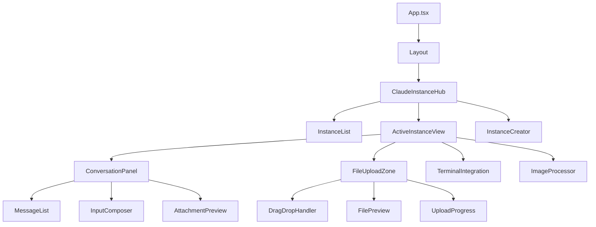
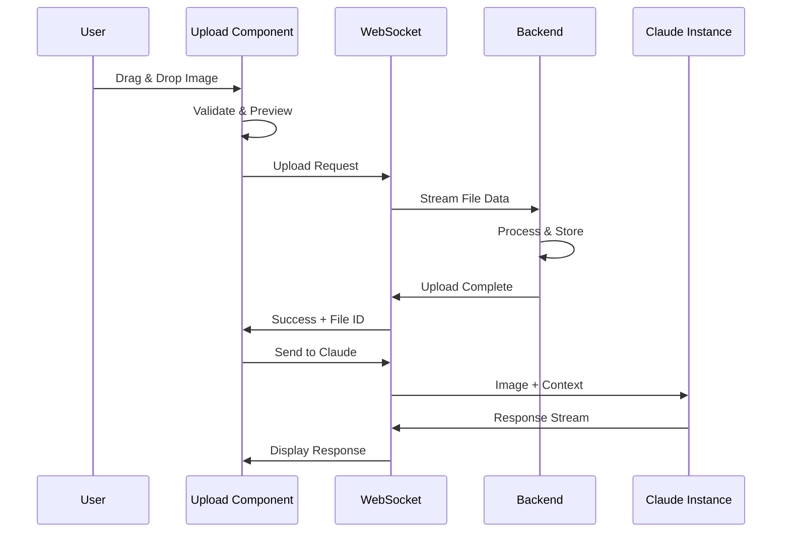
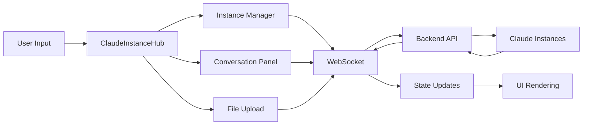

# Claude Instance Management UI Architecture

## System Overview

This document outlines the comprehensive architecture for integrating Claude Instance Management capabilities into the existing AgentLink UI system. The design maintains backward compatibility while adding enhanced real-time interaction, image processing, and multi-instance coordination.

## Current System Analysis

### Existing Frontend Structure
```
frontend/src/
├── components/
│   ├── ClaudeInstanceManager.tsx    # Primary instance management
│   ├── TerminalLauncher.tsx         # Terminal integration
│   ├── RobustWebSocketProvider.tsx  # WebSocket infrastructure
│   └── connection/                  # Connection management
├── hooks/
│   ├── useWebSocket.ts             # WebSocket management
│   ├── useTerminal.ts              # Terminal integration
│   └── useInstanceManager.ts       # Instance lifecycle
├── services/
│   ├── api.ts                      # Backend API integration
│   ├── websocket.ts               # WebSocket service
│   └── terminal-websocket.ts      # Terminal-specific WS
└── types/
    └── index.ts                   # Core type definitions
```

### Current Capabilities
- ✅ Real-time WebSocket communication via RobustWebSocketProvider
- ✅ Terminal launcher with command execution
- ✅ Basic Claude instance management
- ✅ Error boundaries and fallback components
- ✅ React Query for API state management
- ✅ Responsive design with mobile optimization

## Architecture Design

### 1. Component Hierarchy



#### Core Components

**ClaudeInstanceHub** - Main orchestrator
- Manages multiple Claude instances
- Coordinates state between instances
- Handles instance lifecycle
- Integrates with existing layout

**InstanceManager** - Enhanced version of existing ClaudeInstanceManager
- Real-time instance status
- Process management
- Resource monitoring
- Health checks

**ConversationPanel** - Chat interface
- Message threading
- File attachments
- Image previews
- Response streaming

**FileUploadZone** - Drag & drop interface
- Multi-file support
- Image preprocessing
- Progress tracking
- Error handling

### 2. State Management Architecture

#### Hook-Based State Pattern
```typescript
// Primary state management hooks
interface ClaudeInstanceState {
  // Instance management
  instances: ClaudeInstance[];
  activeInstance: string | null;
  
  // Conversation state
  conversations: Map<string, Conversation>;
  messages: Map<string, Message[]>;
  
  // File handling
  uploads: Map<string, FileUpload>;
  attachments: Map<string, Attachment[]>;
  
  // Real-time status
  connectionStatus: ConnectionStatus;
  processingStatus: ProcessingStatus;
}

// Composite hooks for complex state
function useClaudeInstanceManager() {
  const instances = useInstanceLifecycle();
  const conversations = useConversationManager();
  const files = useFileManager();
  const websocket = useRobustWebSocket();
  
  return {
    // Combined state and actions
    ...instances,
    ...conversations,
    ...files,
    connectionState: websocket.connectionState
  };
}
```

#### Context Integration
```typescript
// Extend existing WebSocket context
interface EnhancedWebSocketContext extends RobustWebSocketContextValue {
  // Claude-specific methods
  sendToInstance: (instanceId: string, message: any) => void;
  subscribeToInstance: (instanceId: string) => void;
  uploadFile: (instanceId: string, file: File) => Promise<string>;
  
  // Instance coordination
  instanceStates: Map<string, InstanceState>;
  broadcastToInstances: (message: any, filter?: string[]) => void;
}
```

### 3. WebSocket Enhancement Architecture

#### Multi-Channel Communication
```typescript
interface WebSocketChannels {
  // Instance-specific channels
  'claude:instance:${instanceId}': InstanceMessage;
  'claude:conversation:${conversationId}': ConversationMessage;
  
  // File processing
  'file:upload:${uploadId}': UploadProgress;
  'file:processed:${fileId}': ProcessedFile;
  
  // System-wide
  'system:instances': InstanceListUpdate;
  'system:health': SystemHealth;
}

class EnhancedWebSocketManager extends RobustWebSocketProvider {
  // Channel subscription
  subscribeToChannel<T>(channel: keyof WebSocketChannels, handler: (data: T) => void): void;
  
  // File upload with progress
  async uploadWithProgress(file: File, onProgress: (progress: number) => void): Promise<string>;
  
  // Instance coordination
  async coordinateInstances(action: InstanceAction): Promise<void>;
}
```

#### Connection Resilience
- Automatic failover between WebSocket endpoints
- Message queuing during disconnections
- Progressive reconnection with backoff
- Health monitoring with circuit breaker pattern

### 4. Image Upload and Processing Flow



#### Processing Pipeline
1. **Client-side preprocessing**
   - Image validation (type, size)
   - Thumbnail generation
   - Metadata extraction
   - EXIF data handling

2. **Upload optimization**
   - Chunked upload for large files
   - Progress tracking
   - Resume capability
   - Compression options

3. **Backend processing**
   - File validation and scanning
   - Format conversion if needed
   - Storage with versioning
   - Claude-compatible formatting

4. **Real-time feedback**
   - Upload progress updates
   - Processing status
   - Error handling with retry
   - Success confirmation

### 5. API Integration Architecture

#### Extended API Service
```typescript
class ClaudeInstanceApiService extends ApiService {
  // Instance management
  async createInstance(config: InstanceConfig): Promise<ClaudeInstance>;
  async getInstanceStatus(id: string): Promise<InstanceStatus>;
  async terminateInstance(id: string): Promise<void>;
  
  // Conversation management
  async sendMessage(instanceId: string, message: MessagePayload): Promise<void>;
  async getConversationHistory(instanceId: string): Promise<Message[]>;
  
  // File operations
  async uploadFile(instanceId: string, file: File): Promise<FileUpload>;
  async processImage(fileId: string, options: ImageProcessingOptions): Promise<ProcessedImage>;
  
  // Health and metrics
  async getInstanceMetrics(id: string): Promise<InstanceMetrics>;
  async getSystemHealth(): Promise<SystemHealth>;
}
```

#### Backend API Endpoints
```
POST   /api/claude/instances              # Create instance
GET    /api/claude/instances              # List instances
GET    /api/claude/instances/:id          # Get instance details
DELETE /api/claude/instances/:id          # Terminate instance

POST   /api/claude/:id/messages           # Send message
GET    /api/claude/:id/messages           # Get conversation
POST   /api/claude/:id/files              # Upload file
GET    /api/claude/:id/files/:fileId      # Get file details

GET    /api/claude/:id/metrics            # Instance metrics
GET    /api/claude/:id/health             # Instance health
POST   /api/claude/:id/restart            # Restart instance
```

## Technical Specifications

### File Structure for New Components

```
frontend/src/
├── components/
│   ├── claude/                          # New Claude-specific components
│   │   ├── ClaudeInstanceHub.tsx        # Main orchestrator
│   │   ├── InstanceManager/             # Instance management
│   │   │   ├── index.tsx
│   │   │   ├── InstanceList.tsx
│   │   │   ├── InstanceCard.tsx
│   │   │   └── InstanceCreator.tsx
│   │   ├── Conversation/                # Chat interface
│   │   │   ├── index.tsx
│   │   │   ├── MessageList.tsx
│   │   │   ├── InputComposer.tsx
│   │   │   └── AttachmentPreview.tsx
│   │   ├── FileUpload/                  # File handling
│   │   │   ├── index.tsx
│   │   │   ├── DropZone.tsx
│   │   │   ├── FilePreview.tsx
│   │   │   └── UploadProgress.tsx
│   │   └── shared/                      # Shared components
│   │       ├── StatusIndicator.tsx
│   │       ├── MetricsDisplay.tsx
│   │       └── ErrorBoundary.tsx
│   └── (existing components...)
├── hooks/
│   ├── claude/                          # Claude-specific hooks
│   │   ├── useClaudeInstances.ts        # Instance management
│   │   ├── useConversation.ts           # Chat functionality
│   │   ├── useFileUpload.ts             # File operations
│   │   └── useInstanceMetrics.ts        # Performance monitoring
│   └── (existing hooks...)
├── services/
│   ├── claude/                          # Claude services
│   │   ├── api.ts                       # Claude API client
│   │   ├── websocket.ts                 # Claude WebSocket
│   │   ├── fileProcessor.ts             # File processing
│   │   └── instanceCoordinator.ts       # Multi-instance coordination
│   └── (existing services...)
└── types/
    ├── claude.ts                        # Claude-specific types
    └── (existing types...)
```

### Performance Considerations

1. **Virtual Scrolling**
   - Message lists with thousands of items
   - Efficient rendering of large conversations
   - Memory management for attachments

2. **Connection Pooling**
   - WebSocket connection reuse
   - Instance connection management
   - Resource cleanup on unmount

3. **Caching Strategy**
   - Conversation history caching
   - File metadata caching
   - Instance state persistence

4. **Error Recovery**
   - Graceful degradation on connection loss
   - Message retry mechanisms
   - State reconstruction after reconnection

### Integration with Existing System

#### Backward Compatibility Approach

1. **Component Migration**
   ```typescript
   // Gradual migration path
   const ClaudeInstanceManager = lazy(() => 
     import('./components/claude/ClaudeInstanceHub')
       .catch(() => import('./components/ClaudeInstanceManager')) // Fallback
   );
   ```

2. **State Bridge**
   ```typescript
   // Bridge existing state to new architecture
   function useLegacyStateBridge() {
     const legacyState = useLegacyInstanceState();
     const newState = useClaudeInstanceManager();
     
     // Sync state between old and new systems
     useEffect(() => {
       syncLegacyToNew(legacyState, newState);
     }, [legacyState, newState]);
   }
   ```

3. **API Compatibility**
   ```typescript
   // Extend existing API service
   class ExtendedApiService extends ApiService {
     claude = new ClaudeInstanceApiService(this.baseUrl);
   }
   ```

## Migration Strategy

### Phase 1: Foundation (Week 1)
- ✅ Enhanced WebSocket infrastructure
- ✅ Basic component structure
- ✅ Type definitions
- ✅ File upload foundation

### Phase 2: Core Features (Week 2)
- 🔄 Instance management UI
- 🔄 Conversation interface
- 🔄 File upload with progress
- 🔄 Real-time synchronization

### Phase 3: Enhancement (Week 3)
- ⏳ Image processing pipeline
- ⏳ Multi-instance coordination
- ⏳ Performance optimization
- ⏳ Error handling refinement

### Phase 4: Integration (Week 4)
- ⏳ Legacy system migration
- ⏳ Testing and validation
- ⏳ Documentation completion
- ⏳ Production deployment

## Component Interaction Diagrams

### Data Flow Architecture


### Integration Points with Existing System
1. **Router Integration**: Extend existing React Router setup
2. **State Management**: Integrate with existing React Query
3. **WebSocket**: Enhance RobustWebSocketProvider
4. **Error Boundaries**: Extend existing error handling
5. **Styling**: Integrate with existing Tailwind CSS theme

## Conclusion

This architecture provides a scalable, maintainable solution for Claude Instance Management that:

- 🏗️ **Builds on existing infrastructure** - Leverages current WebSocket, API, and component patterns
- 🔄 **Ensures backward compatibility** - Gradual migration path with fallbacks
- 📈 **Scales efficiently** - Multi-instance support with performance optimization
- 🛡️ **Handles errors gracefully** - Comprehensive error boundaries and recovery
- 🎯 **Focuses on user experience** - Real-time updates, file handling, and responsive design

The implementation follows React best practices, maintains type safety, and integrates seamlessly with the existing AgentLink ecosystem.