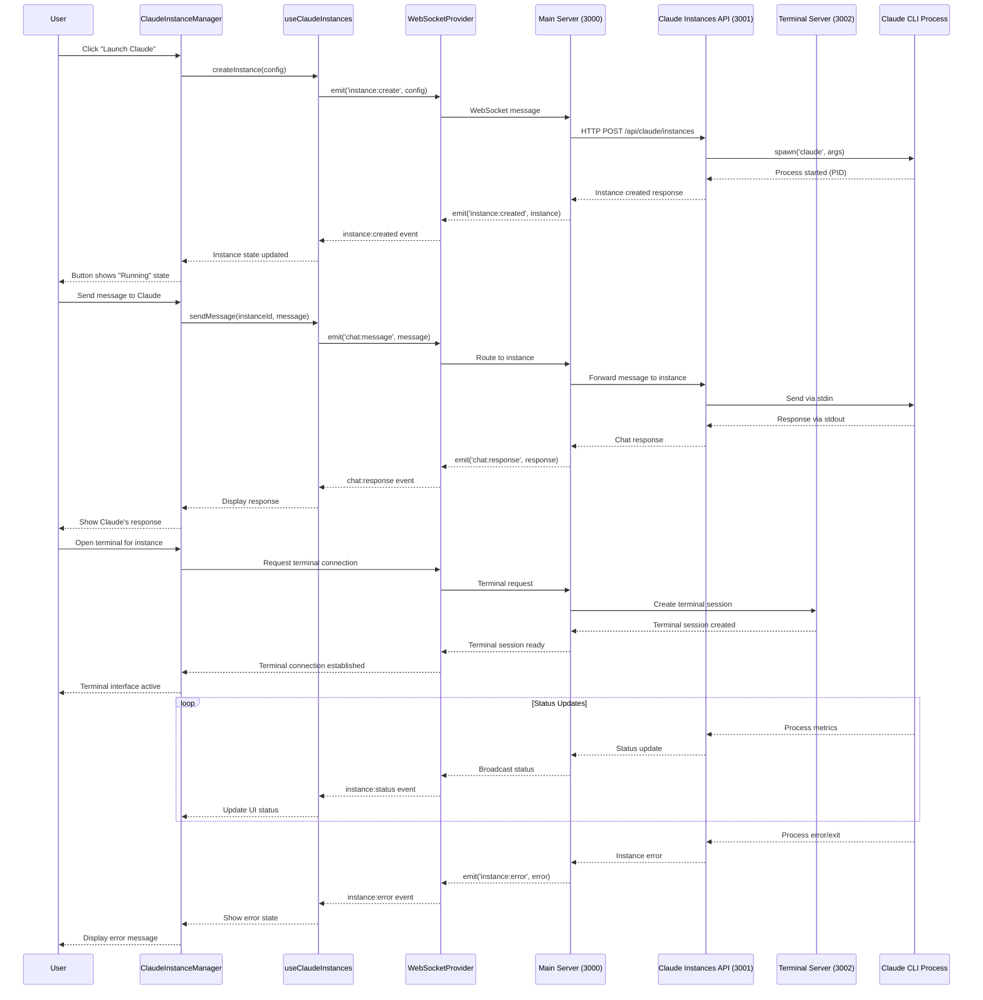
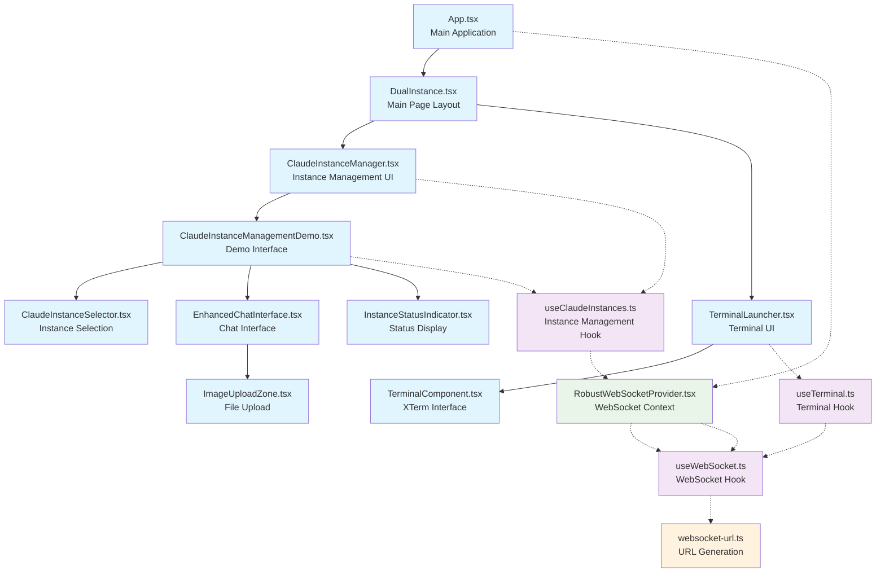
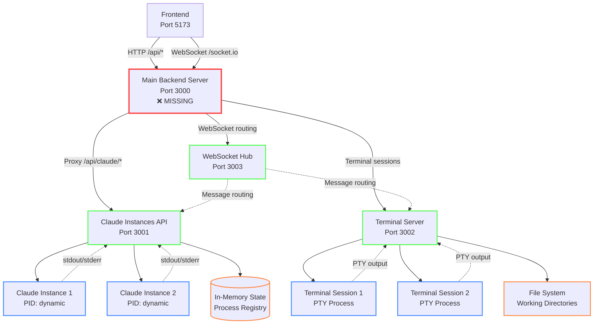
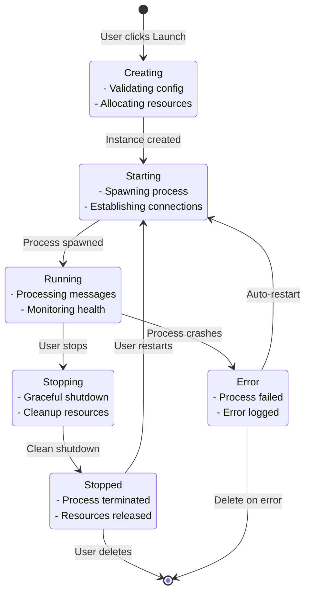

# Component Interaction Diagram
*Detailed mapping of frontend-backend component relationships*

## 🔄 System Component Flow



## 🏗 Frontend Component Architecture



## 🔌 WebSocket Event Flow

### Frontend to Backend Events
```typescript
// Instance Management Events
interface FrontendToBackendEvents {
  // Instance Lifecycle
  'instance:create': (config: ClaudeInstanceConfig) => void;
  'instance:start': (data: { instanceId: string }) => void;
  'instance:stop': (data: { instanceId: string }) => void;
  'instance:delete': (data: { instanceId: string }) => void;
  'instances:list': () => void;
  
  // Communication  
  'chat:message': (message: ChatMessage) => void;
  'instance:command': (data: { instanceId: string; command: ClaudeInstanceCommand }) => void;
  
  // Terminal
  'terminal:create': (data: { instanceId?: string }) => void;
  'terminal:input': (data: { terminalId: string; input: string }) => void;
  'terminal:resize': (data: { terminalId: string; cols: number; rows: number }) => void;
  
  // Monitoring
  'heartbeat': (data?: any) => void;
  'registerFrontend': (data: { clientType: 'web'; version: string }) => void;
}
```

### Backend to Frontend Events
```typescript
interface BackendToFrontendEvents {
  // Instance Lifecycle
  'instances:list': (instances: ClaudeInstance[]) => void;
  'instance:created': (instance: ClaudeInstance) => void;
  'instance:started': (status: ClaudeInstanceStatus) => void;
  'instance:stopped': (status: ClaudeInstanceStatus) => void;
  'instance:error': (data: { instanceId: string; error: string }) => void;
  'instance:status': (status: ClaudeInstanceStatus) => void;
  
  // Communication
  'chat:message': (message: ChatMessage) => void;
  'instance:output': (message: ClaudeInstanceMessage) => void;
  
  // Terminal  
  'terminal:created': (data: { terminalId: string; instanceId?: string }) => void;
  'terminal:output': (data: { terminalId: string; output: string }) => void;
  'terminal:error': (data: { terminalId: string; error: string }) => void;
  'terminal:closed': (data: { terminalId: string; code: number }) => void;
  
  // Monitoring
  'heartbeatAck': (data: { timestamp: string; uptime: number }) => void;
  'hubRegistered': (data: { clientId: string; type: string }) => void;
  'metrics:update': (metric: InstanceMetrics) => void;
}
```

## 🏢 Backend Service Architecture



## 🔄 Data Flow Patterns

### 1. Claude Instance Lifecycle


### 2. Message Flow Patterns
```mermaid
flowchart TD
    %% User Input
    USER[User Types Message]
    
    %% Frontend Processing
    UI[Chat Interface<br/>EnhancedChatInterface]
    VALIDATE[Input Validation<br/>& Image Processing]
    
    %% Hook Layer
    HOOK[useClaudeInstances<br/>sendMessage()]
    
    %% WebSocket Layer  
    WS_OUT[WebSocket Emit<br/>chat:message]
    
    %% Backend Processing
    MAIN_SERVER[Main Server<br/>Port 3000]
    ROUTE[Message Routing<br/>to Instance API]
    
    %% Instance Processing
    INSTANCE_API[Claude Instances API<br/>Port 3001]
    PROCESS[Claude CLI Process<br/>stdin/stdout]
    
    %% Response Path
    RESPONSE[Claude Response<br/>stdout capture]
    WS_IN[WebSocket Emit<br/>chat:response]
    HOOK_UPDATE[Hook Update<br/>Message State]
    UI_UPDATE[UI Update<br/>Display Response]
    
    %% Flow Connections
    USER --> UI
    UI --> VALIDATE
    VALIDATE --> HOOK
    HOOK --> WS_OUT
    WS_OUT --> MAIN_SERVER
    MAIN_SERVER --> ROUTE
    ROUTE --> INSTANCE_API
    INSTANCE_API --> PROCESS
    
    PROCESS --> RESPONSE
    RESPONSE --> WS_IN
    WS_IN --> HOOK_UPDATE
    HOOK_UPDATE --> UI_UPDATE
    
    %% Error Paths
    PROCESS -.->|Error| ERROR[Error Handling]
    ERROR -.-> WS_IN
    
    classDef frontend fill:#e3f2fd
    classDef backend fill:#f3e5f5
    classDef process fill:#e8f5e8
    classDef error fill:#ffebee
    
    class USER,UI,VALIDATE,HOOK,WS_OUT,HOOK_UPDATE,UI_UPDATE frontend
    class MAIN_SERVER,ROUTE,INSTANCE_API,WS_IN backend  
    class PROCESS,RESPONSE process
    class ERROR error
```

## 🚨 Critical Integration Points

### 1. Missing Main Server (Port 3000)
**Problem:** Frontend expects unified backend on port 3000
**Impact:** All API calls and WebSocket connections fail
**Solution:** Create main orchestration server

### 2. WebSocket Event Mapping  
**Problem:** Frontend emits events that no backend handles
**Impact:** Claude instance management buttons don't work
**Solution:** Implement complete event handlers in main server

### 3. Process Management Integration
**Problem:** Claude Instances API has no real process spawning
**Impact:** Instances are created but don't actually run Claude
**Solution:** Integrate actual Claude CLI process management

### 4. Terminal Integration
**Problem:** Terminal server runs independently 
**Impact:** No integration with Claude instances
**Solution:** Coordinate terminal sessions with instance lifecycle

## 📋 Implementation Checklist

### Phase 1: Core Infrastructure
- [ ] Create main backend server (Port 3000)
- [ ] Implement HTTP API routing (`/api/*`)
- [ ] Add Socket.IO server (`/socket.io`)
- [ ] Resolve port conflicts (move WebSocket hub to 3003)

### Phase 2: Claude Integration  
- [ ] Implement real Claude CLI process spawning
- [ ] Add process lifecycle management
- [ ] Create WebSocket event handlers for instance management
- [ ] Add error handling and recovery

### Phase 3: Frontend-Backend Binding
- [ ] Test all Claude instance management buttons
- [ ] Verify WebSocket event flow
- [ ] Implement real-time status updates
- [ ] Add comprehensive error states

### Phase 4: Terminal Integration
- [ ] Coordinate terminal sessions with instances
- [ ] Add instance-specific terminal access
- [ ] Implement terminal-to-instance communication
- [ ] Add terminal session persistence

## 🎯 Success Criteria

1. **Functional Buttons:** All Claude instance management buttons work
2. **Real Processes:** Actual Claude CLI processes are spawned and managed  
3. **Live Communication:** Real-time chat with Claude instances
4. **Status Updates:** Live status monitoring and updates
5. **Error Handling:** Comprehensive error states and recovery
6. **Terminal Integration:** Terminal access for each Claude instance

---

*This diagram shows the complete component interaction flow and identifies the critical missing piece: a main backend server that orchestrates all the existing microservices and provides the unified API the frontend expects.*