# Component Relationship Diagram - Claude Instance Management UI

## High-Level System Architecture

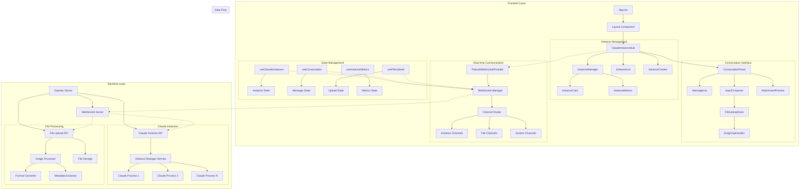

## Detailed Component Relationships

### 1. Primary Component Flow

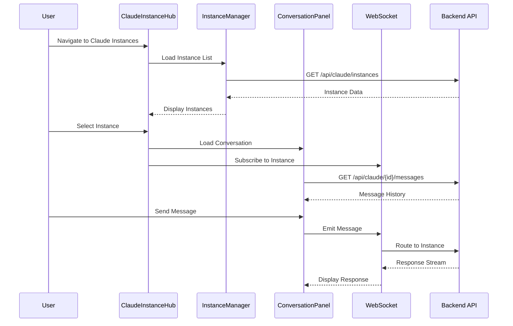

### 2. State Management Relationships

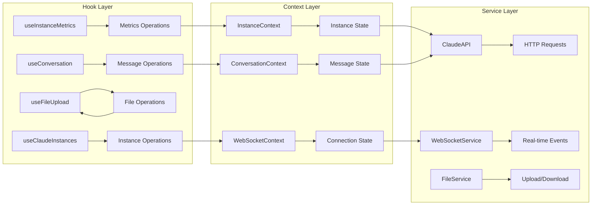

### 3. File Upload Component Relationships

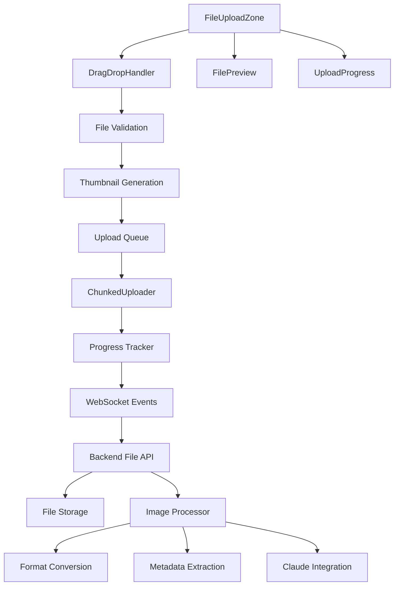

## Integration Points with Existing System

### 1. Router Integration

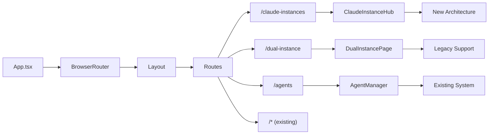

### 2. WebSocket Provider Enhancement

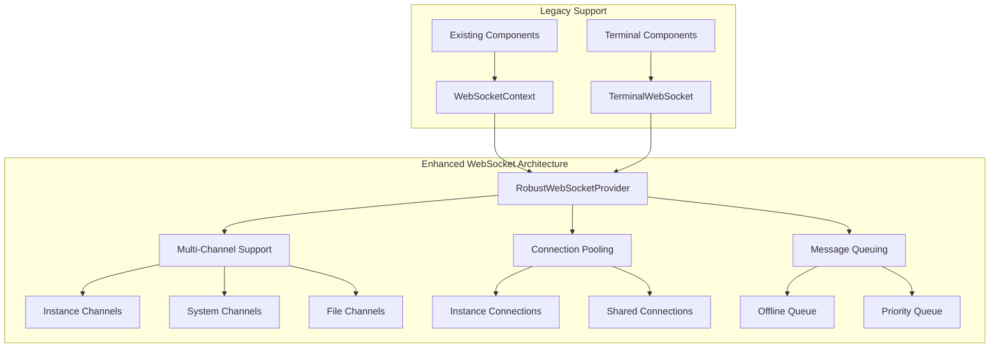

### 3. API Service Extension

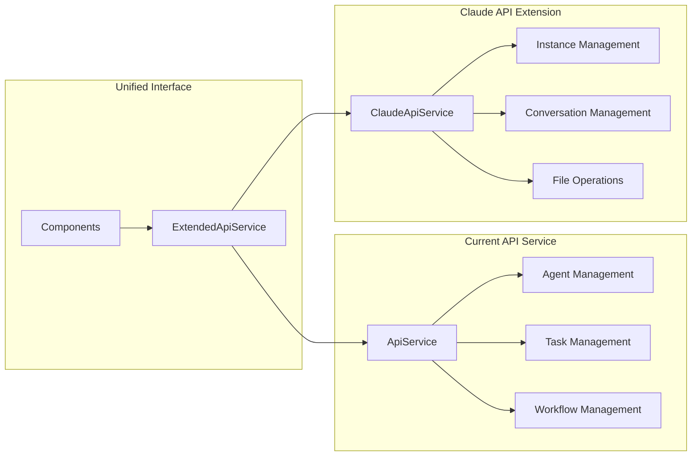

## Data Flow Architecture

### 1. Instance Lifecycle Flow

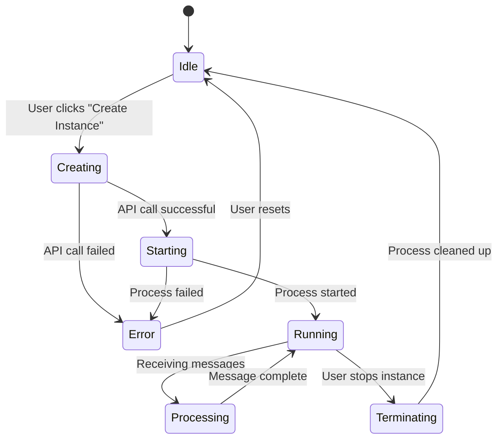

### 2. Message Processing Flow

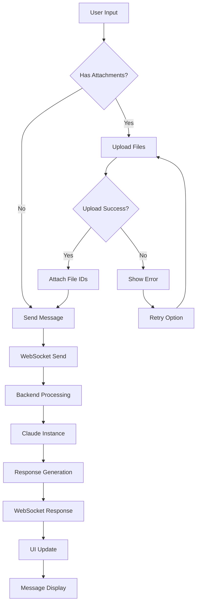

### 3. Real-time Synchronization Flow

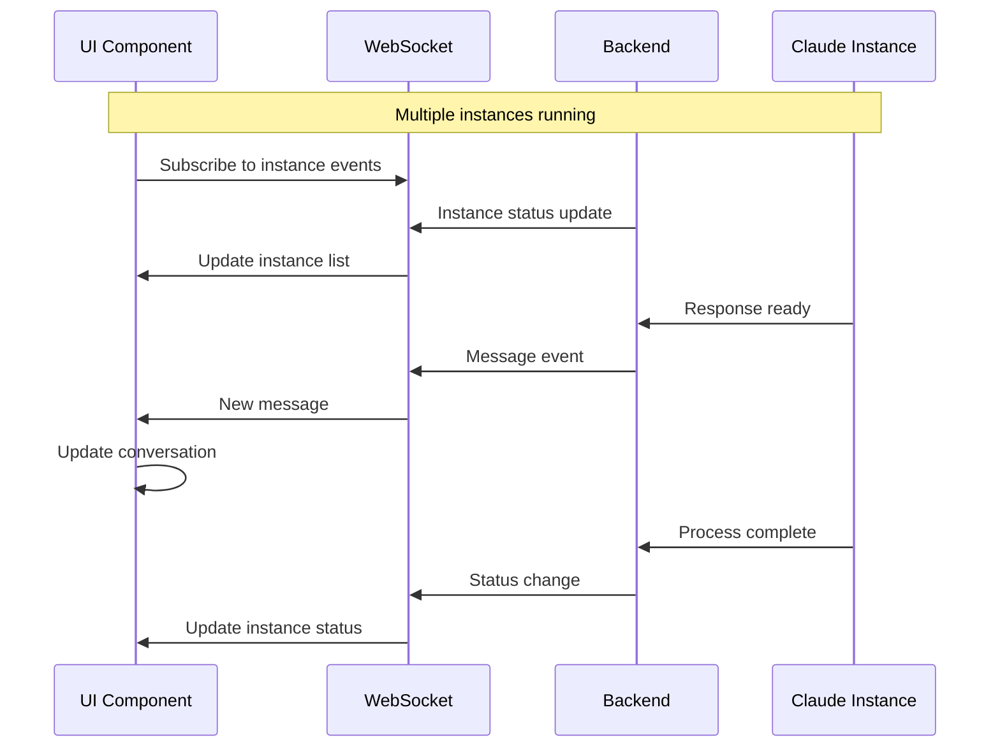

## Performance Considerations

### 1. Component Optimization

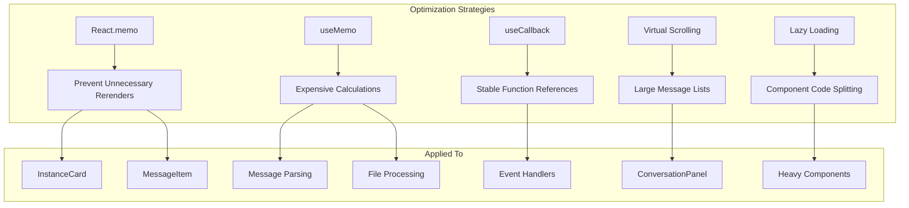

### 2. State Update Optimization

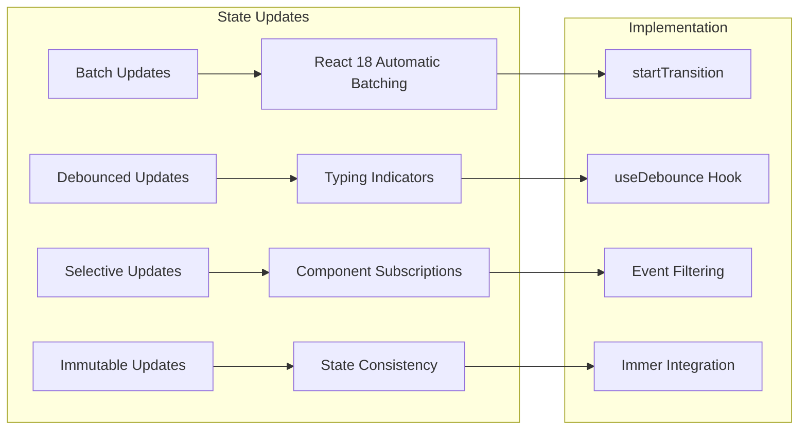

## Error Handling Relationships

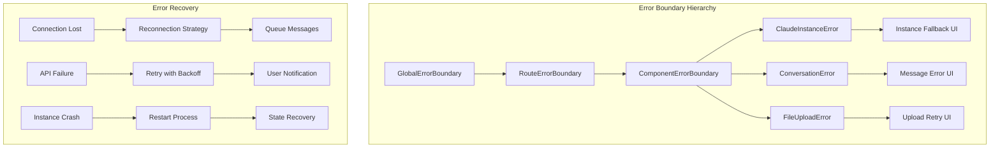

## Backward Compatibility Strategy

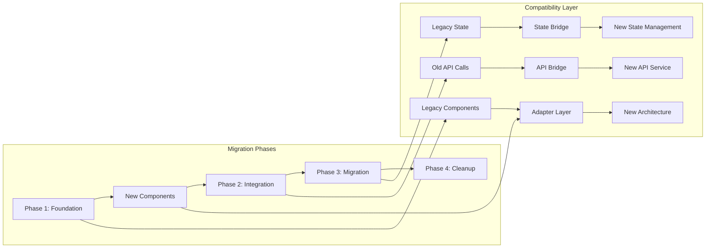

This comprehensive component relationship diagram shows how the Claude Instance Management UI integrates with the existing system while providing a clear migration path and maintaining backward compatibility. The architecture emphasizes scalability, performance, and maintainability through well-defined component relationships and data flow patterns.