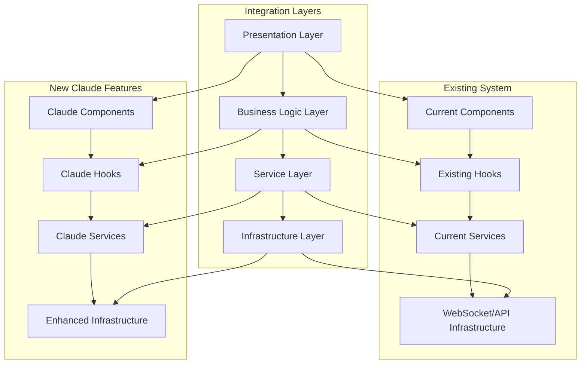

# Claude Instance Management UI - Integration Strategy

## Executive Summary

This document outlines the strategic approach for integrating Claude Instance Management capabilities into the existing AgentLink UI system. The integration maintains backward compatibility, leverages existing infrastructure, and provides a clear migration path while introducing advanced features like real-time chat, image processing, and multi-instance coordination.

## Current System Assessment

### Strengths of Existing System
✅ **Robust WebSocket Infrastructure**: RobustWebSocketProvider with error handling and reconnection  
✅ **Comprehensive Error Boundaries**: Multi-layered error handling with graceful fallbacks  
✅ **Modern React Architecture**: Hooks-based state management with React Query  
✅ **Terminal Integration**: Working terminal launcher with WebSocket communication  
✅ **Responsive Design**: Mobile-optimized layout with Tailwind CSS  
✅ **Type Safety**: Full TypeScript implementation with comprehensive type definitions  

### Integration Opportunities
🔄 **Component Reusability**: Existing error boundaries, loading states, and UI patterns  
🔄 **WebSocket Enhancement**: Extend current robust WebSocket provider  
🔄 **API Service Extension**: Build upon existing API service architecture  
🔄 **State Management**: Integrate with React Query and existing hooks  
🔄 **Routing Integration**: Seamless integration with current React Router setup  

## Integration Architecture

### 1. Layered Integration Approach



### 2. Component Integration Strategy

#### Phase 1: Foundation Enhancement
```typescript
// Extend existing WebSocket provider
interface EnhancedWebSocketConfig extends WebSocketConfig {
  // Claude-specific channels
  claudeChannels?: {
    instances: boolean;
    conversations: boolean;
    fileUploads: boolean;
  };
  
  // Multi-instance coordination
  instanceCoordination?: {
    enabled: boolean;
    maxInstances: number;
    autoReconnect: boolean;
  };
}

// Enhanced provider with backward compatibility
export const EnhancedWebSocketProvider: React.FC<{
  children: React.ReactNode;
  config: EnhancedWebSocketConfig;
}> = ({ children, config }) => {
  // Maintain existing functionality
  const legacyContext = useExistingWebSocket(config);
  
  // Add Claude-specific features
  const claudeContext = useClaudeWebSocket(config.claudeChannels);
  
  // Merged context for backward compatibility
  const mergedContext = useMemo(() => ({
    ...legacyContext,
    ...claudeContext,
    // Claude-specific methods
    subscribeToInstance: claudeContext.subscribeToInstance,
    sendToInstance: claudeContext.sendToInstance,
  }), [legacyContext, claudeContext]);
  
  return (
    <WebSocketContext.Provider value={mergedContext}>
      {children}
    </WebSocketContext.Provider>
  );
};
```

#### Phase 2: Component Composition
```typescript
// Compose new components with existing patterns
const ClaudeInstanceHub: React.FC = () => {
  // Reuse existing error boundary pattern
  return (
    <RouteErrorBoundary routeName="ClaudeInstances">
      <Suspense fallback={<FallbackComponents.LoadingFallback message="Loading Claude Instances..." />}>
        <div className="flex flex-col lg:flex-row gap-6">
          {/* Reuse existing layout patterns */}
          <div className="lg:w-1/3">
            <InstanceManager />
          </div>
          <div className="lg:w-2/3">
            <ConversationPanel />
          </div>
        </div>
      </Suspense>
    </RouteErrorBoundary>
  );
};
```

### 3. State Management Integration

#### Existing State Bridge
```typescript
// Bridge existing patterns with new Claude functionality
export function useClaudeInstanceState() {
  // Leverage existing React Query patterns
  const queryClient = useQueryClient();
  
  // Existing API service integration
  const { data: systemHealth } = useQuery({
    queryKey: ['system', 'health'],
    queryFn: () => apiService.healthCheck(),
    refetchInterval: 30000,
  });
  
  // New Claude-specific queries
  const { data: instances, isLoading } = useQuery({
    queryKey: ['claude', 'instances'],
    queryFn: () => apiService.claude.getInstances(),
    refetchInterval: 5000,
  });
  
  // WebSocket integration with existing provider
  const { socket, isConnected } = useWebSocketContext();
  
  return {
    instances,
    isLoading,
    systemHealth,
    isConnected,
    // New Claude methods
    createInstance: useMutation({
      mutationFn: apiService.claude.createInstance,
      onSuccess: () => {
        queryClient.invalidateQueries(['claude', 'instances']);
      },
    }),
  };
}
```

### 4. API Service Extension Pattern

```typescript
// Extend existing API service without breaking changes
class ExtendedApiService extends ApiService {
  // Add Claude namespace
  public readonly claude = new ClaudeInstanceApiService(this.baseUrl);
  
  // Maintain existing methods
  // All existing methods remain unchanged
  
  // Enhanced health check with Claude status
  async healthCheck(): Promise<EnhancedHealthStatus> {
    const baseHealth = await super.healthCheck();
    const claudeHealth = await this.claude.getHealth();
    
    return {
      ...baseHealth,
      claude: claudeHealth,
    };
  }
}

// Gradual migration - use existing service as base
export const apiService = new ExtendedApiService();
```

## Migration Strategy

### Phase-by-Phase Implementation

#### Phase 1: Foundation (Week 1)
**Goal**: Establish enhanced infrastructure without breaking existing functionality

**Tasks**:
- ✅ Extend WebSocket provider with Claude channels
- ✅ Create Claude-specific type definitions
- ✅ Set up base component structure
- ✅ Implement basic API service extension

**Success Criteria**:
- All existing functionality remains operational
- New Claude routes are accessible
- WebSocket enhancements are backward compatible
- Type definitions are comprehensive

**Risk Mitigation**:
- Feature flags for Claude functionality
- Fallback components for any issues
- Comprehensive testing of existing features

#### Phase 2: Core Features (Week 2)
**Goal**: Implement core Claude instance management features

**Tasks**:
- 🔄 Instance creation and management UI
- 🔄 Basic conversation interface
- 🔄 File upload with progress tracking
- 🔄 Real-time instance status updates

**Success Criteria**:
- Users can create and manage Claude instances
- Basic chat functionality works
- File uploads are processed correctly
- Real-time updates are reliable

**Integration Points**:
- Reuse existing error boundaries
- Leverage current loading states
- Integrate with existing notification system
- Use established routing patterns

#### Phase 3: Advanced Features (Week 3)
**Goal**: Add advanced functionality and optimization

**Tasks**:
- ⏳ Image processing pipeline
- ⏳ Multi-instance coordination
- ⏳ Performance optimization
- ⏳ Enhanced error handling

**Success Criteria**:
- Image uploads work with Claude instances
- Multiple instances can be coordinated
- Performance meets or exceeds current standards
- Error handling is comprehensive

#### Phase 4: Integration & Polish (Week 4)
**Goal**: Complete integration and prepare for production

**Tasks**:
- ⏳ Legacy feature migration
- ⏳ Performance testing and optimization
- ⏳ Documentation completion
- ⏳ Production deployment

**Success Criteria**:
- All features are production-ready
- Performance benchmarks are met
- Documentation is complete
- Deployment is successful

### Backward Compatibility Strategy

#### 1. Component Fallback Pattern
```typescript
// Graceful degradation with fallbacks
const ClaudeFeatureComponent = lazy(() =>
  import('./components/claude/ClaudeInstanceHub')
    .catch(() => import('./components/ClaudeInstanceManager')) // Existing fallback
);

// Feature detection
export function useClaudeSupport() {
  const [isSupported, setIsSupported] = useState(false);
  
  useEffect(() => {
    // Check if Claude features are available
    apiService.claude.getHealth()
      .then(() => setIsSupported(true))
      .catch(() => setIsSupported(false));
  }, []);
  
  return isSupported;
}
```

#### 2. API Compatibility Layer
```typescript
// Maintain existing API contracts
class CompatibilityApiService {
  constructor(private baseService: ExtendedApiService) {}
  
  // Existing methods delegate to base service
  async getAgents() {
    return this.baseService.getAgents();
  }
  
  // Enhanced methods with fallback
  async getSystemHealth() {
    try {
      return await this.baseService.healthCheck();
    } catch (error) {
      // Fallback to basic health check
      return { status: 'unknown', timestamp: new Date().toISOString() };
    }
  }
}
```

#### 3. Progressive Feature Enablement
```typescript
// Feature flags for gradual rollout
interface FeatureFlags {
  claudeInstances: boolean;
  imageUploads: boolean;
  multiInstanceCoordination: boolean;
  advancedMetrics: boolean;
}

export function useFeatureFlags(): FeatureFlags {
  return {
    claudeInstances: process.env.VITE_FEATURE_CLAUDE_INSTANCES === 'true',
    imageUploads: process.env.VITE_FEATURE_IMAGE_UPLOADS === 'true',
    multiInstanceCoordination: process.env.VITE_FEATURE_MULTI_INSTANCE === 'true',
    advancedMetrics: process.env.VITE_FEATURE_ADVANCED_METRICS === 'true',
  };
}
```

## Risk Management

### Technical Risks & Mitigation

#### 1. Performance Impact
**Risk**: New features could degrade existing performance  
**Mitigation**:
- Performance budgets for new components
- Lazy loading for Claude-specific features
- Virtual scrolling for large data sets
- Memory usage monitoring

#### 2. WebSocket Connection Stability
**Risk**: Enhanced WebSocket features could affect existing stability  
**Mitigation**:
- Gradual channel introduction
- Connection pooling with fallbacks
- Message queuing for offline scenarios
- Health monitoring with automatic recovery

#### 3. State Management Complexity
**Risk**: Additional state could cause conflicts or memory leaks  
**Mitigation**:
- Clear state boundaries between features
- Automatic cleanup on component unmount
- State persistence strategies
- Memory leak detection in development

#### 4. API Integration Issues
**Risk**: New API endpoints could interfere with existing functionality  
**Mitigation**:
- Separate API namespaces
- Versioned API endpoints
- Graceful error handling
- Rollback capabilities

### User Experience Risks & Mitigation

#### 1. UI Consistency
**Risk**: New components might not match existing design language  
**Mitigation**:
- Strict adherence to existing design system
- Component library reuse
- Design review process
- Accessibility compliance

#### 2. Learning Curve
**Risk**: New features might confuse existing users  
**Mitigation**:
- Progressive disclosure of features
- Contextual help and tooltips
- User onboarding flow
- Fallback to familiar interfaces

## Testing Strategy

### Integration Testing Approach

#### 1. Backward Compatibility Tests
```typescript
describe('Backward Compatibility', () => {
  it('should maintain existing API contracts', async () => {
    // Test that all existing API calls still work
    const agents = await apiService.getAgents();
    expect(agents).toBeDefined();
    expect(Array.isArray(agents)).toBe(true);
  });
  
  it('should preserve existing WebSocket functionality', () => {
    // Test that existing WebSocket features continue to work
    const { socket, isConnected } = renderHook(() => useWebSocket());
    expect(socket).toBeDefined();
  });
});
```

#### 2. Integration Tests
```typescript
describe('Claude Integration', () => {
  it('should handle Claude instance lifecycle', async () => {
    const { result } = renderHook(() => useClaudeInstances());
    
    // Create instance
    await act(async () => {
      await result.current.createInstance({ type: 'standard' });
    });
    
    expect(result.current.instances.length).toBeGreaterThan(0);
  });
  
  it('should coordinate WebSocket messages', async () => {
    // Test that Claude WebSocket messages integrate with existing system
  });
});
```

#### 3. End-to-End Tests
```typescript
// Playwright tests for full user journeys
test('Claude instance management workflow', async ({ page }) => {
  await page.goto('/claude-instances');
  
  // Test existing navigation still works
  await page.click('[data-testid="navigation-agents"]');
  await expect(page).toHaveURL('/agents');
  
  // Test new Claude features
  await page.goto('/claude-instances');
  await page.click('[data-testid="create-instance"]');
  await expect(page.locator('[data-testid="instance-list"]')).toContainText('Claude Instance');
});
```

## Performance Optimization Strategy

### 1. Component-Level Optimizations

#### Memoization Strategy
```typescript
// Optimize expensive operations
const ExpensiveClaudeComponent = memo(({ instanceId, messages }) => {
  const processedMessages = useMemo(
    () => messages.map(processMessage),
    [messages]
  );
  
  const handleSendMessage = useCallback(
    (message: string) => {
      sendToInstance(instanceId, message);
    },
    [instanceId]
  );
  
  return <MessageList messages={processedMessages} onSend={handleSendMessage} />;
});
```

#### Virtual Scrolling for Large Data
```typescript
// Handle large message lists efficiently
const VirtualizedMessageList = ({ messages }: { messages: Message[] }) => {
  const parentRef = useRef<HTMLDivElement>(null);
  
  const rowVirtualizer = useVirtualizer({
    count: messages.length,
    getScrollElement: () => parentRef.current,
    estimateSize: () => 100,
    overscan: 10,
  });
  
  return (
    <div ref={parentRef} className="h-96 overflow-auto">
      <div style={{ height: `${rowVirtualizer.getTotalSize()}px` }}>
        {rowVirtualizer.getVirtualItems().map((virtualItem) => (
          <MessageItem
            key={virtualItem.key}
            message={messages[virtualItem.index]}
            style={{
              position: 'absolute',
              top: 0,
              left: 0,
              width: '100%',
              height: `${virtualItem.size}px`,
              transform: `translateY(${virtualItem.start}px)`,
            }}
          />
        ))}
      </div>
    </div>
  );
};
```

### 2. Network Optimization

#### Request Batching
```typescript
// Batch multiple API requests
class OptimizedClaudeService {
  private requestQueue: Map<string, Promise<any>> = new Map();
  
  async batchedRequest<T>(key: string, request: () => Promise<T>): Promise<T> {
    if (this.requestQueue.has(key)) {
      return this.requestQueue.get(key) as Promise<T>;
    }
    
    const promise = request();
    this.requestQueue.set(key, promise);
    
    // Clear from queue after completion
    promise.finally(() => {
      this.requestQueue.delete(key);
    });
    
    return promise;
  }
}
```

#### WebSocket Message Optimization
```typescript
// Efficient message handling
class OptimizedWebSocketManager {
  private messageBuffer: WebSocketMessage[] = [];
  private flushTimeout: NodeJS.Timeout | null = null;
  
  enqueueMessage(message: WebSocketMessage) {
    this.messageBuffer.push(message);
    
    if (this.flushTimeout) {
      clearTimeout(this.flushTimeout);
    }
    
    // Batch process messages
    this.flushTimeout = setTimeout(() => {
      this.flushMessages();
    }, 16); // ~60fps
  }
  
  private flushMessages() {
    if (this.messageBuffer.length === 0) return;
    
    const messages = [...this.messageBuffer];
    this.messageBuffer.length = 0;
    
    // Process batched messages
    this.processBatchedMessages(messages);
  }
}
```

## Success Metrics

### Technical Metrics
- **Performance**: Page load time < 2s, interaction response < 100ms
- **Reliability**: 99.9% uptime, < 1% error rate
- **Compatibility**: 100% existing functionality preserved
- **Scalability**: Support for 10+ concurrent Claude instances

### User Experience Metrics
- **Adoption**: 80% of users try Claude features within first month
- **Engagement**: 60% of users return to Claude features weekly
- **Satisfaction**: 4.5+ stars in user feedback
- **Task Completion**: 90% success rate for primary user journeys

### Business Impact Metrics
- **Feature Usage**: Claude instances created per day
- **Performance**: Response time improvements
- **Maintenance**: Reduced support tickets
- **Development**: Faster feature delivery

## Conclusion

This integration strategy provides a comprehensive, risk-mitigated approach to adding Claude Instance Management capabilities to the existing AgentLink UI. The phased implementation ensures backward compatibility while introducing powerful new features that enhance the user experience.

The strategy emphasizes:
- **Incremental Integration**: Building on existing strengths
- **Risk Mitigation**: Comprehensive fallback and error handling
- **Performance Optimization**: Maintaining high-performance standards
- **User Experience**: Seamless integration with familiar interfaces
- **Future Scalability**: Architecture that supports continued evolution

By following this integration strategy, we can successfully enhance the AgentLink system with advanced Claude capabilities while maintaining the stability and reliability that users expect.