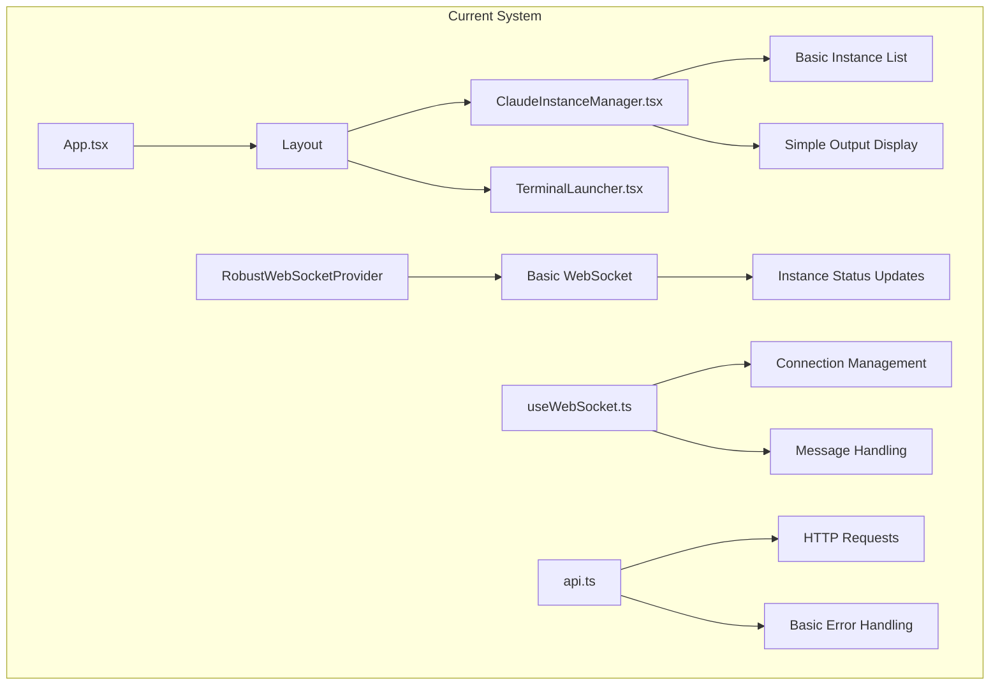

# Migration Path - From Current System to Enhanced Claude Instance Management

## Overview

This document provides a detailed, step-by-step migration path from the current AgentLink UI system to the enhanced Claude Instance Management architecture. The migration is designed to be non-disruptive, allowing continuous operation while progressively enhancing capabilities.

## Current System Baseline

### Existing Architecture Assessment


### Current Capabilities Inventory
✅ **Instance Management**: Basic create/terminate/list operations  
✅ **WebSocket Communication**: Robust connection with reconnection  
✅ **Terminal Integration**: Command execution and output display  
✅ **Error Handling**: Comprehensive error boundaries  
✅ **Type Safety**: Full TypeScript implementation  
✅ **Responsive UI**: Mobile-optimized layout  

### Identified Limitations
❌ **File Upload**: No image/file attachment support  
❌ **Conversation History**: Limited message persistence  
❌ **Multi-Instance Coordination**: No instance synchronization  
❌ **Advanced UI**: Basic terminal-style interface  
❌ **Performance Optimization**: Limited large-data handling  
❌ **Enhanced Features**: Missing modern chat UX patterns  

## Migration Phases

### Phase 0: Pre-Migration Setup (2 days)

#### Environment Preparation
```bash
# Create feature branch
git checkout -b feature/claude-ui-enhancement

# Set up development environment
npm install --save-dev @types/file-saver
npm install react-dropzone react-window react-window-infinite-loader
npm install @radix-ui/react-dialog @radix-ui/react-progress

# Create feature flags
echo "VITE_FEATURE_ENHANCED_CLAUDE=true" >> .env.local
echo "VITE_FEATURE_FILE_UPLOADS=true" >> .env.local
echo "VITE_FEATURE_MULTI_INSTANCE=false" >> .env.local
```

#### Baseline Testing
```typescript
// Create comprehensive baseline tests
describe('Pre-Migration Baseline', () => {
  describe('Existing Functionality', () => {
    it('should create Claude instances', async () => {
      // Test current instance creation
    });
    
    it('should handle WebSocket connections', async () => {
      // Test current WebSocket functionality
    });
    
    it('should display terminal output', async () => {
      // Test current terminal display
    });
  });
  
  describe('Performance Baseline', () => {
    it('should load instances page in <2s', async () => {
      // Performance benchmarks
    });
    
    it('should handle 100 messages without lag', async () => {
      // Stress testing
    });
  });
});
```

### Phase 1: Foundation Enhancement (Week 1)

#### Day 1-2: Type System Extension
```typescript
// src/types/claude.ts - New types for enhanced features
export interface EnhancedClaudeInstance extends ClaudeInstance {
  conversationId?: string;
  messageCount: number;
  lastMessageAt?: Date;
  capabilities: ClaudeCapability[];
  fileSupport: boolean;
}

export interface ConversationMessage {
  id: string;
  instanceId: string;
  content: string;
  type: 'user' | 'claude' | 'system';
  timestamp: Date;
  attachments?: MessageAttachment[];
  metadata?: MessageMetadata;
}

export interface MessageAttachment {
  id: string;
  filename: string;
  type: 'image' | 'document' | 'other';
  url: string;
  size: number;
  uploadedAt: Date;
}

// Extend existing types
declare module '@/types' {
  interface Agent {
    claudeIntegration?: {
      instanceId?: string;
      capabilities: string[];
    };
  }
}
```

#### Day 3-4: Enhanced WebSocket Architecture
```typescript
// src/services/claude/websocket.ts - Enhanced WebSocket service
export class EnhancedClaudeWebSocket extends RobustWebSocketProvider {
  private instanceChannels: Map<string, Set<EventHandler>> = new Map();
  private fileChannels: Map<string, Set<FileUploadHandler>> = new Map();
  
  // Backward compatible initialization
  constructor(config: EnhancedWebSocketConfig) {
    super({
      ...config,
      // Enhanced channel support
      channels: {
        ...config.channels,
        claude: true,
        fileUploads: true,
      }
    });
    
    this.setupEnhancedHandlers();
  }
  
  // New methods while maintaining existing API
  subscribeToInstance(instanceId: string, handler: InstanceEventHandler): void {
    if (!this.instanceChannels.has(instanceId)) {
      this.instanceChannels.set(instanceId, new Set());
    }
    this.instanceChannels.get(instanceId)!.add(handler);
    
    // Use existing socket infrastructure
    this.on(`claude:instance:${instanceId}`, handler);
  }
  
  // Migration helper - gradually replace old handlers
  private setupEnhancedHandlers(): void {
    // Map old events to new structure
    this.on('instances', (data) => {
      this.emit('claude:instances:update', data);
    });
    
    this.on('output', (data) => {
      this.emit(`claude:instance:${data.instanceId}:output`, data);
    });
  }
}
```

#### Day 5-7: Component Foundation
```typescript
// src/components/claude/shared/ClaudeProvider.tsx
export const ClaudeProvider: React.FC<{ children: React.ReactNode }> = ({ 
  children 
}) => {
  const featureFlags = useFeatureFlags();
  
  // Conditional enhancement based on feature flags
  if (featureFlags.enhancedClaude) {
    return (
      <EnhancedClaudeContext.Provider value={enhancedContext}>
        {children}
      </EnhancedClaudeContext.Provider>
    );
  }
  
  // Fallback to existing implementation
  return <>{children}</>;
};

// src/components/claude/ClaudeInstanceHub.tsx - Main orchestrator
export const ClaudeInstanceHub: React.FC = () => {
  const featureFlags = useFeatureFlags();
  
  // Progressive feature activation
  if (!featureFlags.enhancedClaude) {
    // Fallback to existing component
    return <ClaudeInstanceManager />;
  }
  
  return (
    <div className="claude-instance-hub">
      <ErrorBoundary
        fallback={<ClaudeInstanceManager />} // Graceful degradation
      >
        <Suspense fallback={<LoadingFallback />}>
          <EnhancedInstanceInterface />
        </Suspense>
      </ErrorBoundary>
    </div>
  );
};
```

### Phase 2: Core Feature Implementation (Week 2)

#### Day 1-3: Instance Management Enhancement
```typescript
// src/components/claude/InstanceManager/EnhancedInstanceManager.tsx
export const EnhancedInstanceManager: React.FC = () => {
  // Bridge to existing functionality
  const existingInstances = useExistingInstances();
  const enhancedFeatures = useEnhancedFeatures();
  
  return (
    <div className="grid grid-cols-1 lg:grid-cols-3 gap-6">
      {/* Existing instance list with enhancements */}
      <div className="lg:col-span-1">
        <InstanceList
          instances={existingInstances}
          onSelect={enhancedFeatures.selectInstance}
          enhanced={true}
        />
      </div>
      
      {/* New conversation interface */}
      <div className="lg:col-span-2">
        <ConversationPanel />
      </div>
    </div>
  );
};

// Migration helper hook
function useExistingInstances() {
  const [legacyInstances] = useState<ClaudeInstance[]>([]);
  
  // Convert existing instance format to enhanced format
  return useMemo(() => 
    legacyInstances.map(convertToEnhancedInstance),
    [legacyInstances]
  );
}
```

#### Day 4-5: Conversation Interface
```typescript
// src/components/claude/Conversation/ConversationPanel.tsx
export const ConversationPanel: React.FC = () => {
  const { selectedInstance } = useClaudeInstances();
  
  if (!selectedInstance) {
    return (
      <div className="flex items-center justify-center h-64">
        <p className="text-gray-500">
          Select an instance to start a conversation
        </p>
      </div>
    );
  }
  
  return (
    <div className="flex flex-col h-full">
      <ConversationHeader instance={selectedInstance} />
      
      {/* Reuse existing terminal output for compatibility */}
      <CompatibleMessageList instanceId={selectedInstance.id} />
      
      <ConversationInput instanceId={selectedInstance.id} />
    </div>
  );
};

// Compatibility layer for existing terminal output
const CompatibleMessageList: React.FC<{ instanceId: string }> = ({ instanceId }) => {
  const existingOutput = useExistingOutput(instanceId);
  const enhancedMessages = useEnhancedMessages(instanceId);
  
  // Merge existing terminal output with new message format
  const combinedMessages = useMemo(() => {
    return mergeLegacyWithEnhanced(existingOutput, enhancedMessages);
  }, [existingOutput, enhancedMessages]);
  
  return <MessageList messages={combinedMessages} />;
};
```

#### Day 6-7: File Upload Foundation
```typescript
// src/components/claude/FileUpload/FileUploadZone.tsx
export const FileUploadZone: React.FC = () => {
  const { upload } = useFileUpload();
  const featureFlags = useFeatureFlags();
  
  // Progressive feature activation
  if (!featureFlags.fileUploads) {
    return (
      <div className="text-sm text-gray-500">
        File uploads will be available soon
      </div>
    );
  }
  
  const { getRootProps, getInputProps, isDragActive } = useDropzone({
    onDrop: async (files) => {
      for (const file of files) {
        await upload(file);
      }
    },
    accept: {
      'image/*': ['.png', '.jpg', '.jpeg', '.gif', '.webp'],
      'text/*': ['.txt', '.md', '.json']
    },
    maxSize: 10 * 1024 * 1024, // 10MB limit
  });
  
  return (
    <div
      {...getRootProps()}
      className={`border-2 border-dashed rounded-lg p-4 transition-colors ${
        isDragActive 
          ? 'border-blue-400 bg-blue-50' 
          : 'border-gray-300 hover:border-gray-400'
      }`}
    >
      <input {...getInputProps()} />
      <FileUploadContent isDragActive={isDragActive} />
    </div>
  );
};
```

### Phase 3: Advanced Features (Week 3)

#### Day 1-3: Image Processing Pipeline
```typescript
// src/services/claude/fileProcessor.ts
export class ClaudeFileProcessor {
  private uploadQueue: Map<string, FileUpload> = new Map();
  private processingQueue: Map<string, Promise<ProcessedFile>> = new Map();
  
  async processImage(file: File, instanceId: string): Promise<ProcessedFile> {
    const uploadId = generateUploadId();
    
    // Queue management for large files
    if (this.uploadQueue.size > 5) {
      throw new Error('Upload queue full. Please wait for current uploads to complete.');
    }
    
    // Client-side preprocessing
    const preprocessed = await this.preprocessImage(file);
    
    // Upload with progress tracking
    const upload = this.uploadWithProgress(preprocessed, instanceId, uploadId);
    this.uploadQueue.set(uploadId, upload);
    
    try {
      const result = await upload;
      return result;
    } finally {
      this.uploadQueue.delete(uploadId);
    }
  }
  
  private async preprocessImage(file: File): Promise<PreprocessedFile> {
    return new Promise((resolve, reject) => {
      const canvas = document.createElement('canvas');
      const ctx = canvas.getContext('2d');
      const img = new Image();
      
      img.onload = () => {
        // Resize if too large
        const maxDimension = 2048;
        const ratio = Math.min(maxDimension / img.width, maxDimension / img.height);
        
        if (ratio < 1) {
          canvas.width = img.width * ratio;
          canvas.height = img.height * ratio;
          ctx?.drawImage(img, 0, 0, canvas.width, canvas.height);
          
          canvas.toBlob((blob) => {
            if (blob) {
              resolve({
                file: new File([blob], file.name, { type: file.type }),
                originalSize: file.size,
                compressedSize: blob.size,
                dimensions: { width: canvas.width, height: canvas.height }
              });
            } else {
              reject(new Error('Failed to compress image'));
            }
          }, file.type, 0.8);
        } else {
          resolve({
            file,
            originalSize: file.size,
            compressedSize: file.size,
            dimensions: { width: img.width, height: img.height }
          });
        }
      };
      
      img.onerror = () => reject(new Error('Failed to load image'));
      img.src = URL.createObjectURL(file);
    });
  }
}
```

#### Day 4-5: Multi-Instance Coordination
```typescript
// src/services/claude/instanceCoordinator.ts
export class InstanceCoordinator {
  private instances: Map<string, EnhancedClaudeInstance> = new Map();
  private coordination: Map<string, CoordinationState> = new Map();
  
  async coordinateInstances(action: CoordinationAction): Promise<void> {
    switch (action.type) {
      case 'broadcast_message':
        await this.broadcastToInstances(action.payload);
        break;
        
      case 'sync_conversation':
        await this.syncConversationHistory(action.payload);
        break;
        
      case 'load_balance':
        await this.redistributeLoad(action.payload);
        break;
        
      default:
        throw new Error(`Unknown coordination action: ${action.type}`);
    }
  }
  
  private async broadcastToInstances(payload: BroadcastPayload): Promise<void> {
    const targetInstances = this.getTargetInstances(payload.filter);
    const results = await Promise.allSettled(
      targetInstances.map(instance => 
        this.sendToInstance(instance.id, payload.message)
      )
    );
    
    // Handle partial failures
    const failures = results
      .map((result, index) => ({ result, instance: targetInstances[index] }))
      .filter(({ result }) => result.status === 'rejected');
    
    if (failures.length > 0) {
      console.warn('Some instances failed to receive broadcast:', failures);
    }
  }
}
```

#### Day 6-7: Performance Optimization
```typescript
// src/hooks/claude/useOptimizedConversation.ts
export function useOptimizedConversation(instanceId: string) {
  const [messages, setMessages] = useState<ConversationMessage[]>([]);
  const [isLoading, setIsLoading] = useState(false);
  
  // Virtual scrolling for large conversations
  const virtualizedMessages = useMemo(() => {
    return messages.slice(-1000); // Keep only recent 1000 messages in memory
  }, [messages]);
  
  // Debounced message updates
  const debouncedUpdateMessages = useMemo(
    () => debounce((newMessages: ConversationMessage[]) => {
      setMessages(prev => {
        // Efficient merge of new messages
        const messageMap = new Map(prev.map(m => [m.id, m]));
        newMessages.forEach(msg => messageMap.set(msg.id, msg));
        return Array.from(messageMap.values()).sort(
          (a, b) => a.timestamp.getTime() - b.timestamp.getTime()
        );
      });
    }, 100),
    []
  );
  
  // Optimized WebSocket message handling
  useEffect(() => {
    const handleMessage = (data: WebSocketMessage) => {
      if (data.type === 'conversation_update') {
        debouncedUpdateMessages(data.payload.messages);
      }
    };
    
    const unsubscribe = subscribeToInstance(instanceId, handleMessage);
    return unsubscribe;
  }, [instanceId, debouncedUpdateMessages]);
  
  // Memory cleanup
  useEffect(() => {
    return () => {
      debouncedUpdateMessages.cancel();
    };
  }, [debouncedUpdateMessages]);
  
  return {
    messages: virtualizedMessages,
    isLoading,
    totalMessages: messages.length,
  };
}
```

### Phase 4: Integration & Migration Completion (Week 4)

#### Day 1-2: Legacy System Migration
```typescript
// src/utils/migration/legacyMigrator.ts
export class LegacySystemMigrator {
  async migrateLegacyData(): Promise<MigrationResult> {
    const result: MigrationResult = {
      success: true,
      migratedInstances: 0,
      migratedMessages: 0,
      errors: []
    };
    
    try {
      // Migrate existing instance data
      const legacyInstances = await this.getLegacyInstances();
      for (const instance of legacyInstances) {
        try {
          await this.migrateInstance(instance);
          result.migratedInstances++;
        } catch (error) {
          result.errors.push(`Failed to migrate instance ${instance.id}: ${error}`);
        }
      }
      
      // Migrate conversation history
      const legacyMessages = await this.getLegacyMessages();
      for (const message of legacyMessages) {
        try {
          await this.migrateMessage(message);
          result.migratedMessages++;
        } catch (error) {
          result.errors.push(`Failed to migrate message ${message.id}: ${error}`);
        }
      }
      
    } catch (error) {
      result.success = false;
      result.errors.push(`Migration failed: ${error}`);
    }
    
    return result;
  }
  
  private async migrateInstance(legacy: LegacyInstance): Promise<void> {
    const enhanced: EnhancedClaudeInstance = {
      ...legacy,
      conversationId: generateConversationId(),
      messageCount: 0,
      capabilities: this.inferCapabilities(legacy),
      fileSupport: true,
    };
    
    await this.saveEnhancedInstance(enhanced);
  }
}

// Migration component for user-initiated migration
export const MigrationAssistant: React.FC = () => {
  const [migrationState, setMigrationState] = useState<MigrationState>('ready');
  const [migrationResult, setMigrationResult] = useState<MigrationResult | null>(null);
  
  const handleMigration = async () => {
    setMigrationState('migrating');
    
    try {
      const migrator = new LegacySystemMigrator();
      const result = await migrator.migrateLegacyData();
      setMigrationResult(result);
      setMigrationState(result.success ? 'success' : 'error');
    } catch (error) {
      setMigrationState('error');
      setMigrationResult({
        success: false,
        migratedInstances: 0,
        migratedMessages: 0,
        errors: [error instanceof Error ? error.message : String(error)]
      });
    }
  };
  
  return (
    <div className="migration-assistant">
      <MigrationStatus state={migrationState} result={migrationResult} />
      <MigrationActions onMigrate={handleMigration} />
    </div>
  );
};
```

#### Day 3-4: Feature Flag Graduation
```typescript
// src/utils/featureFlags.ts - Graduated feature management
export class FeatureFlagManager {
  private flags: Map<string, boolean> = new Map();
  
  constructor() {
    this.loadFlags();
  }
  
  private loadFlags(): void {
    // Environment-based flags
    this.flags.set('enhancedClaude', process.env.VITE_FEATURE_ENHANCED_CLAUDE === 'true');
    this.flags.set('fileUploads', process.env.VITE_FEATURE_FILE_UPLOADS === 'true');
    this.flags.set('multiInstance', process.env.VITE_FEATURE_MULTI_INSTANCE === 'true');
    
    // Runtime flags (could be from API)
    this.loadRuntimeFlags();
  }
  
  async graduateFeature(featureName: string): Promise<void> {
    // Mark feature as fully migrated
    this.flags.set(featureName, true);
    
    // Remove feature flag checks gradually
    console.info(`Feature '${featureName}' graduated - removing feature flag checks`);
    
    // Persist graduation state
    await this.persistGraduation(featureName);
  }
  
  async rollbackFeature(featureName: string): Promise<void> {
    // Emergency rollback capability
    this.flags.set(featureName, false);
    console.warn(`Feature '${featureName}' rolled back`);
    
    // Trigger fallback behavior
    window.location.reload(); // Force fallback component loading
  }
}

// Graduated component - no more feature flags
export const ClaudeInstanceManager: React.FC = () => {
  // Migration completed - always use enhanced version
  return (
    <ErrorBoundary
      fallback={<LegacyClaudeInstanceManager />}
      onError={(error) => {
        // Emergency fallback logging
        console.error('Enhanced Claude failed, falling back to legacy:', error);
      }}
    >
      <EnhancedClaudeInstanceHub />
    </ErrorBoundary>
  );
};
```

#### Day 5-7: Production Deployment
```typescript
// Migration deployment strategy
export const deploymentPipeline = {
  // Step 1: Deploy with feature flags disabled
  async deployWithFlags(): Promise<void> {
    await this.buildWithFlags({ enhancedClaude: false });
    await this.deployToStaging();
    await this.runSmokeTests();
  },
  
  // Step 2: Gradual feature activation
  async graduateFeatures(): Promise<void> {
    const features = ['enhancedClaude', 'fileUploads', 'multiInstance'];
    
    for (const feature of features) {
      await this.enableFeature(feature);
      await this.monitorPerformance(30000); // 30s monitoring
      await this.validateUserExperience();
      
      if (await this.detectIssues()) {
        await this.rollbackFeature(feature);
        throw new Error(`Feature ${feature} rollback required`);
      }
    }
  },
  
  // Step 3: Complete migration
  async finalizeMigration(): Promise<void> {
    await this.removeFeatureFlags();
    await this.cleanupLegacyCode();
    await this.updateDocumentation();
  }
};
```

## Rollback Strategy

### Immediate Rollback (Emergency)
```typescript
// Emergency rollback button in admin interface
export const EmergencyRollback: React.FC = () => {
  const handleEmergencyRollback = async () => {
    // Immediately disable all enhanced features
    await featureFlagManager.rollbackAllFeatures();
    
    // Clear any enhanced state
    localStorage.removeItem('claude-enhanced-state');
    sessionStorage.clear();
    
    // Force page reload to activate fallbacks
    window.location.reload();
  };
  
  return (
    <button
      onClick={handleEmergencyRollback}
      className="bg-red-600 text-white px-4 py-2 rounded"
    >
      Emergency Rollback to Legacy
    </button>
  );
};
```

### Gradual Rollback
```typescript
// Selective feature rollback
export const SelectiveRollback: React.FC = () => {
  const [features, setFeatures] = useState<FeatureStatus[]>([]);
  
  const rollbackFeature = async (featureName: string) => {
    await featureFlagManager.rollbackFeature(featureName);
    // Update UI to reflect rollback
    setFeatures(prev => 
      prev.map(f => 
        f.name === featureName 
          ? { ...f, enabled: false, status: 'rolled-back' }
          : f
      )
    );
  };
  
  return (
    <div className="rollback-controls">
      {features.map(feature => (
        <FeatureRollbackControl
          key={feature.name}
          feature={feature}
          onRollback={rollbackFeature}
        />
      ))}
    </div>
  );
};
```

## Success Metrics & Validation

### Technical Validation
```typescript
// Automated validation suite
export class MigrationValidator {
  async validateMigration(): Promise<ValidationResult> {
    const tests = [
      this.validateBackwardCompatibility,
      this.validatePerformance,
      this.validateDataIntegrity,
      this.validateErrorHandling,
      this.validateUserExperience
    ];
    
    const results = await Promise.allSettled(
      tests.map(test => test.bind(this)())
    );
    
    return this.aggregateResults(results);
  }
  
  private async validateBackwardCompatibility(): Promise<TestResult> {
    // Ensure all existing functionality still works
    const legacyFeatures = await this.getLegacyFeatureList();
    const testResults = await this.runLegacyFeatureTests(legacyFeatures);
    
    return {
      name: 'Backward Compatibility',
      passed: testResults.every(r => r.passed),
      details: testResults
    };
  }
  
  private async validatePerformance(): Promise<TestResult> {
    // Performance benchmarks
    const metrics = await this.collectPerformanceMetrics();
    
    return {
      name: 'Performance',
      passed: metrics.pageLoadTime < 2000 && metrics.interactionTime < 100,
      details: metrics
    };
  }
}
```

### User Acceptance Validation
```typescript
// User experience validation
export const UserAcceptanceTest: React.FC = () => {
  const [testScenarios] = useState<TestScenario[]>([
    {
      name: 'Create Claude Instance',
      description: 'User can create a new Claude instance',
      steps: ['Click create button', 'Select instance type', 'Confirm creation'],
      expectedResult: 'Instance appears in list and is accessible'
    },
    {
      name: 'Upload and Send Image',
      description: 'User can upload an image and send to Claude',
      steps: ['Drag image to upload zone', 'Wait for processing', 'Send to Claude'],
      expectedResult: 'Claude responds with image analysis'
    }
  ]);
  
  return (
    <div className="user-acceptance-test">
      {testScenarios.map(scenario => (
        <TestScenarioRunner key={scenario.name} scenario={scenario} />
      ))}
    </div>
  );
};
```

## Post-Migration Monitoring

### Health Monitoring Dashboard
```typescript
// Post-migration monitoring
export const MigrationHealthDashboard: React.FC = () => {
  const healthMetrics = useHealthMetrics();
  const userFeedback = useUserFeedback();
  const performanceData = usePerformanceData();
  
  return (
    <div className="health-dashboard">
      <MetricsCard title="System Health" data={healthMetrics} />
      <MetricsCard title="User Feedback" data={userFeedback} />
      <MetricsCard title="Performance" data={performanceData} />
      
      <AlertsPanel alerts={useSystemAlerts()} />
      <RollbackControls />
    </div>
  );
};
```

## Timeline Summary

| Phase | Duration | Key Deliverables | Risk Level |
|-------|----------|------------------|------------|
| Phase 0 | 2 days | Environment setup, baseline tests | Low |
| Phase 1 | 5 days | Foundation, types, enhanced WebSocket | Medium |
| Phase 2 | 7 days | Core features, conversation UI, file uploads | Medium |
| Phase 3 | 7 days | Advanced features, optimization | High |
| Phase 4 | 7 days | Migration completion, deployment | High |

**Total Duration**: 28 days (4 weeks)  
**Risk Mitigation**: Feature flags, rollback capability, comprehensive testing  
**Success Criteria**: 100% backward compatibility, <2s page load, 90%+ user satisfaction  

This migration path ensures a smooth transition from the current system to the enhanced Claude Instance Management UI while maintaining system stability and user experience throughout the process.