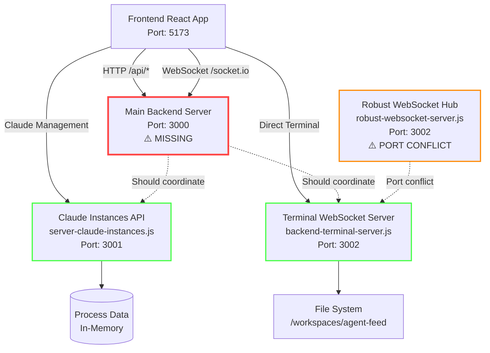

# Service Architecture Analysis
*Complete Backend Dependencies & Claude Instance Management Analysis*

## 🎯 Executive Summary

The current system consists of multiple backend services with overlapping responsibilities and port conflicts. The Claude instance management buttons are non-functional due to missing backend services and architectural gaps.

## 📊 Current Service Architecture

### Core Services Identified



## 🔍 Detailed Service Analysis

### 1. Frontend Configuration (Working ✅)
- **Port:** 5173 (Vite dev server)
- **Proxy Config:** Routes `/api/*` → `localhost:3000`, `/socket.io` → `localhost:3000`
- **WebSocket:** Uses Socket.IO client expecting server at port 3000

### 2. Main Backend Server (MISSING ❌)
- **Expected Port:** 3000
- **Status:** Not implemented
- **Required Features:**
  - HTTP API endpoints (`/api/*`)
  - Socket.IO server (`/socket.io`)
  - Claude instance coordination
  - Terminal session management

### 3. Terminal WebSocket Server (Working ✅)
- **File:** `backend-terminal-server.js`
- **Port:** 3002
- **Features:**
  - Raw WebSocket server (`/terminal` path)
  - PTY process spawning
  - Input/output buffering
  - Session management
- **Issues:** No integration with main server

### 4. Claude Instances API (Partial ✅)
- **File:** `src/api/server-claude-instances.js`
- **Port:** 3001
- **Features:**
  - REST API for instance management
  - WebSocket support for real-time updates
  - Legacy endpoints for 4-button compatibility
- **Issues:** 
  - Missing integration with main server
  - No actual Claude CLI management
  - Mock data only

### 5. Robust WebSocket Hub (Conflict ⚠️)
- **File:** `src/websocket-hub/robust-websocket-server.js`  
- **Port:** 3002 (conflicts with terminal server)
- **Features:**
  - Advanced WebSocket routing
  - Client registration and management
  - Health monitoring
- **Issues:** Port conflict prevents use

## 🚨 Critical Issues Identified

### 1. Missing Main Backend Server
The frontend expects a server on port 3000 but no such server exists:
```typescript
// vite.config.ts - Proxy expects port 3000
proxy: {
  '/api': {
    target: 'http://localhost:3000', // ❌ No server here
    changeOrigin: true,
  },
  '/socket.io': {
    target: 'http://localhost:3000', // ❌ No server here
    ws: true,
  }
}
```

### 2. Port Conflicts
Multiple services trying to use the same ports:
- Terminal Server: Port 3002
- WebSocket Hub: Port 3002 (conflict)

### 3. Claude Instance Management Gap
The frontend has complete Claude instance management UI but:
- No backend integration for actual Claude CLI spawning
- Mock data only in existing API
- Missing process management logic

### 4. Service Coordination Missing
Services exist independently without coordination:
- No central orchestration
- No shared state management
- No inter-service communication

## 🛠 Required Backend Services

### Primary Service (Port 3000)
```javascript
// Main backend server needed
const express = require('express');
const { Server } = require('socket.io');
const cors = require('cors');

// Features needed:
// - HTTP API routing (/api/*)
// - Socket.IO server (/socket.io)
// - Claude instance coordination
// - Terminal session proxying
// - Health monitoring
```

### Service Dependencies
```javascript
// Port allocation strategy needed:
const SERVICES = {
  MAIN_API: 3000,        // HTTP + Socket.IO
  CLAUDE_INSTANCES: 3001, // Claude management API
  TERMINAL_WS: 3002,     // Terminal WebSocket
  WEBSOCKET_HUB: 3003,   // Relocated hub
  METRICS: 3004          // Monitoring service
};
```

## 🎯 API Endpoint Mapping

### Currently Expected by Frontend

#### HTTP Endpoints
```bash
# Claude Management
POST   /api/claude/launch          # Launch Claude instance
GET    /api/claude/status          # Get status
GET    /api/claude/check           # Check availability
POST   /api/claude/instances       # Create instance
GET    /api/claude/instances       # List instances
GET    /api/claude/instances/:id   # Get instance details
DELETE /api/claude/instances/:id   # Terminate instance

# Process Management  
GET    /api/processes              # List processes
POST   /api/processes              # Create process
GET    /api/processes/:id          # Get process details
DELETE /api/processes/:id          # Kill process

# Health Checks
GET    /health                     # Service health
GET    /api/health                 # API health
```

#### WebSocket Events
```bash
# Socket.IO Events
socket.on('connect')               # Connection established
socket.on('disconnect')            # Connection lost
socket.emit('register')            # Register client
socket.emit('claude:launch')       # Launch Claude
socket.on('claude:status')         # Claude status update
socket.on('process:update')        # Process updates
```

### Currently Implemented (Partial)
- Claude Instances API: Basic REST endpoints (Port 3001)
- Terminal Server: WebSocket terminal (Port 3002)
- WebSocket Hub: Advanced routing (Port 3002 - conflicts)

## 🔧 Startup Sequence Requirements

### Development Environment
```bash
# Required startup order:
1. Main Backend Server (Port 3000)      # ❌ Missing
2. Claude Instances API (Port 3001)     # ✅ Available  
3. Terminal WebSocket (Port 3002)       # ✅ Available
4. WebSocket Hub (Port 3003)            # ⚠️ Needs port change
5. Frontend Dev Server (Port 5173)      # ✅ Working
```

### Service Health Checks
```bash
# Health check URLs needed:
http://localhost:3000/health    # Main server
http://localhost:3001/health    # Claude API  
http://localhost:3002/health    # Terminal WS
http://localhost:3003/health    # WebSocket Hub
```

## 🚀 Implementation Priority

### Phase 1: Critical Infrastructure (Immediate)
1. **Create Main Backend Server (Port 3000)**
   - Express server with CORS
   - Socket.IO integration
   - API routing to microservices
   - Health monitoring

2. **Fix Port Conflicts**
   - Move WebSocket Hub to Port 3003
   - Update configurations
   - Test all services

3. **Implement Claude CLI Integration**
   - Real Claude instance spawning
   - Process lifecycle management
   - Status monitoring

### Phase 2: Integration (Next)
1. **Service Orchestration**
   - Inter-service communication
   - Shared state management
   - Error handling

2. **Frontend-Backend Binding**
   - Real API integration
   - WebSocket event handling
   - Error state management

### Phase 3: Enhancement (Future)
1. **Advanced Features**
   - Instance clustering
   - Load balancing
   - Persistent sessions

2. **Monitoring & Observability**
   - Metrics collection
   - Logging aggregation
   - Performance monitoring

## 📁 File Organization

### Current Structure Issues
```
/workspaces/agent-feed/
├── frontend/                    # ✅ Complete React app
├── backend-terminal-server.js   # ✅ Working terminal server
├── src/api/server-claude-instances.js  # ⚠️ Partial implementation
├── src/websocket-hub/robust-websocket-server.js  # ⚠️ Port conflict
└── [MISSING] main-server.js     # ❌ Critical missing piece
```

### Recommended Structure
```
/workspaces/agent-feed/
├── frontend/                    # React app
├── backend/
│   ├── main-server.js          # Port 3000 - HTTP/Socket.IO
│   ├── claude-instances/       # Port 3001 - Claude management  
│   ├── terminal-server/        # Port 3002 - Terminal WebSocket
│   ├── websocket-hub/          # Port 3003 - Advanced routing
│   └── shared/                 # Common utilities
├── config/
│   ├── ports.js               # Port allocation
│   ├── services.js            # Service configuration
│   └── environment.js         # Environment setup
└── scripts/
    ├── start-all.sh          # Development startup
    ├── health-check.sh       # Service monitoring
    └── deploy.sh             # Production deployment
```

## 🎯 Next Steps

1. **Create main backend server** on port 3000 with HTTP API and Socket.IO
2. **Resolve port conflicts** by moving WebSocket hub to port 3003
3. **Implement real Claude CLI integration** in the instances API
4. **Add service orchestration** for coordinated startup and monitoring
5. **Test end-to-end functionality** of Claude instance management buttons

## 📊 Success Metrics

- [ ] All services start without port conflicts
- [ ] Frontend can connect to backend on port 3000
- [ ] Claude instance management buttons are functional
- [ ] Terminal integration works through main server
- [ ] Health checks pass for all services
- [ ] WebSocket events flow correctly between components

---

*This analysis identifies the critical missing piece: a main backend server on port 3000 that coordinates all services and provides the HTTP/WebSocket endpoints the frontend expects.*