# Skills System Architecture Diagrams

**Visual reference for the skills-based loading system**

---

## System Overview

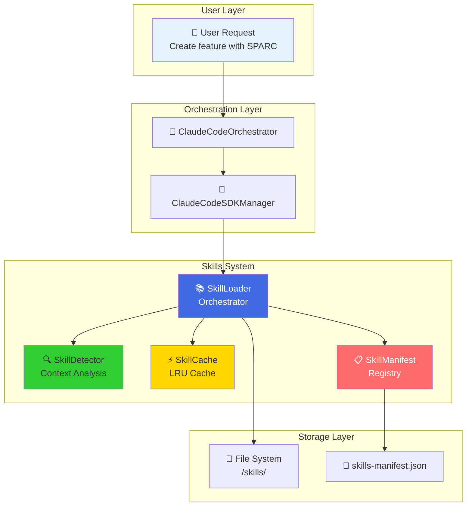

---

## Progressive Disclosure Flow

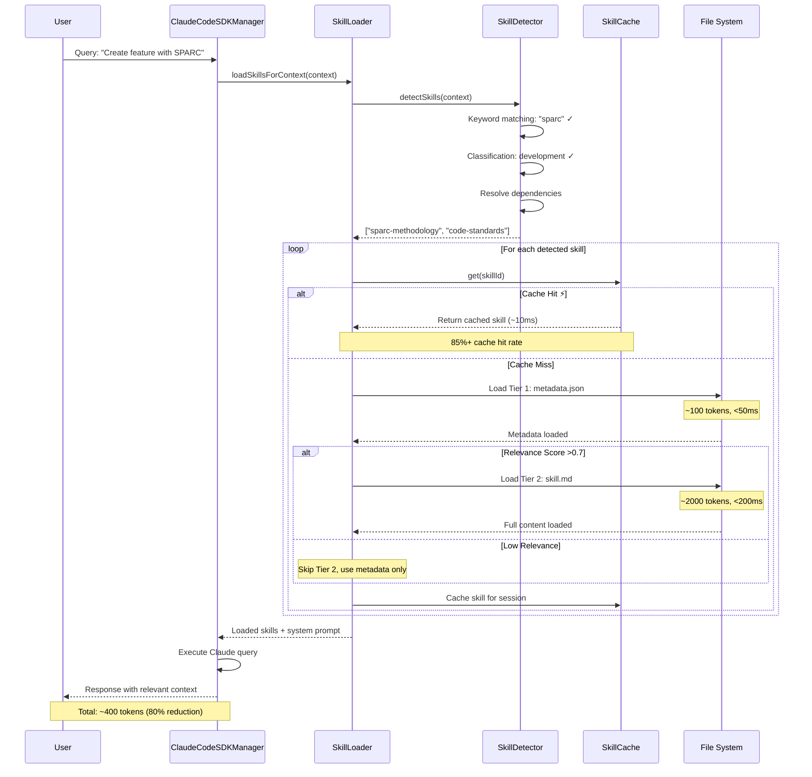

---

## Three-Tier Loading Strategy

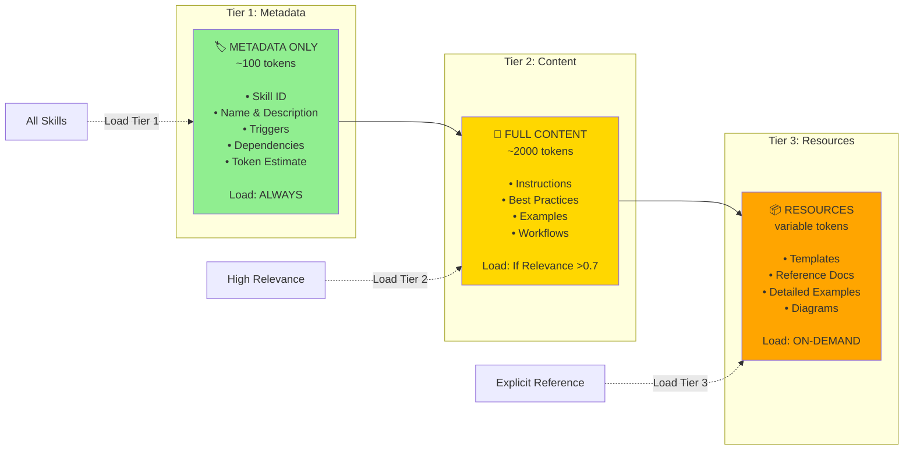

---

## Skill Detection Algorithm

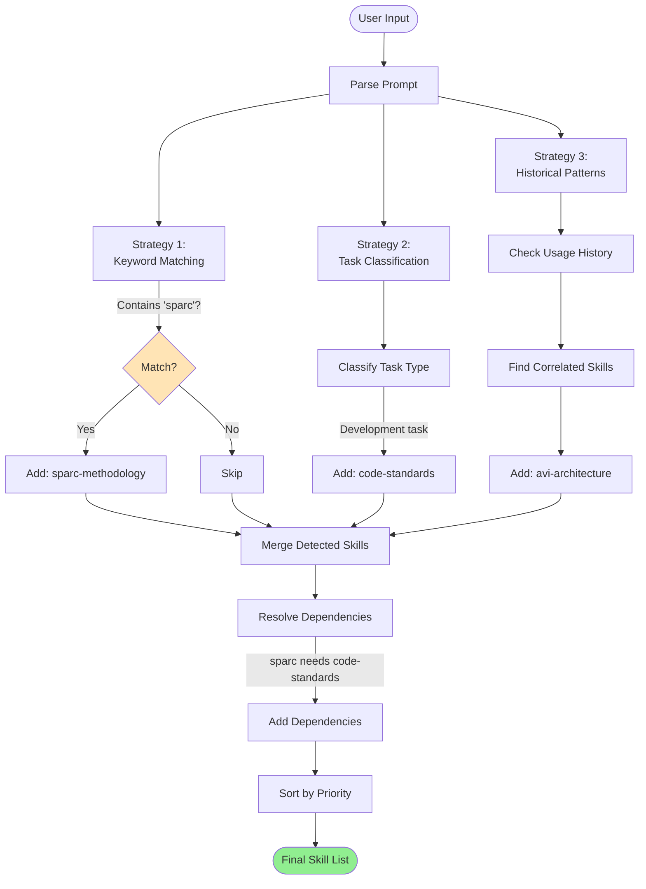

---

## Cache Architecture (LRU)

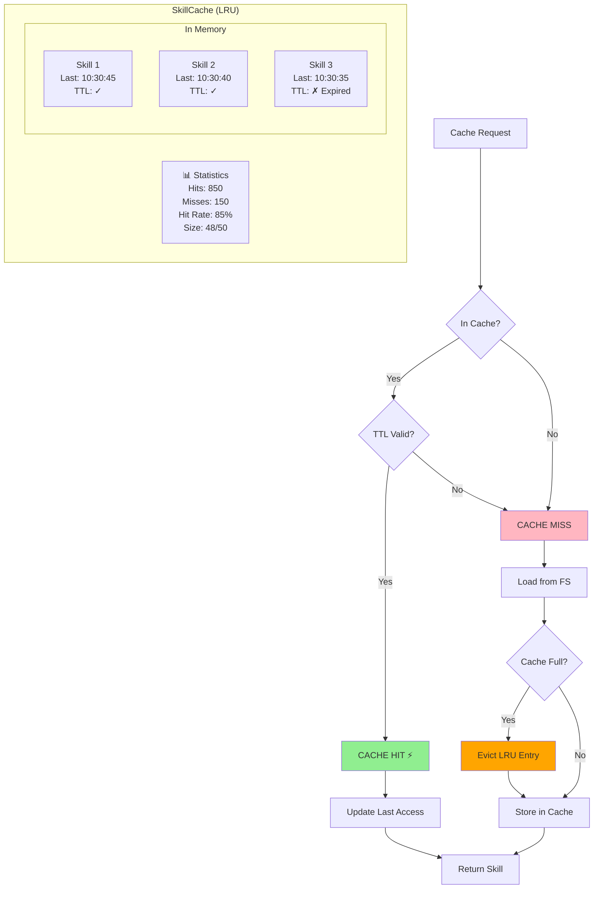

---

## Class Relationships

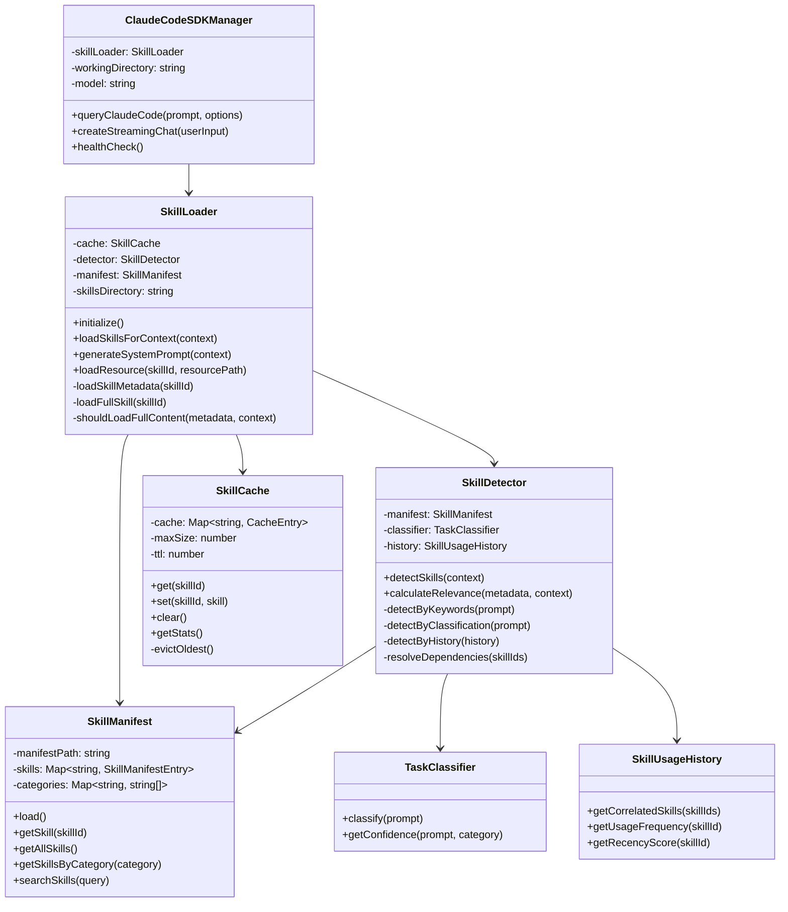

---

## Data Flow: Simple Query

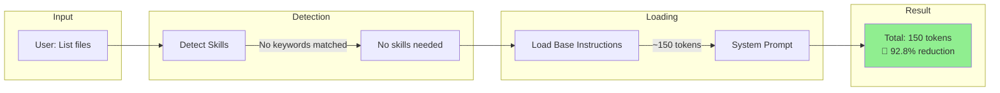

---

## Data Flow: Complex Query

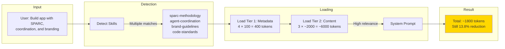

---

## File System Structure

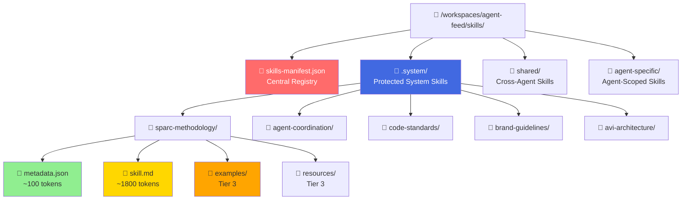

---

## Token Usage Comparison

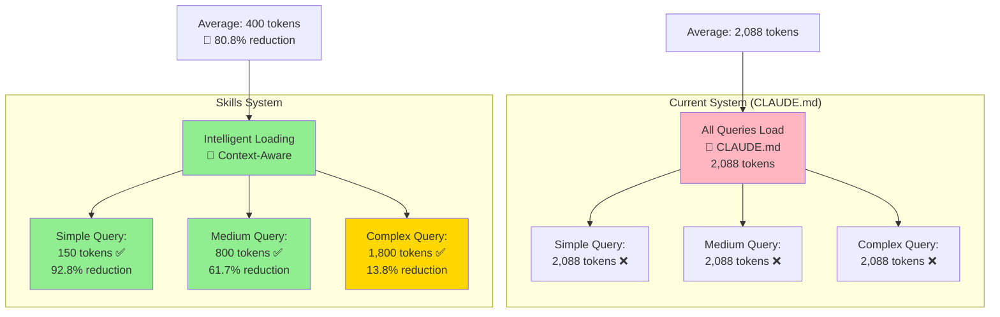

---

## Cost Savings Visualization

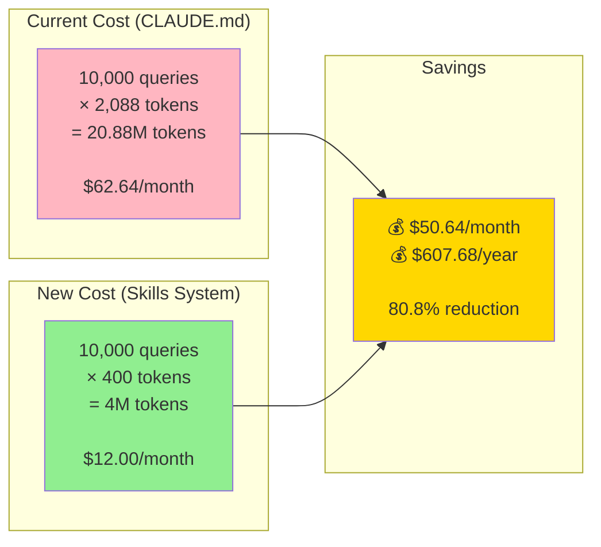

---

## Migration Timeline

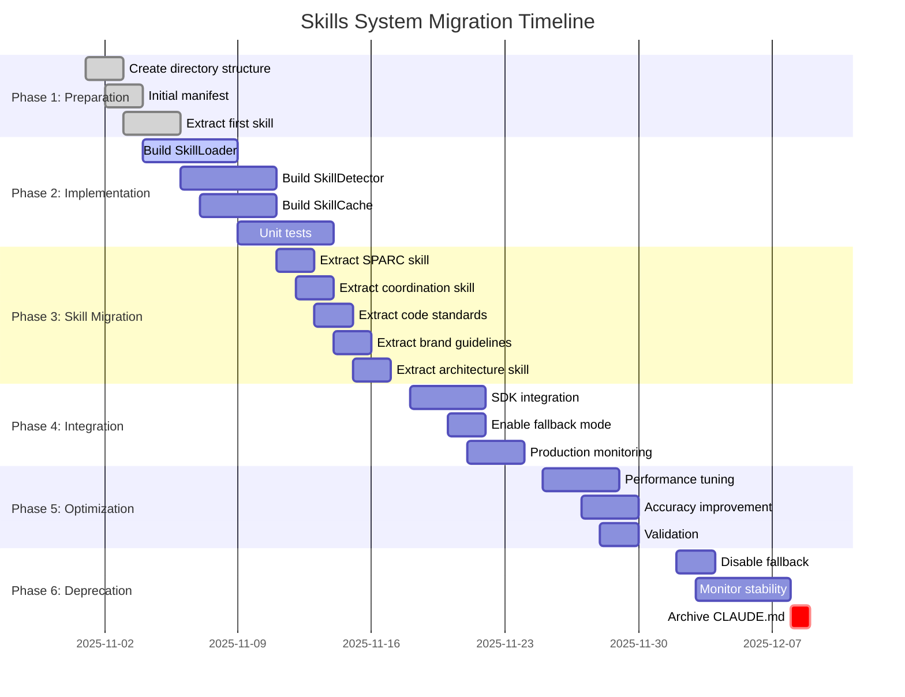

---

## Performance Monitoring Dashboard

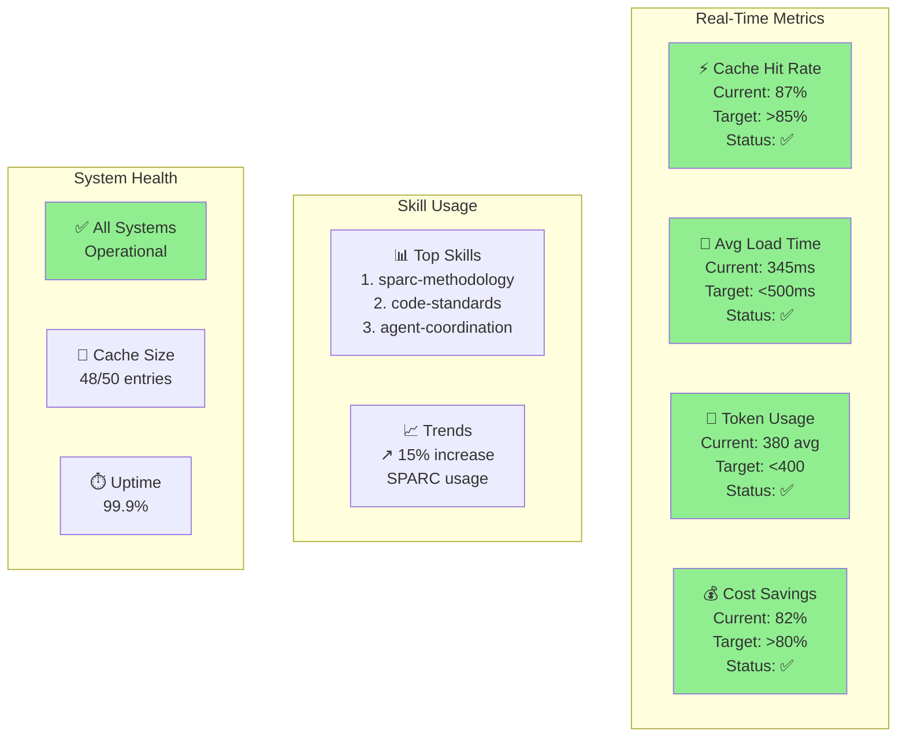

---

## Security & Protection

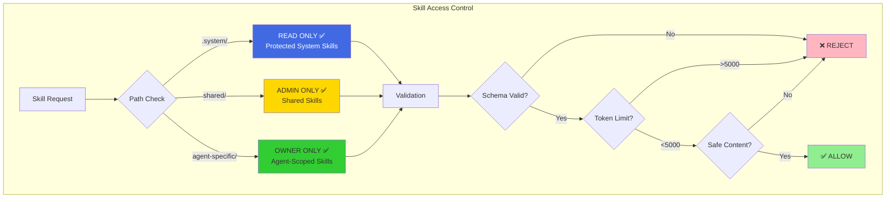

---

## Error Handling Flow

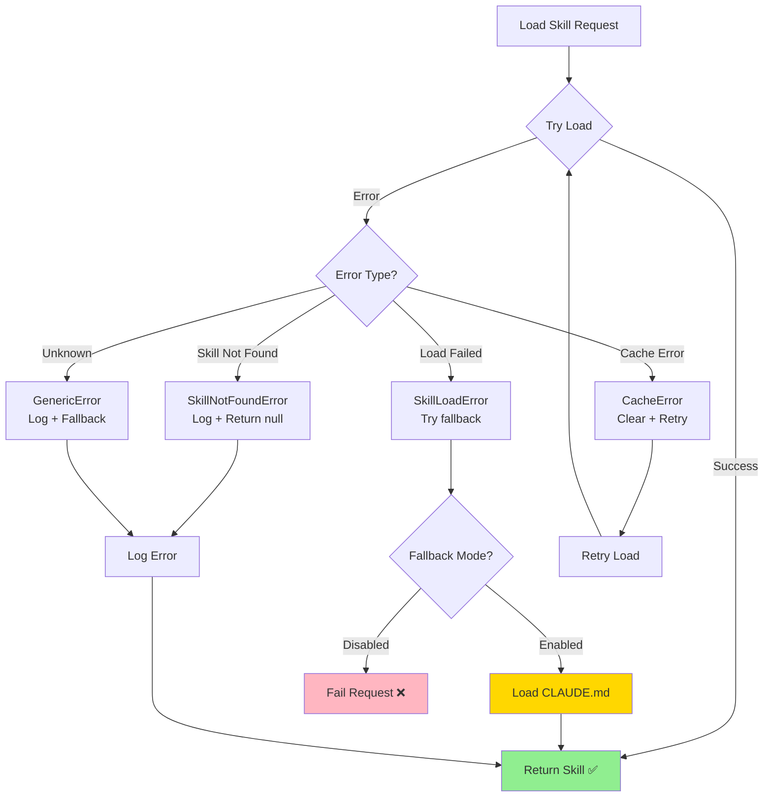

---

## Testing Strategy Overview

```mermaid
graph TB
    subgraph "Unit Tests (>90% coverage)"
        UT1[SkillLoader Tests<br/>- loadSkillMetadata()<br/>- loadFullSkill()<br/>- generateSystemPrompt()]
        UT2[SkillDetector Tests<br/>- detectByKeywords()<br/>- detectByClassification()<br/>- calculateRelevance()]
        UT3[SkillCache Tests<br/>- LRU eviction<br/>- TTL expiration<br/>- Hit rate tracking]
        UT4[SkillManifest Tests<br/>- load()<br/>- getSkill()<br/>- searchSkills()]
    end

    subgraph "Integration Tests"
        IT1[Skills + SDK Integration<br/>- Query with skills<br/>- Cache performance<br/>- Token efficiency]
        IT2[Backward Compatibility<br/>- Fallback mode<br/>- CLAUDE.md parity<br/>- Zero breaking changes]
    end

    subgraph "E2E Tests"
        E2E1[Real-World Scenarios<br/>- Feature development<br/>- Multi-skill workflows<br/>- Dependency resolution]
        E2E2[Performance Tests<br/>- Load time benchmarks<br/>- Cache hit ratio<br/>- Token usage validation]
    end

    UT1 --> IT1
    UT2 --> IT1
    UT3 --> IT1
    UT4 --> IT1

    IT1 --> E2E1
    IT2 --> E2E1

    E2E1 --> E2E2

    style UT1 fill:#90EE90
    style IT1 fill:#FFD700
    style E2E1 fill:#FFA500
```

---

**For detailed specifications, see**: [SKILLS-SYSTEM-ARCHITECTURE.md](./SKILLS-SYSTEM-ARCHITECTURE.md)

**For implementation guide, see**: [SKILLS-SYSTEM-QUICK-REFERENCE.md](./SKILLS-SYSTEM-QUICK-REFERENCE.md)

**Status**: Design Complete - Ready for Implementation
**Last Updated**: 2025-10-30
