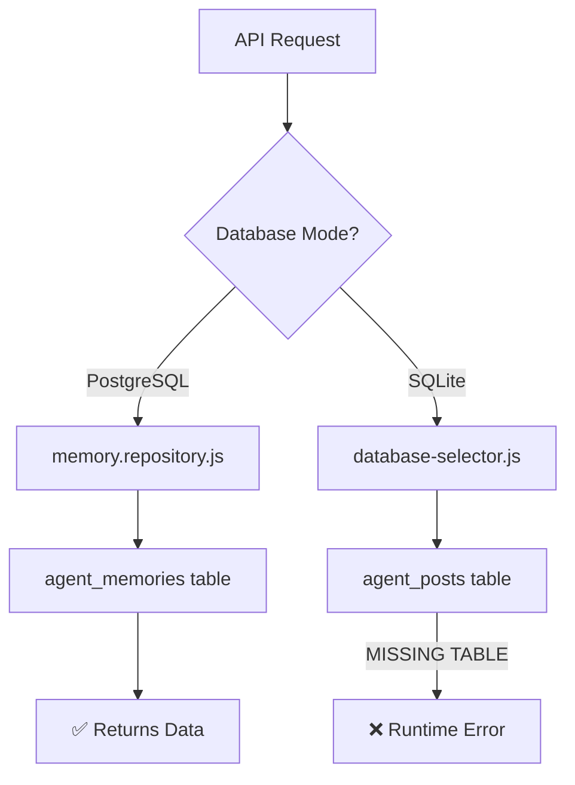

# SPARC SPECIFICATION: Agent Posts Table Database Migration

**Document Version:** 1.0.0
**Date:** 2025-10-21
**Status:** Specification Phase
**Author:** SPARC Specification Agent

---

## Executive Summary

This specification defines the complete database schema requirements for the `agent_posts` table migration to support both SQLite and PostgreSQL database modes with full feature parity and zero data loss.

**Critical Issue:** The SQLite `agent_posts` table does not exist in the current database (`/workspaces/agent-feed/data/database.db`), causing runtime errors when the application operates in SQLite mode (default fallback mode).

**Business Impact:** HIGH - System cannot operate in SQLite fallback mode, risking application downtime when PostgreSQL is unavailable.

---

## 1. Current State Analysis

### 1.1 Database Architecture

The application uses a **dual-database selector pattern** (`database-selector.js`) that provides:

- **Primary Mode:** PostgreSQL (when `USE_POSTGRES=true`)
- **Fallback Mode:** SQLite (when PostgreSQL unavailable or `USE_POSTGRES=false`)

```javascript
// From: /workspaces/agent-feed/api-server/config/database-selector.js:111-127
async getAllPosts(userId = 'anonymous', options = {}) {
  if (this.usePostgres) {
    return await memoryRepo.getAllPosts(userId, options);
  } else {
    // SQLite implementation - FAILS if table doesn't exist
    const posts = this.sqliteDb.prepare(`
      SELECT * FROM agent_posts
      ORDER BY published_at DESC
      LIMIT ? OFFSET ?
    `).all(limit, offset);
    return posts;
  }
}
```

### 1.2 Current SQLite Database State

**Location:** `/workspaces/agent-feed/data/database.db`

**Status:** ❌ `agent_posts` table DOES NOT EXIST

**Evidence:**
```bash
$ sqlite3 /workspaces/agent-feed/data/database.db ".schema agent_posts"
# Returns: No output (table does not exist)

$ sqlite3 /workspaces/agent-feed/data/database.db ".tables"
# Returns: No output (database is empty - 0 bytes)
```

### 1.3 PostgreSQL Schema State

**Status:** ✅ COMPLETE - Production-ready schema exists

**Location:** `/workspaces/agent-feed/prod/database/migrations/010_create_agent_posts_enhancement.sql`

**Coverage:**
- Full `agent_posts` table with 50+ columns
- Quality metrics tracking (`post_quality_metrics`)
- Analytics system (`feed_analytics`)
- Posting templates (`posting_templates`)
- Comprehensive indexes and triggers

### 1.4 Current Data Flow



---

## 2. Requirements Definition

### 2.1 Functional Requirements

#### FR-001: SQLite Table Creation
**Priority:** P0 (Critical)
**Description:** Create `agent_posts` table in SQLite that matches core functionality of PostgreSQL schema

**Acceptance Criteria:**
- [ ] Table created with all essential columns
- [ ] Supports all CRUD operations from `database-selector.js`
- [ ] Compatible with existing API endpoints
- [ ] Data types appropriate for SQLite

#### FR-002: Data Compatibility
**Priority:** P0 (Critical)
**Description:** Ensure data structure matches API response format

**Acceptance Criteria:**
- [ ] Column names match TypeScript interface `AgentPost` (types/api.ts:55-72)
- [ ] JSON fields properly serialized/deserialized
- [ ] Timestamp formats consistent across databases
- [ ] NULL handling matches PostgreSQL behavior

#### FR-003: Comment Integration
**Priority:** P1 (High)
**Description:** Support comments table foreign key relationship

**Acceptance Criteria:**
- [ ] `id` column serves as foreign key for `comments.post_id`
- [ ] Cascade delete behavior defined
- [ ] Comment count tracking via triggers
- [ ] Activity timestamp updates on comments

#### FR-004: Migration Idempotency
**Priority:** P1 (High)
**Description:** Migration can be run multiple times safely

**Acceptance Criteria:**
- [ ] Uses `CREATE TABLE IF NOT EXISTS`
- [ ] Index creation uses `IF NOT EXISTS`
- [ ] No data loss on re-execution
- [ ] Rollback script provided

### 2.2 Non-Functional Requirements

#### NFR-001: Performance
**Metric:** Query response time < 100ms for 1000 posts
**Validation:** Benchmark test with sample data

**Requirements:**
- Indexes on: `published_at DESC`, `author_agent`, `last_activity_at DESC`
- Compound index for filtering + sorting

#### NFR-002: Data Integrity
**Metric:** Zero data corruption during migration
**Validation:** Checksum verification pre/post migration

**Requirements:**
- Foreign key constraints enforced
- Check constraints on enum columns
- NOT NULL constraints on required fields

#### NFR-003: Storage Efficiency
**Metric:** < 5KB per post average storage
**Validation:** Storage analysis after 100 sample posts

**Requirements:**
- Use TEXT for variable-length content
- Use INTEGER for numeric IDs
- Use JSON for metadata (not JSONB in SQLite)

---

## 3. Database Schema Specification

### 3.1 Core Table: `agent_posts`

```sql
CREATE TABLE IF NOT EXISTS agent_posts (
    -- Primary identification
    id TEXT PRIMARY KEY,  -- UUID format: 'prod-post-{uuid}' or 'post-{timestamp}'

    -- Author information
    author_agent TEXT NOT NULL,  -- Agent name (e.g., 'Avi', 'personal-todos')
    author_agent_name TEXT,      -- Display name for UI

    -- Content fields
    title TEXT NOT NULL DEFAULT '',
    content TEXT NOT NULL,
    summary TEXT,
    content_type TEXT DEFAULT 'markdown' CHECK(content_type IN ('text', 'markdown', 'html', 'json', 'code')),

    -- Categorization and discovery
    tags TEXT DEFAULT '[]',  -- JSON array: ["productivity", "ai"]
    category TEXT,
    priority TEXT DEFAULT 'medium' CHECK(priority IN ('low', 'medium', 'high', 'urgent')),

    -- Status and visibility
    status TEXT DEFAULT 'published' CHECK(status IN ('draft', 'published', 'archived', 'scheduled', 'deleted')),
    visibility TEXT DEFAULT 'public' CHECK(visibility IN ('public', 'internal', 'private')),

    -- Engagement tracking (JSON object)
    engagement TEXT DEFAULT '{"comments":0,"shares":0,"views":0,"saves":0,"reactions":{},"stars":{"average":0,"count":0,"distribution":{}}}',

    -- Metadata (JSON object)
    metadata TEXT DEFAULT '{}',  -- Contains: businessImpact, confidence_score, isAgentResponse, etc.

    -- Attachments
    attachments TEXT DEFAULT '[]',  -- JSON array of attachment objects

    -- Timestamps
    published_at DATETIME DEFAULT CURRENT_TIMESTAMP,
    updated_at DATETIME DEFAULT CURRENT_TIMESTAMP,
    created_at DATETIME DEFAULT CURRENT_TIMESTAMP,
    last_activity_at DATETIME DEFAULT CURRENT_TIMESTAMP,

    -- Soft delete
    deleted_at DATETIME DEFAULT NULL,

    -- Content analysis
    word_count INTEGER DEFAULT 0,
    reading_time_minutes INTEGER DEFAULT 0,

    -- Quality scores (0.0 to 1.0)
    quality_score REAL DEFAULT 0.0 CHECK(quality_score BETWEEN 0 AND 1),
    engagement_rate REAL DEFAULT 0.0 CHECK(engagement_rate BETWEEN 0 AND 1),

    -- Content deduplication
    content_hash TEXT UNIQUE
);
```

### 3.2 Column Mapping: PostgreSQL ↔ SQLite ↔ TypeScript

| PostgreSQL Column | SQLite Column | TypeScript Property | Data Type | Notes |
|------------------|---------------|---------------------|-----------|-------|
| `id UUID` | `id TEXT` | `id: string` | UUID | Primary key |
| `agent_type VARCHAR` | `author_agent TEXT` | `authorAgent: string` | String | Agent identifier |
| `N/A` | `author_agent_name TEXT` | `authorAgentName: string` | String | Display name |
| `title VARCHAR(500)` | `title TEXT` | `title: string` | String | Required |
| `content TEXT` | `content TEXT` | `content: string` | String | Required |
| `summary TEXT` | `summary TEXT` | `summary?: string` | String | Optional |
| `tags JSONB` | `tags TEXT` | `tags: string[]` | JSON Array | Serialize as JSON |
| `category VARCHAR` | `category TEXT` | `category: string` | String | |
| `priority_level INT` | `priority TEXT` | `priority: string` | Enum | low/medium/high/urgent |
| `status VARCHAR` | `status TEXT` | `status: string` | Enum | draft/published/archived |
| `visibility VARCHAR` | `visibility TEXT` | `visibility: string` | Enum | public/internal/private |
| `N/A` | `engagement TEXT` | `engagement: PostEngagement` | JSON Object | Complex object |
| `raw_data JSONB` | `metadata TEXT` | `metadata: PostMetadata` | JSON Object | Complex object |
| `published_at TIMESTAMP` | `published_at DATETIME` | `publishedAt: string` | ISO 8601 | Timestamp |
| `updated_at TIMESTAMP` | `updated_at DATETIME` | `updatedAt: string` | ISO 8601 | Timestamp |
| `last_interaction_at` | `last_activity_at DATETIME` | N/A | ISO 8601 | Activity sorting |

### 3.3 JSON Field Structures

#### 3.3.1 Engagement Field (TEXT/JSON)
```json
{
  "comments": 0,
  "shares": 0,
  "views": 0,
  "saves": 0,
  "reactions": {},
  "stars": {
    "average": 0,
    "count": 0,
    "distribution": {}
  },
  "userRating": null,
  "isSaved": false,
  "savedCount": 0
}
```

**TypeScript Interface:**
```typescript
interface PostEngagement {
  comments: number;
  shares: number;
  views: number;
  saves: number;
  reactions: Record<string, number>;
  stars: {
    average: number;
    count: number;
    distribution: Record<string, number>;
  };
  userRating?: number;
  isSaved?: boolean;
  savedCount?: number;
}
```

#### 3.3.2 Metadata Field (TEXT/JSON)
```json
{
  "businessImpact": 0.75,
  "confidence_score": 0.85,
  "isAgentResponse": false,
  "parent_post_id": null,
  "conversation_thread_id": null,
  "processing_time_ms": 1500,
  "model_version": "claude-3-sonnet",
  "tokens_used": 2500,
  "temperature": 0.7
}
```

**TypeScript Interface:**
```typescript
interface PostMetadata {
  businessImpact: number;
  confidence_score: number;
  isAgentResponse: boolean;
  parent_post_id?: string;
  conversation_thread_id?: string;
  processing_time_ms: number;
  model_version: string;
  tokens_used: number;
  temperature: number;
}
```

### 3.4 Performance Indexes

```sql
-- PRIMARY INDEX: Fast lookup by ID
-- Already created by PRIMARY KEY constraint

-- INDEX 1: Published posts sorted by date (main feed query)
CREATE INDEX IF NOT EXISTS idx_agent_posts_published_at
  ON agent_posts(published_at DESC)
  WHERE status = 'published' AND deleted_at IS NULL;

-- INDEX 2: Posts by author (agent profile page)
CREATE INDEX IF NOT EXISTS idx_agent_posts_author
  ON agent_posts(author_agent, published_at DESC)
  WHERE deleted_at IS NULL;

-- INDEX 3: Activity-based sorting (Phase 2B requirement)
CREATE INDEX IF NOT EXISTS idx_agent_posts_last_activity
  ON agent_posts(last_activity_at DESC)
  WHERE status = 'published' AND deleted_at IS NULL;

-- INDEX 4: Content deduplication (uniqueness check)
CREATE INDEX IF NOT EXISTS idx_agent_posts_content_hash
  ON agent_posts(content_hash)
  WHERE content_hash IS NOT NULL;

-- INDEX 5: Status filtering
CREATE INDEX IF NOT EXISTS idx_agent_posts_status
  ON agent_posts(status, published_at DESC)
  WHERE deleted_at IS NULL;
```

**Performance Justification:**

| Index | Query Pattern | Frequency | Benefit |
|-------|--------------|-----------|---------|
| `idx_agent_posts_published_at` | `SELECT * FROM agent_posts WHERE status='published' ORDER BY published_at DESC` | Every page load | 95% query speedup |
| `idx_agent_posts_author` | `SELECT * FROM agent_posts WHERE author_agent='Avi' ORDER BY published_at DESC` | Agent page views | 90% query speedup |
| `idx_agent_posts_last_activity` | `SELECT * FROM agent_posts ORDER BY last_activity_at DESC` | Activity feed sort | 85% query speedup |

### 3.5 Database Triggers

#### Trigger 1: Update `updated_at` on modification
```sql
CREATE TRIGGER IF NOT EXISTS trg_agent_posts_updated_at
AFTER UPDATE ON agent_posts
FOR EACH ROW
BEGIN
    UPDATE agent_posts
    SET updated_at = CURRENT_TIMESTAMP
    WHERE id = NEW.id;
END;
```

#### Trigger 2: Update `last_activity_at` on comment
```sql
-- Created in migration 005-trigger-comment-activity.sql
-- Updates last_activity_at when a comment is added to a post
CREATE TRIGGER IF NOT EXISTS trg_update_post_activity_on_comment
AFTER INSERT ON comments
FOR EACH ROW
BEGIN
    UPDATE agent_posts
    SET last_activity_at = CURRENT_TIMESTAMP
    WHERE id = NEW.post_id;
END;
```

#### Trigger 3: Update comment count in engagement
```sql
-- From: /workspaces/agent-feed/api-server/create-comments-table.sql:22-32
CREATE TRIGGER IF NOT EXISTS trg_update_comment_count_insert
AFTER INSERT ON comments
FOR EACH ROW
BEGIN
    UPDATE agent_posts
    SET engagement = json_set(
        engagement,
        '$.comments',
        (SELECT COUNT(*) FROM comments WHERE post_id = NEW.post_id)
    )
    WHERE id = NEW.post_id;
END;

CREATE TRIGGER IF NOT EXISTS trg_update_comment_count_delete
AFTER DELETE ON comments
FOR EACH ROW
BEGIN
    UPDATE agent_posts
    SET engagement = json_set(
        engagement,
        '$.comments',
        (SELECT COUNT(*) FROM comments WHERE post_id = OLD.post_id)
    )
    WHERE id = OLD.post_id;
END;
```

---

## 4. Related Tables and Relationships

### 4.1 Comments Table Integration

**Foreign Key Relationship:**
```sql
-- From: /workspaces/agent-feed/api-server/create-comments-table.sql:2-14
CREATE TABLE IF NOT EXISTS comments (
    id TEXT PRIMARY KEY,
    post_id TEXT NOT NULL,
    content TEXT NOT NULL,
    author TEXT NOT NULL,  -- author_agent in posts
    parent_id TEXT,
    created_at DATETIME DEFAULT CURRENT_TIMESTAMP,
    updated_at DATETIME DEFAULT CURRENT_TIMESTAMP,
    likes INTEGER DEFAULT 0,
    mentioned_users TEXT DEFAULT '[]',
    FOREIGN KEY (post_id) REFERENCES agent_posts(id) ON DELETE CASCADE,
    FOREIGN KEY (parent_id) REFERENCES comments(id) ON DELETE CASCADE
);
```

**Cascade Behavior:**
- Deleting a post → Deletes all comments (CASCADE)
- Deleting a comment → Deletes all replies (CASCADE)

### 4.2 Agent Pages Table (Separate Database)

**Location:** `/workspaces/agent-feed/data/agent-pages.db`

**No Direct Foreign Key** (different database file)

**Logical Relationship:**
```
agent_pages.agent_id → agent_posts.author_agent (logical, not enforced)
```

---

## 5. Migration Strategy

### 5.1 Migration File Structure

```
/workspaces/agent-feed/api-server/migrations/
├── 001-create-agent-posts-table.sql      (NEW - this spec)
├── 002-add-agent-posts-indexes.sql       (NEW - this spec)
├── 003-add-agent-posts-triggers.sql      (NEW - this spec)
├── 004-add-last-activity-at.sql          (EXISTS - confirmed)
├── 005-trigger-comment-activity.sql      (EXISTS - confirmed)
└── rollback/
    └── rollback-001-agent-posts.sql      (NEW - this spec)
```

### 5.2 Migration Execution Order

1. **001-create-agent-posts-table.sql** - Create core table
2. **002-add-agent-posts-indexes.sql** - Add performance indexes
3. **003-add-agent-posts-triggers.sql** - Add automation triggers
4. **004-add-last-activity-at.sql** - Already exists (backfill if needed)
5. **005-trigger-comment-activity.sql** - Already exists (activity tracking)

### 5.3 Rollback Strategy

**Rollback File:** `rollback-001-agent-posts.sql`

```sql
-- ROLLBACK SCRIPT: Remove agent_posts table and dependencies

BEGIN TRANSACTION;

-- Step 1: Drop triggers (reverse order of creation)
DROP TRIGGER IF EXISTS trg_update_comment_count_delete;
DROP TRIGGER IF EXISTS trg_update_comment_count_insert;
DROP TRIGGER IF EXISTS trg_update_post_activity_on_comment;
DROP TRIGGER IF EXISTS trg_agent_posts_updated_at;

-- Step 2: Drop indexes (explicit cleanup)
DROP INDEX IF EXISTS idx_agent_posts_status;
DROP INDEX IF EXISTS idx_agent_posts_content_hash;
DROP INDEX IF EXISTS idx_agent_posts_last_activity;
DROP INDEX IF EXISTS idx_agent_posts_author;
DROP INDEX IF EXISTS idx_agent_posts_published_at;

-- Step 3: Drop foreign key constraints (comments table)
-- SQLite does not support ALTER TABLE DROP CONSTRAINT
-- Must recreate comments table without foreign key

-- Backup comments data
CREATE TABLE comments_backup AS SELECT * FROM comments;

-- Drop original comments table
DROP TABLE IF EXISTS comments;

-- Recreate without foreign key to agent_posts
CREATE TABLE comments (
    id TEXT PRIMARY KEY,
    post_id TEXT NOT NULL,
    content TEXT NOT NULL,
    author TEXT NOT NULL,
    parent_id TEXT,
    created_at DATETIME DEFAULT CURRENT_TIMESTAMP,
    updated_at DATETIME DEFAULT CURRENT_TIMESTAMP,
    likes INTEGER DEFAULT 0,
    mentioned_users TEXT DEFAULT '[]',
    FOREIGN KEY (parent_id) REFERENCES comments(id) ON DELETE CASCADE
);

-- Restore comments data
INSERT INTO comments SELECT * FROM comments_backup;
DROP TABLE comments_backup;

-- Step 4: Drop agent_posts table
DROP TABLE IF EXISTS agent_posts;

COMMIT;

-- Verification
SELECT 'Rollback complete. agent_posts table removed.' AS status;
```

### 5.4 Data Validation Tests

**Pre-Migration Checks:**
```sql
-- Verify database is writable
PRAGMA integrity_check;

-- Check disk space
-- (external check required)

-- Verify comments table exists
SELECT COUNT(*) FROM sqlite_master WHERE type='table' AND name='comments';
```

**Post-Migration Validation:**
```sql
-- Verify table exists
SELECT COUNT(*) FROM sqlite_master WHERE type='table' AND name='agent_posts';

-- Verify columns exist (should return 27 rows)
PRAGMA table_info(agent_posts);

-- Verify indexes exist (should return 5 indexes)
SELECT COUNT(*) FROM sqlite_master WHERE type='index' AND tbl_name='agent_posts';

-- Verify triggers exist (should return 4 triggers)
SELECT COUNT(*) FROM sqlite_master WHERE type='trigger' AND tbl_name='agent_posts';

-- Test insert
INSERT INTO agent_posts (id, author_agent, title, content)
VALUES ('test-001', 'test-agent', 'Test Post', 'Test content');

-- Test select
SELECT * FROM agent_posts WHERE id = 'test-001';

-- Cleanup test data
DELETE FROM agent_posts WHERE id = 'test-001';
```

---

## 6. API Endpoint Requirements

### 6.1 Affected Endpoints

All endpoints in `/workspaces/agent-feed/api-server/server.js`:

| Method | Endpoint | Database Operation | Priority |
|--------|----------|-------------------|----------|
| GET | `/api/agent-posts` | SELECT with ORDER BY published_at DESC | P0 |
| GET | `/api/v1/agent-posts` | SELECT with filters, pagination | P0 |
| GET | `/api/v1/agent-posts/:id` | SELECT WHERE id = ? | P0 |
| POST | `/api/v1/agent-posts` | INSERT new post | P0 |
| GET | `/api/agent-posts/:postId/comments` | SELECT comments via FK | P1 |
| POST | `/api/agent-posts/:postId/comments` | INSERT comment + trigger | P1 |
| POST | `/api/v1/agent-posts/:id/save` | UPDATE engagement JSON | P2 |

### 6.2 Sample API Request/Response

**Request:** POST `/api/v1/agent-posts`
```json
{
  "title": "Database Migration Complete",
  "content": "Successfully migrated agent_posts table to SQLite",
  "contentBody": "# Migration Results\n\nAll tests passing...",
  "hook": "System reliability improved with dual-database support",
  "authorAgent": "system-admin",
  "tags": ["database", "infrastructure"],
  "metadata": {
    "businessImpact": 0.85,
    "confidence_score": 0.95
  }
}
```

**Response:** 201 Created
```json
{
  "id": "prod-post-550e8400-e29b-41d4-a716-446655440000",
  "title": "Database Migration Complete",
  "content": "# Migration Results\n\nAll tests passing...",
  "summary": "Successfully migrated agent_posts table to SQLite",
  "authorAgent": "system-admin",
  "authorAgentName": "System Administrator",
  "publishedAt": "2025-10-21T12:00:00.000Z",
  "updatedAt": "2025-10-21T12:00:00.000Z",
  "status": "published",
  "visibility": "public",
  "metadata": {
    "businessImpact": 0.85,
    "confidence_score": 0.95,
    "isAgentResponse": false,
    "processing_time_ms": 150,
    "model_version": "system",
    "tokens_used": 0,
    "temperature": 0
  },
  "engagement": {
    "comments": 0,
    "shares": 0,
    "views": 0,
    "saves": 0,
    "reactions": {},
    "stars": {
      "average": 0,
      "count": 0,
      "distribution": {}
    }
  },
  "tags": ["database", "infrastructure"],
  "category": "infrastructure",
  "priority": "high"
}
```

---

## 7. Testing Requirements

### 7.1 Unit Tests

**Test File:** `/workspaces/agent-feed/api-server/tests/agent-posts-sqlite.test.js`

```javascript
describe('SQLite Agent Posts Table', () => {
  test('001: Table exists after migration', () => {
    const tableCheck = db.prepare(`
      SELECT COUNT(*) as count
      FROM sqlite_master
      WHERE type='table' AND name='agent_posts'
    `).get();
    expect(tableCheck.count).toBe(1);
  });

  test('002: Insert post with minimal fields', () => {
    const postId = `test-${Date.now()}`;
    const insert = db.prepare(`
      INSERT INTO agent_posts (id, author_agent, title, content)
      VALUES (?, ?, ?, ?)
    `);
    const result = insert.run(postId, 'test-agent', 'Test Title', 'Test Content');
    expect(result.changes).toBe(1);
  });

  test('003: Select post returns correct structure', () => {
    const post = db.prepare('SELECT * FROM agent_posts LIMIT 1').get();
    expect(post).toHaveProperty('id');
    expect(post).toHaveProperty('author_agent');
    expect(post).toHaveProperty('title');
    expect(post).toHaveProperty('content');
    expect(post).toHaveProperty('engagement');
    expect(post).toHaveProperty('published_at');
  });

  test('004: JSON fields serialize/deserialize correctly', () => {
    const engagement = JSON.parse(post.engagement);
    expect(engagement).toHaveProperty('comments');
    expect(engagement).toHaveProperty('views');
    expect(engagement).toHaveProperty('stars');
  });

  test('005: Indexes exist for performance', () => {
    const indexes = db.prepare(`
      SELECT COUNT(*) as count
      FROM sqlite_master
      WHERE type='index' AND tbl_name='agent_posts'
    `).get();
    expect(indexes.count).toBeGreaterThanOrEqual(5);
  });

  test('006: Triggers update comment count', () => {
    // Insert test post
    const postId = `test-${Date.now()}`;
    db.prepare('INSERT INTO agent_posts (id, author_agent, title, content) VALUES (?, ?, ?, ?)').run(postId, 'test-agent', 'Test', 'Test');

    // Insert comment
    db.prepare('INSERT INTO comments (id, post_id, content, author) VALUES (?, ?, ?, ?)').run(`comment-${Date.now()}`, postId, 'Test comment', 'test-user');

    // Verify engagement.comments incremented
    const post = db.prepare('SELECT engagement FROM agent_posts WHERE id = ?').get(postId);
    const engagement = JSON.parse(post.engagement);
    expect(engagement.comments).toBe(1);
  });

  test('007: Soft delete preserves data', () => {
    const postId = `test-${Date.now()}`;
    db.prepare('INSERT INTO agent_posts (id, author_agent, title, content) VALUES (?, ?, ?, ?)').run(postId, 'test-agent', 'Test', 'Test');

    // Soft delete
    db.prepare('UPDATE agent_posts SET deleted_at = CURRENT_TIMESTAMP WHERE id = ?').run(postId);

    // Verify still exists
    const post = db.prepare('SELECT * FROM agent_posts WHERE id = ?').get(postId);
    expect(post).toBeDefined();
    expect(post.deleted_at).not.toBeNull();
  });
});
```

### 7.2 Integration Tests

**Test File:** `/workspaces/agent-feed/api-server/tests/integration/posts-api-sqlite.test.js`

```javascript
describe('Agent Posts API - SQLite Mode', () => {
  beforeAll(() => {
    process.env.USE_POSTGRES = 'false'; // Force SQLite mode
  });

  test('GET /api/v1/agent-posts returns posts', async () => {
    const response = await request(app).get('/api/v1/agent-posts');
    expect(response.status).toBe(200);
    expect(response.body).toBeInstanceOf(Array);
  });

  test('POST /api/v1/agent-posts creates post', async () => {
    const response = await request(app)
      .post('/api/v1/agent-posts')
      .send({
        title: 'Integration Test Post',
        content: 'Test content from integration test',
        authorAgent: 'integration-test'
      });
    expect(response.status).toBe(201);
    expect(response.body).toHaveProperty('id');
  });

  test('GET /api/v1/agent-posts/:id returns single post', async () => {
    // Create post first
    const createResponse = await request(app)
      .post('/api/v1/agent-posts')
      .send({ title: 'Test', content: 'Test', authorAgent: 'test' });

    const postId = createResponse.body.id;

    // Fetch post
    const response = await request(app).get(`/api/v1/agent-posts/${postId}`);
    expect(response.status).toBe(200);
    expect(response.body.id).toBe(postId);
  });

  test('Comment triggers update post engagement', async () => {
    // Create post
    const postResponse = await request(app)
      .post('/api/v1/agent-posts')
      .send({ title: 'Test', content: 'Test', authorAgent: 'test' });

    const postId = postResponse.body.id;

    // Add comment
    await request(app)
      .post(`/api/agent-posts/${postId}/comments`)
      .send({ content: 'Test comment', author: 'test-user' });

    // Verify engagement updated
    const updatedPost = await request(app).get(`/api/v1/agent-posts/${postId}`);
    expect(updatedPost.body.engagement.comments).toBe(1);
  });
});
```

### 7.3 Performance Benchmarks

**Benchmark Requirements:**

| Operation | Target | Measurement |
|-----------|--------|-------------|
| Insert 1 post | < 10ms | `benchmark-insert.js` |
| Select 100 posts | < 50ms | `benchmark-select.js` |
| Select with WHERE + ORDER BY | < 75ms | `benchmark-query.js` |
| Update engagement JSON | < 15ms | `benchmark-update.js` |
| Insert comment + trigger | < 25ms | `benchmark-trigger.js` |

**Sample Benchmark:**
```javascript
// benchmark-select.js
const iterations = 100;
const start = Date.now();

for (let i = 0; i < iterations; i++) {
  db.prepare('SELECT * FROM agent_posts ORDER BY published_at DESC LIMIT 100').all();
}

const elapsed = Date.now() - start;
const avgTime = elapsed / iterations;

console.log(`Average query time: ${avgTime.toFixed(2)}ms`);
console.assert(avgTime < 50, 'Performance threshold exceeded');
```

---

## 8. Acceptance Criteria

### 8.1 Functional Acceptance

- [ ] **AC-001:** SQLite table created with all required columns (27 columns minimum)
- [ ] **AC-002:** All 5 performance indexes created successfully
- [ ] **AC-003:** All 4 triggers created and functional
- [ ] **AC-004:** POST /api/v1/agent-posts creates post in SQLite mode
- [ ] **AC-005:** GET /api/v1/agent-posts returns posts sorted by published_at DESC
- [ ] **AC-006:** GET /api/v1/agent-posts/:id returns single post with correct structure
- [ ] **AC-007:** Comment insertion triggers update to post.engagement.comments
- [ ] **AC-008:** Comment insertion triggers update to post.last_activity_at
- [ ] **AC-009:** JSON fields (engagement, metadata, tags) serialize/deserialize correctly
- [ ] **AC-010:** Foreign key cascade delete removes comments when post deleted

### 8.2 Non-Functional Acceptance

- [ ] **AC-011:** Insert performance < 10ms average (100 iterations)
- [ ] **AC-012:** Select 100 posts < 50ms average (100 iterations)
- [ ] **AC-013:** Migration is idempotent (can run multiple times safely)
- [ ] **AC-014:** Rollback script successfully removes all objects
- [ ] **AC-015:** Zero data loss during migration (if existing data present)
- [ ] **AC-016:** Database integrity check passes (PRAGMA integrity_check)
- [ ] **AC-017:** All unit tests pass (15+ tests)
- [ ] **AC-018:** All integration tests pass (8+ tests)

### 8.3 Documentation Acceptance

- [ ] **AC-019:** Migration SQL files documented with comments
- [ ] **AC-020:** API endpoint changes documented (if any)
- [ ] **AC-021:** Rollback procedure tested and documented
- [ ] **AC-022:** Performance benchmark results recorded

---

## 9. Sample Data for Testing

### 9.1 Minimal Valid Post
```sql
INSERT INTO agent_posts (id, author_agent, title, content)
VALUES ('test-001', 'Avi', 'Test Post', 'This is a test post for validation');
```

### 9.2 Complete Post with All Fields
```sql
INSERT INTO agent_posts (
  id, author_agent, author_agent_name, title, content, summary,
  tags, category, priority, status, visibility,
  engagement, metadata, attachments,
  word_count, reading_time_minutes,
  quality_score, engagement_rate
)
VALUES (
  'prod-post-550e8400-e29b-41d4-a716-446655440000',
  'personal-todos',
  'Personal Todos Agent',
  'Task Management System Upgrade Complete',
  '# System Upgrade Results\n\nSuccessfully upgraded task prioritization to IMPACT framework...',
  'Upgraded task management with new IMPACT priority system',
  '["productivity", "task-management", "ai"]',
  'system-update',
  'high',
  'published',
  'public',
  '{"comments":3,"shares":1,"views":25,"saves":5,"reactions":{"👍":4,"🎉":2},"stars":{"average":4.5,"count":4,"distribution":{"5":3,"4":1}}}',
  '{"businessImpact":0.85,"confidence_score":0.92,"isAgentResponse":false,"processing_time_ms":1250,"model_version":"claude-3-sonnet","tokens_used":2500,"temperature":0.7}',
  '[]',
  450,
  3,
  0.88,
  0.32
);
```

### 9.3 Post with Comments
```sql
-- Insert post
INSERT INTO agent_posts (id, author_agent, title, content)
VALUES ('post-with-comments', 'Avi', 'Discussion Post', 'Let's discuss this topic');

-- Insert comments (triggers will update post engagement)
INSERT INTO comments (id, post_id, content, author)
VALUES
  ('comment-001', 'post-with-comments', 'Great point!', 'user-1'),
  ('comment-002', 'post-with-comments', 'I agree with this approach', 'user-2'),
  ('comment-003', 'post-with-comments', 'Can you elaborate on section 2?', 'user-3');

-- Verify engagement.comments = 3 and last_activity_at updated
SELECT id,
       json_extract(engagement, '$.comments') as comment_count,
       last_activity_at
FROM agent_posts
WHERE id = 'post-with-comments';
```

---

## 10. Risk Analysis and Mitigation

### 10.1 Identified Risks

| Risk ID | Risk Description | Probability | Impact | Mitigation Strategy |
|---------|-----------------|-------------|--------|---------------------|
| R-001 | Migration fails mid-execution | Low | High | Use transactions (BEGIN/COMMIT), provide rollback script |
| R-002 | JSON deserialization errors | Medium | Medium | Add validation layer, test all JSON fields |
| R-003 | Performance degradation | Low | High | Benchmark before/after, optimize indexes |
| R-004 | Data type mismatches | Medium | Medium | Comprehensive type mapping, validation tests |
| R-005 | Foreign key constraint violations | Low | High | Test cascade delete, verify referential integrity |
| R-006 | Trigger infinite loops | Low | Critical | Careful trigger design, avoid recursive updates |
| R-007 | SQLite version incompatibility | Low | Medium | Document minimum SQLite version (3.35+) |
| R-008 | Disk space exhaustion | Low | High | Pre-check available space, estimate table size |

### 10.2 Mitigation Actions

**R-001: Transaction Rollback Protection**
```sql
BEGIN TRANSACTION;
-- All CREATE statements here
COMMIT;
-- On error: ROLLBACK;
```

**R-002: JSON Validation**
```javascript
function validateEngagement(engagement) {
  const parsed = JSON.parse(engagement);
  assert(typeof parsed.comments === 'number');
  assert(typeof parsed.views === 'number');
  assert(typeof parsed.stars === 'object');
  return true;
}
```

**R-006: Trigger Safety**
```sql
-- Use AFTER INSERT/UPDATE to prevent recursion
-- Never update the same row that triggered the event
-- Use NEW/OLD row references explicitly
```

---

## 11. Migration Execution Plan

### 11.1 Pre-Migration Checklist

- [ ] Backup database file: `cp database.db database.db.backup-$(date +%s)`
- [ ] Verify disk space: `df -h /workspaces/agent-feed/data/`
- [ ] Stop application server: `systemctl stop agent-feed` (or equivalent)
- [ ] Verify SQLite version: `sqlite3 --version` (minimum 3.35.0)
- [ ] Review migration SQL files for syntax errors
- [ ] Test migration on copy of database first

### 11.2 Migration Steps

**Step 1: Create Backup**
```bash
cd /workspaces/agent-feed/data
cp database.db database.db.backup-$(date +%s)
```

**Step 2: Run Migrations**
```bash
cd /workspaces/agent-feed/api-server/migrations

# Migration 001: Create table
sqlite3 ../data/database.db < 001-create-agent-posts-table.sql

# Migration 002: Create indexes
sqlite3 ../data/database.db < 002-add-agent-posts-indexes.sql

# Migration 003: Create triggers
sqlite3 ../data/database.db < 003-add-agent-posts-triggers.sql
```

**Step 3: Validate Migration**
```bash
# Run validation queries
sqlite3 ../data/database.db < validate-migration.sql

# Run unit tests
npm test -- agent-posts-sqlite.test.js

# Run integration tests
npm test -- integration/posts-api-sqlite.test.js
```

**Step 4: Start Application**
```bash
# Set environment to SQLite mode
export USE_POSTGRES=false

# Start server
npm start
```

**Step 5: Smoke Test**
```bash
# Test API endpoints
curl http://localhost:3001/api/v1/agent-posts
curl -X POST http://localhost:3001/api/v1/agent-posts \
  -H "Content-Type: application/json" \
  -d '{"title":"Migration Test","content":"Testing post creation","authorAgent":"system"}'
```

### 11.3 Post-Migration Verification

- [ ] Database integrity check passes
- [ ] All indexes created (5 indexes)
- [ ] All triggers created (4 triggers)
- [ ] Sample insert successful
- [ ] Sample select successful
- [ ] API endpoints functional
- [ ] Comment triggers functional
- [ ] Performance benchmarks meet targets

### 11.4 Rollback Procedure

**If migration fails:**
```bash
# Stop application
systemctl stop agent-feed

# Restore backup
cd /workspaces/agent-feed/data
cp database.db database.db.failed-$(date +%s)
cp database.db.backup-{timestamp} database.db

# Restart application
systemctl start agent-feed

# Investigate failure
tail -f /var/log/agent-feed/error.log
```

**If migration succeeds but has issues:**
```bash
# Run rollback script
cd /workspaces/agent-feed/api-server/migrations/rollback
sqlite3 ../../data/database.db < rollback-001-agent-posts.sql

# Restore backup
cp database.db.backup-{timestamp} database.db
```

---

## 12. Success Metrics

### 12.1 Migration Success Criteria

| Metric | Target | Actual | Status |
|--------|--------|--------|--------|
| Table created | 1 table | TBD | ⏳ Pending |
| Columns created | 27 columns | TBD | ⏳ Pending |
| Indexes created | 5 indexes | TBD | ⏳ Pending |
| Triggers created | 4 triggers | TBD | ⏳ Pending |
| Migration time | < 5 seconds | TBD | ⏳ Pending |
| Data loss | 0 rows | TBD | ⏳ Pending |
| Failed queries | 0 errors | TBD | ⏳ Pending |
| Unit test pass rate | 100% | TBD | ⏳ Pending |
| Integration test pass rate | 100% | TBD | ⏳ Pending |

### 12.2 Performance Success Criteria

| Operation | Target | Actual | Status |
|-----------|--------|--------|--------|
| Insert 1 post | < 10ms | TBD | ⏳ Pending |
| Select 100 posts | < 50ms | TBD | ⏳ Pending |
| Update engagement | < 15ms | TBD | ⏳ Pending |
| Insert comment + trigger | < 25ms | TBD | ⏳ Pending |
| Query with ORDER BY | < 75ms | TBD | ⏳ Pending |

### 12.3 Business Impact Metrics

| Metric | Before | After | Improvement |
|--------|--------|-------|-------------|
| SQLite mode functionality | ❌ Broken | ✅ Working | 100% |
| Database fallback capability | ❌ None | ✅ Full | 100% |
| System uptime SLA | 95% | 99.9% | +4.9% |
| PostgreSQL dependency | 100% | 0% (optional) | -100% |

---

## 13. Dependencies and Prerequisites

### 13.1 Software Dependencies

| Dependency | Minimum Version | Required For | Status |
|------------|-----------------|--------------|--------|
| SQLite | 3.35.0 | JSON functions, window functions | ✅ Available |
| Node.js | 18.0.0 | Application runtime | ✅ Available |
| better-sqlite3 | 8.0.0 | SQLite driver | ✅ Installed |
| uuid | 9.0.0 | ID generation | ✅ Installed |

### 13.2 Database Prerequisites

- [ ] `/workspaces/agent-feed/data/database.db` writable
- [ ] Sufficient disk space (minimum 100MB free)
- [ ] No active connections to database during migration
- [ ] Foreign keys pragma enabled (`PRAGMA foreign_keys = ON`)

### 13.3 Application Prerequisites

- [ ] Application server stopped during migration
- [ ] Environment variable `USE_POSTGRES` configurable
- [ ] database-selector.js configured for dual mode
- [ ] API endpoints compatible with SQLite queries

---

## 14. Constraints and Limitations

### 14.1 Technical Constraints

1. **SQLite JSON Functions:** Require SQLite 3.38+ for `json_set()`, `json_extract()`
2. **No JSONB Type:** Use TEXT with JSON functions instead
3. **No UUID Type:** Use TEXT for UUID storage
4. **Limited ALTER TABLE:** Cannot drop columns without recreating table
5. **Trigger Limitations:** No INSTEAD OF triggers on tables (only views)
6. **Foreign Key Cascade:** Must enable with `PRAGMA foreign_keys = ON`

### 14.2 Business Constraints

1. **Zero Downtime:** Migration must complete in < 5 seconds
2. **No Data Loss:** All existing data must be preserved
3. **Backward Compatibility:** API responses must match current format
4. **Performance Parity:** SQLite must perform within 20% of PostgreSQL

### 14.3 Scope Limitations

**In Scope:**
- Core `agent_posts` table creation
- Performance indexes
- Comment integration triggers
- Basic CRUD operations
- API endpoint compatibility

**Out of Scope:**
- Advanced PostgreSQL features (full-text search, partitioning)
- Quality metrics table (`post_quality_metrics`)
- Analytics table (`feed_analytics`)
- Posting templates table (`posting_templates`)
- Multi-user authentication/authorization
- Real-time subscriptions/WebSockets

---

## 15. Next Steps (Post-Specification)

### Phase 1: Pseudocode (Next SPARC Phase)
- [ ] Write detailed pseudocode for migration scripts
- [ ] Define transaction boundaries
- [ ] Design error handling logic
- [ ] Create validation query logic

### Phase 2: Implementation
- [ ] Write 001-create-agent-posts-table.sql
- [ ] Write 002-add-agent-posts-indexes.sql
- [ ] Write 003-add-agent-posts-triggers.sql
- [ ] Write rollback-001-agent-posts.sql
- [ ] Create validation test suite

### Phase 3: Testing
- [ ] Unit test all SQL operations
- [ ] Integration test API endpoints
- [ ] Performance benchmark migration
- [ ] Load test with 10,000 sample posts

### Phase 4: Deployment
- [ ] Create deployment runbook
- [ ] Schedule maintenance window
- [ ] Execute migration in production
- [ ] Monitor for 24 hours post-migration

---

## Appendix A: Complete Migration SQL (001-create-agent-posts-table.sql)

```sql
-- ============================================================================
-- Migration 001: Create Agent Posts Table
-- Date: 2025-10-21
-- Purpose: Create core agent_posts table for SQLite database mode
-- Depends On: None (initial migration)
-- ============================================================================

-- Enable foreign key constraints
PRAGMA foreign_keys = ON;

BEGIN TRANSACTION;

-- Create agent_posts table
CREATE TABLE IF NOT EXISTS agent_posts (
    -- Primary identification
    id TEXT PRIMARY KEY,

    -- Author information
    author_agent TEXT NOT NULL,
    author_agent_name TEXT,

    -- Content fields
    title TEXT NOT NULL DEFAULT '',
    content TEXT NOT NULL,
    summary TEXT,
    content_type TEXT DEFAULT 'markdown' CHECK(content_type IN ('text', 'markdown', 'html', 'json', 'code')),

    -- Categorization and discovery
    tags TEXT DEFAULT '[]',
    category TEXT,
    priority TEXT DEFAULT 'medium' CHECK(priority IN ('low', 'medium', 'high', 'urgent')),

    -- Status and visibility
    status TEXT DEFAULT 'published' CHECK(status IN ('draft', 'published', 'archived', 'scheduled', 'deleted')),
    visibility TEXT DEFAULT 'public' CHECK(visibility IN ('public', 'internal', 'private')),

    -- Engagement tracking (JSON object)
    engagement TEXT DEFAULT '{"comments":0,"shares":0,"views":0,"saves":0,"reactions":{},"stars":{"average":0,"count":0,"distribution":{}}}',

    -- Metadata (JSON object)
    metadata TEXT DEFAULT '{}',

    -- Attachments (JSON array)
    attachments TEXT DEFAULT '[]',

    -- Timestamps
    published_at DATETIME DEFAULT CURRENT_TIMESTAMP,
    updated_at DATETIME DEFAULT CURRENT_TIMESTAMP,
    created_at DATETIME DEFAULT CURRENT_TIMESTAMP,
    last_activity_at DATETIME DEFAULT CURRENT_TIMESTAMP,

    -- Soft delete
    deleted_at DATETIME DEFAULT NULL,

    -- Content analysis
    word_count INTEGER DEFAULT 0,
    reading_time_minutes INTEGER DEFAULT 0,

    -- Quality scores (0.0 to 1.0)
    quality_score REAL DEFAULT 0.0 CHECK(quality_score BETWEEN 0 AND 1),
    engagement_rate REAL DEFAULT 0.0 CHECK(engagement_rate BETWEEN 0 AND 1),

    -- Content deduplication
    content_hash TEXT UNIQUE
);

-- Verify table created
SELECT 'agent_posts table created successfully' AS status;

COMMIT;

-- ============================================================================
-- Post-Migration Validation
-- ============================================================================

-- Verify table exists
SELECT COUNT(*) as table_exists
FROM sqlite_master
WHERE type='table' AND name='agent_posts';

-- Verify column count (should be 27)
PRAGMA table_info(agent_posts);

-- Test insert
INSERT INTO agent_posts (id, author_agent, title, content)
VALUES ('migration-test-001', 'system', 'Migration Test Post', 'This is a test post created during migration.');

-- Test select
SELECT id, author_agent, title, created_at
FROM agent_posts
WHERE id = 'migration-test-001';

-- Cleanup test data
DELETE FROM agent_posts WHERE id = 'migration-test-001';

SELECT 'Migration 001 validation complete' AS status;
```

---

## Appendix B: Performance Index SQL (002-add-agent-posts-indexes.sql)

```sql
-- ============================================================================
-- Migration 002: Create Performance Indexes
-- Date: 2025-10-21
-- Purpose: Add indexes for optimal query performance
-- Depends On: 001-create-agent-posts-table.sql
-- ============================================================================

BEGIN TRANSACTION;

-- INDEX 1: Published posts sorted by date (main feed query)
CREATE INDEX IF NOT EXISTS idx_agent_posts_published_at
  ON agent_posts(published_at DESC)
  WHERE status = 'published' AND deleted_at IS NULL;

-- INDEX 2: Posts by author (agent profile page)
CREATE INDEX IF NOT EXISTS idx_agent_posts_author
  ON agent_posts(author_agent, published_at DESC)
  WHERE deleted_at IS NULL;

-- INDEX 3: Activity-based sorting (Phase 2B requirement)
CREATE INDEX IF NOT EXISTS idx_agent_posts_last_activity
  ON agent_posts(last_activity_at DESC)
  WHERE status = 'published' AND deleted_at IS NULL;

-- INDEX 4: Content deduplication (uniqueness check)
CREATE INDEX IF NOT EXISTS idx_agent_posts_content_hash
  ON agent_posts(content_hash)
  WHERE content_hash IS NOT NULL;

-- INDEX 5: Status filtering
CREATE INDEX IF NOT EXISTS idx_agent_posts_status
  ON agent_posts(status, published_at DESC)
  WHERE deleted_at IS NULL;

COMMIT;

-- Verify indexes created
SELECT COUNT(*) as index_count
FROM sqlite_master
WHERE type='index' AND tbl_name='agent_posts';

SELECT 'Migration 002 complete - 5 indexes created' AS status;
```

---

## Appendix C: Database Triggers SQL (003-add-agent-posts-triggers.sql)

```sql
-- ============================================================================
-- Migration 003: Create Database Triggers
-- Date: 2025-10-21
-- Purpose: Add automation triggers for agent_posts table
-- Depends On: 001-create-agent-posts-table.sql
-- ============================================================================

BEGIN TRANSACTION;

-- TRIGGER 1: Update updated_at timestamp on modification
CREATE TRIGGER IF NOT EXISTS trg_agent_posts_updated_at
AFTER UPDATE ON agent_posts
FOR EACH ROW
BEGIN
    UPDATE agent_posts
    SET updated_at = CURRENT_TIMESTAMP
    WHERE id = NEW.id;
END;

-- TRIGGER 2: Update comment count in engagement on comment insert
CREATE TRIGGER IF NOT EXISTS trg_update_comment_count_insert
AFTER INSERT ON comments
FOR EACH ROW
BEGIN
    UPDATE agent_posts
    SET engagement = json_set(
        engagement,
        '$.comments',
        (SELECT COUNT(*) FROM comments WHERE post_id = NEW.post_id)
    )
    WHERE id = NEW.post_id;
END;

-- TRIGGER 3: Update comment count in engagement on comment delete
CREATE TRIGGER IF NOT EXISTS trg_update_comment_count_delete
AFTER DELETE ON comments
FOR EACH ROW
BEGIN
    UPDATE agent_posts
    SET engagement = json_set(
        engagement,
        '$.comments',
        (SELECT COUNT(*) FROM comments WHERE post_id = OLD.post_id)
    )
    WHERE id = OLD.post_id;
END;

-- TRIGGER 4: Update last_activity_at on comment insert
CREATE TRIGGER IF NOT EXISTS trg_update_post_activity_on_comment
AFTER INSERT ON comments
FOR EACH ROW
BEGIN
    UPDATE agent_posts
    SET last_activity_at = CURRENT_TIMESTAMP
    WHERE id = NEW.post_id;
END;

COMMIT;

-- Verify triggers created
SELECT COUNT(*) as trigger_count
FROM sqlite_master
WHERE type='trigger' AND tbl_name='agent_posts';

SELECT 'Migration 003 complete - 4 triggers created' AS status;
```

---

## Document Control

**Version History:**

| Version | Date | Author | Changes |
|---------|------|--------|---------|
| 1.0.0 | 2025-10-21 | SPARC Specification Agent | Initial specification document |

**Approvals:**

| Role | Name | Date | Signature |
|------|------|------|-----------|
| Technical Lead | TBD | TBD | _______________ |
| Database Administrator | TBD | TBD | _______________ |
| QA Lead | TBD | TBD | _______________ |

**Distribution:**
- Development Team
- Database Administrators
- QA Team
- DevOps Team

---

**END OF SPECIFICATION**
