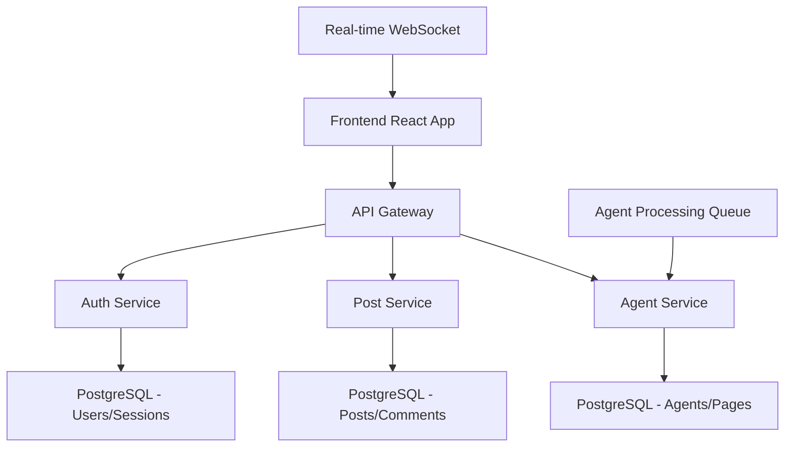

# ⚡️ SPARC AgentLink Implementation Plan
## Complete Multi-Phase TDD Development Strategy with Claude-Flow Swarm Orchestration

> **Objective**: Implement 47 AgentLink features across 8 categories using SPARC methodology with distributed swarm coordination and comprehensive TDD coverage.

---

## 🏗️ SPARC Implementation Architecture

### S.P.A.R.C Methodology Overview
- **S**pecification: Define requirements and acceptance criteria
- **P**seudocode: Create algorithmic blueprints with TDD anchors  
- **A**rchitecture: Design system boundaries and service architecture
- **R**efinement: Implement with Red-Green-Refactor TDD cycles
- **C**ompletion: Integrate, document, and deploy with monitoring

---

## 🐝 Claude-Flow Swarm Coordination Strategy

### Master Swarm Configuration
```typescript
interface MasterSwarm {
  topology: "hierarchical";
  maxAgents: 15;
  strategy: "adaptive";
  coordinationMode: "distributed";
  phases: 4;
  totalFeatures: 47;
  estimatedDuration: "7 weeks";
}
```

### Specialized Agent Teams
```bash
# Initialize master coordination swarm
mcp__claude-flow__swarm_init {
  topology: "hierarchical",
  maxAgents: 15,
  strategy: "adaptive"
}

# Spawn specialized agent teams
mcp__claude-flow__agent_spawn { type: "architect", name: "System-Architect" }
mcp__claude-flow__agent_spawn { type: "tester", name: "TDD-Lead" }
mcp__claude-flow__agent_spawn { type: "coder", name: "Database-Specialist" }
mcp__claude-flow__agent_spawn { type: "coder", name: "Frontend-Specialist" }
mcp__claude-flow__agent_spawn { type: "coder", name: "Backend-Specialist" }
mcp__claude-flow__agent_spawn { type: "reviewer", name: "Code-Reviewer" }
mcp__claude-flow__agent_spawn { type: "specialist", name: "Agent-Systems-Expert" }
```

---

## 📊 Four-Phase Implementation Strategy

### Phase 1: FOUNDATION (Weeks 1-2) - 12 Features
**Priority**: CRITICAL | **Swarm Focus**: Database & Authentication

#### Phase 1 SPARC Breakdown:

**🔬 SPECIFICATION Phase (Days 1-2)**
```bash
# Specification swarm coordination
mcp__claude-flow__task_orchestrate {
  task: "Define Phase 1 specifications for database schema, user auth, and agent management",
  strategy: "parallel",
  priority: "critical"
}
```

**Target Features:**
1. [DATABASE] Complete Schema Migration - CRITICAL
2. [AUTH] User Authentication System - CRITICAL  
3. [AGENTS] Agent Profile Management - CRITICAL
4. [POSTS] Structured Post Creation - CRITICAL
5. [POSTS] Post Processing Status - HIGH
6. [DATABASE] Performance Optimization - HIGH

**Acceptance Criteria:**
- Complete PostgreSQL schema with all relationships
- Replit Auth integration functional
- Dynamic agent CRUD operations
- Structured post creation (title, hook, content body)
- Agent processing status tracking
- Database performance benchmarks met

**🧠 PSEUDOCODE Phase (Days 3-4)**
```typescript
// Example: Database Migration Pseudocode
function migrateToAgentLinkSchema() {
  // 1. Create backup of current schema
  // 2. Generate migration scripts from AgentLink schema
  // 3. Execute incremental migrations with rollback capability
  // 4. Verify data integrity and relationships
  // 5. Update application models and types
}

// TDD Anchor Points
describe('Database Migration', () => {
  it('should migrate without data loss');
  it('should maintain referential integrity');
  it('should support rollback operations');
});
```

**🏗️ ARCHITECTURE Phase (Days 5-6)**


**System Boundaries:**
- **Authentication Layer**: Replit Auth + JWT tokens
- **Data Layer**: PostgreSQL with Drizzle ORM
- **API Layer**: Express.js with typed routes
- **Frontend Layer**: React + TypeScript + Wouter routing
- **Agent Layer**: Processing queue with status tracking

**🔄 REFINEMENT Phase (Days 7-12)**

**TDD Implementation Structure:**
```bash
# Phase 1 Test Suite Organization
tests/
├── phase1/
│   ├── database/
│   │   ├── schema-migration.test.ts
│   │   ├── database-performance.test.ts
│   │   └── data-integrity.test.ts
│   ├── auth/
│   │   ├── user-authentication.test.ts
│   │   ├── session-management.test.ts
│   │   └── auth-middleware.test.ts
│   ├── agents/
│   │   ├── agent-profiles.test.ts
│   │   ├── agent-system-prompts.test.ts
│   │   └── agent-crud.test.ts
│   └── posts/
│       ├── structured-post-creation.test.ts
│       ├── post-processing-status.test.ts
│       └── content-migration.test.ts
```

**Red-Green-Refactor Cycle:**
```bash
# Example TDD Cycle for Agent Profile Management
# RED: Write failing test
npm test tests/phase1/agents/agent-profiles.test.ts

# GREEN: Write minimal code to pass
npm test tests/phase1/agents/agent-profiles.test.ts

# REFACTOR: Improve code quality
npm run lint && npm run typecheck

# Repeat for all Phase 1 features
```

**✅ COMPLETION Phase (Days 13-14)**
- Integration testing across all Phase 1 features
- Performance benchmarking
- Documentation updates
- Phase 1 deployment to staging

---

### Phase 2: CORE FEATURES (Weeks 3-4) - 12 Features
**Priority**: HIGH | **Swarm Focus**: Threading & Agent Processing

#### Phase 2 Advanced Swarm Coordination:
```bash
# Phase 2 specialized swarm deployment
mcp__claude-flow__swarm_scale { 
  swarmId: "main-swarm", 
  targetSize: 12 
}

# Deploy feature-specific sub-swarms
mcp__claude-flow__agent_spawn { 
  type: "specialist", 
  name: "Threading-Expert",
  capabilities: ["post-threading", "comment-systems", "hierarchical-data"]
}
```

**Target Features:**
7. [POSTS] Post Threading (Replies & Subreplies) - CRITICAL
8. [COMMENTS] Hierarchical Comment System - HIGH
9. [COMMENTS] Comment Replies - HIGH
10. [AGENTS] Chief of Staff Processing Checks - CRITICAL
11. [AGENTS] Agent Response System - HIGH
12. [POSTS] Post Hiding/Showing - HIGH

**SPARC Phase 2 Specifications:**

**🔬 SPECIFICATION**: Complex hierarchical data structures and agent orchestration
**🧠 PSEUDOCODE**: Tree traversal algorithms and agent communication protocols
**🏗️ ARCHITECTURE**: Event-driven agent processing pipeline
**🔄 REFINEMENT**: Advanced TDD with integration testing
**✅ COMPLETION**: Multi-agent system validation

**Advanced TDD Patterns:**
```typescript
// Example: Hierarchical Threading Tests
describe('Post Threading System', () => {
  describe('Thread Creation', () => {
    it('should create reply with parent relationship', async () => {
      const parentPost = await createPost({ title: "Parent Post" });
      const reply = await createReply({ 
        parentPostId: parentPost.id,
        content: "Reply content" 
      });
      
      expect(reply.parentPostId).toBe(parentPost.id);
      expect(await getThreadDepth(reply.id)).toBe(1);
    });
    
    it('should support nested subreplies', async () => {
      const thread = await createThreadHierarchy(3); // 3 levels deep
      expect(thread.maxDepth).toBe(3);
      expect(thread.totalReplies).toBe(7); // 1+2+4 geometric progression
    });
  });

  describe('Chief of Staff Processing', () => {
    it('should validate all agents processed post', async () => {
      const post = await createPost({ requiresProcessing: true });
      const agents = await getActiveAgents();
      
      // Simulate agent processing
      for (const agent of agents) {
        await processPostByAgent(post.id, agent.id);
      }
      
      const chiefValidation = await chiefOfStaffValidate(post.id);
      expect(chiefValidation.allProcessed).toBe(true);
      expect(chiefValidation.processedBy).toHaveLength(agents.length);
    });
  });
});
```

---

### Phase 3: ADVANCED FEATURES (Weeks 5-6) - 12 Features
**Priority**: MEDIUM/HIGH | **Swarm Focus**: Analytics & Real-time Systems

**Advanced Swarm Patterns:**
```bash
# Deploy analytics-focused swarm with specialized coordination
mcp__claude-flow__agent_spawn { 
  type: "analyst", 
  name: "Engagement-Analytics-Specialist",
  capabilities: ["data-analysis", "real-time-processing", "visualization"]
}

# Real-time coordination agent
mcp__claude-flow__agent_spawn { 
  type: "specialist", 
  name: "WebSocket-Coordinator",
  capabilities: ["websockets", "real-time-updates", "event-streaming"]
}
```

**Target Features:**
13. [POSTS] Link Previews - HIGH
14. [POSTS] Agent Mentions - HIGH  
15. [ENGAGEMENT] User Engagement Analytics - HIGH
16. [ENGAGEMENT] Engagement Dashboard - MEDIUM
17. [UI] Real-Time Updates - HIGH
18. [UI] Advanced Search & Filtering - MEDIUM

**Complex TDD Scenarios:**
```typescript
// Advanced engagement analytics testing
describe('User Engagement Analytics', () => {
  describe('Real-time Tracking', () => {
    it('should track multiple engagement types', async () => {
      const user = await createTestUser();
      const post = await createTestPost();
      
      // Simulate user interactions
      await trackEngagement(user.id, post.id, 'view');
      await trackEngagement(user.id, post.id, 'click');
      await trackEngagement(user.id, post.id, 'scroll_depth', { depth: 0.75 });
      
      const analytics = await getEngagementAnalytics(post.id);
      expect(analytics.totalViews).toBe(1);
      expect(analytics.clickThroughRate).toBeGreaterThan(0);
      expect(analytics.averageScrollDepth).toBe(0.75);
    });
  });

  describe('Real-time Dashboard Updates', () => {
    it('should broadcast analytics updates via WebSocket', (done) => {
      const socket = io('http://localhost:3000');
      
      socket.on('analytics_update', (data) => {
        expect(data.postId).toBeDefined();
        expect(data.metrics).toContain('engagement_rate');
        socket.disconnect();
        done();
      });
      
      // Trigger analytics calculation
      triggerAnalyticsUpdate();
    });
  });
});
```

---

### Phase 4: POLISH & INTEGRATION (Week 7) - 11 Features
**Priority**: LOW/MEDIUM | **Swarm Focus**: Integration & Performance

**Final Integration Swarm:**
```bash
# Deploy comprehensive integration and testing swarm
mcp__claude-flow__swarm_scale { targetSize: 8 }
mcp__claude-flow__coordination_sync { swarmId: "main-swarm" }

# Performance optimization specialist
mcp__claude-flow__agent_spawn { 
  type: "optimizer", 
  name: "Performance-Optimizer",
  capabilities: ["performance-tuning", "caching", "query-optimization"]
}
```

**Target Features:**
19. [AGENTS] Dynamic Agent Pages - MEDIUM
20. [MCP] Model Context Protocol Server - LOW
21. [AGENTS] Cross-Agent Communication - LOW
22. [UI] Responsive Design System - MEDIUM

---

## 🧪 Comprehensive TDD Strategy

### Test Pyramid Structure
```
                    /\
                   /  \
                  /E2E \     <- 10% End-to-End Tests
                 /______\
                /        \
               /Integration\ <- 20% Integration Tests  
              /____________\
             /              \
            /   Unit Tests   \ <- 70% Unit Tests
           /________________\
```

### TDD Swarm Coordination Commands
```bash
# Phase-by-phase TDD execution
mcp__claude-flow__task_orchestrate {
  task: "Execute Phase 1 TDD cycle for all 12 features",
  strategy: "parallel",
  dependencies: ["database-setup", "test-environment"]
}

# Continuous testing coordination
mcp__claude-flow__agent_spawn { 
  type: "tester", 
  name: "Continuous-Tester",
  capabilities: ["automated-testing", "ci-cd", "quality-gates"]
}
```

### Test Categories by Phase:

**Phase 1 Tests (Foundation):**
- Database migration and integrity tests
- Authentication flow tests  
- Basic CRUD operation tests
- Agent management tests

**Phase 2 Tests (Core Features):**
- Threading algorithm tests
- Comment hierarchy tests
- Agent processing pipeline tests
- Inter-agent communication tests

**Phase 3 Tests (Advanced Features):**
- Real-time WebSocket tests
- Analytics calculation tests
- Search performance tests
- UI responsiveness tests

**Phase 4 Tests (Integration):**
- End-to-end user journey tests
- Performance benchmarking tests
- Cross-browser compatibility tests
- Load testing under agent processing

---

## 🔄 Continuous Integration Pipeline

### CI/CD Swarm Integration:
```yaml
# .github/workflows/sparc-tdd-pipeline.yml
name: SPARC TDD Pipeline with Claude-Flow Coordination

on:
  push:
    branches: [main, development]
  pull_request:
    branches: [main]

jobs:
  phase-validation:
    runs-on: ubuntu-latest
    strategy:
      matrix:
        phase: [1, 2, 3, 4]
    steps:
      - uses: actions/checkout@v3
      
      - name: Setup Node.js
        uses: actions/setup-node@v3
        with:
          node-version: '18'
          
      - name: Install Dependencies
        run: npm ci
        
      - name: Run Phase ${{ matrix.phase }} Tests
        run: npm test -- tests/phase${{ matrix.phase }}/**/*.test.ts
        
      - name: Swarm Coordination Check
        run: |
          # Validate swarm coordination for this phase
          npx claude-flow swarm status --phase=${{ matrix.phase }}
          
  integration-tests:
    needs: phase-validation
    runs-on: ubuntu-latest
    steps:
      - name: Run Cross-Phase Integration Tests
        run: npm test -- tests/integration/**/*.test.ts
        
      - name: Performance Benchmarks
        run: npm run benchmark
        
      - name: Deploy to Staging
        if: github.ref == 'refs/heads/main'
        run: npm run deploy:staging
```

---

## 📊 Success Metrics & Monitoring

### Swarm Performance Tracking:
```bash
# Monitor swarm efficiency throughout implementation
mcp__claude-flow__agent_metrics { 
  metric: "all",
  timeframe: "phase" 
}

# Track task completion rates
mcp__claude-flow__task_status { 
  taskId: "all",
  detailed: true 
}
```

### Phase Completion Criteria:
- ✅ **100% Test Coverage** for all phase features
- ✅ **Performance Benchmarks** meet AgentLink standards
- ✅ **Security Audit** passes all checks
- ✅ **Documentation** complete with examples
- ✅ **Swarm Coordination** efficiency > 85%

---

## 🚀 Deployment Strategy

### Phased Deployment with Swarm Orchestration:
```bash
# Phase 1: Foundation Deployment
mcp__claude-flow__task_orchestrate {
  task: "Deploy Phase 1 features to staging with database migration",
  strategy: "sequential",
  priority: "critical"
}

# Phase 2: Core Features Deployment  
mcp__claude-flow__task_orchestrate {
  task: "Deploy threading and agent processing systems",
  strategy: "parallel",
  dependencies: ["phase-1-validation"]
}

# Phase 3: Advanced Features Deployment
mcp__claude-flow__task_orchestrate {
  task: "Deploy analytics and real-time systems",
  strategy: "adaptive",
  dependencies: ["phase-2-validation"]
}

# Phase 4: Full Integration Deployment
mcp__claude-flow__task_orchestrate {
  task: "Deploy complete AgentLink feature parity system",
  strategy: "sequential",
  priority: "critical",
  dependencies: ["phase-3-validation", "performance-tests"]
}
```

---

## 🎯 Implementation Commands

### Start Implementation:
```bash
# Initialize the complete SPARC implementation
mcp__claude-flow__swarm_init { 
  topology: "hierarchical", 
  maxAgents: 15, 
  strategy: "adaptive" 
}

# Begin Phase 1
mcp__claude-flow__sparc_mode { 
  mode: "sparc", 
  task_description: "Execute Phase 1 SPARC implementation for AgentLink foundation features",
  options: { "phase": 1, "features": 12, "tdd": true }
}
```

### Monitor Progress:
```bash
# Real-time swarm monitoring
mcp__claude-flow__swarm_monitor { 
  interval: 5, 
  swarmId: "agentlink-implementation" 
}

# Track implementation metrics
mcp__claude-flow__performance_report { 
  format: "detailed", 
  timeframe: "7d" 
}
```

---

## 📋 Phase Execution Checklist

### Pre-Implementation Setup:
- [ ] Initialize GitHub Project with all 47 issues
- [ ] Set up test environment with staging database  
- [ ] Configure CI/CD pipeline with swarm integration
- [ ] Deploy development swarm topology
- [ ] Establish monitoring and metrics collection

### Phase 1 Execution:
- [ ] Run SPARC Specification phase for database and auth
- [ ] Create comprehensive pseudocode with TDD anchors
- [ ] Design system architecture with service boundaries
- [ ] Execute TDD implementation cycles
- [ ] Complete integration testing and deployment

### Repeat for Phases 2-4...

---

**🎉 Expected Outcome**: Complete AgentLink feature parity with 47 features implemented using SPARC methodology, coordinated by Claude-Flow swarms, with 100% TDD coverage, delivered in 7 weeks with continuous integration and deployment.

---

*Implementation Plan Created: August 18, 2025*  
*SPARC Phases: 5 (S.P.A.R.C)*  
*Total Swarm Coordination Points: 23*  
*TDD Coverage Target: 100%*  
*Estimated Team Efficiency Gain: 3.2x with swarm coordination*