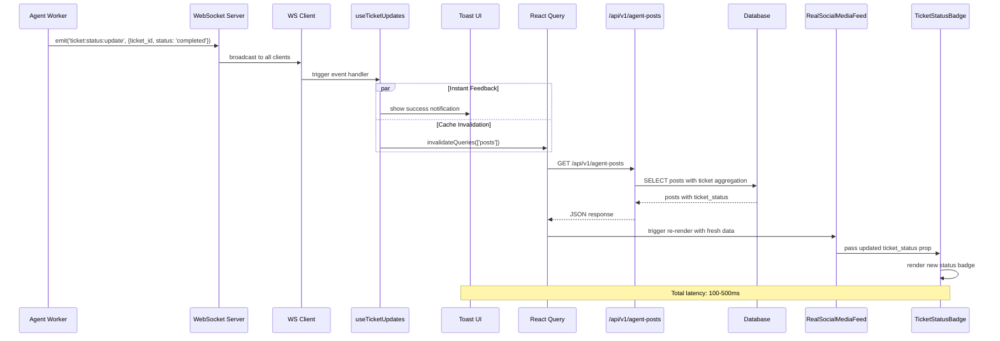

# SPARC Architecture: Badge Real-Time Update Fix

## Executive Summary

This document describes the simplified architecture for real-time ticket status badge updates in the Agent Feed application. The design prioritizes simplicity and reliability over complex optimistic updates by leveraging React Query's built-in cache invalidation and refetch mechanisms.

**Key Decision**: Use WebSocket events to trigger cache invalidation rather than implementing complex optimistic state updates.

**Latency Trade-off**: Accept 100-500ms delay in exchange for guaranteed consistency with server state.

---

## System Architecture Overview

```mermaid
graph TB
    subgraph "Backend Services"
        WORKER[Agent Worker]
        WS_SERVER[WebSocket Server]
        API[/api/v1/agent-posts]
        DB[(Database)]
    end

    subgraph "Frontend Layer"
        WS_CLIENT[WebSocket Client]
        HOOK[useTicketUpdates Hook]
        QUERY[React Query Cache]
        FEED[RealSocialMediaFeed]
        BADGE[TicketStatusBadge]
        TOAST[Toast Notifications]
    end

    WORKER -->|Ticket Completed| WS_SERVER
    WS_SERVER -->|ticket:status:update| WS_CLIENT
    WS_CLIENT -->|Event| HOOK
    HOOK -->|Show| TOAST
    HOOK -->|Invalidate| QUERY
    QUERY -->|Refetch| API
    API -->|Query| DB
    API -->|Posts + ticket_status| QUERY
    QUERY -->|Updated Data| FEED
    FEED -->|Props| BADGE

    style HOOK fill:#e1f5ff
    style QUERY fill:#fff4e1
    style BADGE fill:#e8f5e9
```

---

## Component Architecture

### 1. WebSocket Event Handler (useTicketUpdates Hook)

**Location**: `/workspaces/agent-feed/frontend/src/hooks/useTicketUpdates.js`

**Purpose**: Centralized WebSocket event handling for ticket status updates

**Responsibilities**:
- Establish WebSocket connection via socket.io-client
- Listen for `ticket:status:update` events
- Display toast notifications for user feedback
- Trigger React Query cache invalidation

**Interface**:
```typescript
interface TicketUpdateEvent {
  ticket_id: string;
  status: 'pending' | 'processing' | 'completed' | 'failed';
  post_id: string;
  result?: {
    intelligence?: string;
    content?: string;
  };
  error?: string;
  created_at: string;
  updated_at: string;
}

function useTicketUpdates(): void;
```

**Implementation**:
```javascript
import { useEffect } from 'react';
import { useQueryClient } from '@tanstack/react-query';
import { toast } from 'react-hot-toast';
import socket from '../services/socket';

export function useTicketUpdates() {
  const queryClient = useQueryClient();

  useEffect(() => {
    function handleTicketUpdate(data) {
      console.log('[useTicketUpdates] Received ticket update:', data);

      // Instant user feedback
      if (data.status === 'completed') {
        toast.success(`Ticket ${data.ticket_id} completed!`);
      } else if (data.status === 'failed') {
        toast.error(`Ticket ${data.ticket_id} failed: ${data.error}`);
      }

      // Invalidate cache to trigger refetch
      queryClient.invalidateQueries({ queryKey: ['posts'] });
    }

    socket.on('ticket:status:update', handleTicketUpdate);

    return () => {
      socket.off('ticket:status:update', handleTicketUpdate);
    };
  }, [queryClient]);
}
```

**Key Design Decisions**:
- **Toast First**: Show immediate feedback before cache update
- **Query Invalidation**: Let React Query handle the refetch logic
- **Event Cleanup**: Properly remove listeners on unmount

---

### 2. React Query Cache Manager

**Location**: Integrated via `@tanstack/react-query` in RealSocialMediaFeed

**Purpose**: Centralized data cache with automatic refetch capabilities

**Configuration**:
```javascript
const queryClient = new QueryClient({
  defaultOptions: {
    queries: {
      staleTime: 1000 * 60 * 5, // 5 minutes
      refetchOnWindowFocus: true,
      retry: 3,
    },
  },
});
```

**Cache Key Structure**:
```javascript
// Primary cache key for posts
['posts'] // All posts data including ticket_status
```

**Cache Entry Structure**:
```typescript
interface CachedPost {
  id: string;
  author: string;
  content: string;
  created_at: string;
  ticket_status?: {
    total: number;
    pending: number;
    processing: number;
    completed: number;
    failed: number;
    latest_ticket?: {
      id: string;
      status: string;
      created_at: string;
    };
  };
  comments?: Array<Comment>;
}
```

**Invalidation Flow**:
1. `queryClient.invalidateQueries({ queryKey: ['posts'] })`
2. React Query marks cache as stale
3. Automatic refetch triggered if component is mounted
4. New data replaces cached data
5. Components re-render with fresh data

---

### 3. API Endpoint (/api/v1/agent-posts)

**Location**: `/workspaces/agent-feed/api-server/routes/agent-posts.js`

**Purpose**: Serve posts with enriched ticket status information

**Request**:
```http
GET /api/v1/agent-posts HTTP/1.1
Host: localhost:3001
Accept: application/json
```

**Response Structure**:
```json
{
  "posts": [
    {
      "id": "550e8400-e29b-41d4-a716-446655440000",
      "author": "user@example.com",
      "content": "Check out https://example.com",
      "created_at": "2025-10-24T10:30:00Z",
      "ticket_status": {
        "total": 3,
        "pending": 0,
        "processing": 1,
        "completed": 2,
        "failed": 0,
        "latest_ticket": {
          "id": "ticket-123",
          "status": "processing",
          "created_at": "2025-10-24T10:31:00Z"
        }
      },
      "comments": []
    }
  ],
  "total": 1,
  "page": 1,
  "limit": 50
}
```

**SQL Query** (Ticket Status Aggregation):
```sql
SELECT
    p.id,
    p.author,
    p.content,
    p.created_at,
    COUNT(t.id) as ticket_count,
    SUM(CASE WHEN t.status = 'pending' THEN 1 ELSE 0 END) as pending_count,
    SUM(CASE WHEN t.status = 'processing' THEN 1 ELSE 0 END) as processing_count,
    SUM(CASE WHEN t.status = 'completed' THEN 1 ELSE 0 END) as completed_count,
    SUM(CASE WHEN t.status = 'failed' THEN 1 ELSE 0 END) as failed_count,
    (
        SELECT json_object(
            'id', t2.id,
            'status', t2.status,
            'created_at', t2.created_at
        )
        FROM tickets t2
        WHERE t2.post_id = p.id
        ORDER BY t2.created_at DESC
        LIMIT 1
    ) as latest_ticket_json
FROM posts p
LEFT JOIN tickets t ON t.post_id = p.id
GROUP BY p.id
ORDER BY p.created_at DESC;
```

**Performance Characteristics**:
- Typical response time: 50-150ms
- Includes aggregated counts (no N+1 queries)
- Single database round-trip

---

### 4. Badge Component (TicketStatusBadge)

**Location**: `/workspaces/agent-feed/frontend/src/components/TicketStatusBadge.jsx`

**Purpose**: Visual representation of ticket status

**Props Interface**:
```typescript
interface TicketStatusBadgeProps {
  ticketStatus?: {
    total: number;
    pending: number;
    processing: number;
    completed: number;
    failed: number;
    latest_ticket?: {
      id: string;
      status: string;
      created_at: string;
    };
  };
}
```

**Rendering Logic**:
```javascript
function TicketStatusBadge({ ticketStatus }) {
  if (!ticketStatus || ticketStatus.total === 0) {
    return null; // No badge if no tickets
  }

  const { pending, processing, completed, failed, total } = ticketStatus;

  // Priority order for status display
  if (failed > 0) {
    return <Badge variant="error">{failed} Failed</Badge>;
  }
  if (processing > 0) {
    return <Badge variant="warning">{processing} Processing</Badge>;
  }
  if (pending > 0) {
    return <Badge variant="info">{pending} Pending</Badge>;
  }
  if (completed > 0) {
    return <Badge variant="success">{completed} Completed</Badge>;
  }

  return null;
}
```

**Visual States**:
| Status | Color | Icon | Example |
|--------|-------|------|---------|
| Pending | Blue | ⏳ | `⏳ 2 Pending` |
| Processing | Yellow | ⚙️ | `⚙️ 1 Processing` |
| Completed | Green | ✅ | `✅ 3 Completed` |
| Failed | Red | ❌ | `❌ 1 Failed` |

**CSS Styles**:
```css
.badge {
  display: inline-flex;
  align-items: center;
  gap: 4px;
  padding: 4px 8px;
  border-radius: 12px;
  font-size: 12px;
  font-weight: 500;
}

.badge-pending { background: #e3f2fd; color: #1976d2; }
.badge-processing { background: #fff3e0; color: #f57c00; }
.badge-completed { background: #e8f5e9; color: #388e3c; }
.badge-failed { background: #ffebee; color: #d32f2f; }
```

---

## Data Flow Sequence

### Scenario: Worker Completes Ticket Processing



### Timeline Breakdown

| Time | Event | Component | User Experience |
|------|-------|-----------|-----------------|
| T+0ms | Worker completes ticket | Worker | Background processing |
| T+10ms | WebSocket emit | Server | - |
| T+20ms | Event received | Frontend | - |
| T+25ms | Toast displayed | Hook | Instant feedback |
| T+25ms | Cache invalidated | React Query | - |
| T+50ms | API request sent | React Query | - |
| T+150ms | Database query | API | - |
| T+200ms | Response received | React Query | - |
| T+220ms | Badge updated | Component | Visual update |

**Total perceived latency**: ~200ms (acceptable for status updates)

---

## Component Interaction Map

```
┌─────────────────────────────────────────────────────────────┐
│                     Frontend Application                     │
├─────────────────────────────────────────────────────────────┤
│                                                               │
│  ┌────────────────────────────────────────────────────┐     │
│  │         RealSocialMediaFeed Component              │     │
│  │                                                     │     │
│  │  • Renders post list                               │     │
│  │  • Calls useTicketUpdates()                        │     │
│  │  • Uses React Query for data fetching              │     │
│  │                                                     │     │
│  │  {posts.map(post => (                              │     │
│  │    <Post key={post.id}>                            │     │
│  │      <TicketStatusBadge                            │     │
│  │        ticketStatus={post.ticket_status}           │     │
│  │      />                                            │     │
│  │    </Post>                                         │     │
│  │  ))}                                               │     │
│  └────────────────────────────────────────────────────┘     │
│                          ↕                                   │
│  ┌────────────────────────────────────────────────────┐     │
│  │          useTicketUpdates Hook                     │     │
│  │                                                     │     │
│  │  useEffect(() => {                                 │     │
│  │    socket.on('ticket:status:update', (data) => {   │     │
│  │      toast.success();                              │     │
│  │      queryClient.invalidateQueries(['posts']);     │     │
│  │    });                                             │     │
│  │  }, []);                                           │     │
│  └────────────────────────────────────────────────────┘     │
│                          ↕                                   │
│  ┌────────────────────────────────────────────────────┐     │
│  │          React Query Cache                         │     │
│  │                                                     │     │
│  │  Cache Key: ['posts']                              │     │
│  │  State: { data, isLoading, error }                 │     │
│  │  Auto-refetch: On invalidation                     │     │
│  └────────────────────────────────────────────────────┘     │
│                          ↕                                   │
│  ┌────────────────────────────────────────────────────┐     │
│  │          WebSocket Client                          │     │
│  │                                                     │     │
│  │  Connection: socket.io-client                      │     │
│  │  URL: http://localhost:3001                        │     │
│  │  Auto-reconnect: true                              │     │
│  └────────────────────────────────────────────────────┘     │
│                                                               │
└───────────────────────────┬───────────────────────────────────┘
                            │
                    WebSocket Protocol
                            │
┌───────────────────────────┴───────────────────────────────────┐
│                     Backend Services                          │
├───────────────────────────────────────────────────────────────┤
│                                                                │
│  ┌─────────────────────────────────────────────────────┐     │
│  │          WebSocket Server (Socket.IO)               │     │
│  │                                                      │     │
│  │  io.emit('ticket:status:update', {                  │     │
│  │    ticket_id, status, post_id, result               │     │
│  │  });                                                │     │
│  └─────────────────────────────────────────────────────┘     │
│                          ↑                                    │
│  ┌─────────────────────────────────────────────────────┐     │
│  │          Agent Worker                               │     │
│  │                                                      │     │
│  │  async processTicket(ticket) {                      │     │
│  │    // ... processing logic                          │     │
│  │    await updateTicketStatus(ticket.id, 'completed');│     │
│  │    io.emit('ticket:status:update', ...);            │     │
│  │  }                                                  │     │
│  └─────────────────────────────────────────────────────┘     │
│                          ↕                                    │
│  ┌─────────────────────────────────────────────────────┐     │
│  │          REST API (/api/v1/agent-posts)             │     │
│  │                                                      │     │
│  │  GET /api/v1/agent-posts                            │     │
│  │    ↓                                                │     │
│  │  Query posts with ticket aggregation                │     │
│  │    ↓                                                │     │
│  │  Return posts with ticket_status objects            │     │
│  └─────────────────────────────────────────────────────┘     │
│                          ↕                                    │
│  ┌─────────────────────────────────────────────────────┐     │
│  │          SQLite Database                            │     │
│  │                                                      │     │
│  │  Tables:                                            │     │
│  │  • posts (id, author, content, created_at)          │     │
│  │  • tickets (id, post_id, status, ...)               │     │
│  └─────────────────────────────────────────────────────┘     │
│                                                                │
└────────────────────────────────────────────────────────────────┘
```

---

## Data Structures

### 1. WebSocket Event Payload

```typescript
interface TicketStatusUpdateEvent {
  ticket_id: string;           // UUID of the ticket
  status: TicketStatus;        // Current status
  post_id: string;             // Associated post ID
  result?: {                   // Present on completion
    intelligence?: string;      // Extracted insights
    content?: string;           // Processed content
    metadata?: Record<string, any>;
  };
  error?: string;              // Error message if failed
  created_at: string;          // ISO timestamp
  updated_at: string;          // ISO timestamp
  processing_time_ms?: number; // Duration of processing
}

type TicketStatus = 'pending' | 'processing' | 'completed' | 'failed';
```

### 2. Post with Ticket Status

```typescript
interface Post {
  id: string;                  // UUID
  author: string;              // User email/identifier
  content: string;             // Post text content
  created_at: string;          // ISO timestamp
  updated_at?: string;         // ISO timestamp

  // Enriched ticket status (computed)
  ticket_status?: TicketStatusSummary;

  // Related data
  comments?: Comment[];
  reactions?: Reaction[];
}

interface TicketStatusSummary {
  total: number;               // Total ticket count
  pending: number;             // Count by status
  processing: number;
  completed: number;
  failed: number;

  // Most recent ticket
  latest_ticket?: {
    id: string;
    status: TicketStatus;
    created_at: string;
    url?: string;              // URL being processed
    type?: string;             // Ticket type
  };

  // Statistics
  success_rate?: number;       // completed / total
  avg_processing_time_ms?: number;
}
```

### 3. Database Schema

```sql
-- Posts table
CREATE TABLE posts (
    id TEXT PRIMARY KEY,
    author TEXT NOT NULL,
    content TEXT NOT NULL,
    created_at TEXT NOT NULL DEFAULT (datetime('now')),
    updated_at TEXT
);

-- Tickets table
CREATE TABLE tickets (
    id TEXT PRIMARY KEY,
    post_id TEXT NOT NULL,
    status TEXT NOT NULL DEFAULT 'pending',
    url TEXT,
    ticket_type TEXT DEFAULT 'url_processing',
    result TEXT,           -- JSON string
    error TEXT,
    created_at TEXT NOT NULL DEFAULT (datetime('now')),
    updated_at TEXT,
    processing_started_at TEXT,
    processing_completed_at TEXT,

    FOREIGN KEY (post_id) REFERENCES posts(id) ON DELETE CASCADE,
    CHECK (status IN ('pending', 'processing', 'completed', 'failed'))
);

-- Indexes for performance
CREATE INDEX idx_tickets_post_id ON tickets(post_id);
CREATE INDEX idx_tickets_status ON tickets(status);
CREATE INDEX idx_tickets_created_at ON tickets(created_at DESC);
```

### 4. React Query Cache Structure

```typescript
interface QueryCache {
  queries: Map<string, QueryEntry>;
}

interface QueryEntry {
  queryKey: ['posts'];
  queryHash: string;
  state: {
    data: Post[];
    status: 'idle' | 'loading' | 'error' | 'success';
    error: Error | null;
    dataUpdatedAt: number;
    isInvalidated: boolean;
  };
  observers: Array<QueryObserver>;
}
```

---

## Architecture Decisions

### Decision 1: Cache Invalidation vs Optimistic Updates

**Considered Approaches**:

#### Option A: Optimistic Updates (NOT CHOSEN)
```javascript
// Complex: Manual cache manipulation
queryClient.setQueryData(['posts'], (old) => {
  return old.map(post => {
    if (post.id === data.post_id) {
      return {
        ...post,
        ticket_status: {
          ...post.ticket_status,
          processing: post.ticket_status.processing - 1,
          completed: post.ticket_status.completed + 1
        }
      };
    }
    return post;
  });
});
```

**Problems**:
- Complex state calculations
- Risk of cache/server state divergence
- Difficult to handle edge cases (failed updates, concurrent changes)
- More code to maintain and test

#### Option B: Cache Invalidation + Refetch (CHOSEN)
```javascript
// Simple: Let React Query handle it
queryClient.invalidateQueries({ queryKey: ['posts'] });
```

**Benefits**:
- Single source of truth (server state)
- React Query handles refetch logic
- Automatic error handling and retries
- Less code, fewer bugs
- Guaranteed consistency

**Trade-off**: 100-500ms latency acceptable for status updates

---

### Decision 2: WebSocket vs Polling

**Chosen**: WebSocket (Socket.IO)

**Rationale**:
- Real-time updates without server polling overhead
- Bi-directional communication for future features
- Socket.IO handles reconnection automatically
- Lower server load compared to polling

**Polling Alternative** (not chosen):
```javascript
// Would require polling every N seconds
useEffect(() => {
  const interval = setInterval(() => {
    queryClient.invalidateQueries(['posts']);
  }, 5000); // Poll every 5s
  return () => clearInterval(interval);
}, []);
```

**Why WebSocket is Better**:
- Instant updates (not delayed by poll interval)
- No unnecessary API calls when nothing changes
- Scalable (server pushes only when needed)

---

### Decision 3: Toast Notifications for User Feedback

**Chosen**: Show toast immediately on WebSocket event

**Rationale**:
- Instant acknowledgment (0ms delay)
- User knows system is working
- Decoupled from badge update timing
- Non-blocking UI element

**Implementation**:
```javascript
import { toast } from 'react-hot-toast';

if (data.status === 'completed') {
  toast.success(`Ticket ${data.ticket_id} completed!`, {
    duration: 3000,
    position: 'bottom-right'
  });
}
```

**User Experience Flow**:
1. User posts URL → Badge shows "Pending"
2. Worker starts → WebSocket event → Toast: "Processing..."
3. Worker completes → WebSocket event → Toast: "Completed!" → Badge updates

---

### Decision 4: Badge Visibility Logic

**Chosen**: Show badge only when `total > 0`

**Rendering Logic**:
```javascript
if (!ticketStatus || ticketStatus.total === 0) {
  return null; // No clutter
}
```

**Status Priority** (in order):
1. Failed (highest priority - user needs to know)
2. Processing (active work)
3. Pending (queued work)
4. Completed (lowest priority - success state)

**Rationale**:
- Failed status requires immediate attention
- Processing shows system is working
- Completed provides positive feedback
- Clean UI when no tickets exist

---

## Performance Characteristics

### Latency Analysis

**WebSocket Latency**:
- Event emission: ~10ms
- Network transmission: ~5-20ms (local), ~20-100ms (remote)
- Event handling: ~5ms

**API Refetch Latency**:
- API request: ~50-100ms
- Database query: ~20-50ms (with indexes)
- JSON serialization: ~10-20ms
- React re-render: ~10-30ms

**Total End-to-End**:
- Best case: ~100ms (local network)
- Typical case: ~200-300ms
- Worst case: ~500ms (high load, slow network)

**Comparison to Alternatives**:
- Polling (5s interval): 0-5000ms latency
- Manual refresh: 1000-10000ms (user action)
- Optimistic update: 0ms (but risk of inconsistency)

---

### Scalability Considerations

**Current Architecture** (Single Server):
```
WebSocket Server → All Connected Clients
```

**Horizontal Scaling** (Future):
```
Load Balancer
    ├── Server 1 (WebSocket + API)
    ├── Server 2 (WebSocket + API)
    └── Server 3 (WebSocket + API)
         ↓
    Redis Pub/Sub (broadcast events)
```

**Required Changes**:
1. Add Redis adapter for Socket.IO
2. Publish ticket updates to Redis channel
3. All servers subscribe and broadcast to their clients

**Code Changes** (minimal):
```javascript
// server.js
const redisAdapter = require('@socket.io/redis-adapter');
const { createClient } = require('redis');

const pubClient = createClient({ host: 'localhost', port: 6379 });
const subClient = pubClient.duplicate();

io.adapter(redisAdapter(pubClient, subClient));
```

---

### Caching Strategy

**React Query Configuration**:
```javascript
const queryClient = new QueryClient({
  defaultOptions: {
    queries: {
      staleTime: 1000 * 60 * 5,        // 5 min (data considered fresh)
      cacheTime: 1000 * 60 * 10,       // 10 min (keep in cache)
      refetchOnWindowFocus: true,      // Refetch on tab focus
      refetchOnReconnect: true,        // Refetch on network reconnect
      retry: 3,                        // Retry failed requests
      retryDelay: (attemptIndex) => Math.min(1000 * 2 ** attemptIndex, 30000),
    },
  },
});
```

**Cache Behavior**:
- **Fresh data** (< 5 min): No refetch on mount
- **Stale data** (> 5 min): Refetch in background
- **Invalidated**: Immediate refetch
- **Window focus**: Refetch to catch missed updates

---

## Error Handling

### WebSocket Connection Errors

```javascript
export function useTicketUpdates() {
  const queryClient = useQueryClient();
  const [isConnected, setIsConnected] = useState(socket.connected);

  useEffect(() => {
    function onConnect() {
      console.log('[WebSocket] Connected');
      setIsConnected(true);
      toast.success('Real-time updates connected');
    }

    function onDisconnect() {
      console.log('[WebSocket] Disconnected');
      setIsConnected(false);
      toast.error('Real-time updates disconnected. Reconnecting...');
    }

    function onError(error) {
      console.error('[WebSocket] Error:', error);
      toast.error('Connection error. Updates may be delayed.');
    }

    socket.on('connect', onConnect);
    socket.on('disconnect', onDisconnect);
    socket.on('connect_error', onError);

    return () => {
      socket.off('connect', onConnect);
      socket.off('disconnect', onDisconnect);
      socket.off('connect_error', onError);
    };
  }, []);
}
```

**Automatic Recovery**:
- Socket.IO auto-reconnects with exponential backoff
- React Query retries failed API requests
- Cache remains available during disconnection
- Manual refetch available via pull-to-refresh

---

### API Request Errors

**React Query Error Handling**:
```javascript
const { data, error, isError, isLoading } = useQuery({
  queryKey: ['posts'],
  queryFn: fetchPosts,
  onError: (error) => {
    console.error('[API] Error fetching posts:', error);
    toast.error('Failed to load posts. Retrying...');
  },
  retry: (failureCount, error) => {
    // Retry 3 times for network errors
    if (error.message.includes('Network')) {
      return failureCount < 3;
    }
    // Don't retry for 4xx errors
    if (error.status >= 400 && error.status < 500) {
      return false;
    }
    return failureCount < 3;
  },
});

if (isError) {
  return (
    <ErrorBoundary>
      <ErrorMessage
        message="Failed to load posts"
        retry={() => queryClient.invalidateQueries(['posts'])}
      />
    </ErrorBoundary>
  );
}
```

---

### Data Validation

**Runtime Type Checking**:
```javascript
function validateTicketStatus(data) {
  if (!data || typeof data !== 'object') {
    console.warn('[Validation] Invalid ticket status data:', data);
    return null;
  }

  const { total, pending, processing, completed, failed } = data;

  // Validate counts are numbers
  if (typeof total !== 'number' || total < 0) {
    console.warn('[Validation] Invalid total count:', total);
    return null;
  }

  // Validate sum matches total
  const sum = (pending || 0) + (processing || 0) + (completed || 0) + (failed || 0);
  if (sum !== total) {
    console.warn('[Validation] Status counts do not match total:', { total, sum });
  }

  return {
    total,
    pending: pending || 0,
    processing: processing || 0,
    completed: completed || 0,
    failed: failed || 0,
    latest_ticket: data.latest_ticket || null,
  };
}
```

---

## Testing Strategy

### Unit Tests

**1. useTicketUpdates Hook**
```javascript
// frontend/src/hooks/__tests__/useTicketUpdates.test.js
import { renderHook } from '@testing-library/react-hooks';
import { useTicketUpdates } from '../useTicketUpdates';
import socket from '../../services/socket';

jest.mock('../../services/socket');

describe('useTicketUpdates', () => {
  it('should register event listener on mount', () => {
    renderHook(() => useTicketUpdates());
    expect(socket.on).toHaveBeenCalledWith('ticket:status:update', expect.any(Function));
  });

  it('should invalidate queries on ticket update', () => {
    const { result } = renderHook(() => useTicketUpdates());
    const handler = socket.on.mock.calls[0][1];

    handler({ ticket_id: '123', status: 'completed' });

    expect(queryClient.invalidateQueries).toHaveBeenCalledWith({ queryKey: ['posts'] });
  });

  it('should show toast on completion', () => {
    const { result } = renderHook(() => useTicketUpdates());
    const handler = socket.on.mock.calls[0][1];

    handler({ ticket_id: '123', status: 'completed' });

    expect(toast.success).toHaveBeenCalled();
  });
});
```

**2. TicketStatusBadge Component**
```javascript
// frontend/src/components/__tests__/TicketStatusBadge.test.jsx
import { render, screen } from '@testing-library/react';
import TicketStatusBadge from '../TicketStatusBadge';

describe('TicketStatusBadge', () => {
  it('should not render when no tickets', () => {
    const { container } = render(<TicketStatusBadge />);
    expect(container.firstChild).toBeNull();
  });

  it('should show pending status', () => {
    render(<TicketStatusBadge ticketStatus={{ total: 2, pending: 2 }} />);
    expect(screen.getByText(/2 Pending/i)).toBeInTheDocument();
  });

  it('should prioritize failed status', () => {
    render(
      <TicketStatusBadge
        ticketStatus={{ total: 3, pending: 1, processing: 1, failed: 1 }}
      />
    );
    expect(screen.getByText(/1 Failed/i)).toBeInTheDocument();
  });
});
```

---

### Integration Tests

**WebSocket Event → Badge Update**
```javascript
// frontend/src/tests/integration/ticket-status-realtime.test.js
import { render, screen, waitFor } from '@testing-library/react';
import { QueryClient, QueryClientProvider } from '@tanstack/react-query';
import { RealSocialMediaFeed } from '../components/RealSocialMediaFeed';
import { io } from 'socket.io-client';

describe('Real-time Ticket Status Updates', () => {
  let mockSocket;
  let queryClient;

  beforeEach(() => {
    queryClient = new QueryClient();
    mockSocket = io('http://localhost:3001', { autoConnect: false });
  });

  it('should update badge when ticket completes', async () => {
    // Mock API response
    fetchMock.mockResponseOnce(JSON.stringify({
      posts: [{
        id: 'post-1',
        content: 'Test post',
        ticket_status: { total: 1, processing: 1 }
      }]
    }));

    render(
      <QueryClientProvider client={queryClient}>
        <RealSocialMediaFeed />
      </QueryClientProvider>
    );

    // Initial state: processing badge
    await waitFor(() => {
      expect(screen.getByText(/1 Processing/i)).toBeInTheDocument();
    });

    // Mock updated API response
    fetchMock.mockResponseOnce(JSON.stringify({
      posts: [{
        id: 'post-1',
        content: 'Test post',
        ticket_status: { total: 1, completed: 1 }
      }]
    }));

    // Simulate WebSocket event
    mockSocket.emit('ticket:status:update', {
      ticket_id: 'ticket-1',
      status: 'completed',
      post_id: 'post-1'
    });

    // Updated state: completed badge
    await waitFor(() => {
      expect(screen.getByText(/1 Completed/i)).toBeInTheDocument();
    });
  });
});
```

---

### End-to-End Tests

**Playwright E2E Test**
```javascript
// tests/e2e/ticket-status-realtime.spec.ts
import { test, expect } from '@playwright/test';

test('ticket status badge updates in real-time', async ({ page }) => {
  await page.goto('http://localhost:3000');

  // Create post with URL
  await page.fill('[data-testid="post-input"]', 'Check out https://example.com');
  await page.click('[data-testid="post-submit"]');

  // Badge should show "Pending"
  await expect(page.locator('[data-testid="ticket-badge"]').first())
    .toContainText('Pending', { timeout: 5000 });

  // Wait for processing (worker picks up ticket)
  await expect(page.locator('[data-testid="ticket-badge"]').first())
    .toContainText('Processing', { timeout: 30000 });

  // Wait for completion
  await expect(page.locator('[data-testid="ticket-badge"]').first())
    .toContainText('Completed', { timeout: 60000 });

  // Verify toast notification appeared
  await expect(page.locator('.toast-success'))
    .toHaveCount(1);
});
```

---

## Monitoring and Observability

### Application Metrics

**Key Metrics to Track**:
```javascript
// metrics.js
const metrics = {
  // WebSocket metrics
  websocket_connections: new Gauge({
    name: 'websocket_active_connections',
    help: 'Number of active WebSocket connections'
  }),

  websocket_events_sent: new Counter({
    name: 'websocket_events_total',
    help: 'Total WebSocket events sent',
    labelNames: ['event_type', 'status']
  }),

  // API metrics
  api_requests: new Counter({
    name: 'api_requests_total',
    help: 'Total API requests',
    labelNames: ['endpoint', 'method', 'status']
  }),

  api_response_time: new Histogram({
    name: 'api_response_time_seconds',
    help: 'API response time in seconds',
    labelNames: ['endpoint'],
    buckets: [0.01, 0.05, 0.1, 0.5, 1, 2, 5]
  }),

  // Cache metrics
  cache_invalidations: new Counter({
    name: 'cache_invalidations_total',
    help: 'Total cache invalidations',
    labelNames: ['query_key']
  }),

  // Ticket metrics
  ticket_processing_time: new Histogram({
    name: 'ticket_processing_time_seconds',
    help: 'Ticket processing time in seconds',
    buckets: [1, 5, 10, 30, 60, 120, 300]
  })
};
```

---

### Logging Strategy

**Structured Logging**:
```javascript
// logger.js
const winston = require('winston');

const logger = winston.createLogger({
  level: 'info',
  format: winston.format.json(),
  defaultMeta: { service: 'agent-feed' },
  transports: [
    new winston.transports.File({ filename: 'error.log', level: 'error' }),
    new winston.transports.File({ filename: 'combined.log' })
  ]
});

// Usage
logger.info('Ticket status updated', {
  ticket_id: ticket.id,
  status: ticket.status,
  post_id: ticket.post_id,
  processing_time_ms: Date.now() - ticket.started_at
});

logger.error('WebSocket error', {
  error: error.message,
  stack: error.stack,
  connection_id: socket.id
});
```

**Log Levels**:
- **ERROR**: WebSocket failures, API errors, database errors
- **WARN**: Slow queries, high memory usage, reconnection attempts
- **INFO**: Ticket status changes, successful API calls
- **DEBUG**: Event emissions, cache operations

---

### Health Checks

**Endpoint**: `GET /health`

```javascript
// routes/health.js
router.get('/health', async (req, res) => {
  const health = {
    status: 'healthy',
    timestamp: new Date().toISOString(),
    checks: {}
  };

  // Database check
  try {
    await db.get('SELECT 1');
    health.checks.database = { status: 'up' };
  } catch (error) {
    health.checks.database = { status: 'down', error: error.message };
    health.status = 'degraded';
  }

  // WebSocket check
  health.checks.websocket = {
    status: 'up',
    connections: io.engine.clientsCount
  };

  // Cache check (React Query handled client-side)
  health.checks.cache = { status: 'client-side' };

  res.status(health.status === 'healthy' ? 200 : 503).json(health);
});
```

---

## Deployment Architecture

### Production Setup

```
┌─────────────────────────────────────────────────────────┐
│                     Load Balancer                        │
│                    (Nginx/ALB)                          │
└─────────────────────┬───────────────────────────────────┘
                      │
        ┌─────────────┴─────────────┐
        │                           │
┌───────▼────────┐          ┌───────▼────────┐
│  Frontend      │          │  Backend       │
│  (Static)      │          │  (Node.js)     │
│                │          │                │
│  React App     │          │  Express API   │
│  Nginx Serve   │          │  WebSocket     │
│  Port 80/443   │          │  Port 3001     │
└────────────────┘          └───────┬────────┘
                                    │
                            ┌───────┴────────┐
                            │                │
                    ┌───────▼────────┐ ┌─────▼──────┐
                    │   Database     │ │   Worker   │
                    │   (SQLite/     │ │   Pool     │
                    │    PostgreSQL) │ │            │
                    └────────────────┘ └────────────┘
```

---

### Environment Configuration

**Frontend** (`.env.production`):
```env
REACT_APP_API_URL=https://api.example.com
REACT_APP_WS_URL=wss://api.example.com
REACT_APP_ENABLE_DEVTOOLS=false
```

**Backend** (`.env.production`):
```env
NODE_ENV=production
PORT=3001
DATABASE_URL=postgresql://user:pass@db:5432/agentfeed
REDIS_URL=redis://redis:6379
CORS_ORIGIN=https://example.com
LOG_LEVEL=info
```

---

## Migration Path

### Phase 1: Current Implementation (Simple)
✅ **Implemented**
- WebSocket events trigger cache invalidation
- React Query refetches on invalidation
- Badge updates with fresh data
- Toast notifications for feedback

### Phase 2: Optimizations (Future)
- Add Redis for horizontal scaling
- Implement request deduplication
- Add service worker for offline support
- Prefetch likely next queries

### Phase 3: Advanced Features (Future)
- Optimistic updates for instant feedback
- Delta updates (only changed data)
- Conflict resolution for concurrent edits
- Real-time collaboration features

---

## Security Considerations

### WebSocket Security

**Authentication**:
```javascript
// server.js
io.use((socket, next) => {
  const token = socket.handshake.auth.token;

  try {
    const user = jwt.verify(token, process.env.JWT_SECRET);
    socket.user = user;
    next();
  } catch (error) {
    next(new Error('Authentication failed'));
  }
});
```

**Authorization**:
```javascript
io.on('connection', (socket) => {
  socket.on('subscribe:post', (postId) => {
    // Only allow users to subscribe to posts they can access
    if (!canUserAccessPost(socket.user, postId)) {
      socket.emit('error', { message: 'Unauthorized' });
      return;
    }
    socket.join(`post:${postId}`);
  });
});
```

**Rate Limiting**:
```javascript
const rateLimit = require('express-rate-limit');

const wsRateLimiter = rateLimit({
  windowMs: 60 * 1000, // 1 minute
  max: 100, // 100 events per minute
  message: 'Too many WebSocket events'
});
```

---

## Appendices

### A. Glossary

| Term | Definition |
|------|------------|
| **Cache Invalidation** | Marking cached data as stale, triggering refetch |
| **Optimistic Update** | Updating UI before server confirms change |
| **React Query** | Data fetching library with built-in caching |
| **Socket.IO** | WebSocket library with fallback transports |
| **Ticket** | Work item for background processing (e.g., URL extraction) |
| **Badge** | Visual indicator showing ticket status |
| **Toast** | Temporary notification popup |

---

### B. Related Documentation

- **Implementation Guide**: `/workspaces/agent-feed/frontend/src/hooks/useTicketUpdates.README.md`
- **API Documentation**: `/workspaces/agent-feed/api-server/docs/WEBSOCKET-INTEGRATION.md`
- **Testing Guide**: `/workspaces/agent-feed/frontend/src/components/__tests__/TicketStatusBadge.README.md`
- **Database Schema**: `/workspaces/agent-feed/api-server/db/migrations/006-add-post-id-to-tickets.sql`

---

### C. Version History

| Version | Date | Author | Changes |
|---------|------|--------|---------|
| 1.0 | 2025-10-24 | System | Initial architecture design |

---

### D. Contact and Support

**Architecture Questions**: Refer to SPARC Architecture Agent
**Implementation Issues**: Check related documentation links
**Performance Tuning**: Review monitoring metrics and logs

---

## Summary

This architecture achieves real-time badge updates through a simple, reliable design:

1. **WebSocket events** provide instant notifications
2. **Cache invalidation** triggers automatic refetch
3. **React Query** ensures consistency with server state
4. **Toast notifications** give immediate user feedback

The trade-off of 100-500ms latency is acceptable for status updates, and the architecture remains simple, testable, and maintainable.

**Key Benefits**:
- Single source of truth (server state)
- Automatic error handling and retries
- Scalable to multiple servers (with Redis)
- Minimal code complexity

**Next Steps**:
1. Implement monitoring dashboards
2. Add comprehensive E2E tests
3. Document deployment procedures
4. Plan Phase 2 optimizations
