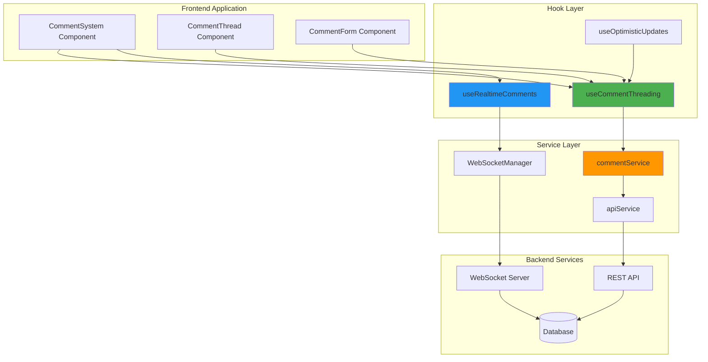
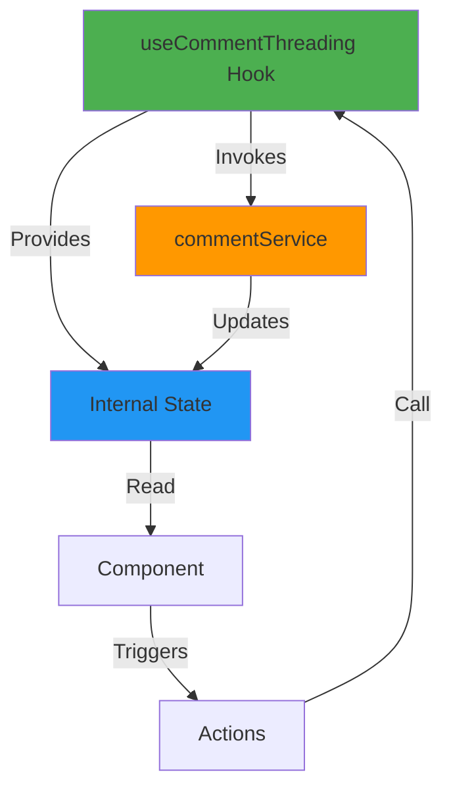
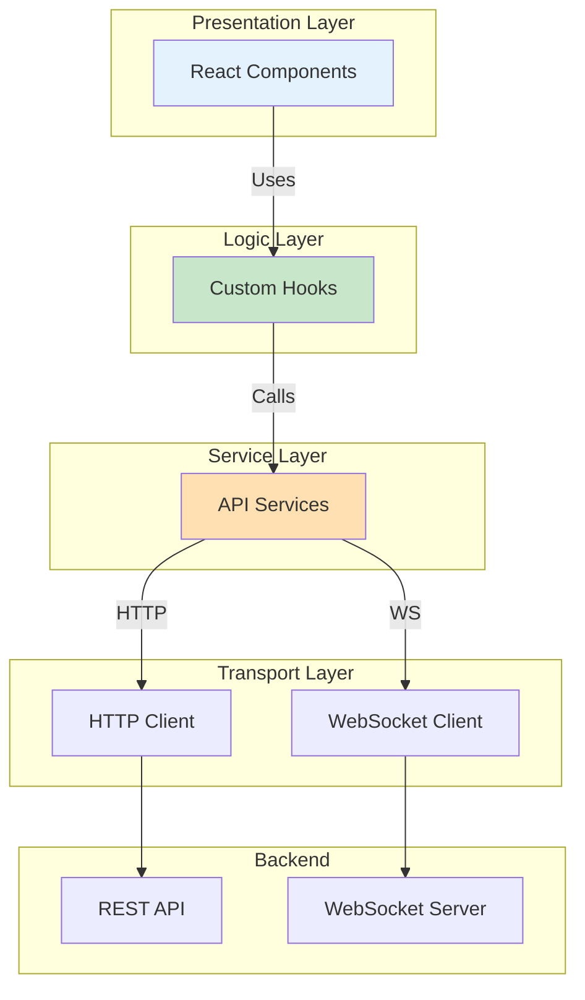
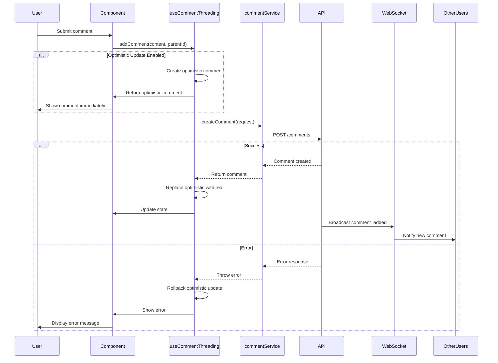
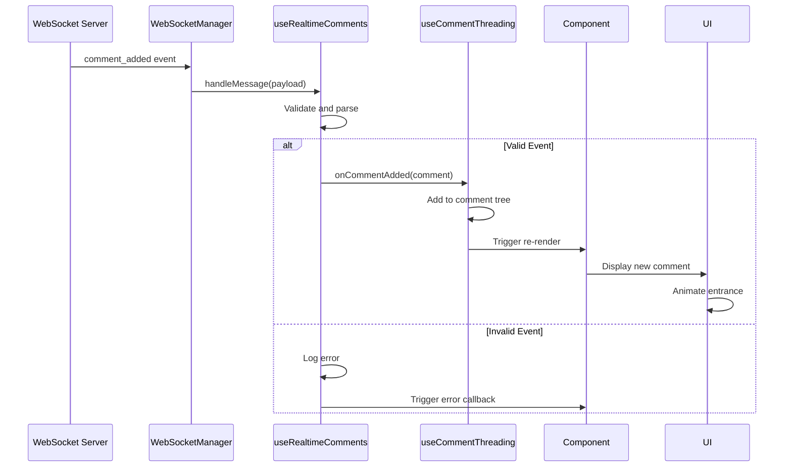
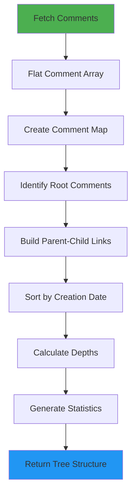
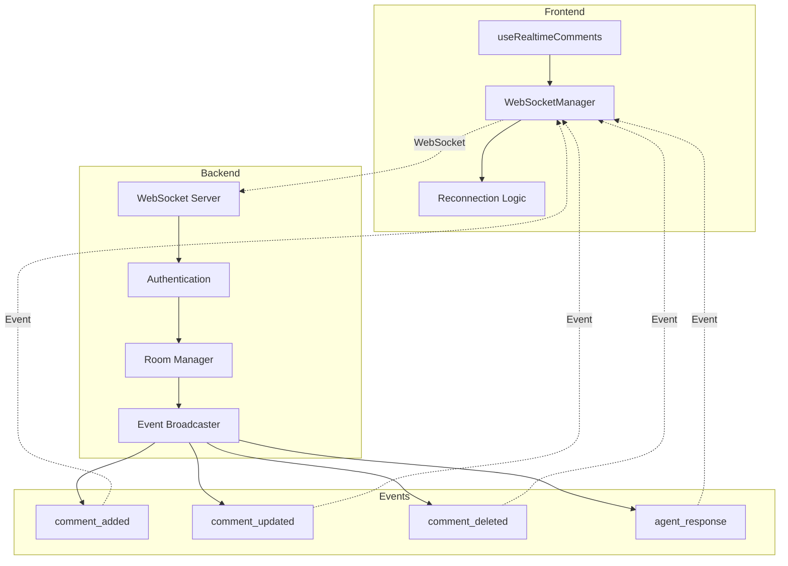
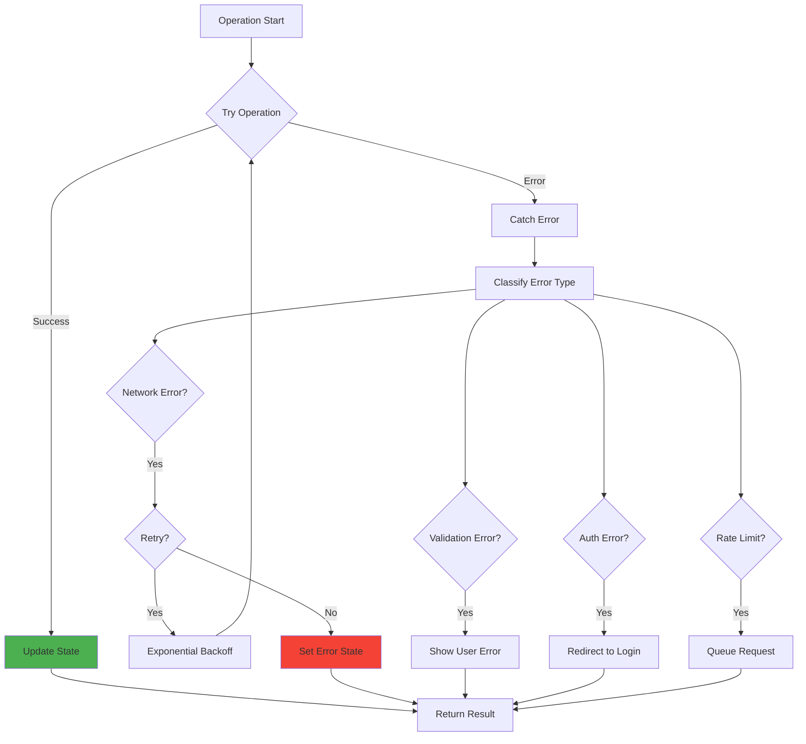

# SPARC Architecture: Comment Threading Hooks System

**Status**: Architecture Phase
**Created**: 2025-10-26
**Dependencies**: SPARC-COMMENT-HOOKS-SPEC.md, SPARC-COMMENT-HOOKS-PSEUDOCODE.md
**Related Components**: CommentSystem, CommentThread, commentService

---

## Table of Contents

1. [System Overview](#system-overview)
2. [Architecture Principles](#architecture-principles)
3. [Component Architecture](#component-architecture)
4. [Hook Architecture](#hook-architecture)
5. [Data Flow Architecture](#data-flow-architecture)
6. [API Service Layer](#api-service-layer)
7. [WebSocket Integration](#websocket-integration)
8. [State Management](#state-management)
9. [Error Handling Architecture](#error-handling-architecture)
10. [Performance Architecture](#performance-architecture)
11. [Security Architecture](#security-architecture)
12. [Integration Architecture](#integration-architecture)

---

## System Overview

### Purpose

The Comment Threading Hooks System provides a reusable, performant, and type-safe React hooks layer for managing threaded comment functionality with real-time updates, optimistic UI, and agent interaction capabilities.

### Key Architectural Goals

- **Separation of Concerns**: Hooks handle logic, components handle presentation
- **Reusability**: Hooks can be used across multiple components
- **Type Safety**: Full TypeScript support with comprehensive interfaces
- **Performance**: Optimized rendering with memoization and batching
- **Real-time**: WebSocket integration for live updates
- **Extensibility**: Easy to add new features without breaking existing code

### System Context Diagram



---

## Architecture Principles

### 1. Hook-First Design

**Principle**: All business logic lives in hooks, components are purely presentational.

```typescript
// ❌ BAD: Logic in component
const CommentSystem = ({ postId }) => {
  const [comments, setComments] = useState([]);
  const fetchComments = async () => { /* API logic */ };
  useEffect(() => { fetchComments(); }, [postId]);
  // Component is coupled to API implementation
};

// ✅ GOOD: Logic in hook
const CommentSystem = ({ postId }) => {
  const { comments, loading, error } = useCommentThreading(postId);
  // Component only handles presentation
};
```

### 2. Unidirectional Data Flow

**Principle**: Data flows down through props, changes flow up through callbacks.



### 3. Single Responsibility

**Principle**: Each hook has one primary responsibility.

- `useCommentThreading` - Comment CRUD and tree building
- `useRealtimeComments` - Real-time updates via WebSocket
- `useOptimisticUpdates` - Optimistic UI state management
- `useCommentNavigation` - Thread navigation and traversal

### 4. Composition Over Inheritance

**Principle**: Hooks compose together rather than extend each other.

```typescript
// Multiple hooks work together
const CommentSystem = ({ postId }) => {
  const threading = useCommentThreading(postId);
  const realtime = useRealtimeComments(postId);
  const optimistic = useOptimisticUpdates();

  // Hooks compose their functionality
  return <UI {...threading} {...realtime} />;
};
```

### 5. Fail-Safe Defaults

**Principle**: Hooks provide safe defaults and graceful degradation.

```typescript
const {
  comments = [],           // Safe default
  loading = false,         // Safe default
  error = null,            // Safe default
  addComment = noOp        // Safe no-op function
} = useCommentThreading(postId);
```

---

## Component Architecture

### Directory Structure

```
frontend/src/
├── hooks/
│   ├── useCommentThreading.ts         # Primary comment CRUD hook
│   ├── useRealtimeComments.ts         # WebSocket integration hook
│   ├── useOptimisticUpdates.ts        # Optimistic UI hook
│   ├── useCommentNavigation.ts        # Thread navigation hook
│   ├── useCommentFiltering.ts         # Filtering and sorting hook
│   └── __tests__/
│       ├── useCommentThreading.test.ts
│       └── useRealtimeComments.test.ts
├── components/
│   └── comments/
│       ├── CommentSystem.tsx          # Main container component
│       ├── CommentThread.tsx          # Thread display component
│       └── CommentForm.tsx            # Comment input component
├── services/
│   ├── commentService.ts              # API service layer
│   ├── WebSocketManager.ts            # WebSocket management
│   └── api.ts                         # Base API service
└── utils/
    └── commentUtils.tsx               # Utility functions
```

### Architectural Layers



---

## Hook Architecture

### 1. useCommentThreading Hook

**Purpose**: Manage comment CRUD operations and tree structure building.

#### Type Definitions

```typescript
// /frontend/src/hooks/useCommentThreading.ts

/**
 * Comment tree node with full metadata
 */
export interface CommentTreeNode {
  id: string;
  content: string;
  contentType: 'text' | 'markdown' | 'code';
  author: {
    type: 'user' | 'agent';
    id: string;
    name: string;
    avatar?: string;
  };
  metadata: {
    threadDepth: number;
    threadPath: string;
    replyCount: number;
    likeCount: number;
    reactionCount: number;
    isAgentResponse: boolean;
    responseToAgent?: string;
    conversationThreadId?: string;
    qualityScore?: number;
  };
  engagement: {
    likes: number;
    reactions: Record<string, number>;
    userReacted: boolean;
    userReactionType?: string;
  };
  status: 'published' | 'hidden' | 'deleted' | 'pending';
  children: CommentTreeNode[];
  createdAt: string;
  updatedAt: string;
}

/**
 * Agent conversation metadata
 */
export interface AgentConversation {
  id: string;
  rootCommentId: string;
  topic: string;
  participatingAgents: string[];
  status: 'active' | 'resolved' | 'archived';
  totalComments: number;
  lastActivity: string;
}

/**
 * Comment statistics
 */
export interface CommentStats {
  totalComments: number;
  rootThreads: number;
  maxDepth: number;
  agentComments: number;
  userComments: number;
  averageDepth: number;
  mostActiveThread: string | null;
  recentActivity: number;
}

/**
 * Hook options
 */
export interface UseCommentThreadingOptions {
  initialComments?: CommentTreeNode[];
  maxDepth?: number;
  enableCache?: boolean;
  autoRefresh?: boolean;
  refreshInterval?: number;
  enableOptimistic?: boolean;
  onError?: (error: Error) => void;
  onCommentAdded?: (comment: CommentTreeNode) => void;
  onCommentUpdated?: (comment: CommentTreeNode) => void;
  onCommentDeleted?: (commentId: string) => void;
}

/**
 * Hook return type
 */
export interface UseCommentThreadingReturn {
  // State
  comments: CommentTreeNode[];
  agentConversations: AgentConversation[];
  loading: boolean;
  error: string | null;
  stats: CommentStats | null;

  // CRUD Operations
  addComment: (content: string, parentId?: string, options?: AddCommentOptions) => Promise<CommentTreeNode>;
  updateComment: (commentId: string, content: string) => Promise<CommentTreeNode>;
  deleteComment: (commentId: string) => Promise<void>;

  // Engagement Operations
  reactToComment: (commentId: string, reactionType: string) => Promise<void>;
  unreactToComment: (commentId: string, reactionType: string) => Promise<void>;

  // Agent Interactions
  triggerAgentResponse: (commentId: string, agentType: string, context?: any) => Promise<CommentTreeNode>;
  startAgentConversation: (rootCommentId: string, topic?: string) => Promise<AgentConversation>;

  // Data Operations
  loadMoreComments: (offset?: number) => Promise<void>;
  refreshComments: () => Promise<void>;

  // Tree Operations
  getThreadStructure: (rootCommentId: string) => CommentTreeNode | null;
  getCommentPath: (commentId: string) => CommentTreeNode[];
  getCommentChildren: (commentId: string) => CommentTreeNode[];

  // Utility
  clearCache: () => void;
  invalidateStats: () => void;
}
```

#### Hook Implementation Architecture

```typescript
export const useCommentThreading = (
  postId: string,
  options: UseCommentThreadingOptions = {}
): UseCommentThreadingReturn => {
  // Extract options with defaults
  const {
    initialComments = [],
    maxDepth = 10,
    enableCache = true,
    autoRefresh = false,
    refreshInterval = 30000,
    enableOptimistic = true,
    onError,
    onCommentAdded,
    onCommentUpdated,
    onCommentDeleted
  } = options;

  // ============================================================================
  // STATE MANAGEMENT
  // ============================================================================

  const [comments, setComments] = useState<CommentTreeNode[]>(initialComments);
  const [agentConversations, setAgentConversations] = useState<AgentConversation[]>([]);
  const [loading, setLoading] = useState<boolean>(false);
  const [error, setError] = useState<string | null>(null);
  const [stats, setStats] = useState<CommentStats | null>(null);

  // Refs for stable callbacks
  const onErrorRef = useRef(onError);
  const onCommentAddedRef = useRef(onCommentAdded);
  const onCommentUpdatedRef = useRef(onCommentUpdated);
  const onCommentDeletedRef = useRef(onCommentDeleted);

  // Cache management
  const cacheRef = useRef<Map<string, any>>(new Map());
  const abortControllerRef = useRef<AbortController | null>(null);

  // ============================================================================
  // DATA FETCHING
  // ============================================================================

  // Initial load and refresh
  const fetchComments = useCallback(async (useCache = enableCache) => {
    // Implementation details in pseudocode phase
  }, [postId, maxDepth, enableCache]);

  // Load more comments (pagination)
  const loadMoreComments = useCallback(async (offset?: number) => {
    // Implementation details in pseudocode phase
  }, [postId, comments.length]);

  // Fetch statistics
  const fetchStats = useCallback(async () => {
    // Implementation details in pseudocode phase
  }, [postId]);

  // ============================================================================
  // CRUD OPERATIONS
  // ============================================================================

  const addComment = useCallback(async (
    content: string,
    parentId?: string,
    options?: AddCommentOptions
  ): Promise<CommentTreeNode> => {
    // Optimistic update logic
    // API call
    // Error handling
    // Cache invalidation
  }, [postId, enableOptimistic, comments]);

  const updateComment = useCallback(async (
    commentId: string,
    content: string
  ): Promise<CommentTreeNode> => {
    // Implementation details in pseudocode phase
  }, [comments]);

  const deleteComment = useCallback(async (commentId: string): Promise<void> => {
    // Implementation details in pseudocode phase
  }, [comments]);

  // ============================================================================
  // ENGAGEMENT OPERATIONS
  // ============================================================================

  const reactToComment = useCallback(async (
    commentId: string,
    reactionType: string
  ): Promise<void> => {
    // Implementation details in pseudocode phase
  }, [comments]);

  // ============================================================================
  // TREE OPERATIONS
  // ============================================================================

  const getThreadStructure = useCallback((rootCommentId: string): CommentTreeNode | null => {
    // Implementation details in pseudocode phase
  }, [comments]);

  const getCommentPath = useCallback((commentId: string): CommentTreeNode[] => {
    // Implementation details in pseudocode phase
  }, [comments]);

  // ============================================================================
  // EFFECTS
  // ============================================================================

  // Initial load
  useEffect(() => {
    fetchComments();

    return () => {
      // Cleanup: abort pending requests
      abortControllerRef.current?.abort();
    };
  }, [postId, fetchComments]);

  // Auto-refresh
  useEffect(() => {
    if (!autoRefresh) return;

    const interval = setInterval(() => {
      fetchComments(false); // Skip cache on refresh
    }, refreshInterval);

    return () => clearInterval(interval);
  }, [autoRefresh, refreshInterval, fetchComments]);

  // ============================================================================
  // RETURN API
  // ============================================================================

  return {
    // State
    comments,
    agentConversations,
    loading,
    error,
    stats,

    // CRUD
    addComment,
    updateComment,
    deleteComment,

    // Engagement
    reactToComment,
    unreactToComment,

    // Agent interactions
    triggerAgentResponse,
    startAgentConversation,

    // Data operations
    loadMoreComments,
    refreshComments: () => fetchComments(false),

    // Tree operations
    getThreadStructure,
    getCommentPath,
    getCommentChildren,

    // Utility
    clearCache: () => cacheRef.current.clear(),
    invalidateStats: () => setStats(null)
  };
};
```

### 2. useRealtimeComments Hook

**Purpose**: Handle real-time comment updates via WebSocket.

#### Type Definitions

```typescript
// /frontend/src/hooks/useRealtimeComments.ts

/**
 * Real-time event types
 */
export type CommentRealtimeEvent =
  | 'comment_added'
  | 'comment_updated'
  | 'comment_deleted'
  | 'reaction_added'
  | 'reaction_removed'
  | 'agent_response'
  | 'conversation_started'
  | 'conversation_updated';

/**
 * Real-time event payload
 */
export interface CommentRealtimePayload {
  type: CommentRealtimeEvent;
  postId: string;
  commentId?: string;
  comment?: CommentTreeNode;
  userId?: string;
  agentId?: string;
  timestamp: string;
  metadata?: Record<string, any>;
}

/**
 * Hook options
 */
export interface UseRealtimeCommentsOptions {
  enabled?: boolean;
  autoConnect?: boolean;
  reconnectOnError?: boolean;
  reconnectInterval?: number;
  onConnectionChange?: (connected: boolean) => void;
  onCommentAdded?: (comment: CommentTreeNode) => void;
  onCommentUpdated?: (comment: CommentTreeNode) => void;
  onCommentDeleted?: (commentId: string) => void;
  onAgentResponse?: (response: CommentTreeNode) => void;
  onReactionUpdate?: (commentId: string, reactions: Record<string, number>) => void;
  onError?: (error: Error) => void;
}

/**
 * Hook return type
 */
export interface UseRealtimeCommentsReturn {
  connected: boolean;
  connecting: boolean;
  error: string | null;
  lastEvent: CommentRealtimePayload | null;
  connect: () => Promise<void>;
  disconnect: () => void;
  reconnect: () => Promise<void>;
  subscribe: (event: CommentRealtimeEvent, callback: (payload: CommentRealtimePayload) => void) => () => void;
}
```

#### Hook Implementation Architecture

```typescript
export const useRealtimeComments = (
  postId: string,
  options: UseRealtimeCommentsOptions = {}
): UseRealtimeCommentsReturn => {
  const {
    enabled = true,
    autoConnect = true,
    reconnectOnError = true,
    reconnectInterval = 5000,
    onConnectionChange,
    onCommentAdded,
    onCommentUpdated,
    onCommentDeleted,
    onAgentResponse,
    onReactionUpdate,
    onError
  } = options;

  // ============================================================================
  // STATE MANAGEMENT
  // ============================================================================

  const [connected, setConnected] = useState(false);
  const [connecting, setConnecting] = useState(false);
  const [error, setError] = useState<string | null>(null);
  const [lastEvent, setLastEvent] = useState<CommentRealtimePayload | null>(null);

  // Refs
  const wsManagerRef = useRef<WebSocketManager | null>(null);
  const subscriptionsRef = useRef<Map<CommentRealtimeEvent, Set<Function>>>(new Map());
  const reconnectTimerRef = useRef<NodeJS.Timeout | null>(null);

  // ============================================================================
  // CONNECTION MANAGEMENT
  // ============================================================================

  const connect = useCallback(async () => {
    // WebSocket connection logic
  }, [postId]);

  const disconnect = useCallback(() => {
    // Disconnect and cleanup
  }, []);

  const reconnect = useCallback(async () => {
    // Reconnection logic with exponential backoff
  }, [connect, reconnectInterval]);

  // ============================================================================
  // EVENT HANDLING
  // ============================================================================

  const handleWebSocketMessage = useCallback((payload: CommentRealtimePayload) => {
    setLastEvent(payload);

    // Route to appropriate callback
    switch (payload.type) {
      case 'comment_added':
        onCommentAdded?.(payload.comment!);
        break;
      case 'comment_updated':
        onCommentUpdated?.(payload.comment!);
        break;
      case 'comment_deleted':
        onCommentDeleted?.(payload.commentId!);
        break;
      case 'agent_response':
        onAgentResponse?.(payload.comment!);
        break;
      case 'reaction_added':
      case 'reaction_removed':
        // Handle reaction updates
        break;
    }

    // Notify subscribers
    const handlers = subscriptionsRef.current.get(payload.type);
    handlers?.forEach(handler => handler(payload));
  }, [onCommentAdded, onCommentUpdated, onCommentDeleted, onAgentResponse]);

  // ============================================================================
  // SUBSCRIPTION MANAGEMENT
  // ============================================================================

  const subscribe = useCallback((
    event: CommentRealtimeEvent,
    callback: (payload: CommentRealtimePayload) => void
  ): (() => void) => {
    if (!subscriptionsRef.current.has(event)) {
      subscriptionsRef.current.set(event, new Set());
    }

    subscriptionsRef.current.get(event)!.add(callback);

    // Return unsubscribe function
    return () => {
      subscriptionsRef.current.get(event)?.delete(callback);
    };
  }, []);

  // ============================================================================
  // EFFECTS
  // ============================================================================

  useEffect(() => {
    if (!enabled) return;

    if (autoConnect) {
      connect();
    }

    return () => {
      disconnect();
    };
  }, [enabled, autoConnect, connect, disconnect]);

  // ============================================================================
  // RETURN API
  // ============================================================================

  return {
    connected,
    connecting,
    error,
    lastEvent,
    connect,
    disconnect,
    reconnect,
    subscribe
  };
};
```

---

## Data Flow Architecture

### Comment Creation Flow



### Real-time Update Flow



### Thread Building Flow



---

## API Service Layer

### Service Architecture

```typescript
// /frontend/src/services/commentService.ts

class CommentService {
  private baseUrl: string;
  private apiService: ApiService;
  private cache: Map<string, CachedResponse>;

  constructor(baseUrl: string, apiService: ApiService) {
    this.baseUrl = baseUrl;
    this.apiService = apiService;
    this.cache = new Map();
  }

  // ============================================================================
  // COMMENT CRUD
  // ============================================================================

  async getPostComments(
    postId: string,
    options: GetCommentsOptions
  ): Promise<CommentThreadResponse> {
    const cacheKey = this.buildCacheKey('comments', postId, options);

    // Check cache
    if (options.useCache && this.cache.has(cacheKey)) {
      const cached = this.cache.get(cacheKey);
      if (cached && !this.isCacheExpired(cached)) {
        return cached.data;
      }
    }

    // Fetch from API
    const response = await this.apiService.request<CommentThreadResponse>(
      `${this.baseUrl}/posts/${postId}/comments/tree`,
      { params: options }
    );

    // Cache response
    if (options.useCache) {
      this.cache.set(cacheKey, {
        data: response,
        timestamp: Date.now(),
        ttl: options.cacheTTL || 60000
      });
    }

    return response;
  }

  async createComment(
    request: CommentCreateRequest
  ): Promise<CommentTreeNode> {
    const response = await this.apiService.request<{ comment: CommentTreeNode }>(
      `${this.baseUrl}/posts/${request.postId}/comments`,
      {
        method: 'POST',
        body: JSON.stringify(request)
      }
    );

    // Invalidate relevant caches
    this.invalidatePostCommentCache(request.postId);

    return response.comment;
  }

  // ============================================================================
  // THREADING OPERATIONS
  // ============================================================================

  buildCommentTree(comments: CommentTreeNode[]): CommentTreeNode[] {
    const commentMap = new Map<string, CommentTreeNode>();
    const rootComments: CommentTreeNode[] = [];

    // First pass: create map with children arrays
    comments.forEach(comment => {
      commentMap.set(comment.id, { ...comment, children: [] });
    });

    // Second pass: build tree structure
    comments.forEach(comment => {
      const node = commentMap.get(comment.id)!;

      if (comment.metadata.threadDepth === 0) {
        rootComments.push(node);
      } else {
        // Find parent using thread path
        const pathParts = comment.metadata.threadPath.split('.');
        const parentPath = pathParts.slice(0, -1).join('.');

        const parent = Array.from(commentMap.values()).find(
          c => c.metadata.threadPath === parentPath
        );

        if (parent) {
          parent.children.push(node);
        } else {
          // Orphaned comment - add to root
          rootComments.push(node);
        }
      }
    });

    // Sort children recursively
    this.sortCommentTree(rootComments);

    return rootComments;
  }

  private sortCommentTree(nodes: CommentTreeNode[]): void {
    nodes.sort((a, b) =>
      new Date(a.createdAt).getTime() - new Date(b.createdAt).getTime()
    );

    nodes.forEach(node => {
      if (node.children.length > 0) {
        this.sortCommentTree(node.children);
      }
    });
  }

  // ============================================================================
  // CACHE MANAGEMENT
  // ============================================================================

  private buildCacheKey(resource: string, id: string, options: any): string {
    return `${resource}:${id}:${JSON.stringify(options)}`;
  }

  private isCacheExpired(cached: CachedResponse): boolean {
    return Date.now() - cached.timestamp > cached.ttl;
  }

  invalidatePostCommentCache(postId: string): void {
    const keysToDelete: string[] = [];

    this.cache.forEach((_, key) => {
      if (key.includes(`comments:${postId}`)) {
        keysToDelete.push(key);
      }
    });

    keysToDelete.forEach(key => this.cache.delete(key));
  }

  clearAllCache(): void {
    this.cache.clear();
  }
}

export const commentService = new CommentService('/api/v1', apiService);
```

---

## WebSocket Integration

### WebSocket Architecture



### WebSocket Manager Implementation

```typescript
// /frontend/src/services/WebSocketManager.ts

export class WebSocketManager {
  private socket: WebSocket | null = null;
  private connected: boolean = false;
  private reconnectAttempts: number = 0;
  private maxReconnectAttempts: number = 10;
  private reconnectDelay: number = 1000;
  private eventHandlers: Map<string, Set<Function>> = new Map();
  private heartbeatInterval: NodeJS.Timeout | null = null;

  constructor(private url: string) {}

  async connect(): Promise<void> {
    return new Promise((resolve, reject) => {
      this.socket = new WebSocket(this.url);

      this.socket.onopen = () => {
        this.connected = true;
        this.reconnectAttempts = 0;
        this.startHeartbeat();
        this.emit('connected', {});
        resolve();
      };

      this.socket.onmessage = (event) => {
        try {
          const payload = JSON.parse(event.data);
          this.handleMessage(payload);
        } catch (error) {
          console.error('Failed to parse WebSocket message:', error);
        }
      };

      this.socket.onerror = (error) => {
        this.emit('error', { error });
        reject(error);
      };

      this.socket.onclose = () => {
        this.connected = false;
        this.stopHeartbeat();
        this.emit('disconnected', {});
        this.attemptReconnect();
      };
    });
  }

  disconnect(): void {
    if (this.socket) {
      this.socket.close();
      this.socket = null;
    }
    this.connected = false;
    this.stopHeartbeat();
  }

  private async attemptReconnect(): Promise<void> {
    if (this.reconnectAttempts >= this.maxReconnectAttempts) {
      this.emit('max_reconnect_attempts', {});
      return;
    }

    this.reconnectAttempts++;
    const delay = this.reconnectDelay * Math.pow(2, this.reconnectAttempts - 1);

    await new Promise(resolve => setTimeout(resolve, delay));

    try {
      await this.connect();
    } catch (error) {
      // Reconnection failed, will try again
    }
  }

  private startHeartbeat(): void {
    this.heartbeatInterval = setInterval(() => {
      if (this.socket && this.connected) {
        this.socket.send(JSON.stringify({ type: 'ping' }));
      }
    }, 30000); // 30 seconds
  }

  private stopHeartbeat(): void {
    if (this.heartbeatInterval) {
      clearInterval(this.heartbeatInterval);
      this.heartbeatInterval = null;
    }
  }

  private handleMessage(payload: any): void {
    const { type, ...data } = payload;
    this.emit(type, data);
  }

  on(event: string, handler: Function): () => void {
    if (!this.eventHandlers.has(event)) {
      this.eventHandlers.set(event, new Set());
    }
    this.eventHandlers.get(event)!.add(handler);

    // Return unsubscribe function
    return () => {
      this.eventHandlers.get(event)?.delete(handler);
    };
  }

  private emit(event: string, data: any): void {
    const handlers = this.eventHandlers.get(event);
    if (handlers) {
      handlers.forEach(handler => {
        try {
          handler(data);
        } catch (error) {
          console.error(`Error in event handler for ${event}:`, error);
        }
      });
    }
  }

  send(event: string, data: any): void {
    if (this.socket && this.connected) {
      this.socket.send(JSON.stringify({ type: event, ...data }));
    } else {
      console.warn('Cannot send message: WebSocket not connected');
    }
  }

  isConnected(): boolean {
    return this.connected;
  }
}
```

---

## State Management

### State Management Architecture

```mermaid
graph TB
    subgraph "Hook State"
        COMMENTS[comments: CommentTreeNode[]]
        LOADING[loading: boolean]
        ERROR[error: string | null]
        STATS[stats: CommentStats]
        CONVOS[agentConversations: AgentConversation[]]
    end

    subgraph "Derived State"
        ROOT[rootComments]
        TREE[commentTree]
        FILTERED[filteredComments]
    end

    subgraph "Actions"
        ADD[addComment]
        UPDATE[updateComment]
        DELETE[deleteComment]
        REACT[reactToComment]
    end

    ACTIONS --> LOADING
    ACTIONS --> COMMENTS
    ACTIONS --> ERROR

    COMMENTS --> ROOT
    COMMENTS --> TREE
    COMMENTS --> FILTERED

    ROOT --> COMPONENT[Component Re-render]
    TREE --> COMPONENT
    FILTERED --> COMPONENT

    style COMMENTS fill:#4CAF50
    style ACTIONS fill:#2196F3
    style COMPONENT fill:#FF9800
```

### Memoization Strategy

```typescript
// Memoize expensive computations
const rootComments = useMemo(() => {
  return comments.filter(comment =>
    !comment.metadata.threadDepth || comment.metadata.threadDepth === 0
  );
}, [comments]);

const commentTree = useMemo(() => {
  return commentService.buildCommentTree(comments);
}, [comments]);

const commentMap = useMemo(() => {
  const map = new Map<string, CommentTreeNode>();
  comments.forEach(comment => map.set(comment.id, comment));
  return map;
}, [comments]);

// Memoize callbacks
const handleAddComment = useCallback(async (content: string, parentId?: string) => {
  // Implementation
}, [addComment, parentId]);

const handleReaction = useCallback(async (commentId: string, reactionType: string) => {
  // Implementation
}, [reactToComment]);
```

---

## Error Handling Architecture

### Error Types

```typescript
export enum CommentErrorType {
  NETWORK_ERROR = 'NETWORK_ERROR',
  VALIDATION_ERROR = 'VALIDATION_ERROR',
  AUTHORIZATION_ERROR = 'AUTHORIZATION_ERROR',
  NOT_FOUND = 'NOT_FOUND',
  RATE_LIMIT = 'RATE_LIMIT',
  SERVER_ERROR = 'SERVER_ERROR',
  WEBSOCKET_ERROR = 'WEBSOCKET_ERROR',
  OPTIMISTIC_ROLLBACK = 'OPTIMISTIC_ROLLBACK'
}

export interface CommentError {
  type: CommentErrorType;
  message: string;
  code?: string;
  details?: Record<string, any>;
  retryable: boolean;
  timestamp: string;
}
```

### Error Handling Flow



---

## Performance Architecture

### Performance Optimizations

1. **Memoization**
   - Memoize comment tree building
   - Memoize filtered/sorted results
   - Memoize callbacks with useCallback

2. **Virtualization**
   - Render only visible comments
   - Use react-window or react-virtualized
   - Lazy load off-screen threads

3. **Batching**
   - Batch multiple state updates
   - Use unstable_batchedUpdates for React <18
   - Debounce rapid updates

4. **Code Splitting**
   - Lazy load comment editor
   - Lazy load markdown renderer
   - Dynamic imports for heavy components

5. **Caching**
   - Cache API responses
   - Cache computed trees
   - Use SWR or React Query patterns

### Performance Metrics

```typescript
export interface PerformanceMetrics {
  treeBuildTime: number;      // Time to build comment tree
  renderTime: number;          // Time to render comments
  apiLatency: number;          // API request latency
  websocketLatency: number;    // WebSocket event latency
  optimisticUpdateTime: number; // Time for optimistic update
  totalComments: number;       // Total comments rendered
  visibleComments: number;     // Visible comments count
}
```

---

## Security Architecture

### Security Measures

1. **Input Sanitization**
   ```typescript
   const sanitizeCommentContent = (content: string): string => {
     return DOMPurify.sanitize(content, {
       ALLOWED_TAGS: ['p', 'br', 'strong', 'em', 'code', 'pre'],
       ALLOWED_ATTR: []
     });
   };
   ```

2. **XSS Prevention**
   - Sanitize all user-generated content
   - Use dangerouslySetInnerHTML carefully
   - Escape markdown output

3. **CSRF Protection**
   - Include CSRF tokens in requests
   - Validate origin headers

4. **Rate Limiting**
   - Client-side rate limiting
   - Debounce rapid submissions
   - Queue requests when limit reached

5. **WebSocket Security**
   - Authenticate WebSocket connections
   - Validate message origins
   - Encrypt sensitive data

---

## Integration Architecture

### Integration with CommentSystem Component

```typescript
// /frontend/src/components/comments/CommentSystem.tsx

export const CommentSystem: React.FC<CommentSystemProps> = ({
  postId,
  initialComments = [],
  maxDepth = 10,
  enableAgentInteractions = true,
  enableRealtime = true,
  className = ''
}) => {
  // ============================================================================
  // HOOK INTEGRATION
  // ============================================================================

  // Primary threading hook
  const {
    comments,
    agentConversations,
    loading,
    error,
    addComment,
    updateComment,
    deleteComment,
    reactToComment,
    loadMoreComments,
    refreshComments,
    triggerAgentResponse,
    getThreadStructure,
    stats
  } = useCommentThreading(postId, {
    initialComments,
    maxDepth,
    enableOptimistic: true,
    autoRefresh: false
  });

  // Real-time updates hook
  useRealtimeComments(postId, {
    enabled: enableRealtime,
    autoConnect: true,
    onCommentAdded: (comment) => {
      // Real-time comment added - state already updated by hook
      console.log('New comment received:', comment.id);
    },
    onCommentUpdated: (comment) => {
      // Comment updated in real-time
      console.log('Comment updated:', comment.id);
    },
    onAgentResponse: (response) => {
      // Agent responded in real-time
      console.log('Agent response:', response.id);
    }
  });

  // ============================================================================
  // COMPONENT STATE
  // ============================================================================

  const [showCommentForm, setShowCommentForm] = useState(false);
  const [expandedThreads, setExpandedThreads] = useState<Set<string>>(new Set());

  // ============================================================================
  // HANDLERS
  // ============================================================================

  const handleAddComment = useCallback(async (content: string, parentId?: string) => {
    try {
      await addComment(content, parentId);
      setShowCommentForm(false);
    } catch (error) {
      console.error('Failed to add comment:', error);
    }
  }, [addComment]);

  // ============================================================================
  // RENDER
  // ============================================================================

  return (
    <div className={`comment-system ${className}`}>
      {/* UI implementation */}
    </div>
  );
};
```

---

## Deployment Considerations

### Build Configuration

```json
{
  "compilerOptions": {
    "target": "ES2020",
    "lib": ["ES2020", "DOM"],
    "jsx": "react-jsx",
    "module": "ESNext",
    "moduleResolution": "bundler",
    "strict": true,
    "esModuleInterop": true,
    "skipLibCheck": true,
    "forceConsistentCasingInFileNames": true,
    "resolveJsonModule": true,
    "types": ["vite/client", "node"]
  },
  "include": ["src/**/*"],
  "exclude": ["node_modules", "dist", "**/*.test.ts", "**/*.test.tsx"]
}
```

### Bundle Size Optimization

- Tree shaking enabled
- Code splitting for hooks
- Lazy loading for heavy dependencies
- Minimize dependency footprint

---

## Testing Architecture

### Unit Testing

```typescript
// __tests__/useCommentThreading.test.ts
describe('useCommentThreading', () => {
  it('should fetch comments on mount', async () => {
    const { result, waitForNextUpdate } = renderHook(() =>
      useCommentThreading('post-123')
    );

    expect(result.current.loading).toBe(true);

    await waitForNextUpdate();

    expect(result.current.loading).toBe(false);
    expect(result.current.comments.length).toBeGreaterThan(0);
  });

  it('should add comment optimistically', async () => {
    const { result } = renderHook(() =>
      useCommentThreading('post-123', { enableOptimistic: true })
    );

    await act(async () => {
      await result.current.addComment('Test comment');
    });

    expect(result.current.comments).toContainEqual(
      expect.objectContaining({ content: 'Test comment' })
    );
  });
});
```

### Integration Testing

```typescript
// __tests__/CommentSystem.integration.test.tsx
describe('CommentSystem Integration', () => {
  it('should display comments and allow interactions', async () => {
    render(<CommentSystem postId="post-123" enableRealtime={false} />);

    // Wait for comments to load
    await waitFor(() => {
      expect(screen.getByText(/comments/i)).toBeInTheDocument();
    });

    // Add a comment
    const button = screen.getByText(/add comment/i);
    fireEvent.click(button);

    const textarea = screen.getByPlaceholderText(/share your thoughts/i);
    fireEvent.change(textarea, { target: { value: 'Great post!' } });

    const submit = screen.getByText(/post comment/i);
    fireEvent.click(submit);

    // Verify comment appears
    await waitFor(() => {
      expect(screen.getByText('Great post!')).toBeInTheDocument();
    });
  });
});
```

---

## Summary

This architecture provides:

✅ **Modular Hook Design** - Separation of concerns with focused hooks
✅ **Type Safety** - Comprehensive TypeScript interfaces
✅ **Performance** - Memoization, caching, and optimization strategies
✅ **Real-time** - WebSocket integration with reconnection logic
✅ **Error Handling** - Robust error classification and recovery
✅ **Security** - Input sanitization and XSS prevention
✅ **Testability** - Clear testing strategies and patterns
✅ **Scalability** - Supports large comment threads with virtualization
✅ **Maintainability** - Clean code structure with clear responsibilities

**Next Steps:**
1. Review this architecture with the team
2. Proceed to Refinement phase (TDD implementation)
3. Implement hooks following this architecture
4. Write comprehensive tests
5. Integrate with existing CommentSystem component

---

**Architecture Review Checklist:**
- [ ] All TypeScript interfaces defined
- [ ] Hook signatures and return types documented
- [ ] Data flow diagrams complete
- [ ] WebSocket integration architecture clear
- [ ] Error handling strategy defined
- [ ] Performance optimization plan established
- [ ] Security measures documented
- [ ] Integration patterns established
- [ ] Testing strategy defined
- [ ] Ready for implementation phase
