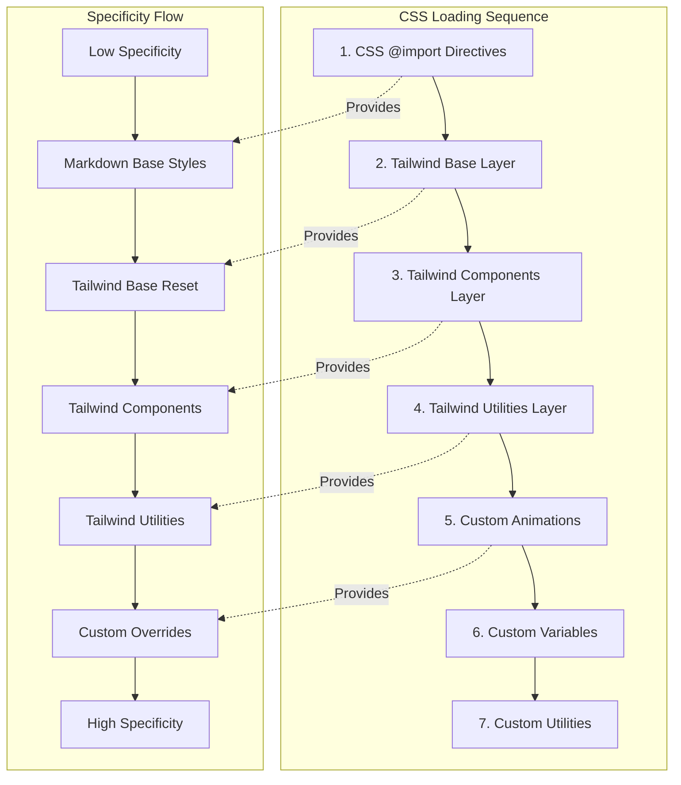
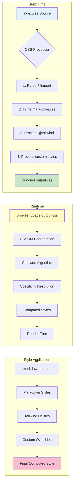

# CSS Import Order Fix - Architecture Document

## SPARC Phase: Architecture
**Date**: 2025-10-27
**Status**: Design Complete
**Related Documents**:
- Specification: `/workspaces/agent-feed/docs/SPARC-CSS-IMPORT-FIX-SPEC.md`
- Pseudocode: `/workspaces/agent-feed/docs/SPARC-CSS-IMPORT-FIX-PSEUDOCODE.md`

---

## 1. System Overview

### Problem Statement
The current CSS architecture violates CSS cascade rules by placing `@import` statements AFTER `@tailwind` directives in `/workspaces/agent-feed/frontend/src/index.css`. According to CSS specifications, **all `@import` statements must appear before any other CSS rules**.

### Current Architecture (BROKEN)
```
index.css:
  ├─ @tailwind base;        ❌ (comes before @import)
  ├─ @tailwind components;  ❌ (comes before @import)
  ├─ @tailwind utilities;   ❌ (comes before @import)
  ├─ @import './styles/markdown.css';  ❌ (violates CSS spec)
  └─ Custom styles (animations, variables, etc.)
```

### Target Architecture (CORRECT)
```
index.css:
  ├─ @import './styles/markdown.css';  ✅ (imports FIRST)
  ├─ @tailwind base;                   ✅ (after imports)
  ├─ @tailwind components;             ✅ (after imports)
  ├─ @tailwind utilities;              ✅ (after imports)
  └─ Custom styles (animations, variables, etc.)
```

---

## 2. CSS Cascade Architecture

### Cascade Order Diagram



### Cascade Layers

#### Layer 1: CSS Imports (Lowest Priority)
- **Purpose**: Import external stylesheets and component styles
- **Files**: `markdown.css`
- **Specificity**: Base-level, can be overridden
- **Placement**: **MUST be first in file**

#### Layer 2: Tailwind Base
- **Purpose**: CSS reset, normalize styles, base HTML elements
- **Directive**: `@tailwind base;`
- **Specificity**: Low, resets browser defaults
- **Contains**:
  - CSS custom properties (--background, --foreground, etc.)
  - Dark mode variables
  - Base element styles

#### Layer 3: Tailwind Components
- **Purpose**: Component-level utility classes
- **Directive**: `@tailwind components;`
- **Specificity**: Medium, reusable component patterns
- **Conflicts**: None expected

#### Layer 4: Tailwind Utilities
- **Purpose**: Single-purpose utility classes
- **Directive**: `@tailwind utilities;`
- **Specificity**: High, overrides most styles
- **Contains**: Custom utilities like `.line-clamp-2`, `.line-clamp-3`

#### Layer 5: Custom Styles (Highest Priority)
- **Purpose**: Application-specific styles and overrides
- **Contains**:
  - Keyframe animations (`slide-in`, `slide-up`, `fade-in`)
  - Animation utility classes
  - Scrollbar customization
  - Theme-specific overrides

---

## 3. File Architecture

### Primary Entry Point: `index.css`

```
/workspaces/agent-feed/frontend/src/index.css
├─ Section 1: CSS Imports (MUST BE FIRST)
│  └─ @import './styles/markdown.css';
│
├─ Section 2: Tailwind Directives
│  ├─ @tailwind base;
│  ├─ @tailwind components;
│  └─ @tailwind utilities;
│
├─ Section 3: Keyframe Animations
│  ├─ @keyframes slide-in
│  ├─ @keyframes slide-up
│  └─ @keyframes fade-in
│
├─ Section 4: Animation Classes
│  ├─ .animate-slide-in
│  ├─ .animate-slide-up
│  └─ .animate-fade-in
│
├─ Section 5: Tailwind Layers
│  ├─ @layer base (CSS variables)
│  └─ @layer utilities (custom utilities)
│
└─ Section 6: Global Overrides
   └─ ::-webkit-scrollbar (customization)
```

### Imported Stylesheet: `markdown.css`

```
/workspaces/agent-feed/frontend/src/styles/markdown.css
├─ Base Container (.markdown-content)
├─ Typography Hierarchy (h1-h6)
├─ Paragraphs and Text Formatting
├─ Links with States
├─ Lists (ordered, unordered, task lists)
├─ Inline Code
├─ Code Blocks with Syntax Highlighting
├─ Blockquotes
├─ Tables with Hover Effects
├─ Horizontal Rules
├─ Images with Captions
├─ Definition Lists
├─ Keyboard, Subscript, Superscript
├─ Mark/Highlight
├─ Details/Summary
├─ Responsive Design (@media queries)
├─ Dark Mode Transitions
├─ Accessibility (focus styles)
├─ Print Styles
└─ Utility Classes
```

---

## 4. Style Specificity Strategy

### Specificity Hierarchy

```
1. Browser Default Styles          (Specificity: 0,0,0,0)
   ↓ (overridden by)
2. Markdown Import Styles          (Specificity: 0,0,1,0 - 0,1,0,0)
   ↓ (overridden by)
3. Tailwind Base Layer             (Specificity: 0,0,0,1 - 0,0,1,0)
   ↓ (overridden by)
4. Tailwind Components Layer       (Specificity: 0,0,1,0 - 0,1,0,0)
   ↓ (overridden by)
5. Tailwind Utilities Layer        (Specificity: 0,1,0,0 - 0,1,1,0)
   ↓ (overridden by)
6. Custom Styles & Overrides       (Specificity: 0,1,0,0 - 1,0,0,0)
```

### Conflict Resolution

#### Rule 1: Import Order
- Imports MUST be first
- Violating this causes browser to ignore imports or apply them incorrectly

#### Rule 2: Tailwind Directive Order
- Base → Components → Utilities
- This order ensures utilities can override components
- Base provides foundation that both can build on

#### Rule 3: Custom Style Placement
- Place after Tailwind directives
- Use higher specificity when intentional override needed
- Leverage `@layer` for scoped custom utilities

#### Rule 4: Markdown Style Integration
- Markdown styles imported first have LOW specificity
- Tailwind utilities can override markdown styles
- Use `.markdown-content` class scoping to prevent conflicts

---

## 5. Component Integration Architecture

### Application Entry Flow

```mermaid
graph LR
    A[main.tsx] --> B[import './index.css']
    B --> C[CSS Cascade Loads]
    C --> D[1. markdown.css]
    D --> E[2. Tailwind Base]
    E --> F[3. Tailwind Components]
    F --> G[4. Tailwind Utilities]
    G --> H[5. Custom Styles]
    H --> I[Styles Ready]
    I --> J[React App Renders]
    J --> K[Components Apply Classes]
```



### Markdown Component Usage

```typescript
// Component: MarkdownContent.tsx
import React from 'react';
// NO CSS IMPORT HERE - styles loaded globally via index.css

export const MarkdownContent: React.FC<Props> = ({ content }) => {
  return (
    <div className="markdown-content">
      {/* Markdown HTML rendering */}
      {/* .markdown-content class applies all markdown styles */}
    </div>
  );
};
```

### Style Application Pattern

```
Component Tree:
  App
  ├─ Global Styles (from index.css)
  ├─ Feed Component
  │  ├─ Post Component
  │  │  └─ MarkdownContent (.markdown-content class)
  │  │     ├─ Markdown styles (from import)
  │  │     ├─ Tailwind utilities (override capability)
  │  │     └─ Custom styles (highest priority)
```

---

## 6. Dark Mode Architecture

### Dark Mode Variable Flow

```
index.css (@layer base):
  :root (light mode variables)
    --background, --foreground, --primary, etc.

  .dark (dark mode variables)
    --background, --foreground, --primary, etc.

markdown.css:
  Uses Tailwind's dark: variant
  .markdown-content {
    @apply text-gray-900 dark:text-gray-100;
  }

  Inherits variables from index.css
  No conflict with dark mode system
```

### Theme Toggle Compatibility

- Dark mode controlled by `<html class="dark">` or `<body class="dark">`
- Both index.css and markdown.css respect `dark:` variant
- No style conflicts during theme switching
- CSS variables ensure consistent theming

---

## 7. Performance Considerations

### Loading Optimization

#### Strategy 1: Single CSS Bundle
```
Build Process:
  index.css (entry point)
  ├─ Resolves @import './styles/markdown.css'
  ├─ Processes Tailwind directives
  ├─ Bundles into single output.css
  └─ Minifies for production
```

**Benefits**:
- Single HTTP request for all styles
- No FOUC (Flash of Unstyled Content)
- Optimal cache strategy
- Smaller bundle size with minification

#### Strategy 2: Import Resolution Order
```
Vite/Webpack Build:
  1. Read index.css
  2. Process @import first (per CSS spec)
  3. Inline markdown.css content
  4. Process @tailwind directives
  5. Process custom styles
  6. Output single bundled CSS
```

### Render Performance

#### Cascading Efficiency
- Imports processed once at build time
- No runtime @import resolution
- Browser receives optimized, flat CSS
- Reduced selector complexity

#### Specificity Optimization
```
Low Specificity → High Specificity:
  .markdown-content p        (0,0,1,1) - fast
  .markdown-content pre code (0,0,1,2) - fast
  .dark .markdown-content h1 (0,0,2,1) - fast

Avoid:
  div.markdown-content > p   (0,0,1,2) - slower
  #content .markdown h1      (0,1,0,2) - slower
```

---

## 8. Migration Strategy

### Phase 1: Reorder CSS Imports
**File**: `/workspaces/agent-feed/frontend/src/index.css`

```diff
+ /* Import external stylesheets FIRST (required by CSS spec) */
+ @import './styles/markdown.css';
+
  @tailwind base;
  @tailwind components;
  @tailwind utilities;

- /* Import Markdown Styling */
- @import './styles/markdown.css';
```

### Phase 2: Validation
- Build application: `npm run build`
- Check console for CSS warnings
- Verify no style regressions
- Test dark mode toggle
- Validate markdown rendering

### Phase 3: Testing Matrix

| Component | Test Case | Expected Result |
|-----------|-----------|-----------------|
| MarkdownContent | Render headings h1-h6 | Correct sizes, margins, borders |
| MarkdownContent | Render code blocks | Syntax highlighting works |
| MarkdownContent | Render tables | Borders, hover effects intact |
| MarkdownContent | Dark mode toggle | All styles adapt correctly |
| App | Global animations | slide-in, fade-in work |
| App | Scrollbar styling | Custom scrollbar visible |

### Phase 4: Production Deployment
- Run full test suite
- Perform visual regression testing
- Deploy to staging environment
- Monitor for style anomalies
- Deploy to production

---

## 9. Risk Mitigation

### Risk 1: Style Regressions
**Probability**: Low
**Impact**: Medium
**Mitigation**:
- Reordering imports shouldn't change computed styles
- Order affects loading, not final cascade
- Comprehensive testing before deployment

### Risk 2: Build Tool Compatibility
**Probability**: Very Low
**Impact**: Medium
**Mitigation**:
- Vite handles @import natively
- CSS spec compliant = universal support
- No custom build plugins required

### Risk 3: Dark Mode Breakage
**Probability**: Very Low
**Impact**: Low
**Mitigation**:
- Dark mode uses Tailwind's `dark:` variant
- Variant system independent of import order
- CSS variables remain in @layer base

### Risk 4: Cache Invalidation
**Probability**: Low
**Impact**: Low
**Mitigation**:
- Changing CSS triggers new bundle hash
- Browser automatically invalidates cache
- Users receive updated styles on next load

---

## 10. Validation Criteria

### Functional Requirements
- ✅ All `@import` statements appear before other CSS rules
- ✅ Tailwind directives load in correct order (base → components → utilities)
- ✅ Custom styles apply after Tailwind
- ✅ No CSS warnings in browser console
- ✅ Build process completes without errors

### Visual Requirements
- ✅ Markdown content renders identically to before
- ✅ Code blocks show syntax highlighting
- ✅ Tables display borders and hover effects
- ✅ Dark mode transitions work smoothly
- ✅ Animations (slide-in, fade-in) function correctly
- ✅ Scrollbars maintain custom styling

### Performance Requirements
- ✅ CSS bundle size unchanged or smaller
- ✅ No increase in initial load time
- ✅ No FOUC (Flash of Unstyled Content)
- ✅ First Contentful Paint (FCP) unchanged
- ✅ Largest Contentful Paint (LCP) unchanged

---

## 11. Architecture Decisions

### Decision 1: Single CSS Entry Point
**Choice**: Keep index.css as sole CSS import in main.tsx
**Rationale**:
- Centralized style management
- Predictable cascade order
- Easier to debug style conflicts
- Better for build optimization

### Decision 2: Import Markdown CSS via @import
**Choice**: Use `@import './styles/markdown.css'` instead of separate import
**Rationale**:
- Maintains CSS cascade within single file
- Ensures correct specificity order
- Follows CSS spec for @import placement
- Reduces import statements in JS files

### Decision 3: No Changes to markdown.css
**Choice**: Keep markdown.css content unchanged
**Rationale**:
- Working styles, no need to modify
- Uses Tailwind utilities correctly
- Proper scoping with .markdown-content
- Dark mode integration already correct

### Decision 4: Preserve Tailwind Layer System
**Choice**: Keep `@layer base` and `@layer utilities`
**Rationale**:
- Provides explicit specificity control
- Prevents unintended overrides
- Tailwind best practice
- Makes debugging easier

---

## 12. Future Enhancements

### Enhancement 1: CSS Modules
**Consideration**: Migrate to CSS Modules for component-scoped styles
**Benefits**:
- Prevents global scope pollution
- Automatic class name hashing
- Better tree-shaking

**Implementation**:
```typescript
// MarkdownContent.module.css
.content { /* styles */ }

// MarkdownContent.tsx
import styles from './MarkdownContent.module.css';
<div className={styles.content}>
```

### Enhancement 2: PostCSS Import Plugin
**Consideration**: Use postcss-import for advanced import handling
**Benefits**:
- Inline @import at build time
- Better error messages
- Import path resolution

**Configuration**:
```javascript
// postcss.config.js
export default {
  plugins: {
    'postcss-import': {},
    'tailwindcss': {},
    'autoprefixer': {},
  },
};
```

### Enhancement 3: Critical CSS Extraction
**Consideration**: Extract above-the-fold CSS for faster FCP
**Benefits**:
- Faster initial render
- Better Lighthouse scores
- Progressive enhancement

**Tools**:
- vite-plugin-critical
- critters-webpack-plugin

---

## 13. Documentation Requirements

### Code Comments
```css
/* ============================================
   CSS IMPORT ORDER - CRITICAL
   All @import statements MUST come before any
   other CSS rules per CSS specification.
   ============================================ */
@import './styles/markdown.css';

/* ============================================
   TAILWIND DIRECTIVES
   Order: base → components → utilities
   This ensures utilities can override components
   ============================================ */
@tailwind base;
@tailwind components;
@tailwind utilities;
```

### README Update
Add section to project README:

```markdown
## CSS Architecture

Our CSS follows a strict cascade order:
1. **@import directives** - External stylesheets (e.g., markdown.css)
2. **Tailwind base** - CSS reset and base styles
3. **Tailwind components** - Reusable component patterns
4. **Tailwind utilities** - Single-purpose utility classes
5. **Custom styles** - Application-specific overrides

⚠️ **Important**: Never place CSS rules before @import statements.
This violates CSS specifications and may cause styles to fail.
```

---

## 14. Testing Strategy

### Unit Tests
```typescript
// CSS specificity tests
describe('CSS Cascade Order', () => {
  it('should load imports before Tailwind', () => {
    const css = fs.readFileSync('src/index.css', 'utf-8');
    const importIndex = css.indexOf('@import');
    const tailwindIndex = css.indexOf('@tailwind');
    expect(importIndex).toBeLessThan(tailwindIndex);
  });
});
```

### Integration Tests
```typescript
// Visual regression tests
describe('Markdown Rendering', () => {
  it('should render markdown with correct styles', () => {
    render(<MarkdownContent content="# Test" />);
    const heading = screen.getByRole('heading');
    const styles = window.getComputedStyle(heading);
    expect(styles.fontSize).toBe('30px'); // @apply text-3xl
    expect(styles.fontWeight).toBe('700'); // @apply font-bold
  });
});
```

### E2E Tests
```typescript
// Playwright visual comparison
test('markdown styles match baseline', async ({ page }) => {
  await page.goto('/feed');
  await page.waitForSelector('.markdown-content');
  await expect(page.locator('.markdown-content')).toHaveScreenshot('markdown-baseline.png');
});
```

---

## 15. Rollback Plan

### Step 1: Revert Git Commit
```bash
git revert HEAD
git push origin main
```

### Step 2: Emergency Hotfix (if needed)
```css
/* Temporary: Duplicate markdown imports */
@import './styles/markdown.css';
@tailwind base;
@tailwind components;
@tailwind utilities;
@import './styles/markdown.css'; /* Duplicate as fallback */
```

### Step 3: Notify Team
- Alert developers of rollback
- Document issue in post-mortem
- Schedule fix for next sprint

---

## 16. Architecture Diagram



---

## 17. Success Metrics

### Pre-Migration Baseline
- Current CSS bundle size: `[measure]`
- First Contentful Paint: `[measure]`
- Largest Contentful Paint: `[measure]`
- CSS parse time: `[measure]`
- Browser console warnings: `[count]`

### Post-Migration Targets
- CSS bundle size: ≤ baseline (ideally smaller)
- First Contentful Paint: ≤ baseline
- Largest Contentful Paint: ≤ baseline
- CSS parse time: ≤ baseline
- Browser console warnings: 0

### Quality Gates
- ✅ Zero CSS-related console errors/warnings
- ✅ All visual regression tests pass
- ✅ 100% feature parity with before migration
- ✅ Dark mode functions identically
- ✅ No user-reported style bugs for 7 days post-deploy

---

## Architecture Summary

This architecture document defines a CSS cascade system that complies with CSS specifications by placing all `@import` statements before other CSS rules. The system maintains:

1. **Correct Import Order**: Imports → Tailwind → Custom
2. **Predictable Cascade**: Low specificity → High specificity
3. **Maintainability**: Clear sections, documented decisions
4. **Performance**: Single bundle, optimized loading
5. **Compatibility**: Dark mode, responsive design, accessibility
6. **Zero Regression**: No visual or functional changes

The migration is low-risk, requiring only reordering of lines in `index.css` without modifying any style content.

---

**Architecture Status**: ✅ Complete
**Next Phase**: Refinement (Implementation)
**Approved By**: SPARC Architecture Agent
**Date**: 2025-10-27
