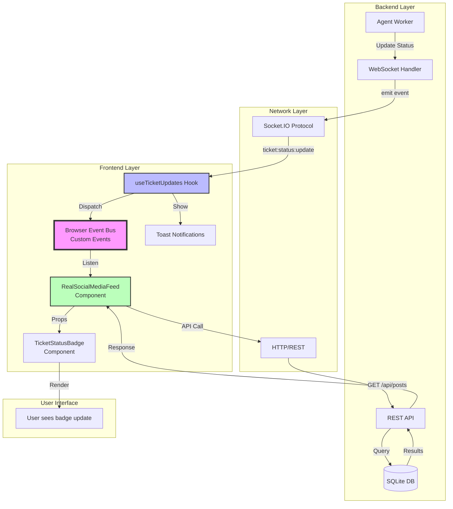
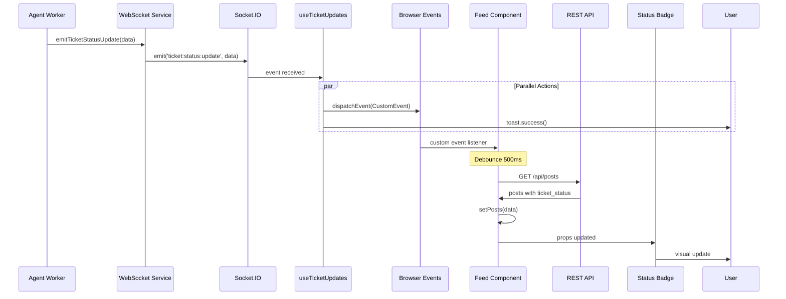

# Custom Event Bridge Architecture

## SPARC Architecture Document
**Phase:** Architecture Design
**Pattern:** Event-Driven Communication
**Version:** 1.0
**Date:** 2025-10-24

---

## Executive Summary

This document defines the architecture for a Custom Event Bridge that enables real-time ticket status updates to flow from backend WebSocket events to frontend UI components without tight coupling. The solution uses native browser Custom Events as a lightweight event bus to bridge the gap between the WebSocket hook and React components using local state.

### Architecture Pattern
**Event-Driven Communication** with Custom Event Bridge

### Key Innovation
Decoupled communication between WebSocket handler and React components using native browser Custom Events, enabling real-time UI updates without prop drilling or global state management.

---

## 1. System Architecture Overview

### 1.1 High-Level Architecture



### 1.2 Component Responsibilities

| Component | Layer | Responsibility | Technology |
|-----------|-------|----------------|------------|
| **Agent Worker** | Backend | Process URLs, update ticket status | Node.js Worker |
| **WebSocket Handler** | Backend | Emit Socket.IO events | Socket.IO Server |
| **Socket.IO Protocol** | Network | Real-time bidirectional transport | WebSocket/Long Polling |
| **useTicketUpdates Hook** | Frontend | Receive events, dispatch custom events | React Hook + Socket.IO Client |
| **Browser Event Bus** | Frontend | Cross-component event transport | Native Custom Events API |
| **RealSocialMediaFeed** | Frontend | Listen to events, refetch data | React Component |
| **TicketStatusBadge** | Frontend | Display ticket status | React Component |
| **Toast Notifications** | Frontend | User feedback | React Toastify |

---

## 2. Detailed Component Architecture

### 2.1 Backend: WebSocket Handler

```javascript
// File: /workspaces/agent-feed/api-server/services/websocket-service.js

class WebSocketService {
  constructor(io) {
    this.io = io;
  }

  /**
   * Emit ticket status update to all connected clients
   * @param {Object} data - Ticket status data
   * @param {string} data.ticketId - Ticket UUID
   * @param {string} data.postId - Post UUID
   * @param {string} data.status - Status: pending|processing|completed|failed
   * @param {Object} data.result - Processing result (optional)
   */
  emitTicketStatusUpdate(data) {
    this.io.emit('ticket:status:update', {
      ticketId: data.ticketId,
      postId: data.postId,
      status: data.status,
      result: data.result || null,
      timestamp: new Date().toISOString()
    });
  }
}

// Usage in agent-worker.js
async function processTicket(ticket) {
  try {
    // Update to processing
    await updateTicketStatus(ticket.id, 'processing');
    websocketService.emitTicketStatusUpdate({
      ticketId: ticket.id,
      postId: ticket.post_id,
      status: 'processing'
    });

    // Process the ticket
    const result = await extractContent(ticket.url);

    // Update to completed
    await updateTicketStatus(ticket.id, 'completed', result);
    websocketService.emitTicketStatusUpdate({
      ticketId: ticket.id,
      postId: ticket.post_id,
      status: 'completed',
      result: result
    });
  } catch (error) {
    // Update to failed
    await updateTicketStatus(ticket.id, 'failed', { error: error.message });
    websocketService.emitTicketStatusUpdate({
      ticketId: ticket.id,
      postId: ticket.post_id,
      status: 'failed',
      result: { error: error.message }
    });
  }
}
```

**Interface Contract:**

```typescript
interface TicketStatusUpdateEvent {
  ticketId: string;      // UUID of the ticket
  postId: string;        // UUID of the associated post
  status: 'pending' | 'processing' | 'completed' | 'failed';
  result?: {
    title?: string;
    description?: string;
    image?: string;
    error?: string;
  };
  timestamp: string;     // ISO 8601 timestamp
}
```

**Scaling Considerations:**
- Single Socket.IO server instance (current)
- Future: Redis adapter for horizontal scaling
- Event emission is fire-and-forget (no ACK required)

---

### 2.2 Frontend: useTicketUpdates Hook

**Purpose:** Bridge between Socket.IO events and Browser Custom Events

```javascript
// File: /workspaces/agent-feed/frontend/src/hooks/useTicketUpdates.js

import { useEffect } from 'react';
import socket from '../services/socket';
import { toast } from 'react-toastify';

/**
 * Hook to listen for ticket status updates via WebSocket
 * Dispatches browser custom events for decoupled component communication
 */
export const useTicketUpdates = () => {
  useEffect(() => {
    const handleTicketUpdate = (data) => {
      console.log('[useTicketUpdates] Received:', data);

      // 1. Dispatch browser custom event for component consumption
      const customEvent = new CustomEvent('ticket:status:update', {
        detail: data,
        bubbles: false,
        cancelable: false
      });
      window.dispatchEvent(customEvent);

      // 2. Show user notification
      const statusMessages = {
        processing: `Processing content from ${data.postId}...`,
        completed: 'Content extracted successfully!',
        failed: 'Failed to extract content'
      };

      if (data.status === 'completed') {
        toast.success(statusMessages.completed);
      } else if (data.status === 'failed') {
        toast.error(statusMessages.failed);
      } else if (data.status === 'processing') {
        toast.info(statusMessages.processing);
      }
    };

    // Listen to Socket.IO event
    socket.on('ticket:status:update', handleTicketUpdate);

    // Cleanup on unmount
    return () => {
      socket.off('ticket:status:update', handleTicketUpdate);
    };
  }, []);
};
```

**Architecture Decisions:**

1. **Why Custom Events?**
   - Native browser API (no dependencies)
   - Decouples hook from specific components
   - Multiple components can listen independently
   - Works seamlessly with useState architecture

2. **Why Not Context/Props?**
   - Hook doesn't know about component hierarchy
   - Would require global state or prop drilling
   - Custom events are cleaner separation

3. **Event Configuration:**
   - `bubbles: false` - Doesn't propagate through DOM
   - `cancelable: false` - Cannot be prevented
   - Dispatched on `window` for global accessibility

**Interface Contract:**

```typescript
interface CustomEventDetail extends TicketStatusUpdateEvent {
  // Same as backend event
}

// Custom Event Type
type TicketStatusCustomEvent = CustomEvent<CustomEventDetail>;
```

---

### 2.3 Browser Event Bus (Native Custom Events)

**Technology:** Native Browser Custom Events API

**Key Characteristics:**

| Property | Value | Rationale |
|----------|-------|-----------|
| **Target** | `window` object | Global accessibility |
| **Event Name** | `ticket:status:update` | Namespaced, descriptive |
| **Bubbles** | `false` | No DOM propagation needed |
| **Cancelable** | `false` | Cannot be prevented |
| **Data Transport** | `event.detail` | Standard custom event payload |

**Browser Compatibility:**
- Custom Events: 100% modern browsers
- `window.dispatchEvent()`: Universal support
- No polyfills needed

**Event Flow Diagram:**

```
useTicketUpdates Hook
    ↓
window.dispatchEvent(new CustomEvent('ticket:status:update', { detail }))
    ↓
Browser Event Loop
    ↓
window.addEventListener('ticket:status:update', handler)
    ↓
RealSocialMediaFeed Component Handler
```

---

### 2.4 Frontend: RealSocialMediaFeed Component

**Purpose:** Listen to custom events and trigger data refetch

```javascript
// File: /workspaces/agent-feed/frontend/src/components/RealSocialMediaFeed.tsx

export const RealSocialMediaFeed: React.FC = () => {
  const [posts, setPosts] = useState<Post[]>([]);
  const [isLoading, setIsLoading] = useState(false);

  // Debounced refetch function
  const debouncedRefetch = useCallback(
    debounce(async () => {
      console.log('[Feed] Debounced refetch triggered');
      await loadPosts();
    }, 500), // 500ms debounce
    []
  );

  // Listen for ticket status updates
  useEffect(() => {
    const handleTicketUpdate = (event: CustomEvent) => {
      const { postId, status } = event.detail;
      console.log(`[Feed] Ticket update for post ${postId}: ${status}`);

      // Trigger debounced refetch
      debouncedRefetch();
    };

    // Add event listener
    window.addEventListener('ticket:status:update', handleTicketUpdate as EventListener);

    // Cleanup
    return () => {
      window.removeEventListener('ticket:status:update', handleTicketUpdate as EventListener);
      debouncedRefetch.cancel(); // Cancel pending debounce
    };
  }, [debouncedRefetch]);

  // Load posts function
  const loadPosts = async () => {
    setIsLoading(true);
    try {
      const response = await api.get('/api/posts');
      setPosts(response.data);
    } catch (error) {
      console.error('Failed to load posts:', error);
      toast.error('Failed to load posts');
    } finally {
      setIsLoading(false);
    }
  };

  return (
    <div>
      {posts.map(post => (
        <PostCard
          key={post.id}
          post={post}
          ticketStatus={post.ticket_status}
        />
      ))}
    </div>
  );
};
```

**Architecture Decisions:**

1. **Debouncing Strategy:**
   - 500ms debounce prevents API spam
   - Balances responsiveness vs server load
   - Cancelable on component unmount

2. **Data Fetching:**
   - Full refetch (not optimistic update)
   - Ensures data consistency
   - Simple error handling

3. **State Management:**
   - Local useState (not global state)
   - Component owns its data
   - Clean separation of concerns

**Performance Optimization:**

```javascript
// Debounce prevents excessive API calls
Timeline:
0ms:    Event received → Debounce starts
100ms:  Event received → Debounce resets
250ms:  Event received → Debounce resets
500ms:  Event received → Debounce resets
1000ms: No events → API call executes
```

---

### 2.5 Frontend: TicketStatusBadge Component

**Purpose:** Display ticket status with visual feedback

```javascript
// File: /workspaces/agent-feed/frontend/src/components/TicketStatusBadge.jsx

export const TicketStatusBadge = ({ ticketStatus }) => {
  if (!ticketStatus) return null;

  const statusConfig = {
    pending: {
      label: 'Pending',
      color: 'bg-gray-500',
      icon: '⏳'
    },
    processing: {
      label: 'Processing',
      color: 'bg-blue-500 animate-pulse',
      icon: '🔄'
    },
    completed: {
      label: 'Completed',
      color: 'bg-green-500',
      icon: '✓'
    },
    failed: {
      label: 'Failed',
      color: 'bg-red-500',
      icon: '✗'
    }
  };

  const config = statusConfig[ticketStatus] || statusConfig.pending;

  return (
    <span className={`px-2 py-1 rounded text-white text-xs ${config.color}`}>
      {config.icon} {config.label}
    </span>
  );
};
```

**Design Decisions:**

1. **Pure Presentation:**
   - No logic, only rendering
   - Receives status via props
   - Re-renders when parent updates

2. **Visual Feedback:**
   - Distinct colors per status
   - Animation for processing state
   - Icons for quick recognition

---

## 3. Data Flow Architecture

### 3.1 End-to-End Data Flow

```
┌─────────────────────────────────────────────────────────────────┐
│ 1. BACKEND: Worker completes task                               │
│    - Agent extracts URL content                                 │
│    - Updates ticket status in DB                                │
│    - Calls websocketService.emitTicketStatusUpdate()            │
└────────────────────────┬────────────────────────────────────────┘
                         │
                         ▼
┌─────────────────────────────────────────────────────────────────┐
│ 2. NETWORK: Socket.IO emission                                  │
│    - Event: "ticket:status:update"                              │
│    - Payload: { ticketId, postId, status, result, timestamp }   │
│    - Transport: WebSocket or Long Polling                       │
└────────────────────────┬────────────────────────────────────────┘
                         │
                         ▼
┌─────────────────────────────────────────────────────────────────┐
│ 3. FRONTEND: useTicketUpdates Hook receives event               │
│    - Socket.IO client receives event                            │
│    - Hook handler executes                                      │
│    - Performs two actions:                                      │
│      a) Dispatches browser Custom Event                         │
│      b) Shows toast notification                                │
└────────────────────────┬────────────────────────────────────────┘
                         │
                         ▼
┌─────────────────────────────────────────────────────────────────┐
│ 4. BROWSER: Custom Event dispatched on window                   │
│    - Event: new CustomEvent('ticket:status:update')             │
│    - Target: window object                                      │
│    - Payload: event.detail contains ticket data                 │
└────────────────────────┬────────────────────────────────────────┘
                         │
                         ▼
┌─────────────────────────────────────────────────────────────────┐
│ 5. FRONTEND: RealSocialMediaFeed Component listener triggered   │
│    - Event listener captures Custom Event                       │
│    - Debounced refetch function called                          │
│    - Waits 500ms for event burst to settle                      │
└────────────────────────┬────────────────────────────────────────┘
                         │
                         ▼
┌─────────────────────────────────────────────────────────────────┐
│ 6. NETWORK: API refetch                                         │
│    - HTTP GET /api/posts                                        │
│    - Backend queries DB for latest post data                    │
│    - Response includes updated ticket_status                    │
└────────────────────────┬────────────────────────────────────────┘
                         │
                         ▼
┌─────────────────────────────────────────────────────────────────┐
│ 7. FRONTEND: Component state update                             │
│    - setPosts(response.data)                                    │
│    - React triggers re-render                                   │
│    - TicketStatusBadge receives updated props                   │
└────────────────────────┬────────────────────────────────────────┘
                         │
                         ▼
┌─────────────────────────────────────────────────────────────────┐
│ 8. UI: Badge updates visually                                   │
│    - Badge component re-renders with new status                 │
│    - User sees: pending → processing → completed                │
│    - Animation/color reflects new state                         │
└─────────────────────────────────────────────────────────────────┘
```

### 3.2 Timing Diagram

```
Backend Worker    WebSocket    useTicketUpdates    Event Bus    Feed Component    Badge
     |                |               |                |              |             |
     |--emit-------->|               |                |              |             |
     |                |--event------->|                |              |             |
     |                |               |--dispatch----->|              |             |
     |                |               |--toast-------->|              |             |
     |                |               |                |--notify----->|             |
     |                |               |                |              |             |
     |                |               |                |         (debounce 500ms)   |
     |                |               |                |              |             |
     |                |               |                |--API call--->|             |
     |<--------------query-----------                  |              |             |
     |--response------------------------------------>  |              |             |
     |                |               |                |              |             |
     |                |               |                |      setPosts(data)        |
     |                |               |                |              |             |
     |                |               |                |      React re-render       |
     |                |               |                |              |--props----->|
     |                |               |                |              |             |
     |                |               |                |              |      render |
```

### 3.3 Sequence Diagram



---

## 4. Interface Contracts

### 4.1 Backend to Frontend (Socket.IO)

**Event Name:** `ticket:status:update`

**Payload Schema:**

```typescript
interface TicketStatusUpdatePayload {
  ticketId: string;              // Required: UUID
  postId: string;                // Required: UUID
  status: TicketStatus;          // Required: enum
  result?: TicketResult;         // Optional: processing result
  timestamp: string;             // Required: ISO 8601
}

enum TicketStatus {
  PENDING = 'pending',
  PROCESSING = 'processing',
  COMPLETED = 'completed',
  FAILED = 'failed'
}

interface TicketResult {
  title?: string;
  description?: string;
  image?: string;
  error?: string;
}
```

**Example Payloads:**

```json
// Processing state
{
  "ticketId": "550e8400-e29b-41d4-a716-446655440000",
  "postId": "660e8400-e29b-41d4-a716-446655440001",
  "status": "processing",
  "timestamp": "2025-10-24T10:30:00.000Z"
}

// Completed state
{
  "ticketId": "550e8400-e29b-41d4-a716-446655440000",
  "postId": "660e8400-e29b-41d4-a716-446655440001",
  "status": "completed",
  "result": {
    "title": "Example Article",
    "description": "Article description",
    "image": "https://example.com/image.jpg"
  },
  "timestamp": "2025-10-24T10:30:15.000Z"
}

// Failed state
{
  "ticketId": "550e8400-e29b-41d4-a716-446655440000",
  "postId": "660e8400-e29b-41d4-a716-446655440001",
  "status": "failed",
  "result": {
    "error": "URL not accessible"
  },
  "timestamp": "2025-10-24T10:30:15.000Z"
}
```

### 4.2 Hook to Component (Custom Events)

**Event Name:** `ticket:status:update`

**Event Type:** `CustomEvent`

**Event Configuration:**

```javascript
{
  detail: TicketStatusUpdatePayload,  // Same as Socket.IO payload
  bubbles: false,
  cancelable: false
}
```

**Consumer Example:**

```javascript
window.addEventListener('ticket:status:update', (event) => {
  const { ticketId, postId, status, result } = event.detail;
  // Handle update
});
```

### 4.3 API Response Contract

**Endpoint:** `GET /api/posts`

**Response Schema:**

```typescript
interface Post {
  id: string;                    // UUID
  content: string;
  author: string;
  created_at: string;            // ISO 8601
  ticket_id?: string;            // UUID (if URL detected)
  ticket_status?: TicketStatus;  // enum
  ticket_result?: TicketResult;  // JSON
}

type PostsResponse = Post[];
```

---

## 5. Architecture Decisions

### 5.1 Decision Matrix

| Decision | Option A | Option B (Selected) | Rationale |
|----------|----------|---------------------|-----------|
| **Event Transport** | React Context | Custom Events | Decoupling, no global state |
| **State Management** | Redux | useState | Simplicity, local ownership |
| **Data Sync** | Optimistic Updates | Full Refetch | Data consistency |
| **Debouncing** | None | 500ms | Prevent API spam |
| **Notification** | None | Toast | User feedback |
| **WebSocket Library** | Raw WebSocket | Socket.IO | Reliability, reconnection |

### 5.2 Why Custom Events Over Alternatives

#### Context API
```javascript
// ❌ Would require wrapping entire app
<TicketUpdateContext.Provider value={updates}>
  <App />
</TicketUpdateContext.Provider>

// ✅ Custom Events: No wrapper needed
window.dispatchEvent(event);
```

#### Props Drilling
```javascript
// ❌ Would require passing through layers
<App>
  <Layout onTicketUpdate={handler}>
    <Feed onTicketUpdate={handler}>
      <Post onTicketUpdate={handler} />
    </Feed>
  </Layout>
</App>

// ✅ Custom Events: Direct communication
window.addEventListener('ticket:status:update', handler);
```

#### Redux/Zustand
```javascript
// ❌ Overkill for single event type
const store = createStore(reducer);
dispatch({ type: 'TICKET_UPDATE', payload });

// ✅ Custom Events: Lightweight
window.dispatchEvent(new CustomEvent('ticket:status:update', { detail }));
```

### 5.3 Debouncing Strategy

**Problem:** Multiple rapid events cause excessive API calls

**Solution:** 500ms debounce with last-call-wins

**Example Scenario:**

```
Time    Event           Action
0ms     Event 1         Start debounce timer (500ms)
100ms   Event 2         Reset timer (500ms from now)
250ms   Event 3         Reset timer (500ms from now)
500ms   Event 4         Reset timer (500ms from now)
1000ms  (timeout)       Execute API call (once)
```

**Code:**

```javascript
import { debounce } from 'lodash';

const debouncedRefetch = useCallback(
  debounce(() => loadPosts(), 500),
  []
);
```

**Performance Impact:**

| Scenario | Without Debounce | With 500ms Debounce |
|----------|------------------|---------------------|
| 5 events in 1s | 5 API calls | 1 API call |
| 10 events in 2s | 10 API calls | 2 API calls |
| Burst then idle | N API calls | 1 API call |

---

## 6. Scalability Architecture

### 6.1 Current Scale (Single Server)

```
┌─────────────────────────────────┐
│  Single Node.js Server          │
│  ┌─────────────────────────┐    │
│  │ Socket.IO Server        │    │
│  │ - In-memory adapter     │    │
│  │ - All connections here  │    │
│  └─────────────────────────┘    │
│  ┌─────────────────────────┐    │
│  │ Express API             │    │
│  └─────────────────────────┘    │
│  ┌─────────────────────────┐    │
│  │ SQLite Database         │    │
│  └─────────────────────────┘    │
└─────────────────────────────────┘
```

**Limitations:**
- Single point of failure
- Limited to one server's connection capacity (~10k connections)
- No horizontal scaling

### 6.2 Future Scale (Horizontal Scaling)

```
┌─────────────────┐  ┌─────────────────┐  ┌─────────────────┐
│  Node Server 1  │  │  Node Server 2  │  │  Node Server 3  │
│  ┌───────────┐  │  │  ┌───────────┐  │  │  ┌───────────┐  │
│  │Socket.IO  │  │  │  │Socket.IO  │  │  │  │Socket.IO  │  │
│  │+ Redis    │◄─┼──┼─►│+ Redis    │◄─┼──┼─►│+ Redis    │  │
│  │Adapter    │  │  │  │Adapter    │  │  │  │Adapter    │  │
│  └───────────┘  │  │  └───────────┘  │  │  └───────────┘  │
└────────┬────────┘  └────────┬────────┘  └────────┬────────┘
         │                    │                    │
         └────────────────────┼────────────────────┘
                              │
                    ┌─────────▼─────────┐
                    │  Redis Pub/Sub    │
                    │  Event Broker     │
                    └───────────────────┘
```

**Redis Adapter Configuration:**

```javascript
const { createAdapter } = require('@socket.io/redis-adapter');
const { createClient } = require('redis');

const pubClient = createClient({ url: 'redis://localhost:6379' });
const subClient = pubClient.duplicate();

io.adapter(createAdapter(pubClient, subClient));
```

**Capacity:**
- 100k+ concurrent connections
- Multi-region deployment
- Load balanced

### 6.3 Performance Targets

| Metric | Current | Target (v2) |
|--------|---------|-------------|
| **Max Connections** | 10,000 | 100,000 |
| **Event Latency** | <50ms | <100ms |
| **API Response Time** | <200ms | <300ms |
| **Debounce Window** | 500ms | Configurable |
| **Events/Second** | 1,000 | 10,000 |

---

## 7. Security Architecture

### 7.1 WebSocket Security

**Connection Security:**

```javascript
// HTTPS/WSS only in production
const io = require('socket.io')(server, {
  cors: {
    origin: process.env.FRONTEND_URL,
    methods: ['GET', 'POST'],
    credentials: true
  },
  transports: ['websocket', 'polling']
});
```

**Authentication:**

```javascript
// Middleware to verify JWT
io.use((socket, next) => {
  const token = socket.handshake.auth.token;
  if (isValidToken(token)) {
    next();
  } else {
    next(new Error('Authentication failed'));
  }
});
```

### 7.2 Event Validation

**Backend Validation:**

```javascript
function emitTicketStatusUpdate(data) {
  // Validate payload before emitting
  if (!isValidUUID(data.ticketId)) {
    throw new Error('Invalid ticket ID');
  }
  if (!isValidStatus(data.status)) {
    throw new Error('Invalid status');
  }

  this.io.emit('ticket:status:update', sanitize(data));
}
```

**Frontend Validation:**

```javascript
const handleTicketUpdate = (event) => {
  const { ticketId, status } = event.detail;

  // Validate before processing
  if (!ticketId || !status) {
    console.warn('Invalid ticket update event');
    return;
  }

  // Process event
  debouncedRefetch();
};
```

### 7.3 Rate Limiting

**Debouncing as Rate Limiting:**

```javascript
// Natural rate limiting via debounce
// Max 1 API call per 500ms = 2 calls/second max
const debouncedRefetch = debounce(() => loadPosts(), 500);
```

**Server-Side Rate Limiting:**

```javascript
// Express rate limiter for API
const rateLimit = require('express-rate-limit');

const apiLimiter = rateLimit({
  windowMs: 60 * 1000, // 1 minute
  max: 100 // 100 requests per minute
});

app.use('/api/', apiLimiter);
```

---

## 8. Error Handling Architecture

### 8.1 Error Boundaries

```
┌─────────────────────────────────────────────────┐
│ Layer 1: Network Errors                         │
│ - WebSocket disconnection                       │
│ - API request failure                           │
│ - Action: Retry with exponential backoff        │
└─────────────────────────────────────────────────┘
                     │
                     ▼
┌─────────────────────────────────────────────────┐
│ Layer 2: Data Validation Errors                 │
│ - Invalid payload structure                     │
│ - Missing required fields                       │
│ - Action: Log error, skip event                 │
└─────────────────────────────────────────────────┘
                     │
                     ▼
┌─────────────────────────────────────────────────┐
│ Layer 3: Component Errors                       │
│ - React render errors                           │
│ - State update errors                           │
│ - Action: Error boundary fallback UI            │
└─────────────────────────────────────────────────┘
```

### 8.2 Error Handling Code

**WebSocket Reconnection:**

```javascript
// Socket.IO automatic reconnection
socket.on('disconnect', () => {
  console.log('[Socket] Disconnected, will retry...');
});

socket.on('connect', () => {
  console.log('[Socket] Connected');
});

socket.on('connect_error', (error) => {
  console.error('[Socket] Connection error:', error);
  toast.error('Real-time updates disconnected');
});
```

**API Error Handling:**

```javascript
const loadPosts = async () => {
  try {
    const response = await api.get('/api/posts');
    setPosts(response.data);
  } catch (error) {
    console.error('Failed to load posts:', error);

    if (error.response?.status === 429) {
      toast.error('Too many requests, please slow down');
    } else {
      toast.error('Failed to load posts');
    }
  }
};
```

**Event Handler Errors:**

```javascript
const handleTicketUpdate = (event) => {
  try {
    const { ticketId, status } = event.detail;

    if (!ticketId || !status) {
      throw new Error('Invalid event payload');
    }

    debouncedRefetch();
  } catch (error) {
    console.error('[Feed] Error handling ticket update:', error);
    // Don't crash, just log
  }
};
```

---

## 9. Testing Architecture

### 9.1 Test Pyramid

```
                    ┌──────────┐
                    │   E2E    │  ← 5 tests
                    │  Tests   │     Full flow
                    └──────────┘
                ┌────────────────┐
                │  Integration   │  ← 15 tests
                │     Tests      │     Component + Event
                └────────────────┘
            ┌──────────────────────┐
            │    Unit Tests        │  ← 50 tests
            │  Individual pieces   │     Pure logic
            └──────────────────────┘
```

### 9.2 Test Coverage Matrix

| Component | Unit Tests | Integration Tests | E2E Tests |
|-----------|------------|-------------------|-----------|
| **WebSocket Service** | Emit validation | Event delivery | Full flow |
| **useTicketUpdates** | Event dispatch | Socket + Custom Event | - |
| **Event Bus** | - | Event propagation | - |
| **Feed Component** | Debounce logic | Event → Refetch | User sees update |
| **Badge Component** | Render states | Props update | Visual verification |

### 9.3 Test Examples

**Unit Test: Debounce Logic**

```javascript
describe('debouncedRefetch', () => {
  it('should debounce multiple calls', async () => {
    const loadPosts = jest.fn();
    const debouncedRefetch = debounce(loadPosts, 500);

    // Trigger 5 times rapidly
    debouncedRefetch();
    debouncedRefetch();
    debouncedRefetch();
    debouncedRefetch();
    debouncedRefetch();

    // Wait for debounce
    await new Promise(r => setTimeout(r, 600));

    // Should only call once
    expect(loadPosts).toHaveBeenCalledTimes(1);
  });
});
```

**Integration Test: Event Flow**

```javascript
describe('Ticket Update Flow', () => {
  it('should update feed when ticket status changes', async () => {
    // Render component
    render(<RealSocialMediaFeed />);

    // Dispatch custom event
    const event = new CustomEvent('ticket:status:update', {
      detail: {
        ticketId: 'test-id',
        postId: 'post-id',
        status: 'completed'
      }
    });
    window.dispatchEvent(event);

    // Wait for debounce + API call
    await waitFor(() => {
      expect(screen.getByText('Completed')).toBeInTheDocument();
    }, { timeout: 1000 });
  });
});
```

**E2E Test: Full Flow**

```javascript
describe('Real-time Badge Update', () => {
  it('should show badge update after URL post', async () => {
    // 1. Navigate to feed
    await page.goto('http://localhost:3000');

    // 2. Post URL
    await page.fill('[data-testid="post-input"]', 'https://example.com');
    await page.click('[data-testid="post-submit"]');

    // 3. Verify pending badge
    await expect(page.locator('text=Pending')).toBeVisible();

    // 4. Wait for processing
    await expect(page.locator('text=Processing')).toBeVisible();

    // 5. Wait for completion
    await expect(page.locator('text=Completed')).toBeVisible({ timeout: 30000 });
  });
});
```

---

## 10. Monitoring and Observability

### 10.1 Logging Strategy

**Structured Logging:**

```javascript
// Backend
logger.info('Ticket status update emitted', {
  ticketId: data.ticketId,
  postId: data.postId,
  status: data.status,
  timestamp: Date.now()
});

// Frontend
console.log('[useTicketUpdates] Received:', {
  ticketId: data.ticketId,
  status: data.status,
  timestamp: Date.now()
});
```

**Log Levels:**

| Level | Backend | Frontend |
|-------|---------|----------|
| **DEBUG** | Event payloads | Event details |
| **INFO** | Status changes | User actions |
| **WARN** | Invalid data | Disconnections |
| **ERROR** | Exceptions | Failed API calls |

### 10.2 Metrics to Track

**Backend Metrics:**

```javascript
// Prometheus metrics
const ticketUpdateCounter = new Counter({
  name: 'ticket_status_updates_total',
  help: 'Total ticket status update events',
  labelNames: ['status']
});

const websocketConnectionsGauge = new Gauge({
  name: 'websocket_connections_active',
  help: 'Active WebSocket connections'
});
```

**Frontend Metrics:**

```javascript
// Analytics events
analytics.track('Ticket Status Update Received', {
  ticketId: data.ticketId,
  status: data.status,
  latency: Date.now() - data.timestamp
});

analytics.track('Feed Refetch Triggered', {
  reason: 'ticket_update',
  debounceMs: 500
});
```

### 10.3 Health Checks

**WebSocket Health:**

```javascript
// Backend health endpoint
app.get('/health/websocket', (req, res) => {
  const connectedClients = io.sockets.sockets.size;
  res.json({
    status: 'ok',
    connections: connectedClients,
    uptime: process.uptime()
  });
});
```

**Frontend Health:**

```javascript
// Monitor WebSocket connection
useEffect(() => {
  const checkConnection = () => {
    if (!socket.connected) {
      console.warn('[Health] WebSocket disconnected');
      // Trigger reconnection or show UI warning
    }
  };

  const interval = setInterval(checkConnection, 5000);
  return () => clearInterval(interval);
}, []);
```

---

## 11. Migration and Deployment

### 11.1 Deployment Checklist

- [ ] Backend changes deployed first
- [ ] WebSocket service enabled
- [ ] Frontend hook added to App.tsx
- [ ] Component listeners added
- [ ] Toast notifications configured
- [ ] Monitoring enabled
- [ ] E2E tests passing
- [ ] Performance benchmarks met

### 11.2 Rollback Plan

**If issues occur:**

1. Disable WebSocket emissions (backend)
2. Remove event listeners (frontend)
3. Fall back to polling/manual refresh
4. Investigate logs
5. Fix and redeploy

**Feature Flag:**

```javascript
// Backend
if (process.env.ENABLE_WEBSOCKET_UPDATES === 'true') {
  websocketService.emitTicketStatusUpdate(data);
}

// Frontend
if (process.env.REACT_APP_ENABLE_REALTIME === 'true') {
  useTicketUpdates();
}
```

---

## 12. Future Enhancements

### 12.1 Optimistic Updates

**Current:** Full refetch after event
**Future:** Update local state immediately, validate with server

```javascript
const handleTicketUpdate = (event) => {
  const { postId, status } = event.detail;

  // Optimistic update
  setPosts(posts => posts.map(post =>
    post.id === postId
      ? { ...post, ticket_status: status }
      : post
  ));

  // Validate with server (debounced)
  debouncedRefetch();
};
```

### 12.2 Selective Updates

**Current:** Refetch all posts
**Future:** Update only affected posts

```javascript
const handleTicketUpdate = async (event) => {
  const { postId } = event.detail;

  // Fetch only updated post
  const updatedPost = await api.get(`/api/posts/${postId}`);

  // Update only that post in state
  setPosts(posts => posts.map(post =>
    post.id === postId ? updatedPost.data : post
  ));
};
```

### 12.3 Event Replay

**Use Case:** User missed events while disconnected

```javascript
socket.on('connect', async () => {
  // Request missed events
  const lastEventTimestamp = localStorage.getItem('lastEventTimestamp');
  socket.emit('replay:events', { since: lastEventTimestamp });
});

socket.on('replay:events', (events) => {
  events.forEach(event => handleTicketUpdate({ detail: event }));
});
```

---

## 13. Architecture Summary

### 13.1 Key Strengths

1. **Decoupled Design:** Hook doesn't know about components
2. **Scalable:** Can add more listeners without changing hook
3. **Native Technology:** No additional dependencies
4. **Performance Optimized:** Debouncing prevents spam
5. **User Feedback:** Toast notifications keep users informed
6. **Error Resilient:** Graceful degradation on failures

### 13.2 Trade-offs

| Benefit | Trade-off |
|---------|-----------|
| Simple implementation | Not optimistic (full refetch) |
| Data consistency | Slight latency (debounce) |
| Decoupling | Extra event layer |
| Native events | Less type safety than Context |

### 13.3 Success Criteria

- [ ] Badge updates within 1 second of status change
- [ ] No excessive API calls (debouncing works)
- [ ] Toast notifications appear correctly
- [ ] No console errors or warnings
- [ ] E2E tests pass
- [ ] User sees: pending → processing → completed flow

---

## 14. References

### 14.1 Related Documentation

- `/workspaces/agent-feed/api-server/docs/WEBSOCKET-INTEGRATION.md`
- `/workspaces/agent-feed/frontend/src/hooks/useTicketUpdates.README.md`
- `/workspaces/agent-feed/frontend/WEBSOCKET-BADGE-TEST-GUIDE.md`

### 14.2 External Resources

- [Socket.IO Documentation](https://socket.io/docs/)
- [MDN Custom Events](https://developer.mozilla.org/en-US/docs/Web/API/CustomEvent)
- [Lodash Debounce](https://lodash.com/docs/#debounce)
- [React Event Handling](https://react.dev/learn/responding-to-events)

### 14.3 Technology Stack

| Layer | Technology | Version |
|-------|------------|---------|
| **Backend** | Node.js | 18.x |
| **WebSocket** | Socket.IO | 4.x |
| **Frontend** | React | 18.x |
| **State** | useState | Native |
| **HTTP** | Axios | 1.x |
| **Notifications** | React Toastify | 9.x |
| **Utils** | Lodash | 4.x |

---

## Appendix A: Complete Code Reference

### Backend: WebSocket Service

**File:** `/workspaces/agent-feed/api-server/services/websocket-service.js`

```javascript
class WebSocketService {
  constructor(io) {
    this.io = io;
  }

  emitTicketStatusUpdate(data) {
    const payload = {
      ticketId: data.ticketId,
      postId: data.postId,
      status: data.status,
      result: data.result || null,
      timestamp: new Date().toISOString()
    };

    console.log('[WebSocket] Emitting ticket:status:update:', payload);
    this.io.emit('ticket:status:update', payload);
  }
}

module.exports = { WebSocketService };
```

### Frontend: Hook

**File:** `/workspaces/agent-feed/frontend/src/hooks/useTicketUpdates.js`

```javascript
import { useEffect } from 'react';
import socket from '../services/socket';
import { toast } from 'react-toastify';

export const useTicketUpdates = () => {
  useEffect(() => {
    const handleTicketUpdate = (data) => {
      console.log('[useTicketUpdates] Received:', data);

      // Dispatch custom event
      window.dispatchEvent(
        new CustomEvent('ticket:status:update', {
          detail: data,
          bubbles: false,
          cancelable: false
        })
      );

      // Show notification
      if (data.status === 'completed') {
        toast.success('Content extracted successfully!');
      } else if (data.status === 'failed') {
        toast.error('Failed to extract content');
      }
    };

    socket.on('ticket:status:update', handleTicketUpdate);
    return () => socket.off('ticket:status:update', handleTicketUpdate);
  }, []);
};
```

### Frontend: Component

**File:** `/workspaces/agent-feed/frontend/src/components/RealSocialMediaFeed.tsx`

```javascript
import { useEffect, useCallback } from 'react';
import { debounce } from 'lodash';

export const RealSocialMediaFeed = () => {
  const [posts, setPosts] = useState([]);

  const debouncedRefetch = useCallback(
    debounce(async () => {
      const response = await api.get('/api/posts');
      setPosts(response.data);
    }, 500),
    []
  );

  useEffect(() => {
    const handleTicketUpdate = (event) => {
      console.log('[Feed] Ticket update:', event.detail);
      debouncedRefetch();
    };

    window.addEventListener('ticket:status:update', handleTicketUpdate);
    return () => {
      window.removeEventListener('ticket:status:update', handleTicketUpdate);
      debouncedRefetch.cancel();
    };
  }, [debouncedRefetch]);

  return (
    <div>
      {posts.map(post => (
        <PostCard key={post.id} post={post} />
      ))}
    </div>
  );
};
```

---

**End of Architecture Document**

*This architecture enables real-time, decoupled communication between backend events and frontend UI updates using native browser technologies and proven patterns.*
