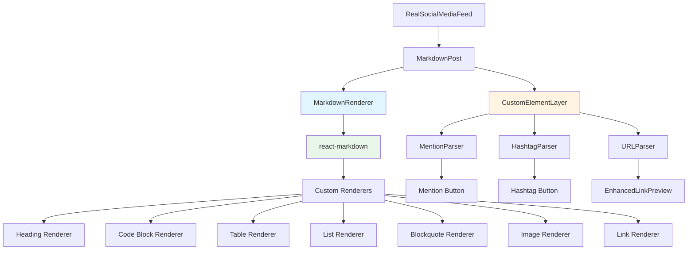
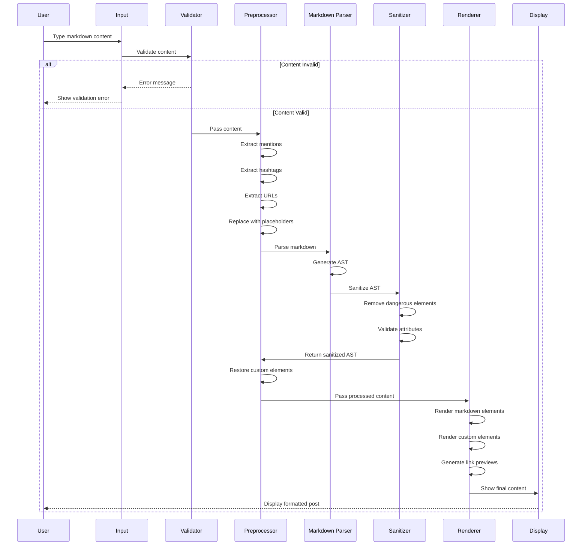
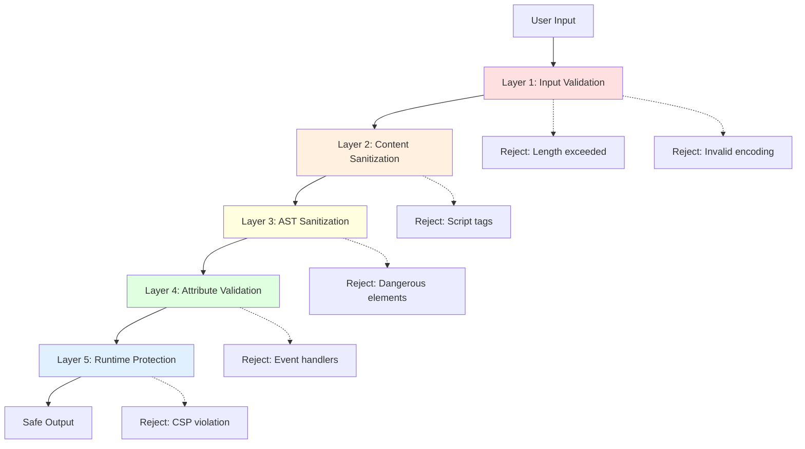
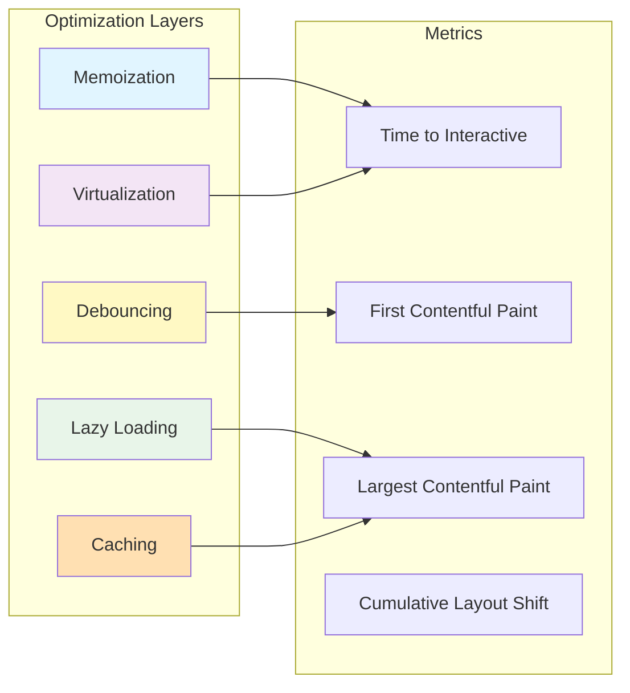
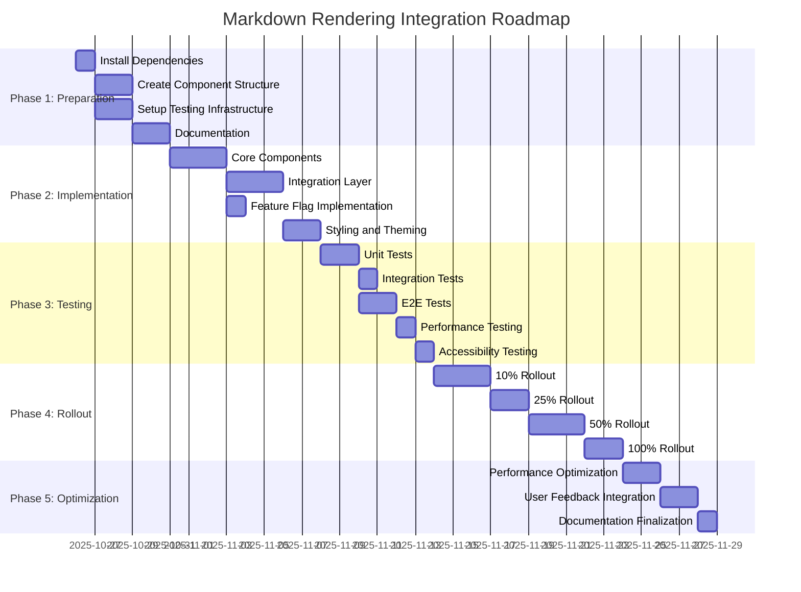

# SPARC Architecture: Markdown Rendering Integration

**Version:** 1.0.0
**Status:** Architecture Phase
**Created:** 2025-10-25
**Technology Stack:** React 18.2.0, TypeScript, react-markdown 10.1.0, Tailwind CSS 3.4.1

---

## Table of Contents

1. [Executive Summary](#executive-summary)
2. [System Architecture](#system-architecture)
3. [Component Architecture](#component-architecture)
4. [Data Flow Architecture](#data-flow-architecture)
5. [Integration Architecture](#integration-architecture)
6. [Security Architecture](#security-architecture)
7. [Performance Architecture](#performance-architecture)
8. [CSS Architecture](#css-architecture)
9. [Testing Architecture](#testing-architecture)
10. [Migration Strategy](#migration-strategy)
11. [Implementation Roadmap](#implementation-roadmap)

---

## Executive Summary

### Objective

Integrate GitHub-Flavored Markdown (GFM) rendering capabilities into the Agent Feed application, enabling rich text formatting while maintaining security, performance, and the existing interactive elements (mentions, hashtags, URLs, link previews).

### Key Requirements

1. **Rich Content Support**: Enable Markdown formatting (headings, lists, code blocks, tables, etc.)
2. **Security First**: Prevent XSS attacks through sanitization and content validation
3. **Performance**: Maintain sub-100ms rendering for typical posts (< 2000 characters)
4. **Backward Compatibility**: Preserve existing functionality (mentions, hashtags, link previews)
5. **Accessibility**: WCAG 2.1 AA compliance for all rendered content
6. **Dark Mode**: Full support for light/dark theme switching

### Architecture Decisions

| Decision | Rationale |
|----------|-----------|
| **Use react-markdown** | Already installed, battle-tested, extensive plugin ecosystem |
| **GitHub-Flavored Markdown (GFM)** | Industry standard, familiar to technical users, supports tables/task lists |
| **Client-side rendering** | Lower server load, instant preview, better UX |
| **Dual parsing strategy** | Markdown parsing + custom interactive elements (mentions/hashtags) |
| **Layered security** | Multiple sanitization layers (rehype-sanitize + custom validation) |
| **Memoized rendering** | React.memo + useMemo for performance optimization |

---

## System Architecture

### High-Level Architecture Diagram

```mermaid
graph TB
    subgraph "User Input Layer"
        INPUT[Post Content Input]
        PREVIEW[Live Preview]
    end

    subgraph "Processing Pipeline"
        VALIDATOR[Content Validator]
        PREPROCESSOR[Content Preprocessor]
        MD_PARSER[Markdown Parser]
        CUSTOM_PARSER[Custom Parser<br/>mentions/hashtags/URLs]
        SANITIZER[Content Sanitizer]
    end

    subgraph "Rendering Layer"
        MD_RENDERER[Markdown Renderer]
        CUSTOM_RENDERER[Custom Element Renderer]
        LINK_PREVIEW[Link Preview Generator]
        COMPOSITOR[Content Compositor]
    end

    subgrid "Output Layer"
        DISPLAY[Rendered Content]
        INTERACTIVE[Interactive Elements]
    end

    INPUT --> VALIDATOR
    VALIDATOR --> PREPROCESSOR
    PREPROCESSOR --> MD_PARSER
    PREPROCESSOR --> CUSTOM_PARSER

    MD_PARSER --> SANITIZER
    CUSTOM_PARSER --> SANITIZER

    SANITIZER --> MD_RENDERER
    SANITIZER --> CUSTOM_RENDERER

    MD_RENDERER --> COMPOSITOR
    CUSTOM_RENDERER --> COMPOSITOR
    COMPOSITOR --> LINK_PREVIEW

    LINK_PREVIEW --> DISPLAY
    COMPOSITOR --> INTERACTIVE

    PREVIEW -.->|Real-time| PREPROCESSOR

    style SANITIZER fill:#f96,stroke:#333,stroke-width:3px
    style VALIDATOR fill:#f96,stroke:#333,stroke-width:2px
```

### System Components

```yaml
system_components:
  input_layer:
    - component: "PostContentInput"
      responsibility: "Capture user markdown input"
      technology: "React controlled component"

    - component: "LivePreview"
      responsibility: "Real-time markdown preview"
      technology: "react-markdown with debouncing"

  processing_pipeline:
    - component: "ContentValidator"
      responsibility: "Validate input length, format, safety"
      validation_rules:
        - max_length: 10000
        - no_script_tags: true
        - no_dangerous_protocols: true

    - component: "ContentPreprocessor"
      responsibility: "Extract and protect custom elements before MD parsing"
      operations:
        - extract_mentions: "/@([a-zA-Z0-9_-]+)/g"
        - extract_hashtags: "/#([a-zA-Z0-9_-]+)/g"
        - extract_urls: "/(https?:\/\/[^\s]+)/g"
        - placeholder_injection: "Replace with safe tokens"

    - component: "MarkdownParser"
      responsibility: "Parse markdown syntax to AST"
      library: "react-markdown (remark/rehype)"
      plugins:
        - remark-gfm: "GitHub Flavored Markdown"
        - remark-breaks: "Convert line breaks to <br>"

    - component: "CustomParser"
      responsibility: "Parse interactive elements"
      patterns:
        - mentions: "Button components with click handlers"
        - hashtags: "Filter navigation buttons"
        - urls: "Link preview triggers"

    - component: "ContentSanitizer"
      responsibility: "Remove dangerous HTML/scripts"
      library: "rehype-sanitize"
      custom_rules: "Allow specific tags/attributes only"

  rendering_layer:
    - component: "MarkdownRenderer"
      responsibility: "Render sanitized markdown to React elements"
      technology: "react-markdown custom renderers"

    - component: "CustomElementRenderer"
      responsibility: "Render interactive elements (mentions, hashtags)"
      technology: "React components with event handlers"

    - component: "LinkPreviewGenerator"
      responsibility: "Generate rich link previews"
      components:
        - EnhancedLinkPreview
        - YouTubeEmbed

    - component: "ContentCompositor"
      responsibility: "Merge markdown + custom elements into final DOM"
      technology: "React fragments and composition"

  output_layer:
    - component: "RenderedContent"
      responsibility: "Display final formatted content"
      features:
        - responsive_design: true
        - dark_mode_support: true
        - accessibility_compliant: true

    - component: "InteractiveElements"
      responsibility: "Handle user interactions"
      handlers:
        - mention_click: "Filter by agent"
        - hashtag_click: "Filter by tag"
        - link_click: "Open URL or preview"
```

---

## Component Architecture

### Component Hierarchy



### Component Structure

```typescript
// Component Type Definitions
interface MarkdownPostProps {
  content: string;
  onMentionClick?: (agent: string) => void;
  onHashtagClick?: (tag: string) => void;
  enableLinkPreviews?: boolean;
  enableMarkdown?: boolean; // Feature flag
  className?: string;
}

interface MarkdownRendererProps {
  content: string;
  customComponents?: CustomComponents;
  sanitizationSchema?: SanitizationSchema;
  className?: string;
}

interface CustomComponents {
  h1?: React.ComponentType<HeadingProps>;
  h2?: React.ComponentType<HeadingProps>;
  h3?: React.ComponentType<HeadingProps>;
  p?: React.ComponentType<ParagraphProps>;
  a?: React.ComponentType<LinkProps>;
  code?: React.ComponentType<CodeProps>;
  pre?: React.ComponentType<PreProps>;
  blockquote?: React.ComponentType<BlockquoteProps>;
  table?: React.ComponentType<TableProps>;
  img?: React.ComponentType<ImageProps>;
  ul?: React.ComponentType<ListProps>;
  ol?: React.ComponentType<ListProps>;
}

interface MarkdownContent {
  raw: string;
  processed: string;
  mentions: Mention[];
  hashtags: Hashtag[];
  urls: URL[];
  codeBlocks: CodeBlock[];
}

interface Mention {
  value: string;
  index: number;
  length: number;
}

interface Hashtag {
  value: string;
  index: number;
  length: number;
}
```

### Component Files Structure

```
frontend/src/
├── components/
│   ├── markdown/
│   │   ├── MarkdownPost.tsx           # Main markdown post component
│   │   ├── MarkdownRenderer.tsx       # Core markdown renderer
│   │   ├── MarkdownPreview.tsx        # Live preview component
│   │   └── renderers/
│   │       ├── HeadingRenderer.tsx    # Custom heading renderer
│   │       ├── CodeBlockRenderer.tsx  # Syntax highlighted code
│   │       ├── TableRenderer.tsx      # Responsive table renderer
│   │       ├── BlockquoteRenderer.tsx # Styled blockquote
│   │       ├── ImageRenderer.tsx      # Lazy-loaded images
│   │       ├── LinkRenderer.tsx       # Enhanced link renderer
│   │       └── index.ts               # Export all renderers
│   │
│   ├── RealSocialMediaFeed.tsx        # Updated to use MarkdownPost
│   ├── EnhancedLinkPreview.tsx        # Existing (unchanged)
│   └── LinkPreview.tsx                # Existing (unchanged)
│
├── utils/
│   ├── markdown/
│   │   ├── markdownProcessor.ts       # Content preprocessing
│   │   ├── markdownParser.ts          # Markdown parsing utilities
│   │   ├── markdownSanitizer.ts       # Security sanitization
│   │   └── markdownUtils.ts           # Helper functions
│   │
│   └── contentParser.tsx              # Updated to work with markdown
│
├── hooks/
│   ├── useMarkdown.ts                 # Markdown processing hook
│   ├── useMarkdownPreview.ts          # Live preview hook
│   └── useMarkdownSecurity.ts         # Security validation hook
│
└── styles/
    └── markdown.css                   # Markdown-specific styles
```

---

## Data Flow Architecture

### Content Processing Pipeline



### State Management Flow

```typescript
// Content Processing State Machine
type ContentState =
  | { type: 'idle' }
  | { type: 'validating'; content: string }
  | { type: 'processing'; content: string }
  | { type: 'rendering'; processedContent: ProcessedContent }
  | { type: 'error'; error: ValidationError }
  | { type: 'success'; renderedContent: React.ReactNode };

interface ProcessedContent {
  markdownAST: MarkdownAST;
  customElements: CustomElement[];
  linkPreviews: LinkPreviewData[];
  metadata: ContentMetadata;
}

interface ContentMetadata {
  wordCount: number;
  readingTime: number;
  codeBlockCount: number;
  linkCount: number;
  mentionCount: number;
  hashtagCount: number;
}
```

### Data Transformation Pipeline

```yaml
data_transformations:
  stage_1_validation:
    input: "Raw user input string"
    operations:
      - validate_length: "< 10000 characters"
      - validate_encoding: "UTF-8"
      - detect_malicious_patterns: "Script tags, data URIs"
    output: "Validated raw string"

  stage_2_preprocessing:
    input: "Validated raw string"
    operations:
      - extract_custom_elements:
          mentions: "/@([a-zA-Z0-9_-]+)/g → Placeholder token"
          hashtags: "/#([a-zA-Z0-9_-]+)/g → Placeholder token"
          urls: "/(https?:\/\/[^\s]+)/g → Placeholder token"
      - normalize_whitespace: "Convert tabs, multiple spaces"
      - escape_html_entities: "< → &lt;, > → &gt;"
    output: "Preprocessed string with placeholders"

  stage_3_markdown_parsing:
    input: "Preprocessed string"
    operations:
      - parse_markdown: "remark-parse → MDAST"
      - apply_gfm_plugin: "Add tables, task lists, strikethrough"
      - transform_to_hast: "mdast-util-to-hast → HAST"
    output: "HTML Abstract Syntax Tree (HAST)"

  stage_4_sanitization:
    input: "HAST"
    operations:
      - apply_sanitization_schema: "rehype-sanitize"
      - remove_dangerous_tags: "script, iframe, embed, object"
      - validate_attributes: "href, src, alt only"
      - remove_event_handlers: "onclick, onerror, etc."
    output: "Sanitized HAST"

  stage_5_custom_element_restoration:
    input: "Sanitized HAST + Placeholder map"
    operations:
      - replace_mention_placeholders: "→ React Button components"
      - replace_hashtag_placeholders: "→ React Button components"
      - replace_url_placeholders: "→ Link Preview components"
    output: "Final React element tree"

  stage_6_rendering:
    input: "React element tree"
    operations:
      - apply_custom_renderers: "Code highlighting, table styling"
      - generate_link_previews: "Fetch metadata, render cards"
      - apply_accessibility_attributes: "ARIA labels, roles"
      - apply_styling: "Tailwind classes, dark mode"
    output: "Rendered DOM"
```

---

## Integration Architecture

### react-markdown Integration

```typescript
// Core Markdown Renderer Component
import React, { useMemo } from 'react';
import ReactMarkdown from 'react-markdown';
import remarkGfm from 'remark-gfm';
import rehypeSanitize from 'rehype-sanitize';
import rehypeHighlight from 'rehype-highlight';
import { customRenderers } from './renderers';
import { createSanitizationSchema } from '../utils/markdown/markdownSanitizer';

interface MarkdownRendererProps {
  content: string;
  className?: string;
  onLinkClick?: (url: string) => void;
}

export const MarkdownRenderer: React.FC<MarkdownRendererProps> = ({
  content,
  className = '',
  onLinkClick
}) => {
  // Memoize sanitization schema
  const sanitizationSchema = useMemo(() => createSanitizationSchema(), []);

  // Memoize custom components
  const components = useMemo(() => ({
    ...customRenderers,
    a: ({ href, children, ...props }) => (
      <LinkRenderer
        href={href}
        onClick={onLinkClick}
        {...props}
      >
        {children}
      </LinkRenderer>
    )
  }), [onLinkClick]);

  return (
    <div className={`markdown-content ${className}`}>
      <ReactMarkdown
        remarkPlugins={[remarkGfm]}
        rehypePlugins={[
          [rehypeSanitize, sanitizationSchema],
          rehypeHighlight
        ]}
        components={components}
      >
        {content}
      </ReactMarkdown>
    </div>
  );
};
```

### Custom Renderer Integration

```typescript
// Custom Renderer Architecture
import React from 'react';
import type { Components } from 'react-markdown';

export const customRenderers: Components = {
  // Headings with anchor links
  h1: ({ children, ...props }) => (
    <h1
      className="text-3xl font-bold text-gray-900 dark:text-gray-100 mb-4 mt-6"
      {...props}
    >
      {children}
    </h1>
  ),

  h2: ({ children, ...props }) => (
    <h2
      className="text-2xl font-semibold text-gray-900 dark:text-gray-100 mb-3 mt-5"
      {...props}
    >
      {children}
    </h2>
  ),

  h3: ({ children, ...props }) => (
    <h3
      className="text-xl font-semibold text-gray-900 dark:text-gray-100 mb-2 mt-4"
      {...props}
    >
      {children}
    </h3>
  ),

  // Paragraphs with proper spacing
  p: ({ children, ...props }) => (
    <p
      className="text-gray-700 dark:text-gray-300 mb-4 leading-relaxed"
      {...props}
    >
      {children}
    </p>
  ),

  // Code blocks with syntax highlighting
  code: ({ inline, className, children, ...props }) => {
    const match = /language-(\w+)/.exec(className || '');
    const language = match ? match[1] : '';

    return !inline ? (
      <CodeBlockRenderer language={language}>
        {String(children).replace(/\n$/, '')}
      </CodeBlockRenderer>
    ) : (
      <code
        className="px-1.5 py-0.5 bg-gray-100 dark:bg-gray-800 text-pink-600 dark:text-pink-400 rounded text-sm font-mono"
        {...props}
      >
        {children}
      </code>
    );
  },

  // Blockquotes
  blockquote: ({ children, ...props }) => (
    <blockquote
      className="border-l-4 border-blue-500 pl-4 py-2 my-4 bg-blue-50 dark:bg-blue-900/20 text-gray-700 dark:text-gray-300 italic"
      {...props}
    >
      {children}
    </blockquote>
  ),

  // Tables (responsive)
  table: ({ children, ...props }) => (
    <div className="overflow-x-auto my-4">
      <table
        className="min-w-full divide-y divide-gray-200 dark:divide-gray-700 border border-gray-200 dark:border-gray-700"
        {...props}
      >
        {children}
      </table>
    </div>
  ),

  thead: ({ children, ...props }) => (
    <thead
      className="bg-gray-50 dark:bg-gray-800"
      {...props}
    >
      {children}
    </thead>
  ),

  tbody: ({ children, ...props }) => (
    <tbody
      className="bg-white dark:bg-gray-900 divide-y divide-gray-200 dark:divide-gray-700"
      {...props}
    >
      {children}
    </tbody>
  ),

  tr: ({ children, ...props }) => (
    <tr {...props}>{children}</tr>
  ),

  th: ({ children, ...props }) => (
    <th
      className="px-6 py-3 text-left text-xs font-medium text-gray-500 dark:text-gray-400 uppercase tracking-wider"
      {...props}
    >
      {children}
    </th>
  ),

  td: ({ children, ...props }) => (
    <td
      className="px-6 py-4 whitespace-nowrap text-sm text-gray-700 dark:text-gray-300"
      {...props}
    >
      {children}
    </td>
  ),

  // Lists
  ul: ({ children, ...props }) => (
    <ul
      className="list-disc list-inside mb-4 space-y-2 text-gray-700 dark:text-gray-300"
      {...props}
    >
      {children}
    </ul>
  ),

  ol: ({ children, ...props }) => (
    <ol
      className="list-decimal list-inside mb-4 space-y-2 text-gray-700 dark:text-gray-300"
      {...props}
    >
      {children}
    </ol>
  ),

  li: ({ children, ...props }) => (
    <li className="ml-4" {...props}>{children}</li>
  ),

  // Images (lazy loaded, responsive)
  img: ({ src, alt, ...props }) => (
    <ImageRenderer src={src} alt={alt} {...props} />
  ),

  // Horizontal rules
  hr: (props) => (
    <hr
      className="my-8 border-gray-200 dark:border-gray-700"
      {...props}
    />
  )
};
```

### Custom Element Integration Strategy

```typescript
// Hybrid Rendering Strategy: Markdown + Custom Elements

interface HybridContentRendererProps {
  content: string;
  onMentionClick?: (agent: string) => void;
  onHashtagClick?: (tag: string) => void;
  enableLinkPreviews?: boolean;
}

export const HybridContentRenderer: React.FC<HybridContentRendererProps> = ({
  content,
  onMentionClick,
  onHashtagClick,
  enableLinkPreviews = true
}) => {
  const processedContent = useMemo(() => {
    // Step 1: Extract custom elements and replace with placeholders
    const { processedText, customElements } = extractCustomElements(content);

    // Step 2: Parse markdown
    const markdownAST = parseMarkdown(processedText);

    // Step 3: Restore custom elements
    const finalContent = restoreCustomElements(markdownAST, customElements);

    return finalContent;
  }, [content]);

  return (
    <div className="hybrid-content">
      <MarkdownRenderer content={processedContent.markdown} />
      <CustomElementsLayer
        elements={processedContent.customElements}
        onMentionClick={onMentionClick}
        onHashtagClick={onHashtagClick}
      />
      {enableLinkPreviews && (
        <LinkPreviewsLayer urls={processedContent.urls} />
      )}
    </div>
  );
};

// Custom element extraction
function extractCustomElements(content: string) {
  const customElements: CustomElement[] = [];
  let processedText = content;

  // Extract mentions
  const mentionRegex = /@([a-zA-Z0-9_-]+)/g;
  let match;
  while ((match = mentionRegex.exec(content)) !== null) {
    const placeholder = `__MENTION_${customElements.length}__`;
    customElements.push({
      type: 'mention',
      value: match[1],
      placeholder,
      originalText: match[0],
      index: match.index
    });
  }

  // Extract hashtags
  const hashtagRegex = /#([a-zA-Z0-9_-]+)/g;
  while ((match = hashtagRegex.exec(content)) !== null) {
    const placeholder = `__HASHTAG_${customElements.length}__`;
    customElements.push({
      type: 'hashtag',
      value: match[1],
      placeholder,
      originalText: match[0],
      index: match.index
    });
  }

  // Replace with placeholders
  customElements.forEach(element => {
    processedText = processedText.replace(element.originalText, element.placeholder);
  });

  return { processedText, customElements };
}
```

---

## Security Architecture

### Multi-Layer Security Model



### Sanitization Schema

```typescript
// Security Configuration
import { defaultSchema } from 'rehype-sanitize';
import type { Schema } from 'rehype-sanitize';

export function createSanitizationSchema(): Schema {
  return {
    ...defaultSchema,

    // Allowed tags
    tagNames: [
      // Text formatting
      'p', 'br', 'strong', 'em', 'u', 's', 'del', 'ins',

      // Headings
      'h1', 'h2', 'h3', 'h4', 'h5', 'h6',

      // Lists
      'ul', 'ol', 'li',

      // Code
      'code', 'pre',

      // Blockquote
      'blockquote',

      // Tables
      'table', 'thead', 'tbody', 'tr', 'th', 'td',

      // Links (sanitized)
      'a',

      // Images (sanitized)
      'img',

      // Horizontal rule
      'hr',

      // Div/span for styling (carefully controlled)
      'div', 'span'
    ],

    // Allowed attributes per tag
    attributes: {
      '*': [
        'className', // Allow Tailwind classes
        'id' // For anchor links
      ],

      'a': [
        'href',
        'title',
        'target',
        'rel' // Must be 'noopener noreferrer'
      ],

      'img': [
        'src',
        'alt',
        'title',
        'width',
        'height',
        'loading' // For lazy loading
      ],

      'code': [
        'className' // For language highlighting
      ],

      'table': [
        'className'
      ],

      'th': [
        'scope',
        'className'
      ],

      'td': [
        'className'
      ]
    },

    // Protocol whitelist for links
    protocols: {
      href: ['http', 'https', 'mailto'],
      src: ['http', 'https']
    },

    // Strip dangerous attributes
    strip: ['script', 'style', 'iframe', 'embed', 'object'],

    // Custom attribute filtering
    clobberPrefix: 'user-',
    clobber: ['name', 'id']
  };
}

// Additional security validations
export function validateContent(content: string): ValidationResult {
  const errors: string[] = [];

  // Length validation
  if (content.length > 10000) {
    errors.push('Content exceeds maximum length of 10,000 characters');
  }

  // Detect script injections
  if (/<script[^>]*>.*?<\/script>/gi.test(content)) {
    errors.push('Script tags are not allowed');
  }

  // Detect data URIs (potential XSS vector)
  if (/data:text\/html/gi.test(content)) {
    errors.push('Data URIs are not allowed');
  }

  // Detect event handlers
  if (/on\w+\s*=/gi.test(content)) {
    errors.push('Event handlers are not allowed');
  }

  // Detect iframe injections
  if (/<iframe[^>]*>/gi.test(content)) {
    errors.push('iframes are not allowed');
  }

  return {
    valid: errors.length === 0,
    errors
  };
}
```

### XSS Prevention Strategy

```yaml
xss_prevention:
  input_layer:
    - validate_encoding: "UTF-8 only"
    - reject_null_bytes: "\\x00"
    - limit_length: "10,000 characters"
    - detect_patterns:
        - "<script": "Reject immediately"
        - "javascript:": "Reject immediately"
        - "data:text/html": "Reject immediately"

  parsing_layer:
    - use_safe_parser: "remark (AST-based)"
    - escape_html: "Automatic by react-markdown"
    - validate_ast: "Check node types"

  sanitization_layer:
    - apply_rehype_sanitize: "GitHub sanitization schema"
    - whitelist_tags: "Only safe HTML tags"
    - whitelist_attributes: "Only safe attributes"
    - validate_protocols: "http/https only for links"
    - remove_event_handlers: "onclick, onerror, etc."

  rendering_layer:
    - react_escaping: "Automatic by React"
    - csp_headers: "Content-Security-Policy"
    - sandbox_iframes: "If ever allowed"

  runtime_layer:
    - monitor_dom: "Detect dynamic script injection"
    - validate_output: "Final HTML validation"
```

### Content Security Policy (CSP)

```typescript
// Recommended CSP headers for the application
export const contentSecurityPolicy = {
  "default-src": ["'self'"],
  "script-src": ["'self'", "'unsafe-inline'"], // React needs inline
  "style-src": ["'self'", "'unsafe-inline'"], // Tailwind needs inline
  "img-src": [
    "'self'",
    "data:", // Allow data URIs for images only
    "https:", // External images
    "http:" // For development
  ],
  "font-src": ["'self'", "data:"],
  "connect-src": ["'self'", "https://api.github.com"], // API endpoints
  "frame-src": ["'none'"], // No iframes
  "object-src": ["'none'"], // No plugins
  "base-uri": ["'self'"],
  "form-action": ["'self'"],
  "frame-ancestors": ["'none'"]
};
```

---

## Performance Architecture

### Performance Optimization Strategy



### Memoization Strategy

```typescript
// Performance-optimized component structure

import React, { useMemo, memo } from 'react';

// Memoized markdown renderer
export const MarkdownRenderer = memo<MarkdownRendererProps>(
  ({ content, className, onLinkClick }) => {
    // Memoize parsed content
    const parsedContent = useMemo(() => {
      console.time('markdown-parse');
      const result = parseMarkdown(content);
      console.timeEnd('markdown-parse');
      return result;
    }, [content]);

    // Memoize custom components
    const components = useMemo(() => createCustomComponents(onLinkClick), [onLinkClick]);

    // Memoize sanitization schema
    const schema = useMemo(() => createSanitizationSchema(), []);

    return (
      <div className={className}>
        <ReactMarkdown
          remarkPlugins={[remarkGfm]}
          rehypePlugins={[[rehypeSanitize, schema], rehypeHighlight]}
          components={components}
        >
          {parsedContent}
        </ReactMarkdown>
      </div>
    );
  },
  // Custom comparison function
  (prevProps, nextProps) => {
    return (
      prevProps.content === nextProps.content &&
      prevProps.className === nextProps.className &&
      prevProps.onLinkClick === nextProps.onLinkClick
    );
  }
);

// Memoized custom element renderer
export const CustomElementRenderer = memo<CustomElementProps>(
  ({ element, onClick }) => {
    switch (element.type) {
      case 'mention':
        return (
          <MentionButton
            agent={element.value}
            onClick={() => onClick?.(element.value)}
          />
        );

      case 'hashtag':
        return (
          <HashtagButton
            tag={element.value}
            onClick={() => onClick?.(element.value)}
          />
        );

      default:
        return null;
    }
  }
);
```

### Lazy Loading Implementation

```typescript
// Lazy load heavy components
import React, { lazy, Suspense } from 'react';

// Code block renderer with syntax highlighting (heavy dependency)
const CodeBlockRenderer = lazy(() => import('./renderers/CodeBlockRenderer'));

// Image renderer with lazy loading
const ImageRenderer = lazy(() => import('./renderers/ImageRenderer'));

// YouTube embed renderer
const YouTubeEmbed = lazy(() => import('./YouTubeEmbed'));

// Wrapper with suspense
export const LazyMarkdownRenderer: React.FC<MarkdownRendererProps> = (props) => {
  return (
    <Suspense fallback={<MarkdownSkeleton />}>
      <MarkdownRenderer {...props} />
    </Suspense>
  );
};

// Skeleton loader
const MarkdownSkeleton: React.FC = () => (
  <div className="animate-pulse space-y-4">
    <div className="h-8 bg-gray-200 dark:bg-gray-700 rounded w-3/4"></div>
    <div className="h-4 bg-gray-200 dark:bg-gray-700 rounded"></div>
    <div className="h-4 bg-gray-200 dark:bg-gray-700 rounded w-5/6"></div>
    <div className="h-4 bg-gray-200 dark:bg-gray-700 rounded w-4/6"></div>
  </div>
);
```

### Performance Budgets

```yaml
performance_budgets:
  parsing:
    markdown_parsing: "< 50ms for 2000 characters"
    custom_element_extraction: "< 10ms"
    sanitization: "< 20ms"
    total_processing: "< 100ms"

  rendering:
    initial_render: "< 100ms"
    re-render: "< 16ms (60fps)"
    link_preview_generation: "< 200ms"

  memory:
    component_size: "< 500KB"
    cache_size: "< 5MB"
    ast_size: "< 1MB per post"

  network:
    syntax_highlighting_bundle: "< 100KB"
    total_markdown_dependencies: "< 200KB"

  metrics:
    time_to_interactive: "< 2s"
    first_contentful_paint: "< 1s"
    largest_contentful_paint: "< 2.5s"
    cumulative_layout_shift: "< 0.1"
```

### Debouncing Strategy

```typescript
// Debounced live preview
import { useMemo, useCallback, useState, useEffect } from 'react';

export function useMarkdownPreview(content: string, delay: number = 300) {
  const [debouncedContent, setDebouncedContent] = useState(content);

  useEffect(() => {
    const timer = setTimeout(() => {
      setDebouncedContent(content);
    }, delay);

    return () => clearTimeout(timer);
  }, [content, delay]);

  const processedContent = useMemo(() => {
    return processMarkdown(debouncedContent);
  }, [debouncedContent]);

  return processedContent;
}

// Usage in preview component
export const MarkdownPreview: React.FC<MarkdownPreviewProps> = ({ content }) => {
  const processedContent = useMarkdownPreview(content, 300);

  return (
    <div className="markdown-preview">
      <MarkdownRenderer content={processedContent} />
    </div>
  );
};
```

---

## CSS Architecture

### Markdown Styling System

```css
/* /frontend/src/styles/markdown.css */

/* Base markdown container */
.markdown-content {
  @apply text-gray-900 dark:text-gray-100;
  @apply leading-relaxed;
  word-wrap: break-word;
  overflow-wrap: break-word;
}

/* Typography Hierarchy */
.markdown-content h1 {
  @apply text-3xl font-bold mb-4 mt-6;
  @apply text-gray-900 dark:text-gray-100;
  @apply border-b-2 border-gray-200 dark:border-gray-700 pb-2;
}

.markdown-content h2 {
  @apply text-2xl font-semibold mb-3 mt-5;
  @apply text-gray-900 dark:text-gray-100;
  @apply border-b border-gray-200 dark:border-gray-700 pb-1;
}

.markdown-content h3 {
  @apply text-xl font-semibold mb-2 mt-4;
  @apply text-gray-800 dark:text-gray-200;
}

.markdown-content h4 {
  @apply text-lg font-semibold mb-2 mt-3;
  @apply text-gray-800 dark:text-gray-200;
}

.markdown-content h5,
.markdown-content h6 {
  @apply text-base font-semibold mb-2 mt-3;
  @apply text-gray-700 dark:text-gray-300;
}

/* Paragraphs */
.markdown-content p {
  @apply mb-4 leading-relaxed;
  @apply text-gray-700 dark:text-gray-300;
}

.markdown-content p:last-child {
  @apply mb-0;
}

/* Links */
.markdown-content a {
  @apply text-blue-600 dark:text-blue-400;
  @apply hover:text-blue-800 dark:hover:text-blue-300;
  @apply underline decoration-blue-300 dark:decoration-blue-700;
  @apply transition-colors duration-200;
}

/* Lists */
.markdown-content ul,
.markdown-content ol {
  @apply mb-4 ml-6 space-y-2;
  @apply text-gray-700 dark:text-gray-300;
}

.markdown-content ul {
  @apply list-disc;
}

.markdown-content ol {
  @apply list-decimal;
}

.markdown-content li {
  @apply leading-relaxed;
}

.markdown-content li > p {
  @apply mb-2;
}

/* Nested lists */
.markdown-content ul ul,
.markdown-content ol ul,
.markdown-content ul ol,
.markdown-content ol ol {
  @apply mt-2 mb-2;
}

/* Code - Inline */
.markdown-content code {
  @apply px-1.5 py-0.5 rounded;
  @apply bg-gray-100 dark:bg-gray-800;
  @apply text-pink-600 dark:text-pink-400;
  @apply font-mono text-sm;
  @apply border border-gray-200 dark:border-gray-700;
}

/* Code - Blocks */
.markdown-content pre {
  @apply mb-4 rounded-lg overflow-x-auto;
  @apply bg-gray-900 dark:bg-gray-950;
  @apply border border-gray-700;
}

.markdown-content pre code {
  @apply block p-4;
  @apply bg-transparent border-0;
  @apply text-gray-100;
  @apply text-sm leading-relaxed;
  font-family: 'Consolas', 'Monaco', 'Courier New', monospace;
}

/* Syntax highlighting (highlight.js) */
.markdown-content .hljs {
  @apply bg-gray-900 dark:bg-gray-950;
  @apply text-gray-100;
}

.markdown-content .hljs-keyword {
  @apply text-purple-400;
}

.markdown-content .hljs-string {
  @apply text-green-400;
}

.markdown-content .hljs-number {
  @apply text-orange-400;
}

.markdown-content .hljs-comment {
  @apply text-gray-500 italic;
}

.markdown-content .hljs-function {
  @apply text-blue-400;
}

/* Blockquotes */
.markdown-content blockquote {
  @apply border-l-4 border-blue-500 pl-4 py-2 my-4;
  @apply bg-blue-50 dark:bg-blue-900/20;
  @apply text-gray-700 dark:text-gray-300 italic;
}

.markdown-content blockquote p {
  @apply mb-2;
}

.markdown-content blockquote p:last-child {
  @apply mb-0;
}

/* Tables */
.markdown-content table {
  @apply w-full mb-4 border-collapse;
  @apply border border-gray-200 dark:border-gray-700;
}

.markdown-content thead {
  @apply bg-gray-50 dark:bg-gray-800;
}

.markdown-content th {
  @apply px-4 py-2 text-left font-semibold;
  @apply text-gray-900 dark:text-gray-100;
  @apply border-b-2 border-gray-300 dark:border-gray-600;
}

.markdown-content td {
  @apply px-4 py-2;
  @apply text-gray-700 dark:text-gray-300;
  @apply border-b border-gray-200 dark:border-gray-700;
}

.markdown-content tr:last-child td {
  @apply border-b-0;
}

.markdown-content tbody tr:hover {
  @apply bg-gray-50 dark:bg-gray-800/50;
  @apply transition-colors duration-150;
}

/* Horizontal Rules */
.markdown-content hr {
  @apply my-8 border-0 border-t-2;
  @apply border-gray-200 dark:border-gray-700;
}

/* Images */
.markdown-content img {
  @apply max-w-full h-auto rounded-lg;
  @apply border border-gray-200 dark:border-gray-700;
  @apply my-4;
}

/* Task Lists (GFM) */
.markdown-content .task-list-item {
  @apply list-none;
}

.markdown-content .task-list-item input[type="checkbox"] {
  @apply mr-2;
  @apply cursor-pointer;
}

/* Strikethrough (GFM) */
.markdown-content del {
  @apply text-gray-500 dark:text-gray-400;
  @apply line-through;
}

/* Responsive Tables */
@media (max-width: 768px) {
  .markdown-content table {
    @apply text-sm;
  }

  .markdown-content th,
  .markdown-content td {
    @apply px-2 py-1;
  }
}

/* Dark Mode Transitions */
.markdown-content * {
  @apply transition-colors duration-200;
}

/* Focus Styles for Accessibility */
.markdown-content a:focus,
.markdown-content button:focus {
  @apply outline-none ring-2 ring-blue-500 ring-offset-2;
  @apply dark:ring-blue-400 dark:ring-offset-gray-900;
}
```

### Tailwind Integration

```typescript
// Tailwind plugin for markdown prose
// tailwind.config.js extension

module.exports = {
  theme: {
    extend: {
      typography: {
        DEFAULT: {
          css: {
            maxWidth: 'none',
            color: 'var(--tw-prose-body)',
            a: {
              color: 'var(--tw-prose-links)',
              textDecoration: 'underline',
              '&:hover': {
                color: 'var(--tw-prose-links-hover)',
              },
            },
            code: {
              color: 'var(--tw-prose-code)',
              backgroundColor: 'var(--tw-prose-code-bg)',
              padding: '0.25rem 0.375rem',
              borderRadius: '0.25rem',
              fontWeight: '400',
            },
            'code::before': {
              content: '""',
            },
            'code::after': {
              content: '""',
            },
          },
        },
      },
    },
  },
  plugins: [
    require('@tailwindcss/typography'),
  ],
};
```

---

## Testing Architecture

### Test Strategy

```yaml
testing_strategy:
  unit_tests:
    scope: "Individual components and utilities"
    framework: "Vitest + React Testing Library"
    coverage_target: "80%"
    tests:
      - markdown_parser:
          - test_basic_formatting: "bold, italic, strikethrough"
          - test_headings: "h1-h6"
          - test_lists: "ul, ol, nested"
          - test_code_blocks: "inline and fenced"
          - test_blockquotes: "single and nested"
          - test_tables: "headers, rows, alignment"

      - sanitizer:
          - test_xss_prevention: "script injection, event handlers"
          - test_dangerous_protocols: "javascript:, data:text/html"
          - test_allowed_tags: "whitelist validation"
          - test_attribute_filtering: "remove dangerous attributes"

      - custom_element_parser:
          - test_mention_extraction: "single, multiple, edge cases"
          - test_hashtag_extraction: "single, multiple, edge cases"
          - test_url_extraction: "http, https, query params"
          - test_placeholder_replacement: "restore after markdown parsing"

      - renderers:
          - test_heading_renderer: "accessibility, styling"
          - test_code_block_renderer: "syntax highlighting, language detection"
          - test_table_renderer: "responsive, dark mode"
          - test_image_renderer: "lazy loading, alt text"

  integration_tests:
    scope: "Component interactions and data flow"
    framework: "Vitest + React Testing Library"
    coverage_target: "70%"
    tests:
      - markdown_to_dom:
          - test_full_pipeline: "input → processing → rendering"
          - test_custom_element_integration: "markdown + mentions/hashtags"
          - test_link_preview_generation: "URL detection → preview"

      - performance:
          - test_rendering_speed: "< 100ms for typical content"
          - test_memoization: "no unnecessary re-renders"
          - test_lazy_loading: "code splitting works"

  e2e_tests:
    scope: "User workflows and real-world scenarios"
    framework: "Playwright"
    coverage_target: "Critical paths"
    tests:
      - post_creation:
          - test_markdown_input: "type markdown → see preview"
          - test_mention_autocomplete: "@mention → suggestion"
          - test_hashtag_autocomplete: "#tag → suggestion"
          - test_link_preview: "paste URL → preview appears"

      - post_viewing:
          - test_markdown_rendering: "formatted content displays correctly"
          - test_code_highlighting: "syntax colors visible"
          - test_table_rendering: "tables are responsive"
          - test_interactive_elements: "click mention → filter"

      - security:
          - test_xss_prevention: "inject script → blocked"
          - test_html_sanitization: "dangerous HTML → stripped"

  visual_regression_tests:
    scope: "UI consistency across changes"
    framework: "Playwright + Percy/Chromatic"
    tests:
      - snapshot_markdown_elements:
          - headings
          - code_blocks
          - tables
          - blockquotes
          - lists

      - snapshot_themes:
          - light_mode
          - dark_mode

  accessibility_tests:
    scope: "WCAG 2.1 AA compliance"
    framework: "axe-core + Playwright"
    tests:
      - test_keyboard_navigation: "tab through elements"
      - test_screen_reader: "ARIA labels, roles"
      - test_color_contrast: "meet WCAG ratios"
      - test_focus_indicators: "visible focus states"
```

### Test Examples

```typescript
// Unit Test: Markdown Parser
import { describe, it, expect } from 'vitest';
import { parseMarkdown } from '../utils/markdown/markdownParser';

describe('Markdown Parser', () => {
  it('should parse basic formatting', () => {
    const input = '**bold** and *italic*';
    const result = parseMarkdown(input);

    expect(result).toContain('<strong>bold</strong>');
    expect(result).toContain('<em>italic</em>');
  });

  it('should parse headings', () => {
    const input = '# H1\n## H2\n### H3';
    const result = parseMarkdown(input);

    expect(result).toContain('<h1>H1</h1>');
    expect(result).toContain('<h2>H2</h2>');
    expect(result).toContain('<h3>H3</h3>');
  });

  it('should parse code blocks with language', () => {
    const input = '```javascript\nconst x = 1;\n```';
    const result = parseMarkdown(input);

    expect(result).toContain('<code class="language-javascript">');
    expect(result).toContain('const x = 1;');
  });
});

// Unit Test: Sanitizer
import { sanitizeContent } from '../utils/markdown/markdownSanitizer';

describe('Content Sanitizer', () => {
  it('should remove script tags', () => {
    const input = 'Hello <script>alert("xss")</script> world';
    const result = sanitizeContent(input);

    expect(result).not.toContain('<script>');
    expect(result).toContain('Hello');
    expect(result).toContain('world');
  });

  it('should remove event handlers', () => {
    const input = '';
    const result = sanitizeContent(input);

    expect(result).not.toContain('onerror');
  });

  it('should allow safe markdown elements', () => {
    const input = '<strong>bold</strong> and <em>italic</em>';
    const result = sanitizeContent(input);

    expect(result).toContain('<strong>bold</strong>');
    expect(result).toContain('<em>italic</em>');
  });
});

// Integration Test: Full Rendering Pipeline
import { render, screen } from '@testing-library/react';
import { MarkdownPost } from '../components/markdown/MarkdownPost';

describe('Markdown Post Integration', () => {
  it('should render markdown with custom elements', () => {
    const content = '# Hello\n\nCheck out @agent and #hashtag\n\nhttps://example.com';

    render(
      <MarkdownPost
        content={content}
        onMentionClick={(agent) => console.log(agent)}
        onHashtagClick={(tag) => console.log(tag)}
      />
    );

    // Markdown rendering
    expect(screen.getByText('Hello')).toBeInTheDocument();

    // Custom elements
    expect(screen.getByText('@agent')).toBeInTheDocument();
    expect(screen.getByText('#hashtag')).toBeInTheDocument();

    // Link preview
    expect(screen.getByText('https://example.com')).toBeInTheDocument();
  });
});

// E2E Test: Post Creation with Markdown
import { test, expect } from '@playwright/test';

test('create post with markdown formatting', async ({ page }) => {
  await page.goto('/');

  // Input markdown content
  const input = await page.locator('[data-testid="post-input"]');
  await input.fill('# My Post\n\n**Bold text** and *italic*\n\n```js\nconst x = 1;\n```');

  // Submit
  await page.click('[data-testid="submit-post"]');

  // Verify rendering
  await expect(page.locator('h1')).toContainText('My Post');
  await expect(page.locator('strong')).toContainText('Bold text');
  await expect(page.locator('em')).toContainText('italic');
  await expect(page.locator('code')).toContainText('const x = 1;');
});
```

---

## Migration Strategy

### Phased Rollout Plan

```yaml
migration_phases:
  phase_1_preparation:
    duration: "1 week"
    tasks:
      - install_dependencies:
          - react-markdown: "10.1.0"
          - remark-gfm: "4.0.1"
          - rehype-sanitize: "6.0.0"
          - rehype-highlight: "7.0.2"

      - create_component_structure:
          - MarkdownRenderer component
          - Custom renderer components
          - Utility functions

      - setup_testing:
          - Unit test suite
          - Integration test suite
          - E2E test scenarios

      - create_documentation:
          - Architecture docs
          - API documentation
          - User guide

  phase_2_parallel_implementation:
    duration: "2 weeks"
    strategy: "Feature flag controlled rollout"
    tasks:
      - implement_core_components:
          - MarkdownRenderer
          - CustomRenderers
          - Sanitization utilities

      - implement_integration:
          - Update contentParser.tsx
          - Create hybrid rendering system
          - Maintain backward compatibility

      - add_feature_flag:
          code: |
            const ENABLE_MARKDOWN =
              process.env.REACT_APP_ENABLE_MARKDOWN === 'true';

      - implement_ab_testing:
          - 10% users get markdown
          - Monitor performance
          - Collect feedback

  phase_3_testing:
    duration: "1 week"
    tasks:
      - run_unit_tests:
          coverage_target: "80%"

      - run_integration_tests:
          coverage_target: "70%"

      - run_e2e_tests:
          scenarios:
            - post_creation
            - post_viewing
            - security_validation

      - performance_testing:
          - rendering_speed: "< 100ms"
          - memory_usage: "< 5MB"
          - bundle_size: "< 200KB"

      - accessibility_testing:
          - WCAG_2.1_AA: "100% compliance"
          - screen_reader_testing: "NVDA, JAWS"
          - keyboard_navigation: "full support"

  phase_4_gradual_rollout:
    duration: "2 weeks"
    strategy: "Percentage-based rollout"
    rollout_schedule:
      week_1:
        - 10%_users: "Monitor errors, performance"
        - decision_point: "Continue or rollback"

      week_2:
        - 25%_users: "Expand rollout"
        - collect_feedback: "User surveys"

      week_3:
        - 50%_users: "Majority rollout"
        - monitor_metrics: "Error rate, performance"

      week_4:
        - 100%_users: "Full rollout"
        - remove_feature_flag: "Make default"

  phase_5_optimization:
    duration: "1 week"
    tasks:
      - performance_optimization:
          - memoization_tuning
          - lazy_loading_refinement
          - bundle_size_reduction

      - user_feedback_integration:
          - address_pain_points
          - improve_ux

      - documentation_update:
          - user_guide_finalization
          - api_docs_update
```

### Backward Compatibility Strategy

```typescript
// Hybrid rendering approach for backward compatibility

interface ContentRendererProps {
  content: string;
  enableMarkdown?: boolean; // Feature flag
  onMentionClick?: (agent: string) => void;
  onHashtagClick?: (tag: string) => void;
  enableLinkPreviews?: boolean;
}

export const ContentRenderer: React.FC<ContentRendererProps> = ({
  content,
  enableMarkdown = false,
  ...otherProps
}) => {
  // Feature flag: use markdown or legacy parser
  if (enableMarkdown) {
    return <MarkdownPost content={content} {...otherProps} />;
  } else {
    // Legacy rendering (existing system)
    return (
      <>
        {renderParsedContent(parseContent(content), otherProps)}
      </>
    );
  }
};

// Gradual migration helper
export function shouldEnableMarkdown(userId: string): boolean {
  // A/B testing logic
  const rolloutPercentage = parseInt(
    process.env.REACT_APP_MARKDOWN_ROLLOUT_PERCENTAGE || '0'
  );

  // Deterministic rollout based on user ID hash
  const hash = hashString(userId);
  return (hash % 100) < rolloutPercentage;
}

function hashString(str: string): number {
  let hash = 0;
  for (let i = 0; i < str.length; i++) {
    hash = ((hash << 5) - hash) + str.charCodeAt(i);
    hash = hash & hash; // Convert to 32-bit integer
  }
  return Math.abs(hash);
}
```

---

## Implementation Roadmap

### Timeline Overview



### Implementation Checklist

```markdown
## Preparation Phase
- [ ] Install react-markdown and plugins
- [ ] Install syntax highlighting dependencies
- [ ] Create component directory structure
- [ ] Setup testing environment
- [ ] Create sanitization schema
- [ ] Document API interfaces

## Implementation Phase
- [ ] Implement MarkdownRenderer component
- [ ] Implement custom renderers (headings, code, tables, etc.)
- [ ] Implement content preprocessor
- [ ] Implement sanitizer
- [ ] Implement hybrid rendering system
- [ ] Add feature flag support
- [ ] Create markdown CSS styles
- [ ] Implement dark mode support

## Testing Phase
- [ ] Write unit tests for parser
- [ ] Write unit tests for sanitizer
- [ ] Write unit tests for renderers
- [ ] Write integration tests
- [ ] Write E2E tests for post creation
- [ ] Write E2E tests for post viewing
- [ ] Write security tests
- [ ] Run performance benchmarks
- [ ] Run accessibility audits

## Rollout Phase
- [ ] Deploy feature flag (disabled)
- [ ] Enable for 10% of users
- [ ] Monitor errors and performance
- [ ] Collect user feedback
- [ ] Increase to 25%
- [ ] Increase to 50%
- [ ] Increase to 100%
- [ ] Remove feature flag

## Optimization Phase
- [ ] Optimize bundle size
- [ ] Optimize rendering performance
- [ ] Implement code splitting
- [ ] Fine-tune memoization
- [ ] Address user feedback
- [ ] Update documentation
- [ ] Create user guide
```

---

## Conclusion

This architecture document provides a comprehensive blueprint for integrating Markdown rendering into the Agent Feed application. The design prioritizes:

1. **Security**: Multi-layer sanitization and XSS prevention
2. **Performance**: Memoization, lazy loading, and optimization
3. **Compatibility**: Gradual migration with feature flags
4. **Maintainability**: Clean component architecture and testing
5. **User Experience**: Rich formatting with dark mode support

### Next Steps

1. **Review and approval** of this architecture document
2. **Proceed to Pseudocode phase** (SPARC methodology)
3. **Implementation** following the roadmap
4. **Testing and validation** per testing architecture
5. **Gradual rollout** with monitoring

### Success Metrics

- **Security**: Zero XSS vulnerabilities in production
- **Performance**: < 100ms rendering for typical posts
- **Adoption**: 100% rollout within 4 weeks
- **Quality**: 80% unit test coverage, 70% integration coverage
- **User Satisfaction**: Positive feedback on rich formatting

---

**Document Status**: ✅ Complete
**Next Phase**: Pseudocode
**Approval Required**: Yes
