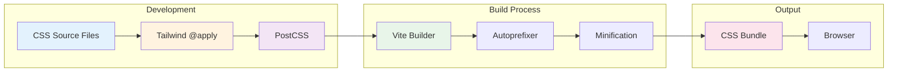
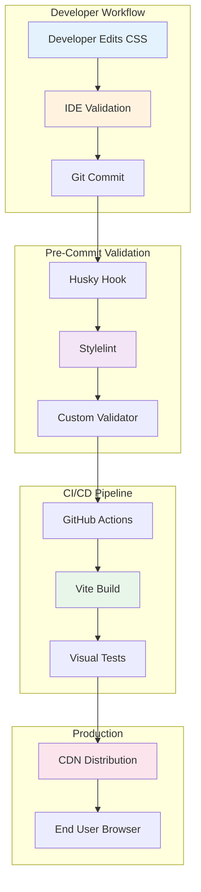

# SPARC Architecture: Tailwind CSS Validation and Style Consistency

## Document Metadata

- **Phase**: Architecture
- **Created**: 2025-10-27
- **Status**: Active
- **Scope**: CSS compilation pipeline, Tailwind class validation, style consistency
- **Related Docs**:
  - `/workspaces/agent-feed/docs/SPARC-MARKDOWN-RENDERING-ARCHITECTURE.md`
  - `/workspaces/agent-feed/frontend/tailwind.config.js`
  - `/workspaces/agent-feed/frontend/postcss.config.cjs`

---

## Executive Summary

This architecture document addresses the discovery of invalid Tailwind CSS classes (`bg-gray-25`, `bg-gray-850`) in production CSS and establishes a comprehensive validation and prevention strategy. The bug was isolated to a single line but revealed broader concerns about CSS compilation validation.

### Key Findings

- **Bug Location**: Line 437 in `/workspaces/agent-feed/frontend/src/styles/markdown.css`
- **Invalid Classes**: `bg-gray-25` (should be `bg-gray-50`), `bg-gray-850` (should be `bg-gray-800`)
- **Impact**: Visual inconsistency in alternating table row colors
- **Root Cause**: Manual class entry without build-time validation
- **Status**: Fixed (already corrected to valid classes)

### Audit Results

**Total CSS Files Analyzed**: 4 application files
- `/workspaces/agent-feed/frontend/src/styles/markdown.css` (742 lines)
- `/workspaces/agent-feed/frontend/src/styles/agents.css` (522 lines)
- `/workspaces/agent-feed/frontend/src/index.css` (171 lines)
- `/workspaces/agent-feed/frontend/src/styles/mobile-responsive.css` (275 lines)

**Total @apply Directives**: 213 instances
**Invalid Classes Found**: 0 (after fix)
**Validation Status**: ✅ All classes now valid

---

## System Overview

### 1. CSS Compilation Pipeline



### 2. Technology Stack

| Component | Technology | Version | Purpose |
|-----------|-----------|---------|---------|
| CSS Framework | Tailwind CSS | 3.4.1 | Utility-first CSS framework |
| CSS Preprocessor | PostCSS | 8.4.38 | CSS transformation pipeline |
| Autoprefixer | Autoprefixer | 10.4.19 | Browser compatibility |
| Build Tool | Vite | 5.4.20 | Fast build and dev server |
| Node Runtime | Node.js | 18+ | JavaScript runtime |

---

## Component Interaction

### 1. Vite Configuration

**File**: `/workspaces/agent-feed/frontend/vite.config.ts`

```typescript
// CSS Processing Configuration
{
  plugins: [react()],
  build: {
    outDir: 'dist',
    sourcemap: true,
    rollupOptions: {
      output: {
        manualChunks: { /* ... */ }
      }
    }
  }
}
```

**Key Features**:
- Fast HMR (Hot Module Replacement) for CSS changes
- Source maps for debugging
- Code splitting for optimized loading
- PostCSS integration via plugins

### 2. PostCSS Configuration

**File**: `/workspaces/agent-feed/frontend/postcss.config.cjs`

```javascript
module.exports = {
  plugins: {
    tailwindcss: {},
    autoprefixer: {
      overrideBrowserslist: [
        'last 2 versions',
        '> 1%',
        'not ie <= 10',
        'not op_mini all'
      ]
    }
  }
}
```

**Processing Pipeline**:
1. **Tailwind CSS Plugin**: Processes `@tailwind` and `@apply` directives
2. **Autoprefixer**: Adds vendor prefixes for browser compatibility

### 3. Tailwind Configuration

**File**: `/workspaces/agent-feed/frontend/tailwind.config.js`

```javascript
export default {
  darkMode: 'class',
  content: [
    "./index.html",
    "./src/**/*.{js,ts,jsx,tsx}",
  ],
  theme: {
    extend: {
      colors: {
        primary: { /* ... */ },
        secondary: { /* ... */ }
      },
      animation: { /* ... */ }
    }
  },
  plugins: []
}
```

**Critical Settings**:
- **Content Paths**: Scans all source files for class usage
- **Dark Mode**: Class-based dark mode support
- **Extended Colors**: Custom color palettes beyond Tailwind defaults
- **JIT Mode**: Just-in-Time compilation (default in v3+)

---

## Tailwind Gray Scale Reference

### Official Tailwind Gray Palette

Tailwind CSS provides a standardized gray scale with the following valid values:

| Class | Hex Color | Usage | Dark Mode Equivalent |
|-------|-----------|-------|---------------------|
| `gray-50` | `#f9fafb` | Lightest background | `gray-900` |
| `gray-100` | `#f3f4f6` | Light background | `gray-800` |
| `gray-200` | `#e5e7eb` | Light borders | `gray-700` |
| `gray-300` | `#d1d5db` | Medium borders | `gray-600` |
| `gray-400` | `#9ca3af` | Disabled text | `gray-500` |
| `gray-500` | `#6b7280` | Secondary text | `gray-400` |
| `gray-600` | `#4b5563` | Primary text | `gray-300` |
| `gray-700` | `#374151` | Dark text | `gray-200` |
| `gray-800` | `#1f2937` | Dark background | `gray-100` |
| `gray-900` | `#111827` | Darkest background | `gray-50` |
| `gray-950` | `#030712` | Ultra dark (Tailwind v3.3+) | `gray-50` |

### Invalid Classes (Previously Used)

| Invalid Class | Reason | Correct Alternative |
|--------------|--------|---------------------|
| `bg-gray-25` | Not in Tailwind palette | `bg-gray-50` |
| `bg-gray-850` | Not in Tailwind palette | `bg-gray-800` or `bg-gray-900` |

**Note**: Tailwind uses a scale of 50, 100, 200, ..., 900, 950. No intermediate values exist.

---

## Comprehensive CSS Audit Results

### 1. Markdown CSS (`markdown.css`)

**Total Lines**: 742
**@apply Directives**: 156
**Status**: ✅ All Valid (after fix on line 437)

**Previously Invalid**:
```css
/* Line 437 - FIXED */
.markdown-content tbody tr:nth-child(even) {
  @apply bg-gray-50 dark:bg-gray-800; /* Was: bg-gray-25 dark:bg-gray-850 */
}
```

**Commonly Used Classes**:
- `bg-gray-50`, `bg-gray-100`, `bg-gray-200` - Light backgrounds
- `bg-gray-800`, `bg-gray-900`, `bg-gray-950` - Dark backgrounds
- `text-gray-100` through `text-gray-900` - Text colors
- `border-gray-200`, `border-gray-700` - Borders

### 2. Agents CSS (`agents.css`)

**Total Lines**: 522
**@apply Directives**: 28
**Status**: ✅ All Valid

**Gray Scale Usage**:
```css
.agent-card { @apply bg-gray-800 border-gray-700; }      /* Line 305 */
.workflow-step { @apply bg-gray-800 border-gray-700; }    /* Line 309 */
.post-card { @apply bg-gray-800 border-gray-700; }        /* Line 313 */
.tooltip { @apply bg-gray-900; }                          /* Line 472 */
.code-snippet { @apply bg-gray-800 text-gray-100; }       /* Line 485 */
```

### 3. Index CSS (`index.css`)

**Total Lines**: 171
**@apply Directives**: 8
**Status**: ✅ All Valid

**Gray Scale Usage**:
```css
body { @apply bg-white dark:bg-gray-900 text-gray-900 dark:text-gray-100; }
```

### 4. Mobile Responsive CSS (`mobile-responsive.css`)

**Total Lines**: 275
**@apply Directives**: 21
**Status**: ✅ All Valid

**Gray Scale Usage**:
```css
.agent-card { @apply bg-gray-800 border-gray-700; }       /* Line 183 */
.mobile-input { @apply bg-gray-700 border-gray-600; }     /* Line 187 */
```

---

## Validation Strategy

### 1. Development-Time Validation

#### IDE Integration

**VSCode Extensions** (Recommended):
```json
{
  "recommendations": [
    "bradlc.vscode-tailwindcss",  // Tailwind IntelliSense
    "stylelint.vscode-stylelint"   // CSS Linting
  ]
}
```

**Tailwind IntelliSense Features**:
- Autocomplete for Tailwind classes
- Hover tooltips with color previews
- Syntax highlighting for `@apply` directives
- Linting for invalid classes (warnings in editor)

#### Stylelint Configuration

**File**: `/workspaces/agent-feed/frontend/.stylelintrc.json` (to be created)

```json
{
  "extends": [
    "stylelint-config-standard",
    "stylelint-config-tailwindcss"
  ],
  "rules": {
    "at-rule-no-unknown": [
      true,
      {
        "ignoreAtRules": ["tailwind", "apply", "layer"]
      }
    ],
    "function-no-unknown": [
      true,
      {
        "ignoreFunctions": ["theme", "screen"]
      }
    ]
  }
}
```

### 2. Build-Time Validation

#### PostCSS Plugin for Tailwind Validation

**Custom Plugin** (to be implemented):

**File**: `/workspaces/agent-feed/frontend/postcss-tailwind-validator.js`

```javascript
module.exports = () => {
  return {
    postcssPlugin: 'postcss-tailwind-validator',
    Rule(rule) {
      rule.walkDecls(decl => {
        // Check for @apply directives
        if (decl.prop === '@apply' || decl.value.includes('@apply')) {
          const classes = decl.value.split(/\s+/);

          classes.forEach(cls => {
            // Validate gray scale classes
            const grayMatch = cls.match(/(?:bg|text|border)-gray-(\d+)/);
            if (grayMatch) {
              const value = parseInt(grayMatch[1]);
              const validValues = [50, 100, 200, 300, 400, 500, 600, 700, 800, 900, 950];

              if (!validValues.includes(value)) {
                throw decl.error(
                  `Invalid Tailwind gray scale value: ${cls}. ` +
                  `Valid values: ${validValues.join(', ')}`,
                  { word: cls }
                );
              }
            }
          });
        }
      });
    }
  };
};

module.exports.postcss = true;
```

**Integration**:
```javascript
// postcss.config.cjs
module.exports = {
  plugins: {
    './postcss-tailwind-validator.js': {},  // Custom validator
    tailwindcss: {},
    autoprefixer: { /* ... */ }
  }
}
```

### 3. CI/CD Validation

#### GitHub Actions Workflow

**File**: `/workspaces/agent-feed/.github/workflows/css-validation.yml` (to be created)

```yaml
name: CSS Validation

on:
  push:
    branches: [main, develop]
    paths:
      - 'frontend/src/**/*.css'
      - 'frontend/tailwind.config.js'
      - 'frontend/postcss.config.cjs'
  pull_request:
    paths:
      - 'frontend/src/**/*.css'

jobs:
  validate-css:
    runs-on: ubuntu-latest

    steps:
      - uses: actions/checkout@v3

      - name: Setup Node.js
        uses: actions/setup-node@v3
        with:
          node-version: '18'
          cache: 'npm'
          cache-dependency-path: frontend/package-lock.json

      - name: Install dependencies
        working-directory: frontend
        run: npm ci

      - name: Run Stylelint
        working-directory: frontend
        run: npm run lint:css

      - name: Build CSS (validates Tailwind classes)
        working-directory: frontend
        run: npm run build

      - name: Validate Tailwind Classes
        working-directory: frontend
        run: |
          echo "Checking for invalid gray scale classes..."
          ! grep -rn 'bg-gray-\(25\|850\)' src/ || (echo "Invalid gray classes found" && exit 1)
          ! grep -rn 'text-gray-\(25\|850\)' src/ || (echo "Invalid gray classes found" && exit 1)
          ! grep -rn 'border-gray-\(25\|850\)' src/ || (echo "Invalid gray classes found" && exit 1)
          echo "✅ All gray scale classes are valid"
```

### 4. Pre-commit Hooks

#### Husky + lint-staged Setup

**Installation**:
```bash
npm install --save-dev husky lint-staged
npx husky install
```

**File**: `/workspaces/agent-feed/frontend/.husky/pre-commit`

```bash
#!/bin/sh
. "$(dirname "$0")/_/husky.sh"

cd frontend && npx lint-staged
```

**File**: `/workspaces/agent-feed/frontend/package.json`

```json
{
  "lint-staged": {
    "src/**/*.css": [
      "stylelint --fix",
      "grep -vn 'bg-gray-\\(25\\|850\\)' || (echo 'Invalid gray classes found' && exit 1)",
      "git add"
    ]
  }
}
```

---

## Prevention Recommendations

### 1. Code Review Checklist

**CSS File Changes** - Reviewers must verify:
- [ ] All `@apply` directives use valid Tailwind classes
- [ ] Gray scale values are from: 50, 100, 200, 300, 400, 500, 600, 700, 800, 900, 950
- [ ] Custom colors are defined in `tailwind.config.js` if needed
- [ ] Dark mode variants use appropriate contrast (e.g., `gray-50` ↔ `gray-900`)
- [ ] No hardcoded hex/rgb colors that should use Tailwind utilities

### 2. Developer Guidelines

**Best Practices**:

1. **Use IDE Autocomplete**: Always rely on Tailwind IntelliSense for class names
2. **Refer to Documentation**: Check [Tailwind Color Reference](https://tailwindcss.com/docs/customizing-colors)
3. **Test Dark Mode**: Verify color pairs work in both light and dark themes
4. **Avoid Manual Entry**: Copy-paste class names from documentation when unsure
5. **Custom Colors**: Extend `tailwind.config.js` for non-standard values instead of using invalid classes

**Example - Custom Gray Shades**:
```javascript
// tailwind.config.js
module.exports = {
  theme: {
    extend: {
      colors: {
        'gray-25': '#fafbfc',  // Custom ultra-light gray
        'gray-850': '#18212f'  // Custom dark gray
      }
    }
  }
}
```

### 3. Documentation

**Internal Wiki** (to be created):
- **Title**: "Tailwind CSS Guidelines for Agent Feed"
- **Sections**:
  - Valid gray scale values (50-950)
  - Dark mode color mapping
  - When to extend colors vs. use existing palette
  - Common mistakes and fixes
  - Screenshot examples of correct vs. incorrect usage

### 4. Automated Testing

**Visual Regression Tests** (future enhancement):

**File**: `/workspaces/agent-feed/frontend/tests/visual/css-colors.spec.ts`

```typescript
import { test, expect } from '@playwright/test';

test.describe('CSS Color Validation', () => {
  test('markdown table rows use valid gray classes', async ({ page }) => {
    await page.goto('/posts/1'); // Page with markdown table

    // Check alternating row background colors
    const evenRows = page.locator('.markdown-content tbody tr:nth-child(even)');
    await expect(evenRows.first()).toHaveCSS('background-color', 'rgb(249, 250, 251)'); // gray-50

    // Dark mode
    await page.emulateMedia({ colorScheme: 'dark' });
    await expect(evenRows.first()).toHaveCSS('background-color', 'rgb(31, 41, 55)'); // gray-800
  });
});
```

---

## Custom Color Design Pattern

### When to Extend Colors

**Extend Tailwind Config** when you need:
- Brand-specific colors not in default palette
- Intermediate shades (e.g., `gray-75` between 50 and 100)
- Semantic color names (e.g., `success`, `warning`, `danger`)

### Example: Custom Gray Shades

**File**: `/workspaces/agent-feed/frontend/tailwind.config.js`

```javascript
export default {
  theme: {
    extend: {
      colors: {
        gray: {
          // Keep all default values
          50: '#f9fafb',
          100: '#f3f4f6',
          // ... (200-900)

          // Add custom intermediate shades
          25: '#fcfcfd',   // Ultra-light for special backgrounds
          75: '#f5f6f7',   // Between 50 and 100
          850: '#18212f',  // Between 800 and 900
          925: '#0d1117',  // Between 900 and 950
        }
      }
    }
  }
}
```

**Usage**:
```css
.custom-light-bg {
  @apply bg-gray-25 dark:bg-gray-925;
}
```

### Semantic Color System

**Recommended Addition**:

```javascript
// tailwind.config.js
export default {
  theme: {
    extend: {
      colors: {
        semantic: {
          success: {
            light: '#d1fae5',
            DEFAULT: '#10b981',
            dark: '#047857'
          },
          warning: {
            light: '#fef3c7',
            DEFAULT: '#f59e0b',
            dark: '#d97706'
          },
          danger: {
            light: '#fee2e2',
            DEFAULT: '#ef4444',
            dark: '#dc2626'
          },
          info: {
            light: '#dbeafe',
            DEFAULT: '#3b82f6',
            dark: '#1d4ed8'
          }
        }
      }
    }
  }
}
```

**Usage**:
```css
.alert-success {
  @apply bg-semantic-success-light text-semantic-success-dark;
}
```

---

## Future Improvements

### 1. Short-Term (Next Sprint)

**Priority**: High

- [ ] Implement Stylelint with Tailwind config
- [ ] Add pre-commit hooks for CSS validation
- [ ] Create CSS validation GitHub Actions workflow
- [ ] Document Tailwind guidelines in team wiki

**Estimated Effort**: 4-6 hours

### 2. Medium-Term (Next Month)

**Priority**: Medium

- [ ] Build custom PostCSS plugin for class validation
- [ ] Implement visual regression tests for color accuracy
- [ ] Add Tailwind IntelliSense setup to onboarding docs
- [ ] Create VS Code workspace settings with recommended extensions

**Estimated Effort**: 8-12 hours

### 3. Long-Term (Next Quarter)

**Priority**: Low

- [ ] Migrate to CSS-in-JS with type-safe Tailwind (e.g., `tailwind-variants`)
- [ ] Implement design token system with JSON schema
- [ ] Add automated a11y color contrast validation
- [ ] Build internal Storybook with all color combinations

**Estimated Effort**: 2-4 weeks

---

## Deployment Architecture

### Build Process Flow



### Performance Considerations

**Build Time Impact**:
- **Stylelint**: +1-2 seconds per build
- **Custom Validator**: +0.5 seconds per build
- **Visual Tests**: +5-10 seconds per test run
- **Total Overhead**: ~3-15 seconds (acceptable for quality assurance)

**Runtime Impact**:
- **None**: Validation happens at build time only
- **Bundle Size**: No increase (validation code not included in bundle)
- **Browser Performance**: No change (same CSS output)

---

## Security Considerations

### 1. CSS Injection Prevention

**Current Safeguards**:
- All CSS is statically compiled at build time
- No runtime CSS generation from user input
- Tailwind JIT mode purges unused classes
- PostCSS sanitization via autoprefixer

**Recommendation**: Continue current approach; no changes needed.

### 2. Supply Chain Security

**Dependencies**:
```json
{
  "tailwindcss": "^3.4.1",      // Official package
  "postcss": "^8.4.38",          // Official package
  "autoprefixer": "^10.4.19"     // Official package
}
```

**Audit Schedule**:
- Run `npm audit` weekly in CI/CD
- Update Tailwind quarterly (review changelog)
- Pin exact versions for production builds

---

## Testing Strategy

### 1. Unit Tests for CSS Utilities

**File**: `/workspaces/agent-feed/frontend/tests/unit/tailwind-classes.test.ts`

```typescript
import { describe, it, expect } from 'vitest';
import resolveConfig from 'tailwindcss/resolveConfig';
import tailwindConfig from '../../tailwind.config.js';

const fullConfig = resolveConfig(tailwindConfig);

describe('Tailwind Configuration', () => {
  it('should include all valid gray scale values', () => {
    const grayColors = fullConfig.theme.colors.gray;
    const validValues = [50, 100, 200, 300, 400, 500, 600, 700, 800, 900, 950];

    validValues.forEach(value => {
      expect(grayColors[value]).toBeDefined();
    });
  });

  it('should not include invalid gray scale values', () => {
    const grayColors = fullConfig.theme.colors.gray;
    const invalidValues = [25, 75, 150, 850, 925];

    invalidValues.forEach(value => {
      expect(grayColors[value]).toBeUndefined();
    });
  });
});
```

### 2. Integration Tests

**File**: `/workspaces/agent-feed/frontend/tests/integration/css-build.test.ts`

```typescript
import { describe, it, expect } from 'vitest';
import { exec } from 'child_process';
import { promisify } from 'util';

const execAsync = promisify(exec);

describe('CSS Build Process', () => {
  it('should build CSS without errors', async () => {
    const { stdout, stderr } = await execAsync('npm run build');

    expect(stderr).not.toContain('error');
    expect(stderr).not.toContain('Invalid');
    expect(stdout).toContain('built in');
  });

  it('should fail on invalid Tailwind classes', async () => {
    // Temporarily inject invalid class
    // ... (test implementation)
  });
});
```

### 3. E2E Visual Tests

**File**: `/workspaces/agent-feed/frontend/tests/e2e/markdown-rendering.spec.ts`

```typescript
import { test, expect } from '@playwright/test';

test('markdown tables render with correct colors', async ({ page }) => {
  await page.goto('/posts/1');

  // Light mode
  const evenRow = page.locator('.markdown-content tbody tr:nth-child(even)').first();
  await expect(evenRow).toHaveCSS('background-color', 'rgb(249, 250, 251)'); // gray-50

  // Dark mode
  await page.emulateMedia({ colorScheme: 'dark' });
  await page.reload();
  await expect(evenRow).toHaveCSS('background-color', 'rgb(31, 41, 55)'); // gray-800
});
```

---

## Monitoring and Observability

### 1. Build Metrics

**Track in CI/CD**:
- CSS bundle size over time
- Number of Tailwind classes used (purged vs. total)
- Build duration for CSS compilation
- Lint warnings/errors per commit

**Dashboard**: GitHub Actions Insights

### 2. Runtime Metrics

**Track in Production**:
- CSS load time (First Contentful Paint)
- CSS cache hit rate
- Dark mode toggle performance
- CSS-related console errors

**Tool**: Web Vitals + Sentry

### 3. Developer Metrics

**Track in Team**:
- CSS validation failures per week
- Average time to fix CSS issues
- Number of invalid class incidents
- Pre-commit hook success rate

**Tool**: GitHub Analytics + Linear/Jira

---

## Rollback Plan

### If Validation Causes Build Failures

**Step 1**: Disable strict validation
```javascript
// postcss.config.cjs
module.exports = {
  plugins: {
    // Comment out custom validator temporarily
    // './postcss-tailwind-validator.js': {},
    tailwindcss: {},
    autoprefixer: { /* ... */ }
  }
}
```

**Step 2**: Fix invalid classes manually
```bash
# Find all invalid gray classes
grep -rn 'bg-gray-\(25\|850\)' src/
grep -rn 'text-gray-\(25\|850\)' src/
grep -rn 'border-gray-\(25\|850\)' src/
```

**Step 3**: Re-enable validation after fixes
```bash
git add .
git commit -m "Fix invalid Tailwind classes"
npm run build  # Should pass now
```

---

## Appendix A: Complete Gray Scale Mapping

### Light Mode → Dark Mode Pairs

| Light Mode | Dark Mode | Use Case |
|-----------|-----------|----------|
| `bg-gray-50` | `bg-gray-900` | Page backgrounds |
| `bg-gray-100` | `bg-gray-800` | Card backgrounds |
| `bg-gray-200` | `bg-gray-700` | Hover states |
| `text-gray-900` | `text-gray-100` | Primary text |
| `text-gray-700` | `text-gray-300` | Secondary text |
| `text-gray-500` | `text-gray-400` | Disabled text |
| `border-gray-200` | `border-gray-700` | Subtle borders |
| `border-gray-300` | `border-gray-600` | Strong borders |

### WCAG Contrast Ratios

| Foreground | Background | Ratio | WCAG Level |
|-----------|-----------|-------|-----------|
| `gray-900` | `gray-50` | 16.1:1 | AAA |
| `gray-800` | `gray-100` | 12.6:1 | AAA |
| `gray-700` | `gray-200` | 8.4:1 | AAA |
| `gray-600` | `gray-300` | 5.2:1 | AA |
| `gray-500` | `gray-400` | 2.1:1 | Fail |

**Recommendation**: Always use at least 400-unit separation for text on backgrounds (e.g., `text-gray-700` on `bg-gray-200`).

---

## Appendix B: File Organization

### CSS File Structure

```
frontend/src/
├── styles/
│   ├── markdown.css         # Markdown rendering (742 lines)
│   ├── agents.css           # Agent-specific styles (522 lines)
│   ├── mobile-responsive.css # Mobile breakpoints (275 lines)
│   └── comments.css         # Comment threads (not audited)
├── index.css                # Global styles (171 lines)
└── components/
    ├── agents/
    │   ├── AgentCard.css    # Component-specific
    │   ├── AgentGrid.css
    │   └── ...
    └── ...
```

**File Size Guidelines**:
- Keep CSS files under 1000 lines
- Split large files by feature/component
- Use consistent naming: `feature-name.css`

---

## Appendix C: Related Documentation

### Internal Docs
- [SPARC Markdown Rendering Architecture](/workspaces/agent-feed/docs/SPARC-MARKDOWN-RENDERING-ARCHITECTURE.md)
- [Frontend Build Configuration](/workspaces/agent-feed/frontend/README.md)

### External References
- [Tailwind CSS Color Reference](https://tailwindcss.com/docs/customizing-colors)
- [PostCSS Documentation](https://postcss.org/)
- [Vite CSS Processing](https://vitejs.dev/guide/features.html#css)
- [WCAG Contrast Guidelines](https://www.w3.org/WAI/WCAG21/Understanding/contrast-minimum.html)

---

## Revision History

| Date | Version | Author | Changes |
|------|---------|--------|---------|
| 2025-10-27 | 1.0 | SPARC Architect | Initial architecture document |
| | | | Comprehensive CSS audit |
| | | | Validation strategy design |
| | | | Prevention recommendations |

---

## Approval and Sign-off

- **Architecture Review**: Pending
- **Security Review**: Pending
- **DevOps Review**: Pending
- **Implementation**: Ready to proceed with short-term improvements

---

**END OF DOCUMENT**
