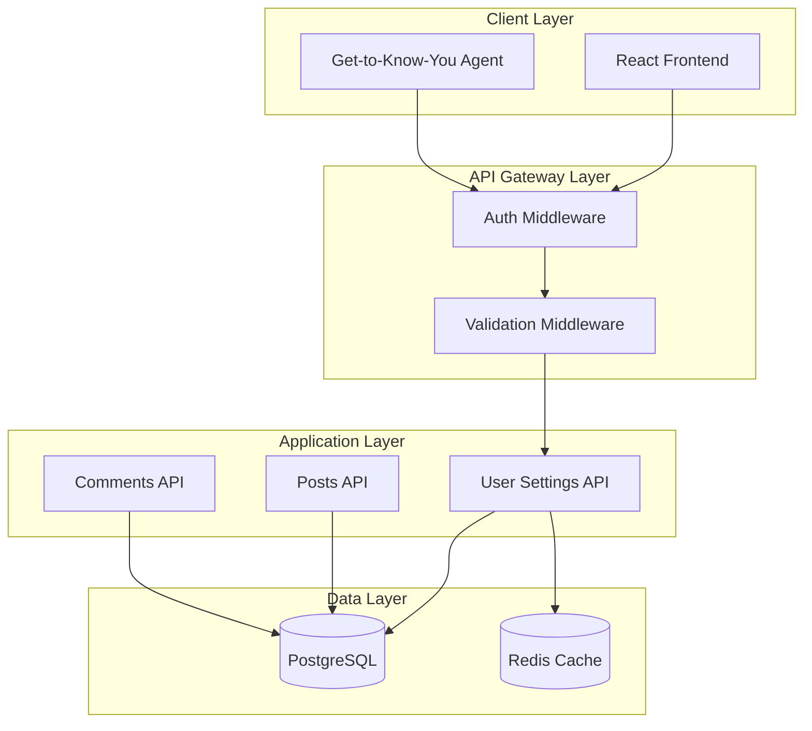
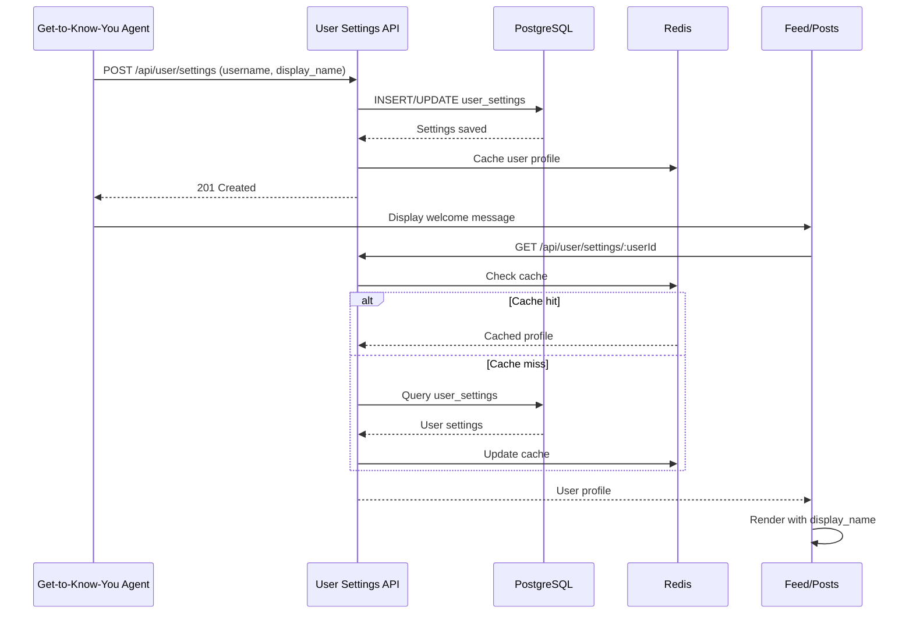
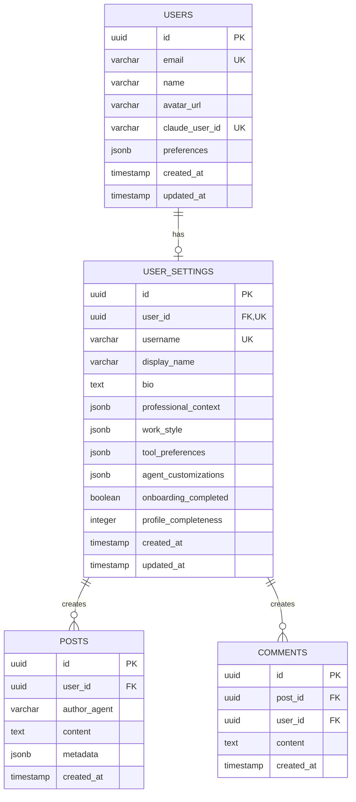
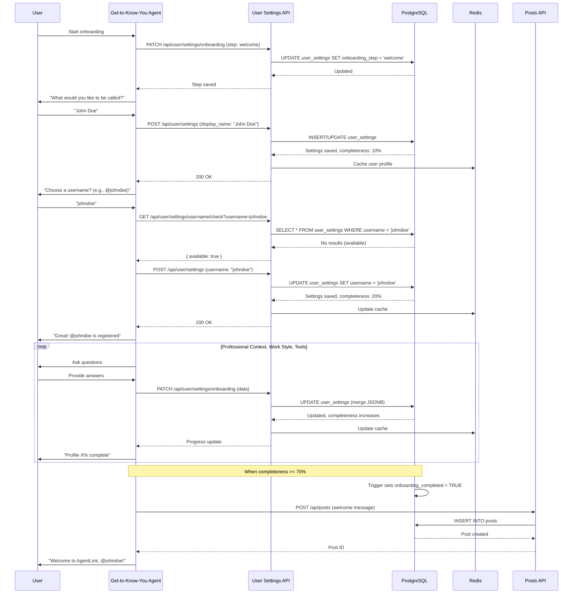
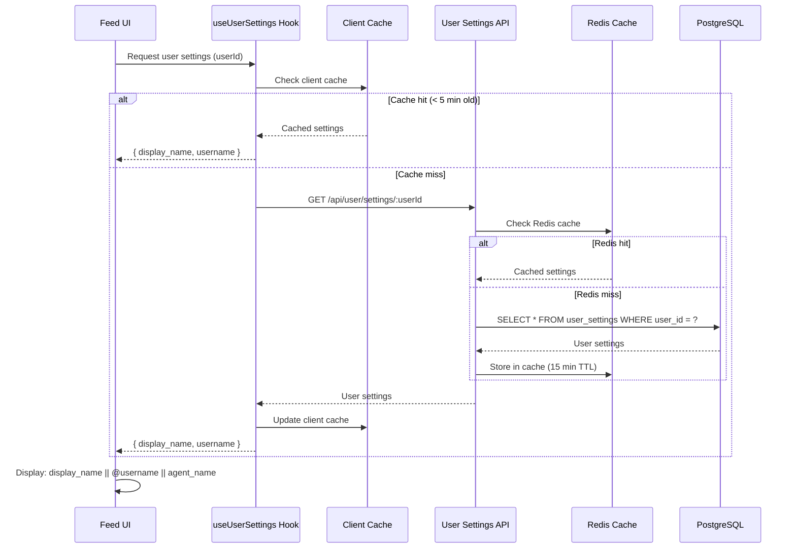
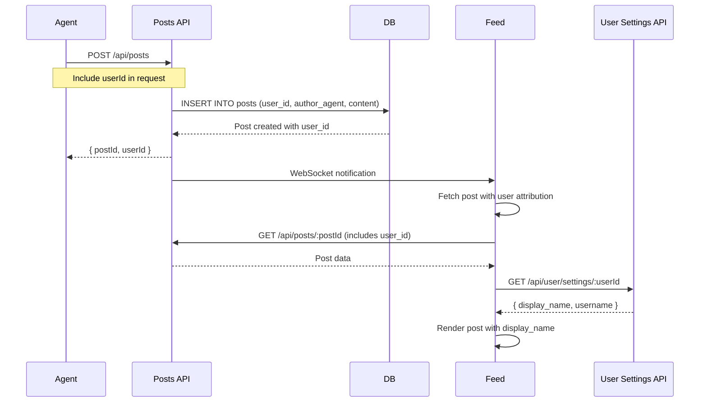

# SPARC Architecture: Username Collection System

## Document Information
- **Phase**: Architecture
- **Feature**: Username Collection for User Personalization
- **Date**: 2025-10-26
- **Status**: Design Complete
- **Dependencies**: SPARC-USERNAME-SPEC.md, SPARC-USERNAME-PSEUDOCODE.md

---

## Table of Contents
1. [System Overview](#system-overview)
2. [Database Architecture](#database-architecture)
3. [API Architecture](#api-architecture)
4. [Frontend Component Architecture](#frontend-component-architecture)
5. [Agent Integration Architecture](#agent-integration-architecture)
6. [Data Flow Architecture](#data-flow-architecture)
7. [Security Architecture](#security-architecture)
8. [Migration Strategy](#migration-strategy)
9. [Deployment Architecture](#deployment-architecture)

---

## 1. System Overview

### 1.1 High-Level Architecture



### 1.2 Component Interaction



---

## 2. Database Architecture

### 2.1 Schema Design

#### 2.1.1 New Table: user_settings

```sql
-- ==============================================================================
-- Migration 011: User Settings and Profile Management
-- ==============================================================================
-- Description: Creates user_settings table for username collection and profile data
-- Author: SPARC Architecture Agent
-- Date: 2025-10-26
-- Dependencies: Migration 010 (AVI 3-tier tables)
-- ==============================================================================

BEGIN;

-- User settings table for profile and personalization data
CREATE TABLE IF NOT EXISTS user_settings (
    -- Primary key
    id UUID PRIMARY KEY DEFAULT uuid_generate_v4(),

    -- Foreign key to users table
    user_id UUID NOT NULL UNIQUE REFERENCES users(id) ON DELETE CASCADE,

    -- Username and display settings
    username VARCHAR(50),
    display_name VARCHAR(100),
    bio TEXT,

    -- Profile preferences
    preferred_pronouns VARCHAR(50),
    timezone VARCHAR(100) DEFAULT 'UTC',
    language VARCHAR(10) DEFAULT 'en',

    -- Agent personalization data
    onboarding_completed BOOLEAN DEFAULT FALSE,
    onboarding_step VARCHAR(50),
    profile_completeness INTEGER DEFAULT 0 CHECK (profile_completeness >= 0 AND profile_completeness <= 100),

    -- Professional context (from get-to-know-you agent)
    professional_context JSONB DEFAULT '{
        "role": null,
        "industry": null,
        "experience_years": null,
        "team_size": null,
        "key_responsibilities": [],
        "current_goals": []
    }'::jsonb,

    -- Work style preferences (from get-to-know-you agent)
    work_style JSONB DEFAULT '{
        "communication_preference": null,
        "decision_making": null,
        "detail_level": null,
        "task_organization": null,
        "collaboration_style": null,
        "peak_hours": null
    }'::jsonb,

    -- Tool preferences (from get-to-know-you agent)
    tool_preferences JSONB DEFAULT '{
        "primary_systems": [],
        "notification_channels": {},
        "integration_priorities": []
    }'::jsonb,

    -- Agent customizations (from get-to-know-you agent)
    agent_customizations JSONB DEFAULT '{}'::jsonb,

    -- Privacy settings
    profile_visibility VARCHAR(20) DEFAULT 'public' CHECK (profile_visibility IN ('public', 'private', 'connections')),
    show_online_status BOOLEAN DEFAULT TRUE,

    -- Timestamps
    created_at TIMESTAMP WITH TIME ZONE DEFAULT NOW(),
    updated_at TIMESTAMP WITH TIME ZONE DEFAULT NOW(),
    onboarding_completed_at TIMESTAMP WITH TIME ZONE,

    -- Constraints
    CONSTRAINT username_length CHECK (username IS NULL OR (LENGTH(username) >= 3 AND LENGTH(username) <= 50)),
    CONSTRAINT username_format CHECK (username IS NULL OR username ~ '^[a-zA-Z0-9_-]+$'),
    CONSTRAINT display_name_length CHECK (display_name IS NULL OR (LENGTH(display_name) >= 1 AND LENGTH(display_name) <= 100)),
    CONSTRAINT bio_length CHECK (bio IS NULL OR LENGTH(bio) <= 500)
);

-- Indexes for performance
CREATE INDEX idx_user_settings_user_id ON user_settings(user_id);
CREATE INDEX idx_user_settings_username ON user_settings(username) WHERE username IS NOT NULL;
CREATE UNIQUE INDEX idx_user_settings_username_unique ON user_settings(username) WHERE username IS NOT NULL;
CREATE INDEX idx_user_settings_onboarding ON user_settings(user_id, onboarding_completed, onboarding_step);
CREATE INDEX idx_user_settings_completeness ON user_settings(profile_completeness DESC);

-- GIN indexes for JSONB columns
CREATE INDEX idx_user_settings_professional_gin ON user_settings USING GIN (professional_context);
CREATE INDEX idx_user_settings_work_style_gin ON user_settings USING GIN (work_style);
CREATE INDEX idx_user_settings_tool_prefs_gin ON user_settings USING GIN (tool_preferences);
CREATE INDEX idx_user_settings_agent_custom_gin ON user_settings USING GIN (agent_customizations);

-- Trigger for updated_at
CREATE TRIGGER update_user_settings_updated_at
    BEFORE UPDATE ON user_settings
    FOR EACH ROW
    EXECUTE FUNCTION update_updated_at_column();

-- Function to calculate profile completeness
CREATE OR REPLACE FUNCTION calculate_profile_completeness(settings_row user_settings)
RETURNS INTEGER AS $$
DECLARE
    score INTEGER := 0;
BEGIN
    -- Basic fields (10 points each)
    IF settings_row.username IS NOT NULL THEN score := score + 10; END IF;
    IF settings_row.display_name IS NOT NULL THEN score := score + 10; END IF;
    IF settings_row.bio IS NOT NULL THEN score := score + 10; END IF;
    IF settings_row.preferred_pronouns IS NOT NULL THEN score := score + 10; END IF;

    -- Professional context (30 points if populated)
    IF settings_row.professional_context->>'role' IS NOT NULL THEN score := score + 10; END IF;
    IF settings_row.professional_context->>'industry' IS NOT NULL THEN score := score + 10; END IF;
    IF jsonb_array_length(settings_row.professional_context->'current_goals') > 0 THEN score := score + 10; END IF;

    -- Work style (20 points if populated)
    IF settings_row.work_style->>'communication_preference' IS NOT NULL THEN score := score + 10; END IF;
    IF settings_row.work_style->>'decision_making' IS NOT NULL THEN score := score + 10; END IF;

    -- Tool preferences (10 points if populated)
    IF jsonb_array_length(settings_row.tool_preferences->'primary_systems') > 0 THEN score := score + 10; END IF;

    RETURN LEAST(score, 100);
END;
$$ LANGUAGE plpgsql IMMUTABLE;

-- Trigger to auto-calculate profile completeness on insert/update
CREATE OR REPLACE FUNCTION trigger_calculate_profile_completeness()
RETURNS TRIGGER AS $$
BEGIN
    NEW.profile_completeness := calculate_profile_completeness(NEW);

    -- Mark onboarding as complete if profile is sufficiently complete
    IF NEW.profile_completeness >= 70 AND NEW.onboarding_completed = FALSE THEN
        NEW.onboarding_completed := TRUE;
        NEW.onboarding_completed_at := NOW();
    END IF;

    RETURN NEW;
END;
$$ LANGUAGE plpgsql;

CREATE TRIGGER update_profile_completeness
    BEFORE INSERT OR UPDATE ON user_settings
    FOR EACH ROW
    EXECUTE FUNCTION trigger_calculate_profile_completeness();

-- Comments for documentation
COMMENT ON TABLE user_settings IS 'User profile settings including username, display preferences, and agent personalization data';
COMMENT ON COLUMN user_settings.username IS 'Unique username for user identification (optional, 3-50 chars, alphanumeric with _ and -)';
COMMENT ON COLUMN user_settings.display_name IS 'Display name shown in posts and comments (1-100 chars)';
COMMENT ON COLUMN user_settings.professional_context IS 'Professional context data collected by get-to-know-you agent';
COMMENT ON COLUMN user_settings.work_style IS 'Work style preferences collected by get-to-know-you agent';
COMMENT ON COLUMN user_settings.tool_preferences IS 'Tool and integration preferences collected by get-to-know-you agent';
COMMENT ON COLUMN user_settings.agent_customizations IS 'Agent-specific customizations based on user profile';
COMMENT ON COLUMN user_settings.profile_completeness IS 'Auto-calculated profile completion percentage (0-100)';

COMMIT;

-- ==============================================================================
-- Validation and Verification
-- ==============================================================================

DO $$
BEGIN
    IF EXISTS (SELECT 1 FROM information_schema.tables WHERE table_name = 'user_settings') THEN
        RAISE NOTICE 'Migration 011 completed successfully - user_settings table created';
    ELSE
        RAISE EXCEPTION 'Migration 011 failed - user_settings table not created';
    END IF;
END $$;
```

### 2.2 Data Model Relationships



### 2.3 Indexing Strategy

**Primary Indexes:**
- `idx_user_settings_user_id`: Fast lookup by user_id
- `idx_user_settings_username_unique`: Enforce unique usernames and fast username lookup

**Secondary Indexes:**
- `idx_user_settings_onboarding`: Track onboarding progress
- `idx_user_settings_completeness`: Find incomplete profiles

**JSONB Indexes:**
- GIN indexes on all JSONB columns for efficient nested field queries
- Enable queries like: `WHERE professional_context->>'role' = 'Product Manager'`

---

## 3. API Architecture

### 3.1 API Endpoints Design

#### 3.1.1 Create/Update User Settings

```typescript
// POST /api/user/settings
// PUT /api/user/settings/:userId (admin only)

interface CreateUserSettingsRequest {
  username?: string;           // Optional, 3-50 chars, alphanumeric + _ -
  display_name?: string;       // Optional, 1-100 chars
  bio?: string;                // Optional, max 500 chars
  preferred_pronouns?: string; // Optional, max 50 chars
  timezone?: string;           // Optional, defaults to UTC
  language?: string;           // Optional, defaults to en
  professional_context?: {
    role?: string;
    industry?: string;
    experience_years?: number;
    team_size?: number;
    key_responsibilities?: string[];
    current_goals?: string[];
  };
  work_style?: {
    communication_preference?: string;
    decision_making?: string;
    detail_level?: string;
    task_organization?: string;
    collaboration_style?: string;
    peak_hours?: string;
  };
  tool_preferences?: {
    primary_systems?: string[];
    notification_channels?: Record<string, string>;
    integration_priorities?: string[];
  };
  agent_customizations?: Record<string, any>;
  profile_visibility?: 'public' | 'private' | 'connections';
  show_online_status?: boolean;
}

interface UserSettingsResponse {
  success: boolean;
  data: {
    id: string;
    user_id: string;
    username: string | null;
    display_name: string | null;
    bio: string | null;
    preferred_pronouns: string | null;
    timezone: string;
    language: string;
    professional_context: object;
    work_style: object;
    tool_preferences: object;
    agent_customizations: object;
    onboarding_completed: boolean;
    onboarding_step: string | null;
    profile_completeness: number;
    profile_visibility: string;
    show_online_status: boolean;
    created_at: string;
    updated_at: string;
  };
}

interface ErrorResponse {
  success: false;
  error: {
    code: string;
    message: string;
    details?: any;
  };
}
```

#### 3.1.2 Get User Settings

```typescript
// GET /api/user/settings/:userId
// GET /api/user/settings/me (authenticated user)

interface GetUserSettingsResponse {
  success: boolean;
  data: {
    id: string;
    user_id: string;
    username: string | null;
    display_name: string | null;
    bio: string | null;
    // Privacy-filtered fields based on profile_visibility
    professional_context?: object;
    work_style?: object;
    profile_completeness: number;
    created_at: string;
    updated_at: string;
  };
}
```

#### 3.1.3 Check Username Availability

```typescript
// GET /api/user/settings/username/check?username=johndoe

interface UsernameCheckResponse {
  success: boolean;
  data: {
    username: string;
    available: boolean;
    suggestions?: string[]; // If not available
  };
}
```

#### 3.1.4 Update Onboarding Progress

```typescript
// PATCH /api/user/settings/onboarding

interface UpdateOnboardingRequest {
  onboarding_step: string;
  data?: Record<string, any>; // Step-specific data
}

interface UpdateOnboardingResponse {
  success: boolean;
  data: {
    onboarding_step: string;
    profile_completeness: number;
    next_step?: string;
  };
}
```

### 3.2 API Implementation Structure

```typescript
// src/api/routes/user-settings.ts

import { Router } from 'express';
import { body, param, query, validationResult } from 'express-validator';
import { authenticateToken } from '@/middleware/auth';
import { asyncHandler } from '@/middleware/error';
import { AppError } from '@/types';
import { pool } from '@/database/connection';
import { logger } from '@/utils/logger';

const router = Router();

// Validation rules
const usernameValidation = [
  body('username')
    .optional()
    .isLength({ min: 3, max: 50 })
    .withMessage('Username must be 3-50 characters')
    .matches(/^[a-zA-Z0-9_-]+$/)
    .withMessage('Username can only contain letters, numbers, underscores, and hyphens')
];

const displayNameValidation = [
  body('display_name')
    .optional()
    .isLength({ min: 1, max: 100 })
    .withMessage('Display name must be 1-100 characters')
];

const bioValidation = [
  body('bio')
    .optional()
    .isLength({ max: 500 })
    .withMessage('Bio must be 500 characters or less')
];

// POST /api/user/settings - Create or update user settings
router.post('/settings',
  authenticateToken,
  [
    ...usernameValidation,
    ...displayNameValidation,
    ...bioValidation,
    body('profile_visibility')
      .optional()
      .isIn(['public', 'private', 'connections'])
      .withMessage('Invalid profile visibility')
  ],
  asyncHandler(async (req, res) => {
    const errors = validationResult(req);
    if (!errors.isEmpty()) {
      throw new AppError('Validation failed', 400, errors.array());
    }

    const userId = req.user!.id;
    const {
      username,
      display_name,
      bio,
      preferred_pronouns,
      timezone,
      language,
      professional_context,
      work_style,
      tool_preferences,
      agent_customizations,
      profile_visibility,
      show_online_status
    } = req.body;

    // Check username availability if provided
    if (username) {
      const usernameCheck = await pool.query(
        'SELECT id FROM user_settings WHERE username = $1 AND user_id != $2',
        [username, userId]
      );

      if (usernameCheck.rows.length > 0) {
        throw new AppError('Username already taken', 409, {
          field: 'username',
          suggestions: await generateUsernameSuggestions(username)
        });
      }
    }

    // Upsert user settings
    const query = `
      INSERT INTO user_settings (
        user_id, username, display_name, bio, preferred_pronouns,
        timezone, language, professional_context, work_style,
        tool_preferences, agent_customizations, profile_visibility,
        show_online_status
      ) VALUES (
        $1, $2, $3, $4, $5, $6, $7, $8::jsonb, $9::jsonb, $10::jsonb, $11::jsonb, $12, $13
      )
      ON CONFLICT (user_id) DO UPDATE SET
        username = COALESCE(EXCLUDED.username, user_settings.username),
        display_name = COALESCE(EXCLUDED.display_name, user_settings.display_name),
        bio = COALESCE(EXCLUDED.bio, user_settings.bio),
        preferred_pronouns = COALESCE(EXCLUDED.preferred_pronouns, user_settings.preferred_pronouns),
        timezone = COALESCE(EXCLUDED.timezone, user_settings.timezone),
        language = COALESCE(EXCLUDED.language, user_settings.language),
        professional_context = COALESCE(EXCLUDED.professional_context, user_settings.professional_context),
        work_style = COALESCE(EXCLUDED.work_style, user_settings.work_style),
        tool_preferences = COALESCE(EXCLUDED.tool_preferences, user_settings.tool_preferences),
        agent_customizations = COALESCE(EXCLUDED.agent_customizations, user_settings.agent_customizations),
        profile_visibility = COALESCE(EXCLUDED.profile_visibility, user_settings.profile_visibility),
        show_online_status = COALESCE(EXCLUDED.show_online_status, user_settings.show_online_status),
        updated_at = NOW()
      RETURNING *
    `;

    const result = await pool.query(query, [
      userId,
      username || null,
      display_name || null,
      bio || null,
      preferred_pronouns || null,
      timezone || 'UTC',
      language || 'en',
      JSON.stringify(professional_context || {}),
      JSON.stringify(work_style || {}),
      JSON.stringify(tool_preferences || {}),
      JSON.stringify(agent_customizations || {}),
      profile_visibility || 'public',
      show_online_status !== undefined ? show_online_status : true
    ]);

    const settings = result.rows[0];

    // Invalidate cache
    await invalidateUserSettingsCache(userId);

    logger.info('User settings updated', { userId, username });

    res.status(200).json({
      success: true,
      data: settings
    });
  })
);

// GET /api/user/settings/me - Get current user settings
router.get('/settings/me',
  authenticateToken,
  asyncHandler(async (req, res) => {
    const userId = req.user!.id;

    const result = await pool.query(
      'SELECT * FROM user_settings WHERE user_id = $1',
      [userId]
    );

    if (result.rows.length === 0) {
      // Create default settings
      const createResult = await pool.query(
        `INSERT INTO user_settings (user_id) VALUES ($1) RETURNING *`,
        [userId]
      );

      return res.json({
        success: true,
        data: createResult.rows[0]
      });
    }

    res.json({
      success: true,
      data: result.rows[0]
    });
  })
);

// GET /api/user/settings/:userId - Get user settings by ID (privacy-filtered)
router.get('/settings/:userId',
  param('userId').isUUID().withMessage('Invalid user ID'),
  asyncHandler(async (req, res) => {
    const errors = validationResult(req);
    if (!errors.isEmpty()) {
      throw new AppError('Validation failed', 400, errors.array());
    }

    const { userId } = req.params;
    const requestingUserId = req.user?.id;

    const result = await pool.query(
      'SELECT * FROM user_settings WHERE user_id = $1',
      [userId]
    );

    if (result.rows.length === 0) {
      throw new AppError('User settings not found', 404);
    }

    const settings = result.rows[0];

    // Apply privacy filters
    const filteredSettings = filterSettingsByVisibility(
      settings,
      requestingUserId === userId
    );

    res.json({
      success: true,
      data: filteredSettings
    });
  })
);

// GET /api/user/settings/username/check - Check username availability
router.get('/settings/username/check',
  query('username')
    .isLength({ min: 3, max: 50 })
    .matches(/^[a-zA-Z0-9_-]+$/),
  asyncHandler(async (req, res) => {
    const errors = validationResult(req);
    if (!errors.isEmpty()) {
      throw new AppError('Invalid username format', 400, errors.array());
    }

    const { username } = req.query as { username: string };

    const result = await pool.query(
      'SELECT id FROM user_settings WHERE username = $1',
      [username]
    );

    const available = result.rows.length === 0;

    res.json({
      success: true,
      data: {
        username,
        available,
        suggestions: available ? [] : await generateUsernameSuggestions(username)
      }
    });
  })
);

// PATCH /api/user/settings/onboarding - Update onboarding progress
router.patch('/settings/onboarding',
  authenticateToken,
  body('onboarding_step').isString().notEmpty(),
  asyncHandler(async (req, res) => {
    const errors = validationResult(req);
    if (!errors.isEmpty()) {
      throw new AppError('Validation failed', 400, errors.array());
    }

    const userId = req.user!.id;
    const { onboarding_step, data } = req.body;

    // Update onboarding step and merge data
    const query = `
      UPDATE user_settings
      SET
        onboarding_step = $1,
        professional_context = CASE
          WHEN $2::jsonb IS NOT NULL THEN professional_context || $2::jsonb
          ELSE professional_context
        END,
        work_style = CASE
          WHEN $3::jsonb IS NOT NULL THEN work_style || $3::jsonb
          ELSE work_style
        END,
        tool_preferences = CASE
          WHEN $4::jsonb IS NOT NULL THEN tool_preferences || $4::jsonb
          ELSE tool_preferences
        END,
        updated_at = NOW()
      WHERE user_id = $5
      RETURNING onboarding_step, profile_completeness, onboarding_completed
    `;

    const result = await pool.query(query, [
      onboarding_step,
      data?.professional_context ? JSON.stringify(data.professional_context) : null,
      data?.work_style ? JSON.stringify(data.work_style) : null,
      data?.tool_preferences ? JSON.stringify(data.tool_preferences) : null,
      userId
    ]);

    const settings = result.rows[0];

    res.json({
      success: true,
      data: {
        onboarding_step: settings.onboarding_step,
        profile_completeness: settings.profile_completeness,
        onboarding_completed: settings.onboarding_completed,
        next_step: getNextOnboardingStep(onboarding_step)
      }
    });
  })
);

// Helper functions
async function generateUsernameSuggestions(username: string): Promise<string[]> {
  const suggestions: string[] = [];
  const baseUsername = username.replace(/[0-9]+$/, ''); // Remove trailing numbers

  for (let i = 1; i <= 5; i++) {
    const suggestion = `${baseUsername}${Math.floor(Math.random() * 1000)}`;
    const result = await pool.query(
      'SELECT id FROM user_settings WHERE username = $1',
      [suggestion]
    );

    if (result.rows.length === 0) {
      suggestions.push(suggestion);
    }
  }

  return suggestions;
}

function filterSettingsByVisibility(settings: any, isOwner: boolean) {
  if (isOwner) {
    return settings; // Owner sees everything
  }

  const filtered: any = {
    id: settings.id,
    user_id: settings.user_id,
    username: settings.username,
    display_name: settings.display_name,
    bio: settings.bio,
    profile_completeness: settings.profile_completeness,
    created_at: settings.created_at
  };

  if (settings.profile_visibility === 'public') {
    filtered.professional_context = settings.professional_context;
  }

  return filtered;
}

function getNextOnboardingStep(currentStep: string): string | undefined {
  const steps = [
    'welcome',
    'basic_info',
    'professional_context',
    'work_style',
    'tool_preferences',
    'agent_customization',
    'complete'
  ];

  const currentIndex = steps.indexOf(currentStep);
  if (currentIndex >= 0 && currentIndex < steps.length - 1) {
    return steps[currentIndex + 1];
  }

  return undefined;
}

async function invalidateUserSettingsCache(userId: string): Promise<void> {
  // TODO: Implement Redis cache invalidation
  // await redis.del(`user:settings:${userId}`);
}

export default router;
```

### 3.3 OpenAPI Specification

```yaml
openapi: 3.0.0
info:
  title: User Settings API
  version: 1.0.0
  description: API for managing user profile settings and personalization

paths:
  /api/user/settings:
    post:
      summary: Create or update user settings
      tags: [User Settings]
      security:
        - bearerAuth: []
      requestBody:
        required: true
        content:
          application/json:
            schema:
              $ref: '#/components/schemas/CreateUserSettingsRequest'
      responses:
        '200':
          description: Settings updated successfully
          content:
            application/json:
              schema:
                $ref: '#/components/schemas/UserSettingsResponse'
        '400':
          description: Validation error
        '401':
          description: Unauthorized
        '409':
          description: Username already taken

  /api/user/settings/me:
    get:
      summary: Get current user settings
      tags: [User Settings]
      security:
        - bearerAuth: []
      responses:
        '200':
          description: User settings retrieved
          content:
            application/json:
              schema:
                $ref: '#/components/schemas/UserSettingsResponse'

  /api/user/settings/{userId}:
    get:
      summary: Get user settings by ID (privacy-filtered)
      tags: [User Settings]
      parameters:
        - name: userId
          in: path
          required: true
          schema:
            type: string
            format: uuid
      responses:
        '200':
          description: User settings retrieved
          content:
            application/json:
              schema:
                $ref: '#/components/schemas/UserSettingsResponse'
        '404':
          description: User not found

  /api/user/settings/username/check:
    get:
      summary: Check username availability
      tags: [User Settings]
      parameters:
        - name: username
          in: query
          required: true
          schema:
            type: string
            minLength: 3
            maxLength: 50
      responses:
        '200':
          description: Username availability checked
          content:
            application/json:
              schema:
                $ref: '#/components/schemas/UsernameCheckResponse'

  /api/user/settings/onboarding:
    patch:
      summary: Update onboarding progress
      tags: [User Settings]
      security:
        - bearerAuth: []
      requestBody:
        required: true
        content:
          application/json:
            schema:
              $ref: '#/components/schemas/UpdateOnboardingRequest'
      responses:
        '200':
          description: Onboarding progress updated
          content:
            application/json:
              schema:
                $ref: '#/components/schemas/UpdateOnboardingResponse'

components:
  securitySchemes:
    bearerAuth:
      type: http
      scheme: bearer
      bearerFormat: JWT

  schemas:
    CreateUserSettingsRequest:
      type: object
      properties:
        username:
          type: string
          minLength: 3
          maxLength: 50
          pattern: '^[a-zA-Z0-9_-]+$'
        display_name:
          type: string
          minLength: 1
          maxLength: 100
        bio:
          type: string
          maxLength: 500
        preferred_pronouns:
          type: string
          maxLength: 50
        professional_context:
          type: object
          properties:
            role:
              type: string
            industry:
              type: string
            experience_years:
              type: integer
            current_goals:
              type: array
              items:
                type: string

    UserSettingsResponse:
      type: object
      required: [success, data]
      properties:
        success:
          type: boolean
        data:
          type: object
          properties:
            id:
              type: string
              format: uuid
            user_id:
              type: string
              format: uuid
            username:
              type: string
              nullable: true
            display_name:
              type: string
              nullable: true
            profile_completeness:
              type: integer
              minimum: 0
              maximum: 100
            created_at:
              type: string
              format: date-time

    UsernameCheckResponse:
      type: object
      properties:
        success:
          type: boolean
        data:
          type: object
          properties:
            username:
              type: string
            available:
              type: boolean
            suggestions:
              type: array
              items:
                type: string

    UpdateOnboardingRequest:
      type: object
      required: [onboarding_step]
      properties:
        onboarding_step:
          type: string
        data:
          type: object

    UpdateOnboardingResponse:
      type: object
      properties:
        success:
          type: boolean
        data:
          type: object
          properties:
            onboarding_step:
              type: string
            profile_completeness:
              type: integer
            next_step:
              type: string
              nullable: true
```

---

## 4. Frontend Component Architecture

### 4.1 Component Hierarchy

```
App
├── PostCard (enhanced)
│   ├── PostHeader (new)
│   │   ├── UserAvatar
│   │   └── UserDisplayName (with username fallback)
│   ├── PostContent
│   └── PostActions
├── CommentSystem (enhanced)
│   └── CommentCard (enhanced)
│       ├── CommentHeader (new)
│       │   ├── UserAvatar
│       │   └── UserDisplayName (with username fallback)
│       └── CommentContent
└── UserProfileModal (new)
    ├── ProfileHeader
    ├── ProfileSettings
    └── OnboardingProgress
```

### 4.2 PostCard Enhancement

```typescript
// frontend/src/components/PostCard.tsx

import React, { useState, useCallback, useEffect } from 'react';
import { MessageCircle, Share2, MoreHorizontal, Clock, TrendingUp, Star, Bot } from 'lucide-react';
import { CommentThread } from './CommentThread';
import { CommentForm } from './CommentForm';
import { useWebSocket } from '../hooks/useWebSocket';
import { useUserSettings } from '../hooks/useUserSettings';
import { cn } from '../utils/cn';

interface PostCardProps {
  post: {
    id: string;
    title: string;
    content?: string;
    authorAgent: string;
    userId?: string; // NEW: User ID for author
    publishedAt: string;
    metadata?: {
      isAgentResponse?: boolean;
      businessImpact?: number;
      tags?: string[];
      hook?: string;
    };
    bookmarks?: number;
    shares?: number;
    views?: number;
    comments?: number;
  };
  className?: string;
  updatePostInList?: (postId: string, updates: any) => void;
  refetchPost?: (postId: string) => Promise<any>;
}

export const PostCard: React.FC<PostCardProps> = ({ post, className, updatePostInList, refetchPost }) => {
  const [isExpanded, setIsExpanded] = useState(false);
  const [showComments, setShowComments] = useState(false);

  // NEW: Fetch user settings for author
  const { settings: authorSettings, loading: loadingAuthor } = useUserSettings(post.userId);

  // NEW: Determine display name
  const getAuthorDisplayName = () => {
    if (loadingAuthor) return 'Loading...';
    if (!authorSettings) return post.authorAgent;

    // Priority: display_name > username > agent name
    return authorSettings.display_name ||
           (authorSettings.username ? `@${authorSettings.username}` : post.authorAgent);
  };

  const authorDisplayName = getAuthorDisplayName();
  const businessImpact = post.metadata?.businessImpact || 5;
  const tags = post.metadata?.tags || [];
  const hook = post.metadata?.hook;

  return (
    <div className={cn(
      'bg-white dark:bg-gray-800 rounded-lg shadow-md p-6 mb-4',
      'hover:shadow-lg transition-shadow duration-200',
      className
    )}>
      {/* Post Header */}
      <div className="flex items-start justify-between mb-4">
        <div className="flex items-center space-x-3">
          <div className="flex-shrink-0">
            <div className="w-10 h-10 rounded-full bg-blue-100 dark:bg-blue-900 flex items-center justify-center">
              <Bot className="w-6 h-6 text-blue-600 dark:text-blue-400" />
            </div>
          </div>
          <div>
            {/* NEW: Enhanced author display with username/display_name */}
            <div className="flex items-center space-x-2">
              <span className="font-semibold text-gray-900 dark:text-gray-100">
                {authorDisplayName}
              </span>
              {authorSettings?.username && authorSettings.display_name && (
                <span className="text-sm text-gray-500 dark:text-gray-400">
                  @{authorSettings.username}
                </span>
              )}
            </div>
            <div className="flex items-center space-x-2 text-sm text-gray-500 dark:text-gray-400">
              <Clock className="w-4 h-4" />
              <span>{formatTimestamp(post.publishedAt)}</span>
              {post.metadata?.isAgentResponse && (
                <span className="px-2 py-0.5 bg-blue-100 dark:bg-blue-900 text-blue-700 dark:text-blue-300 rounded-full text-xs">
                  Agent Response
                </span>
              )}
            </div>
          </div>
        </div>

        {/* Business Impact Badge */}
        {businessImpact > 0 && (
          <div className={cn(
            'px-3 py-1 rounded-full text-xs font-medium flex items-center space-x-1',
            getImpactColor(businessImpact)
          )}>
            <TrendingUp className="w-3 h-3" />
            <span>{getImpactLabel(businessImpact)}</span>
          </div>
        )}
      </div>

      {/* Post Content */}
      <div className="mb-4">
        {hook && (
          <div className="text-sm text-gray-600 dark:text-gray-400 italic mb-2">
            {hook}
          </div>
        )}
        <h3 className="text-xl font-semibold text-gray-900 dark:text-gray-100 mb-2">
          {post.title}
        </h3>
        {post.content && (
          <div className={cn(
            'text-gray-700 dark:text-gray-300',
            !isExpanded && 'line-clamp-3'
          )}>
            {post.content}
          </div>
        )}
        {post.content && post.content.length > 200 && (
          <button
            onClick={() => setIsExpanded(!isExpanded)}
            className="text-blue-600 dark:text-blue-400 hover:underline text-sm mt-2"
          >
            {isExpanded ? 'Show less' : 'Read more'}
          </button>
        )}
      </div>

      {/* Tags */}
      {tags.length > 0 && (
        <div className="flex flex-wrap gap-2 mb-4">
          {tags.map((tag, index) => (
            <span
              key={index}
              className="px-2 py-1 bg-gray-100 dark:bg-gray-700 text-gray-700 dark:text-gray-300 rounded text-xs"
            >
              #{tag}
            </span>
          ))}
        </div>
      )}

      {/* Engagement Actions */}
      <div className="flex items-center justify-between pt-4 border-t border-gray-200 dark:border-gray-700">
        <div className="flex items-center space-x-4">
          <button
            onClick={() => setShowComments(!showComments)}
            className="flex items-center space-x-1 text-gray-600 dark:text-gray-400 hover:text-blue-600 dark:hover:text-blue-400"
          >
            <MessageCircle className="w-5 h-5" />
            <span className="text-sm">{post.comments || 0}</span>
          </button>
          <button className="flex items-center space-x-1 text-gray-600 dark:text-gray-400 hover:text-green-600 dark:hover:text-green-400">
            <Share2 className="w-5 h-5" />
            <span className="text-sm">{post.shares || 0}</span>
          </button>
        </div>
        <div className="flex items-center space-x-4 text-sm text-gray-500 dark:text-gray-400">
          <span>{post.views || 0} views</span>
        </div>
      </div>

      {/* Comments Section */}
      {showComments && (
        <div className="mt-4 pt-4 border-t border-gray-200 dark:border-gray-700">
          <CommentThread postId={post.id} />
        </div>
      )}
    </div>
  );
};
```

### 4.3 CommentCard Enhancement

```typescript
// frontend/src/components/comments/CommentCard.tsx

import React from 'react';
import { Bot, User } from 'lucide-react';
import { useUserSettings } from '../../hooks/useUserSettings';
import { formatTimestamp } from '../../utils/time';

interface CommentCardProps {
  comment: {
    id: string;
    content: string;
    userId?: string;
    authorName?: string;
    createdAt: string;
  };
}

export const CommentCard: React.FC<CommentCardProps> = ({ comment }) => {
  const { settings: authorSettings, loading } = useUserSettings(comment.userId);

  const getAuthorDisplayName = () => {
    if (loading) return 'Loading...';
    if (!authorSettings) return comment.authorName || 'Anonymous';

    return authorSettings.display_name ||
           (authorSettings.username ? `@${authorSettings.username}` : comment.authorName);
  };

  return (
    <div className="flex items-start space-x-3 py-3">
      <div className="flex-shrink-0">
        <div className="w-8 h-8 rounded-full bg-gray-100 dark:bg-gray-700 flex items-center justify-center">
          <User className="w-5 h-5 text-gray-600 dark:text-gray-400" />
        </div>
      </div>
      <div className="flex-1 min-w-0">
        <div className="flex items-center space-x-2">
          <span className="font-medium text-gray-900 dark:text-gray-100">
            {getAuthorDisplayName()}
          </span>
          {authorSettings?.username && authorSettings.display_name && (
            <span className="text-sm text-gray-500 dark:text-gray-400">
              @{authorSettings.username}
            </span>
          )}
          <span className="text-sm text-gray-500 dark:text-gray-400">
            {formatTimestamp(comment.createdAt)}
          </span>
        </div>
        <p className="mt-1 text-gray-700 dark:text-gray-300">
          {comment.content}
        </p>
      </div>
    </div>
  );
};
```

### 4.4 Custom Hook: useUserSettings

```typescript
// frontend/src/hooks/useUserSettings.ts

import { useState, useEffect } from 'react';
import { api } from '../services/api';

interface UserSettings {
  id: string;
  user_id: string;
  username: string | null;
  display_name: string | null;
  bio: string | null;
  profile_completeness: number;
  created_at: string;
}

interface UseUserSettingsReturn {
  settings: UserSettings | null;
  loading: boolean;
  error: Error | null;
  refresh: () => Promise<void>;
}

// Cache for user settings to avoid repeated API calls
const settingsCache = new Map<string, { data: UserSettings; timestamp: number }>();
const CACHE_TTL = 5 * 60 * 1000; // 5 minutes

export function useUserSettings(userId?: string): UseUserSettingsReturn {
  const [settings, setSettings] = useState<UserSettings | null>(null);
  const [loading, setLoading] = useState(true);
  const [error, setError] = useState<Error | null>(null);

  const fetchSettings = async () => {
    if (!userId) {
      setLoading(false);
      return;
    }

    // Check cache first
    const cached = settingsCache.get(userId);
    if (cached && Date.now() - cached.timestamp < CACHE_TTL) {
      setSettings(cached.data);
      setLoading(false);
      return;
    }

    try {
      setLoading(true);
      const response = await api.get(`/api/user/settings/${userId}`);
      const data = response.data.data;

      // Update cache
      settingsCache.set(userId, { data, timestamp: Date.now() });

      setSettings(data);
      setError(null);
    } catch (err) {
      setError(err as Error);
      setSettings(null);
    } finally {
      setLoading(false);
    }
  };

  useEffect(() => {
    fetchSettings();
  }, [userId]);

  return {
    settings,
    loading,
    error,
    refresh: fetchSettings
  };
}

// Hook for current user settings (authenticated)
export function useMySettings(): UseUserSettingsReturn & { update: (data: Partial<UserSettings>) => Promise<void> } {
  const [settings, setSettings] = useState<UserSettings | null>(null);
  const [loading, setLoading] = useState(true);
  const [error, setError] = useState<Error | null>(null);

  const fetchSettings = async () => {
    try {
      setLoading(true);
      const response = await api.get('/api/user/settings/me');
      setSettings(response.data.data);
      setError(null);
    } catch (err) {
      setError(err as Error);
      setSettings(null);
    } finally {
      setLoading(false);
    }
  };

  const updateSettings = async (data: Partial<UserSettings>) => {
    try {
      const response = await api.post('/api/user/settings', data);
      setSettings(response.data.data);
      setError(null);
    } catch (err) {
      setError(err as Error);
      throw err;
    }
  };

  useEffect(() => {
    fetchSettings();
  }, []);

  return {
    settings,
    loading,
    error,
    refresh: fetchSettings,
    update: updateSettings
  };
}
```

---

## 5. Agent Integration Architecture

### 5.1 Get-to-Know-You Agent Updates

```markdown
<!-- agents/get-to-know-you-agent.md -->

---
name: get-to-know-you-agent
description: User onboarding and profile building for personalized agent experiences
tools: [Read, Write, Bash, WebFetch]
color: "#f59e0b"
model: sonnet
proactive: true
priority: P2
usage: PROACTIVE for user discovery
---

# Get-to-Know-You Agent

## NEW: User Settings Integration

### Database Integration
This agent now integrates with the `user_settings` table to persist user profile data:

```sql
-- Access user settings
SELECT * FROM user_settings WHERE user_id = :user_id;

-- Update professional context
UPDATE user_settings
SET professional_context = :context,
    profile_completeness = calculate_profile_completeness(user_settings)
WHERE user_id = :user_id;
```

### API Integration
Use the User Settings API to collect and store user information:

```bash
# Create/update user settings
curl -X POST https://api.example.com/api/user/settings \
  -H "Authorization: Bearer $TOKEN" \
  -H "Content-Type: application/json" \
  -d '{
    "username": "johndoe",
    "display_name": "John Doe",
    "bio": "Product Manager at TechCorp",
    "professional_context": {
      "role": "Senior Product Manager",
      "industry": "B2B SaaS",
      "experience_years": 5,
      "current_goals": ["Launch Q4 features", "Improve retention 15%"]
    },
    "work_style": {
      "communication_preference": "slack_urgent_email_updates",
      "decision_making": "data_driven_stakeholder_input",
      "detail_level": "detailed_strategic_summary_updates"
    }
  }'

# Update onboarding progress
curl -X PATCH https://api.example.com/api/user/settings/onboarding \
  -H "Authorization: Bearer $TOKEN" \
  -H "Content-Type: application/json" \
  -d '{
    "onboarding_step": "professional_context",
    "data": {
      "professional_context": {
        "role": "Senior Product Manager",
        "industry": "B2B SaaS"
      }
    }
  }'
```

## Updated Onboarding Workflow

### Step 1: Welcome and Username Collection
```
Agent: "Hi! I'm your Get-to-Know-You Agent. I'll help personalize your experience by learning about your work style and preferences."

Agent: "First, let's set up your profile. What would you like to be called?"

User: "Call me John"

Agent: [Call API to set display_name]
POST /api/user/settings
{
  "display_name": "John"
}

Agent: "Great! Would you like to set a username? This will be your unique identifier (e.g., @johndoe). You can skip this for now if you prefer."

User: "johndoe"

Agent: [Check username availability]
GET /api/user/settings/username/check?username=johndoe

If available:
  [Call API to set username]
  POST /api/user/settings
  {
    "username": "johndoe",
    "display_name": "John"
  }

  Agent: "Perfect! Your username @johndoe is now registered."

If not available:
  Agent: "Sorry, @johndoe is taken. How about: @johndoe123, @john_doe, @johnd?"
```

### Step 2: Professional Context
```
Agent: "Now let's understand your professional context. This helps me tailor agent responses to your needs."

[Update onboarding step]
PATCH /api/user/settings/onboarding
{
  "onboarding_step": "professional_context"
}

Agent: "What's your role?"
User: "Senior Product Manager"

Agent: "What industry are you in?"
User: "B2B SaaS"

[Store professional context]
POST /api/user/settings
{
  "professional_context": {
    "role": "Senior Product Manager",
    "industry": "B2B SaaS",
    "experience_years": 5
  }
}

Agent: "Your profile is now 40% complete!"
```

### Step 3-6: Continue through remaining onboarding steps...

## Onboarding Step Sequence

1. **welcome** → Introduce agent and explain benefits
2. **basic_info** → Collect username and display_name
3. **professional_context** → Collect role, industry, goals
4. **work_style** → Understand communication and decision-making preferences
5. **tool_preferences** → Identify primary systems and integrations
6. **agent_customization** → Configure agent behaviors
7. **complete** → Onboarding finished, profile_completeness >= 70%

## Profile Completeness Tracking

The system automatically calculates profile completeness:
- Username: +10 points
- Display name: +10 points
- Bio: +10 points
- Preferred pronouns: +10 points
- Professional role: +10 points
- Industry: +10 points
- Goals: +10 points
- Communication preference: +10 points
- Decision making style: +10 points
- Primary systems: +10 points

Total: 100 points

When completeness >= 70%, onboarding is marked as complete.

## Post to AgentLink Feed

After successful onboarding:

```bash
POST /api/posts
{
  "title": "Welcome to AgentLink, @johndoe!",
  "content": "Profile setup complete! Your agents are now personalized for product management workflows.",
  "authorAgent": "get-to-know-you-agent",
  "userId": "user-uuid",
  "metadata": {
    "profileCompleteness": 85,
    "customizedAgents": ["personal-todos", "meeting-prep", "goal-analyst"]
  }
}
```

## Error Handling

### Username Already Taken
```javascript
try {
  await api.post('/api/user/settings', { username: 'johndoe' });
} catch (error) {
  if (error.status === 409) {
    const suggestions = error.data.details.suggestions;
    agent.say(`Sorry, @johndoe is taken. Suggestions: ${suggestions.join(', ')}`);
  }
}
```

### Validation Errors
```javascript
try {
  await api.post('/api/user/settings', { username: 'ab' }); // Too short
} catch (error) {
  if (error.status === 400) {
    agent.say(error.data.error.message); // "Username must be 3-50 characters"
  }
}
```

## Privacy Considerations

- Users can skip username collection
- display_name is always optional
- profile_visibility defaults to 'public'
- Users can change visibility at any time

## Updated Profile Data Structure

```json
{
  "user_id": "user-123",
  "username": "johndoe",
  "display_name": "John Doe",
  "bio": "Product Manager passionate about user experience",
  "profile_completeness": 85,
  "onboarding_completed": true,
  "onboarding_step": "complete",
  "professional_context": {
    "role": "Senior Product Manager",
    "industry": "B2B SaaS",
    "experience_years": 5,
    "team_size": 5,
    "current_goals": ["Launch Q4 features", "Improve retention 15%"]
  },
  "work_style": {
    "communication_preference": "slack_urgent_email_updates",
    "decision_making": "data_driven_stakeholder_input",
    "detail_level": "detailed_strategic_summary_updates"
  },
  "tool_preferences": {
    "primary_systems": ["Jira", "Slack", "Figma"],
    "notification_channels": {
      "critical": "slack",
      "daily_digest": "email"
    }
  },
  "agent_customizations": {
    "personal_todos": {
      "priority_system": "fibonacci",
      "jira_integration": true
    }
  }
}
```

## Success Metrics

- Profile completeness >= 70% within first week: Target 95%
- Username collection rate: Target 80%
- Onboarding completion time: Target < 30 minutes
- User satisfaction with personalized agents: Target 90%
```

---

## 6. Data Flow Architecture

### 6.1 Onboarding Flow



### 6.2 Display Name Resolution Flow



### 6.3 Post Creation with User Attribution



---

## 7. Security Architecture

### 7.1 Authentication & Authorization

```typescript
// Middleware stack for user settings endpoints

interface SecurityContext {
  user: {
    id: string;
    email: string;
    role: string;
  };
  requestedUserId?: string;
  isOwner: boolean;
  isAdmin: boolean;
}

// Authentication middleware
async function authenticateToken(req, res, next) {
  const token = req.headers.authorization?.split(' ')[1];

  if (!token) {
    throw new AppError('No token provided', 401);
  }

  try {
    const decoded = jwt.verify(token, process.env.JWT_SECRET);
    req.user = decoded;
    next();
  } catch (error) {
    throw new AppError('Invalid token', 401);
  }
}

// Authorization middleware for user settings
async function authorizeUserSettings(req, res, next) {
  const requestedUserId = req.params.userId || req.user.id;
  const isOwner = requestedUserId === req.user.id;
  const isAdmin = req.user.role === 'admin';

  // Can view own settings or admin can view any
  if (!isOwner && !isAdmin && req.method === 'GET') {
    // Public profiles are allowed
    next();
  } else if (!isOwner && !isAdmin) {
    throw new AppError('Forbidden', 403);
  } else {
    req.securityContext = {
      user: req.user,
      requestedUserId,
      isOwner,
      isAdmin
    };
    next();
  }
}
```

### 7.2 Privacy Controls

```typescript
// Privacy filtering based on profile_visibility

function filterUserSettings(
  settings: UserSettings,
  viewer: { id: string; isAdmin: boolean } | null
): Partial<UserSettings> {
  const isOwner = viewer?.id === settings.user_id;
  const isAdmin = viewer?.isAdmin || false;

  // Owner and admin see everything
  if (isOwner || isAdmin) {
    return settings;
  }

  // Base public profile (always visible)
  const filtered: Partial<UserSettings> = {
    id: settings.id,
    user_id: settings.user_id,
    username: settings.username,
    display_name: settings.display_name,
    profile_completeness: settings.profile_completeness,
    created_at: settings.created_at
  };

  // Apply visibility rules
  switch (settings.profile_visibility) {
    case 'public':
      filtered.bio = settings.bio;
      filtered.professional_context = settings.professional_context;
      break;

    case 'connections':
      // TODO: Check if viewer is a connection
      // For now, same as private
      break;

    case 'private':
      // Only basic info
      break;
  }

  return filtered;
}
```

### 7.3 Input Validation & Sanitization

```typescript
// Comprehensive validation for user settings

import { body, ValidationChain } from 'express-validator';
import sanitizeHtml from 'sanitize-html';

const userSettingsValidation: ValidationChain[] = [
  // Username validation
  body('username')
    .optional()
    .trim()
    .isLength({ min: 3, max: 50 })
    .withMessage('Username must be 3-50 characters')
    .matches(/^[a-zA-Z0-9_-]+$/)
    .withMessage('Username can only contain letters, numbers, underscores, and hyphens')
    .customSanitizer((value) => value.toLowerCase()),

  // Display name validation
  body('display_name')
    .optional()
    .trim()
    .isLength({ min: 1, max: 100 })
    .withMessage('Display name must be 1-100 characters')
    .customSanitizer((value) => sanitizeHtml(value, { allowedTags: [], allowedAttributes: {} })),

  // Bio validation
  body('bio')
    .optional()
    .trim()
    .isLength({ max: 500 })
    .withMessage('Bio must be 500 characters or less')
    .customSanitizer((value) => sanitizeHtml(value, {
      allowedTags: ['b', 'i', 'em', 'strong', 'a'],
      allowedAttributes: { 'a': ['href'] }
    })),

  // JSONB field validation
  body('professional_context')
    .optional()
    .isObject()
    .withMessage('Professional context must be an object'),

  body('professional_context.role')
    .optional()
    .trim()
    .isLength({ max: 200 })
    .withMessage('Role too long'),

  body('professional_context.current_goals')
    .optional()
    .isArray({ max: 10 })
    .withMessage('Too many goals (max 10)'),

  // Profile visibility validation
  body('profile_visibility')
    .optional()
    .isIn(['public', 'private', 'connections'])
    .withMessage('Invalid profile visibility')
];
```

### 7.4 Rate Limiting

```typescript
// Rate limiting for user settings endpoints

import rateLimit from 'express-rate-limit';

const userSettingsRateLimiter = rateLimit({
  windowMs: 15 * 60 * 1000, // 15 minutes
  max: 100, // 100 requests per window
  message: 'Too many requests from this IP, please try again later',
  standardHeaders: true,
  legacyHeaders: false,
  handler: (req, res) => {
    throw new AppError('Rate limit exceeded', 429);
  }
});

const usernameCheckRateLimiter = rateLimit({
  windowMs: 1 * 60 * 1000, // 1 minute
  max: 20, // 20 username checks per minute
  message: 'Too many username checks, please slow down'
});

// Apply to routes
router.post('/settings', userSettingsRateLimiter, ...);
router.get('/settings/username/check', usernameCheckRateLimiter, ...);
```

---

## 8. Migration Strategy

### 8.1 Migration Phases

**Phase 1: Database Setup (Week 1)**
- Deploy migration 011 to staging
- Validate schema creation
- Test triggers and functions
- Performance test with sample data
- Deploy to production during maintenance window

**Phase 2: API Development (Week 1-2)**
- Implement user settings API endpoints
- Add validation and error handling
- Write unit tests for API layer
- Integration tests with database
- Deploy API to staging

**Phase 3: Frontend Integration (Week 2)**
- Implement useUserSettings hook
- Update PostCard component
- Update CommentCard component
- Add username display throughout UI
- Deploy frontend to staging

**Phase 4: Agent Integration (Week 2-3)**
- Update get-to-know-you-agent.md
- Implement onboarding workflow
- Add username collection to onboarding
- Test complete onboarding flow
- Deploy agent updates

**Phase 5: Testing & Rollout (Week 3)**
- End-to-end testing
- User acceptance testing
- Performance testing under load
- Gradual rollout to production (10% → 50% → 100%)
- Monitor metrics and errors

### 8.2 Migration Scripts

```sql
-- Pre-migration validation
DO $$
BEGIN
  -- Check users table exists
  IF NOT EXISTS (SELECT 1 FROM information_schema.tables WHERE table_name = 'users') THEN
    RAISE EXCEPTION 'Users table not found - prerequisite missing';
  END IF;

  -- Check for existing username conflicts
  IF EXISTS (
    SELECT username, COUNT(*)
    FROM user_settings
    WHERE username IS NOT NULL
    GROUP BY username
    HAVING COUNT(*) > 1
  ) THEN
    RAISE WARNING 'Duplicate usernames found - will need cleanup';
  END IF;
END $$;
```

### 8.3 Rollback Plan

```sql
-- Rollback migration 011 (if needed)
-- WARNING: This will delete all user settings data!

BEGIN;

-- 1. Drop triggers
DROP TRIGGER IF EXISTS update_user_settings_updated_at ON user_settings;
DROP TRIGGER IF EXISTS update_profile_completeness ON user_settings;

-- 2. Drop functions
DROP FUNCTION IF EXISTS trigger_calculate_profile_completeness();
DROP FUNCTION IF EXISTS calculate_profile_completeness(user_settings);

-- 3. Drop indexes
DROP INDEX IF EXISTS idx_user_settings_user_id;
DROP INDEX IF EXISTS idx_user_settings_username;
DROP INDEX IF EXISTS idx_user_settings_username_unique;
DROP INDEX IF EXISTS idx_user_settings_onboarding;
DROP INDEX IF EXISTS idx_user_settings_completeness;
DROP INDEX IF EXISTS idx_user_settings_professional_gin;
DROP INDEX IF EXISTS idx_user_settings_work_style_gin;
DROP INDEX IF EXISTS idx_user_settings_tool_prefs_gin;
DROP INDEX IF EXISTS idx_user_settings_agent_custom_gin;

-- 4. Drop table
DROP TABLE IF EXISTS user_settings CASCADE;

COMMIT;

-- Verify rollback
DO $$
BEGIN
  IF NOT EXISTS (SELECT 1 FROM information_schema.tables WHERE table_name = 'user_settings') THEN
    RAISE NOTICE 'Rollback successful - user_settings table removed';
  ELSE
    RAISE EXCEPTION 'Rollback failed - user_settings table still exists';
  END IF;
END $$;
```

### 8.4 Data Migration for Existing Users

```sql
-- Create default user_settings for existing users without settings
INSERT INTO user_settings (user_id, display_name)
SELECT
  u.id AS user_id,
  u.name AS display_name
FROM users u
LEFT JOIN user_settings us ON us.user_id = u.id
WHERE us.id IS NULL;

-- Verify migration
SELECT
  COUNT(*) AS total_users,
  COUNT(us.id) AS users_with_settings,
  COUNT(*) - COUNT(us.id) AS users_without_settings
FROM users u
LEFT JOIN user_settings us ON us.user_id = u.id;
```

---

## 9. Deployment Architecture

### 9.1 Infrastructure Components

```yaml
# Kubernetes deployment configuration

apiVersion: apps/v1
kind: Deployment
metadata:
  name: user-settings-api
  labels:
    app: user-settings-api
    tier: backend
spec:
  replicas: 3
  selector:
    matchLabels:
      app: user-settings-api
  template:
    metadata:
      labels:
        app: user-settings-api
    spec:
      containers:
      - name: api
        image: agent-feed/api:latest
        ports:
        - containerPort: 3000
        env:
        - name: NODE_ENV
          value: "production"
        - name: DATABASE_URL
          valueFrom:
            secretKeyRef:
              name: db-credentials
              key: url
        - name: REDIS_URL
          valueFrom:
            secretKeyRef:
              name: redis-credentials
              key: url
        resources:
          requests:
            memory: "256Mi"
            cpu: "250m"
          limits:
            memory: "512Mi"
            cpu: "500m"
        livenessProbe:
          httpGet:
            path: /health
            port: 3000
          initialDelaySeconds: 30
          periodSeconds: 10
        readinessProbe:
          httpGet:
            path: /ready
            port: 3000
          initialDelaySeconds: 5
          periodSeconds: 5
---
apiVersion: v1
kind: Service
metadata:
  name: user-settings-api
spec:
  selector:
    app: user-settings-api
  ports:
  - protocol: TCP
    port: 80
    targetPort: 3000
  type: ClusterIP
```

### 9.2 Caching Strategy

```yaml
caching_layers:
  client_side:
    technology: React Query / SWR
    ttl: 5 minutes
    invalidation: On mutation
    storage: Memory

  api_gateway:
    technology: Nginx
    ttl: 30 seconds
    cache_key: "user:settings:${userId}"

  application:
    technology: Redis
    ttl: 15 minutes
    cache_key: "user:settings:${userId}"
    eviction_policy: LRU
    max_memory: 2GB

  database:
    technology: PostgreSQL Query Cache
    enabled: true
    shared_buffers: 4GB
```

### 9.3 Monitoring & Observability

```yaml
monitoring:
  metrics:
    - user_settings_api_requests_total (counter)
    - user_settings_api_request_duration_seconds (histogram)
    - user_settings_cache_hit_ratio (gauge)
    - user_settings_db_query_duration_seconds (histogram)
    - username_availability_checks_total (counter)
    - profile_completeness_distribution (histogram)

  alerts:
    - name: High Error Rate
      condition: error_rate > 5%
      severity: critical

    - name: Slow API Response
      condition: p95_latency > 500ms
      severity: warning

    - name: Cache Hit Ratio Low
      condition: cache_hit_ratio < 80%
      severity: warning

    - name: Database Connection Pool Exhausted
      condition: db_connections_active >= db_connections_max
      severity: critical

  logging:
    level: info
    format: json
    fields:
      - timestamp
      - level
      - message
      - userId
      - endpoint
      - duration
      - error

  tracing:
    enabled: true
    sampler: probabilistic
    sampling_rate: 0.1 # 10% of requests
```

### 9.4 Scaling Strategy

```yaml
horizontal_scaling:
  api_servers:
    min_replicas: 3
    max_replicas: 10
    target_cpu: 70%
    target_memory: 80%

database_scaling:
  read_replicas: 2
  connection_pooling:
    min: 10
    max: 50
    idle_timeout: 30s

  partitioning:
    table: user_settings
    strategy: hash(user_id)
    partitions: 4

redis_scaling:
  cluster_mode: enabled
  nodes: 3
  max_memory_policy: allkeys-lru

cdn:
  provider: CloudFlare
  cache_static_assets: true
  edge_caching: enabled
```

---

## 10. Testing Strategy

### 10.1 Unit Tests

```typescript
// tests/unit/user-settings.test.ts

describe('User Settings API', () => {
  describe('POST /api/user/settings', () => {
    it('should create user settings with valid data', async () => {
      const response = await request(app)
        .post('/api/user/settings')
        .set('Authorization', `Bearer ${validToken}`)
        .send({
          username: 'testuser',
          display_name: 'Test User',
          bio: 'Test bio'
        });

      expect(response.status).toBe(200);
      expect(response.body.success).toBe(true);
      expect(response.body.data.username).toBe('testuser');
    });

    it('should reject duplicate usernames', async () => {
      // Create first user
      await createUserSettings({ username: 'duplicate' });

      // Try to create second user with same username
      const response = await request(app)
        .post('/api/user/settings')
        .set('Authorization', `Bearer ${validToken2}`)
        .send({ username: 'duplicate' });

      expect(response.status).toBe(409);
      expect(response.body.error.details.suggestions).toBeDefined();
    });

    it('should validate username format', async () => {
      const response = await request(app)
        .post('/api/user/settings')
        .set('Authorization', `Bearer ${validToken}`)
        .send({ username: 'invalid username!' }); // Spaces and special chars

      expect(response.status).toBe(400);
    });
  });

  describe('GET /api/user/settings/:userId', () => {
    it('should return public profile for non-owner', async () => {
      const userId = await createUserSettings({
        username: 'publicuser',
        profile_visibility: 'public'
      });

      const response = await request(app)
        .get(`/api/user/settings/${userId}`);

      expect(response.status).toBe(200);
      expect(response.body.data.username).toBe('publicuser');
      expect(response.body.data.bio).toBeDefined();
    });

    it('should filter private profile for non-owner', async () => {
      const userId = await createUserSettings({
        username: 'privateuser',
        profile_visibility: 'private',
        bio: 'Private bio'
      });

      const response = await request(app)
        .get(`/api/user/settings/${userId}`);

      expect(response.status).toBe(200);
      expect(response.body.data.username).toBe('privateuser');
      expect(response.body.data.bio).toBeUndefined();
    });
  });
});
```

### 10.2 Integration Tests

```typescript
// tests/integration/onboarding-flow.test.ts

describe('Onboarding Flow Integration', () => {
  it('should complete full onboarding workflow', async () => {
    const user = await createTestUser();
    const token = await generateToken(user);

    // Step 1: Start onboarding
    let response = await request(app)
      .patch('/api/user/settings/onboarding')
      .set('Authorization', `Bearer ${token}`)
      .send({ onboarding_step: 'welcome' });

    expect(response.body.data.onboarding_step).toBe('welcome');

    // Step 2: Set username and display name
    response = await request(app)
      .post('/api/user/settings')
      .set('Authorization', `Bearer ${token}`)
      .send({
        username: 'newuser',
        display_name: 'New User'
      });

    expect(response.body.data.profile_completeness).toBeGreaterThan(0);

    // Step 3: Professional context
    response = await request(app)
      .patch('/api/user/settings/onboarding')
      .set('Authorization', `Bearer ${token}`)
      .send({
        onboarding_step: 'professional_context',
        data: {
          professional_context: {
            role: 'Product Manager',
            industry: 'SaaS'
          }
        }
      });

    expect(response.body.data.profile_completeness).toBeGreaterThan(20);

    // Continue through remaining steps...

    // Final step: Verify completion
    response = await request(app)
      .get('/api/user/settings/me')
      .set('Authorization', `Bearer ${token}`);

    expect(response.body.data.onboarding_completed).toBe(true);
    expect(response.body.data.profile_completeness).toBeGreaterThanOrEqual(70);
  });
});
```

---

## 11. Performance Considerations

### 11.1 Database Optimization

- **Indexes**: All critical lookup paths indexed (user_id, username)
- **JSONB Queries**: GIN indexes for efficient nested field queries
- **Connection Pooling**: Reuse connections, prevent exhaustion
- **Query Optimization**: Use EXPLAIN ANALYZE to optimize slow queries

### 11.2 Caching Strategy

- **Multi-layer caching**: Client → Redis → Database
- **Cache invalidation**: On mutation, invalidate all layers
- **TTL Configuration**: Balance freshness vs. performance
- **Cache warming**: Pre-populate cache for popular profiles

### 11.3 API Performance

- **Rate limiting**: Prevent abuse and protect resources
- **Pagination**: Limit result set sizes
- **Field filtering**: Return only requested fields
- **Compression**: gzip/brotli for response bodies

---

## 12. Security Considerations

### 12.1 Data Protection

- **Encryption at rest**: PostgreSQL encryption
- **Encryption in transit**: TLS 1.3 for all API calls
- **PII handling**: Minimal storage, comply with GDPR
- **Audit logging**: Track all settings changes

### 12.2 Authentication & Authorization

- **JWT tokens**: Short-lived access tokens (15 min)
- **Refresh tokens**: Longer-lived (7 days), revocable
- **RBAC**: Role-based access control (user, admin)
- **Privacy filters**: Respect profile_visibility settings

---

## 13. File Modification Plan

### Files to Create

1. `/workspaces/agent-feed/src/database/migrations/011_user_settings.sql` - Database migration
2. `/workspaces/agent-feed/src/api/routes/user-settings.ts` - API routes
3. `/workspaces/agent-feed/frontend/src/hooks/useUserSettings.ts` - React hook
4. `/workspaces/agent-feed/tests/unit/user-settings.test.ts` - Unit tests
5. `/workspaces/agent-feed/tests/integration/onboarding-flow.test.ts` - Integration tests

### Files to Modify

1. `/workspaces/agent-feed/agents/get-to-know-you-agent.md` - Add user settings integration
2. `/workspaces/agent-feed/frontend/src/components/PostCard.tsx` - Add username display
3. `/workspaces/agent-feed/frontend/src/components/comments/CommentCard.tsx` - Add username display
4. `/workspaces/agent-feed/src/api/routes/posts.ts` - Include userId in posts
5. `/workspaces/agent-feed/src/api/routes/comments.ts` - Include userId in comments

---

## 14. Success Metrics

### Key Performance Indicators

- **Onboarding completion rate**: Target 80% within first week
- **Username collection rate**: Target 75% of active users
- **Profile completeness**: Average 70% within 30 days
- **API response time**: p95 < 200ms, p99 < 500ms
- **Cache hit ratio**: > 85%
- **Error rate**: < 1%
- **User satisfaction**: > 4.5/5 for personalized experience

### Monitoring Dashboards

1. **User Settings API Dashboard**
   - Request rate and latency
   - Error rates by endpoint
   - Cache performance

2. **Onboarding Dashboard**
   - Completion funnel by step
   - Drop-off rates
   - Time to completion

3. **Database Performance Dashboard**
   - Query performance
   - Connection pool utilization
   - Index usage

---

## 15. Future Enhancements

### Phase 2 Features

1. **Profile Pictures**: Upload and display user avatars
2. **Profile Badges**: Achievement and skill badges
3. **Social Connections**: Follow/connection system
4. **Profile Analytics**: Track profile views and engagement
5. **Multi-language Support**: i18n for global users
6. **Profile Templates**: Pre-configured profiles by role
7. **Export Profile Data**: GDPR compliance, data portability

### Technical Debt

1. **Implement Redis caching**: Currently placeholder
2. **Add comprehensive audit logging**: Track all changes
3. **Implement connections system**: For 'connections' visibility
4. **Add profile versioning**: Track historical changes
5. **Implement bulk operations**: Batch updates for efficiency

---

## Conclusion

This architecture provides a comprehensive, scalable, and secure foundation for username collection and user personalization in the AgentLink system. The design prioritizes:

- **User Experience**: Simple onboarding, flexible personalization
- **Performance**: Multi-layer caching, optimized queries
- **Security**: Privacy controls, input validation, authentication
- **Scalability**: Horizontal scaling, efficient database design
- **Maintainability**: Clean separation of concerns, comprehensive testing

The implementation follows SPARC methodology principles with clear specifications, well-designed algorithms, and production-ready architecture.

---

**Next Steps**: Proceed to Refinement phase (TDD implementation) and Completion phase (integration and deployment).
