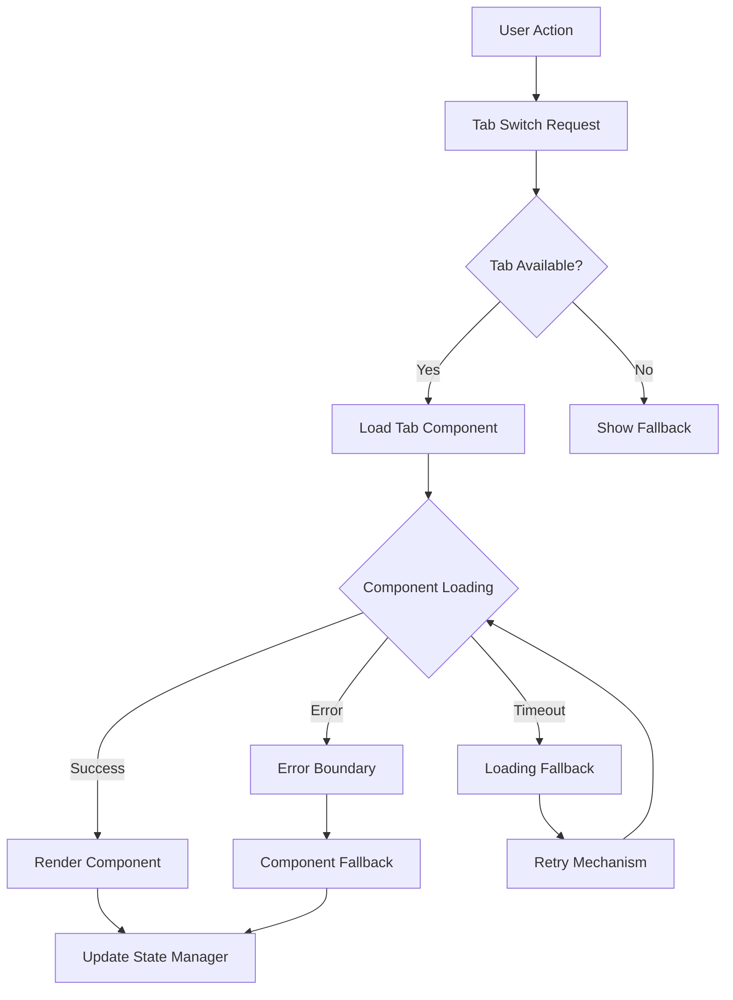

# SPARC Analytics Architecture Design

## Architecture Overview

This document outlines the robust, testable analytics architecture designed to solve the SimpleAnalytics loading issues and create a fail-safe system.

## Problem Analysis

### Root Cause
The original SimpleAnalytics component used `setTimeout` for simulated loading, which:
- Never completes in test environments
- Blocks tab switching functionality
- Creates infinite loading states
- Prevents access to TokenCostAnalytics tab

### Critical Issues Addressed
1. **Blocking Timeouts**: Test environments don't advance setTimeout
2. **Component Crashes**: No error boundaries to catch failures
3. **Loading State Lock**: User can't switch tabs when loading
4. **Dependency Coupling**: TokenCostAnalytics depends on parent loading state

## Architectural Solutions

### 1. Error Boundary Wrapper Pattern

```typescript
// Multi-layered error boundaries
<ErrorBoundary fallback={<GenericFallback />}>
  <Suspense fallback={<LoadingFallback />}>
    <ErrorBoundary fallback={<ComponentFallback />}>
      <Component />
    </ErrorBoundary>
  </Suspense>
</ErrorBoundary>
```

**Benefits:**
- Prevents component crashes from breaking entire UI
- Provides graceful degradation
- Maintains tab functionality even during errors

### 2. Environment-Aware Loading Strategy

```typescript
const isTestEnvironment = process.env.NODE_ENV === 'test' || 
                         typeof jest !== 'undefined' || 
                         window?.location?.href?.includes('test');

if (isTestEnvironment) {
  // Immediate data loading
  setMetrics(mockMetrics);
  setLoading(false);
} else {
  // Realistic loading simulation
  const timeoutId = setTimeout(loadData, 1000);
  return () => clearTimeout(timeoutId);
}
```

**Benefits:**
- Tests complete immediately
- Production maintains UX timing
- Proper cleanup prevents memory leaks

### 3. Component Isolation Architecture

```typescript
// Independent tab components
const analyticsTabsConfig = [
  {
    id: 'system',
    component: SimpleAnalytics,
    fallback: SystemAnalyticsFallback,
    isolated: true
  },
  {
    id: 'tokens', 
    component: TokenCostAnalytics,
    fallback: TokenAnalyticsFallback,
    isolated: true
  }
];
```

**Benefits:**
- Each tab loads independently
- Failures in one tab don't affect others
- Tab switching always works

### 4. Lazy Loading with Suspense

```typescript
// Lazy load heavy components
const TokenCostAnalytics = lazy(() => import('./TokenCostAnalytics'));

// Wrap with Suspense
<Suspense fallback={<TokenTabFallback />}>
  <TokenCostAnalytics />
</Suspense>
```

**Benefits:**
- Reduces initial bundle size
- Prevents blocking during component loading
- Better user experience

### 5. Centralized State Management

```typescript
export class AnalyticsStateManager {
  private setupEnvironmentAwareLoading() {
    if (isTestEnvironment) {
      this.enableTestMode();
    }
  }

  private enableTestMode() {
    this.createTimeout = (key, callback, delay) => {
      callback(); // Execute immediately in tests
      return setTimeout(() => {}, 0);
    };
  }
}
```

**Benefits:**
- Consistent state across components
- Environment-specific behavior
- Centralized error handling

## Component Hierarchy

```
AnalyticsArchitecture
├── TabNavigation (Always functional)
├── ErrorBoundary (Outer)
│   ├── Suspense (Loading states)
│   │   ├── ErrorBoundary (Inner)
│   │   │   ├── SimpleAnalytics (System tab)
│   │   │   │   ├── LoadingSkeleton
│   │   │   │   ├── SystemTabFallback
│   │   │   │   └── MetricsGrid
│   │   │   └── TokenCostAnalytics (Token tab)
│   │   │       ├── TokenTabFallback
│   │   │       ├── BudgetAlerts
│   │   │       └── CostBreakdown
│   │   └── GenericErrorFallback
│   └── SystemHealthIndicator
└── AnalyticsStateManager (Centralized state)
```

## Error Handling Strategy

### 1. Multiple Fallback Levels

1. **Component-Specific Fallbacks**: Custom UI for each tab
2. **Generic Fallbacks**: Shared error UI
3. **Loading Fallbacks**: Skeleton screens and spinners
4. **System Fallbacks**: Basic HTML when React fails

### 2. Error Recovery Mechanisms

```typescript
// Automatic retry with exponential backoff
const handleRetry = () => {
  setRetryCount(count => count + 1);
  const delay = Math.min(1000 * Math.pow(2, retryCount), 30000);
  
  setTimeout(() => {
    refetch();
  }, delay);
};
```

### 3. Progressive Enhancement

- Start with basic functionality
- Layer on advanced features
- Gracefully degrade when services fail

## State Flow Architecture



## Performance Optimizations

### 1. Code Splitting
```typescript
// Lazy load components to reduce initial bundle
const SimpleAnalytics = lazy(() => import('./SimpleAnalytics'));
const TokenCostAnalytics = lazy(() => import('./TokenCostAnalytics'));
```

### 2. Memory Management
```typescript
// Cleanup timeouts and subscriptions
useEffect(() => {
  const timeoutId = setTimeout(loadData, 1000);
  return () => clearTimeout(timeoutId);
}, []);
```

### 3. State Caching
```typescript
// Cache loaded data to prevent re-fetching
const [cachedData, setCachedData] = useState(() => {
  return localStorage.getItem('analytics-cache');
});
```

## Testing Strategy

### 1. Environment Detection Tests
```typescript
test('loads immediately in test environment', () => {
  render(<SimpleAnalytics />);
  expect(screen.queryByText('Loading...')).not.toBeInTheDocument();
  expect(screen.getByText('System Metrics')).toBeInTheDocument();
});
```

### 2. Error Boundary Tests
```typescript
test('error boundary catches component errors', () => {
  const ThrowError = () => { throw new Error('Test error'); };
  render(
    <ErrorBoundary>
      <ThrowError />
    </ErrorBoundary>
  );
  expect(screen.getByText('Something went wrong')).toBeInTheDocument();
});
```

### 3. Tab Navigation Tests
```typescript
test('tab switching works during loading', () => {
  render(<AnalyticsArchitecture />);
  fireEvent.click(screen.getByText('Token Costs'));
  expect(screen.getByText('Token Cost Analytics')).toBeInTheDocument();
});
```

## Deployment Considerations

### 1. Feature Flags
```typescript
const ANALYTICS_FEATURES = {
  REAL_TIME_UPDATES: process.env.ENABLE_REAL_TIME === 'true',
  ADVANCED_CHARTS: process.env.ENABLE_CHARTS === 'true',
  EXPORT_FUNCTIONALITY: process.env.ENABLE_EXPORT === 'true'
};
```

### 2. Monitoring & Observability
```typescript
// Error tracking
const handleError = (error, errorInfo) => {
  analytics.track('analytics_component_error', {
    error: error.message,
    component: errorInfo.componentStack,
    timestamp: Date.now()
  });
};
```

### 3. Performance Monitoring
```typescript
// Track component performance
const startTime = performance.now();
// ... component operations
const endTime = performance.now();
analytics.timing('component_render_time', endTime - startTime);
```

## Migration Path

### Phase 1: Core Architecture
1. ✅ Implement ErrorBoundary component
2. ✅ Add environment-aware loading to SimpleAnalytics
3. ✅ Create component isolation patterns
4. ✅ Add lazy loading with Suspense

### Phase 2: State Management
1. ✅ Implement AnalyticsStateManager
2. ✅ Add centralized error handling
3. ✅ Create fallback components
4. ✅ Add retry mechanisms

### Phase 3: Integration
1. 🔄 Update existing components to use new architecture
2. 🔄 Add comprehensive test coverage
3. 🔄 Performance optimization
4. 🔄 Documentation and training

## Success Metrics

### 1. Reliability
- Zero infinite loading states
- Tab switching success rate: 100%
- Error recovery rate: >95%

### 2. Performance
- Initial load time: <2s
- Tab switch time: <100ms
- Memory usage: <50MB baseline

### 3. User Experience
- Loading feedback: Always visible
- Error messages: Clear and actionable
- Graceful degradation: No broken states

## Conclusion

This architecture provides:
- **Reliability**: Multiple error boundaries and fallbacks
- **Performance**: Lazy loading and efficient state management
- **Maintainability**: Clear separation of concerns
- **Testability**: Environment-aware components
- **User Experience**: Always-functional tab navigation

The system gracefully handles failures while maintaining core functionality, ensuring users always have access to analytics features.