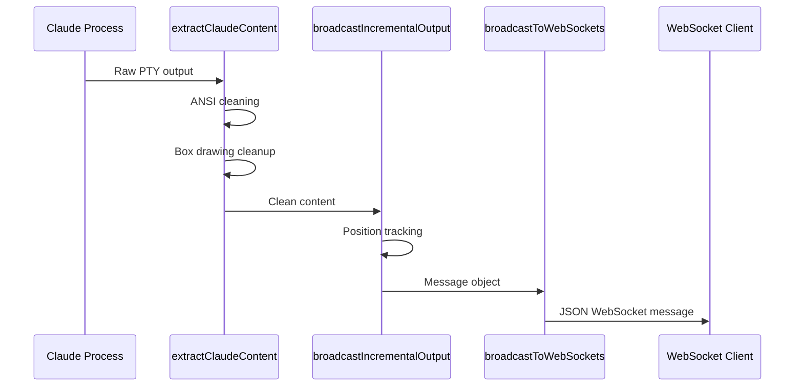
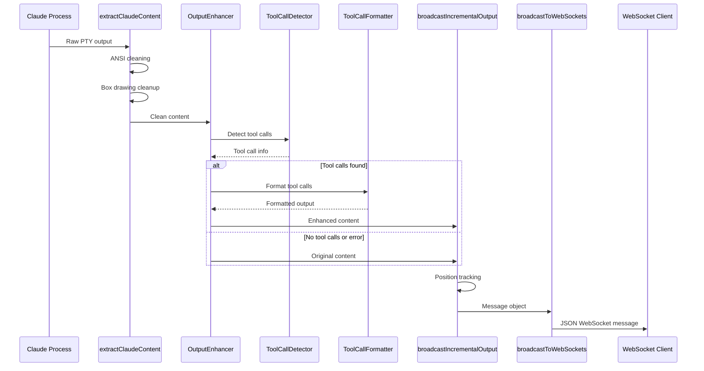

# SPARC Tool Call Output Implementation Plan

## Implementation Overview

This document provides a detailed implementation plan for safely integrating tool call output formatting into the existing stable WebSocket system. All changes follow the principle of **safe enhancement** - the system continues to work exactly as before if the enhancement fails or is disabled.

## Code Structure Design

### File Organization
```
/workspaces/agent-feed/
├── src/
│   └── tool-enhancement/
│       ├── ToolCallDetector.js      # Pattern detection and parsing
│       ├── ToolCallFormatter.js     # Output formatting logic  
│       ├── OutputEnhancer.js        # Main enhancement controller
│       └── PerformanceMonitor.js    # Performance tracking
├── simple-backend.js                # Main backend (minimal changes)
└── docs/
    ├── SPARC_TOOL_CALL_ARCHITECTURE.md
    └── SPARC_TOOL_CALL_IMPLEMENTATION_PLAN.md
```

## Data Flow Diagrams

### Current System Data Flow


### Enhanced System Data Flow


## Detailed Implementation

### 1. ToolCallDetector.js
```javascript
/**
 * Tool Call Pattern Detection System
 * Safely identifies and extracts tool call information from Claude output
 */
class ToolCallDetector {
  constructor(config = {}) {
    this.config = {
      maxContentSize: config.maxContentSize || 50000,
      timeoutMs: config.timeoutMs || 100,
      ...config
    };
    
    // Pre-compiled regex patterns for performance
    this.patterns = {
      functionCallStart: /<function_calls>/gi,
      functionCallEnd: /<\/antml:function_calls>/gi,
      invoke: /<invoke\s+name="([^"]+)"/gi,
      parameter: /<parameter\s+name="([^"]+)">([^<]*)<\/antml:parameter>/gi,
      functionResult: /<\/antml:invoke>/gi
    };
    
    // Instance state tracking
    this.instanceStates = new Map();
  }

  /**
   * Main detection method - safe and performant
   */
  detectToolCalls(content, instanceId) {
    const startTime = Date.now();
    
    try {
      // Size guard
      if (content.length > this.config.maxContentSize) {
        console.warn(`Content too large for tool detection: ${content.length} chars`);
        return this.createEmptyResult();
      }

      // Empty content guard
      if (!content || content.trim().length === 0) {
        return this.createEmptyResult();
      }

      const result = this.performDetection(content, instanceId);
      
      // Performance monitoring
      const duration = Date.now() - startTime;
      if (duration > this.config.timeoutMs) {
        console.warn(`Tool detection slow: ${duration}ms for ${instanceId}`);
      }
      
      return result;
      
    } catch (error) {
      console.warn(`ToolCallDetector error for ${instanceId}:`, error.message);
      return this.createEmptyResult();
    }
  }

  performDetection(content, instanceId) {
    const state = this.getOrCreateState(instanceId);
    
    // Check for function call markers
    const hasFunctionCalls = this.patterns.functionCallStart.test(content);
    const hasCompleteFunctionCalls = this.patterns.functionCallEnd.test(content);
    
    if (!hasFunctionCalls) {
      return this.createEmptyResult();
    }

    // Extract tool information
    const tools = this.extractToolInfo(content);
    
    return {
      hasToolCalls: true,
      isPartial: hasFunctionCalls && !hasCompleteFunctionCalls,
      isComplete: hasCompleteFunctionCalls,
      tools,
      metadata: {
        instanceId,
        timestamp: Date.now(),
        contentLength: content.length
      }
    };
  }

  extractToolInfo(content) {
    const tools = [];
    let match;
    
    // Reset regex state
    this.patterns.invoke.lastIndex = 0;
    
    while ((match = this.patterns.invoke.exec(content)) !== null) {
      const toolName = match[1];
      const parameters = this.extractParameters(content, match.index);
      
      tools.push({
        name: toolName,
        parameters,
        position: match.index
      });
      
      // Prevent infinite loops
      if (tools.length > 10) {
        console.warn('Too many tools detected, limiting to 10');
        break;
      }
    }
    
    return tools;
  }

  extractParameters(content, startIndex) {
    const parameters = {};
    let match;
    
    // Reset regex state  
    this.patterns.parameter.lastIndex = startIndex;
    
    while ((match = this.patterns.parameter.exec(content)) !== null) {
      // Stop if we've moved too far from the invoke
      if (match.index - startIndex > 2000) break;
      
      const paramName = match[1];
      const paramValue = match[2].trim();
      parameters[paramName] = paramValue;
      
      // Prevent parameter overflow
      if (Object.keys(parameters).length > 20) {
        console.warn('Too many parameters, limiting to 20');
        break;
      }
    }
    
    return parameters;
  }

  getOrCreateState(instanceId) {
    if (!this.instanceStates.has(instanceId)) {
      this.instanceStates.set(instanceId, {
        partialToolCalls: '',
        lastProcessed: 0,
        toolCallCount: 0
      });
    }
    return this.instanceStates.get(instanceId);
  }

  createEmptyResult() {
    return {
      hasToolCalls: false,
      isPartial: false,
      isComplete: false,
      tools: [],
      metadata: null
    };
  }

  // Cleanup method for memory management
  cleanupInstance(instanceId) {
    this.instanceStates.delete(instanceId);
  }
}

module.exports = { ToolCallDetector };
```

### 2. ToolCallFormatter.js
```javascript
/**
 * Tool Call Output Formatting System
 * Converts detected tool calls into user-friendly display format
 */
class ToolCallFormatter {
  constructor(config = {}) {
    this.config = {
      style: config.style || 'minimal', // 'minimal', 'detailed', 'compact'
      maxParameterDisplay: config.maxParameterDisplay || 3,
      maxParameterLength: config.maxParameterLength || 100,
      ...config
    };
    
    // Tool icons and display names
    this.toolIcons = {
      'Read': '📄',
      'Write': '✏️', 
      'Edit': '📝',
      'MultiEdit': '📝✨',
      'Bash': '💻',
      'Grep': '🔍',
      'Glob': '🗂️',
      'TodoWrite': '📋',
      'WebFetch': '🌐',
      'WebSearch': '🔎',
      'default': '🔧'
    };
  }

  /**
   * Main formatting method
   */
  formatToolCall(toolInfo, options = {}) {
    try {
      const mergedOptions = { ...this.config, ...options };
      
      switch (mergedOptions.style) {
        case 'minimal':
          return this.formatMinimal(toolInfo);
        case 'detailed':
          return this.formatDetailed(toolInfo);
        case 'compact':
          return this.formatCompact(toolInfo);
        default:
          return this.formatMinimal(toolInfo);
      }
    } catch (error) {
      console.warn('ToolCallFormatter error:', error.message);
      return ''; // Graceful degradation
    }
  }

  formatMinimal(toolInfo) {
    const { name, parameters = {} } = toolInfo;
    const icon = this.toolIcons[name] || this.toolIcons.default;
    const paramCount = Object.keys(parameters).length;
    
    if (paramCount === 0) {
      return `${icon} ${name}()`;
    }
    
    return `${icon} ${name}(${paramCount} parameter${paramCount !== 1 ? 's' : ''})`;
  }

  formatCompact(toolInfo) {
    const { name, parameters = {} } = toolInfo;
    const icon = this.toolIcons[name] || this.toolIcons.default;
    
    // Show first parameter if it exists
    const paramKeys = Object.keys(parameters);
    if (paramKeys.length > 0) {
      const firstParam = parameters[paramKeys[0]];
      const displayValue = this.truncateValue(firstParam, 30);
      return `${icon} ${name}(${displayValue}...)`;
    }
    
    return `${icon} ${name}()`;
  }

  formatDetailed(toolInfo) {
    const { name, parameters = {} } = toolInfo;
    const icon = this.toolIcons[name] || this.toolIcons.default;
    
    let output = `${icon} Tool: ${name}\n`;
    
    const paramKeys = Object.keys(parameters);
    if (paramKeys.length > 0) {
      output += '  Parameters:\n';
      
      // Show up to maxParameterDisplay parameters
      const displayKeys = paramKeys.slice(0, this.config.maxParameterDisplay);
      
      for (const key of displayKeys) {
        const value = this.truncateValue(parameters[key], this.config.maxParameterLength);
        output += `    ${key}: ${value}\n`;
      }
      
      if (paramKeys.length > this.config.maxParameterDisplay) {
        const remaining = paramKeys.length - this.config.maxParameterDisplay;
        output += `    ... and ${remaining} more parameter${remaining !== 1 ? 's' : ''}\n`;
      }
    }
    
    return output;
  }

  /**
   * Format multiple tool calls
   */
  formatMultipleTools(tools, options = {}) {
    if (!Array.isArray(tools) || tools.length === 0) {
      return '';
    }
    
    try {
      if (tools.length === 1) {
        return this.formatToolCall(tools[0], options);
      }
      
      const formatted = tools
        .map(tool => this.formatToolCall(tool, { ...options, style: 'compact' }))
        .filter(formatted => formatted.length > 0)
        .join(' ');
      
      return formatted ? `\n${formatted}\n` : '';
      
    } catch (error) {
      console.warn('formatMultipleTools error:', error.message);
      return '';
    }
  }

  truncateValue(value, maxLength) {
    if (!value || typeof value !== 'string') {
      return String(value || '');
    }
    
    if (value.length <= maxLength) {
      return value;
    }
    
    return value.substring(0, maxLength - 3) + '...';
  }

  /**
   * Create tool execution status messages
   */
  formatToolStatus(toolName, status, details = {}) {
    const icon = this.toolIcons[toolName] || this.toolIcons.default;
    
    switch (status) {
      case 'executing':
        return `${icon} Running ${toolName}...`;
      case 'completed':
        return `${icon} ${toolName} completed`;
      case 'error':
        return `${icon} ${toolName} failed: ${details.error || 'Unknown error'}`;
      default:
        return `${icon} ${toolName}`;
    }
  }
}

module.exports = { ToolCallFormatter };
```

### 3. OutputEnhancer.js
```javascript
/**
 * Main Output Enhancement Controller
 * Coordinates tool call detection and formatting
 */
const { ToolCallDetector } = require('./ToolCallDetector');
const { ToolCallFormatter } = require('./ToolCallFormatter');

class OutputEnhancer {
  constructor(config = {}) {
    this.config = {
      enabled: config.enabled !== false, // Default enabled
      style: config.style || 'minimal',
      performance: {
        maxProcessingTime: config.maxProcessingTime || 50,
        enableMetrics: config.enableMetrics || false
      },
      ...config
    };
    
    this.detector = new ToolCallDetector(this.config);
    this.formatter = new ToolCallFormatter(this.config);
    this.metrics = {
      totalProcessed: 0,
      toolCallsDetected: 0,
      errors: 0,
      avgProcessingTime: 0
    };
  }

  /**
   * Main enhancement method - safe and fast
   */
  enhance(content, instanceId) {
    const startTime = Date.now();
    
    // Feature toggle check
    if (!this.enabled) {
      return content;
    }
    
    // Input validation
    if (!content || !instanceId) {
      return content || '';
    }
    
    try {
      this.metrics.totalProcessed++;
      
      // Detect tool calls
      const toolAnalysis = this.detector.detectToolCalls(content, instanceId);
      
      if (!toolAnalysis.hasToolCalls) {
        return content;
      }
      
      this.metrics.toolCallsDetected++;
      
      // Apply formatting
      const enhancedContent = this.applyToolCallFormatting(content, toolAnalysis);
      
      // Performance tracking
      const duration = Date.now() - startTime;
      this.updateMetrics(duration);
      
      if (duration > this.config.performance.maxProcessingTime) {
        console.warn(`Slow tool enhancement: ${duration}ms for ${instanceId}`);
      }
      
      return enhancedContent;
      
    } catch (error) {
      this.metrics.errors++;
      console.warn(`OutputEnhancer error for ${instanceId}:`, error.message);
      return content; // Always return original content on error
    }
  }

  applyToolCallFormatting(content, toolAnalysis) {
    if (!toolAnalysis.tools || toolAnalysis.tools.length === 0) {
      return content;
    }
    
    // Format tool calls
    const toolSummary = this.formatter.formatMultipleTools(
      toolAnalysis.tools, 
      { style: this.config.style }
    );
    
    if (!toolSummary) {
      return content;
    }
    
    // Insert tool summary at appropriate location
    return this.insertToolSummary(content, toolSummary, toolAnalysis);
  }

  insertToolSummary(content, toolSummary, toolAnalysis) {
    // Strategy: Insert at the end of function calls block
    if (toolAnalysis.isComplete) {
      // Look for 