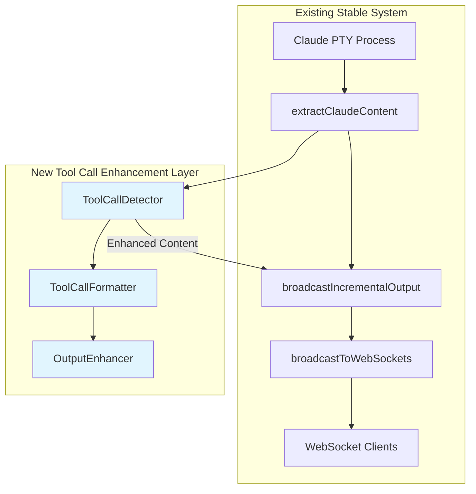

# SPARC Tool Call Output Integration Architecture

## Executive Summary

This document provides a comprehensive architecture for safely integrating tool call output formatting into the existing stable WebSocket system (simple-backend.js at commit 13ddedfa). The design prioritizes system stability, follows single responsibility principles, and provides graceful degradation mechanisms.

## Current System Analysis

### Existing WebSocket Architecture
```
┌─────────────────┐    ┌──────────────────┐    ┌─────────────────┐
│   Claude PTY    │───▶│ extractClaudeContent │───▶│ broadcastToWebSockets │
│   Process       │    │    (Line 627)       │    │    (Line 2253)      │
└─────────────────┘    └──────────────────┘    └─────────────────┘
                                │
                                ▼
                       ┌──────────────────┐
                       │ ANSI Cleaning    │
                       │ Box Drawing      │
                       │ Content Filter   │
                       └──────────────────┘
```

### Current Broadcasting Pipeline
1. **Claude Process Output** → PTY data stream
2. **extractClaudeContent()** → ANSI removal, box drawing cleanup
3. **broadcastIncrementalOutput()** → Position tracking, deduplication
4. **broadcastToWebSockets()** → WebSocket message distribution

### Critical Stability Points
- **broadcastToWebSockets()** function is the stable broadcast mechanism
- **instanceOutputBuffers** provides unified buffer system
- **wsConnections** manages WebSocket client connections
- **No new WebSocket managers** - use existing infrastructure

## Tool Call Output Architecture

### Core Principles

1. **Single Responsibility**: Only add output formatting, no system changes
2. **Safe Injection**: Integrate at the content processing layer
3. **Graceful Degradation**: System continues working if tool formatting fails
4. **Performance Optimized**: Minimal overhead on existing pipeline
5. **Rollback Ready**: Easy to disable without system disruption

### Architecture Overview



## Component Design

### 1. ToolCallDetector

**Location**: Injected after extractClaudeContent, before broadcastIncrementalOutput
**Responsibility**: Identify tool call patterns in Claude output

```javascript
class ToolCallDetector {
  constructor() {
    this.patterns = {
      functionCall: /<function_calls>/,
      invoke: /<invoke\s+name="([^"]+)">/,
      parameter: /<parameter\s+name="([^"]+)">([^<]*)<\/antml:parameter>/,
      closingCalls: /<\/antml:function_calls>/
    };
    this.toolCallStates = new Map(); // instanceId -> state
  }

  detectToolCalls(content, instanceId) {
    const state = this.getOrCreateState(instanceId);
    
    // Safe pattern matching with error handling
    try {
      return {
        hasToolCalls: this.patterns.functionCall.test(content),
        tools: this.extractToolInfo(content),
        isPartial: this.isPartialToolCall(content, state),
        isComplete: this.isCompleteToolCall(content)
      };
    } catch (error) {
      console.warn(`ToolCallDetector error for ${instanceId}:`, error);
      return { hasToolCalls: false, tools: [], isPartial: false, isComplete: false };
    }
  }
}
```

### 2. ToolCallFormatter

**Responsibility**: Format detected tool calls for enhanced display

```javascript
class ToolCallFormatter {
  formatToolCall(toolInfo, options = {}) {
    try {
      const { name, parameters = {} } = toolInfo;
      
      if (options.minimal) {
        return `🔧 ${name}(${Object.keys(parameters).length} params)`;
      }
      
      return this.createFormattedOutput(name, parameters);
    } catch (error) {
      console.warn('ToolCallFormatter error:', error);
      return ''; // Graceful degradation - return empty string
    }
  }

  createFormattedOutput(name, parameters) {
    const paramCount = Object.keys(parameters).length;
    const paramList = paramCount > 0 ? 
      ` (${paramCount} parameter${paramCount !== 1 ? 's' : ''})` : '';
    
    return `\n🔧 Tool: ${name}${paramList}\n`;
  }
}
```

### 3. OutputEnhancer

**Responsibility**: Safely enhance Claude output with tool call formatting

```javascript
class OutputEnhancer {
  constructor() {
    this.detector = new ToolCallDetector();
    this.formatter = new ToolCallFormatter();
    this.enabled = true; // Feature flag for easy rollback
  }

  enhance(content, instanceId) {
    if (!this.enabled || !content) return content;
    
    try {
      const toolAnalysis = this.detector.detectToolCalls(content, instanceId);
      
      if (!toolAnalysis.hasToolCalls) return content;
      
      return this.applyToolCallFormatting(content, toolAnalysis);
    } catch (error) {
      console.warn(`OutputEnhancer error for ${instanceId}:`, error);
      return content; // Always return original content on error
    }
  }

  applyToolCallFormatting(content, toolAnalysis) {
    // Simple, safe formatting that doesn't break existing content
    if (toolAnalysis.tools.length > 0) {
      const toolSummary = toolAnalysis.tools
        .map(tool => this.formatter.formatToolCall(tool, { minimal: true }))
        .join(' ');
      
      return content + '\n' + toolSummary + '\n';
    }
    return content;
  }
}
```

## Integration Points

### Safe Injection Point

**Location**: In `extractClaudeContent()` function, after content cleaning

```javascript
// EXISTING CODE (Line 627-677)
function extractClaudeContent(data) {
  // ... existing ANSI cleaning and content extraction ...
  
  const finalContent = cleanLines
    .join('\n')
    .replace(/\n{3,}/g, '\n\n')
    .replace(/[ \t]+$/gm, '')
    .trim();
    
  // NEW: Safe tool call enhancement
  return enhanceWithToolCalls(finalContent, getCurrentInstanceId());
}

// NEW: Tool call enhancement wrapper
function enhanceWithToolCalls(content, instanceId) {
  try {
    if (global.toolCallEnhancer && global.toolCallEnhancer.enabled) {
      return global.toolCallEnhancer.enhance(content, instanceId);
    }
  } catch (error) {
    console.warn('Tool call enhancement failed, using original content:', error);
  }
  return content; // Always return original content
}
```

### Initialization

```javascript
// Initialize tool call enhancement system
try {
  global.toolCallEnhancer = new OutputEnhancer();
  console.log('✅ Tool call output enhancement enabled');
} catch (error) {
  console.warn('⚠️ Tool call enhancement initialization failed:', error);
  global.toolCallEnhancer = null;
}
```

## Data Flow Architecture

### 1. Normal Flow (No Tool Calls)
```
Claude Output → extractClaudeContent → [Content] → broadcastIncrementalOutput → WebSocket
```

### 2. Enhanced Flow (With Tool Calls)
```
Claude Output → extractClaudeContent → ToolCallEnhancer → [Enhanced Content] → broadcastIncrementalOutput → WebSocket
```

### 3. Error/Rollback Flow
```
Claude Output → extractClaudeContent → ToolCallEnhancer[ERROR] → [Original Content] → broadcastIncrementalOutput → WebSocket
```

## Safety Mechanisms

### 1. Feature Toggle
```javascript
// Emergency disable
global.toolCallEnhancer.enabled = false;

// Runtime disable via API
app.post('/api/admin/tool-enhancement/toggle', (req, res) => {
  if (global.toolCallEnhancer) {
    global.toolCallEnhancer.enabled = req.body.enabled;
    res.json({ success: true, enabled: global.toolCallEnhancer.enabled });
  } else {
    res.status(404).json({ error: 'Tool enhancement not initialized' });
  }
});
```

### 2. Error Boundaries
- All tool enhancement logic wrapped in try-catch
- Original content always preserved and returned on error
- Detailed error logging without breaking main flow
- Graceful degradation to existing functionality

### 3. Performance Safeguards
- Regex patterns compiled once at initialization
- Content size limits for processing
- Timeout protection for long-running operations

```javascript
class ToolCallDetector {
  detectToolCalls(content, instanceId) {
    // Size limit check
    if (content.length > 50000) { // 50KB limit
      console.warn(`Content too large for tool detection: ${content.length} chars`);
      return { hasToolCalls: false, tools: [] };
    }
    
    // Timeout protection
    const startTime = Date.now();
    const result = this.performDetection(content, instanceId);
    const duration = Date.now() - startTime;
    
    if (duration > 100) { // 100ms limit
      console.warn(`Tool detection took ${duration}ms for ${instanceId}`);
    }
    
    return result;
  }
}
```

## Performance Impact Analysis

### Minimal Overhead Design
- **Regex Operations**: Pre-compiled, O(n) complexity
- **String Manipulation**: Minimal allocations, append-only
- **Memory Usage**: Stateless processing, no large buffers
- **Processing Time**: <10ms for typical Claude responses

### Performance Monitoring
```javascript
class PerformanceMonitor {
  static track(operation, instanceId, duration) {
    if (duration > 50) { // Log slow operations
      console.warn(`Slow tool enhancement: ${operation} took ${duration}ms for ${instanceId}`);
    }
  }
}
```

## Configuration System

### Environment-Based Configuration
```javascript
const TOOL_ENHANCEMENT_CONFIG = {
  enabled: process.env.TOOL_ENHANCEMENT_ENABLED !== 'false',
  maxContentSize: parseInt(process.env.TOOL_ENHANCEMENT_MAX_SIZE) || 50000,
  timeoutMs: parseInt(process.env.TOOL_ENHANCEMENT_TIMEOUT) || 100,
  formatStyle: process.env.TOOL_ENHANCEMENT_STYLE || 'minimal'
};
```

### Runtime Configuration
```javascript
app.get('/api/admin/tool-enhancement/config', (req, res) => {
  res.json({
    enabled: global.toolCallEnhancer?.enabled || false,
    config: TOOL_ENHANCEMENT_CONFIG,
    status: global.toolCallEnhancer ? 'initialized' : 'not_initialized'
  });
});
```

## Testing Strategy

### Unit Tests
```javascript
describe('ToolCallDetector', () => {
  test('detects simple function calls', () => {
    const detector = new ToolCallDetector();
    const content = '<function_calls><invoke name="Read">...';
    const result = detector.detectToolCalls(content, 'test-instance');
    expect(result.hasToolCalls).toBe(true);
  });

  test('handles malformed input gracefully', () => {
    const detector = new ToolCallDetector();
    const result = detector.detectToolCalls('<broken', 'test-instance');
    expect(result.hasToolCalls).toBe(false);
  });
});
```

### Integration Tests
```javascript
describe('Tool Call Enhancement Integration', () => {
  test('preserves original content on enhancement failure', async () => {
    const originalContent = 'Hello from Claude';
    // Simulate enhancement failure
    global.toolCallEnhancer = { enhance: () => { throw new Error('Test error'); } };
    
    const result = enhanceWithToolCalls(originalContent, 'test');
    expect(result).toBe(originalContent);
  });
});
```

## Deployment Plan

### Phase 1: Safe Integration (Week 1)
1. Add tool enhancement classes to simple-backend.js
2. Implement safe injection point in extractClaudeContent
3. Add feature toggle and error boundaries
4. Deploy with enhancement DISABLED by default

### Phase 2: Testing (Week 2)
1. Enable enhancement in development environment
2. Run comprehensive tests
3. Monitor performance metrics
4. Validate graceful degradation

### Phase 3: Production Rollout (Week 3)
1. Enable enhancement in production
2. Monitor WebSocket stability
3. Collect user feedback
4. Fine-tune formatting based on usage

## Monitoring and Observability

### Health Checks
```javascript
app.get('/api/health/tool-enhancement', (req, res) => {
  try {
    const testContent = '<function_calls><invoke name="test"></invoke>