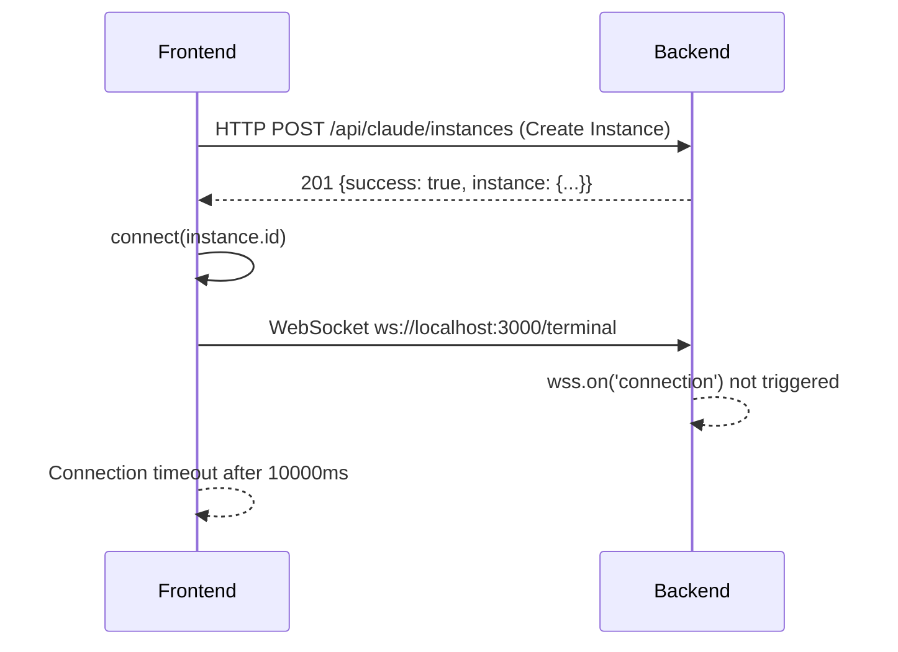
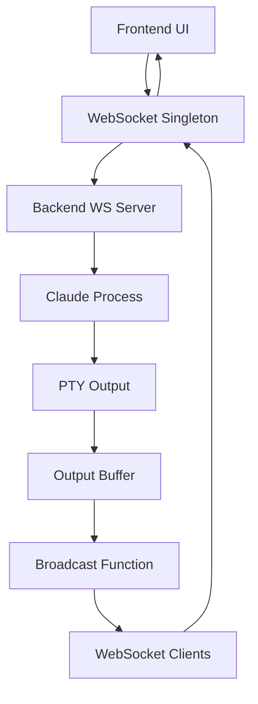

# SPARC WebSocket Connection Specification

## Current Issue Analysis

### Problem Statement
- **Backend Status**: Claude Code instances created successfully (claude-6038 running on PID 24552)
- **Backend WebSocket**: Server listening on port 3000 with path `/terminal`
- **Frontend Issue**: Calls `connect(instance.id)` but WebSocket connection not establishing
- **Connection Flow**: Frontend uses useWebSocketSingleton but "No connections" warnings in backend

## 1. WebSocket URL Construction Analysis

### Current Implementation
```typescript
// Frontend: useWebSocketSingleton.ts (Line 99-100)
const wsUrl = apiUrl.replace('http://', 'ws://').replace('https://', 'wss://');
const ws = new WebSocket(`${wsUrl}/terminal`);

// Backend: simple-backend.js (Lines 1996-1999)
const wss = new WebSocket.Server({ 
  server,
  path: '/terminal'
});
```

### Issue Identification
1. **URL Mismatch**: Frontend constructs `ws://localhost:3000/terminal` but backend expects correct path format
2. **Connection Timing**: Frontend connects before backend WebSocket server is ready
3. **Protocol Translation**: HTTP to WebSocket URL conversion may have edge cases

### Required Specifications

#### FR-WS-001: WebSocket URL Construction
- **Requirement**: Frontend MUST construct WebSocket URLs using consistent protocol translation
- **Implementation**: 
  ```typescript
  const wsUrl = apiUrl
    .replace(/^https?:\/\//, match => match === 'https://' ? 'wss://' : 'ws://')
    .replace(/\/$/, ''); // Remove trailing slash
  const websocket = new WebSocket(`${wsUrl}/terminal`);
  ```
- **Acceptance Criteria**:
  - HTTP URLs become WS URLs
  - HTTPS URLs become WSS URLs  
  - Path `/terminal` is correctly appended
  - No double slashes in final URL

## 2. Connection Lifecycle Specification

### Current Flow Analysis


### Connection States
1. **DISCONNECTED**: Initial state, no WebSocket connection
2. **CONNECTING**: WebSocket connection attempt in progress
3. **CONNECTED**: WebSocket connection established, ready for messaging
4. **ERROR**: Connection failed, error state with retry capability
5. **RECONNECTING**: Automatic reconnection attempt after failure

#### FR-WS-002: Connection State Management
- **Requirement**: Connection state MUST be tracked and exposed to UI
- **State Transitions**:
  ```typescript
  interface ConnectionState {
    status: 'disconnected' | 'connecting' | 'connected' | 'error' | 'reconnecting';
    lastConnected?: Date;
    errorCount: number;
    instanceId?: string;
  }
  ```

#### FR-WS-003: Connection Retry Logic
- **Requirement**: Failed connections MUST implement exponential backoff retry
- **Implementation**:
  - Initial retry after 1 second
  - Exponential backoff: 1s, 2s, 4s, 8s, 16s (max)
  - Maximum retry attempts: 5
  - Reset retry count on successful connection

## 3. Message Routing Specification

### Current Message Flow
```typescript
// Frontend sends (Line 273-278)
const message = {
  type: 'input',
  data: commandLine,
  terminalId: selectedInstance,
  timestamp: Date.now()
};

// Backend expects (Line 2014-2046)
if (message.type === 'connect' && message.terminalId) {
  // Connection handling
}
```

### Issue: Message Type Mismatch
- **Frontend** sends `type: 'input'` for commands
- **Backend** expects `type: 'connect'` for initial connection
- **Result**: Backend cannot route messages to correct Claude instance

#### FR-WS-004: Message Protocol Definition
```typescript
interface WebSocketMessage {
  type: 'connect' | 'input' | 'output' | 'status' | 'error' | 'disconnect';
  terminalId: string;
  data?: string;
  timestamp: number;
  messageId?: string;
}

// Connection Message
interface ConnectMessage extends WebSocketMessage {
  type: 'connect';
  terminalId: string; // Claude instance ID (e.g., "claude-6038")
}

// Input Message  
interface InputMessage extends WebSocketMessage {
  type: 'input';
  terminalId: string;
  data: string; // Command to send to Claude
}

// Output Message
interface OutputMessage extends WebSocketMessage {
  type: 'output';
  terminalId: string;
  data: string; // Claude response
  source: 'stdout' | 'stderr' | 'pty';
}
```

#### FR-WS-005: Connection Handshake Protocol
1. **Frontend** creates WebSocket connection to `/terminal`
2. **Frontend** immediately sends connect message:
   ```json
   {
     "type": "connect",
     "terminalId": "claude-6038", 
     "timestamp": 1703123456789
   }
   ```
3. **Backend** associates WebSocket with terminalId and responds:
   ```json
   {
     "type": "connect",
     "terminalId": "claude-6038",
     "connectionType": "websocket",
     "timestamp": 1703123456790
   }
   ```

## 4. Error Handling and Fallback Mechanisms

### Current Issues
- **No Error Propagation**: WebSocket errors not properly surfaced to UI
- **No Fallback**: When WebSocket fails, no alternative communication method
- **Connection Timeout**: 10-second timeout may be too aggressive

#### FR-WS-006: Error Handling Requirements
```typescript
interface WebSocketError {
  code: string;
  message: string;
  recoverable: boolean;
  timestamp: Date;
  context?: Record<string, any>;
}

// Error Types
const ERROR_CODES = {
  CONNECTION_FAILED: 'WS_CONNECTION_FAILED',
  CONNECTION_TIMEOUT: 'WS_CONNECTION_TIMEOUT', 
  MESSAGE_SEND_FAILED: 'WS_MESSAGE_SEND_FAILED',
  INVALID_MESSAGE_FORMAT: 'WS_INVALID_MESSAGE_FORMAT',
  INSTANCE_NOT_FOUND: 'WS_INSTANCE_NOT_FOUND',
  INSTANCE_NOT_RUNNING: 'WS_INSTANCE_NOT_RUNNING'
} as const;
```

#### FR-WS-007: Fallback Communication Strategy
When WebSocket connection fails:
1. **Immediate Fallback**: Switch to HTTP polling for terminal output
2. **Input Handling**: Use HTTP POST to `/api/claude/instances/{id}/terminal/input`
3. **Output Monitoring**: Poll `/api/claude/instances/{id}/terminal/stream` (SSE)
4. **Background Retry**: Continue attempting WebSocket reconnection
5. **Seamless Switch**: When WebSocket reconnects, switch back automatically

## 5. Real-time Bidirectional Communication Flow

### Required Data Flow


#### FR-WS-008: Bidirectional Message Flow
1. **User Input**: 
   - UI → WebSocket → Backend → Claude Process PTY
   - Echo handling: Backend filters input echo from output
2. **Claude Output**:
   - Claude Process → PTY → Output Buffer → WebSocket Broadcast → Frontend
   - Real-time streaming with incremental updates

#### FR-WS-009: Output Buffer Management
- **Incremental Updates**: Only send new output since last broadcast
- **Position Tracking**: Track `lastSentPosition` per instance
- **Buffer Cleanup**: Prevent memory leaks with size limits
- **Duplicate Prevention**: Filter duplicate content within 50ms window

## 6. Authentication and Session Management

### Current State
- **No Authentication**: WebSocket connections are unauthenticated
- **No Session Tracking**: Connections not associated with user sessions
- **No Permission Checks**: Any connection can access any Claude instance

#### FR-WS-010: Session Management Requirements
```typescript
interface WebSocketSession {
  sessionId: string;
  clientId: string;
  instanceId: string;
  connectedAt: Date;
  lastActivity: Date;
  permissions: string[];
}
```

- **Session Creation**: Generate session ID when WebSocket connects to instance
- **Activity Tracking**: Update lastActivity on each message
- **Session Cleanup**: Remove inactive sessions after 5 minutes
- **Permission Validation**: Verify client can access requested instance

## 7. Connection Success Criteria

### Functional Requirements

#### FR-WS-011: Connection Establishment Success Criteria
- [ ] WebSocket connects to `ws://localhost:3000/terminal` within 10 seconds
- [ ] Backend logs `"🔗 SPARC: New WebSocket terminal connection established"`
- [ ] Connection handshake completes with `type: 'connect'` message exchange
- [ ] Frontend receives connection confirmation with correct terminalId
- [ ] Backend associates WebSocket with specified Claude instance

#### FR-WS-012: Message Exchange Success Criteria  
- [ ] Frontend can send input messages that reach Claude process
- [ ] Backend forwards input to correct Claude instance PTY
- [ ] Claude output broadcasts to connected WebSocket clients
- [ ] Output appears in frontend terminal interface within 100ms
- [ ] No message loss or duplication during normal operation

#### FR-WS-013: Error Recovery Success Criteria
- [ ] Connection failures trigger appropriate error messages
- [ ] Automatic retry attempts with exponential backoff
- [ ] Fallback to SSE/HTTP polling when WebSocket unavailable
- [ ] Seamless reconnection when WebSocket becomes available
- [ ] State consistency maintained across connection changes

### Non-Functional Requirements

#### NFR-WS-001: Performance Requirements
- **Connection Time**: WebSocket connection MUST establish within 5 seconds
- **Message Latency**: Messages MUST be delivered within 100ms under normal conditions
- **Throughput**: MUST handle 10 messages/second per instance
- **Concurrent Connections**: MUST support 50 concurrent WebSocket connections

#### NFR-WS-002: Reliability Requirements
- **Uptime**: WebSocket service MUST maintain 99.9% availability
- **Data Integrity**: No message loss or corruption during transmission
- **Connection Recovery**: MUST recover from network interruptions within 30 seconds
- **Memory Usage**: WebSocket connections MUST not leak memory over time

## 8. Testing and Validation Specifications

### Connection Test Cases
```typescript
describe('WebSocket Connection', () => {
  test('should establish connection to running Claude instance', async () => {
    // Create Claude instance via HTTP API
    const instance = await createClaudeInstance();
    
    // Connect WebSocket
    const ws = new WebSocket('ws://localhost:3000/terminal');
    await waitForConnection(ws);
    
    // Send connect message
    ws.send(JSON.stringify({
      type: 'connect',
      terminalId: instance.id,
      timestamp: Date.now()
    }));
    
    // Verify connection confirmation
    const response = await waitForMessage(ws);
    expect(response.type).toBe('connect');
    expect(response.terminalId).toBe(instance.id);
  });
});
```

### Message Flow Test Cases
```typescript
describe('WebSocket Message Flow', () => {
  test('should forward input to Claude and receive output', async () => {
    const ws = await establishConnection('claude-test');
    
    // Send input message
    ws.send(JSON.stringify({
      type: 'input', 
      terminalId: 'claude-test',
      data: 'Hello Claude\n',
      timestamp: Date.now()
    }));
    
    // Wait for Claude output
    const output = await waitForMessage(ws, message => message.type === 'output');
    expect(output.data).toContain('Hello');
  });
});
```

## Implementation Priority

### Phase 1: Critical Connection Fixes
1. **Fix WebSocket URL construction** (FR-WS-001)
2. **Implement connection handshake protocol** (FR-WS-005)  
3. **Add proper error handling** (FR-WS-006)
4. **Fix message routing** (FR-WS-004)

### Phase 2: Reliability & Recovery
1. **Add connection retry logic** (FR-WS-003)
2. **Implement fallback mechanisms** (FR-WS-007)
3. **Add connection state management** (FR-WS-002)

### Phase 3: Performance & Polish
1. **Optimize output buffer management** (FR-WS-009)
2. **Add session management** (FR-WS-010)
3. **Implement comprehensive testing** (Section 8)

## Success Metrics

### Connection Health Dashboard
- **Active Connections**: Number of established WebSocket connections
- **Connection Success Rate**: Percentage of successful connection attempts
- **Average Connection Time**: Time to establish WebSocket connection
- **Message Throughput**: Messages per second per instance
- **Error Rate**: Failed messages as percentage of total messages

This specification provides a comprehensive roadmap for fixing the WebSocket connection issues and ensuring reliable real-time communication between the Claude frontend and backend systems.