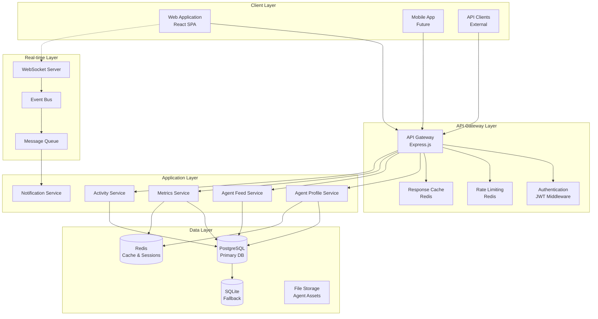
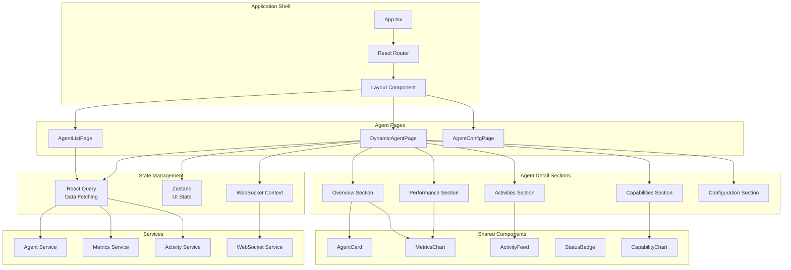
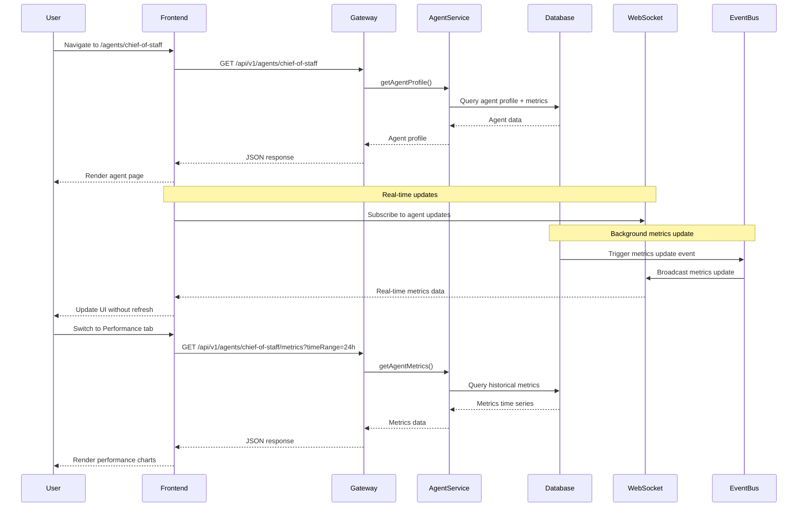
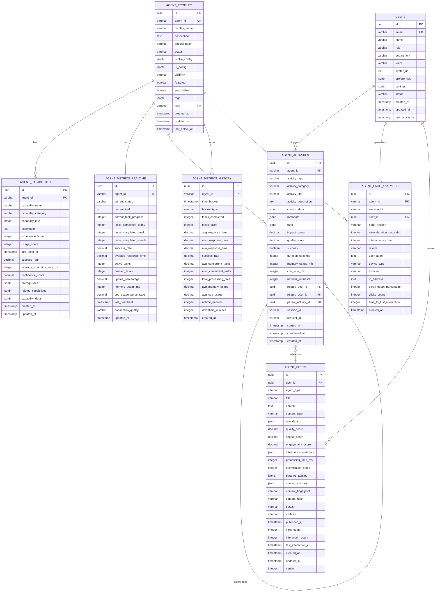
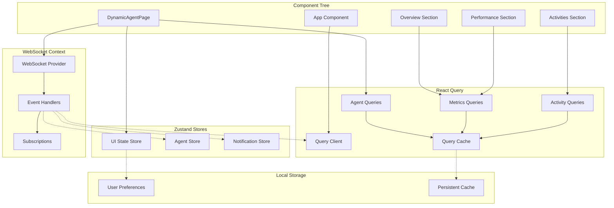
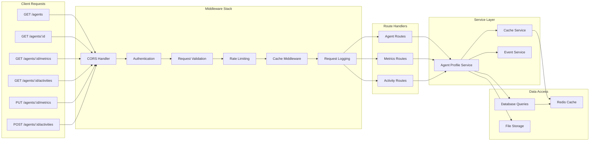
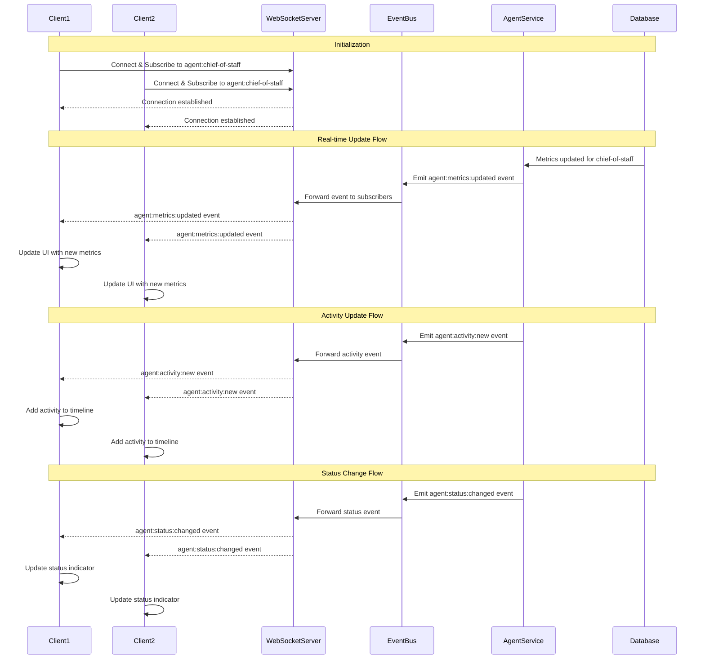
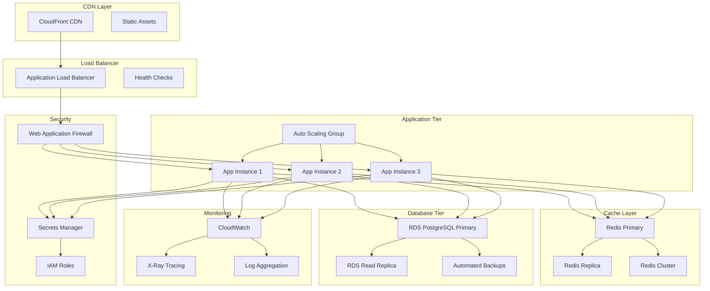

# Dynamic Agent Pages - Architectural Diagrams

## System Architecture Diagrams

This document contains visual representations of the dynamic agent pages system architecture.

## 1. High-Level System Architecture

## 2. Component Architecture - Frontend

## 3. Data Flow Architecture

## 4. Database Entity Relationship Diagram

## 5. State Management Architecture

## 6. API Architecture

## 7. Real-time Communication Architecture

## 8. Deployment Architecture

## 9. Performance Optimization Strategy

```mermaid
graph TB
    subgraph "Frontend Optimizations"
        CODE_SPLIT[Code Splitting]
        LAZY_LOAD[Lazy Loading]
        MEMOIZATION[React Memoization]
        VIRTUAL_SCROLL[Virtual Scrolling]
        IMAGE_OPT[Image Optimization]
    end

    subgraph "API Optimizations"
        RESPONSE_CACHE[Response Caching]
        GZIP[Response Compression]
        PAGINATION[Smart Pagination]
        PREFETCH[Data Prefetching]
        BATCH[Request Batching]
    end

    subgraph "Database Optimizations"
        INDEXING[Strategic Indexing]
        QUERY_OPT[Query Optimization]
        READ_REPLICA[Read Replicas]
        PARTITIONING[Table Partitioning]
        CONNECTION_POOL[Connection Pooling]
    end

    subgraph "Cache Strategy"
        L1_CACHE[L1: React Query]
        L2_CACHE[L2: Redis Cache]
        L3_CACHE[L3: CDN Cache]
        CACHE_INVALID[Smart Invalidation]
    end

    subgraph "Real-time Optimizations"
        WS_POOL[WebSocket Connection Pooling]
        EVENT_FILTER[Event Filtering]
        BATCH_EVENTS[Event Batching]
        COMPRESSION[Message Compression]
    end

    CODE_SPLIT --> LAZY_LOAD
    LAZY_LOAD --> MEMOIZATION
    MEMOIZATION --> VIRTUAL_SCROLL
    VIRTUAL_SCROLL --> IMAGE_OPT

    RESPONSE_CACHE --> GZIP
    GZIP --> PAGINATION
    PAGINATION --> PREFETCH
    PREFETCH --> BATCH

    INDEXING --> QUERY_OPT
    QUERY_OPT --> READ_REPLICA
    READ_REPLICA --> PARTITIONING
    PARTITIONING --> CONNECTION_POOL

    L1_CACHE --> L2_CACHE
    L2_CACHE --> L3_CACHE
    L3_CACHE --> CACHE_INVALID

    WS_POOL --> EVENT_FILTER
    EVENT_FILTER --> BATCH_EVENTS
    BATCH_EVENTS --> COMPRESSION
```

These architectural diagrams provide a comprehensive visual representation of the dynamic agent pages system, covering all major components, data flows, and optimization strategies. They serve as a reference for development, deployment, and maintenance of the system.