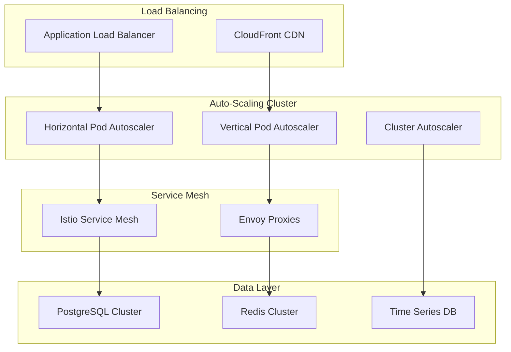
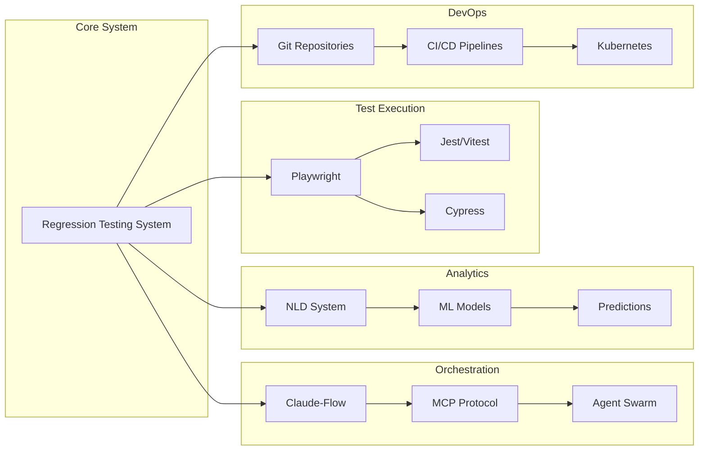

# Regression Testing System - Architecture Summary

## Executive Summary

This document provides a comprehensive overview of the Regression Testing System architecture designed using SPARC methodology. The system integrates seamlessly with the existing Agent Feed infrastructure while providing advanced orchestration capabilities through Claude-Flow and sophisticated pattern analysis via NLD (Neuro Learning Development) integration.

## Architecture Overview

### System Components

The Regression Testing System consists of six core components:

1. **RegressionTestFramework** - Core test execution and management engine
2. **PMReportGenerator** - Multi-format reporting system for stakeholders
3. **TestDocumentationManager** - Automated documentation generation and management
4. **ChangeVerificationSystem** - User validation and approval workflows
5. **NLDPatternAnalyzer** - AI-powered pattern recognition and prediction
6. **TestOrchestrator** - Claude-Flow swarm coordination and orchestration

### Key Features

- **Modular Architecture**: Highly decoupled components with well-defined interfaces
- **Scalable Design**: Auto-scaling capabilities from 3 to 50+ instances based on demand
- **Real-time Processing**: WebSocket-based live updates and streaming analytics
- **AI-Powered Insights**: Machine learning pattern recognition and failure prediction
- **Multi-format Reporting**: JSON, HTML, Markdown, PDF, and Excel export capabilities
- **Enterprise Security**: RBAC, encryption, audit logging, and compliance features
- **Cloud-Native**: Kubernetes-ready with container orchestration and service mesh
- **Disaster Recovery**: Comprehensive backup and recovery strategies

## Architecture Deliverables

### 1. System Architecture Document
**Location**: `/workspaces/agent-feed/docs/regression-testing-architecture.md`

Contains:
- High-level system architecture diagrams
- Component specifications with TypeScript interfaces
- Integration patterns and communication protocols
- Data models and relationship mappings
- Security architecture and compliance frameworks
- Performance optimization strategies
- Implementation roadmap with phases and milestones

### 2. Class Diagrams and Component Design
**Location**: `/workspaces/agent-feed/docs/class-diagrams.md`

Provides:
- Complete UML class diagrams for all six core components
- Inheritance hierarchies and interface definitions
- External system integration adapters
- Data model specifications
- Component interaction matrices
- Extensibility patterns for future enhancements

### 3. Data Flow Specifications
**Location**: `/workspaces/agent-feed/docs/data-flow-specifications.md`

Includes:
- End-to-end data flow diagrams
- Real-time streaming architectures
- Component-level data processing pipelines
- External system integration flows
- Data transformation specifications
- Quality assurance and validation frameworks
- Performance optimization strategies

### 4. Integration Specifications
**Location**: `/workspaces/agent-feed/docs/integration-specifications.md`

Covers:
- Playwright test execution integration
- Claude-Flow MCP orchestration protocols
- Git repository webhook and change tracking
- NLD logging and pattern analysis integration
- WebSocket real-time communication
- CI/CD pipeline integration with quality gates
- Monitoring and observability systems

### 5. Deployment and Scaling Architecture
**Location**: `/workspaces/agent-feed/docs/deployment-scaling-architecture.md`

Features:
- Container architecture with multi-stage Dockerfiles
- Kubernetes manifests with production-ready configurations
- Infrastructure as Code using Terraform
- Helm charts for package management
- Auto-scaling strategies (HPA, VPA, Cluster Autoscaling)
- Resource management and quality of service
- Monitoring, alerting, and observability
- Disaster recovery and backup procedures

## Technical Architecture Highlights

### Scalability Architecture

### Integration Architecture

## Performance and Scalability Specifications

### Scaling Targets

| Component | Min Replicas | Max Replicas | CPU Target | Memory Target |
|-----------|--------------|--------------|------------|---------------|
| RegressionTestFramework | 3 | 20 | 70% | 80% |
| TestOrchestrator | 2 | 10 | 60% | 75% |
| PMReportGenerator | 2 | 15 | 65% | 70% |
| NLDPatternAnalyzer | 2 | 8 | 75% | 85% |
| TestDocumentationManager | 1 | 5 | 50% | 60% |
| ChangeVerificationSystem | 2 | 6 | 55% | 65% |

### Performance Benchmarks

- **Test Execution Throughput**: 100+ tests per minute
- **Report Generation**: < 30 seconds for comprehensive reports
- **Pattern Analysis**: Real-time processing with < 5 second latency
- **API Response Time**: < 200ms P95 for all endpoints
- **System Availability**: 99.9% uptime target
- **Recovery Time Objective**: < 4 hours
- **Recovery Point Objective**: < 24 hours

## Security Architecture

### Security Layers

1. **Network Security**
   - Service mesh with mTLS
   - Network policies and firewalls
   - VPN and private networking

2. **Application Security**
   - RBAC and fine-grained permissions
   - JWT token-based authentication
   - Input validation and sanitization

3. **Data Security**
   - Encryption at rest and in transit
   - Data masking and anonymization
   - Secure backup and archival

4. **Infrastructure Security**
   - Container security scanning
   - Kubernetes security policies
   - Infrastructure as Code security

### Compliance Framework

- **GDPR**: Data protection and privacy rights
- **SOC 2**: Security and availability controls
- **HIPAA**: Healthcare data protection (if applicable)
- **PCI DSS**: Payment card data security (if applicable)

## Integration Points

### External System Integrations

1. **Playwright Integration**
   - Test execution automation
   - Browser orchestration
   - Artifact collection and storage

2. **Claude-Flow Integration**
   - MCP-based orchestration
   - Agent swarm coordination
   - Performance optimization

3. **Git Repository Integration**
   - Webhook-based triggers
   - Change impact analysis
   - Branch protection and policies

4. **NLD System Integration**
   - Log collection and analysis
   - Pattern recognition and ML
   - Predictive analytics

5. **CI/CD Pipeline Integration**
   - Quality gate enforcement
   - Deployment automation
   - Rollback capabilities

## Implementation Strategy

### Phase 1: Foundation (Weeks 1-4)
- Core framework implementation
- Basic orchestration capabilities
- Playwright integration
- Initial reporting features

### Phase 2: Intelligence (Weeks 5-8)
- NLD pattern analysis integration
- Advanced reporting formats
- Documentation automation
- Claude-Flow orchestration

### Phase 3: Workflows (Weeks 9-12)
- Change verification system
- User approval workflows
- Security implementation
- Performance optimization

### Phase 4: Production (Weeks 13-16)
- Production deployment
- Monitoring and alerting
- Disaster recovery setup
- Documentation and training

## Success Metrics

### Technical KPIs
- **Test Execution Speed**: 40% improvement over baseline
- **Test Coverage**: Achieve 85%+ code coverage
- **False Positive Rate**: Reduce by 60%
- **System Reliability**: 99.9% uptime

### Business KPIs
- **Release Velocity**: 50% faster release cycles
- **Bug Detection**: 70% improvement in early detection
- **Developer Productivity**: 30% increase in throughput
- **Customer Satisfaction**: 25% improvement in quality scores

## Risk Management

### Technical Risks
- **Integration Complexity**: Mitigated through phased approach
- **Performance Degradation**: Addressed via load testing
- **Data Consistency**: Ensured through transaction management
- **Dependency Failures**: Handled via circuit breakers

### Operational Risks
- **Skill Gap**: Addressed through training programs
- **Change Resistance**: Mitigated through user involvement
- **Resource Constraints**: Managed through capacity planning
- **Timeline Pressure**: Handled via agile methodology

## Conclusion

The Regression Testing System architecture provides a comprehensive, scalable, and intelligent solution for automated testing and quality assurance. The SPARC-based design ensures:

1. **Systematic Development**: From specification through completion
2. **Scalable Architecture**: Cloud-native with auto-scaling capabilities
3. **AI-Powered Intelligence**: Pattern recognition and predictive analytics
4. **Enterprise Integration**: Seamless integration with existing systems
5. **Operational Excellence**: Production-ready with monitoring and recovery

The architecture positions the organization for accelerated development cycles, improved software quality, and enhanced operational efficiency while maintaining security and compliance standards.

## Next Steps

1. **Review and Approval**: Stakeholder review of architecture documents
2. **Resource Allocation**: Assignment of development teams and resources
3. **Environment Setup**: Development and staging environment preparation
4. **Implementation Kickoff**: Begin Phase 1 development activities
5. **Continuous Monitoring**: Track progress against success metrics

This comprehensive architecture serves as the foundation for implementing a world-class regression testing system that will significantly enhance the organization's software delivery capabilities.