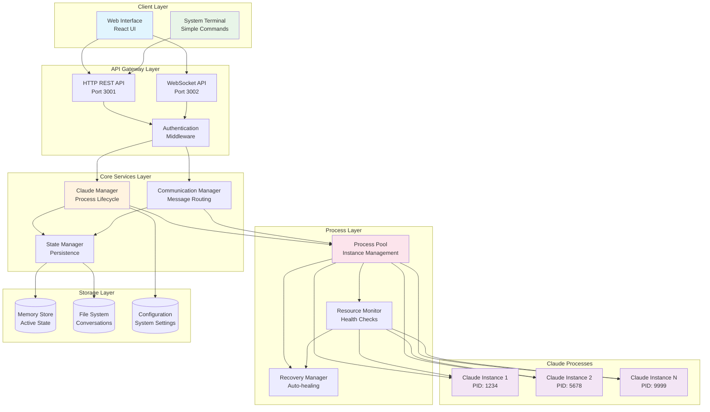
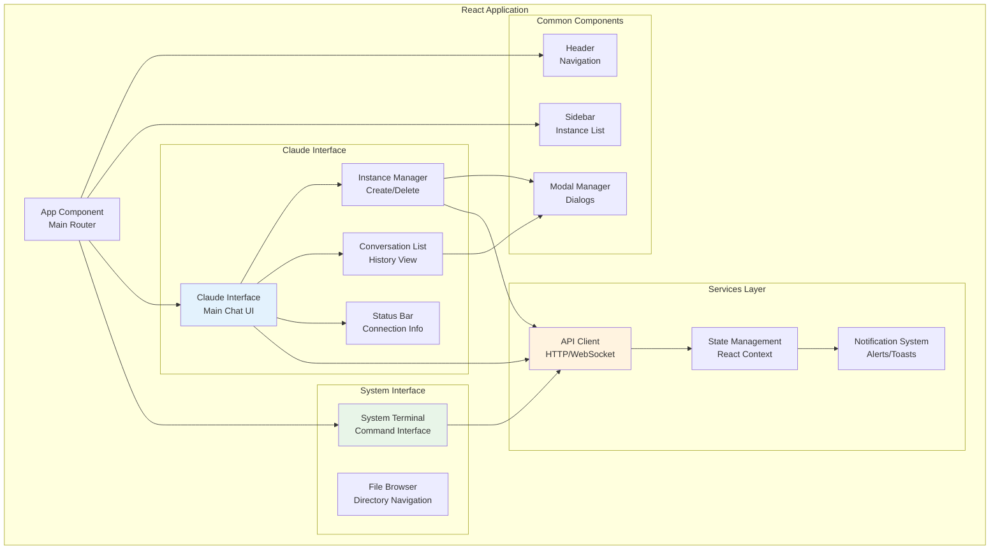
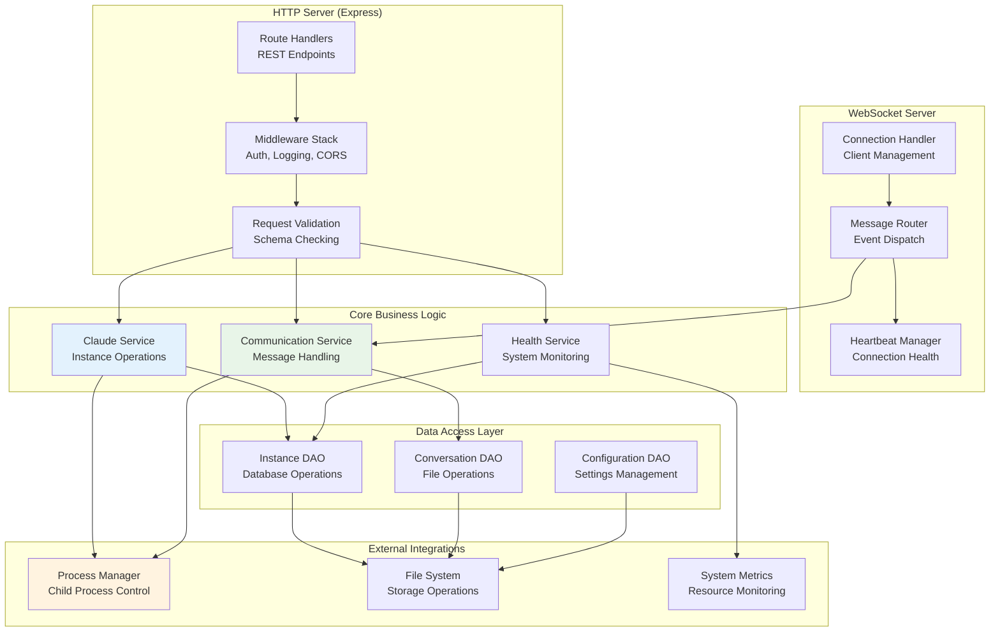
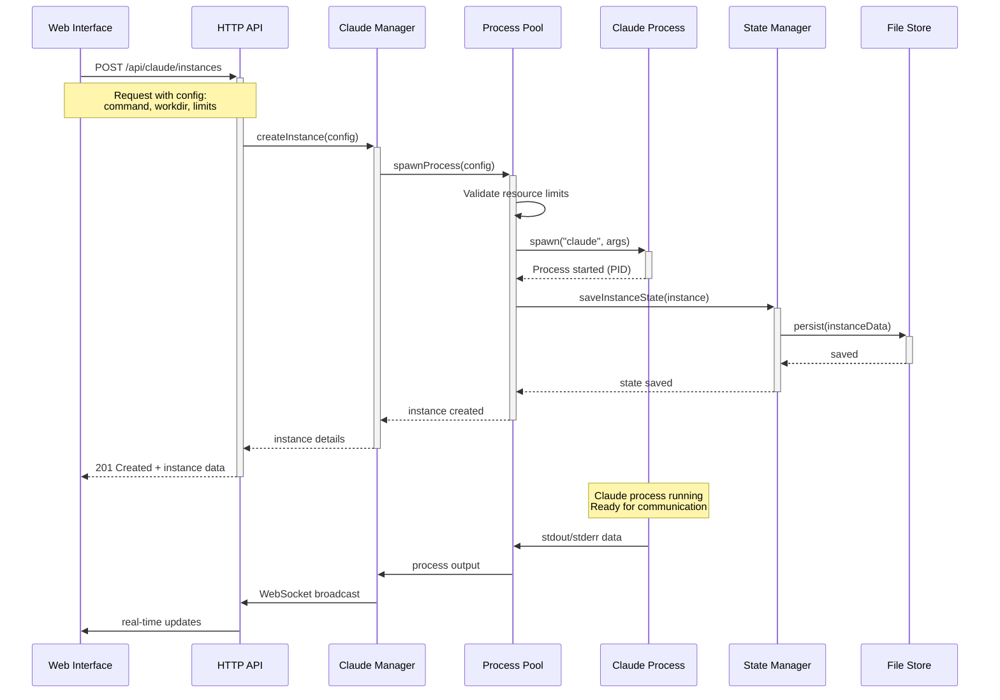
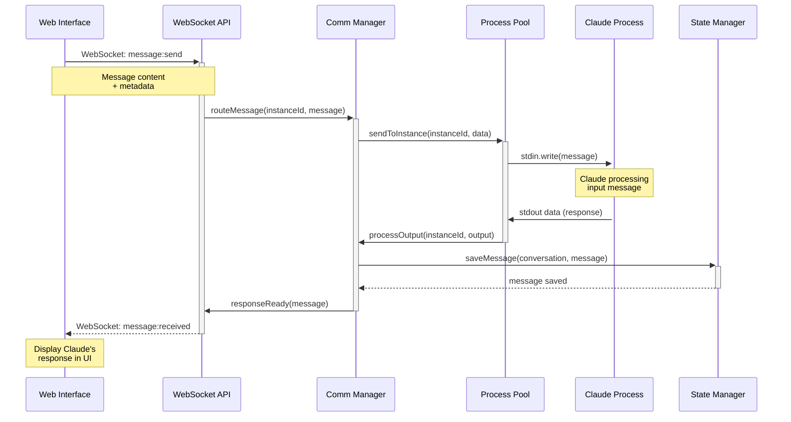
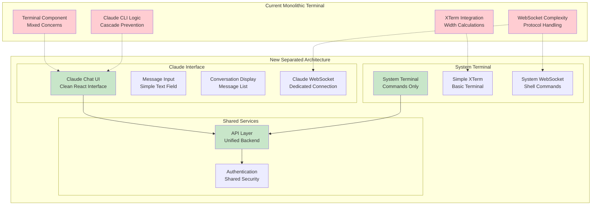
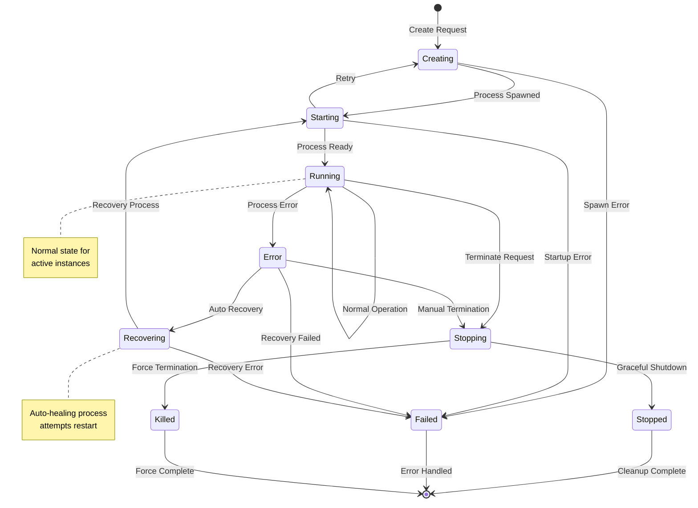
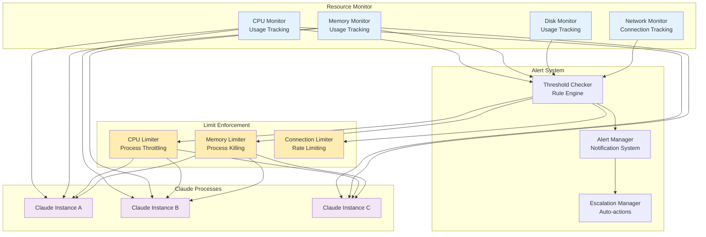
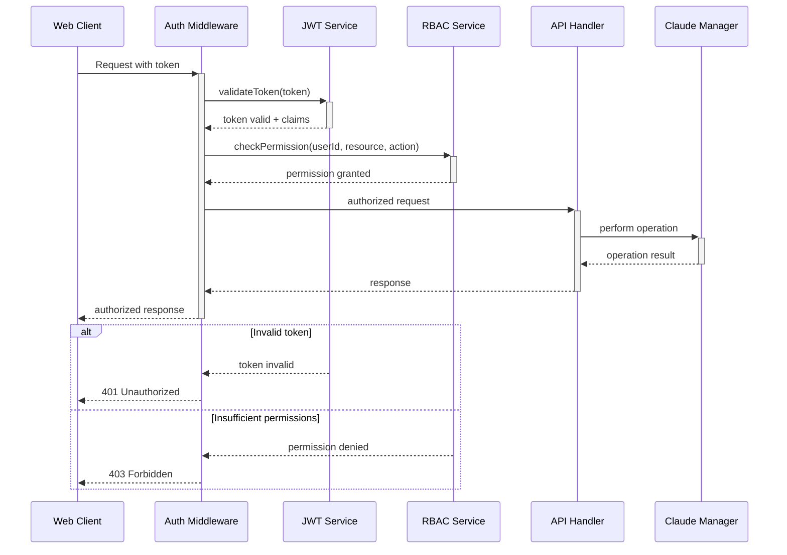
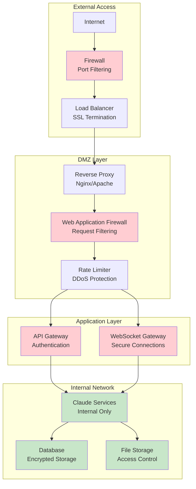

# Claude Instances System - Component Diagrams & Data Flow

## System Architecture Overview



## Detailed Component Architecture

### 1. Web Interface Component Structure



### 2. Backend Service Architecture



## Data Flow Diagrams

### 3. Instance Creation Flow



### 4. Message Communication Flow



### 5. Instance Health Monitoring Flow

```mermaid
sequenceDiagram
    participant HM as Health Monitor
    participant CP as Claude Process
    participant RM as Recovery Manager
    participant PP as Process Pool
    participant API as WebSocket API
    participant UI as Web Interface
    
    loop Every 5 seconds
        HM->>+CP: Check process health
        alt Process healthy
            CP-->>-HM: Health metrics
            HM->>API: Broadcast health update
        else Process unresponsive
            CP-->>-HM: No response/error
            HM->>+RM: initiateRecovery(instanceId)
            
            RM->>+PP: terminateInstance(instanceId)
            PP->>CP: SIGTERM
            Note over CP: Graceful shutdown
            PP-->>-RM: Process terminated
            
            RM->>+PP: recreateInstance(config)
            PP-->>-RM: New instance created
            
            RM-->>-HM: Recovery complete
            HM->>API: Broadcast recovery status
        end
        
        API->>UI: Real-time health updates
    end
```

### 6. System Terminal Separation



## Process Lifecycle Management

### 7. Instance Lifecycle State Machine



### 8. Resource Management Architecture



## Security Architecture

### 9. Authentication & Authorization Flow



### 10. Network Security Architecture



This comprehensive component architecture provides clear separation of concerns, scalable design patterns, and robust security measures for the dedicated Claude instances system. Each diagram shows specific aspects of the system's design, from high-level overview to detailed process flows and security considerations.