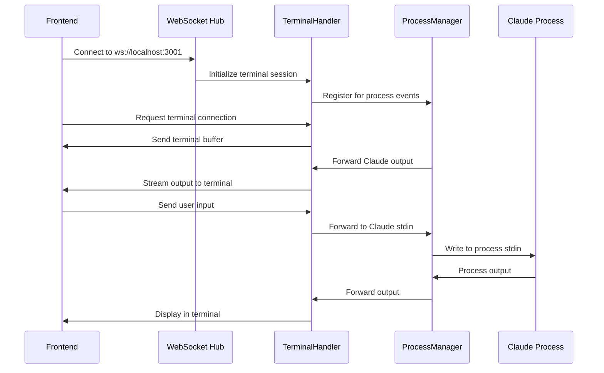
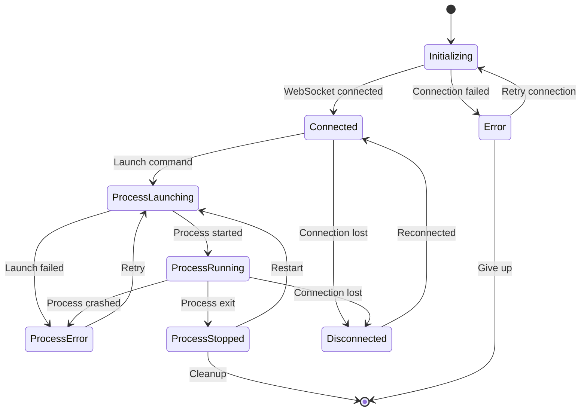

# Terminal Component Integration Architecture Specification

## Executive Summary

This document specifies the technical architecture for integrating a terminal component into the SimpleLauncher system, enabling direct interaction with Claude processes through a browser-based terminal interface. The architecture leverages existing WebSocket infrastructure and ProcessManager services to provide real-time bidirectional communication.

## 1. Component Structure & Integration

### 1.1 System Architecture Overview

```
┌─────────────────────────────────────────────────────────────────┐
│                    Frontend Layer                               │
├─────────────────────────────────────────────────────────────────┤
│  ┌─────────────────┐  ┌─────────────────┐  ┌─────────────────┐  │
│  │  EnhancedAgent  │  │   SimpleLauncher │  │  TerminalPanel  │  │
│  │    Manager      │  │     Component   │  │   Component     │  │
│  └─────────────────┘  └─────────────────┘  └─────────────────┘  │
│           │                      │                      │       │
│           └──────────────────────┼──────────────────────┘       │
│                                  │                              │
├─────────────────────────────────────────────────────────────────┤
│                WebSocket Layer (Socket.IO)                     │
├─────────────────────────────────────────────────────────────────┤
│                    Backend Layer                               │
├─────────────────────────────────────────────────────────────────┤
│  ┌─────────────────┐  ┌─────────────────┐  ┌─────────────────┐  │
│  │  TerminalWebSocket│ │  ProcessManager │  │ SimpleProcessMgr│  │
│  │    Handler      │  │    Service      │  │    Service      │  │
│  └─────────────────┘  └─────────────────┘  └─────────────────┘  │
│           │                      │                      │       │
│           └──────────────────────┼──────────────────────┘       │
│                                  │                              │
├─────────────────────────────────────────────────────────────────┤
│                  Process Layer                                  │
├─────────────────────────────────────────────────────────────────┤
│  ┌─────────────────┐  ┌─────────────────┐  ┌─────────────────┐  │
│  │   Claude CLI    │  │   Terminal PTY  │  │   File System   │  │
│  │    Process      │  │    Session      │  │    Operations   │  │
│  └─────────────────┘  └─────────────────┘  └─────────────────┘  │
└─────────────────────────────────────────────────────────────────┘
```

### 1.2 Component Integration Points

#### 1.2.1 Frontend Integration
- **Location**: `/frontend/src/components/TerminalPanel.tsx`
- **Parent**: EnhancedAgentManager component
- **Dependencies**: 
  - `useWebSocketSingleton` hook
  - `connection-manager` service
  - `xterm.js` library for terminal rendering

#### 1.2.2 Backend Integration
- **Location**: `/src/websocket/TerminalWebSocket.ts` (existing)
- **Enhancement**: Integrate with SimpleProcessManager
- **Dependencies**:
  - `ProcessManager` service
  - `node-pty` for terminal sessions
  - Socket.IO server

## 2. WebSocket Communication Flow

### 2.1 Connection Architecture



### 2.2 Message Protocol Specification

#### 2.2.1 Frontend to Backend Messages

```typescript
interface TerminalInputMessage {
  type: 'terminal:input';
  data: string;
  sessionId: string;
  timestamp: string;
}

interface TerminalCommandMessage {
  type: 'terminal:command';
  command: string;
  sessionId: string;
  userId?: string;
}

interface TerminalResizeMessage {
  type: 'terminal:resize';
  cols: number;
  rows: number;
  sessionId: string;
}

interface ProcessControlMessage {
  type: 'process:launch' | 'process:kill' | 'process:restart';
  config?: ProcessConfig;
  sessionId: string;
}
```

#### 2.2.2 Backend to Frontend Messages

```typescript
interface TerminalOutputMessage {
  type: 'terminal:output';
  data: string;
  outputType: 'stdout' | 'stderr';
  sessionId: string;
  timestamp: string;
}

interface ProcessStatusMessage {
  type: 'process:status';
  status: 'running' | 'stopped' | 'error' | 'starting';
  pid?: number;
  name: string;
  uptime?: number;
}

interface TerminalBufferMessage {
  type: 'terminal:buffer';
  buffer: string;
  sessionId: string;
  lineCount: number;
}
```

## 3. Process I/O Streaming Architecture

### 3.1 Stream Management

```typescript
interface ProcessIOStream {
  stdin: NodeJS.WritableStream;
  stdout: NodeJS.ReadableStream;
  stderr: NodeJS.ReadableStream;
  pty?: pty.IPty;
}

class TerminalIOManager {
  private streams: Map<string, ProcessIOStream> = new Map();
  private buffers: Map<string, CircularBuffer> = new Map();
  
  attachProcess(sessionId: string, process: ChildProcess): void;
  detachProcess(sessionId: string): void;
  writeToProcess(sessionId: string, data: string): void;
  getBuffer(sessionId: string): string[];
  clearBuffer(sessionId: string): void;
}
```

### 3.2 Buffer Management Strategy

- **Circular Buffer**: 1000 lines per session
- **Persistence**: Session buffers survive reconnections
- **Overflow**: FIFO (First In, First Out) when buffer is full
- **Encoding**: UTF-8 with proper handling of ANSI escape sequences

### 3.3 PTY Integration

```typescript
interface PTYConfiguration {
  name: string;        // 'xterm-color'
  cols: number;        // 80 default
  rows: number;        // 30 default
  cwd: string;         // Working directory
  env: Record<string, string>;
  shell: string;       // bash/powershell based on platform
}

class TerminalPTYSession {
  private pty: pty.IPty;
  private sessionId: string;
  private sockets: Set<string>;
  
  constructor(config: PTYConfiguration);
  write(data: string): void;
  resize(cols: number, rows: number): void;
  kill(): void;
  addSocket(socketId: string): void;
  removeSocket(socketId: string): void;
}
```

## 4. State Management Architecture

### 4.1 Frontend State Structure

```typescript
interface TerminalState {
  isConnected: boolean;
  sessionId: string;
  processStatus: ProcessStatus;
  connectionError: string | null;
  terminalBuffer: string[];
  currentDirectory: string;
  commandHistory: string[];
  isLoading: boolean;
}

interface ProcessStatus {
  status: 'running' | 'stopped' | 'error' | 'starting';
  pid?: number;
  name: string;
  startTime?: Date;
  uptime: number;
  memoryUsage?: number;
  cpuUsage?: number;
}
```

### 4.2 State Management Hook

```typescript
interface UseTerminalReturn {
  // Connection state
  isConnected: boolean;
  connectionError: string | null;
  
  // Process state
  processStatus: ProcessStatus;
  
  // Terminal state
  terminalRef: React.RefObject<Terminal>;
  terminalBuffer: string[];
  
  // Actions
  sendInput: (input: string) => void;
  sendCommand: (command: string) => void;
  resizeTerminal: (cols: number, rows: number) => void;
  launchProcess: (config?: ProcessConfig) => Promise<void>;
  killProcess: () => Promise<void>;
  restartProcess: () => Promise<void>;
  clearTerminal: () => void;
  
  // Event handlers
  onProcessOutput: (handler: (data: string) => void) => void;
  onProcessStatusChange: (handler: (status: ProcessStatus) => void) => void;
}

const useTerminal = (options?: TerminalOptions): UseTerminalReturn;
```

### 4.3 Context Provider Architecture

```typescript
interface TerminalContextValue {
  terminalState: TerminalState;
  actions: TerminalActions;
  websocket: Socket | null;
}

const TerminalContext = React.createContext<TerminalContextValue | null>(null);

const TerminalProvider: React.FC<{ children: React.ReactNode }> = ({ children }) => {
  // Implementation using useReducer and WebSocket management
};
```

## 5. Error Handling & Reconnection Logic

### 5.1 Error Classification

```typescript
enum TerminalErrorType {
  CONNECTION_LOST = 'connection_lost',
  PROCESS_CRASHED = 'process_crashed',
  AUTHENTICATION_FAILED = 'auth_failed',
  PERMISSION_DENIED = 'permission_denied',
  RESOURCE_EXHAUSTED = 'resource_exhausted',
  PROTOCOL_ERROR = 'protocol_error'
}

interface TerminalError {
  type: TerminalErrorType;
  message: string;
  recoverable: boolean;
  code?: string;
  details?: any;
  timestamp: Date;
}
```

### 5.2 Reconnection Strategy

```typescript
interface ReconnectionConfig {
  maxAttempts: number;          // 10
  baseDelay: number;            // 1000ms
  maxDelay: number;             // 30000ms
  exponentialBackoff: boolean;  // true
  jitter: boolean;              // true
}

class TerminalReconnectionManager {
  private config: ReconnectionConfig;
  private currentAttempt: number = 0;
  private reconnectionTimer: NodeJS.Timeout | null = null;
  
  scheduleReconnection(): void;
  cancelReconnection(): void;
  reset(): void;
  shouldReconnect(error: TerminalError): boolean;
  getDelay(): number;
}
```

### 5.3 Error Recovery Procedures

1. **Connection Lost**:
   - Attempt immediate reconnection
   - Preserve terminal buffer
   - Show connection status indicator
   - Retry with exponential backoff

2. **Process Crashed**:
   - Display crash notification
   - Offer restart option
   - Preserve terminal history
   - Log crash details

3. **Permission Denied**:
   - Show authentication prompt
   - Guide user to permission settings
   - Offer alternative access methods

## 6. Terminal Lifecycle Management

### 6.1 Session Lifecycle



### 6.2 Lifecycle Hook Implementation

```typescript
class TerminalSessionManager {
  private sessions: Map<string, TerminalSession> = new Map();
  
  // Session management
  createSession(config: TerminalConfig): TerminalSession;
  destroySession(sessionId: string): void;
  getSession(sessionId: string): TerminalSession | null;
  
  // Lifecycle events
  onSessionCreated(handler: (session: TerminalSession) => void): void;
  onSessionDestroyed(handler: (sessionId: string) => void): void;
  onProcessAttached(handler: (sessionId: string, process: ChildProcess) => void): void;
  onProcessDetached(handler: (sessionId: string) => void): void;
  
  // Cleanup
  cleanup(): void;
}
```

### 6.3 Resource Management

- **Memory Management**: Implement buffer limits and garbage collection
- **File Handle Management**: Proper cleanup of PTY and process handles  
- **Connection Management**: Limit concurrent sessions per user
- **CPU Management**: Process monitoring and resource limits

## 7. Integration Points with Existing Systems

### 7.1 SimpleLauncher Integration

```typescript
// Enhanced SimpleLauncher component
const SimpleLauncher: React.FC = () => {
  const [showTerminal, setShowTerminal] = useState(false);
  const { processStatus } = useTerminal();
  
  return (
    <div className="simple-launcher">
      <LauncherControls 
        onToggleTerminal={() => setShowTerminal(!showTerminal)}
        processStatus={processStatus}
      />
      
      {showTerminal && (
        <TerminalPanel 
          onClose={() => setShowTerminal(false)}
          integrated={true}
        />
      )}
    </div>
  );
};
```

### 7.2 ProcessManager Enhancement

```typescript
// Enhanced ProcessManager with terminal integration
export class ProcessManager extends EventEmitter {
  private terminalHandler: TerminalWebSocket | null = null;
  
  setTerminalHandler(handler: TerminalWebSocket): void {
    this.terminalHandler = handler;
    this.setupTerminalIntegration();
  }
  
  private setupTerminalIntegration(): void {
    // Forward stdout/stderr to terminal
    this.on('terminal:output', (data) => {
      this.terminalHandler?.broadcastOutput(data);
    });
    
    // Handle terminal input
    this.terminalHandler?.on('input', (data) => {
      this.sendInput(data);
    });
  }
}
```

### 7.3 WebSocket Hub Integration

```typescript
// Integration with existing WebSocket infrastructure
export class WebSocketTerminalIntegration {
  constructor(
    private connectionManager: WebSocketConnectionManager,
    private terminalHandler: TerminalWebSocket
  ) {}
  
  initialize(): void {
    // Use existing connection manager for WebSocket connectivity
    const socket = this.connectionManager.getSocket();
    if (socket) {
      this.terminalHandler.handleConnection(socket);
    }
    
    // Listen for connection events
    this.connectionManager.on('connected', (event) => {
      this.terminalHandler.handleConnection(event.socket);
    });
  }
}
```

## 8. Security Considerations

### 8.1 Authentication & Authorization

```typescript
interface TerminalSecurityConfig {
  requireAuthentication: boolean;
  allowedCommands: string[];
  restrictedDirectories: string[];
  maxSessionDuration: number;
  commandLogging: boolean;
  fileSystemAccess: 'read-only' | 'restricted' | 'full';
}

class TerminalSecurityManager {
  private config: TerminalSecurityConfig;
  
  validateCommand(command: string): boolean;
  validateDirectoryAccess(path: string): boolean;
  logCommand(userId: string, command: string): void;
  enforceSessionTimeout(sessionId: string): void;
}
```

### 8.2 Input Sanitization

- **Command Injection Prevention**: Whitelist allowed commands
- **Path Traversal Protection**: Restrict directory access
- **Resource Limits**: CPU, memory, and file handle limits
- **Audit Logging**: Log all commands and file operations

## 9. Performance Optimization

### 9.1 Streaming Optimization

- **Chunked Output**: Stream large outputs in manageable chunks
- **Compression**: Use gzip compression for large data transfers
- **Throttling**: Rate limit rapid output to prevent UI blocking
- **Selective Updates**: Only update visible terminal areas

### 9.2 Memory Management

```typescript
interface PerformanceMetrics {
  memoryUsage: number;
  connectionCount: number;
  messageRate: number;
  bufferSize: number;
  latency: number;
}

class TerminalPerformanceMonitor {
  private metrics: PerformanceMetrics;
  
  startMonitoring(): void;
  stopMonitoring(): void;
  getMetrics(): PerformanceMetrics;
  optimizeBuffers(): void;
  cleanupInactiveSessions(): void;
}
```

## 10. Testing Strategy

### 10.1 Unit Testing

```typescript
// Terminal component unit tests
describe('TerminalPanel', () => {
  test('should render terminal interface');
  test('should handle user input correctly');
  test('should display process output');
  test('should handle connection errors gracefully');
});

// WebSocket handler tests
describe('TerminalWebSocket', () => {
  test('should establish terminal session');
  test('should forward process output');
  test('should handle multiple connections');
  test('should cleanup resources on disconnect');
});
```

### 10.2 Integration Testing

```typescript
// End-to-end terminal workflow tests
describe('Terminal Integration', () => {
  test('should launch Claude process via terminal');
  test('should execute commands and receive output');
  test('should handle process restart scenarios');
  test('should maintain session across reconnections');
});
```

### 10.3 Performance Testing

- **Load Testing**: Multiple concurrent terminal sessions
- **Stress Testing**: High-volume output streaming
- **Memory Testing**: Long-running session memory usage
- **Latency Testing**: Input-to-output response times

## 11. Deployment Considerations

### 11.1 Environment Configuration

```typescript
interface TerminalDeploymentConfig {
  websocketPort: number;
  terminalSessionTimeout: number;
  maxConcurrentSessions: number;
  bufferSizeLimit: number;
  logLevel: 'debug' | 'info' | 'warn' | 'error';
  securityMode: 'development' | 'production';
}
```

### 11.2 Monitoring & Observability

- **Metrics Collection**: Session count, error rates, latency
- **Health Checks**: Terminal service availability
- **Log Aggregation**: Centralized logging for debugging
- **Alerting**: Automated alerts for service degradation

## 12. Future Enhancement Opportunities

### 12.1 Advanced Features

- **Multi-tab Terminal**: Support multiple terminal sessions
- **File Browser Integration**: Browse and edit files in terminal
- **Theme Customization**: Terminal color schemes and fonts
- **Command Completion**: Intelligent command suggestions
- **History Search**: Searchable command history

### 12.2 Scalability Enhancements

- **Horizontal Scaling**: Distribute terminal sessions across servers
- **Load Balancing**: Balance terminal connections across instances
- **Persistent Sessions**: Survive server restarts and deployments
- **Cloud Integration**: AWS/GCP terminal service integration

## Conclusion

This specification provides a comprehensive architecture for integrating terminal functionality into the SimpleLauncher system. The design leverages existing infrastructure while providing robust error handling, performance optimization, and security features. The modular approach ensures maintainability and allows for future enhancements as requirements evolve.

## Implementation Priority

1. **Phase 1**: Basic terminal component with WebSocket integration
2. **Phase 2**: Process management integration and state synchronization  
3. **Phase 3**: Error handling and reconnection logic
4. **Phase 4**: Performance optimization and security hardening
5. **Phase 5**: Advanced features and scalability enhancements