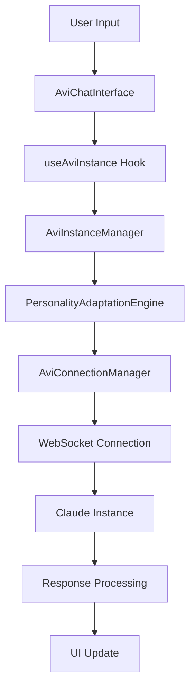
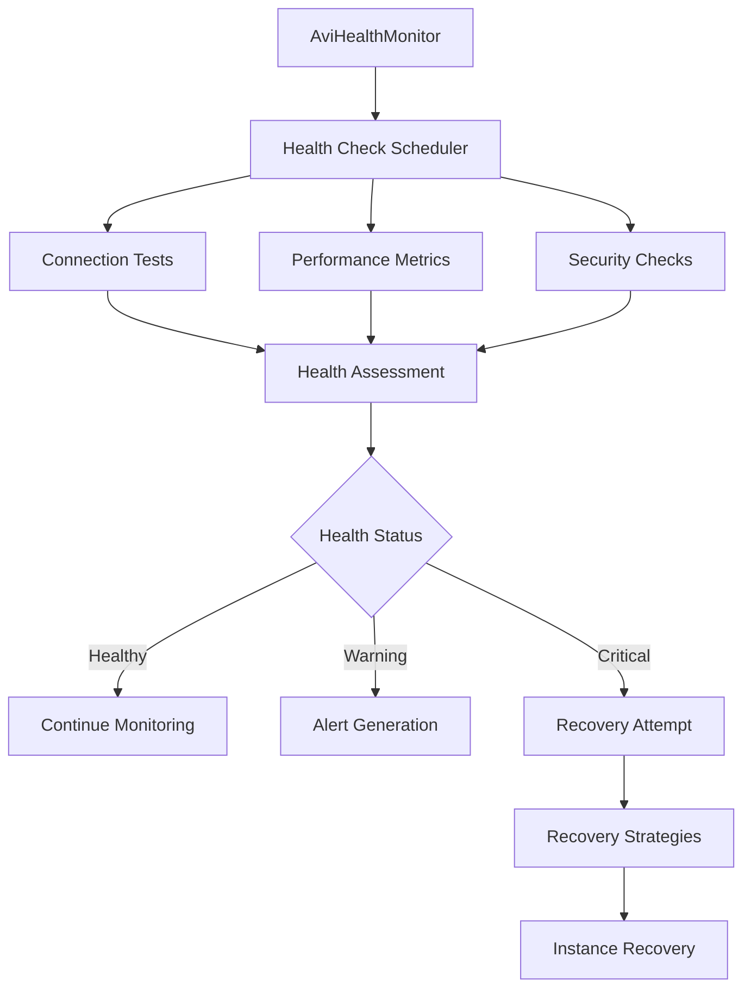
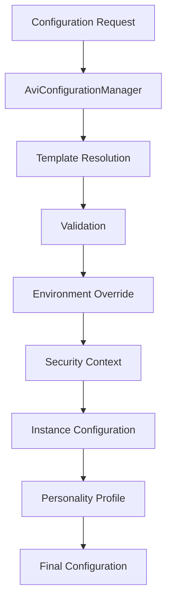

# Avi DM Integration - System Architecture

## Overview

The Avi Direct Message (DM) Integration system provides a specialized Claude Code instance connection system designed for seamless AI-powered direct message interactions. This architecture document outlines the comprehensive design, components, and integration patterns.

## Architecture Principles

### SPARC Methodology Compliance
- **S**pecification: Clear, detailed interface definitions and requirements
- **P**seudocode: Algorithm-based implementation patterns
- **A**rchitecture: Robust, scalable system design
- **R**efinement: Iterative improvement and optimization
- **C**ompletion: Full integration with existing Claude instance ecosystem

### Design Goals
1. **Seamless Integration**: Works within existing Claude instance management
2. **Personality Adaptation**: Dynamic personality modes for different conversation contexts
3. **Reliability**: Robust connection management with failover and recovery
4. **Performance**: Optimized for real-time messaging requirements
5. **Security**: Enhanced privacy and encryption for sensitive communications
6. **Scalability**: Supports multiple concurrent Avi instances

## System Components

### Core Services

#### 1. AviInstanceManager
**Location**: `frontend/src/services/AviInstanceManager.ts`

The central orchestrator for Avi instance lifecycle management.

**Key Responsibilities**:
- Instance creation and destruction
- Message handling and routing
- Personality adaptation engine
- Conversation context management
- Security context enforcement

**Architecture Pattern**: Event-driven service with pluggable components

```typescript
class AviInstanceManager extends EventEmitter {
  // Core components
  private adaptationEngine: PersonalityAdaptationEngine
  private metricsCollector: ConversationMetricsCollector
  private securityManager: SecurityContextManager
  private encryptionHandler: EncryptionHandler

  // Instance lifecycle
  async createInstance(config: AviInstanceConfig): Promise<AviInstance>
  async sendMessage(message: string, options?: AviMessageOptions): Promise<AviMessage>
  async destroyInstance(): Promise<void>
}
```

#### 2. AviHealthMonitor
**Location**: `frontend/src/services/AviHealthMonitor.ts`

Advanced health monitoring and recovery system for Avi instances.

**Key Features**:
- Real-time health status monitoring
- Predictive failure detection
- Automatic recovery strategies
- Performance metrics collection
- Anomaly detection and alerting

**Architecture Pattern**: Observer pattern with strategy-based recovery

```typescript
class AviHealthMonitor extends EventEmitter {
  // Health assessment
  private performHealthCheck(): Promise<void>
  private collectMetrics(): void
  private performPredictiveAnalysis(): Promise<void>

  // Recovery system
  async attemptRecovery(strategy?: string): Promise<boolean>
  private recoveryStrategies: Map<string, RecoveryStrategy>
}
```

#### 3. AviConnectionManager
**Location**: `frontend/src/services/AviConnectionManager.ts`

WebSocket connection management with advanced reliability features.

**Key Features**:
- Primary/fallback connection pooling
- Exponential backoff reconnection
- Message queuing and reliability
- Connection quality assessment
- Protocol-specific message handling

**Architecture Pattern**: Connection pool with failover management

```typescript
class AviConnectionManager extends EventEmitter {
  // Connection management
  private connectionPool: {
    primary: WebSocket | null
    fallback: WebSocket | null
    activeConnection: 'primary' | 'fallback' | null
  }

  // Message reliability
  private messageQueue: Map<string, QueuedMessage>
  private processMessageQueue(): void
}
```

#### 4. AviConfigurationManager
**Location**: `frontend/src/services/AviConfigurationManager.ts`

Centralized configuration management system.

**Key Features**:
- Environment-based configuration loading
- Personality profile management
- Configuration templates and schemas
- Secure configuration storage
- Configuration validation and migration

**Architecture Pattern**: Factory pattern with template system

```typescript
class AviConfigurationManager extends EventEmitter {
  // Configuration management
  private personalityProfiles: Map<string, AviPersonalityProfile>
  private configurationTemplates: Map<string, ConfigurationTemplate>
  private validator: ConfigurationValidator
}
```

### React Integration Layer

#### 1. useAviInstance Hook
**Location**: `frontend/src/hooks/useAviInstance.ts`

React hook providing complete Avi instance management capabilities.

**Key Features**:
- Instance lifecycle management
- Real-time status updates
- Message handling
- Health monitoring integration
- Event-based state updates

**Usage Pattern**:
```typescript
const {
  instance,
  isConnected,
  sendMessage,
  setPersonalityMode,
  getHealthStatus
} = useAviInstance(config, options);
```

#### 2. AviChatInterface Component
**Location**: `frontend/src/components/avi-integration/AviChatInterface.tsx`

Specialized chat interface for Avi interactions.

**Key Features**:
- Personality mode visualization
- Adaptive UI based on conversation context
- Message formatting and rendering
- Image upload support
- Voice input integration (optional)
- Real-time typing indicators

### Type System

#### Core Types
**Location**: `frontend/src/types/avi-integration.ts`

Comprehensive type definitions covering all Avi-specific functionality:

- `AviInstance`: Extended Claude instance with DM-specific properties
- `AviMessage`: Enhanced message type with metadata and adaptation context
- `AviPersonalityMode`: Enum of supported personality types
- `AviHealthStatus`: Health monitoring data structure
- `AviConfigurationTemplate`: Reusable configuration patterns

## Data Flow Architecture

### Message Flow


### Health Monitoring Flow


### Configuration Management Flow


## Integration Patterns

### Existing Claude Instance Integration

The Avi system seamlessly integrates with the existing Claude instance management:

1. **Type Extension**: Avi types extend base Claude types
2. **Hook Composition**: `useAviInstance` builds upon `useClaudeInstances`
3. **Service Layer**: Avi services implement existing interfaces
4. **Component Compatibility**: Avi components work with existing UI patterns

### WebSocket Integration

Avi instances use the existing WebSocket infrastructure with extensions:

1. **Protocol Extension**: Avi-specific message types and handlers
2. **Connection Pooling**: Enhanced reliability with fallback connections
3. **Message Queuing**: Reliable delivery with retry mechanisms
4. **Health Monitoring**: Connection quality assessment and optimization

## Security Architecture

### Multi-Layer Security Model

1. **Transport Layer**: TLS/WSS encryption for all connections
2. **Application Layer**: End-to-end encryption for sensitive messages
3. **Session Management**: Secure token handling with rotation
4. **Content Filtering**: Configurable content validation and filtering
5. **Audit Logging**: Comprehensive activity logging for compliance

### Privacy Controls

- **Data Retention Policies**: Configurable message retention periods
- **Privacy Levels**: Standard, Enhanced, Maximum privacy modes
- **Content Anonymization**: Optional PII removal and anonymization
- **Secure Storage**: Encrypted storage for persistent data

## Performance Optimization

### Connection Management
- Connection pooling with primary/fallback redundancy
- Adaptive retry strategies with exponential backoff
- Connection quality monitoring and optimization
- Protocol-level compression and optimization

### Message Processing
- Asynchronous message handling with queuing
- Batch processing for multiple messages
- Intelligent message prioritization
- Response caching for common queries

### Resource Management
- Memory-efficient conversation context management
- Automatic cleanup of expired sessions
- Resource usage monitoring and alerts
- Garbage collection optimization

## Monitoring and Observability

### Health Metrics
- Connection latency and stability
- Message processing rates
- Error rates and types
- Resource utilization

### Business Metrics
- Conversation engagement levels
- Personality adaptation effectiveness
- User satisfaction scores
- Feature usage analytics

### Alerting System
- Real-time health alerts
- Performance degradation warnings
- Security incident notifications
- Capacity planning alerts

## Scalability Considerations

### Horizontal Scaling
- Multiple Avi instance support
- Load balancing across connections
- Resource sharing and optimization
- Distributed health monitoring

### Performance Scaling
- Adaptive connection pooling
- Dynamic resource allocation
- Predictive scaling based on usage patterns
- Caching and optimization strategies

## Development and Testing

### Testing Strategy
- **Unit Tests**: Comprehensive service and component testing
- **Integration Tests**: End-to-end conversation flow testing
- **Performance Tests**: Load and stress testing
- **Security Tests**: Vulnerability and penetration testing

### Development Workflow
- **SPARC Methodology**: Specification-driven development
- **TypeScript-First**: Strong typing for reliability
- **Event-Driven Testing**: Comprehensive event system testing
- **Continuous Integration**: Automated testing and deployment

## Future Enhancements

### Planned Features
- Voice input/output integration
- Multi-language personality profiles
- Advanced analytics and insights
- AI-powered conversation optimization
- Integration with external messaging platforms

### Scalability Improvements
- Microservices architecture migration
- Container-based deployment
- Advanced caching strategies
- Machine learning-powered optimizations

## Implementation Guidelines

### Adding New Personality Modes
1. Define personality profile in `AviConfigurationManager`
2. Implement adaptation rules in `PersonalityAdaptationEngine`
3. Add UI components for mode selection
4. Update type definitions and validation
5. Add comprehensive tests

### Extending Health Monitoring
1. Define new health metrics in `AviHealthMonitor`
2. Implement collection and analysis logic
3. Add recovery strategies for new failure modes
4. Update diagnostic reporting
5. Add alerting and notification support

### Configuration Management
1. Define configuration schema
2. Implement validation logic
3. Add migration support for schema changes
4. Update UI for configuration management
5. Add export/import functionality

This architecture provides a robust, scalable, and maintainable foundation for Avi DM integration while seamlessly integrating with the existing Claude instance management system.