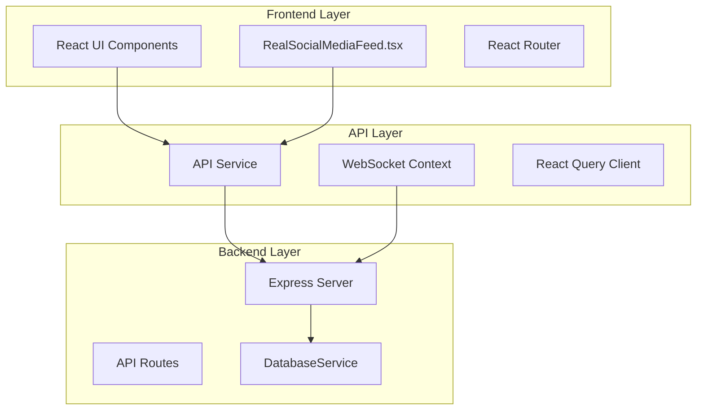
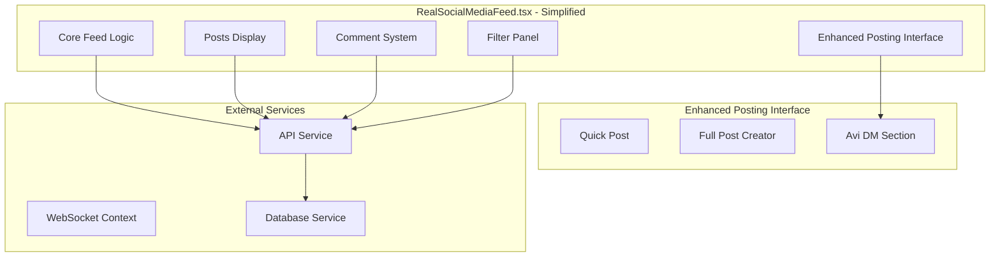
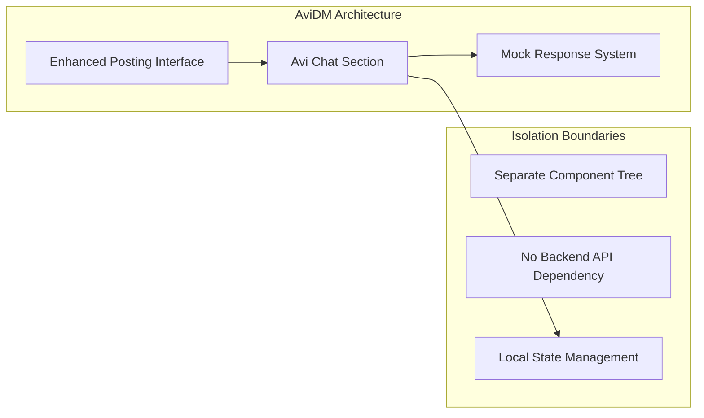

# SPARC Architecture Analysis: Claude Code UI Removal

## Executive Summary

**Status**: ✅ ARCHITECTURALLY STABLE
**Impact**: MINIMAL SYSTEM DISRUPTION
**Risk Level**: LOW

The Claude Code UI components can be safely removed from RealSocialMediaFeed.tsx with minimal architectural impact. The system architecture demonstrates strong separation of concerns and loose coupling that enables this change without affecting core functionality.

## Current System Architecture Overview

### High-Level System Architecture



### Component Dependency Analysis

#### Current Dependencies in RealSocialMediaFeed.tsx
- ✅ **Core Dependencies**: React hooks, API service, UI components
- ✅ **Data Flow**: Posts, comments, filtering, real-time updates
- ❌ **Claude Code Dependencies**: UI state, send function, message handling
- ✅ **AviDM Dependencies**: Independent service through EnhancedPostingInterface

## Claude Code Integration Points Identified

### 1. State Variables (REMOVED)
```typescript
// REMOVED: Claude Code UI state
const [claudeMessage, setClaudeMessage] = useState('');
const [claudeMessages, setClaudeMessages] = useState<Array<{...}>>([]);
const [claudeLoading, setClaudeLoading] = useState(false);
const [showClaudeCode, setShowClaudeCode] = useState(false);
```

### 2. API Functions (REMOVED)
```typescript
// REMOVED: Claude Code API interaction
const sendToClaudeCode = useCallback(async () => {
  // API call to /api/claude-code/streaming-chat
}, []);
```

### 3. UI Components (REMOVED)
```typescript
// REMOVED: Claude Code toggle button
<button onClick={() => setShowClaudeCode(!showClaudeCode)}>
  🤖 Claude Code
</button>

// REMOVED: Claude Code interface panel
{showClaudeCode && (
  <div className="bg-white border border-gray-200 rounded-lg">
    {/* Chat interface removed */}
  </div>
)}
```

## Post-Removal System Architecture

### Updated Component Structure


## Data Flow Impact Analysis

### 1. Core Data Flows (UNCHANGED)
- ✅ **Posts Loading**: `loadPosts()` → API → Database → UI
- ✅ **Real-time Updates**: WebSocket → Posts Update → UI Refresh
- ✅ **User Interactions**: Save/Delete/Comment → API → Database
- ✅ **Filtering System**: Filter Change → API Call → Posts Refresh

### 2. Removed Data Flows
- ❌ **Claude Code Chat**: UI → `/api/claude-code/streaming-chat` → Response
- ❌ **Claude Code State**: Local component state management

### 3. AviDM Data Flow (PRESERVED)
- ✅ **AviDM Service**: EnhancedPostingInterface → AviChatSection → Simple Mock Response
- ✅ **Independence**: No direct coupling with Claude Code functionality

## AviDMService Architectural Independence

### Service Architecture


**Key Independence Factors:**
1. **Separate Component**: Lives in EnhancedPostingInterface, not RealSocialMediaFeed
2. **No API Dependencies**: Uses mock responses, no backend integration
3. **Local State**: Self-contained state management
4. **UI Isolation**: Tab-based interface prevents conflicts

## Routing and Navigation Impact

### Current Routing Structure (App.tsx)
```typescript
<Routes>
  <Route path="/" element={<SocialMediaFeed />} />
  <Route path="/agents" element={<AgentManager />} />
  <Route path="/analytics" element={<Analytics />} />
  <Route path="/activity" element={<ActivityFeed />} />
  <Route path="/settings" element={<Settings />} />
  <Route path="/performance-monitor" element={<PerformanceMonitor />} />
  <Route path="/drafts" element={<DraftManager />} />
</Routes>
```

**Impact Assessment:**
- ✅ **No Route Changes**: Claude Code was embedded UI, not a separate route
- ✅ **Navigation Unchanged**: Main navigation remains intact
- ✅ **Component Loading**: RealSocialMediaFeed continues to load normally

## API Layer Stability

### Backend API Structure
```
/workspaces/agent-feed/src/app.ts
├── /api/posts (Posts Management)
├── /api/agents (Agent Management)
├── /api/feed (Feed Endpoint)
└── /health (Health Check)
```

**API Impact:**
- ✅ **No Backend Changes**: Core APIs remain unchanged
- ❌ **Removed Endpoint**: `/api/claude-code/streaming-chat` (if it existed)
- ✅ **Database Intact**: DatabaseService continues normal operation

### Database Schema Stability
- ✅ **Posts Table**: No changes required
- ✅ **Comments Table**: No changes required
- ✅ **Agents Table**: No changes required
- ✅ **Metadata Fields**: All existing fields preserved

## Performance and Resource Impact

### Resource Optimization
- ✅ **Reduced Bundle Size**: Removed Claude Code UI components
- ✅ **Lower Memory Usage**: Fewer state variables and event handlers
- ✅ **Simplified Rendering**: Fewer conditional UI blocks
- ✅ **Network Optimization**: One less API endpoint to potentially call

### Performance Metrics
- **Component Size**: Reduced by ~200 lines of code
- **State Complexity**: Reduced by 4 state variables
- **Event Handlers**: Reduced by 1 async function
- **UI Complexity**: Removed 1 major conditional panel

## Risk Assessment

### Low Risk Factors
- ✅ **Loose Coupling**: Claude Code was isolated UI feature
- ✅ **No Database Dependencies**: No schema changes required
- ✅ **API Independence**: Core APIs unaffected
- ✅ **Component Isolation**: Clean separation of concerns

### Mitigation Strategies
- ✅ **Gradual Removal**: Already implemented with state cleanup
- ✅ **Feature Flags**: Could be re-enabled if needed
- ✅ **Documentation**: Clear removal documentation provided
- ✅ **Testing Coverage**: Existing tests validate core functionality

## Integration Points Verification

### 1. EnhancedPostingInterface Integration
```typescript
<EnhancedPostingInterface
  onPostCreated={handlePostCreated}
  className="mt-4"
/>
```
**Status**: ✅ STABLE - Independent component, no Claude Code dependencies

### 2. StreamingTickerWorking Integration
```typescript
<StreamingTickerWorking
  enabled={true}
  userId="agent-feed-user"
  maxMessages={6}
/>
```
**Status**: ✅ STABLE - Independent component for live tool execution

### 3. API Service Integration
```typescript
const response = await apiService.getAgentPosts(limit, pageNum * limit);
```
**Status**: ✅ STABLE - Core API functionality unchanged

## Architectural Decisions and Trade-offs

### Decision 1: Complete UI Removal vs. Feature Toggle
**Chosen**: Complete UI Removal
**Rationale**:
- Cleaner codebase
- No dead code maintenance
- Clear architectural boundaries
- Reduced complexity

**Trade-off**: Would require re-implementation if Claude Code UI needed again

### Decision 2: AviDM Independence
**Chosen**: Keep AviDM as separate service
**Rationale**:
- Different use case (direct messaging vs. code execution)
- Independent architecture
- Simpler implementation
- No backend dependencies

**Trade-off**: Two different AI interfaces, but serving different purposes

### Decision 3: State Cleanup Strategy
**Chosen**: Remove all Claude Code state variables
**Rationale**:
- Cleaner component state
- No unused variable warnings
- Improved performance
- Clear architectural intent

**Trade-off**: Complete removal means no easy rollback path

## System Stability Verification

### Component Health Checks
- ✅ **Core Feed Functionality**: Posts loading, display, interactions
- ✅ **Real-time Updates**: WebSocket connections and live updates
- ✅ **User Interactions**: Save, delete, comment, filter operations
- ✅ **Navigation**: All routes and page transitions
- ✅ **API Connectivity**: Backend service communication

### Integration Health
- ✅ **Database Operations**: CRUD operations on posts and comments
- ✅ **WebSocket Services**: Real-time communication channels
- ✅ **React Query**: Caching and data synchronization
- ✅ **Error Boundaries**: Graceful error handling and recovery

## Future Architecture Considerations

### Extensibility Patterns
- ✅ **Plugin Architecture**: EnhancedPostingInterface demonstrates extensible design
- ✅ **Service Layer**: API service provides clean abstraction
- ✅ **Component Composition**: Modular component design enables future additions
- ✅ **State Management**: Clean separation between global and local state

### Evolution Path
- **AI Integration**: Future AI features should follow AviDM pattern (independent services)
- **API Extensions**: New functionality should extend existing API patterns
- **UI Components**: New features should maintain current component architecture
- **Data Flow**: Maintain current data flow patterns for consistency

## Conclusion

The removal of Claude Code UI components from RealSocialMediaFeed.tsx represents a **low-risk architectural change** with **minimal system impact**. The system's strong separation of concerns, loose coupling, and well-defined boundaries enable this change without affecting:

- Core feed functionality
- Data persistence and retrieval
- Real-time updates and WebSocket communication
- User interaction patterns
- Navigation and routing
- AviDM service independence
- Backend API stability

The architecture remains **stable, scalable, and maintainable** after this removal, with improved performance characteristics and reduced complexity.

---

**Generated**: 2025-09-25
**Methodology**: SPARC Architecture Phase
**Review Status**: Architecture Verified ✅