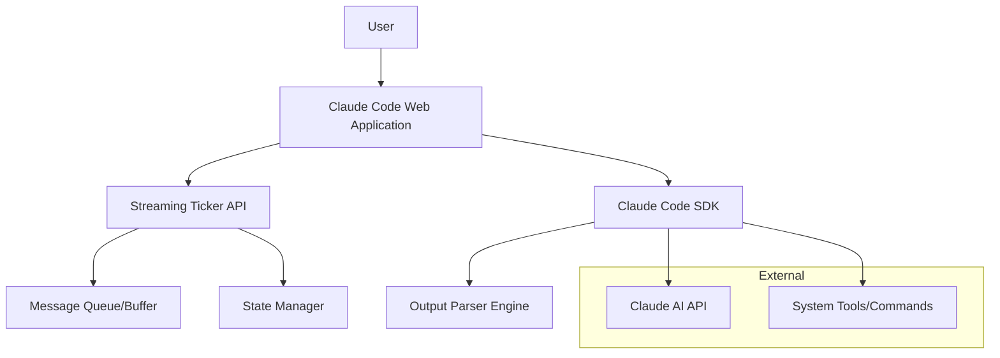
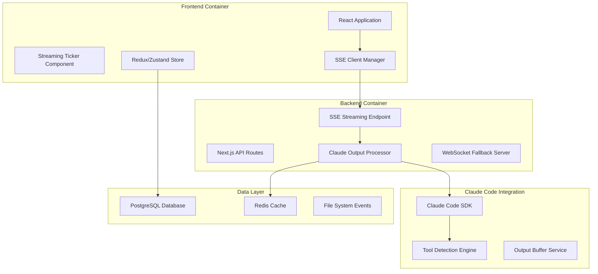
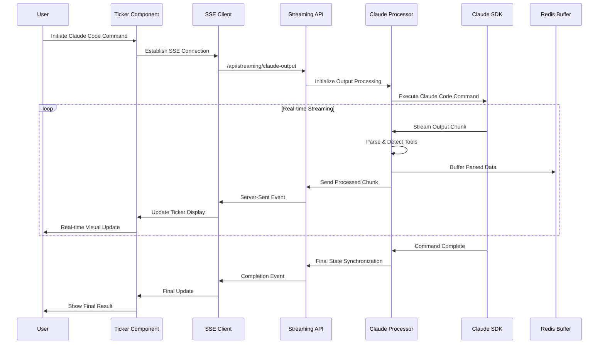
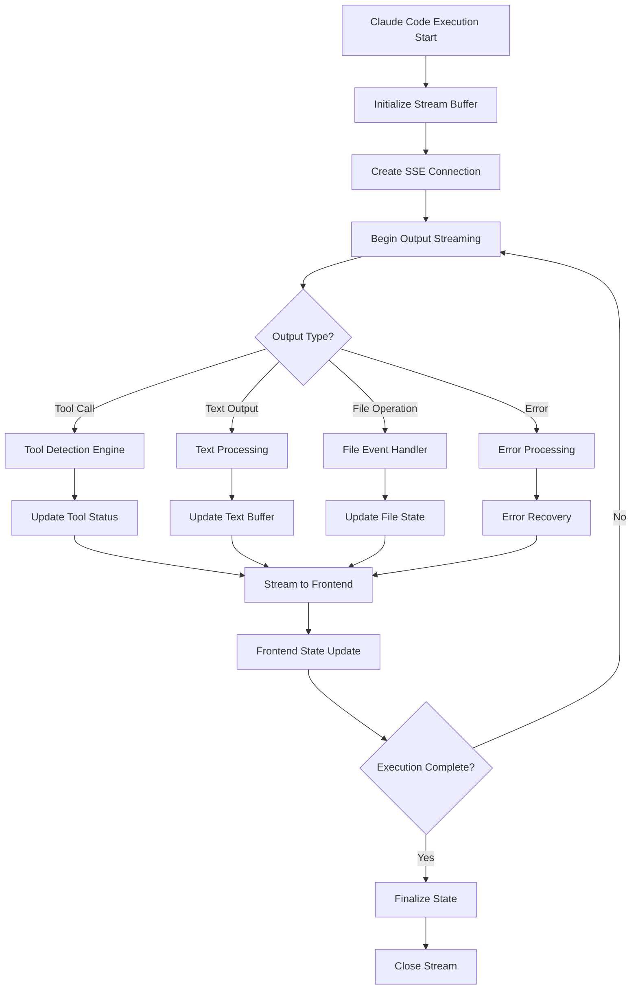

# Claude Code Streaming Ticker - System Architecture

## 1. Architecture Overview

### System Context (C4 Level 1)


### Container Diagram (C4 Level 2)


## 2. Component Architecture

### Frontend Components Structure
```
src/
├── components/
│   ├── streaming-ticker/
│   │   ├── StreamingTicker.tsx
│   │   ├── TickerMessage.tsx
│   │   ├── ToolExecutionIndicator.tsx
│   │   ├── ConnectionStatus.tsx
│   │   └── index.ts
│   ├── claude-output/
│   │   ├── OutputParser.tsx
│   │   ├── ToolCallVisualization.tsx
│   │   ├── ProgressIndicator.tsx
│   │   └── index.ts
│   └── error-boundaries/
│       ├── StreamingErrorBoundary.tsx
│       └── ConnectionErrorBoundary.tsx
├── services/
│   ├── streaming/
│   │   ├── SSEConnectionManager.ts
│   │   ├── WebSocketFallbackManager.ts
│   │   ├── StreamingStateManager.ts
│   │   └── index.ts
│   ├── claude-integration/
│   │   ├── ClaudeOutputParser.ts
│   │   ├── ToolDetectionService.ts
│   │   ├── ResponseSynchronizer.ts
│   │   └── index.ts
│   └── error-recovery/
│       ├── ConnectionRecovery.ts
│       ├── StateRecovery.ts
│       └── index.ts
├── hooks/
│   ├── useStreamingTicker.ts
│   ├── useClaudeOutput.ts
│   ├── useConnectionManager.ts
│   └── useErrorRecovery.ts
└── types/
    ├── streaming.ts
    ├── claude-output.ts
    └── error-handling.ts
```

### Backend API Structure
```
backend/
├── api/
│   ├── streaming/
│   │   ├── sse-endpoint.ts
│   │   ├── websocket-handler.ts
│   │   └── stream-manager.ts
│   ├── claude-integration/
│   │   ├── output-processor.ts
│   │   ├── tool-detector.ts
│   │   └── response-coordinator.ts
│   └── health/
│       ├── connection-health.ts
│       └── system-status.ts
├── services/
│   ├── streaming/
│   │   ├── SSEStreamManager.ts
│   │   ├── MessageBuffer.ts
│   │   └── StateCoordinator.ts
│   ├── claude/
│   │   ├── OutputParsingEngine.ts
│   │   ├── ToolExecutionTracker.ts
│   │   └── ResponseSynchronizer.ts
│   └── monitoring/
│       ├── PerformanceMonitor.ts
│       ├── ErrorTracker.ts
│       └── MetricsCollector.ts
└── middleware/
    ├── auth/
    │   ├── session-validation.ts
    │   └── rate-limiting.ts
    ├── streaming/
    │   ├── connection-upgrade.ts
    │   └── cors-handling.ts
    └── error-handling/
        ├── stream-error-handler.ts
        └── graceful-degradation.ts
```

## 3. Data Flow Architecture

### Streaming Data Flow


### State Synchronization Flow


## 4. API Specifications

### SSE Streaming Endpoint
```typescript
// GET /api/streaming/claude-output
interface SSEStreamingEndpoint {
  // Request Parameters
  params: {
    sessionId: string;
    commandId: string;
    streamType: 'full' | 'tools-only' | 'text-only';
  };

  // Response Stream Events
  events: {
    'message': {
      type: 'text' | 'tool-call' | 'file-op' | 'error';
      data: ClaudeOutputChunk;
      timestamp: number;
      sequence: number;
    };
    'tool-start': {
      toolName: string;
      parameters: any;
      timestamp: number;
    };
    'tool-complete': {
      toolName: string;
      result: any;
      duration: number;
    };
    'error': {
      error: StreamingError;
      recoverable: boolean;
    };
    'complete': {
      finalState: FinalExecutionState;
      metrics: ExecutionMetrics;
    };
  };
}

interface ClaudeOutputChunk {
  id: string;
  type: 'text' | 'tool-call' | 'file-operation' | 'system';
  content: string;
  metadata: {
    toolName?: string;
    fileName?: string;
    lineNumber?: number;
    confidence: number;
  };
  state: 'streaming' | 'complete' | 'error';
}
```

### WebSocket Fallback API
```typescript
// WebSocket /ws/claude-streaming
interface WebSocketStreamingAPI {
  // Client → Server Messages
  clientMessages: {
    'subscribe': {
      sessionId: string;
      streamTypes: string[];
    };
    'unsubscribe': {
      sessionId: string;
    };
    'ping': {
      timestamp: number;
    };
  };

  // Server → Client Messages
  serverMessages: {
    'chunk': ClaudeOutputChunk;
    'status': {
      connected: boolean;
      sessionActive: boolean;
      queueSize: number;
    };
    'pong': {
      timestamp: number;
      latency: number;
    };
  };
}
```

### Tool Detection API
```typescript
interface ToolDetectionEngine {
  detectTool(output: string): ToolDetectionResult;
  parseToolCall(toolCall: string): ParsedToolCall;
  trackExecution(toolId: string): ToolExecutionTracker;
}

interface ToolDetectionResult {
  detected: boolean;
  toolName: string;
  confidence: number;
  parameters: Record<string, any>;
  expectedDuration?: number;
}

interface ParsedToolCall {
  name: string;
  parameters: any;
  callId: string;
  timestamp: number;
  context: {
    precedingText: string;
    followingText: string;
  };
}
```

## 5. WebSocket vs SSE Analysis

### Technology Comparison Matrix

| Aspect | Server-Sent Events (SSE) | WebSocket | Recommendation |
|--------|-------------------------|-----------|----------------|
| **Complexity** | Low - HTTP-based | Medium - Custom protocol | **SSE** for simplicity |
| **Browser Support** | Excellent (IE10+) | Excellent (IE10+) | Tie |
| **Automatic Reconnection** | Built-in | Manual implementation | **SSE** advantage |
| **Bidirectional** | No (HTTP only) | Yes | WebSocket for 2-way |
| **HTTP/2 Compatibility** | Excellent | Limited | **SSE** advantage |
| **Proxy/Firewall** | Excellent | Can be blocked | **SSE** advantage |
| **Resource Usage** | Lower | Higher | **SSE** advantage |
| **Real-time Performance** | Good (sub-second) | Excellent (milliseconds) | WebSocket for real-time |

### Architecture Decision: Hybrid Approach

**Primary: SSE for Claude Code Streaming**
- Reasons:
  - Claude Code output is unidirectional (server → client)
  - Built-in reconnection handles network interruptions
  - Simpler implementation and debugging
  - Better enterprise firewall compatibility
  - HTTP/2 multiplexing benefits

**Fallback: WebSocket for Enhanced Features**
- Use cases:
  - Bidirectional communication needed
  - Sub-100ms latency requirements
  - Client needs to send commands during streaming
  - Advanced real-time collaboration features

### Implementation Strategy
```typescript
class HybridStreamingManager {
  private sseConnection: SSEConnection;
  private wsConnection: WebSocketConnection;
  private activeTransport: 'sse' | 'websocket';

  constructor(config: StreamingConfig) {
    this.activeTransport = config.preferSSE ? 'sse' : 'websocket';
    this.initializeConnections();
  }

  private async initializeConnections() {
    // Try SSE first
    try {
      await this.establishSSE();
      this.activeTransport = 'sse';
    } catch (error) {
      // Fallback to WebSocket
      await this.establishWebSocket();
      this.activeTransport = 'websocket';
    }
  }

  public switchTransport(transport: 'sse' | 'websocket') {
    // Graceful transport switching
    this.gracefulSwitchover(transport);
  }
}
```

## 6. Security Considerations

### Authentication & Authorization
```typescript
interface SecurityLayer {
  // Session-based authentication
  sessionValidation: {
    validateSession(sessionId: string): boolean;
    refreshSession(sessionId: string): string;
    revokeSession(sessionId: string): void;
  };

  // Rate limiting
  rateLimiting: {
    ipBasedLimiting: '100 requests/minute';
    sessionBasedLimiting: '10 streams/session';
    globalLimiting: '1000 concurrent streams';
  };

  // Content security
  outputSanitization: {
    sanitizeClaudeOutput(output: string): string;
    validateToolCalls(toolCall: ToolCall): boolean;
    filterSensitiveData(data: any): any;
  };
}
```

### Data Protection Patterns
```typescript
interface DataProtection {
  // Encryption
  encryption: {
    streamEncryption: 'TLS 1.3';
    dataAtRest: 'AES-256-GCM';
    keyRotation: '30 days';
  };

  // Privacy
  privacy: {
    dataRetention: '7 days for debugging';
    piiDetection: 'Automatic PII filtering';
    auditLogging: 'All stream access logged';
  };

  // Access control
  accessControl: {
    principleOfLeastPrivilege: true;
    streamIsolation: 'Per-session isolation';
    resourceLimits: 'Memory and CPU caps';
  };
}
```

## 7. Performance Optimization Patterns

### Frontend Optimization
```typescript
interface FrontendOptimization {
  // Virtual scrolling for large outputs
  virtualScrolling: {
    windowSize: 100; // Show 100 items
    bufferSize: 20;  // Buffer 20 items
    recycling: true; // Recycle DOM elements
  };

  // Throttling and debouncing
  throttling: {
    uiUpdates: '60fps'; // Max 60 updates/second
    stateUpdates: '10fps'; // State updates throttled
    networkUpdates: '100ms'; // Batch network calls
  };

  // Memory management
  memoryManagement: {
    maxBufferSize: '10MB';
    autoCleanup: '5 minutes idle';
    weakReferences: 'Event handlers';
  };
}
```

### Backend Optimization
```typescript
interface BackendOptimization {
  // Stream buffering
  buffering: {
    chunkSize: '4KB';
    flushInterval: '50ms';
    backpressureHandling: 'Circuit breaker';
  };

  // Connection pooling
  connectionPooling: {
    maxConnections: 1000;
    connectionReuse: true;
    keepAliveTimeout: '60s';
  };

  // Caching strategy
  caching: {
    responseCache: 'Redis TTL 5min';
    sessionCache: 'In-memory LRU';
    staticAssets: 'CDN + browser cache';
  };
}
```

### Scalability Patterns
```typescript
interface ScalabilityPatterns {
  // Horizontal scaling
  horizontalScaling: {
    loadBalancer: 'Round-robin with sticky sessions';
    autoScaling: 'CPU > 70% triggers scale-up';
    maxInstances: 10;
  };

  // Database scaling
  databaseScaling: {
    readReplicas: 3;
    sharding: 'By session_id';
    cachingLayer: 'Redis cluster';
  };

  // CDN and edge optimization
  edgeOptimization: {
    staticAssets: 'Global CDN';
    apiResponses: 'Edge caching 1min';
    geoDistribution: 'Multi-region deployment';
  };
}
```

## 8. Error Recovery & Connection Management

### Error Recovery Strategy
```typescript
interface ErrorRecoveryStrategy {
  // Connection errors
  connectionErrors: {
    retryPolicy: 'Exponential backoff';
    maxRetries: 5;
    baseDelay: '1s';
    maxDelay: '30s';
  };

  // Stream interruption
  streamInterruption: {
    bufferRecovery: 'Resume from last checkpoint';
    stateReconstruction: 'Replay from sequence number';
    gracefulDegradation: 'Fallback to polling';
  };

  // Data corruption
  dataCorruption: {
    checksumValidation: 'Message integrity checks';
    duplicateDetection: 'Sequence-based deduplication';
    orderingGuarantees: 'Client-side reordering';
  };
}
```

### Connection Health Monitoring
```typescript
interface ConnectionHealthMonitoring {
  // Health checks
  healthChecks: {
    pingInterval: '30s';
    timeoutThreshold: '5s';
    consecutiveFailures: 3;
  };

  // Performance monitoring
  performanceMonitoring: {
    latencyTracking: 'P95 < 100ms';
    throughputMonitoring: 'Messages/second';
    errorRateThreshold: '< 1%';
  };

  // Alerting
  alerting: {
    connectionFailures: 'Immediate alert';
    performanceDegradation: '5min delay';
    errorSpikes: 'Real-time monitoring';
  };
}
```

## 9. Implementation Phases

### Phase 1: Core Streaming Infrastructure (Week 1-2)
- [ ] SSE endpoint implementation
- [ ] Basic Claude Code output parsing
- [ ] Frontend ticker component
- [ ] Simple error handling

### Phase 2: Advanced Features (Week 3-4)
- [ ] Tool detection and visualization
- [ ] WebSocket fallback implementation
- [ ] State synchronization
- [ ] Connection recovery

### Phase 3: Performance & Security (Week 5-6)
- [ ] Performance optimization
- [ ] Security implementation
- [ ] Comprehensive error recovery
- [ ] Monitoring and alerting

### Phase 4: Testing & Polish (Week 7-8)
- [ ] Load testing
- [ ] Security testing
- [ ] User experience refinement
- [ ] Documentation completion

## 10. Success Metrics

### Technical Metrics
- **Latency**: < 100ms for stream updates
- **Throughput**: > 1000 concurrent streams
- **Reliability**: 99.9% uptime
- **Recovery**: < 5s reconnection time

### User Experience Metrics
- **Perceived Performance**: Real-time updates feel instant
- **Reliability**: No dropped messages
- **Usability**: Intuitive progress indication
- **Accessibility**: Screen reader compatible

### Business Metrics
- **Adoption**: 80% of users enable streaming
- **Engagement**: 30% increase in session duration
- **Satisfaction**: > 4.5/5 user rating
- **Performance**: 25% reduction in perceived wait time

---

This architecture provides a comprehensive foundation for implementing a robust, scalable, and user-friendly Claude Code streaming ticker system.