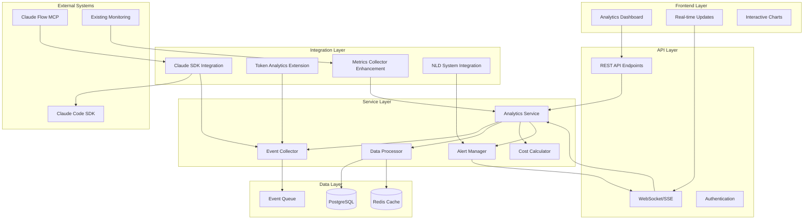

# Claude Code SDK Cost Tracking Analytics - Architecture Documentation

## Overview

This directory contains the comprehensive architecture design for a scalable Claude Code SDK cost tracking analytics system. The architecture focuses on real-time monitoring, cost optimization, and seamless integration with existing infrastructure.

## Architecture Components

### 📊 [01. Data Models](./01-data-models.ts)
Comprehensive data models for usage tracking, including:
- **Core Tracking Models**: `SDKUsageEvent`, error tracking, and warnings
- **Aggregated Analytics**: Usage analytics, performance metrics, and cost analysis
- **Real-time Streaming**: Live metrics and regional activity
- **Alerting Models**: Alert management and optimization recommendations

### 🏗️ [02. Service Architecture](./02-service-architecture.ts)
Service layer design for SDK integration:
- **Core Services**: Analytics service, event collector, data processor
- **SDK Integration**: Non-invasive decorator pattern for Claude SDK
- **Cost Calculation**: Intelligent cost calculation and projections
- **Real-time Processing**: Stream processing pipeline

### 🗄️ [03. Database Schema](./03-database-schema.sql)
Scalable PostgreSQL database design:
- **Partitioned Tables**: Time-based partitioning for performance
- **Optimized Indexes**: Composite and partial indexes for query optimization
- **Materialized Views**: Pre-aggregated analytics for fast queries
- **Data Retention**: Automated cleanup and archival policies

### 🔌 [04. API Endpoints](./04-api-endpoints.ts)
RESTful API design for analytics dashboard:
- **Usage Analytics**: Comprehensive usage metrics and trends
- **Cost Analytics**: Cost breakdown and projections
- **Real-time Monitoring**: Live metrics and Server-Sent Events
- **User Analytics**: Per-user usage and cost analysis

### ⚛️ [05. Dashboard Components](./05-dashboard-components.tsx)
React component hierarchy for analytics UI:
- **Dashboard Layout**: Main dashboard with tab navigation
- **Real-time Updates**: WebSocket integration for live data
- **Interactive Charts**: Recharts-based visualizations
- **Performance Optimized**: Memoization and virtualization

### 🗂️ [06. State Management](./06-state-management.ts)
Redux Toolkit + React Query pattern:
- **Redux Slices**: Analytics, dashboard, alerts, and real-time state
- **Async Thunks**: Data fetching with error handling
- **Selectors**: Optimized data selection with reselect
- **Custom Hooks**: Reusable data fetching patterns

### ⚡ [07. Performance Optimization](./07-performance-optimization.ts)
Multi-layer optimization strategies:
- **Database Optimizations**: Indexing, partitioning, and caching
- **Application Optimizations**: Query optimization and connection pooling
- **Frontend Optimizations**: Code splitting and virtualization
- **Real-time Optimizations**: Stream processing and buffering

### 🔗 [08. Integration Patterns](./08-integration-patterns.ts)
Integration with existing systems:
- **Current Analytics**: Token analytics and metrics collector extension
- **Claude Flow MCP**: Swarm coordination and neural system integration
- **Data Pipeline**: WebSocket and database integration
- **Frontend Integration**: React and testing framework integration

### 📋 [09. Architecture Decisions](./09-architecture-decisions.md)
Architecture Decision Records (ADRs):
- **ADR-001**: Data model design rationale
- **ADR-002**: Service layer architecture pattern
- **ADR-003**: Database schema and storage strategy
- **ADR-004**: Real-time processing pipeline
- **ADR-005**: Frontend state management pattern

## Key Architectural Principles

### 🎯 **Scalability First**
- Time-based database partitioning for unlimited growth
- Horizontal scaling with read replicas and caching
- Auto-scaling real-time processing pipeline
- CDN integration for global performance

### 🔄 **Real-time Responsiveness**
- Sub-second latency for critical metrics
- WebSocket/SSE streaming for live updates
- Event-driven architecture for immediate processing
- Intelligent buffering and backpressure handling

### 🧩 **Seamless Integration**
- Non-invasive decorator pattern for SDK integration
- Extension of existing token analytics system
- Leverage current WebSocket and metrics infrastructure
- Gradual migration strategy to minimize disruption

### 📈 **Cost Optimization Focus**
- ML-powered cost prediction and recommendations
- Real-time cost tracking with threshold alerting
- Usage pattern analysis for optimization opportunities
- ROI analysis for cost reduction initiatives

### 🛡️ **Production Ready**
- Comprehensive error handling and circuit breakers
- Security-first design with RBAC and audit logging
- Monitoring and observability at every layer
- Automated testing and deployment pipelines

## System Architecture Diagram



## Technology Stack

### **Backend**
- **Runtime**: Node.js with TypeScript
- **Database**: PostgreSQL with time-based partitioning
- **Caching**: Redis for multi-level caching
- **Message Queue**: Redis Streams for event processing
- **Monitoring**: Prometheus + Grafana integration

### **Frontend**
- **Framework**: React 18 with TypeScript
- **State Management**: Redux Toolkit + React Query
- **UI Components**: Radix UI + Tailwind CSS
- **Charts**: Recharts with custom optimizations
- **Real-time**: WebSocket/SSE integration

### **Integration**
- **Claude SDK**: Decorator pattern integration
- **Existing Systems**: Extension of current analytics
- **Claude Flow**: MCP tool integration
- **Monitoring**: Existing Prometheus/Grafana setup

## Performance Characteristics

### **Throughput**
- **Event Ingestion**: 10,000+ events/second
- **Query Performance**: Sub-100ms for dashboard queries
- **Real-time Updates**: <500ms end-to-end latency
- **Concurrent Users**: 1,000+ simultaneous dashboard users

### **Scalability**
- **Data Volume**: Petabyte-scale historical data
- **Time Range**: 2+ years of granular data retention
- **Geographic**: Multi-region deployment support
- **Growth**: 10x growth capacity with current architecture

### **Reliability**
- **Uptime**: 99.9% availability target
- **Data Durability**: ACID compliance for financial data
- **Error Recovery**: Automatic retry and dead letter queues
- **Monitoring**: Comprehensive observability at every layer

## Getting Started

### **Implementation Phases**

1. **Phase 1: Core Foundation** (2 weeks)
   - Implement data models and database schema
   - Create basic SDK integration decorator
   - Set up event collection pipeline

2. **Phase 2: Real-time Analytics** (2 weeks)
   - Implement real-time processing pipeline
   - Create basic dashboard components
   - Add WebSocket integration

3. **Phase 3: Advanced Features** (3 weeks)
   - Add cost optimization recommendations
   - Implement ML-based predictions
   - Create comprehensive alerting system

4. **Phase 4: Integration & Polish** (2 weeks)
   - Complete existing system integration
   - Performance optimization and testing
   - Documentation and deployment

### **Development Setup**

1. **Prerequisites**
   ```bash
   # Node.js 18+, PostgreSQL 14+, Redis 6+
   npm install
   ```

2. **Database Setup**
   ```sql
   -- Run schema from 03-database-schema.sql
   CREATE DATABASE claude_sdk_analytics;
   ```

3. **Environment Configuration**
   ```env
   DATABASE_URL=postgresql://localhost:5432/claude_sdk_analytics
   REDIS_URL=redis://localhost:6379
   CLAUDE_API_KEY=your_api_key_here
   ```

4. **Start Development**
   ```bash
   npm run dev
   ```

## Contributing

This architecture is designed to be:
- **Modular**: Each component can be developed independently
- **Testable**: Comprehensive testing at every layer
- **Documented**: Clear interfaces and implementation guides
- **Extensible**: Easy to add new features and integrations

See individual component files for detailed implementation guidelines and examples.

## Support

For questions about this architecture:
- **Technical Details**: See component-specific documentation
- **Integration Questions**: Check integration patterns guide
- **Performance Concerns**: Review optimization strategies
- **Implementation Help**: Follow getting started guide

---

*This architecture represents a production-ready, scalable solution for Claude Code SDK cost tracking analytics with seamless integration into existing infrastructure.*