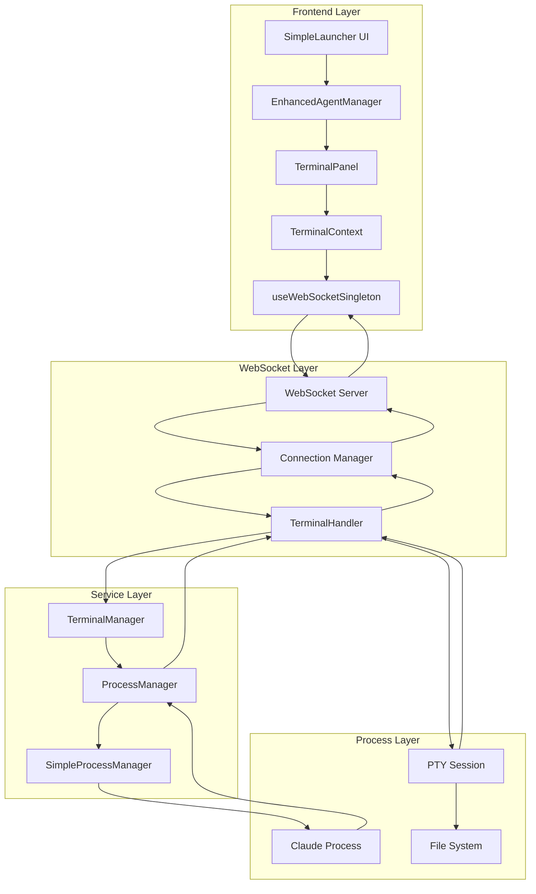
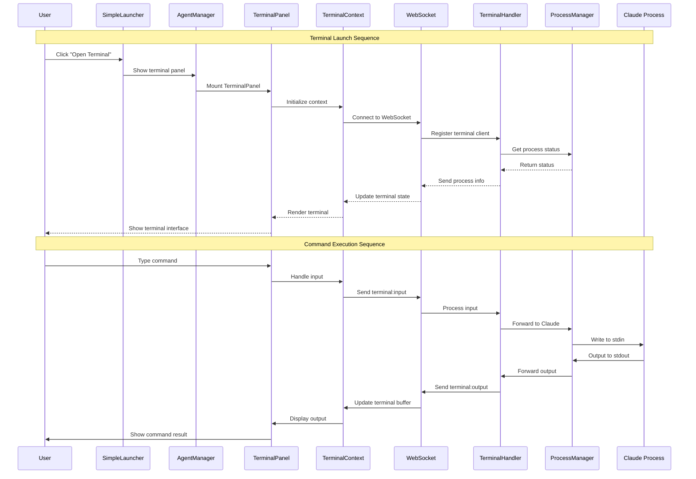
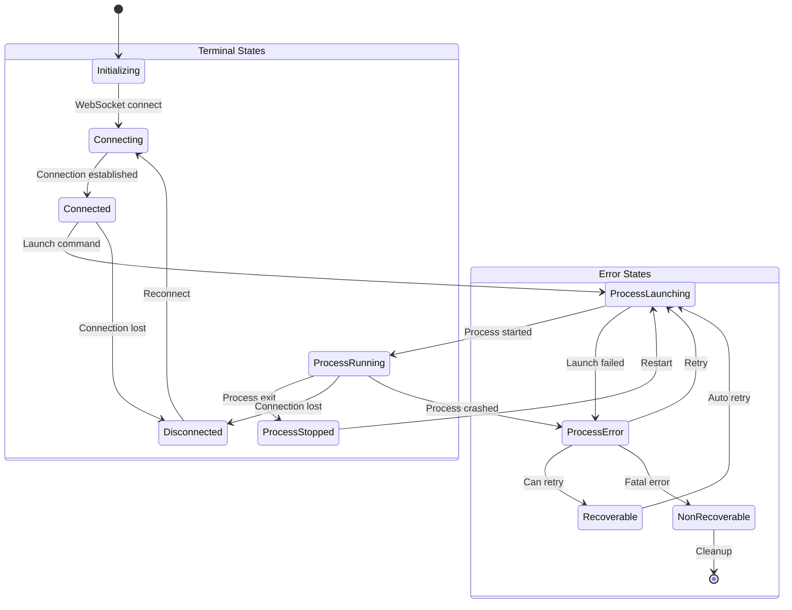
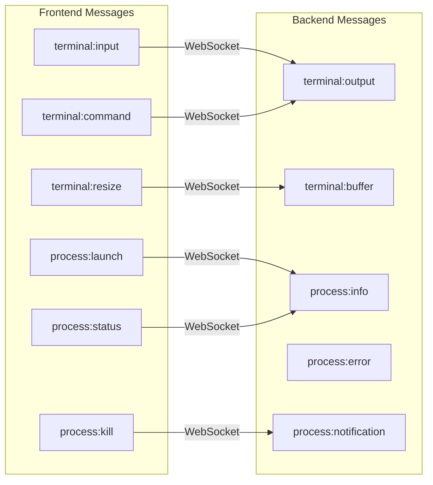
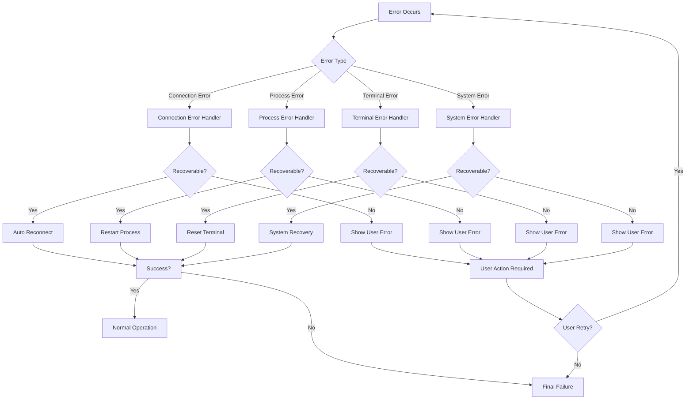
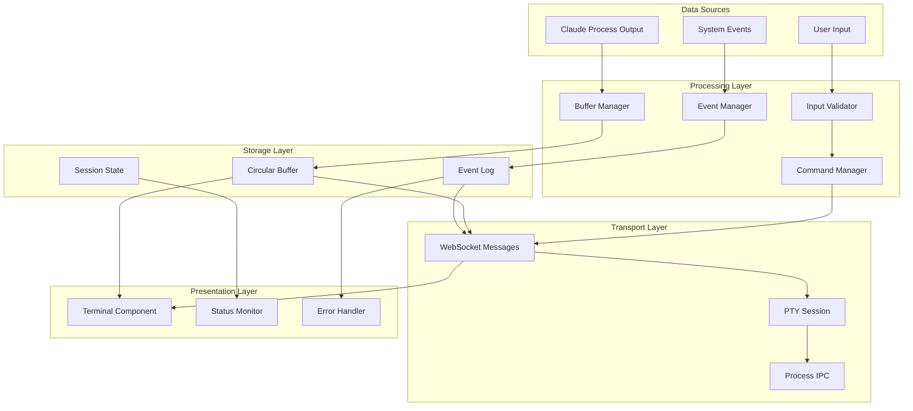
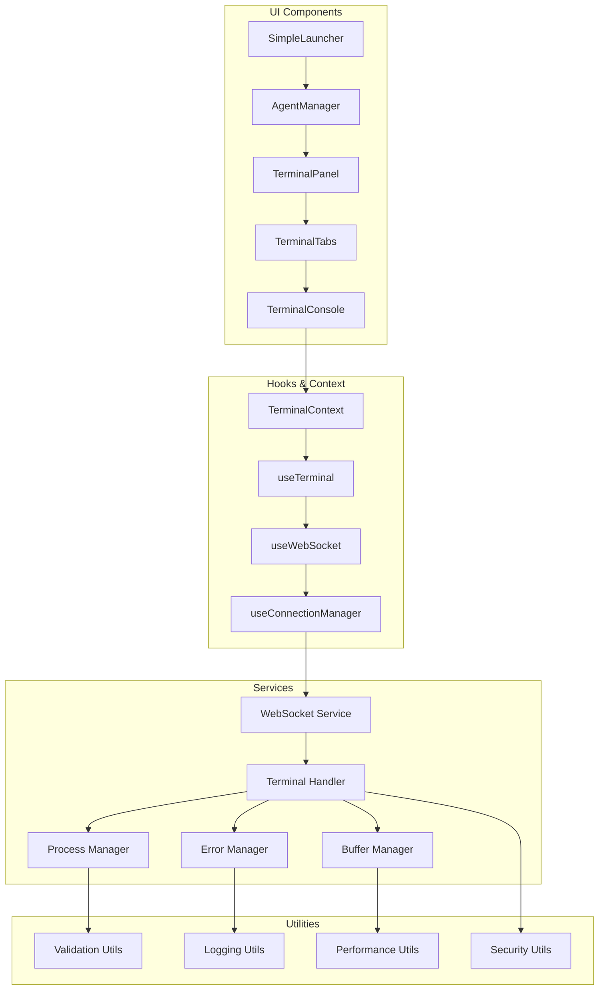

# Terminal Integration - Component Interaction Diagrams

## System Overview Diagram



## Component Interaction Flow Diagram



## State Management Interaction



## WebSocket Message Flow



## Error Handling Flow



## Data Flow Architecture



## Component Dependency Graph



## Integration Points Matrix

| Component | Integrates With | Interface Type | Data Flow |
|-----------|-----------------|----------------|-----------|
| SimpleLauncher | AgentManager | React Props | UI State |
| AgentManager | TerminalPanel | React Props | Terminal Toggle |
| TerminalPanel | TerminalContext | Context API | Terminal State |
| TerminalContext | useWebSocket | Hook | Connection State |
| useWebSocket | WebSocket Service | Function Calls | Message Passing |
| WebSocket Service | Terminal Handler | Socket Events | Bidirectional |
| Terminal Handler | Process Manager | Event Emitter | Process Events |
| Process Manager | Claude Process | Child Process | stdio Pipes |
| Terminal Handler | PTY Session | node-pty API | Terminal I/O |

## Performance Characteristics

### Latency Requirements
- **User Input Response**: < 50ms
- **Process Output Display**: < 100ms  
- **Connection Establishment**: < 2s
- **Reconnection Time**: < 5s

### Throughput Requirements
- **Terminal Output**: 10MB/s sustained
- **Concurrent Sessions**: 100 sessions
- **Message Rate**: 1000 msg/s per session
- **Buffer Capacity**: 1000 lines per session

### Resource Limits
- **Memory per Session**: < 100MB
- **CPU per Session**: < 5%
- **File Descriptors**: < 10 per session
- **Network Bandwidth**: < 1Mbps per session

## Security Boundaries

```mermaid
graph TB
    subgraph "Trusted Zone"
        UI[UI Components]
        WS[WebSocket Client]
        TC[Terminal Context]
    end
    
    subgraph "Validation Layer"
        IV[Input Validator]
        AV[Auth Validator]
        CV[Command Validator]
    end
    
    subgraph "Secure Zone"
        TH[Terminal Handler]
        PM[Process Manager]
        FS[File System]
    end
    
    subgraph "System Zone"
        OS[Operating System]
        CP[Claude Process]
        NET[Network]
    end
    
    UI -.->|HTTPS| AV
    WS -.->|WSS| IV
    TC -.->|Validated| CV
    
    IV --> TH
    AV --> TH
    CV --> PM
    
    TH -.->|Restricted| FS
    PM -.->|Controlled| CP
    CP -.->|Limited| OS
    
    style "Validation Layer" fill:#ffeb3b
    style "Secure Zone" fill:#4caf50
    style "System Zone" fill:#f44336
```

## Monitoring and Observability

### Metrics Collection Points
- **UI Interactions**: Button clicks, input events
- **WebSocket Messages**: Send/receive rates, error counts
- **Process Events**: Start/stop/restart events
- **Performance Metrics**: Latency, throughput, resource usage
- **Error Events**: Connection failures, process crashes

### Health Check Endpoints
- **WebSocket Health**: `/health/websocket`
- **Process Health**: `/health/process`
- **Terminal Health**: `/health/terminal`
- **Overall Health**: `/health/overall`

### Alerting Thresholds
- **High Error Rate**: > 5% errors in 5 minutes
- **High Latency**: > 500ms average response time
- **Resource Usage**: > 80% memory/CPU utilization
- **Connection Failures**: > 10 failures in 1 minute

This comprehensive set of component interaction diagrams provides a detailed view of how the terminal integration will work within the existing SimpleLauncher architecture, ensuring all stakeholders understand the relationships, data flows, and integration points.